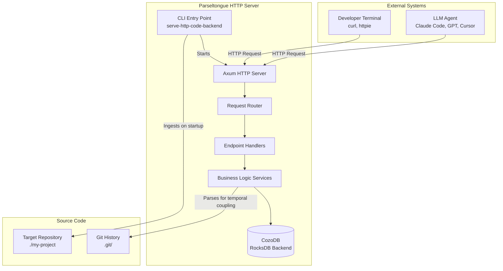
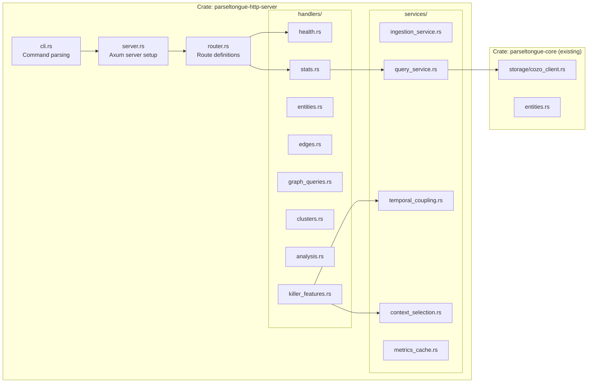
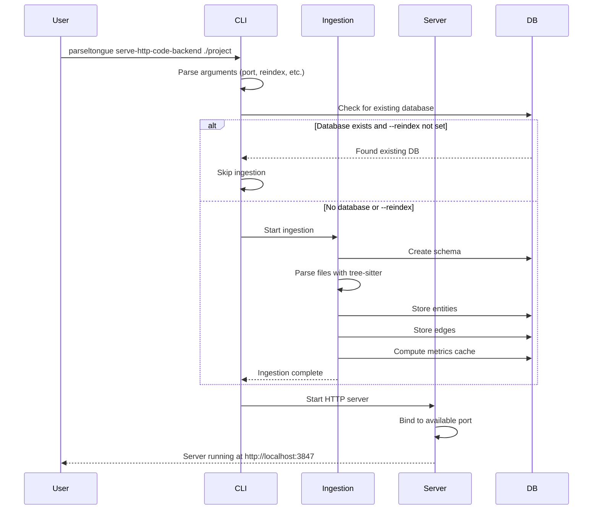
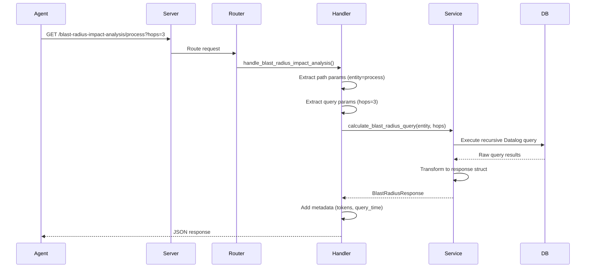

# Parseltongue HTTP Server - Architecture & TDD Implementation Plan

**Version**: 1.0.1
**Status**: Draft
**Last Updated**: 2025-11-28
**Companion PRD**: [prd01.md](./prd01.md)

---

## Executive Summary

This document provides the High-Level Design (HLD), Low-Level Design (LLD), and TDD implementation plan for the Parseltongue HTTP Server. The server exposes the existing CozoDB graph database via HTTP endpoints, enabling any LLM agent to query codebase architecture without file-based JSON exports.

**Core Insight**: This is a **database-to-HTTP bridge** - not a new system. We expose existing CozoDB operations as HTTP endpoints and add two "killer features" that combine multiple data sources.

---

## Table of Contents

1. [High-Level Design (HLD)](#high-level-design-hld)
2. [Low-Level Design (LLD)](#low-level-design-lld)
3. [Database Schema Extensions](#database-schema-extensions)
4. [Reusable Components Analysis](#reusable-components-analysis)
5. [TDD Implementation Plan](#tdd-implementation-plan)
6. [Test Specifications](#test-specifications)

---

## High-Level Design (HLD)

### System Context Diagram



### Component Architecture



### Data Flow: Startup Sequence



### Data Flow: Query Request



---

## Low-Level Design (LLD)

### Crate Structure

```
crates/parseltongue-http-server/
├── Cargo.toml
├── src/
│   ├── lib.rs
│   ├── main.rs                          # Binary entry point
│   ├── cli.rs                           # CLI parsing (4-word: HttpServerStartupConfig)
│   ├── server.rs                        # Axum server setup (4-word: SharedApplicationStateContainer)
│   ├── router.rs                        # Route definitions (4-word: build_complete_router_instance)
│   ├── errors.rs                        # Error types
│   ├── handlers/
│   │   ├── mod.rs
│   │   ├── health.rs                    # /server-health-check-status
│   │   ├── stats.rs                     # /codebase-statistics-overview-summary
│   │   ├── entities.rs                  # /code-entities-*, /fuzzy-entity-search-query
│   │   ├── edges.rs                     # /dependency-edges-list-all
│   │   ├── graph_queries.rs             # /reverse-callers-*, /forward-callees-*, /blast-radius-*, /circular-dependency-*
│   │   ├── analysis.rs                  # /complexity-hotspots-*, /semantic-cluster-*, /orphan-*, etc.
│   │   ├── killer_features.rs           # /temporal-coupling-*, /smart-context-*
│   │   └── help.rs                      # /api-reference-documentation-help
│   ├── services/
│   │   ├── mod.rs
│   │   ├── query_service.rs             # Database query execution
│   │   ├── ingestion_service.rs         # Codebase ingestion
│   │   ├── temporal_coupling.rs         # KILLER #1: Git log analysis
│   │   ├── context_selection.rs         # KILLER #2: Token-budget context
│   │   └── metrics_cache.rs             # Pre-computation
│   └── schema/
│       └── mod.rs                       # Database schema extensions
├── tests/
│   ├── integration_tests.rs
│   └── performance_tests.rs
└── README.md
```

### Module Specifications (4-Word Naming Convention)

#### `cli.rs` - Command Line Interface

```rust
/// Configuration for HTTP server startup
///
/// # 4-Word Name: HttpServerStartupConfig
pub struct HttpServerStartupConfig {
    pub target_directory_path: std::path::PathBuf,
    pub database_connection_string: String,
    pub http_port_override_option: Option<u16>,
    pub force_reindex_enabled_flag: bool,
    pub daemon_background_mode_flag: bool,
    pub idle_timeout_minutes_option: Option<u32>,
    pub verbose_logging_enabled_flag: bool,
}

/// # 4-Word Name: parse_cli_arguments_config
pub fn parse_cli_arguments_config(
    args: impl Iterator<Item = String>
) -> Result<HttpServerStartupConfig, CliParseError>;

/// # 4-Word Name: find_available_port_number
pub fn find_available_port_number(
    starting_port: u16
) -> Result<u16, PortDetectionError>;
```

#### `server.rs` - HTTP Server Setup

```rust
/// # 4-Word Name: SharedApplicationStateContainer
pub struct SharedApplicationStateContainer {
    pub database_storage_connection: Arc<parseltongue_core::storage::CozoDbStorage>,
    pub server_start_timestamp_utc: chrono::DateTime<chrono::Utc>,
    pub last_request_timestamp_utc: Arc<RwLock<chrono::DateTime<chrono::Utc>>>,
    pub codebase_statistics_metadata: CodebaseStatisticsMetadata,
}

/// # 4-Word Name: CodebaseStatisticsMetadata
pub struct CodebaseStatisticsMetadata {
    pub total_code_entities_count: usize,
    pub total_test_entities_count: usize,
    pub total_dependency_edges_count: usize,
    pub languages_detected_list_vec: Vec<String>,
    pub database_file_path_string: String,
    pub ingestion_timestamp_utc: chrono::DateTime<chrono::Utc>,
}

/// # 4-Word Name: create_http_server_router
pub fn create_http_server_router(
    state: SharedApplicationStateContainer
) -> Router;

/// # 4-Word Name: start_server_blocking_loop
pub async fn start_server_blocking_loop(
    router: Router,
    port: u16,
    idle_timeout: Option<std::time::Duration>,
) -> Result<(), ServerError>;
```

#### `router.rs` - Route Definitions

```rust
/// # 4-Word Name: build_complete_router_instance
///
/// ## Core Endpoints
/// - GET /server-health-check-status
/// - GET /codebase-statistics-overview-summary
/// - GET /api-reference-documentation-help
///
/// ## Entity Endpoints
/// - GET /code-entities-list-all
/// - GET /code-entity-detail-view/{key}
/// - GET /fuzzy-entity-search-query?q=pattern
///
/// ## Edge Endpoints
/// - GET /dependency-edges-list-all
/// - GET /reverse-callers-query-graph/{entity}
/// - GET /forward-callees-query-graph/{entity}
///
/// ## Analysis Endpoints
/// - GET /blast-radius-impact-analysis/{entity}?hops=N
/// - GET /circular-dependency-detection-scan
/// - GET /complexity-hotspots-ranking-view?top=N
/// - GET /semantic-cluster-grouping-list
/// - GET /semantic-cluster-detail-view/{id}
/// - GET /orphan-dead-code-detection
/// - GET /package-file-structure-graph
/// - GET /entity-complexity-metrics-cache
/// - GET /module-cohesion-quality-score
/// - GET /critical-control-flow-paths
///
/// ## Killer Features
/// - GET /temporal-coupling-hidden-deps/{entity}
/// - GET /smart-context-token-budget?focus=X&tokens=N
pub fn build_complete_router_instance(
    state: SharedApplicationStateContainer
) -> Router;
```

### Killer Feature #1: Temporal Coupling Detection (~1200 LOC)

**What it reveals**: The INVISIBLE architecture - files that change together but have ZERO code dependency.

```rust
/// # 4-Word Name: TemporalCouplingAnalysisService
pub struct TemporalCouplingAnalysisService {
    repo_root: std::path::PathBuf,
    cache: tokio::sync::RwLock<HashMap<String, CachedCouplingResult>>,
}

impl TemporalCouplingAnalysisService {
    /// # 4-Word Name: analyze_temporal_coupling_file
    ///
    /// # Contract
    /// - Precondition: Git repo exists at repo_root
    /// - Postcondition: Returns files that co-change with target
    /// - Performance: <500ms for 10k commits
    /// - Caching: Results cached for 5 minutes
    ///
    /// # Algorithm
    /// 1. Run `git log --name-only --pretty=format:"%H" --since="6 months ago"`
    /// 2. Parse commit boundaries
    /// 3. Build co-occurrence matrix
    /// 4. Normalize to coupling scores
    pub async fn analyze_temporal_coupling_file(
        &self,
        target_file: &str,
        days_window: u32,
    ) -> Result<TemporalCouplingResult, TemporalCouplingError>;
}
```

### Killer Feature #2: Dynamic Context Selection (~1500 LOC)

**The culmination**: Token-budget-aware context selection using multi-signal scoring.

```rust
/// # 4-Word Name: SmartContextSelectionService
pub struct SmartContextSelectionService {
    db: Arc<CozoDbStorage>,
    temporal_service: Arc<TemporalCouplingAnalysisService>,
    weights: ScoringWeights,
}

impl SmartContextSelectionService {
    /// # 4-Word Name: select_context_within_budget
    ///
    /// # Contract
    /// - Precondition: Focus entity exists, token_budget > 0
    /// - Postcondition: Returns entities totaling <= token_budget tokens
    /// - Performance: <200ms for 5000 entities
    ///
    /// # Algorithm (Greedy Knapsack)
    /// 1. Add focus entity to context
    /// 2. Get all reachable entities (transitive closure)
    /// 3. Score each entity using multi-signal scoring:
    ///    - dependency_distance_score * 0.30
    ///    - temporal_coupling_score * 0.25
    ///    - cluster_co_membership_score * 0.25
    ///    - centrality_score * 0.20
    /// 4. Sort by score descending
    /// 5. Greedily add entities until budget exhausted
    /// 6. Include edges between selected entities
    /// 7. Generate reasoning hints
    pub async fn select_context_within_budget(
        &self,
        focus_entity: &str,
        token_budget: usize,
    ) -> Result<ContextSelectionResult, ContextSelectionError>;
}
```

---

## Database Schema Extensions

### Existing Tables (Reusable)

1. **CodeGraph** (13 columns) - entities with temporal state
2. **DependencyEdges** (4 columns) - graph relationships

### New Tables (14 Total Per PRD v1.4.0)

```datalog
// 1-2: CODE/TEST separation (replaces single CodeGraph)
:create CodeProductionEntityStore { ... }
:create TestImplementationEntityStore { ... }

// 3-5: Edge separation
:create CodeDependencyEdgeGraph { ... }
:create TestDependencyEdgeGraph { ... }
:create TestToCodeEdgeBridge { ... }

// 6-7: Metrics
:create EntityComputedMetricsCache { ... }
:create GraphGlobalStatisticsStore { ... }

// 8-9: Semantic clustering
:create SemanticClusterDefinitionStore { ... }
:create EntityClusterMembershipMap { ... }

// 10-13: Analysis
:create FileEntityMappingIndex { ... }
:create ModuleCohesionMetricsCache { ... }
:create OrphanDeadCodeCache { ... }
:create ControlFlowPathAnalysis { ... }

// 14: Temporal coupling (KILLER FEATURE #1)
:create TemporalCouplingEdgeStore { ... }
```

---

## Reusable Components Analysis

### From `parseltongue-core`

| Component | Location | Reusability |
|-----------|----------|-------------|
| `CozoDbStorage` | `storage/cozo_client.rs` | **100%** - All operations ready |
| `CodeEntity` | `entities.rs` | **100%** - Direct JSON serialization |
| `DependencyEdge` | `entities.rs` | **100%** - Edge types ready |
| `ParseltongError` | `error.rs` | **100%** - Map to HTTP status codes |
| `JsonSerializer` | `serializers/json.rs` | **100%** - Response formatting |
| Query helpers | `query_json_graph_helpers.rs` | **100%** - Graph traversal |

### From `pt01-folder-to-cozodb-streamer`

| Component | Location | Reusability |
|-----------|----------|-------------|
| `FileStreamer` | `streamer.rs` | **100%** - Startup indexing |
| `TestDetector` | `test_detector.rs` | **100%** - CODE/TEST classification |
| `Isgl1KeyGenerator` | `isgl1_generator.rs` | **100%** - Key generation |

### From `pt02-llm-cozodb-to-context-writer`

| Component | Location | Reusability |
|-----------|----------|-------------|
| `Level0Exporter` | `exporters/level0.rs` | **100%** - Edge list queries |
| `Level1Exporter` | `exporters/level1.rs` | **100%** - Entity + ISG queries |
| `Level2Exporter` | `exporters/level2.rs` | **100%** - Type system queries |

### From `pt07-visual-analytics-terminal`

| Component | Location | Reusability |
|-----------|----------|-------------|
| Filtering logic | `core/` | **Partial** - Cycle detection needed |

---

## TDD Implementation Plan

### Philosophy: STUB → RED → GREEN → REFACTOR

Following S01-README-MOSTIMP.md and S06-design101-tdd-architecture-principles.md:

1. **STUB**: Write failing test with expected interface
2. **RED**: Run test, verify it fails correctly
3. **GREEN**: Minimal implementation to make test pass
4. **REFACTOR**: Improve code without breaking tests

### Phase 1: Foundation (7 Tests)

**Goal**: Server starts, health check works, database loads.

#### Test 1.1: Server Health Check
```rust
/// STUB → RED → GREEN → REFACTOR
#[tokio::test]
async fn test_health_endpoint_returns_ok() {
    // GIVEN: Server running on test port
    let server = create_test_server_instance().await;

    // WHEN: GET /server-health-check-status
    let response = server.get("/server-health-check-status").await;

    // THEN: Returns 200 with status "ok"
    assert_eq!(response.status(), 200);
    assert_eq!(response.json()["status"], "ok");
}
```

**Implementation Checklist**:
- [ ] STUB: Write test → Fails (no server)
- [ ] RED: Create `server.rs` with placeholder → Fails (no route)
- [ ] GREEN: Add `/server-health-check-status` route → Passes
- [ ] REFACTOR: Extract `handle_server_health_check_status()` function

#### Test 1.2: Port Auto-Detection
```rust
#[tokio::test]
async fn test_port_auto_detection_works() {
    // GIVEN: Port 3333 is occupied
    let _blocker = TcpListener::bind("127.0.0.1:3333").unwrap();

    // WHEN: find_available_port_number(3333)
    let port = find_available_port_number(3333).unwrap();

    // THEN: Returns port > 3333
    assert!(port > 3333);
}
```

#### Test 1.3: Existing Database Detection
```rust
#[tokio::test]
async fn test_existing_database_detected() {
    // GIVEN: Database file exists
    let db_path = create_test_database_file().await;

    // WHEN: Server starts
    let config = HttpServerStartupConfig {
        database_connection_string: format!("rocksdb:{}", db_path),
        force_reindex_enabled_flag: false,
        ..Default::default()
    };

    // THEN: No re-indexing occurs, startup < 1s
    let start = Instant::now();
    let server = start_server_with_config(config).await;
    assert!(start.elapsed() < Duration::from_secs(1));
}
```

#### Test 1.4: Fresh Indexing on Missing Database
```rust
#[tokio::test]
async fn test_fresh_indexing_on_missing_db() {
    // GIVEN: No database file
    let temp_dir = tempfile::tempdir().unwrap();
    let project_path = create_test_project(&temp_dir);

    // WHEN: Server starts
    let config = HttpServerStartupConfig {
        target_directory_path: project_path,
        database_connection_string: "rocksdb:./nonexistent.db".to_string(),
        ..Default::default()
    };

    // THEN: Indexing runs, entities created
    let server = start_server_with_config(config).await;
    let stats = server.get("/codebase-statistics-overview-summary").await;
    assert!(stats.json()["data"]["entities"].as_u64().unwrap() > 0);
}
```

#### Test 1.5: Reindex Flag Forces Fresh Indexing
```rust
#[tokio::test]
async fn test_reindex_flag_forces_fresh() {
    // GIVEN: Existing database with 100 entities
    let (db_path, project_path) = setup_existing_db_with_entities(100).await;

    // WHEN: Server starts with --reindex
    let config = HttpServerStartupConfig {
        target_directory_path: project_path,
        database_connection_string: format!("rocksdb:{}", db_path),
        force_reindex_enabled_flag: true,  // Forces re-indexing
        ..Default::default()
    };

    // THEN: Fresh indexing occurs
    let server = start_server_with_config(config).await;
    // Verify by checking ingestion timestamp is recent
}
```

#### Test 1.6: Statistics Endpoint Returns Counts
```rust
#[tokio::test]
async fn test_stats_returns_entity_counts() {
    // GIVEN: Database with 100 CODE entities, 50 edges
    let server = create_test_server_with_data(100, 50).await;

    // WHEN: GET /codebase-statistics-overview-summary
    let response = server.get("/codebase-statistics-overview-summary").await;

    // THEN: Returns correct counts
    assert_eq!(response.json()["data"]["entities"], 100);
    assert_eq!(response.json()["data"]["edges"], 50);
    assert!(response.json()["tokens"].as_u64().unwrap() < 200);
}
```

#### Test 1.7: Graceful Shutdown
```rust
#[tokio::test]
async fn test_graceful_shutdown_closes_db() {
    // GIVEN: Server running with database
    let server = create_test_server_instance().await;

    // WHEN: Shutdown signal sent
    server.shutdown().await;

    // THEN: Database connections closed, no leaks
    // (Verified by tempfile cleanup succeeding)
}
```

### Phase 2: Entity Endpoints (6 Tests)

**Goal**: CRUD operations on entities work.

#### Test 2.1: List All Entities
```rust
#[tokio::test]
async fn test_list_all_entities() {
    // GIVEN: Database with 50 entities
    let server = create_test_server_with_entities(50).await;

    // WHEN: GET /code-entities-list-all
    let response = server.get("/code-entities-list-all").await;

    // THEN: Returns 50 entities with correct structure
    assert_eq!(response.json()["count"], 50);
    let first = &response.json()["data"][0];
    assert!(first["isgl1_key"].is_string());
    assert!(first["entity_type"].is_string());
}
```

#### Test 2.2: Filter Entities by Type
```rust
#[tokio::test]
async fn test_filter_entities_by_type() {
    // GIVEN: Database with 30 functions, 20 structs
    let server = create_test_server_with_mixed_entities().await;

    // WHEN: GET /code-entities-list-all?entity_type=function
    let response = server.get("/code-entities-list-all?entity_type=function").await;

    // THEN: Returns only functions
    assert_eq!(response.json()["count"], 30);
}
```

#### Test 2.3: Get Entity by Key
```rust
#[tokio::test]
async fn test_get_entity_by_key() {
    // GIVEN: Entity with key "rust:fn:main:src_main_rs:1-10"
    let server = create_test_server_with_known_entity().await;
    let key = "rust:fn:main:src_main_rs:1-10";

    // WHEN: GET /code-entity-detail-view/{key}
    let response = server.get(&format!("/code-entity-detail-view/{}", key)).await;

    // THEN: Returns entity with forward_deps and reverse_deps
    assert_eq!(response.json()["data"]["isgl1_key"], key);
    assert!(response.json()["data"]["forward_deps"].is_array());
    assert!(response.json()["data"]["reverse_deps"].is_array());
}
```

#### Test 2.4: Entity Not Found Returns 404
```rust
#[tokio::test]
async fn test_entity_not_found_returns_404() {
    // GIVEN: Server with data
    let server = create_test_server_with_data(10, 5).await;

    // WHEN: GET /code-entity-detail-view/nonexistent
    let response = server.get("/code-entity-detail-view/nonexistent").await;

    // THEN: Returns 404 with error message
    assert_eq!(response.status(), 404);
    assert!(response.json()["error"].is_string());
}
```

#### Test 2.5: Fuzzy Search Entities
```rust
#[tokio::test]
async fn test_fuzzy_search_entities() {
    // GIVEN: Entities named "process_request", "process_response", "handle_error"
    let server = create_test_server_with_named_entities().await;

    // WHEN: GET /fuzzy-entity-search-query?q=process
    let response = server.get("/fuzzy-entity-search-query?q=process").await;

    // THEN: Returns entities matching pattern
    assert_eq!(response.json()["count"], 2);  // process_request, process_response
}
```

#### Test 2.6: Empty Search Returns Bad Request
```rust
#[tokio::test]
async fn test_empty_search_returns_bad_request() {
    // GIVEN: Server with data
    let server = create_test_server_with_data(10, 5).await;

    // WHEN: GET /fuzzy-entity-search-query?q=
    let response = server.get("/fuzzy-entity-search-query?q=").await;

    // THEN: Returns 400
    assert_eq!(response.status(), 400);
}
```

### Phase 3: Graph Query Endpoints (8 Tests)

**Goal**: Dependency analysis works correctly.

#### Test 3.1: Reverse Callers (Who Calls This?)
```rust
#[tokio::test]
async fn test_reverse_callers_returns_deps() {
    // GIVEN: A → B → C (A calls B, B calls C)
    let server = create_test_server_with_chain().await;

    // WHEN: GET /reverse-callers-query-graph/B
    let response = server.get("/reverse-callers-query-graph/B").await;

    // THEN: Returns A as caller
    assert_eq!(response.json()["count"], 1);
    assert_eq!(response.json()["data"][0]["from_key"], "A");
}
```

#### Test 3.2: Forward Callees (What Does This Call?)
```rust
#[tokio::test]
async fn test_forward_callees_returns_deps() {
    // GIVEN: A → B → C
    let server = create_test_server_with_chain().await;

    // WHEN: GET /forward-callees-query-graph/B
    let response = server.get("/forward-callees-query-graph/B").await;

    // THEN: Returns C as callee
    assert_eq!(response.json()["count"], 1);
    assert_eq!(response.json()["data"][0]["to_key"], "C");
}
```

#### Test 3.3: Blast Radius Bounded by Hops
```rust
#[tokio::test]
async fn test_blast_radius_bounded_by_hops() {
    // GIVEN: Chain A → B → C → D → E
    let server = create_test_server_with_long_chain().await;

    // WHEN: GET /blast-radius-impact-analysis/A?hops=2
    let response = server.get("/blast-radius-impact-analysis/A?hops=2").await;

    // THEN: Returns B (depth=1), C (depth=2), NOT D or E
    assert_eq!(response.json()["total_affected"], 2);
    for item in response.json()["data"].as_array().unwrap() {
        assert!(item["depth"].as_u64().unwrap() <= 2);
    }
}
```

#### Test 3.4: Blast Radius Default Hops
```rust
#[tokio::test]
async fn test_blast_radius_default_hops() {
    // GIVEN: Chain of 10 entities
    let server = create_test_server_with_long_chain().await;

    // WHEN: GET /blast-radius-impact-analysis/A (no hops param)
    let response = server.get("/blast-radius-impact-analysis/A").await;

    // THEN: Uses default hops (3)
    assert_eq!(response.json()["max_hops"], 3);
}
```

#### Test 3.5: Cycle Detection Finds Cycles
```rust
#[tokio::test]
async fn test_cycle_detection_finds_cycles() {
    // GIVEN: Cycle A → B → C → A
    let server = create_test_server_with_cycle().await;

    // WHEN: GET /circular-dependency-detection-scan
    let response = server.get("/circular-dependency-detection-scan").await;

    // THEN: Returns cycle
    assert_eq!(response.json()["cycle_count"], 1);
    let cycle = &response.json()["data"][0]["entities"];
    assert!(cycle.as_array().unwrap().contains(&json!("A")));
    assert!(cycle.as_array().unwrap().contains(&json!("B")));
    assert!(cycle.as_array().unwrap().contains(&json!("C")));
}
```

#### Test 3.6: No Cycles Returns Empty
```rust
#[tokio::test]
async fn test_no_cycles_returns_empty() {
    // GIVEN: Acyclic graph A → B → C
    let server = create_test_server_with_chain().await;

    // WHEN: GET /circular-dependency-detection-scan
    let response = server.get("/circular-dependency-detection-scan").await;

    // THEN: Returns empty cycle list
    assert_eq!(response.json()["cycle_count"], 0);
}
```

#### Test 3.7: Hotspots Ranking
```rust
#[tokio::test]
async fn test_hotspots_ranking() {
    // GIVEN: Entity A with 10 deps, B with 5 deps, C with 1 dep
    let server = create_test_server_with_varied_deps().await;

    // WHEN: GET /complexity-hotspots-ranking-view?top=2
    let response = server.get("/complexity-hotspots-ranking-view?top=2").await;

    // THEN: Returns A, B in order (highest deps first)
    assert_eq!(response.json()["data"][0]["name"], "A");
    assert_eq!(response.json()["data"][1]["name"], "B");
}
```

#### Test 3.8: Edges List All
```rust
#[tokio::test]
async fn test_edges_list_all() {
    // GIVEN: Database with 100 edges
    let server = create_test_server_with_edges(100).await;

    // WHEN: GET /dependency-edges-list-all
    let response = server.get("/dependency-edges-list-all").await;

    // THEN: Returns all edges with correct structure
    assert_eq!(response.json()["count"], 100);
    let first = &response.json()["data"][0];
    assert!(first["from_key"].is_string());
    assert!(first["to_key"].is_string());
    assert!(first["edge_type"].is_string());
    assert!(first["direction"].is_string());
}
```

### Phase 4: Analysis Endpoints (7 Tests)

**Goal**: Advanced analysis features work.

#### Test 4.1: Semantic Clusters List
```rust
#[tokio::test]
async fn test_semantic_clusters_list() {
    // GIVEN: Database with computed clusters
    let server = create_test_server_with_clusters().await;

    // WHEN: GET /semantic-cluster-grouping-list
    let response = server.get("/semantic-cluster-grouping-list").await;

    // THEN: Returns clusters with cohesion scores
    assert!(response.json()["count"].as_u64().unwrap() > 0);
    let first = &response.json()["data"][0];
    assert!(first["cohesion_score"].is_f64());
}
```

#### Test 4.2: Cluster Detail with Members
```rust
#[tokio::test]
async fn test_cluster_detail_with_members() {
    // GIVEN: Cluster "auth_flow" with 5 members
    let server = create_test_server_with_clusters().await;

    // WHEN: GET /semantic-cluster-detail-view/auth_flow
    let response = server.get("/semantic-cluster-detail-view/auth_flow").await;

    // THEN: Returns cluster with member list
    assert_eq!(response.json()["data"]["members"].as_array().unwrap().len(), 5);
}
```

#### Test 4.3: Orphan Detection
```rust
#[tokio::test]
async fn test_orphan_detection() {
    // GIVEN: Entity X with no callers (dead code)
    let server = create_test_server_with_orphan().await;

    // WHEN: GET /orphan-dead-code-detection
    let response = server.get("/orphan-dead-code-detection").await;

    // THEN: Returns X as orphan
    assert!(response.json()["data"].as_array().unwrap()
        .iter().any(|o| o["key"].as_str().unwrap().contains("X")));
}
```

#### Test 4.4: File Structure Graph
```rust
#[tokio::test]
async fn test_file_structure_graph() {
    // GIVEN: Project with 10 files
    let server = create_test_server_with_files(10).await;

    // WHEN: GET /package-file-structure-graph
    let response = server.get("/package-file-structure-graph").await;

    // THEN: Returns file statistics
    assert_eq!(response.json()["count"], 10);
    let first = &response.json()["data"][0];
    assert!(first["entity_count"].is_u64());
}
```

#### Test 4.5: Complexity Metrics
```rust
#[tokio::test]
async fn test_complexity_metrics() {
    // GIVEN: Entities with computed metrics
    let server = create_test_server_with_metrics().await;

    // WHEN: GET /entity-complexity-metrics-cache?top=5
    let response = server.get("/entity-complexity-metrics-cache?top=5").await;

    // THEN: Returns top 5 by hotspot score
    assert_eq!(response.json()["data"].as_array().unwrap().len(), 5);
}
```

#### Test 4.6: Cohesion Metrics
```rust
#[tokio::test]
async fn test_cohesion_metrics() {
    // GIVEN: Files with computed cohesion
    let server = create_test_server_with_cohesion().await;

    // WHEN: GET /module-cohesion-quality-score?scope=file
    let response = server.get("/module-cohesion-quality-score?scope=file").await;

    // THEN: Returns file cohesion ratios
    let first = &response.json()["data"][0];
    assert!(first["cohesion_ratio"].is_f64());
}
```

#### Test 4.7: Critical Paths
```rust
#[tokio::test]
async fn test_critical_paths() {
    // GIVEN: Critical path main → process → db_query
    let server = create_test_server_with_paths().await;

    // WHEN: GET /critical-control-flow-paths
    let response = server.get("/critical-control-flow-paths").await;

    // THEN: Returns critical paths
    let first = &response.json()["data"][0];
    assert!(first["path_type"].as_str().unwrap() == "critical");
}
```

### Phase 5: Killer Features (6 Tests)

**Goal**: Temporal coupling and smart context work.

#### Test 5.1: Temporal Coupling Basic
```rust
#[tokio::test]
async fn test_temporal_coupling_basic() {
    // GIVEN: Git history where auth.rs and config.yaml changed together 10 times
    let server = create_test_server_with_git_history().await;

    // WHEN: GET /temporal-coupling-hidden-deps/auth.rs
    let response = server.get("/temporal-coupling-hidden-deps/auth.rs").await;

    // THEN: Returns config.yaml with high coupling score
    let deps = &response.json()["hidden_dependencies"];
    assert!(deps.as_array().unwrap().iter()
        .any(|d| d["file"].as_str().unwrap() == "config.yaml"));
}
```

#### Test 5.2: Temporal Coupling Code Edge Flag
```rust
#[tokio::test]
async fn test_temporal_coupling_code_edge_flag() {
    // GIVEN: auth.rs and session.rs have code edge, auth.rs and config.yaml don't
    let server = create_test_server_with_mixed_coupling().await;

    // WHEN: GET /temporal-coupling-hidden-deps/auth.rs
    let response = server.get("/temporal-coupling-hidden-deps/auth.rs").await;

    // THEN: code_edge flag is correct
    let deps = response.json()["hidden_dependencies"].as_array().unwrap();
    let config = deps.iter().find(|d| d["file"] == "config.yaml").unwrap();
    let session = deps.iter().find(|d| d["file"] == "session.rs").unwrap();
    assert_eq!(config["code_edge"], false);
    assert_eq!(session["code_edge"], true);
}
```

#### Test 5.3: Temporal Coupling No Git Returns Error
```rust
#[tokio::test]
async fn test_temporal_coupling_no_git_error() {
    // GIVEN: Project with no .git directory
    let server = create_test_server_without_git().await;

    // WHEN: GET /temporal-coupling-hidden-deps/any
    let response = server.get("/temporal-coupling-hidden-deps/any").await;

    // THEN: Returns 422 with git not available error
    assert_eq!(response.status(), 422);
}
```

#### Test 5.4: Smart Context Respects Budget
```rust
#[tokio::test]
async fn test_smart_context_respects_budget() {
    // GIVEN: Entity with 50 dependencies, each ~100 tokens
    let server = create_test_server_with_large_graph().await;

    // WHEN: GET /smart-context-token-budget?focus=X&tokens=1000
    let response = server.get("/smart-context-token-budget?focus=X&tokens=1000").await;

    // THEN: Returns ~10 entities, tokens_used <= 1000
    assert!(response.json()["tokens_used"].as_u64().unwrap() <= 1000);
}
```

#### Test 5.5: Smart Context Multi-Signal Scoring
```rust
#[tokio::test]
async fn test_smart_context_multi_signal_scoring() {
    // GIVEN: Entity X with direct dep Y, temporal coupling Z, cluster member W
    let server = create_test_server_with_signals().await;

    // WHEN: GET /smart-context-token-budget?focus=X&tokens=2000
    let response = server.get("/smart-context-token-budget?focus=X&tokens=2000").await;

    // THEN: All three signals represented in selected entities
    let entities = &response.json()["context"]["core_entities"];
    let reasons: Vec<&str> = entities.as_array().unwrap()
        .iter().map(|e| e["reason"].as_str().unwrap()).collect();
    assert!(reasons.iter().any(|r| r.contains("direct")));
    assert!(reasons.iter().any(|r| r.contains("temporal")));
    assert!(reasons.iter().any(|r| r.contains("cluster")));
}
```

#### Test 5.6: Smart Context Invalid Budget Returns Error
```rust
#[tokio::test]
async fn test_smart_context_invalid_budget_error() {
    // GIVEN: Server with data
    let server = create_test_server_with_data(10, 5).await;

    // WHEN: GET /smart-context-token-budget?focus=X&tokens=0
    let response = server.get("/smart-context-token-budget?focus=X&tokens=0").await;

    // THEN: Returns 400
    assert_eq!(response.status(), 400);
}
```

## Implementation Checklist

### Week 1: Foundation
- [ ] Create `crates/parseltongue-http-server/` structure
- [ ] Add axum, tower-http dependencies
- [ ] Implement `HttpServerStartupConfig` (Test 1.1-1.5)
- [ ] Implement health endpoint (Test 1.1)
- [ ] Implement stats endpoint (Test 1.6)
- [ ] Implement graceful shutdown (Test 1.7)

### Week 2: Entity & Graph Endpoints
- [ ] Implement entity list/detail/search (Tests 2.1-2.6)
- [ ] Implement callers/callees (Tests 3.1-3.2)
- [ ] Implement blast radius (Tests 3.3-3.4)
- [ ] Implement cycle detection (Tests 3.5-3.6)
- [ ] Implement hotspots (Test 3.7)
- [ ] Implement edges list (Test 3.8)

### Week 3: Analysis Endpoints
- [ ] Implement clusters (Tests 4.1-4.2)
- [ ] Implement orphan detection (Test 4.3)
- [ ] Implement file structure (Test 4.4)
- [ ] Implement complexity metrics (Test 4.5)
- [ ] Implement cohesion metrics (Test 4.6)
- [ ] Implement critical paths (Test 4.7)

### Week 4: Killer Features
- [ ] Implement temporal coupling (Tests 5.1-5.3)
- [ ] Implement smart context (Tests 5.4-5.6)
- [ ] Documentation and polish

---

## What the Next LLM Needs to Know

1. **This is a database-to-HTTP bridge** - not a new system, just an HTTP facade over existing CozoDB storage.

2. **The handler→service→database flow** is standard layered architecture. Each handler extracts HTTP params, calls a service, and formats the response.

3. **Two killer features differentiate this**:
   - Temporal coupling: Parse git log, find hidden dependencies
   - Smart context: Multi-signal scoring + greedy knapsack for token budgets

4. **The 4-word naming convention** must be followed for all functions, structs, and endpoints.

5. **TDD cycle** is mandatory: Write tests first following STUB → RED → GREEN → REFACTOR.

6. **Existing code to reuse**:
   - `parseltongue_core::storage::CozoDbStorage` - database operations
   - `pt01-folder-to-cozodb-streamer` - ingestion logic
   - `pt02-llm-cozodb-to-context-writer` - export/query logic
   - `pt07-visual-analytics-terminal` - filtering (cycle detection needs implementation)

---

**End of Architecture Document v1.0.1**

**Changelog**:
- v1.0.1 (2025-11-28): Removed Phase 6 Performance Tests - existing storage layer already validates performance contracts
