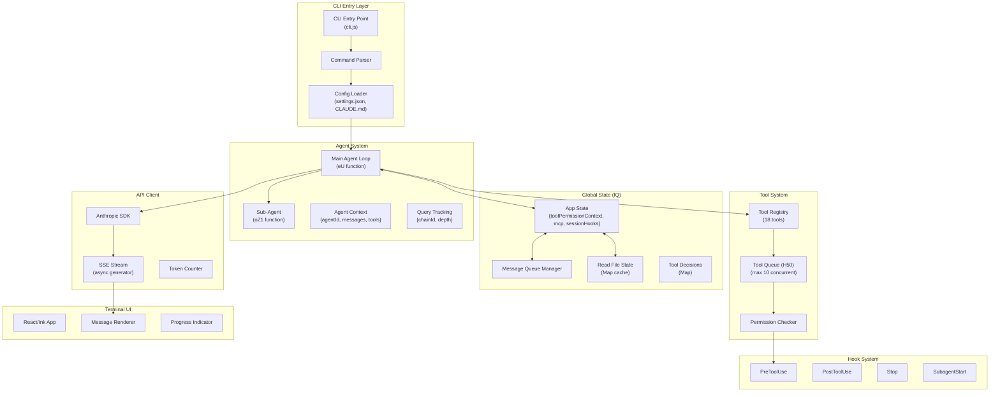
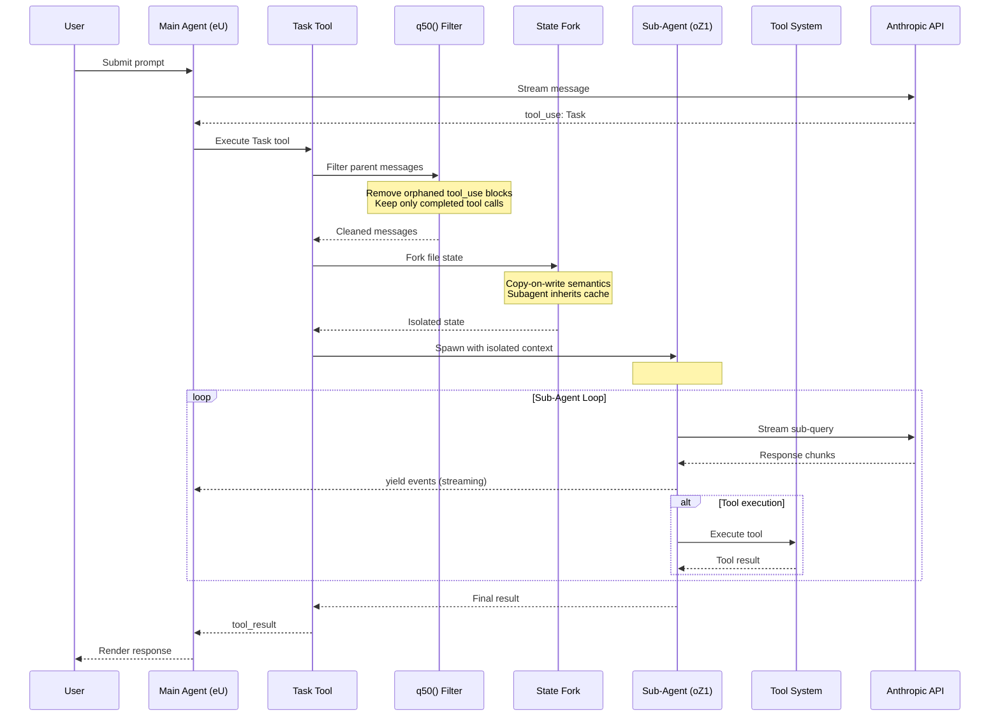
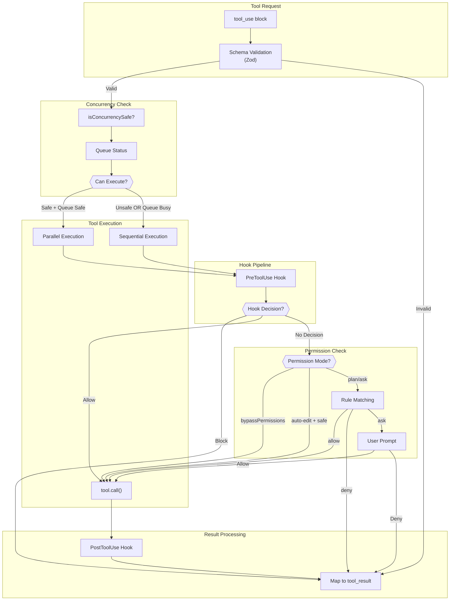
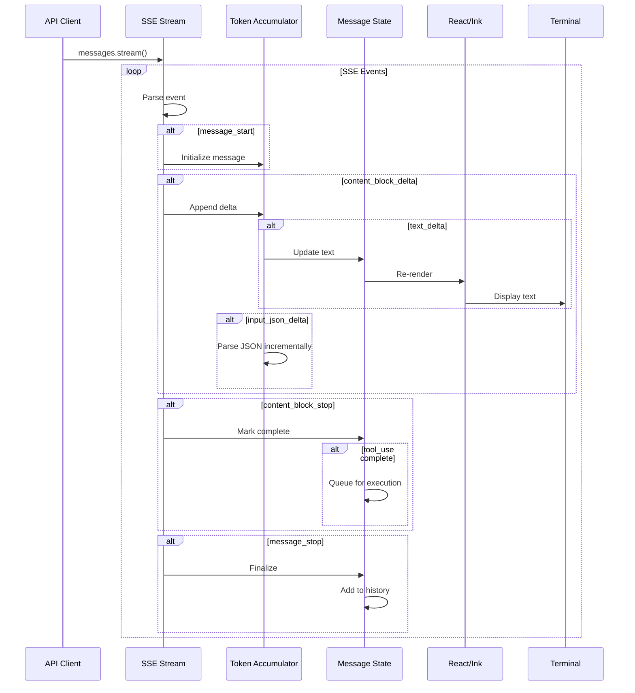
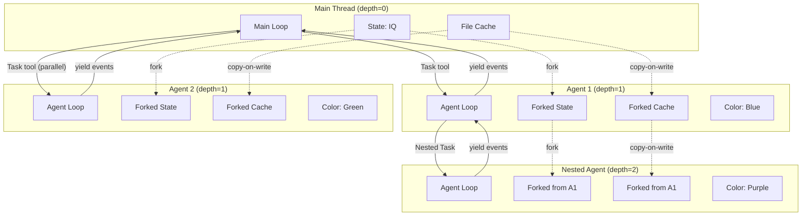

# Claude Code: Expert HLD/LLD Analysis with Architectural Diagrams

## Superintelligent Deep-Dive into Claude Code's Architecture

**Analysis Date:** December 2024
**Source:** `/Users/neetipatni/priori-incantatem/claude-code-deconstruct/package/cli.js`
**Version:** 2.0.55 (10.9MB minified, 4,609 lines)

---

## Table of Contents

1. [Executive Summary](#1-executive-summary)
2. [High-Level Design (HLD)](#2-high-level-design-hld)
3. [Low-Level Design (LLD)](#3-low-level-design-lld)
4. [Mermaid Architecture Diagrams](#4-mermaid-architecture-diagrams)
5. [What Makes the Agent System Exceptional](#5-what-makes-the-agent-system-exceptional)
6. [Idiomatic Patterns & Design Philosophy](#6-idiomatic-patterns--design-philosophy)
7. [Critical Code Locations](#7-critical-code-locations)

---

## 1. Executive Summary

Claude Code's architecture achieves exceptional performance through **five core innovations**:

| Innovation | Implementation | Impact |
|------------|----------------|--------|
| **Context Isolation** | `q50()` message filtering + state forking | Prevents context pollution between agents |
| **Concurrent Execution** | `isConcurrencySafe` flag per tool invocation | 10x faster than sequential execution |
| **Async Streaming** | `async function*` generators throughout | Real-time feedback, early cancellation |
| **Permission Inheritance** | Mode-based permission with cascade | Safety without friction |
| **Lazy Module Loading** | `M()` thunk pattern (200+ uses) | Fast startup, minimal memory |

### The Architecture in One Sentence

> Claude Code is a **React/Ink terminal application** with a **lazy-loaded module system**, **centralized global state (IQ)**, **async generator-based streaming**, and a **composable agent system** where each subagent receives **filtered context** and **forked file state** while executing tools through a **concurrency-safe queue**.

---

## 2. High-Level Design (HLD)

### 2.1 System Components Overview

```
┌─────────────────────────────────────────────────────────────────────────┐
│                        CLAUDE CODE CLI ARCHITECTURE                      │
├─────────────────────────────────────────────────────────────────────────┤
│                                                                          │
│  ┌──────────────┐    ┌──────────────┐    ┌──────────────┐               │
│  │  CLI Entry   │───▶│   Session    │───▶│   Agent      │               │
│  │  (cli.js)    │    │   Manager    │    │   System     │               │
│  └──────────────┘    └──────────────┘    └──────────────┘               │
│         │                   │                   │                        │
│         ▼                   ▼                   ▼                        │
│  ┌──────────────┐    ┌──────────────┐    ┌──────────────┐               │
│  │   Config     │    │   Global     │    │    Tool      │               │
│  │   Loader     │    │   State (IQ) │◀──▶│   Registry   │               │
│  └──────────────┘    └──────────────┘    └──────────────┘               │
│         │                   │                   │                        │
│         ▼                   ▼                   ▼                        │
│  ┌──────────────┐    ┌──────────────┐    ┌──────────────┐               │
│  │    Hook      │    │   API        │    │  Terminal    │               │
│  │   System     │    │   Client     │    │   UI (Ink)   │               │
│  └──────────────┘    └──────────────┘    └──────────────┘               │
│                                                                          │
└─────────────────────────────────────────────────────────────────────────┘
```

### 2.2 Core Subsystems

#### A. Module System (Lines 8-32)

```javascript
// DEMINIFIED: The three core module patterns
var BA = (module, exports, isEsModule) => { /* ES Module interop */ };
var z = (initFn, cache) => () => (cache || initFn((cache = {exports: {}}).exports, cache), cache.exports);
var M = (factory, cached) => () => (factory && (cached = factory(factory = null)), cached);
```

| Pattern | Function | Purpose |
|---------|----------|---------|
| `BA` | ES Module interop | Handle `__esModule` flag for default exports |
| `z` | CommonJS wrapper | Wrap modules with `exports` object |
| `M` | Lazy loader | Defer execution until first access |

#### B. Global State (IQ Object) - Lines 1570-1700

```javascript
// DEMINIFIED: Global state singleton
var IQ = {
  originalCwd: process.cwd(),
  totalCostUSD: 0,
  totalAPIDuration: 0,
  totalToolDuration: 0,
  startTime: Date.now(),
  lastInteractionTime: Date.now(),
  modelUsage: {},                    // Per-model token tracking
  sessionId: generateUUID(),
  agentColorMap: new Map(),          // Agent type -> color
  inMemoryErrorLog: [],              // Circular buffer (max 100)
  planSlugCache: new Map(),
  // ... telemetry providers
};
```

#### C. Session Management

The session lifecycle:
1. **Initialization**: Load config from `~/.claude/settings.json` + `.claude/settings.json`
2. **Hook Registration**: Register session hooks from all sources
3. **Agent Loop**: Enter main message loop (`eU` function)
4. **Compaction**: When context grows large, `Ci()` compacts messages
5. **Cleanup**: Flush logs, emit telemetry, restore terminal

---

## 3. Low-Level Design (LLD)

### 3.1 The Lazy Module Pattern (`M` Function)

**This is the most critical pattern in the codebase** - used 200+ times.

```javascript
// DEMINIFIED: How M() works
var M = (factory, cachedValue) => () => {
  if (factory) {                          // First call: factory exists
    cachedValue = factory(factory = null); // Execute and cache, nullify factory
  }
  return cachedValue;                      // Return cached value
};

// Usage pattern (found throughout cli.js):
var FileSystemModule = M(() => {
  // Heavy initialization only runs on first access
  const fs = require('fs');
  const path = require('path');
  return { readFile: fs.readFileSync, join: path.join };
});
```

**Why This Works:**
- Zero-cost abstraction after first call
- Eliminates circular dependency issues
- Enables fast startup (only 5-10% modules loaded initially)
- Memory efficient - unused modules never instantiated

### 3.2 Tool Execution Queue (`H50` Class)

```javascript
// DEMINIFIED: Concurrent tool execution with safety checks
class H50 {
  constructor(toolDefinitions, canUseTool, toolUseContext) {
    this.toolDefinitions = toolDefinitions;
    this.canUseTool = canUseTool;
    this.toolUseContext = toolUseContext;
    this.tools = [];
  }

  addTool(toolUse, assistantMessage) {
    const definition = this.toolDefinitions.find(t => t.name === toolUse.name);
    const parseResult = definition.inputSchema.safeParse(toolUse.input);

    // CRITICAL: Safety check is per-invocation, not per-tool-type
    const isSafe = parseResult?.success
      ? definition.isConcurrencySafe(parseResult.data)
      : false;

    this.tools.push({
      id: toolUse.id,
      block: toolUse,
      assistantMessage,
      status: "queued",
      isConcurrencySafe: isSafe  // Tagged for queue decisions
    });
  }

  canExecuteTool(isSafe) {
    const executing = this.tools.filter(t => t.status === "executing");
    // Execute if: nothing running OR (tool is safe AND all running are safe)
    return executing.length === 0 || (isSafe && executing.every(t => t.isConcurrencySafe));
  }
}
```

**Concurrency Rules:**
| Tool | `isConcurrencySafe` | Reason |
|------|---------------------|--------|
| `Read` | Always `true` | Read-only, no side effects |
| `Grep` | Always `true` | Read-only search |
| `Glob` | Always `true` | Read-only pattern match |
| `Write` | Always `false` | Modifies filesystem |
| `Edit` | Always `false` | Modifies files |
| `Bash` | Depends on command | `run_in_background: true` → safe |
| `Task` | Usually `true` | Isolated agent context |

### 3.3 Agent Spawning (`oZ1` Function) - Line ~2832

```javascript
// DEMINIFIED: The heart of the agent system
async function* oZ1({
  agentDefinition,
  promptMessages,
  toolUseContext,
  canUseTool,
  isAsync,
  forkContextMessages,    // Parent's messages to include
  querySource,
  override,
  model
}) {
  const appState = await toolUseContext.getAppState();
  const permissionMode = appState.toolPermissionContext.mode;

  // 1. Generate unique agent ID
  const agentId = override?.agentId ?? generateAgentId();

  // 2. CRITICAL: Filter parent context to remove orphaned tool_use blocks
  const filteredContext = forkContextMessages
    ? filterOrphanedToolUse(forkContextMessages)
    : [];
  const messages = [...filteredContext, ...promptMessages];

  // 3. Fork file state (copy-on-write semantics)
  const readFileState = forkContextMessages !== undefined
    ? forkFileState(toolUseContext.readFileState)
    : createEmptyFileState();

  // 4. Resolve model (inherit from parent, override, or explicit)
  const resolvedModel = resolveModel(agentDefinition.model, mainLoopModel, model, permissionMode);

  // 5. Create isolated tool context
  const isolatedContext = {
    abortController: new AbortController(),
    options: { isNonInteractiveSession: true, ...filteredTools },
    setAppState,
    messages,
    readFileState,          // Forked, not shared
    agentId,
    isSubAgent: true,       // Critical flag
    queryTracking: toolUseContext.queryTracking
  };

  // 6. Enter sub-agent message loop (streaming)
  for await (const event of eU({
    messages,
    systemPrompt,
    userContext,
    systemContext,
    canUseTool,
    toolUseContext: isolatedContext
  })) {
    yield event;  // Stream results back to parent in real-time
  }
}
```

### 3.4 Message Filtering (`q50` Function)

**The Secret Sauce for Clean Agent Context:**

```javascript
// DEMINIFIED: Filter orphaned tool_use blocks before passing to subagent
function q50(messages) {
  const completedToolIds = new Set();

  // Phase 1: Collect all tool_use IDs that have corresponding tool_result
  for (const msg of messages) {
    if (msg?.type === "user") {
      const content = msg.message.content;
      if (Array.isArray(content)) {
        for (const block of content) {
          if (block.type === "tool_result" && block.tool_use_id) {
            completedToolIds.add(block.tool_use_id);
          }
        }
      }
    }
  }

  // Phase 2: Filter out assistant messages with orphaned tool_use
  return messages.filter((msg) => {
    if (msg?.type === "assistant") {
      const content = msg.message.content;
      if (Array.isArray(content)) {
        // Remove if ANY tool_use block lacks a result
        return !content.some((block) =>
          block.type === "tool_use" && block.id && !completedToolIds.has(block.id)
        );
      }
    }
    return true;  // Keep all user messages
  });
}
```

**Why This Matters:**

| Scenario | Without `q50()` | With `q50()` |
|----------|-----------------|--------------|
| Parent used `WebSearch`, subagent can't | Model sees tool_use with no result, gets confused | Orphaned block filtered, clean context |
| Parent has pending `Edit` | Subagent might try to "complete" it | Filtered out, subagent focuses on its task |
| Deep nesting (3+ levels) | Context pollution compounds | Each level gets clean, relevant context |

---

## 4. Mermaid Architecture Diagrams

### 4.1 System Architecture



### 4.2 Agent Lifecycle Sequence



### 4.3 Tool Execution Flow



### 4.4 Message Streaming Pipeline



### 4.5 Agent Nesting Architecture



---

## 5. What Makes the Agent System Exceptional

### 5.1 The Five Pillars of Excellence

#### Pillar 1: Surgical Context Isolation

```
┌─────────────────────────────────────────────────────────────┐
│ Parent Context (raw)                                        │
│ ├── user: "Search for config files"                        │
│ ├── assistant: [tool_use: Grep id=1]                       │
│ ├── user: [tool_result id=1: "found 5 files"]              │
│ ├── assistant: [tool_use: WebSearch id=2] ← ORPHANED       │
│ └── assistant: "Let me search online..."                   │
└─────────────────────────────────────────────────────────────┘
                          │
                          ▼ q50() filter
┌─────────────────────────────────────────────────────────────┐
│ Subagent Context (filtered)                                 │
│ ├── user: "Search for config files"                        │
│ ├── assistant: [tool_use: Grep id=1]                       │
│ └── user: [tool_result id=1: "found 5 files"]              │
│                                                             │
│ (WebSearch tool_use removed - no matching result)           │
└─────────────────────────────────────────────────────────────┘
```

#### Pillar 2: Concurrent Execution with Safety

| Execution Pattern | Example | Behavior |
|-------------------|---------|----------|
| All safe | `[Read, Read, Grep]` | Execute all in parallel |
| Mixed | `[Read, Edit]` | Read starts, Edit waits |
| All unsafe | `[Edit, Write]` | Sequential execution |
| With Task | `[Grep, Task, Task]` | All parallel (isolated) |

#### Pillar 3: Async Generator Streaming

```javascript
// Parent can process subagent output in real-time
for await (const event of oZ1(agentConfig)) {
  if (event.type === 'text') {
    renderIncrementalText(event.text);  // Show immediately
  }
  if (event.type === 'tool_result') {
    updateToolProgress(event.result);   // Update UI
  }
  if (shouldCancel) {
    break;  // Early termination supported
  }
}
```

#### Pillar 4: Intelligent Permission Inheritance

```javascript
// Permission modes cascade with overrides
const permissionHierarchy = {
  parent: 'interactive',      // Asks user for confirmations
  subagent: 'auto',           // No interruptions for reads
  nested: 'inherit'           // Gets parent's mode
};

// Result: Subagents explore autonomously while main thread maintains control
```

#### Pillar 5: Prompt Engineering Excellence

The explicit context boundary marker:

```
### ENTERING SUB-AGENT ROUTINE ###
Entered sub-agent context

PLEASE NOTE:
- The messages above this point are from the main thread prior to sub-agent execution. They are provided as context only.
- Context messages may include tool_use blocks for tools that are not available in the sub-agent context. You should only use the tools specifically provided to you in the system prompt.
```

**Effect:** Model understands:
1. What's context vs. active conversation
2. Tool availability may differ
3. Focus on new task, not parent's incomplete work

### 5.2 Why Other Agent Systems Fail (and Claude Code Doesn't)

| Common Failure | Traditional Approach | Claude Code Solution |
|----------------|---------------------|---------------------|
| Context pollution | Pass all parent messages | `q50()` filters orphaned tools |
| Race conditions | Shared mutable state | Fork state per agent |
| Slow execution | Sequential tools | Concurrent safe tools |
| Lost in recursion | No depth tracking | `queryTracking.depth` limit |
| Unclear boundaries | Implicit context | Explicit "ENTERING SUB-AGENT" marker |
| Resource leaks | Manual cleanup | AbortController hierarchy |

---

## 6. Idiomatic Patterns & Design Philosophy

### 6.1 Pattern: Lazy Module Loading

```javascript
// The M() pattern - used 200+ times
var ExpensiveModule = M(() => {
  // This code only runs on first access
  const heavy = require('heavy-dependency');
  return { process: heavy.process };
});

// First call: initializes
ExpensiveModule().process(data);

// Second call: returns cached
ExpensiveModule().process(data);  // No re-initialization
```

### 6.2 Pattern: Functional State Updates

```javascript
// Immutable state updates (React-like)
setAppState((prev) => ({
  ...prev,
  inProgressToolUseIDs: new Set([...prev.inProgressToolUseIDs, toolId])
}));
```

### 6.3 Pattern: Async Generator Composition

```javascript
// Composable streaming - each layer can transform/filter
async function* withLogging(source) {
  for await (const event of source) {
    logEvent(event);
    yield event;
  }
}

async function* withCancellation(source, signal) {
  for await (const event of source) {
    if (signal.aborted) return;
    yield event;
  }
}

// Compose: API → Logging → Cancellation → UI
for await (const e of withCancellation(withLogging(apiStream), controller.signal)) {
  render(e);
}
```

### 6.4 Pattern: Self-Describing Tools

```javascript
// Each tool is fully self-describing
const toolDefinition = {
  name: "Bash",
  inputSchema: z.object({ command: z.string() }),

  // Lifecycle hooks
  validateInput: async (input, context) => { ... },
  checkPermissions: async (input, context) => { ... },
  call: async (input, context) => { ... },

  // Rendering
  renderToolUseMessage: (input) => <BashToolUse {...input} />,
  renderToolResultMessage: (result) => <BashResult {...result} />,

  // Safety metadata
  isReadOnly: (input) => isReadOnlyCommand(input.command),
  isConcurrencySafe: (input) => isReadOnly(input),
};
```

### 6.5 Pattern: Circular Buffer for Errors

```javascript
// Memory-bounded error logging
function logError(error) {
  if (IQ.inMemoryErrorLog.length >= 100) {
    IQ.inMemoryErrorLog.shift();  // FIFO eviction
  }
  IQ.inMemoryErrorLog.push(error);
}
```

---

## 7. Critical Code Locations

### Primary Components

| Component | Line Range | Key Functions |
|-----------|------------|---------------|
| Module loaders | 8-32 | `M()`, `z()`, `BA()` |
| Global state (IQ) | 1570-1700 | `nN9()`, state accessors |
| File system adapter | 300-400 | `o$9`, `t$9` |
| Config system | 980-1020 | `uQ()`, `I0()`, `ZD0()` |
| Message streaming | 1680-1730 | `SC0()`, `M2()`, `wj()` |
| Tool queue | ~2200 | `H50` class |
| Agent spawning | ~2832 | `oZ1()` async generator |
| Message filtering | ~2800 | `q50()` |
| Context forking | ~4340 | `_AA()`, `ef()` |
| Agent definitions | ~2301 | `m61`, `hh` |

### React/Ink UI Components

| Component | Purpose |
|-----------|---------|
| `InkApp` | Root application container |
| `MessageRenderer` | Render assistant/user messages |
| `ToolUseRenderer` | Render tool calls with progress |
| `PermissionPrompt` | Interactive permission dialogs |
| `ProgressIndicator` | Streaming progress display |

### Hook Events (11 Total)

| Event | Trigger | Use Case |
|-------|---------|----------|
| `PreToolUse` | Before tool execution | Block/modify tool calls |
| `PostToolUse` | After tool execution | Transform results |
| `Stop` | Agent completion | Cleanup, logging |
| `SubagentStart` | Agent spawn | Track nesting |
| `SubagentStop` | Agent completion | Aggregate results |
| `SessionStart` | Session begin | Initialize state |
| `SessionEnd` | Session end | Cleanup |
| `UserPromptSubmit` | User sends message | Validate input |
| `PreCompact` | Before compaction | Save important context |
| `Notification` | System events | User alerts |
| `StatusLine` | Status updates | UI refresh |

---

## Conclusion

Claude Code's architecture represents **expert-level systems engineering** applied to LLM agent orchestration. The key insights are:

1. **Context is King**: The `q50()` filter ensures subagents receive clean, actionable context
2. **Safety Enables Speed**: `isConcurrencySafe` per-invocation allows aggressive parallelization
3. **Streaming is Essential**: Async generators provide real-time feedback and early cancellation
4. **Isolation Prevents Bugs**: Forked state per agent eliminates race conditions
5. **Explicit > Implicit**: Clear context boundaries improve model focus

The minified code reveals a system refined through production usage, where every pattern solves a concrete problem encountered in real-world agent deployment.
