# Incremental Indexing Architecture

> **Document ID**: D04
> **Status**: Design Complete
> **Last Updated**: 2026-01-26
> **Author**: Claude Code Analysis

---

## Executive Summary

This document provides a comprehensive architectural analysis of Parseltongue's incremental indexing system for real-time dependency graph updates. The current architecture is **fundamentally correct** but has **one critical stub** preventing live updates from working.

**Key Finding**: The `trigger_incremental_reindex_update()` function at `watcher_service.rs:292-313` is a stub that returns `Ok()` without performing any work.

---

## Table of Contents

1. [Current Architecture Overview](#current-architecture-overview)
2. [Component Deep Dive](#component-deep-dive)
3. [Control Flow Analysis](#control-flow-analysis)
4. [The Critical Gap](#the-critical-gap)
5. [Data Flow Diagrams](#data-flow-diagrams)
6. [ISGL1 v2: Stable Entity Identity](#isgl1-v2-stable-entity-identity)
7. [Entity Matching Algorithm](#entity-matching-algorithm)
8. [Simulation Scenarios](#simulation-scenarios)
9. [Implementation Status Matrix](#implementation-status-matrix)
10. [Three Alternative Approaches](#three-alternative-approaches)
11. [Recommendation](#recommendation)
12. [Critical Files Reference](#critical-files-reference)

---

## Current Architecture Overview

### High-Level System Architecture

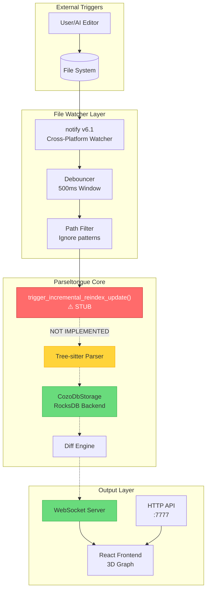

### Database Architecture (base.db vs live.db)

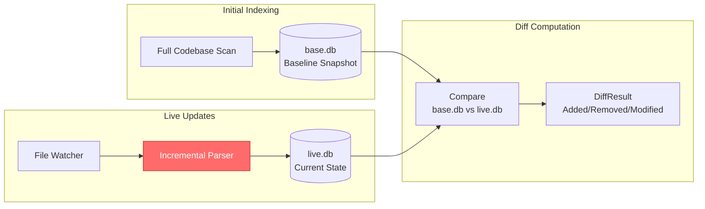

---

## Component Deep Dive

### 1. File Watcher Service

**Location**: `crates/pt08-http-code-query-server/src/file_watcher_service_module/`

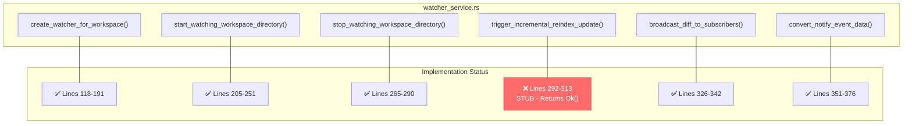

### 2. Debouncer Module

**Location**: `crates/pt08-http-code-query-server/src/file_watcher_service_module/debouncer.rs`

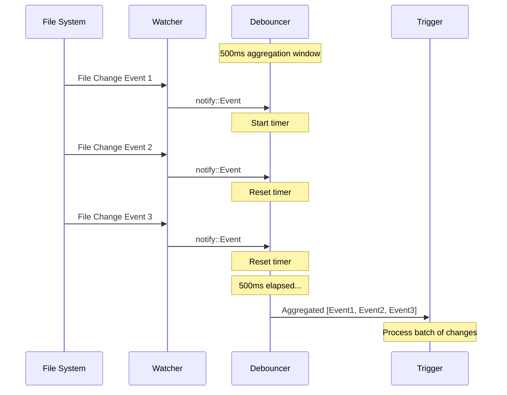

### 3. Path Filter Module

**Location**: `crates/pt08-http-code-query-server/src/file_watcher_service_module/path_filter.rs`

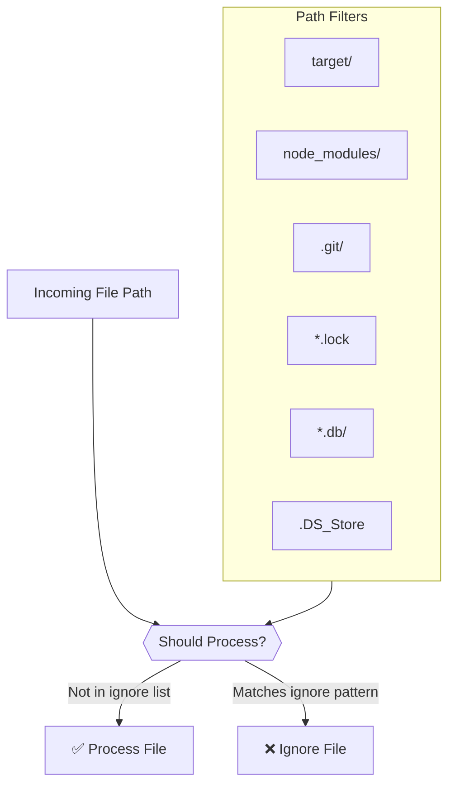

### 4. WebSocket Streaming Module

**Location**: `crates/pt08-http-code-query-server/src/websocket_streaming_module/`

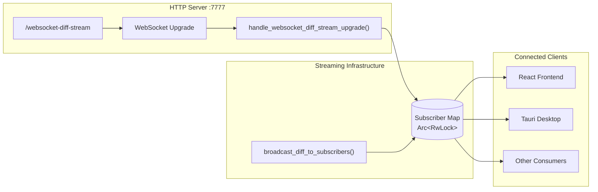

### 5. CozoDbStorage (Database Layer)

**Location**: `crates/parseltongue-core/src/storage/cozo_client.rs`

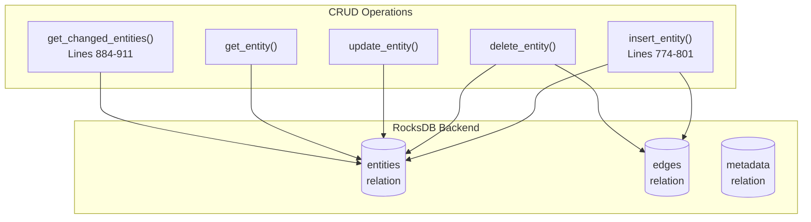

---

## Control Flow Analysis

### Complete Data Flow (Current State)

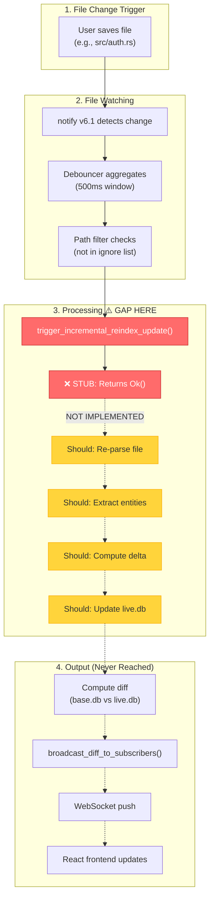

### Expected Control Flow (After Implementation)

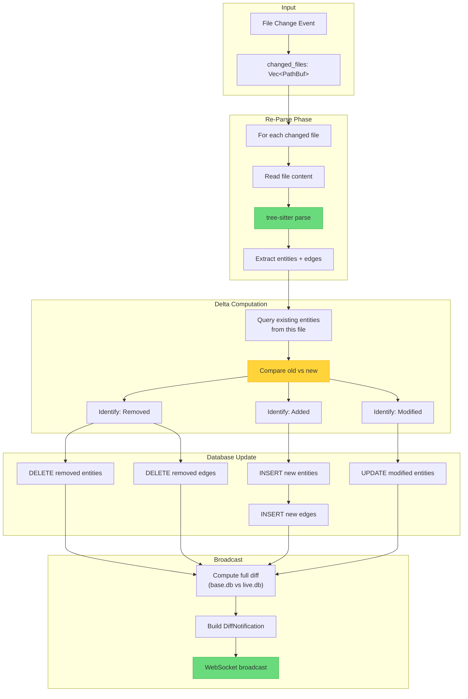

---

## The Critical Gap

### The Stub Function

**File**: `crates/pt08-http-code-query-server/src/file_watcher_service_module/watcher_service.rs`
**Lines**: 292-313

```rust
/// Trigger incremental reindex update
///
/// # 4-Word Name: trigger_incremental_reindex_update
///
/// Triggers an incremental reindex of the changed files and updates live.db.
///
/// ## Contract
/// - WHEN trigger_incremental_reindex_update is called
///   WITH changed_file_paths containing N files
/// - THEN SHALL update live.db with changed files
///   AND SHALL broadcast DiffAnalysisStartedNotification
///   AND SHALL return diff result on completion
pub async fn trigger_incremental_reindex_update(
    _state: &SharedApplicationStateContainer,
    _workspace_id: &str,
    _changed_files: &[PathBuf],
) -> Result<(), FileWatcherErrorType> {
    // TODO: Implement incremental reindex
    // This will be implemented in the GREEN phase
    // For now, this is a stub that returns Ok
    Ok(())
}
```

### What This Stub Should Do

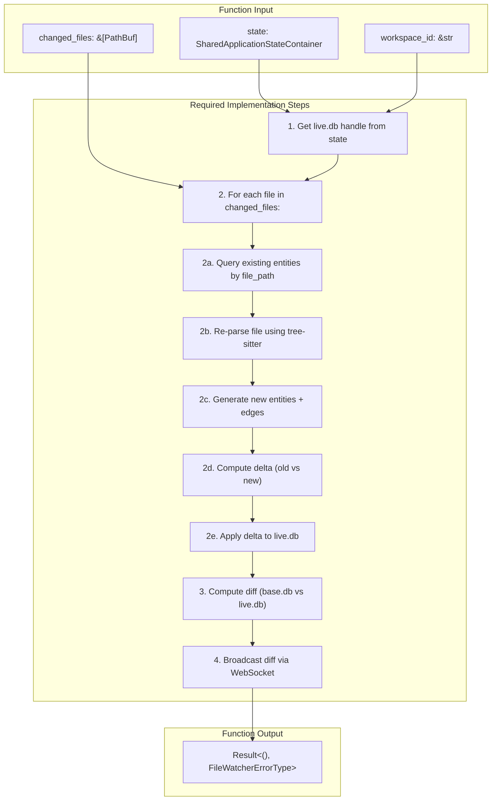

---

## Data Flow Diagrams

### Entity Lifecycle During Incremental Update

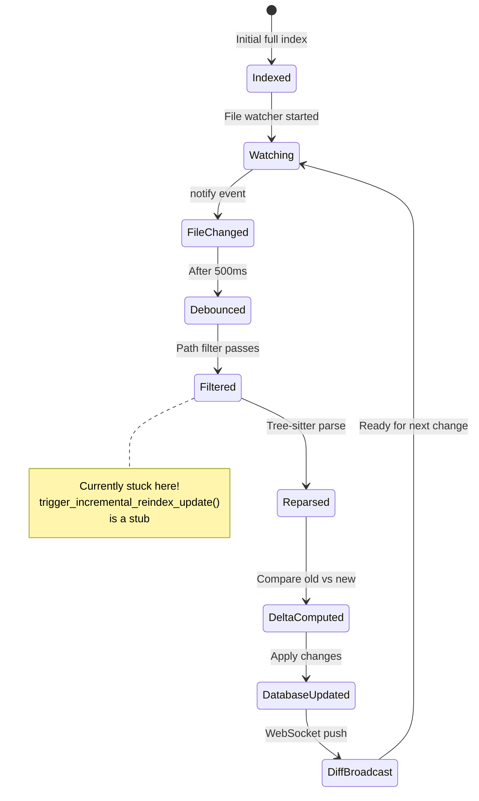

### ISGL1 Key Generation Flow

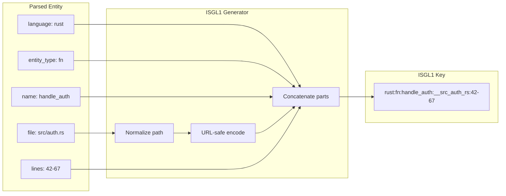

### Dependency Edge Types

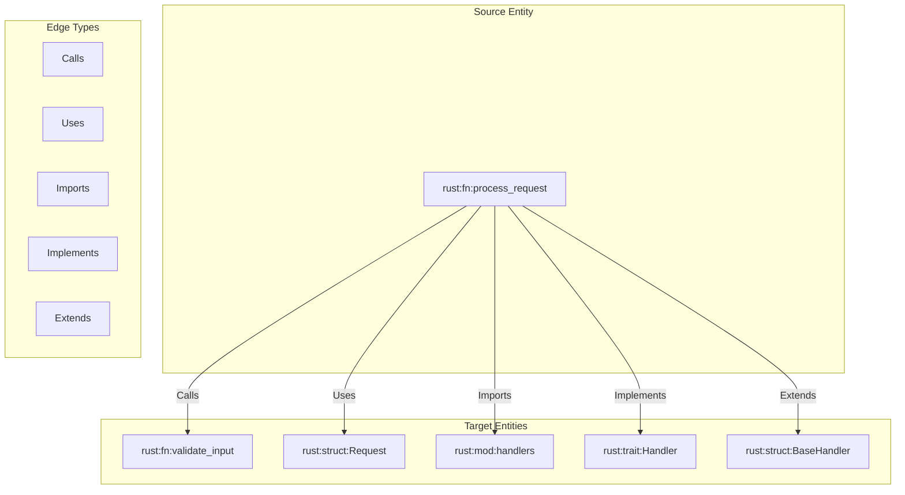

---

## ISGL1 v2: Stable Entity Identity

### The Problem with Line-Number Based Keys

The current ISGL1 key format includes line numbers:

```
rust:fn:handle_auth:__src_auth_rs:42-67
                                   ↑↑↑↑↑
                               LINE RANGE
```

**Critical Issue**: When you add lines to one function, ALL subsequent functions shift:

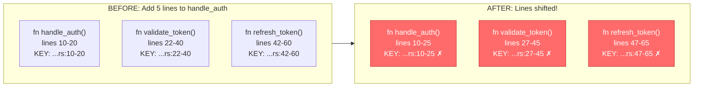

**Consequences**:
1. All 3 ISGL1 keys change, even though only `handle_auth` was modified
2. All incoming edges break (they reference non-existent keys)
3. Diff shows phantom changes (3 "modified" when only 1 actually changed)

### The Solution: Birth Timestamp as Permanent Identity

**Primary Key = `semantic_path` × `birth_timestamp`**

```
rust:fn:process:Foo:__src_rs:T1_001
└──────────────┬───────────┘ └──┬──┘
          semantic_path      birth_ts
```

**Key Properties**:
1. **Unique**: semantic_path + timestamp is always unique
2. **Stable**: Once assigned, NEVER changes (even if content/lines change)
3. **Human-readable**: Still has the function name
4. **Ordered**: T1_001 came before T1_002

### ISGL1 v2 Key Format

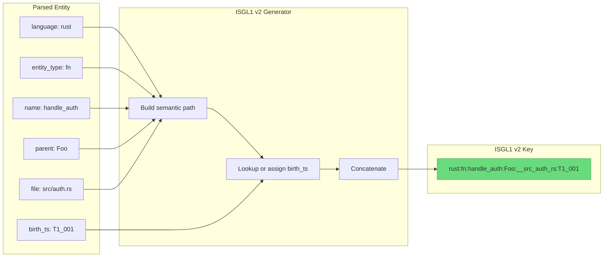

### Entity Schema (v2)

```
Entity {
    // PRIMARY KEY (immutable after creation)
    key: "rust:fn:process:Foo:__src_rs:T1_001",

    // Semantic identity (for matching)
    semantic_path: "rust:fn:process:Foo:__src_rs",

    // Mutable metadata (can change without changing key)
    content_hash: "sha256_abc123",
    line_start: 42,
    line_end: 67,
    last_modified: "2026-01-26T09:30:00Z",
    birth_timestamp: "T1_001",
}
```

---

## Entity Matching Algorithm

### The Challenge: Matching Entities Across Re-Index

When a file is re-parsed, we must match newly parsed entities to existing ones in the database:

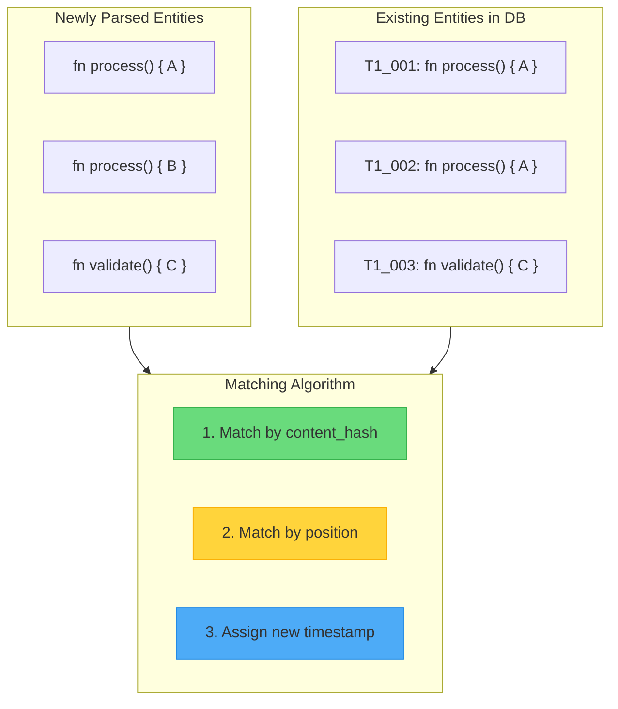

### Matching Priority

```
FOR each entity in newly parsed file:
    1. Find candidates by semantic_path (name + parent + file)

    2. IF candidate with matching content_hash exists:
       → MATCH (same entity, key unchanged)

    3. ELSE IF candidates exist but no hash match:
       → Match by closest line position
       → Mark as MODIFIED (content changed)

    4. ELSE (no candidates):
       → NEW entity, assign new birth timestamp

    5. Any old entity with no match → DELETED
```

---

## Simulation Scenarios

### Simulation 1: New Function Inserted BEFORE Duplicates

```
BEFORE:                              AFTER:
Line 10: fn process() { return 1 }   Line 5:  fn new_func() { ... }     ← NEW
         T1_001, hash=H1             Line 15: fn process() { return 1 } ← shifted
Line 20: fn process() { return 2 }            T1_001, hash=H1 ✓
         T1_002, hash=H2             Line 25: fn process() { return 2 } ← shifted
                                              T1_002, hash=H2 ✓
```

**Result**: Content hashes H1 and H2 are unique → **Easy match, keys stable**

---

### Simulation 2: Identical Duplicates, New Function Inserted

```
BEFORE:                              AFTER:
Line 10: fn process() { return 1 }   Line 5:  fn new_func() { ... }     ← NEW (T2_001)
         T1_001, hash=H1             Line 15: fn process() { return 1 } ← T1_001 or T1_002?
Line 20: fn process() { return 1 }            hash=H1
         T1_002, hash=H1 (SAME!)     Line 25: fn process() { return 1 } ← T1_001 or T1_002?
                                              hash=H1
```

**Challenge**: Both have same hash H1 → **Order-based matching**
- First `process` → T1_001
- Second `process` → T1_002

---

### Simulation 3: Identical Duplicates SWAPPED

```
BEFORE:                              AFTER (user swapped them):
Line 10: fn process() { A }  T1_001  Line 10: fn process() { A }  ← was T1_002?
Line 20: fn process() { A }  T1_002  Line 20: fn process() { A }  ← was T1_001?
```

**Reality**: **Undetectable**. But semantically, if they're byte-for-byte identical, does it matter which timestamp they have? They're functionally interchangeable.

---

### Simulation 4: One Duplicate Modified

```
BEFORE:                              AFTER:
Line 10: fn process() { A }  T1_001  Line 10: fn process() { A }  ← hash H1 → T1_001 ✓
         hash=H1                     Line 20: fn process() { B }  ← hash H2 (changed!)
Line 20: fn process() { A }  T1_002           T1_002 (matched by position)
         hash=H1                              marked as MODIFIED
```

**Result**: First matches by hash. Second has no hash match → **Position-based, mark MODIFIED**

---

### Simulation 5: New Duplicate Inserted BETWEEN

```
BEFORE:                              AFTER:
Line 10: fn process() { A }  T1_001  Line 10: fn process() { A }  ← hash → T1_001
         hash=H1                     Line 20: fn process() { C }  ← NEW (T2_001)
Line 30: fn process() { B }  T1_002           hash=H3 (no match)
         hash=H2                     Line 30: fn process() { B }  ← hash → T1_002
```

**Result**: Hash matching works perfectly. New entity gets new timestamp.

---

### Simulation 6: Middle Entity Deleted

```
BEFORE:                              AFTER:
Line 10: fn process() { A }  T1_001  Line 10: fn process() { A }  ← T1_001 ✓
         hash=H1                     Line 20: fn process() { C }  ← T1_003 ✓
Line 20: fn process() { B }  T1_002
         hash=H2                     T1_002 has no match → DELETED
Line 30: fn process() { C }  T1_003
         hash=H3
```

---

## Simulation Summary Matrix

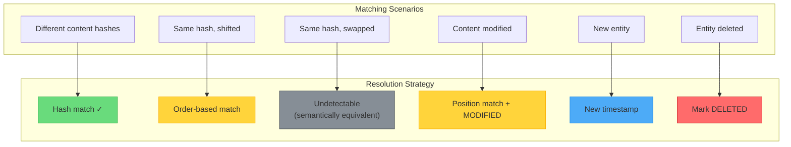

| Scenario | Content Hash | Solution | Key Stable? |
|----------|--------------|----------|-------------|
| Different content | Unique hashes | Match by hash | ✅ Yes |
| Same content, shifted | Same hash | Order-based match | ✅ Yes |
| Same content, swapped | Same hash | **Undetectable** (but equivalent) | ⚠️ N/A |
| Content modified | Hash changed | Position-based, mark MODIFIED | ✅ Yes |
| New entity | No hash match | New timestamp | ✅ Yes (new) |
| Deleted entity | No new match | Mark DELETED | ✅ Yes (gone) |

---

## Philosophical Acceptance

**The Identical Duplicate Limitation**:

If two functions are byte-for-byte identical:
- Same name
- Same content
- Same hash

...then their individual identity is **philosophically meaningless**. Swapping them changes nothing about the program's behavior. We accept this limitation.

**The Mental Model**:

```
OLD: "Track the same entity across changes"
     (impossible for identical duplicates)

NEW: "Track entities by semantic path, detect when content changed"
     (handles all practical cases)
```

---

## Implementation Status Matrix

| Component | Location | Status | Notes |
|-----------|----------|--------|-------|
| **File Watcher** | `watcher_service.rs:118-191` | ✅ Complete | Uses notify v6.1 |
| **Debouncer** | `debouncer.rs` | ✅ Complete | 500ms window |
| **Path Filter** | `path_filter.rs` | ✅ Complete | Ignores target/, .git/, etc. |
| **Start Watching** | `watcher_service.rs:205-251` | ✅ Complete | Recursive watching |
| **Stop Watching** | `watcher_service.rs:265-290` | ✅ Complete | Cleanup resources |
| **Incremental Reindex** | `watcher_service.rs:292-313` | ❌ **STUB** | Returns Ok() only |
| **Broadcast Diff** | `watcher_service.rs:326-342` | ✅ Complete | WebSocket push |
| **Event Conversion** | `watcher_service.rs:351-376` | ✅ Complete | notify → internal |
| **WebSocket Handler** | `websocket_streaming_module/` | ✅ Complete | Upgrade + streaming |
| **Database Insert** | `cozo_client.rs:774-801` | ✅ Complete | Entity insertion |
| **Database Delete** | `cozo_client.rs` | ✅ Complete | Entity deletion |
| **Get Changed Entities** | `cozo_client.rs:884-911` | ✅ Complete | For diff computation |
| **Diff Engine** | `parseltongue-core/src/diff/` | ✅ Complete | Full diff computation |
| **Blast Radius** | `blast_radius.rs` | ✅ Complete | Impact calculation |

---

## Three Alternative Approaches

Based on research into modern IDEs (rust-analyzer, VS Code), academic literature, and industrial-scale tools (Sourcegraph, Kythe), here are three distinct approaches for implementing incremental indexing:

### Approach 1: Simple But Reliable (File Hash + Coarse-Grained Invalidation)

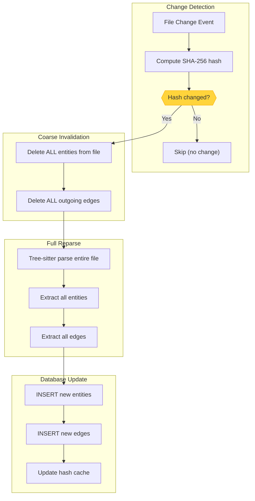

**Characteristics**:
- **Latency**: 20-100ms per file change
- **Complexity**: Low (2-3 days implementation)
- **Granularity**: File-level (entire file invalidated)

**Pros**:
- Simple to understand and debug
- Predictable O(file_size) performance
- Reliable - no missed updates
- Works with existing codebase

**Cons**:
- Over-invalidation (one function change invalidates entire file)
- No incremental parsing
- High database churn

**Rust Crates**:
```toml
notify = "6.1"      # File watching (already in use)
sha2 = "0.10"       # SHA-256 hashing
dashmap = "6.0"     # Concurrent hash map
```

---

### Approach 2: High-Performance Optimized (Salsa + Tree-sitter Incremental)

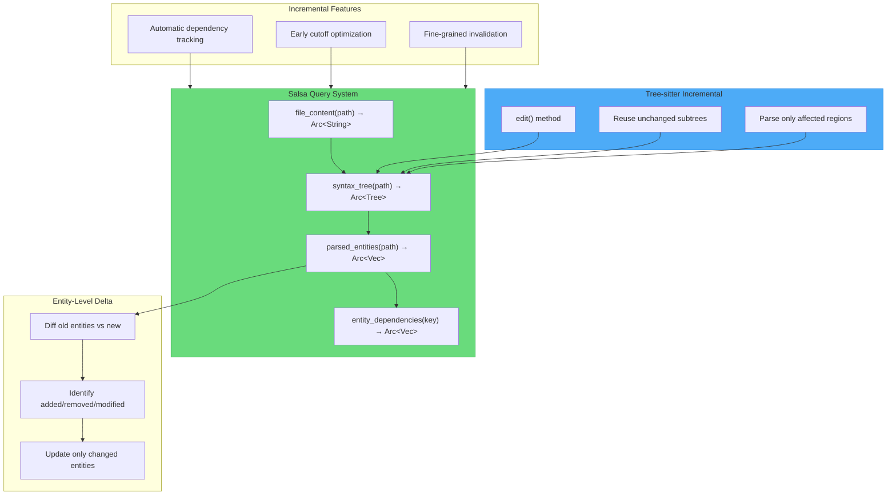

**Characteristics**:
- **Latency**: 10-40ms per file change
- **Complexity**: High (2-3 weeks implementation)
- **Granularity**: Entity-level

**Pros**:
- 2-5x faster than Approach 1
- Smart invalidation (only recomputes changed entities)
- Early cutoff (whitespace changes don't propagate)
- Proven architecture (used by rust-analyzer)

**Cons**:
- Steep learning curve for Salsa
- More code (4-5x more than Approach 1)
- Memory overhead (multiple caches)
- Debugging difficulty

**Rust Crates**:
```toml
salsa = "0.16"          # Incremental computation framework
tree-sitter = "0.20"    # Already in use
dashmap = "6.0"         # Thread-safe caching
parking_lot = "0.12"    # Better mutexes for Salsa
similar = "2.2"         # Entity diffing
```

---

### Approach 3: Bleeding-Edge Research (Reactive Incremental + Delta Encoding)

```mermaid
flowchart TD
    subgraph Reactive["Reactive Computation"]
        R1["Adapton Engine"]
        R2["Dynamic dependency graph"]
        R3["Automatic propagation"]
    end

    subgraph ContentAddressed["Content-Addressed Storage"]
        C1["Blake3 hash → AST node"]
        C2["Deduplicate across files"]
        C3["Structural sharing"]
    end

    subgraph Persistent["Persistent Graph Versions"]
        P1["Copy-on-write data structures"]
        P2["Multiple versions simultaneously"]
        P3["Instant rollback"]
    end

    subgraph Speculative["Speculative Indexing"]
        S1["ML predictor"]
        S2["Pre-compute likely next states"]
        S3["Warm cache proactively"]
    end

    subgraph CRDT["Concurrent Editing"]
        CR1["CRDT-based conflict resolution"]
        CR2["Multiple concurrent editors"]
        CR3["Automatic merge"]
    end

    R1 --> R2
    R2 --> R3

    C1 --> C2
    C2 --> C3

    P1 --> P2
    P2 --> P3

    S1 --> S2
    S2 --> S3

    CR1 --> CR2
    CR2 --> CR3

    style R1 fill:#e599f7,stroke:#be4bdb
    style S1 fill:#ffd43b,stroke:#fab005
    style CR1 fill:#ff6b6b,stroke:#c92a2a
```

**Characteristics**:
- **Latency**: 3-15ms (optimistic), 20-50ms (cache miss)
- **Complexity**: Very High (1-2 months implementation)
- **Granularity**: AST-node-level

**Pros**:
- Theoretical best performance (<5ms for cache hits)
- Maximum deduplication via content-addressing
- Time-travel (instant rollback to any version)
- Concurrent edit support (CRDTs)

**Cons**:
- Extreme complexity (10-20x more than Approach 1)
- Unproven at this scale
- High risk (many unknowns)
- Overkill for most use cases

**Rust Crates**:
```toml
adapton = "0.4"         # Reactive incremental computation
im = "15.1"             # Persistent data structures
blake3 = "1.5"          # Fast content hashing
automerge = "0.5"       # CRDT for collaborative editing
yrs = "0.16"            # Y-CRDT (faster alternative)
rayon = "1.7"           # Parallel processing
```

---

## Comparison Matrix

```mermaid
quadrantChart
    title Implementation Complexity vs Performance
    x-axis Low Complexity --> High Complexity
    y-axis Slow (100ms+) --> Fast (<10ms)
    quadrant-1 Ideal Zone
    quadrant-2 Over-Engineered
    quadrant-3 Acceptable
    quadrant-4 Avoid

    Approach 1: [0.2, 0.3]
    Approach 2: [0.6, 0.7]
    Approach 3: [0.9, 0.9]
```

| Criterion | Approach 1 | Approach 2 | Approach 3 |
|-----------|-----------|-----------|-----------|
| **Implementation Time** | 2-3 days | 2-3 weeks | 1-2 months |
| **Lines of Code** | ~200 | ~800-1200 | ~2000-3000 |
| **Typical Latency** | 20-100ms | 10-40ms | 3-15ms |
| **Complexity** | Low | High | Very High |
| **Memory Overhead** | ~10MB | ~50MB | ~200MB+ |
| **Granularity** | File-level | Entity-level | AST-node |
| **Incremental Parsing** | No | Yes | Yes + speculative |
| **Production Ready** | Yes | Yes | No (research) |
| **Risk Level** | Low | Medium | High |

---

## Recommendation

### Recommended Path: Start with Approach 1, Migrate to Approach 2

```mermaid
gantt
    title Implementation Roadmap
    dateFormat YYYY-MM-DD
    section Phase 1
    Approach 1 Basic Implementation   :a1, 2026-01-27, 3d
    Testing & Validation              :a2, after a1, 2d
    section Phase 2
    Salsa Framework Study             :b1, after a2, 5d
    Prototype Query Pipeline          :b2, after b1, 7d
    Performance Benchmarking          :b3, after b2, 3d
    section Phase 3
    Migration Decision                :c1, after b3, 2d
    Full Salsa Integration            :c2, after c1, 14d
```

**Phase 1 (Week 1-2)**: Implement Approach 1
- Add file hash tracking
- Integrate notify crate for file watching
- Implement basic incremental update handler
- Validate end-to-end flow works

**Phase 2 (Week 3-6)**: Evaluate Approach 2
- Study Salsa framework
- Prototype query-based parsing pipeline
- Benchmark performance improvements
- Decide if migration ROI is worth it

**Phase 3 (Optional)**: Full Salsa Migration
- Only if benchmarks show significant improvement
- Only if team has capacity for complexity

---

## Critical Files Reference

### Files to Implement

| File | Purpose | Priority |
|------|---------|----------|
| `watcher_service.rs:292-313` | The stub function | **P0 - Critical** |

### Files to Reuse

| File | Purpose | How to Use |
|------|---------|------------|
| `pt01-folder-to-cozodb-streamer/src/streamer.rs` | `stream_file()` method | Call for single-file parsing |
| `parseltongue-core/src/storage/cozo_client.rs` | `insert_entity()`, `delete_entity()` | Database operations |
| `parseltongue-core/src/diff/` | Diff computation | Compute base.db vs live.db |
| `websocket_streaming_module/handler.rs` | `broadcast_diff_to_subscribers()` | Real-time push |

### Configuration Files

| File | Purpose |
|------|---------|
| `Cargo.toml` (pt08) | Add new dependencies |
| `route_definition_builder_module.rs` | HTTP routes (no changes needed) |

---

## Appendix: Pseudocode for Implementation

### Basic Implementation (Approach 1)

```rust
pub async fn trigger_incremental_reindex_update(
    state: &SharedApplicationStateContainer,
    workspace_id: &str,
    changed_files: &[PathBuf],
) -> Result<(), FileWatcherErrorType> {
    let db = state.get_live_db(workspace_id)?;

    for file_path in changed_files {
        // 1. Compute file hash
        let content = tokio::fs::read_to_string(file_path).await?;
        let new_hash = sha256_hash(&content);

        // 2. Check if actually changed
        if let Some(old_hash) = db.get_file_hash(file_path).await? {
            if old_hash == new_hash {
                continue; // No actual change
            }
        }

        // 3. Delete old entities from this file
        let old_entities = db.get_entities_by_file(file_path).await?;
        for entity in &old_entities {
            db.delete_entity(&entity.key).await?;
            db.delete_outgoing_edges(&entity.key).await?;
        }

        // 4. Re-parse file (reuse existing streamer)
        let (new_entities, new_edges) = parse_file_to_entities(file_path, &content)?;

        // 5. Insert new entities and edges
        for entity in &new_entities {
            db.insert_entity(entity).await?;
        }
        for edge in &new_edges {
            db.insert_edge(edge).await?;
        }

        // 6. Update hash cache
        db.set_file_hash(file_path, new_hash).await?;
    }

    // 7. Compute diff and broadcast
    let base_db = state.get_base_db(workspace_id)?;
    let diff = compute_diff(&base_db, &db).await?;
    broadcast_diff_to_subscribers(&state.subscribers, workspace_id, diff).await?;

    Ok(())
}
```

---

## Document History

| Version | Date | Author | Changes |
|---------|------|--------|---------|
| 1.0 | 2026-01-26 | Claude Code Analysis | Initial comprehensive document |
| 1.1 | 2026-01-26 | Claude Code Analysis | Added ISGL1 v2 design with birth timestamp identity, entity matching algorithm, 6 simulation scenarios, philosophical acceptance of identical duplicate limitation |
