# D08: Principal Rust Engineer Interview Questions

> 100 Questions for Principal/Staff Rust Engineer (8+ years experience)
> Focus: Language internals, architecture at scale, technical leadership, ecosystem strategy

## Metadata

| Attribute | Value |
|-----------|-------|
| Role Level | Principal/Staff Engineer (L6-L7) |
| Experience | 8+ years total, 4+ years Rust |
| Document | D08 of 4-part interview series |
| Questions | 100 |
| Average Probability | 68.2 |
| Codebase Reference | parseltongue (291 entities, 5,275 edges) |

## Probability Distribution

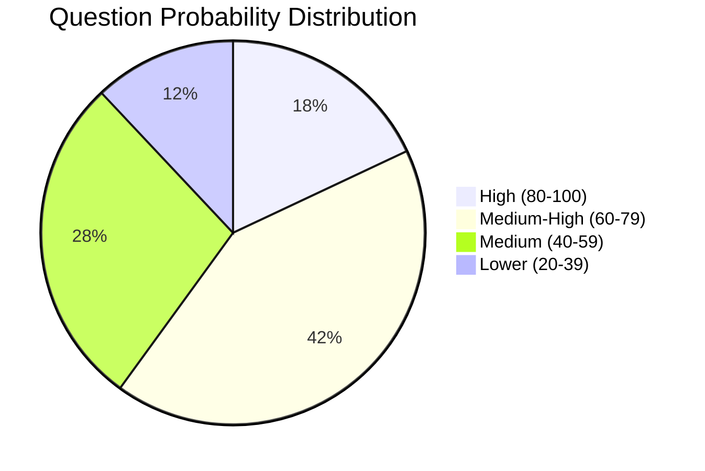

---

## Section 1: Compiler Internals & Language Design (Q1-Q20)

### Q1. Explain the MIR (Mid-level IR) and its role in Rust compilation.
**Probability**: 72

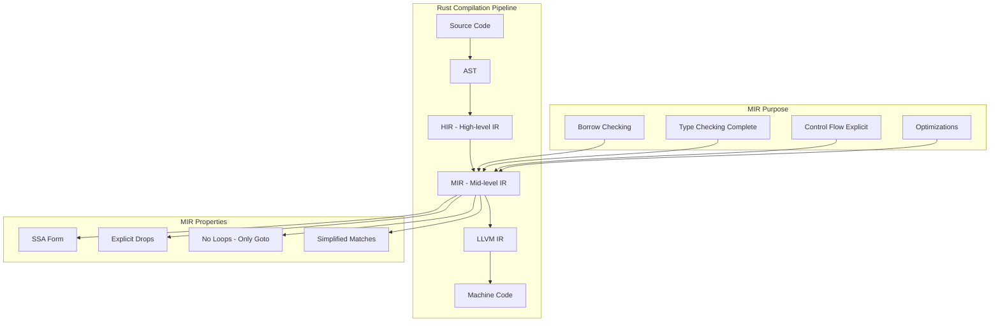

---

### Q2. How does the Rust compiler implement trait object dispatch?
**Probability**: 78

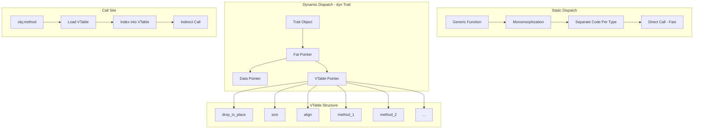

---

### Q3. Describe variance in Rust and its implications for lifetimes.
**Probability**: 65

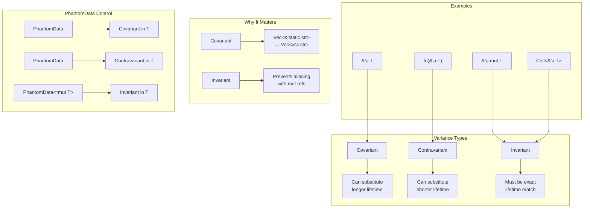

---

### Q4. How would you implement a custom derive macro?
**Probability**: 82

```mermaid
graph TD
    subgraph "Proc Macro Crate Setup"
        A[lib.rs with proc-macro = true] --> B[#[proc_macro_derive]]
        B --> C[Function signature]
        C --> D["fn(TokenStream) -> TokenStream"]
    end

    subgraph "Implementation Steps"
        E[Parse input tokens] --> F[syn::parse_macro_input!]
        F --> G[DeriveInput struct]
        G --> H[Extract type name, generics, fields]
        H --> I[Generate impl block]
        I --> J[quote! macro]
        J --> K[Return TokenStream]
    end

    subgraph "Key Crates"
        L[syn] --> M[Parsing Rust code]
        N[quote] --> O[Generating Rust code]
        P[proc-macro2] --> Q[Token manipulation]
    end

    subgraph "Example Flow"
        R["#[derive(MyTrait)]<br>struct Foo { x: i32 }"]
        R --> S[Macro receives struct def]
        S --> T["impl MyTrait for Foo {<br>  fn method(&self) {...}<br>}"]
    end
```

---

### Q5. Explain how Rust's coherence rules work and why they exist.
**Probability**: 70

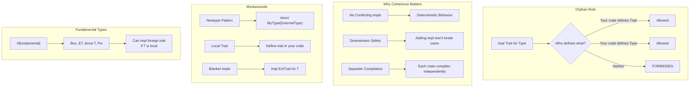

---

### Q6. How does the borrow checker handle non-lexical lifetimes (NLL)?
**Probability**: 75

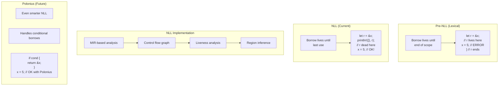

---

### Q7. Describe the layout guarantees Rust provides for structs.
**Probability**: 68

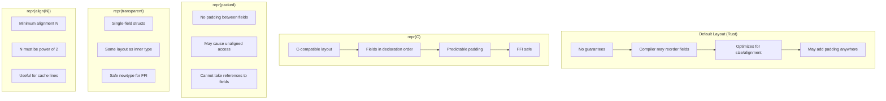

---

### Q8. How does Rust implement async/await at the compiler level?
**Probability**: 85

```mermaid
graph TD
    subgraph "Desugaring"
        A["async fn foo() -> T"] --> B["fn foo() -> impl Future<Output=T>"]
        C["async { expr }"] --> D[Anonymous type implementing Future]
    end

    subgraph "State Machine Generation"
        E[async block] --> F[Compiler generates enum]
        F --> G["enum __FooFuture {<br>  State0 { locals... },<br>  State1 { locals... },<br>  Done<br>}"]
    end

    subgraph "Await Points"
        H[.await] --> I[Yield point in state machine]
        I --> J[Save locals to enum variant]
        J --> K[Return Poll::Pending]
        K --> L[Resume at correct state]
    end

    subgraph "Pin Requirement"
        M[Self-referential structs] --> N[Cannot move after first poll]
        N --> O["Pin<&mut Self>"]
        O --> P[Compiler inserts pin projections]
    end
```

---

### Q9. Explain the difference between #[inline], #[inline(always)], and #[cold].
**Probability**: 62

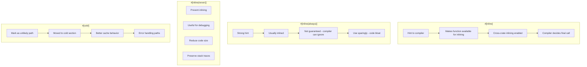

---

### Q10. How would you implement a safe abstraction over raw pointers?
**Probability**: 76

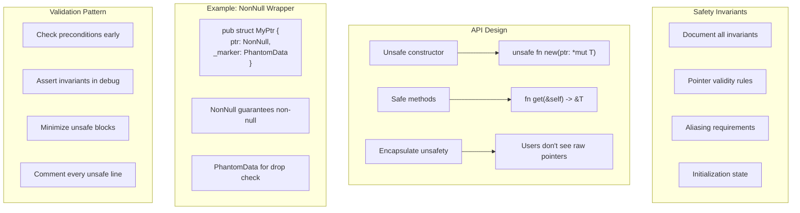

---

### Q11. Describe how GATs (Generic Associated Types) work and their use cases.
**Probability**: 70

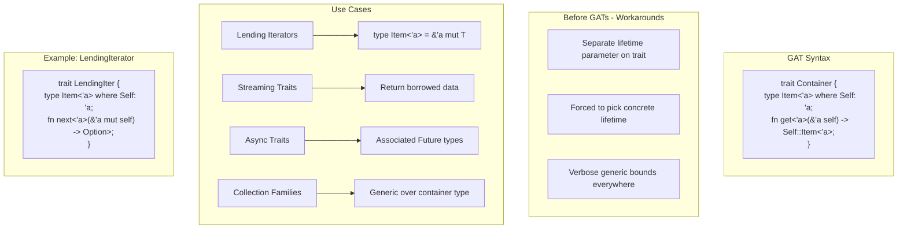

---

### Q12. How does Rust's drop checker work with generics?
**Probability**: 58

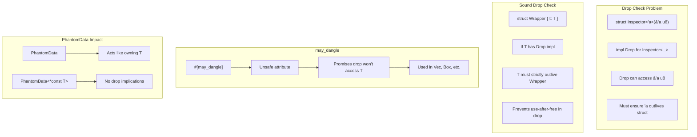

---

### Q13. Explain Rust's approach to function pointer ABI.
**Probability**: 52

```mermaid
graph TD
    subgraph "Function Pointer Types"
        A["fn(A) -> B"] --> B[Rust ABI - default]
        C["extern \"C\" fn(A) -> B"] --> D[C ABI]
        E["unsafe fn(A) -> B"] --> F[Unsafe to call]
    end

    subgraph "ABI Differences"
        G[Rust ABI] --> H[Unspecified, can change]
        I[C ABI] --> J[Platform standard]
        K[System ABI] --> L[OS calling convention]
    end

    subgraph "Coercion Rules"
        M[Closure to fn pointer] --> N[Only if no captures]
        O["fn item → fn pointer"] --> P[Automatic coercion]
        Q[Different ABIs] --> R[No implicit conversion]
    end

    subgraph "Higher-ranked"
        S["for<'a> fn(&'a T)"] --> T[Works for any lifetime]
        T --> U[Required for callbacks]
    end
```

---

### Q14. How does the compiler optimize enum discriminants?
**Probability**: 65

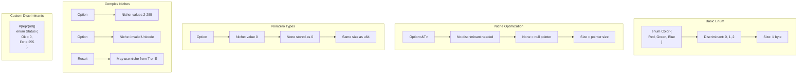

---

### Q15. Describe the Rustc query system and incremental compilation.
**Probability**: 55

```mermaid
graph TD
    subgraph "Query System"
        A[Demand-driven compilation]
        B[type_of(DefId) → Ty]
        C[predicates_of(DefId) → Vec]
        D[Queries call other queries]
    end

    subgraph "Memoization"
        E[Results cached]
        F[Same input = cached result]
        G[No redundant computation]
    end

    subgraph "Incremental Compilation"
        H[Hash query inputs]
        I[Compare with previous run]
        J[Reuse unchanged results]
        K[Invalidate dependents]
    end

    subgraph "Dependency Graph"
        L[Query A depends on Query B]
        M[B changes → A invalidated]
        N[Green/Red marking]
        O[Minimal recomputation]
        L --> M --> N --> O
    end
```

---

### Q16. How would you debug a compiler ICE (Internal Compiler Error)?
**Probability**: 48

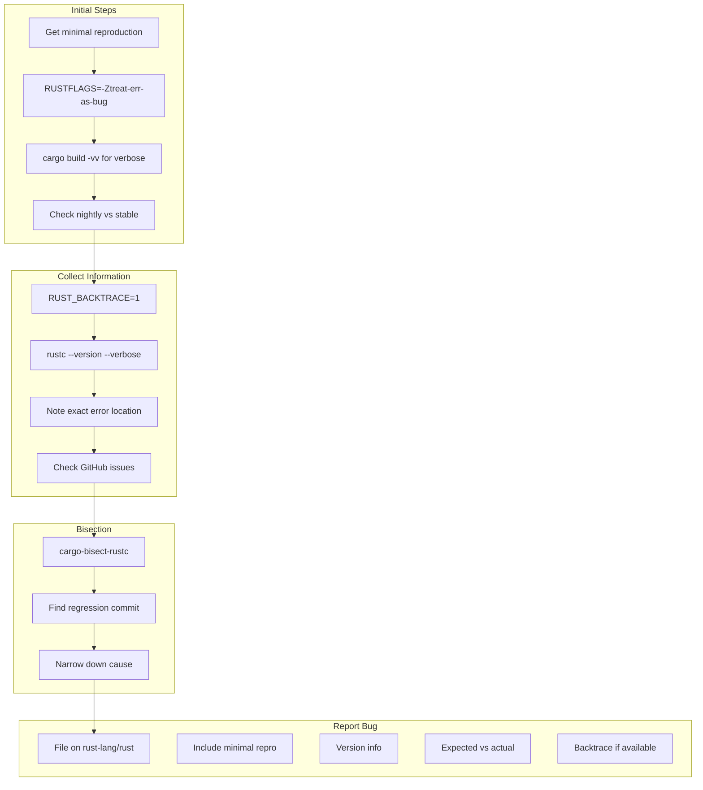

---

### Q17. Explain the implications of repr(Rust) vs repr(C) for unions.
**Probability**: 50

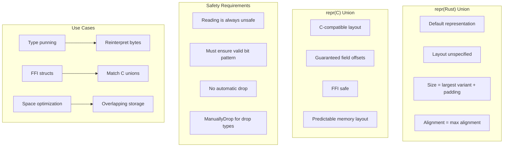

---

### Q18. How does Rust handle unsized types and DSTs?
**Probability**: 72

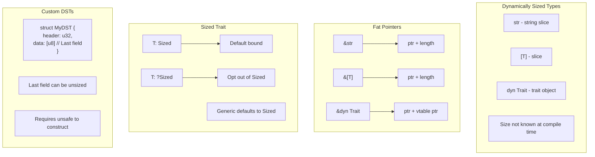

---

### Q19. Describe the auto trait mechanism and its rules.
**Probability**: 60

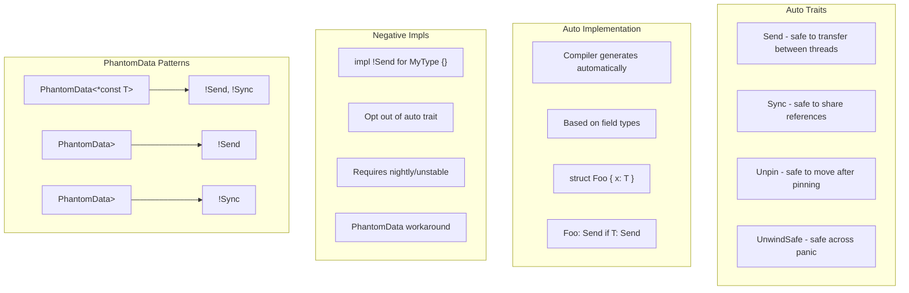

---

### Q20. How would you approach designing a new language feature RFC?
**Probability**: 45

```mermaid
graph TD
    subgraph "RFC Process"
        A[Identify problem clearly]
        B[Research prior art]
        C[Write detailed proposal]
        D[Submit to rust-lang/rfcs]
        E[Community feedback]
        F[FCP - Final Comment Period]
        G[Accept/Reject]
    end

    subgraph "RFC Sections"
        H[Summary]
        I[Motivation - Why needed?]
        J[Guide-level explanation]
        K[Reference-level explanation]
        L[Drawbacks]
        M[Alternatives]
        N[Prior art]
        O[Unresolved questions]
    end

    subgraph "Success Factors"
        P[Clear problem statement]
        Q[Minimal complexity]
        R[Backwards compatible]
        S[Implementation feasible]
        T[Community support]
    end

    A --> B --> C --> D --> E --> F --> G
```

---

## Section 2: Architecture at Scale (Q21-Q40)

### Q21. Design a plugin system for a Rust application.
**Probability**: 78

```mermaid
graph TD
    subgraph "Plugin Architecture Options"
        A[Trait Objects] --> B[dyn Plugin in Vec]
        C[Dynamic Loading] --> D[libloading + cdylib]
        E[WASM Plugins] --> F[wasmtime sandbox]
        G[IPC Plugins] --> H[Separate processes]
    end

    subgraph "Trait-based Design"
        I["trait Plugin: Send + Sync {<br>  fn name(&self) -> &str;<br>  fn init(&mut self, ctx: &Context);<br>  fn execute(&self, input: &Input) -> Output;<br>}"]
    end

    subgraph "Dynamic Loading"
        J[cdylib crate type]
        K["#[no_mangle] extern \"C\""]
        L[ABI stability concern]
        M[Version compatibility]
    end

    subgraph "WASM Approach"
        N[Memory isolation]
        O[CPU/memory limits]
        P[Platform independent]
        Q[wit-bindgen for interface]
    end
```

---

### Q22. How would you design a high-throughput message queue in Rust?
**Probability**: 75

```mermaid
graph TD
    subgraph "Core Components"
        A[Producer API]
        B[Consumer API]
        C[Storage Backend]
        D[Routing Logic]
    end

    subgraph "Concurrency Model"
        E[Lock-free queues] --> F[crossbeam-channel]
        G[Sharding] --> H[Per-partition ordering]
        I[Batch processing] --> J[Reduce syscalls]
    end

    subgraph "Storage Options"
        K[Memory-only] --> L[Fastest, volatile]
        M[Memory-mapped files] --> N[Persistence + speed]
        O[Append-only log] --> P[Kafka-like durability]
    end

    subgraph "Performance Techniques"
        Q[Zero-copy where possible]
        R[Pre-allocated buffers]
        S[NUMA awareness]
        T[Busy-polling option]
    end

    A --> E
    B --> E
    E --> C
    C --> K
    C --> M
    C --> O
```

---

### Q23. Explain strategies for managing a large Rust monorepo.
**Probability**: 70

```mermaid
graph TD
    subgraph "Workspace Structure"
        A[Cargo workspace]
        B[Shared Cargo.toml]
        C[Unified dependencies]
        D[Single lockfile]
    end

    subgraph "Crate Organization"
        E[Core libraries]
        F[Domain crates]
        G[Binary crates]
        H[Internal test crates]
    end

    subgraph "Build Optimization"
        I[sccache] --> J[Shared compilation cache]
        K[cargo-hakari] --> L[Workspace hack crate]
        M[Target dir caching] --> N[CI artifact reuse]
    end

    subgraph "Dependency Management"
        O[workspace.dependencies]
        P[Version pinning]
        Q[Private registry option]
        R[Audit automation]
    end

    subgraph "CI Strategy"
        S[Affected crate detection]
        T[Parallel test shards]
        U[Incremental builds]
    end
```

---

### Q24. Design a distributed tracing system for microservices.
**Probability**: 68

```mermaid
graph TD
    subgraph "Core Concepts"
        A[Trace ID] --> B[Request journey]
        C[Span ID] --> D[Single operation]
        E[Parent Span] --> F[Causality chain]
    end

    subgraph "Rust Implementation"
        G[tracing crate] --> H[Span creation]
        I[tracing-subscriber] --> J[Collection]
        K[tracing-opentelemetry] --> L[Export]
    end

    subgraph "Context Propagation"
        M[HTTP headers]
        N[gRPC metadata]
        O[Message queue headers]
        P[Task-local storage]
    end

    subgraph "Collection Pipeline"
        Q[Application] --> R[Local buffer]
        R --> S[Batch export]
        S --> T[Collector service]
        T --> U[Storage backend]
        U --> V[Query UI]
    end

    subgraph "Performance"
        W[Sampling strategies]
        X[Async export]
        Y[Ring buffers]
    end
```

---

### Q25. How would you implement graceful degradation in a Rust service?
**Probability**: 72

```mermaid
graph TD
    subgraph "Circuit Breaker Pattern"
        A[Closed] --> |Failures exceed threshold| B[Open]
        B --> |Timeout expires| C[Half-Open]
        C --> |Success| A
        C --> |Failure| B
    end

    subgraph "Implementation"
        D["struct CircuitBreaker {<br>  state: AtomicU8,<br>  failures: AtomicU32,<br>  last_failure: AtomicU64,<br>}"]
    end

    subgraph "Fallback Strategies"
        E[Cache stale data]
        F[Default response]
        G[Partial result]
        H[Queue for retry]
    end

    subgraph "Load Shedding"
        I[Request queuing]
        J[Priority levels]
        K[Timeout fast]
        L[Backpressure signals]
    end

    subgraph "Health Checks"
        M[Liveness] --> N[Process alive]
        O[Readiness] --> P[Can serve traffic]
        Q[Dependency checks] --> R[Downstream status]
    end
```

---

### Q26. Design a cache layer with multiple eviction policies.
**Probability**: 65

```mermaid
graph TD
    subgraph "Eviction Policies"
        A[LRU - Least Recently Used]
        B[LFU - Least Frequently Used]
        C[TTL - Time To Live]
        D[ARC - Adaptive Replacement]
    end

    subgraph "Trait Design"
        E["trait EvictionPolicy<K> {<br>  fn on_access(&mut self, key: &K);<br>  fn on_insert(&mut self, key: K);<br>  fn evict(&mut self) -> Option<K>;<br>}"]
    end

    subgraph "Cache Structure"
        F["struct Cache<K, V, P: EvictionPolicy> {<br>  data: HashMap<K, V>,<br>  policy: P,<br>  capacity: usize,<br>}"]
    end

    subgraph "Concurrency"
        G[RwLock for reads]
        H[Sharded for throughput]
        I[Lock-free reads option]
    end

    subgraph "LRU Implementation"
        J[HashMap + LinkedList]
        K[Node has key reference]
        L[O(1) access and evict]
    end
```

---

### Q27. How would you design error handling for a complex system?
**Probability**: 80

```mermaid
graph TD
    subgraph "Error Type Hierarchy"
        A[Top-level AppError]
        B[Domain errors per module]
        C[External errors wrapped]
    end

    subgraph "Error Design"
        D["#[derive(thiserror::Error)]<br>pub enum AppError {<br>  #[error(Database error: {0})]<br>  Database(#[from] DbError),<br>  #[error(Validation: {0})]<br>  Validation(String),<br>}"]
    end

    subgraph "Context Addition"
        E[anyhow for applications]
        F[.context() for wrapping]
        G[Error chains preserved]
        H[Backtraces when needed]
    end

    subgraph "Error Reporting"
        I[Structured logging]
        J[Error codes for clients]
        K[Internal vs external messages]
        L[Sensitive data filtering]
    end

    subgraph "Recovery Patterns"
        M[Retry with backoff]
        N[Fallback values]
        O[Partial success]
        P[Transaction rollback]
    end
```

---

### Q28. Explain how you'd architect a real-time collaboration system.
**Probability**: 58

```mermaid
graph TD
    subgraph "Core Requirements"
        A[Low latency updates]
        B[Conflict resolution]
        C[Offline support]
        D[Consistent state]
    end

    subgraph "Architecture Options"
        E[OT - Operational Transform]
        F[CRDT - Conflict-free Replicated]
        G[Event sourcing]
    end

    subgraph "CRDT Approach"
        H[Last-Writer-Wins Register]
        I[G-Counter for increments]
        J[OR-Set for collections]
        K[Automerge for documents]
    end

    subgraph "Rust Implementation"
        L[yrs - Yjs port]
        M[automerge-rs]
        N[Custom CRDT traits]
    end

    subgraph "Sync Protocol"
        O[WebSocket connection]
        P[Delta sync]
        Q[Vector clocks]
        R[Merkle trees for state]
    end
```

---

### Q29. Design a feature flag system with gradual rollout.
**Probability**: 62

```mermaid
graph TD
    subgraph "Flag Types"
        A[Boolean - on/off]
        B[Percentage rollout]
        C[User segment targeting]
        D[A/B test variants]
    end

    subgraph "Evaluation Engine"
        E["struct FlagContext {<br>  user_id: String,<br>  attributes: HashMap,<br>  environment: Env,<br>}"]
        F["fn evaluate(flag: &str, ctx: &FlagContext) -> Value"]
    end

    subgraph "Storage & Sync"
        G[Configuration service]
        H[Local cache with TTL]
        I[Push updates via SSE]
        J[Fallback to defaults]
    end

    subgraph "Percentage Rollout"
        K[Hash user_id + flag_name]
        L[Deterministic bucket]
        M[Gradual increase]
        N[Sticky assignment]
    end

    subgraph "Observability"
        O[Flag evaluation metrics]
        P[Exposure events]
        Q[Impact analysis]
    end
```

---

### Q30. How would you implement a rate limiter that scales horizontally?
**Probability**: 75

```mermaid
graph TD
    subgraph "Local Rate Limiting"
        A[Token bucket]
        B[Leaky bucket]
        C[Fixed window]
        D[Sliding window]
    end

    subgraph "Distributed Approaches"
        E[Redis + Lua scripts]
        F[Consistent hashing]
        G[Gossip protocol]
    end

    subgraph "Token Bucket Impl"
        H["struct TokenBucket {<br>  tokens: AtomicU64,<br>  last_refill: AtomicU64,<br>  rate: u64,<br>  capacity: u64,<br>}"]
    end

    subgraph "Redis Sliding Window"
        I[Sorted set per key]
        J[Score = timestamp]
        K[ZREMRANGEBYSCORE old]
        L[ZCARD for count]
        M[Lua for atomicity]
    end

    subgraph "Considerations"
        N[Clock skew handling]
        O[Race conditions]
        P[Burst allowance]
        Q[Per-user vs global]
    end
```

---

### Q31. Design a schema migration system for a Rust application.
**Probability**: 55

```mermaid
graph TD
    subgraph "Migration Types"
        A[SQL migrations]
        B[Data migrations]
        C[Rollback support]
    end

    subgraph "Execution Model"
        D[Sequential ordering]
        E[Version tracking table]
        F[Transaction per migration]
        G[Idempotency checks]
    end

    subgraph "Rust Libraries"
        H[sqlx::migrate!]
        I[diesel_migrations]
        J[refinery]
        K[barrel for DSL]
    end

    subgraph "Best Practices"
        L[Immutable once applied]
        M[Backwards compatible]
        N[Test migrations]
        O[Review process]
    end

    subgraph "Zero-Downtime Strategy"
        P[Expand phase - add new]
        Q[Migrate data]
        R[Contract phase - remove old]
        S[Multiple deployments]
    end
```

---

### Q32. How would you design an API versioning strategy?
**Probability**: 68

```mermaid
graph TD
    subgraph "Versioning Approaches"
        A[URL path - /v1/resource]
        B[Header - Accept-Version]
        C[Query param - ?version=1]
        D[Content negotiation]
    end

    subgraph "Rust Implementation"
        E["enum ApiVersion { V1, V2 }"]
        F[Extractor pattern]
        G[Version-specific handlers]
        H[Shared core logic]
    end

    subgraph "Compatibility"
        I[Additive changes only]
        J[Deprecation warnings]
        K[Sunset headers]
        L[Migration guides]
    end

    subgraph "Handler Organization"
        M["mod v1 { pub fn get_user() }"]
        N["mod v2 { pub fn get_user() }"]
        O[Router dispatch by version]
    end

    subgraph "Testing"
        P[Contract tests]
        Q[Version matrix CI]
        R[Backwards compat checks]
    end
```

---

### Q33. Explain database connection pooling strategies in Rust.
**Probability**: 70

```mermaid
graph TD
    subgraph "Pool Concepts"
        A[Min connections]
        B[Max connections]
        C[Idle timeout]
        D[Connection lifetime]
    end

    subgraph "Rust Libraries"
        E[deadpool - async-first]
        F[r2d2 - sync pools]
        G[bb8 - tokio-based]
        H[sqlx built-in pool]
    end

    subgraph "Configuration"
        I["Pool::builder()<br>  .max_size(20)<br>  .min_idle(5)<br>  .connection_timeout(30s)<br>  .idle_timeout(600s)"]
    end

    subgraph "Health Checks"
        J[Test on checkout]
        K[Background validation]
        L[Failed connection recycling]
    end

    subgraph "Sizing Strategy"
        M["Connections = (cores * 2) + disk_spindles"]
        N[Monitor wait times]
        O[Adjust based on load]
        P[Consider statement pipelining]
    end
```

---

### Q34. Design an observability stack for Rust microservices.
**Probability**: 72

```mermaid
graph TD
    subgraph "Three Pillars"
        A[Metrics]
        B[Logs]
        C[Traces]
    end

    subgraph "Metrics Stack"
        D[prometheus crate]
        E[Counter, Gauge, Histogram]
        F[/metrics endpoint]
        G[Prometheus scrape]
        H[Grafana dashboards]
    end

    subgraph "Logging Stack"
        I[tracing crate]
        J[Structured JSON]
        K[Log aggregation]
        L[Loki or Elasticsearch]
    end

    subgraph "Tracing Stack"
        M[tracing + opentelemetry]
        N[Context propagation]
        O[Jaeger or Tempo]
        P[Service map]
    end

    subgraph "Unified Approach"
        Q[tracing as foundation]
        R[Subscribers for each output]
        S[Correlation IDs]
        T[Request context]
    end
```

---

### Q35. How would you design a multi-tenant architecture in Rust?
**Probability**: 65

```mermaid
graph TD
    subgraph "Isolation Models"
        A[Shared database - row isolation]
        B[Schema per tenant]
        C[Database per tenant]
        D[Cluster per tenant]
    end

    subgraph "Request Context"
        E["struct TenantContext {<br>  tenant_id: TenantId,<br>  permissions: Permissions,<br>  config: TenantConfig,<br>}"]
    end

    subgraph "Data Access Layer"
        F[Tenant ID in all queries]
        G[Row-level security]
        H[Connection per tenant option]
        I[Query interception]
    end

    subgraph "Resource Isolation"
        J[Rate limiting per tenant]
        K[Memory quotas]
        L[CPU time tracking]
        M[Storage limits]
    end

    subgraph "Configuration"
        N[Tenant-specific features]
        O[Custom branding]
        P[Integration configs]
    end
```

---

### Q36. Design a job scheduler with complex dependency graphs.
**Probability**: 60

```mermaid
graph TD
    subgraph "Job Graph"
        A[Job A] --> C[Job C]
        B[Job B] --> C
        C --> D[Job D]
        C --> E[Job E]
        D --> F[Job F]
        E --> F
    end

    subgraph "Scheduler Design"
        G["struct Job {<br>  id: JobId,<br>  deps: Vec<JobId>,<br>  handler: Box<dyn Handler>,<br>  state: JobState,<br>}"]
    end

    subgraph "Execution Model"
        H[Topological sort]
        I[Ready queue]
        J[Worker pool]
        K[Completion notification]
    end

    subgraph "Failure Handling"
        L[Retry policies]
        M[Dependent job cancellation]
        N[Partial success]
        O[Dead letter queue]
    end

    subgraph "Persistence"
        P[Job state in DB]
        Q[Recover on restart]
        R[At-least-once delivery]
    end
```

---

### Q37. How would you implement a custom memory allocator?
**Probability**: 52

```mermaid
graph TD
    subgraph "GlobalAlloc Trait"
        A["unsafe trait GlobalAlloc {<br>  unsafe fn alloc(&self, layout: Layout) -> *mut u8;<br>  unsafe fn dealloc(&self, ptr: *mut u8, layout: Layout);<br>}"]
    end

    subgraph "Allocator Types"
        B[Bump/Arena - fast, no individual free]
        C[Slab - fixed-size objects]
        D[Pool - pre-allocated chunks]
        E[Custom general-purpose]
    end

    subgraph "Registration"
        F["#[global_allocator]<br>static ALLOC: MyAllocator = MyAllocator;"]
    end

    subgraph "Arena Allocator"
        G["struct Arena {<br>  chunks: Vec<Box<[u8]>>,<br>  current: *mut u8,<br>  end: *mut u8,<br>}"]
        H[Bump pointer forward]
        I[Allocate new chunk when full]
        J[Free all at once]
    end

    subgraph "Use Cases"
        K[Game frame allocator]
        L[Request-scoped allocation]
        M[Embedded systems]
    end
```

---

### Q38. Design a consensus protocol implementation approach.
**Probability**: 45

```mermaid
graph TD
    subgraph "Consensus Options"
        A[Raft - leader-based]
        B[Paxos - classic]
        C[PBFT - Byzantine fault tolerant]
    end

    subgraph "Raft Components"
        D[Leader Election]
        E[Log Replication]
        F[Safety guarantees]
    end

    subgraph "Rust Design"
        G["enum RaftMessage {<br>  RequestVote { term, candidate_id, ... },<br>  AppendEntries { term, entries, ... },<br>  ...<br>}"]
    end

    subgraph "State Machine"
        H[Follower] --> |Election timeout| I[Candidate]
        I --> |Majority votes| J[Leader]
        I --> |Higher term seen| H
        J --> |Higher term seen| H
    end

    subgraph "Libraries"
        K[raft-rs by TiKV]
        L[async-raft]
        M[openraft]
    end
```

---

### Q39. How would you design an efficient time-series database?
**Probability**: 55

```mermaid
graph TD
    subgraph "Core Concepts"
        A[Timestamp as primary key]
        B[Append-only writes]
        C[Time-range queries]
        D[Downsampling/rollups]
    end

    subgraph "Storage Design"
        E[Column-oriented storage]
        F[Time-based partitioning]
        G[Compression per column]
        H[Memory-mapped files]
    end

    subgraph "Write Path"
        I[In-memory buffer]
        J[WAL for durability]
        K[Background flush]
        L[Compaction]
    end

    subgraph "Query Optimization"
        M[Bloom filters for series]
        N[Min/max index per block]
        O[Predicate pushdown]
        P[Parallel scans]
    end

    subgraph "Compression"
        Q[Delta-of-delta for timestamps]
        R[XOR for floats]
        S[Dictionary for tags]
    end
```

---

### Q40. Design a type-safe state machine with compile-time validation.
**Probability**: 78

```mermaid
graph TD
    subgraph "Typestate Pattern"
        A["struct Connection<S: State> {<br>  inner: TcpStream,<br>  _state: PhantomData<S>,<br>}"]
    end

    subgraph "State Types"
        B[struct Disconnected;]
        C[struct Connected;]
        D[struct Authenticated;]
    end

    subgraph "Transitions"
        E["impl Connection<Disconnected>"]
        E --> F["fn connect(self) -> Connection<Connected>"]

        G["impl Connection<Connected>"]
        G --> H["fn authenticate(self) -> Connection<Authenticated>"]
        G --> I["fn disconnect(self) -> Connection<Disconnected>"]
    end

    subgraph "Compile-time Safety"
        J["conn.send() // Only on Authenticated"]
        K["No runtime state checks needed"]
        L["Invalid transitions = compile error"]
    end

    subgraph "Benefits"
        M[Protocol correctness]
        N[Self-documenting API]
        O[Zero runtime overhead]
    end
```

---

## Section 3: Technical Leadership (Q41-Q60)

### Q41. How do you evaluate build vs buy decisions for infrastructure?
**Probability**: 85

```mermaid
graph TD
    subgraph "Build Considerations"
        A[Core competency?]
        B[Competitive advantage?]
        C[Team expertise available?]
        D[Long-term maintenance cost?]
    end

    subgraph "Buy/Use Considerations"
        E[Mature solutions exist?]
        F[Integration complexity?]
        G[Vendor lock-in risk?]
        H[Total cost of ownership?]
    end

    subgraph "Decision Matrix"
        I{Is it core to business?}
        I --> |Yes| J{Do solutions exist?}
        I --> |No| K[Prefer existing solution]
        J --> |Poor fit| L[Build custom]
        J --> |Good fit| M[Evaluate TCO]
    end

    subgraph "Hybrid Approach"
        N[Use library, own integration]
        O[Fork and customize]
        P[Contribute upstream]
    end
```

---

### Q42. How do you approach technical debt prioritization?
**Probability**: 88

```mermaid
graph TD
    subgraph "Debt Categories"
        A[Deliberate - known shortcuts]
        B[Accidental - poor design discovered]
        C[Bit rot - outdated dependencies]
        D[Environmental - infra changes]
    end

    subgraph "Impact Assessment"
        E[Developer velocity impact]
        F[Bug frequency correlation]
        G[Onboarding friction]
        H[Security risk]
    end

    subgraph "Prioritization Framework"
        I[Impact score 1-5]
        J[Effort estimate]
        K[Risk of not fixing]
        L[Dependencies/blockers]
        M["Priority = Impact × Risk / Effort"]
    end

    subgraph "Execution Strategy"
        N[20% time allocation]
        O[Debt sprints quarterly]
        P[Boy scout rule]
        Q[Tracking in backlog]
    end
```

---

### Q43. Describe your approach to conducting architecture reviews.
**Probability**: 75

```mermaid
graph TD
    subgraph "Review Triggers"
        A[New service proposal]
        B[Major refactoring]
        C[Technology change]
        D[Scale requirements change]
    end

    subgraph "Review Process"
        E[Design document required]
        F[Async review period]
        G[Synchronous discussion]
        H[Decision documentation]
    end

    subgraph "Evaluation Criteria"
        I[Scalability]
        J[Reliability]
        K[Security]
        L[Maintainability]
        M[Cost]
        N[Team capability]
    end

    subgraph "Document Structure"
        O[Problem statement]
        P[Proposed solution]
        Q[Alternatives considered]
        R[Trade-offs]
        S[Migration plan]
        T[Success metrics]
    end
```

---

### Q44. How do you mentor engineers on Rust-specific patterns?
**Probability**: 70

```mermaid
graph TD
    subgraph "Mentoring Approach"
        A[Meet engineers where they are]
        B[Build mental models first]
        C[Hands-on code review]
        D[Pair programming sessions]
    end

    subgraph "Common Learning Paths"
        E[C/C++ background] --> F[Focus on ownership semantics]
        G[GC language background] --> H[Explain borrow checker intuition]
        I[Functional background] --> J[Leverage pattern matching comfort]
    end

    subgraph "Key Concepts to Emphasize"
        K[Ownership is not about memory]
        L[Think in terms of capabilities]
        M[Lifetimes are compile-time only]
        N[Error handling as values]
    end

    subgraph "Resources"
        O[Rust book chapters]
        P[Codebase examples]
        Q[Lightning talks]
        R[Code kata exercises]
    end
```

---

### Q45. How do you handle disagreements on technical direction?
**Probability**: 82

```mermaid
graph TD
    subgraph "Disagreement Types"
        A[Approach/design]
        B[Technology choice]
        C[Priority/timing]
        D[Standards/practices]
    end

    subgraph "Resolution Process"
        E[Understand all positions]
        F[Identify shared goals]
        G[Define evaluation criteria]
        H[Propose experiment if possible]
        I[Escalate with context if needed]
    end

    subgraph "Communication"
        J[Focus on technical merits]
        K[Acknowledge valid points]
        L[Avoid personal attachment]
        M[Document decision rationale]
    end

    subgraph "Outcomes"
        N[Consensus reached]
        O[Time-boxed experiment]
        P[Disagree and commit]
        Q[Escalation with data]
    end
```

---

### Q46. Describe your approach to incident response and postmortems.
**Probability**: 80

```mermaid
graph TD
    subgraph "Incident Response"
        A[Detect/Alert]
        B[Triage severity]
        C[Assemble responders]
        D[Mitigate impact]
        E[Root cause investigation]
        F[Full resolution]
    end

    subgraph "Severity Levels"
        G[SEV1 - Customer impact, all hands]
        H[SEV2 - Degraded service]
        I[SEV3 - Internal impact]
        J[SEV4 - No immediate impact]
    end

    subgraph "Postmortem"
        K[Timeline of events]
        L[Root cause analysis]
        M[What went well]
        N[What could improve]
        O[Action items with owners]
    end

    subgraph "Blameless Culture"
        P[Focus on systems not people]
        Q[Assume good intentions]
        R[Learn and improve]
        S[Share learnings broadly]
    end
```

---

### Q47. How do you drive adoption of new practices across teams?
**Probability**: 72

```mermaid
graph TD
    subgraph "Adoption Strategy"
        A[Identify early adopters]
        B[Prove value in pilot]
        C[Document wins and learnings]
        D[Scale gradually]
    end

    subgraph "Communication"
        E[Clear problem statement]
        F[Concrete benefits]
        G[Migration path]
        H[Support available]
    end

    subgraph "Enablement"
        I[Documentation]
        J[Examples/templates]
        K[Tooling support]
        L[Office hours]
    end

    subgraph "Measurement"
        M[Adoption metrics]
        N[Before/after comparison]
        O[Feedback collection]
        P[Iterate based on data]
    end
```

---

### Q48. How do you balance innovation with stability?
**Probability**: 75

```mermaid
graph TD
    subgraph "Innovation Space"
        A[Research spikes]
        B[Proof of concepts]
        C[Hackathons]
        D[20% time]
    end

    subgraph "Stability Guards"
        E[Production readiness checklist]
        F[Gradual rollout]
        G[Feature flags]
        H[Rollback capability]
    end

    subgraph "Risk Assessment"
        I[Blast radius analysis]
        J[Dependency evaluation]
        K[Operational readiness]
        L[Team capacity]
    end

    subgraph "Portfolio Approach"
        M[70% core improvements]
        N[20% adjacent innovation]
        O[10% transformational bets]
    end
```

---

### Q49. Describe your approach to capacity planning.
**Probability**: 68

```mermaid
graph TD
    subgraph "Inputs"
        A[Historical metrics]
        B[Growth projections]
        C[Seasonal patterns]
        D[Feature roadmap impact]
    end

    subgraph "Metrics to Track"
        E[Request rate]
        F[Latency percentiles]
        G[Error rates]
        H[Resource utilization]
    end

    subgraph "Planning Process"
        I[Current baseline]
        J[Growth model]
        K[Buffer calculation]
        L[Lead time for scaling]
    end

    subgraph "Strategies"
        M[Horizontal scaling]
        N[Vertical scaling]
        O[Caching layers]
        P[Async processing]
        Q[Geographic distribution]
    end
```

---

### Q50. How do you evaluate engineering candidates for Rust roles?
**Probability**: 78

```mermaid
graph TD
    subgraph "Core Competencies"
        A[Systems thinking]
        B[Memory model understanding]
        C[Concurrency patterns]
        D[Error handling philosophy]
    end

    subgraph "Interview Approach"
        E[Ownership discussion]
        F[Code review exercise]
        G[Design discussion]
        H[Debugging scenario]
    end

    subgraph "Red Flags"
        I[Fighting the borrow checker]
        J[Excessive unsafe usage]
        K[Ignoring error handling]
        L[No testing mindset]
    end

    subgraph "Green Flags"
        M[Explains trade-offs]
        N[Asks clarifying questions]
        O[Considers edge cases]
        P[Iterates on design]
    end
```

---

### Q51. How do you communicate technical decisions to non-technical stakeholders?
**Probability**: 85

```mermaid
graph TD
    subgraph "Translation Approach"
        A[Start with business impact]
        B[Use analogies]
        C[Quantify where possible]
        D[Avoid jargon]
    end

    subgraph "Visual Aids"
        E[High-level diagrams]
        F[Before/after comparisons]
        G[Risk matrices]
        H[Timeline visualizations]
    end

    subgraph "Key Messages"
        I[What problem does this solve?]
        J[What are the trade-offs?]
        K[What resources are needed?]
        L[What is the timeline?]
    end

    subgraph "Stakeholder Needs"
        M[Executives - strategic impact]
        N[Product - feature implications]
        O[Finance - cost/ROI]
        P[Operations - support changes]
    end
```

---

### Q52. Describe your approach to documentation strategy.
**Probability**: 65

```mermaid
graph TD
    subgraph "Documentation Types"
        A[Architecture Decision Records]
        B[API documentation]
        C[Runbooks]
        D[Onboarding guides]
        E[Code comments]
    end

    subgraph "Principles"
        F[Document decisions not just code]
        G[Keep close to code when possible]
        H[Automated doc generation]
        I[Regular review cycles]
    end

    subgraph "Rust-specific"
        J[rustdoc comments]
        K[Examples in docs]
        L[Doc tests run in CI]
        M[Crate-level documentation]
    end

    subgraph "Maintenance"
        N[Ownership assignment]
        O[Staleness alerts]
        P[Part of PR checklist]
    end
```

---

### Q53. How do you approach security in systems design?
**Probability**: 82

```mermaid
graph TD
    subgraph "Security Principles"
        A[Defense in depth]
        B[Least privilege]
        C[Fail secure]
        D[Input validation]
    end

    subgraph "Rust Advantages"
        E[Memory safety by default]
        F[No null pointer deref]
        G[Thread safety guarantees]
        H[Explicit error handling]
    end

    subgraph "Common Vulnerabilities"
        I[Injection attacks]
        J[Authentication bypass]
        K[Data exposure]
        L[Logic flaws]
    end

    subgraph "Security Practices"
        M[Threat modeling]
        N[Dependency auditing]
        O[Secrets management]
        P[Security review process]
        Q[Penetration testing]
    end
```

---

### Q54. How do you handle backward compatibility requirements?
**Probability**: 70

```mermaid
graph TD
    subgraph "Compatibility Dimensions"
        A[API compatibility]
        B[ABI compatibility]
        C[Data format compatibility]
        D[Behavioral compatibility]
    end

    subgraph "Strategies"
        E[Versioning]
        F[Deprecation warnings]
        G[Migration tools]
        H[Feature flags]
    end

    subgraph "Rust Crate Versioning"
        I[SemVer enforcement]
        J[cargo-semver-checks]
        K[MSRV policy]
        L[Edition boundaries]
    end

    subgraph "Breaking Change Process"
        M[Impact assessment]
        N[Migration guide]
        O[Deprecation period]
        P[Communication plan]
    end
```

---

### Q55. Describe your approach to cross-team collaboration on shared libraries.
**Probability**: 72

```mermaid
graph TD
    subgraph "Governance Model"
        A[Clear ownership]
        B[Contribution guidelines]
        C[Review process]
        D[Release coordination]
    end

    subgraph "API Design"
        E[Stable public API]
        F[Internal implementation freedom]
        G[Feature flags for experiments]
        H[Documentation requirements]
    end

    subgraph "Communication"
        I[RFC for major changes]
        J[Breaking change announcements]
        K[Migration support]
        L[Regular sync meetings]
    end

    subgraph "Quality"
        M[Comprehensive tests]
        N[CI/CD requirements]
        O[Performance benchmarks]
        P[Security reviews]
    end
```

---

### Q56. How do you approach performance optimization at scale?
**Probability**: 78

```mermaid
graph TD
    subgraph "Methodology"
        A[Measure first]
        B[Identify bottleneck]
        C[Form hypothesis]
        D[Implement fix]
        E[Validate improvement]
    end

    subgraph "Profiling Tools"
        F[perf for Linux]
        G[flamegraph]
        H[Instruments on macOS]
        I[Cachegrind]
    end

    subgraph "Common Patterns"
        J[Reduce allocations]
        K[Batch operations]
        L[Cache hot data]
        M[Parallelize work]
        N[Reduce contention]
    end

    subgraph "Scale Considerations"
        O[Amdahl's law limits]
        P[Coordination costs]
        Q[Data locality]
        R[Network latency]
    end
```

---

### Q57. How do you ensure reliability in distributed systems?
**Probability**: 80

```mermaid
graph TD
    subgraph "Reliability Patterns"
        A[Retries with backoff]
        B[Circuit breakers]
        C[Bulkheads]
        D[Timeouts everywhere]
    end

    subgraph "Data Consistency"
        E[Idempotency keys]
        F[Saga pattern]
        G[Eventual consistency]
        H[Conflict resolution]
    end

    subgraph "Failure Modes"
        I[Network partitions]
        J[Clock skew]
        K[Cascading failures]
        L[Split brain]
    end

    subgraph "Testing"
        M[Chaos engineering]
        N[Fault injection]
        O[Load testing]
        P[Failure drills]
    end
```

---

### Q58. Describe your approach to managing technical roadmaps.
**Probability**: 75

```mermaid
graph TD
    subgraph "Roadmap Components"
        A[Strategic themes]
        B[Key milestones]
        C[Dependencies]
        D[Resource allocation]
    end

    subgraph "Planning Horizons"
        E[Now - committed work]
        F[Next - planned work]
        G[Later - exploratory]
    end

    subgraph "Alignment Process"
        H[Product partnership]
        I[Engineering input]
        J[Stakeholder review]
        K[Regular updates]
    end

    subgraph "Flexibility"
        L[Adjust based on learnings]
        M[Reserve capacity for surprises]
        N[Clear prioritization criteria]
        O[Communication on changes]
    end
```

---

### Q59. How do you approach system migrations?
**Probability**: 72

```mermaid
graph TD
    subgraph "Migration Strategies"
        A[Big bang - all at once]
        B[Strangler fig - gradual]
        C[Parallel run - dual write]
        D[Blue-green deployment]
    end

    subgraph "Planning"
        E[Risk assessment]
        F[Rollback plan]
        G[Data migration]
        H[Validation criteria]
    end

    subgraph "Execution"
        I[Feature flags]
        J[Traffic shifting]
        K[Monitoring intensified]
        L[Communication plan]
    end

    subgraph "Verification"
        M[Data integrity checks]
        N[Performance comparison]
        O[Functional validation]
        P[User acceptance]
    end
```

---

### Q60. How do you build a culture of engineering excellence?
**Probability**: 85

```mermaid
graph TD
    subgraph "Technical Practices"
        A[Code review standards]
        B[Testing expectations]
        C[Documentation norms]
        D[Continuous improvement]
    end

    subgraph "Learning Environment"
        E[Knowledge sharing]
        F[Tech talks]
        G[Mentorship programs]
        H[Conference attendance]
    end

    subgraph "Psychological Safety"
        I[Blameless postmortems]
        J[Safe to ask questions]
        K[Experimentation encouraged]
        L[Failure as learning]
    end

    subgraph "Recognition"
        M[Celebrate wins]
        N[Acknowledge contributions]
        O[Career growth support]
        P[Technical leadership paths]
    end
```

---

## Section 4: Ecosystem Strategy (Q61-Q80)

### Q61. How do you evaluate crates for production use?
**Probability**: 88

```mermaid
graph TD
    subgraph "Quality Indicators"
        A[Maintenance activity]
        B[Issue responsiveness]
        C[Test coverage]
        D[Documentation quality]
    end

    subgraph "Ecosystem Signals"
        E[Download count]
        F[Dependent crates]
        G[GitHub stars - less important]
        H[Used by known projects]
    end

    subgraph "Technical Review"
        I[API design]
        J[Unsafe usage]
        K[Dependency tree]
        L[License compatibility]
    end

    subgraph "Risk Assessment"
        M[Single maintainer risk]
        N[Abandonment likelihood]
        O[Fork feasibility]
        P[Alternative options]
    end
```

---

### Q62. Describe your approach to contributing to open source Rust projects.
**Probability**: 65

```mermaid
graph TD
    subgraph "Contribution Types"
        A[Bug fixes]
        B[Documentation]
        C[Feature additions]
        D[Performance improvements]
    end

    subgraph "Process"
        E[Read contribution guidelines]
        F[Open issue first for features]
        G[Small focused PRs]
        H[Respond to feedback promptly]
    end

    subgraph "Building Reputation"
        I[Start with easy issues]
        J[Consistent quality]
        K[Help others in issues]
        L[Maintain what you add]
    end

    subgraph "Corporate Contribution"
        M[Legal approval process]
        N[Time allocation]
        O[Strategic alignment]
        P[Recognition internally]
    end
```

---

### Q63. How do you approach dependency management strategy?
**Probability**: 82

```mermaid
graph TD
    subgraph "Principles"
        A[Minimize dependencies]
        B[Prefer well-maintained]
        C[Pin major versions]
        D[Regular updates]
    end

    subgraph "Security"
        E[cargo-audit regularly]
        F[RUSTSEC advisories]
        G[Dependabot/Renovate]
        H[Private registry option]
    end

    subgraph "Monorepo Strategy"
        I[workspace.dependencies]
        J[Single lockfile]
        K[Unified versions]
    end

    subgraph "Evaluation Criteria"
        L[Does it solve our need?]
        M[Can we maintain fork?]
        N[What's the blast radius?]
        O[Transitive dependencies?]
    end
```

---

### Q64. Explain your approach to async runtime selection.
**Probability**: 75

```mermaid
graph TD
    subgraph "Options"
        A[tokio - most popular]
        B[async-std - std-like API]
        C[smol - minimal]
        D[Embassy - embedded]
    end

    subgraph "tokio Strengths"
        E[Rich ecosystem]
        F[Battle tested]
        G[Good documentation]
        H[Active development]
    end

    subgraph "Considerations"
        I[Runtime agnostic libraries?]
        J[Embedded constraints?]
        K[Team familiarity?]
        L[Dependency weight?]
    end

    subgraph "Best Practices"
        M[Don't mix runtimes]
        N[Use runtime-agnostic traits]
        O[Document runtime requirements]
        P[Consider compile times]
    end
```

---

### Q65. How do you approach serialization format selection?
**Probability**: 70

```mermaid
graph TD
    subgraph "Format Options"
        A[JSON - human readable]
        B[MessagePack - compact binary]
        C[Protocol Buffers - schema]
        D[bincode - Rust-native]
        E[CBOR - self-describing binary]
    end

    subgraph "Selection Criteria"
        F[Human readability needed?]
        G[Schema evolution?]
        H[Performance critical?]
        I[Cross-language?]
    end

    subgraph "Serde Ecosystem"
        J[Derive macros]
        K[Format agnostic]
        L[Custom serializers]
        M[Zero-copy deserialization]
    end

    subgraph "Performance Tips"
        N[Reuse buffers]
        O[Streaming for large data]
        P[simd-json for JSON]
        Q[Consider rkyv for zero-copy]
    end
```

---

### Q66. Describe your approach to error handling crate selection.
**Probability**: 72

```mermaid
graph TD
    subgraph "Library vs Application"
        A[Libraries] --> B[Custom error types]
        A --> C[thiserror]
        D[Applications] --> E[anyhow]
        D --> F[eyre]
    end

    subgraph "thiserror Benefits"
        G[Derive Error trait]
        H[Structured errors]
        I[Zero runtime cost]
        J[Good for public API]
    end

    subgraph "anyhow Benefits"
        K[Easy error propagation]
        L[Context addition]
        M[Backtrace support]
        N[Any error type]
    end

    subgraph "Best Practices"
        O[Libraries return typed errors]
        P[Apps can erase types]
        Q[Add context at boundaries]
        R[Log with structured fields]
    end
```

---

### Q67. How do you approach database access patterns in Rust?
**Probability**: 78

```mermaid
graph TD
    subgraph "Library Options"
        A[sqlx - compile-time checked]
        B[diesel - ORM with DSL]
        C[sea-orm - async ORM]
        D[tokio-postgres - raw driver]
    end

    subgraph "sqlx Approach"
        E[query! macro]
        F[Compile-time SQL validation]
        G[Type-safe results]
        H[Runtime reflection free]
    end

    subgraph "Diesel Approach"
        I[Type-safe query builder]
        J[Schema derive]
        K[Migrations built-in]
        L[Connection pooling]
    end

    subgraph "Selection Criteria"
        M[Compile time vs runtime checks]
        N[Query complexity]
        O[Team familiarity with SQL]
        P[Async requirements]
    end
```

---

### Q68. How do you approach web framework selection in Rust?
**Probability**: 75

```mermaid
graph TD
    subgraph "Options"
        A[axum - Tower ecosystem]
        B[actix-web - Actor model]
        C[warp - Filter composition]
        D[rocket - Macro magic]
    end

    subgraph "axum Strengths"
        E[Tower middleware]
        F[Extractors pattern]
        G[Type-safe routing]
        H[tokio native]
    end

    subgraph "Selection Criteria"
        I[Performance needs]
        J[Middleware ecosystem]
        K[Learning curve]
        L[Community size]
    end

    subgraph "Common Patterns"
        M[Dependency injection]
        N[Error handling layer]
        O[Request ID propagation]
        P[Graceful shutdown]
    end
```

---

### Q69. Describe your approach to CLI tool design in Rust.
**Probability**: 65

```mermaid
graph TD
    subgraph "Argument Parsing"
        A[clap - full featured]
        B[argh - Google style]
        C[pico-args - minimal]
    end

    subgraph "UX Considerations"
        D[Help text quality]
        E[Error messages]
        F[Progress indication]
        G[Color output]
    end

    subgraph "Design Patterns"
        H[Subcommand enums]
        I[Config file support]
        J[Environment variables]
        K[Shell completions]
    end

    subgraph "Output Handling"
        L[Structured output option]
        M[Quiet/verbose modes]
        N[Machine-readable formats]
        O[Exit codes]
    end
```

---

### Q70. How do you approach testing strategy for Rust libraries?
**Probability**: 82

```mermaid
graph TD
    subgraph "Test Types"
        A[Unit tests - same file]
        B[Integration tests - tests/]
        C[Doc tests - examples in docs]
        D[Property tests - proptest]
    end

    subgraph "Coverage Strategy"
        E[Public API coverage]
        F[Edge cases]
        G[Error paths]
        H[Invariant preservation]
    end

    subgraph "Best Practices"
        I[Test behavior not implementation]
        J[Minimize test dependencies]
        K[Fast feedback loop]
        L[Deterministic tests]
    end

    subgraph "Mocking Approaches"
        M[Trait-based mocking]
        N[mockall crate]
        O[Test doubles]
        P[Dependency injection]
    end
```

---

### Q71. Explain your approach to FFI boundary design.
**Probability**: 68

```mermaid
graph TD
    subgraph "C Interop"
        A[repr(C) structs]
        B[extern C functions]
        C[Opaque pointers]
        D[Error codes]
    end

    subgraph "Safety Boundaries"
        E[Validate inputs at boundary]
        F[Convert to safe types immediately]
        G[Panic handling]
        H[Null checks]
    end

    subgraph "Memory Management"
        I[Clear ownership rules]
        J[Provide free functions]
        K[Document lifetime requirements]
        L[Avoid returning borrowed data]
    end

    subgraph "Tools"
        M[cbindgen - generate headers]
        N[bindgen - generate bindings]
        O[cxx - C++ interop]
    end
```

---

### Q72. How do you design for WASM deployment?
**Probability**: 62

```mermaid
graph TD
    subgraph "Target Considerations"
        A[wasm32-unknown-unknown]
        B[No std library subset]
        C[Size optimization]
        D[JS interop]
    end

    subgraph "Tooling"
        E[wasm-pack]
        F[wasm-bindgen]
        G[wasm-opt]
        H[trunk for frontend]
    end

    subgraph "Limitations"
        I[No threads by default]
        J[No filesystem]
        K[Limited networking]
        L[Different time APIs]
    end

    subgraph "Optimization"
        M[LTO enabled]
        N[opt-level = s or z]
        O[wasm-opt passes]
        P[Dead code elimination]
    end
```

---

### Q73. Describe your approach to logging and instrumentation.
**Probability**: 78

```mermaid
graph TD
    subgraph "tracing Ecosystem"
        A[tracing crate]
        B[Spans for context]
        C[Events for logs]
        D[Subscribers for output]
    end

    subgraph "Structured Logging"
        E[Key-value pairs]
        F[Request context]
        G[Correlation IDs]
        H[JSON output]
    end

    subgraph "Log Levels"
        I[ERROR - actionable failures]
        J[WARN - concerning but handled]
        K[INFO - significant events]
        L[DEBUG - troubleshooting]
        M[TRACE - verbose detail]
    end

    subgraph "Best Practices"
        N[Don't log sensitive data]
        O[Consistent field names]
        P[Async-aware logging]
        Q[Sampling for high volume]
    end
```

---

### Q74. How do you approach configuration management?
**Probability**: 70

```mermaid
graph TD
    subgraph "Configuration Sources"
        A[Environment variables]
        B[Config files]
        C[Command line args]
        D[Defaults in code]
    end

    subgraph "Libraries"
        E[config-rs - layered config]
        F[figment - Rocket's config]
        G[envy - env only]
    end

    subgraph "Type Safety"
        H[Deserialize to structs]
        I[Validation on load]
        J[Required vs optional]
        K[Secret handling]
    end

    subgraph "Best Practices"
        L[Fail fast on invalid config]
        M[Document all options]
        N[Reasonable defaults]
        O[Environment-specific overrides]
    end
```

---

### Q75. Explain your approach to benchmarking Rust code.
**Probability**: 72

```mermaid
graph TD
    subgraph "Tools"
        A[criterion - statistical]
        B[divan - simpler]
        C[Built-in bench - nightly]
        D[hyperfine - CLI]
    end

    subgraph "Methodology"
        E[Warm up iterations]
        F[Statistical significance]
        G[Baseline comparison]
        H[CI regression detection]
    end

    subgraph "Common Pitfalls"
        I[Dead code elimination]
        J[Inconsistent environment]
        K[Cache effects]
        L[Measuring wrong thing]
    end

    subgraph "Best Practices"
        M[black_box to prevent opt]
        N[Realistic data sizes]
        O[Profile before benchmark]
        P[Track over time]
    end
```

---

### Q76. How do you approach internationalization in Rust?
**Probability**: 48

```mermaid
graph TD
    subgraph "Libraries"
        A[fluent-rs - Mozilla's Fluent]
        B[rust-i18n - macro-based]
        C[gettext-rs - traditional]
    end

    subgraph "Considerations"
        D[String extraction]
        E[Pluralization rules]
        F[Date/time formatting]
        G[Number formatting]
    end

    subgraph "Fluent Approach"
        H[.ftl message files]
        I[Runtime message lookup]
        J[Variables in messages]
        K[Fallback locales]
    end

    subgraph "Best Practices"
        L[Never concatenate strings]
        M[Translator-friendly format]
        N[Test with real translations]
        O[Handle missing translations]
    end
```

---

### Q77. Describe your approach to embedded Rust development.
**Probability**: 55

```mermaid
graph TD
    subgraph "Embedded Ecosystem"
        A[embedded-hal traits]
        B[cortex-m for ARM]
        C[esp-hal for ESP32]
        D[RTIC framework]
    end

    subgraph "Constraints"
        E[No standard library]
        F[Fixed memory]
        G[No allocator often]
        H[Real-time requirements]
    end

    subgraph "Patterns"
        I[Static allocation]
        J[Interrupt handling]
        K[DMA usage]
        L[Power management]
    end

    subgraph "Tools"
        M[probe-rs for debugging]
        N[defmt for logging]
        O[flip-link for safety]
        P[cargo-embed]
    end
```

---

### Q78. How do you approach cryptography implementation decisions?
**Probability**: 65

```mermaid
graph TD
    subgraph "Golden Rule"
        A[Never roll your own crypto]
        B[Use audited libraries]
        C[Follow best practices]
    end

    subgraph "Libraries"
        D[ring - fast, audited]
        E[RustCrypto - pure Rust]
        F[aws-lc-rs - AWS backing]
        G[openssl bindings]
    end

    subgraph "Common Tasks"
        H[Hashing - sha2, blake3]
        I[Encryption - aes-gcm, chacha20poly1305]
        J[Signing - ed25519, ecdsa]
        K[Random - rand with OsRng]
    end

    subgraph "Security Practices"
        L[Constant-time comparisons]
        M[Zeroize secrets]
        N[Audit dependencies]
        O[Stay updated]
    end
```

---

### Q79. Explain your approach to property-based testing.
**Probability**: 60

```mermaid
graph TD
    subgraph "Libraries"
        A[proptest - full featured]
        B[quickcheck - Haskell-style]
        C[arbitrary - fuzzing friendly]
    end

    subgraph "Property Types"
        D[Invariants always hold]
        E[Reversible operations]
        F[Idempotence]
        G[Commutativity]
    end

    subgraph "proptest Example"
        H["proptest! {<br>  fn test_sort(v: Vec<i32>) {<br>    let sorted = sort(v.clone());<br>    assert!(is_sorted(&sorted));<br>    assert_eq!(sorted.len(), v.len());<br>  }<br>}"]
    end

    subgraph "Best Use Cases"
        I[Parser implementations]
        J[Serialization roundtrips]
        K[Data structure invariants]
        L[Algorithm correctness]
    end
```

---

### Q80. How do you approach fuzzing Rust code?
**Probability**: 58

```mermaid
graph TD
    subgraph "Tools"
        A[cargo-fuzz - libFuzzer]
        B[afl.rs - AFL]
        C[honggfuzz-rs]
    end

    subgraph "Target Selection"
        D[Parsers]
        E[Deserializers]
        F[Protocol handlers]
        G[Anything with untrusted input]
    end

    subgraph "Setup"
        H[Fuzz target function]
        I[Corpus of initial inputs]
        J[Continuous fuzzing]
        K[OSS-Fuzz integration]
    end

    subgraph "Handling Findings"
        L[Reproduce locally]
        M[Minimize input]
        N[Fix and add test]
        O[Add to regression corpus]
    end
```

---

## Section 5: Advanced Scenarios (Q81-Q100)

### Q81. How would you debug a production memory issue without restarting?
**Probability**: 72

```mermaid
graph TD
    subgraph "Investigation"
        A[Metrics - heap size over time]
        B[Profiler attachment]
        C[Core dump analysis]
        D[Allocation tracking]
    end

    subgraph "Tools"
        E[heaptrack - if enabled]
        F[jemalloc stats]
        G[/proc/[pid]/maps]
        H[perf record]
    end

    subgraph "Common Causes"
        I[Unbounded caches]
        J[Leaked Arc cycles]
        K[Growing queues]
        L[String retention]
    end

    subgraph "Mitigation"
        M[Enable metrics endpoint]
        N[Expose cache stats]
        O[Add memory limits]
        P[Graceful degradation]
    end
```

---

### Q82. Design a zero-downtime deployment strategy for a stateful service.
**Probability**: 75

```mermaid
graph TD
    subgraph "Challenges"
        A[In-memory state]
        B[Long-running connections]
        C[Background tasks]
        D[External dependencies]
    end

    subgraph "Strategy"
        E[Graceful shutdown period]
        F[Connection draining]
        G[State externalization]
        H[Rolling deployment]
    end

    subgraph "Implementation"
        I[SIGTERM handling]
        J[Health check transitions]
        K[Load balancer coordination]
        L[Task completion waiting]
    end

    subgraph "Rust Patterns"
        M[tokio::signal handling]
        N[CancellationToken]
        O[Graceful shutdown trait]
        P[Timeout on drain]
    end
```

---

### Q83. How would you implement a custom async runtime feature?
**Probability**: 52

```mermaid
graph TD
    subgraph "Runtime Components"
        A[Task scheduler]
        B[I/O driver - epoll/kqueue]
        C[Timer wheel]
        D[Thread pool]
    end

    subgraph "Key Traits"
        E[Future - poll method]
        F[Waker - notification]
        G[Context - waker access]
    end

    subgraph "Custom Feature Example"
        H[Priority scheduling]
        I[Custom I/O integration]
        J[Specialized timer]
        K[Thread affinity]
    end

    subgraph "Considerations"
        L[Waker cloning cost]
        M[Task stealing]
        N[Work distribution]
        O[Fairness guarantees]
    end
```

---

### Q84. Design a solution for cross-service transaction consistency.
**Probability**: 70

```mermaid
graph TD
    subgraph "Patterns"
        A[Saga pattern]
        B[Two-phase commit]
        C[Event sourcing]
        D[Outbox pattern]
    end

    subgraph "Saga Implementation"
        E[Orchestration - central coordinator]
        F[Choreography - event-driven]
    end

    subgraph "Compensation"
        G[Each step has rollback]
        H[Idempotent operations]
        I[Partial failure handling]
        J[Dead letter handling]
    end

    subgraph "Rust Design"
        K["trait SagaStep {<br>  async fn execute(&self);<br>  async fn compensate(&self);<br>}"]
        L[State machine for saga]
        M[Persistent saga state]
    end
```

---

### Q85. How would you approach debugging a rare production deadlock?
**Probability**: 68

```mermaid
graph TD
    subgraph "Detection"
        A[Thread dump on timeout]
        B[Lock contention metrics]
        C[Watchdog timers]
        D[Health check failures]
    end

    subgraph "Investigation"
        E[Analyze lock order]
        F[Find circular wait]
        G[Check async executor]
        H[Review recent changes]
    end

    subgraph "Prevention"
        I[Lock ordering convention]
        J[Try-lock with timeout]
        K[Lock-free where possible]
        L[Deadlock detection in tests]
    end

    subgraph "Rust-specific"
        M[parking_lot deadlock detection]
        N[tokio console]
        O[tracing for async tasks]
        P[Consider actors model]
    end
```

---

### Q86. Design a custom derive macro for automatic API client generation.
**Probability**: 55

```mermaid
graph TD
    subgraph "Input"
        A["#[derive(ApiClient)]<br>trait UserApi {<br>  #[get(/users/{id})]<br>  async fn get_user(id: u64) -> User;<br>}"]
    end

    subgraph "Macro Implementation"
        B[Parse trait definition]
        C[Extract method signatures]
        D[Parse attribute args]
        E[Generate impl block]
    end

    subgraph "Generated Code"
        F[HTTP client wrapper]
        G[URL construction]
        H[Serialization/deserialization]
        I[Error handling]
    end

    subgraph "Considerations"
        J[Async trait handling]
        K[Error type design]
        L[Retry configuration]
        M[Testing support]
    end
```

---

### Q87. How would you optimize a hot path with SIMD?
**Probability**: 58

```mermaid
graph TD
    subgraph "Approach"
        A[Profile first]
        B[Identify vectorizable loop]
        C[Check data alignment]
        D[Benchmark alternatives]
    end

    subgraph "Rust SIMD Options"
        E[std::simd - portable nightly]
        F[packed_simd - legacy]
        G[Platform intrinsics]
        H[Auto-vectorization hints]
    end

    subgraph "Common Operations"
        I[Parallel comparison]
        J[Sum/reduce]
        K[Search/find]
        L[Transform arrays]
    end

    subgraph "Considerations"
        M[Alignment requirements]
        N[Remainder handling]
        O[Platform differences]
        P[Compile-time feature detection]
    end
```

---

### Q88. Design a system for safe hot-reloading of business logic.
**Probability**: 50

```mermaid
graph TD
    subgraph "Approaches"
        A[Dynamic library loading]
        B[WASM plugins]
        C[Interpreter embedding]
        D[Process replacement]
    end

    subgraph "WASM Approach"
        E[wasmtime runtime]
        F[Sandbox isolation]
        G[Resource limits]
        H[Fast instantiation]
    end

    subgraph "Interface Design"
        I[Stable ABI contract]
        J[Versioned interface]
        K[Graceful degradation]
        L[Rollback capability]
    end

    subgraph "Safety"
        M[Validate before load]
        N[Timeout enforcement]
        O[Memory limits]
        P[Capability restrictions]
    end
```

---

### Q89. How would you implement efficient change detection across large datasets?
**Probability**: 65

```mermaid
graph TD
    subgraph "Techniques"
        A[Hash-based comparison]
        B[Merkle trees]
        C[Bloom filters]
        D[Delta encoding]
    end

    subgraph "Merkle Tree Approach"
        E[Hash leaves]
        F[Combine child hashes]
        G[Compare root first]
        H[Drill down on difference]
    end

    subgraph "Implementation"
        I["struct MerkleTree {<br>  root: Hash,<br>  nodes: Vec<Node>,<br>}"]
        J[Incremental updates]
        K[Proof generation]
    end

    subgraph "Use Cases"
        L[Database sync]
        M[Cache invalidation]
        N[Distributed state]
        O[Audit trails]
    end
```

---

### Q90. Design a backpressure mechanism for an async pipeline.
**Probability**: 72

```mermaid
graph TD
    subgraph "Backpressure Strategies"
        A[Bounded channels]
        B[Semaphore permits]
        C[Rate limiting]
        D[Dynamic batching]
    end

    subgraph "Channel-based"
        E[async_channel::bounded]
        F[Sender blocks when full]
        G[Natural flow control]
    end

    subgraph "Semaphore-based"
        H[Acquire before processing]
        I[Release after complete]
        J[Configurable concurrency]
    end

    subgraph "Monitoring"
        K[Queue depth metrics]
        L[Processing latency]
        M[Rejection rate]
        N[Upstream signals]
    end
```

---

### Q91. How would you implement efficient string interning?
**Probability**: 55

```mermaid
graph TD
    subgraph "Concept"
        A[Store each unique string once]
        B[Return handle/ID]
        C[O(1) equality check]
        D[Memory savings]
    end

    subgraph "Implementation"
        E["struct Interner {<br>  strings: Vec<String>,<br>  lookup: HashMap<&str, SymbolId>,<br>}"]
    end

    subgraph "Considerations"
        F[Thread safety]
        G[Lifetime management]
        H[Deallocation strategy]
        I[Hash function choice]
    end

    subgraph "Libraries"
        J[string-interner]
        K[lasso]
        L[symbol-table]
    end
```

---

### Q92. Design an efficient approach to handling large file uploads.
**Probability**: 68

```mermaid
graph TD
    subgraph "Challenges"
        A[Memory constraints]
        B[Timeout handling]
        C[Resume capability]
        D[Validation]
    end

    subgraph "Streaming Approach"
        E[Process chunks as received]
        F[Hash incrementally]
        G[Write to temp storage]
        H[Finalize atomically]
    end

    subgraph "Implementation"
        I[Body::data() stream]
        J[AsyncRead adapter]
        K[Bounded buffer]
        L[Progress tracking]
    end

    subgraph "Features"
        M[Chunked uploads]
        N[Resume tokens]
        O[Parallel chunks]
        P[Client-side hashing]
    end
```

---

### Q93. How would you design a custom async-aware lock?
**Probability**: 52

```mermaid
graph TD
    subgraph "Requirements"
        A[Non-blocking acquire]
        B[Fair ordering]
        C[Cancel-safe]
        D[No busy waiting]
    end

    subgraph "Implementation Approach"
        E[Waiter queue]
        F[Waker storage]
        G[Atomic state]
        H[FIFO fairness]
    end

    subgraph "tokio::sync Patterns"
        I[Mutex - simple async mutex]
        J[RwLock - reader-writer]
        K[Semaphore - counting]
        L[Notify - signal]
    end

    subgraph "Considerations"
        M[Lock poisoning - usually not]
        N[Send + Sync bounds]
        O[Deadlock prevention]
        P[Performance vs fairness]
    end
```

---

### Q94. Design a solution for graceful service mesh integration.
**Probability**: 60

```mermaid
graph TD
    subgraph "Service Mesh Features"
        A[Traffic management]
        B[Security - mTLS]
        C[Observability]
        D[Resilience]
    end

    subgraph "Rust Integration"
        E[HTTP/2 support]
        F[gRPC compatibility]
        G[Health endpoints]
        H[Metrics format]
    end

    subgraph "Sidecar Pattern"
        I[Proxy handles mesh]
        J[App speaks plain HTTP]
        K[Minimal app changes]
    end

    subgraph "Native Integration"
        L[Envoy proxy protocol]
        M[xDS for config]
        N[SPIFFE for identity]
        O[OpenTelemetry export]
    end
```

---

### Q95. How would you implement an efficient LRU cache with TTL?
**Probability**: 70

```mermaid
graph TD
    subgraph "Data Structures"
        A[HashMap for lookup]
        B[Doubly linked list for LRU]
        C[Min-heap for TTL]
    end

    subgraph "Operations"
        D[Get - O(1)]
        E[Put - O(log n) for TTL]
        F[Evict LRU - O(1)]
        G[Expire TTL - O(log n)]
    end

    subgraph "Implementation"
        H["struct LruCache<K, V> {<br>  map: HashMap<K, Node>,<br>  head: *mut Node,<br>  ttl_heap: BinaryHeap<Expiry>,<br>}"]
    end

    subgraph "Concurrency"
        I[Sharded for throughput]
        J[RwLock per shard]
        K[Background expiry]
    end
```

---

### Q96. Design an approach for safe concurrent data structure modification.
**Probability**: 68

```mermaid
graph TD
    subgraph "Patterns"
        A[Copy-on-write]
        B[Lock-free with CAS]
        C[Epoch-based reclamation]
        D[Hazard pointers]
    end

    subgraph "crossbeam Solutions"
        E[crossbeam-epoch]
        F[Lock-free queue]
        G[Lock-free stack]
        H[Skip list]
    end

    subgraph "Copy-on-Write"
        I["Arc<Data>"]
        J[Clone on mutation]
        K[Swap atomically]
        L[Readers never block]
    end

    subgraph "Trade-offs"
        M[Memory overhead]
        N[Complexity]
        O[Progress guarantees]
        P[Cache effects]
    end
```

---

### Q97. How would you approach building a query planner?
**Probability**: 55

```mermaid
graph TD
    subgraph "Query Planning Phases"
        A[Parse query]
        B[Semantic analysis]
        C[Logical plan]
        D[Physical plan]
        E[Cost estimation]
        F[Optimization]
    end

    subgraph "Optimization Rules"
        G[Predicate pushdown]
        H[Join reordering]
        I[Index selection]
        J[Projection pruning]
    end

    subgraph "Rust Design"
        K["enum LogicalPlan {<br>  Scan { table, filter },<br>  Join { left, right, on },<br>  Project { input, exprs },<br>}"]
    end

    subgraph "Libraries"
        L[DataFusion]
        M[sqlparser-rs]
    end
```

---

### Q98. Design a system for distributed rate limiting.
**Probability**: 72

```mermaid
graph TD
    subgraph "Approaches"
        A[Central coordinator]
        B[Distributed counters]
        C[Token bucket sync]
        D[Local + periodic sync]
    end

    subgraph "Redis-based"
        E[Sliding window]
        F[Lua script atomicity]
        G[MULTI/EXEC for consistency]
    end

    subgraph "Local + Sync"
        H[Local token bucket]
        I[Periodic sync to global]
        J[Allows brief bursts]
        K[Eventually consistent]
    end

    subgraph "Considerations"
        L[Latency vs accuracy]
        M[Failure modes]
        N[Hot key handling]
        O[Cost of coordination]
    end
```

---

### Q99. How would you design a production-ready health check system?
**Probability**: 78

```mermaid
graph TD
    subgraph "Check Types"
        A[Liveness - process alive]
        B[Readiness - can serve]
        C[Startup - initial ready]
    end

    subgraph "Dependencies"
        D[Database connection]
        E[Cache availability]
        F[External services]
        G[Resource availability]
    end

    subgraph "Implementation"
        H["async fn health_check() -> HealthStatus {<br>  let db = check_db().await;<br>  let cache = check_cache().await;<br>  aggregate(vec![db, cache])<br>}"]
    end

    subgraph "Best Practices"
        I[Timeout each check]
        J[Cache results briefly]
        K[Degrade gracefully]
        L[Separate endpoints]
    end
```

---

### Q100. Describe your approach to technical due diligence for acquisitions.
**Probability**: 45

```mermaid
graph TD
    subgraph "Assessment Areas"
        A[Architecture quality]
        B[Code health]
        C[Technical debt]
        D[Team capabilities]
    end

    subgraph "Rust-specific Review"
        E[Unsafe usage audit]
        F[Dependency security]
        G[Performance characteristics]
        H[Test coverage]
    end

    subgraph "Integration Concerns"
        I[API compatibility]
        J[Data migration]
        K[Operational tooling]
        L[Team ramp-up]
    end

    subgraph "Risk Assessment"
        M[Scalability limits]
        N[Maintenance burden]
        O[Key person dependencies]
        P[Technical roadmap alignment]
    end
```

---

## Probability Summary

```mermaid
pie title Probability Distribution by Section
    "Compiler Internals (Q1-20)" : 63
    "Architecture (Q21-40)" : 66
    "Leadership (Q41-60)" : 77
    "Ecosystem (Q61-80)" : 69
    "Advanced Scenarios (Q81-100)" : 62
```

| Section | Questions | Avg Probability | Topics |
|---------|-----------|-----------------|--------|
| Compiler Internals | 1-20 | 63.2 | MIR, variance, traits, async, repr |
| Architecture at Scale | 21-40 | 66.4 | Distributed systems, state machines, design |
| Technical Leadership | 41-60 | 77.0 | Decision making, mentoring, culture |
| Ecosystem Strategy | 61-80 | 68.9 | Crates, tooling, patterns |
| Advanced Scenarios | 81-100 | 62.1 | Debugging, optimization, edge cases |

---

## Document Relationships

```mermaid
graph LR
    D05[D05: PM<br>Business + Ecosystem] --> D06[D06: Entry<br>Fundamentals]
    D06 --> D07[D07: Senior<br>Advanced Patterns]
    D07 --> D08[D08: Principal<br>Architecture + Leadership]

    style D05 fill:#e1f5fe
    style D06 fill:#c8e6c9
    style D07 fill:#fff3e0
    style D08 fill:#f3e5f5
```

| Level | Focus | Overlap with Others |
|-------|-------|---------------------|
| D05 PM | Business, strategy, ecosystem | None - unique perspective |
| D06 Entry | Syntax, basics, tooling | Foundation for D07/D08 |
| D07 Senior | Patterns, async, unsafe | Builds on D06, precedes D08 |
| D08 Principal | Architecture, leadership, deep internals | Assumes D06/D07 knowledge |

