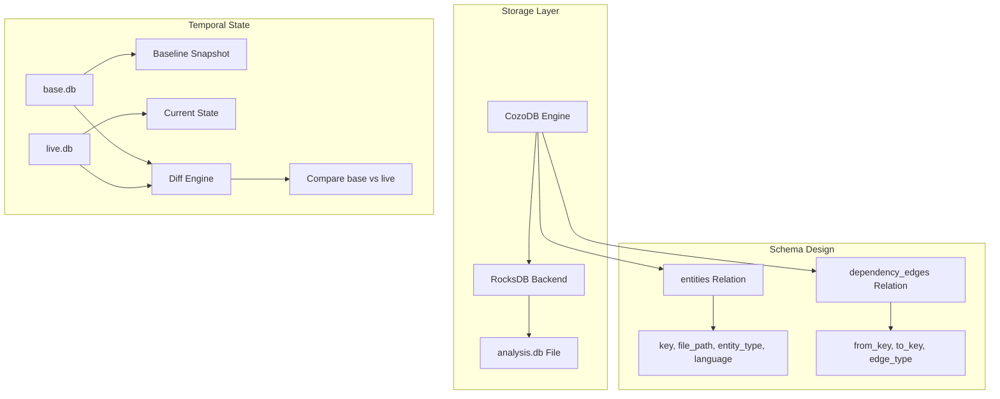

# D09: Parseltongue Core Architecture & Storage Interview Questions

> 100 interview questions for the creator of parseltongue about storage architecture, database design, entity/edge schema, and core system decisions.

---

## Document Overview

| Attribute | Value |
|-----------|-------|
| Focus Area | Core Architecture & Storage |
| Question Count | 100 |
| Target | Project Creator/Architect |
| Parseltongue Stats | 291 entities, 5,275 edges |

---

## Parseltongue Storage Architecture

---

## Section 1: CozoDB Selection (Questions 1-25)

### Why CozoDB?

| # | Question | Prob | Depth | Tags |
|---|----------|------|-------|------|
| 1 | Why did you choose CozoDB over Neo4j for the dependency graph storage? | 5 | Deep | `database`, `architecture` |
| 2 | What specific features of CozoDB made it suitable for code dependency analysis? | 5 | Deep | `database`, `design` |
| 3 | How does CozoDB's Datalog query language compare to Cypher for your use case? | 4 | Deep | `query-language`, `comparison` |
| 4 | Why did you choose an embedded database approach over client-server architecture? | 5 | Medium | `architecture`, `deployment` |
| 5 | What are the trade-offs of using CozoDB vs a traditional SQL database for graph data? | 4 | Deep | `database`, `trade-offs` |
| 6 | How does CozoDB's storage engine affect query performance for transitive closure operations? | 4 | Deep | `performance`, `algorithms` |
| 7 | Did you evaluate DGraph, Tigergraph, or other graph databases? Why weren't they chosen? | 4 | Medium | `alternatives`, `evaluation` |
| 8 | How does CozoDB handle concurrent reads during live file watching? | 4 | Deep | `concurrency`, `file-watching` |
| 9 | What's the memory footprint of CozoDB for a codebase with 10,000 entities? | 3 | Medium | `performance`, `scaling` |
| 10 | How does CozoDB's Datalog implementation differ from traditional Prolog-based systems? | 3 | Deep | `query-language`, `theory` |

### RocksDB Backend

| # | Question | Prob | Depth | Tags |
|---|----------|------|-------|------|
| 11 | Why did you choose RocksDB as the backend storage engine? | 5 | Medium | `storage`, `rocksdb` |
| 12 | How does RocksDB's LSM-tree structure affect write vs read performance for your workload? | 4 | Deep | `performance`, `internals` |
| 13 | What compaction strategy do you use for the dependency graph database? | 3 | Deep | `rocksdb`, `tuning` |
| 14 | How do you handle RocksDB's write amplification for frequent entity updates? | 3 | Deep | `performance`, `writes` |
| 15 | What's the database file size for parseltongue's own 291 entities and 5,275 edges? | 3 | Surface | `metrics`, `storage` |
| 16 | How does the `rocksdb:` URI scheme work in your database path specification? | 4 | Medium | `api`, `configuration` |
| 17 | Did you consider SQLite or other embedded databases as alternatives to RocksDB? | 3 | Medium | `alternatives`, `evaluation` |
| 18 | How do you handle database corruption recovery in RocksDB? | 3 | Medium | `reliability`, `recovery` |
| 19 | What are the implications of RocksDB's single-writer model for your architecture? | 4 | Deep | `concurrency`, `limitations` |
| 20 | How does CozoDB's abstraction layer affect your ability to tune RocksDB parameters? | 3 | Deep | `internals`, `tuning` |

### Datalog Query Language

| # | Question | Prob | Depth | Tags |
|---|----------|------|-------|------|
| 21 | How does Datalog's declarative nature simplify dependency graph queries? | 4 | Medium | `query-language`, `benefits` |
| 22 | What's an example of a complex transitive closure query in your Datalog implementation? | 4 | Deep | `examples`, `queries` |
| 23 | How do you handle recursive queries for blast radius calculation in Datalog? | 5 | Deep | `algorithms`, `recursion` |
| 24 | What are the performance characteristics of Datalog vs SQL for graph traversal? | 4 | Deep | `performance`, `comparison` |
| 25 | How does CozoDB's semi-naive evaluation affect query performance? | 3 | Deep | `internals`, `optimization` |

---

## Section 2: Entity/Edge Schema Design (Questions 26-50)

### Entity Schema

| # | Question | Prob | Depth | Tags |
|---|----------|------|-------|------|
| 26 | Explain the entity key format: `language:type:name:file_path:line_range`. Why this structure? | 5 | Deep | `schema`, `design` |
| 27 | Why include line range in the entity key rather than as a separate attribute? | 4 | Deep | `schema`, `trade-offs` |
| 28 | How do you handle entity key collisions when two functions have the same name in different scopes? | 5 | Deep | `collisions`, `scoping` |
| 29 | What entity types does parseltongue extract (function, method, struct, enum, impl, etc.)? | 4 | Medium | `entity-types`, `extraction` |
| 30 | How do you differentiate between a Rust `fn` and a Rust `method` in the entity type? | 4 | Medium | `rust`, `entity-types` |
| 31 | Why did you choose to store `file_path` both in the key and as a separate attribute? | 3 | Medium | `schema`, `redundancy` |
| 32 | How do you handle entities that span multiple files (e.g., partial classes in C#)? | 3 | Deep | `edge-cases`, `design` |
| 33 | What's the `entity_class` field (CODE vs TEST) used for and how is it determined? | 4 | Medium | `classification`, `testing` |
| 34 | How do you handle anonymous functions or closures in the entity schema? | 3 | Deep | `edge-cases`, `closures` |
| 35 | What's the maximum entity key length and how do you handle very long file paths? | 2 | Surface | `limits`, `edge-cases` |

### Edge Schema

| # | Question | Prob | Depth | Tags |
|---|----------|------|-------|------|
| 36 | What edge types exist in parseltongue (calls, imports, inherits, implements)? | 4 | Medium | `edge-types`, `schema` |
| 37 | How do you determine the edge type when a function calls another function? | 4 | Medium | `detection`, `edges` |
| 38 | Why store edges as a separate relation rather than embedded in entities? | 4 | Deep | `schema`, `normalization` |
| 39 | How do you handle bidirectional relationships (A depends on B, B depends on A)? | 4 | Medium | `bidirectional`, `cycles` |
| 40 | What's the cardinality of edges in your schema (one-to-many, many-to-many)? | 3 | Medium | `schema`, `cardinality` |
| 41 | How do you handle duplicate edges (same from/to/type but different occurrences)? | 3 | Medium | `deduplication`, `edges` |
| 42 | Why did you choose `from_key` and `to_key` naming rather than `source` and `target`? | 2 | Surface | `naming`, `conventions` |
| 43 | How do you represent edge weight or strength in the schema? | 3 | Medium | `weights`, `schema` |
| 44 | What's the edge count ratio to entity count (5,275 / 291 = ~18) and what does this indicate? | 4 | Medium | `metrics`, `analysis` |
| 45 | How do you handle edges to external dependencies (e.g., standard library calls)? | 4 | Deep | `external`, `boundaries` |

### Key Normalization

| # | Question | Prob | Depth | Tags |
|---|----------|------|-------|------|
| 46 | What is "stable identity" in the context of entity keys? | 5 | Deep | `normalization`, `identity` |
| 47 | How does `KeyNormalizer` handle entity renames between base and live databases? | 5 | Deep | `diff`, `tracking` |
| 48 | Why do you sanitize paths with `__` instead of `/` in entity keys? | 4 | Medium | `normalization`, `paths` |
| 49 | How do you detect relocated entities (same code, different file location)? | 4 | Deep | `diff`, `relocation` |
| 50 | What's the algorithm for extracting stable identity from a full entity key? | 4 | Deep | `algorithms`, `identity` |

---

## Section 3: Temporal State Management (Questions 51-75)

### Base vs Live Databases

| # | Question | Prob | Depth | Tags |
|---|----------|------|-------|------|
| 51 | Explain the dual-database architecture: base.db vs live.db. Why two databases? | 5 | Deep | `architecture`, `temporal` |
| 52 | When is base.db created and when is it updated? | 4 | Medium | `lifecycle`, `baseline` |
| 53 | How does live.db get updated during file watching? | 4 | Medium | `file-watching`, `updates` |
| 54 | What happens when you want to "reset" the baseline to current state? | 3 | Medium | `reset`, `workflow` |
| 55 | How do you handle the case where base.db and live.db are on different git branches? | 4 | Deep | `git`, `branches` |
| 56 | What's the disk space overhead of maintaining two separate databases? | 2 | Surface | `storage`, `overhead` |
| 57 | How do you synchronize access between base and live databases during diff? | 4 | Deep | `concurrency`, `synchronization` |
| 58 | Can you have multiple live.db files for different "what-if" scenarios? | 3 | Medium | `scenarios`, `branching` |
| 59 | How long does it take to copy base.db to initialize a new live.db? | 2 | Surface | `performance`, `initialization` |
| 60 | What's stored in the workspace metadata that references these databases? | 3 | Medium | `workspace`, `metadata` |

### Diff Computation

| # | Question | Prob | Depth | Tags |
|---|----------|------|-------|------|
| 61 | How does the diff engine compare entities between base and live databases? | 5 | Deep | `diff`, `algorithm` |
| 62 | What's the time complexity of computing a diff between two database snapshots? | 4 | Deep | `performance`, `complexity` |
| 63 | How do you categorize changes: added, removed, modified, relocated? | 4 | Medium | `diff`, `categories` |
| 64 | What constitutes a "modified" entity vs a "relocated" entity? | 4 | Deep | `diff`, `semantics` |
| 65 | How do you compute edge diffs when entity keys change? | 4 | Deep | `diff`, `edges` |
| 66 | What's the DiffSummary data structure and what fields does it contain? | 3 | Medium | `data-structures`, `summary` |
| 67 | How do you handle the case where a file is renamed but content is unchanged? | 4 | Deep | `renames`, `tracking` |
| 68 | What's the memory usage during diff computation for large codebases? | 3 | Medium | `performance`, `memory` |
| 69 | How do you optimize diff computation when only a few files changed? | 4 | Deep | `optimization`, `incremental` |
| 70 | Can you compute a diff between any two arbitrary database snapshots? | 3 | Medium | `flexibility`, `snapshots` |

### Workspace Management

| # | Question | Prob | Depth | Tags |
|---|----------|------|-------|------|
| 71 | What is a "workspace" in parseltongue's terminology? | 4 | Medium | `concepts`, `workspace` |
| 72 | How is workspace_identifier_value generated? | 3 | Medium | `identifiers`, `generation` |
| 73 | What metadata is stored for each workspace (paths, timestamps, watch status)? | 3 | Medium | `metadata`, `storage` |
| 74 | How do you handle multiple workspaces pointing to overlapping directories? | 3 | Deep | `edge-cases`, `overlap` |
| 75 | Where is workspace metadata persisted on disk? | 2 | Surface | `storage`, `location` |

---

## Section 4: Data Operations & Queries (Questions 76-100)

### CRUD Operations

| # | Question | Prob | Depth | Tags |
|---|----------|------|-------|------|
| 76 | What's the implementation of `insert_entity()` in CozoDbStorage? | 4 | Deep | `implementation`, `crud` |
| 77 | How does `delete_entity()` handle cascading edge deletions? | 4 | Deep | `cascading`, `deletion` |
| 78 | What's the batch insert strategy for indexing a large directory? | 4 | Deep | `batching`, `performance` |
| 79 | How do you implement upsert (insert or update) for entities? | 3 | Medium | `upsert`, `operations` |
| 80 | What transactions does CozoDB support and how do you use them? | 4 | Deep | `transactions`, `acid` |
| 81 | How do you handle partial failures during batch operations? | 3 | Deep | `error-handling`, `atomicity` |
| 82 | What's the performance difference between single and batch inserts? | 3 | Medium | `performance`, `comparison` |
| 83 | How do you implement `get_entity()` and what's the lookup complexity? | 3 | Medium | `lookup`, `complexity` |
| 84 | What indexes exist on the entity and edge relations? | 4 | Deep | `indexes`, `performance` |
| 85 | How do you query entities by file path efficiently? | 3 | Medium | `queries`, `filtering` |

### Graph Queries

| # | Question | Prob | Depth | Tags |
|---|----------|------|-------|------|
| 86 | How do you implement `get_forward_dependencies()` (what this entity calls)? | 4 | Deep | `queries`, `forward` |
| 87 | How do you implement `get_reverse_dependencies()` (what calls this entity)? | 4 | Deep | `queries`, `reverse` |
| 88 | What's the Datalog query for computing transitive closure up to N hops? | 5 | Deep | `datalog`, `transitive` |
| 89 | How do you implement `calculate_blast_radius()` at the storage layer? | 5 | Deep | `blast-radius`, `storage` |
| 90 | How does the `get_transitive_closure()` method work internally? | 4 | Deep | `algorithms`, `closure` |
| 91 | What's the query for finding all entities in a specific file? | 3 | Medium | `queries`, `filtering` |
| 92 | How do you query for orphan entities (no incoming or outgoing edges)? | 3 | Medium | `queries`, `orphans` |
| 93 | What's the most expensive query in the current implementation? | 4 | Medium | `performance`, `bottlenecks` |
| 94 | How do you paginate results for the `/code-entities-list-all` endpoint? | 3 | Medium | `pagination`, `api` |
| 95 | How do you implement fuzzy search on entity names? | 3 | Medium | `search`, `fuzzy` |

### Performance & Optimization

| # | Question | Prob | Depth | Tags |
|---|----------|------|-------|------|
| 96 | What caching strategies exist for frequently accessed queries? | 3 | Medium | `caching`, `performance` |
| 97 | How do you measure and report query latencies? | 3 | Medium | `metrics`, `observability` |
| 98 | What's the indexing time for parseltongue's own 291 entities? | 3 | Surface | `benchmarks`, `performance` |
| 99 | How do you handle very large codebases (100k+ entities)? | 4 | Deep | `scaling`, `limits` |
| 100 | What optimizations would you implement for 10x scale increase? | 4 | Deep | `scaling`, `roadmap` |

---

## Key Architecture Diagram

---

## Answer Framework for Storage Questions

When answering questions about storage architecture:

1. **State the decision**: What was chosen (CozoDB + RocksDB)
2. **Explain the rationale**: Why this over alternatives
3. **Acknowledge trade-offs**: What was sacrificed
4. **Provide metrics**: Concrete numbers where available
5. **Discuss evolution**: How it might change with scale

### Example Answer Template

**Q: Why CozoDB over Neo4j?**

"CozoDB was chosen for three primary reasons:

1. **Embedded deployment**: Parseltongue is distributed as a single binary. CozoDB with RocksDB backend allows zero-dependency deployment without a separate database server.

2. **Datalog for graph queries**: The recursive nature of dependency analysis (blast radius, transitive closure) maps naturally to Datalog's declarative recursion.

3. **Performance for small-to-medium graphs**: For codebases up to 100k entities, CozoDB provides sub-100ms query times without the operational complexity of a distributed graph database.

Trade-offs include:
- No built-in replication or clustering
- Less mature ecosystem than Neo4j
- Limited visualization tooling"

---

## Statistics Reference

| Metric | Parseltongue Self-Analysis |
|--------|---------------------------|
| Total Entities | 291 |
| Total Edges | 5,275 |
| Edge/Entity Ratio | 18.1 |
| Languages | 1 (Rust) |
| Semantic Clusters | 93 |
| Circular Dependencies | 0 |

---

*Generated for parseltongue-dependency-graph-generator architecture interview preparation*
