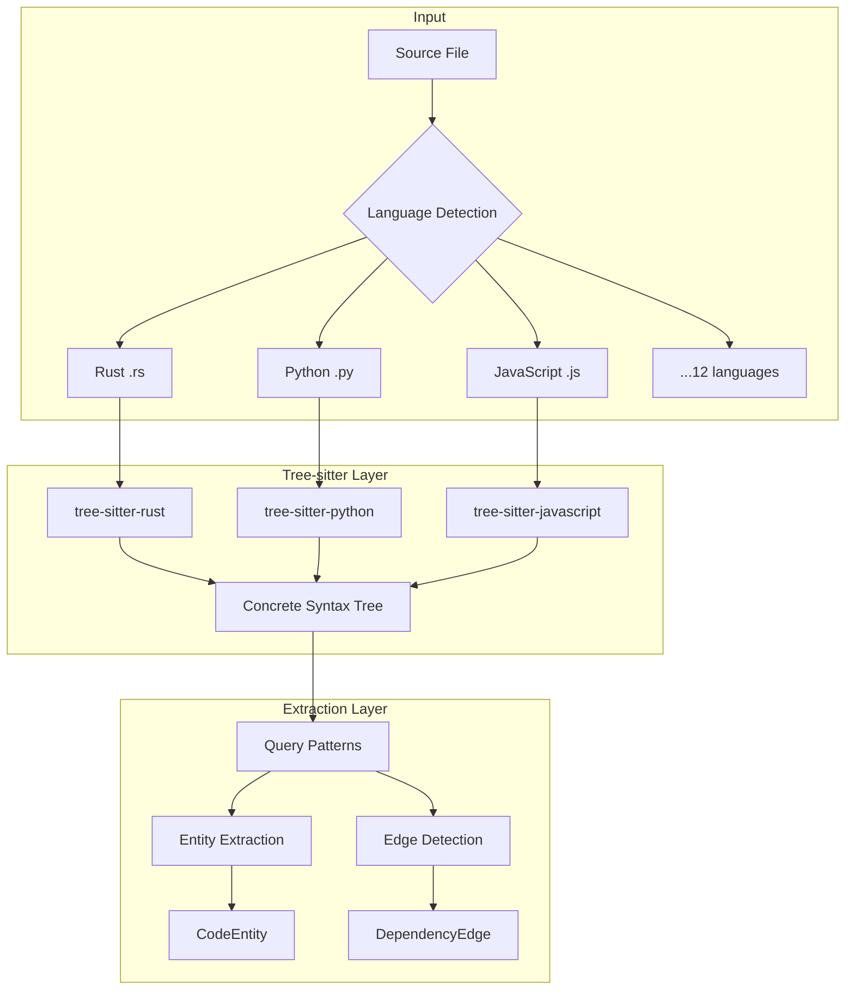
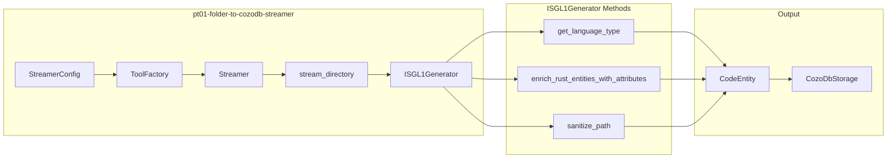

# D10: Parseltongue Parsing & Language Support Interview Questions

> 100 interview questions for the creator of parseltongue about tree-sitter integration, multi-language support, entity extraction, and parsing architecture.

---

## Document Overview

| Attribute | Value |
|-----------|-------|
| Focus Area | Parsing & Language Support |
| Question Count | 100 |
| Target | Project Creator/Architect |
| Languages Supported | 12 (Rust, Python, JS, TS, Go, Java, C, C++, Ruby, PHP, C#, Swift) |

---

## Parsing Architecture

---

## Section 1: Tree-sitter Architecture (Questions 1-25)

### Why Tree-sitter?

| # | Question | Prob | Depth | Tags |
|---|----------|------|-------|------|
| 1 | Why did you choose tree-sitter over other parsing approaches (regex, LSP, syn)? | 5 | Deep | `tree-sitter`, `architecture` |
| 2 | How does tree-sitter's incremental parsing capability benefit parseltongue? | 4 | Deep | `incremental`, `performance` |
| 3 | What are the advantages of tree-sitter's CST vs an AST for dependency analysis? | 4 | Deep | `cst-vs-ast`, `theory` |
| 4 | How does tree-sitter's error recovery affect your parsing robustness? | 4 | Medium | `error-handling`, `robustness` |
| 5 | Why not use rust-analyzer or language-specific tools for each language? | 5 | Deep | `alternatives`, `trade-offs` |
| 6 | How does tree-sitter's query language compare to pattern matching in syn? | 4 | Deep | `queries`, `comparison` |
| 7 | What's the memory footprint of tree-sitter grammars for 12 languages? | 3 | Medium | `memory`, `performance` |
| 8 | How do you handle tree-sitter grammar updates and breaking changes? | 3 | Medium | `maintenance`, `versioning` |
| 9 | What's the parsing speed of tree-sitter compared to traditional parsers? | 3 | Medium | `benchmarks`, `performance` |
| 10 | How does tree-sitter handle preprocessor directives in C/C++? | 4 | Deep | `c-cpp`, `preprocessing` |

### Tree-sitter Integration

| # | Question | Prob | Depth | Tags |
|---|----------|------|-------|------|
| 11 | How do you load and initialize tree-sitter grammars in Rust? | 4 | Medium | `initialization`, `rust` |
| 12 | Explain the `QueryBasedExtractor` architecture in parseltongue-core. | 5 | Deep | `architecture`, `extractor` |
| 13 | How does `init_parser()` method handle language detection and grammar loading? | 4 | Deep | `implementation`, `loading` |
| 14 | What's the lifecycle of a tree-sitter Parser object during file processing? | 3 | Medium | `lifecycle`, `memory` |
| 15 | How do you manage tree-sitter's thread safety requirements? | 4 | Deep | `concurrency`, `threading` |
| 16 | What happens when a tree-sitter grammar doesn't exist for a file extension? | 3 | Medium | `fallback`, `edge-cases` |
| 17 | How do you handle files with embedded languages (e.g., HTML with JavaScript)? | 4 | Deep | `embedded`, `multi-language` |
| 18 | What's the strategy for caching parsed syntax trees? | 3 | Medium | `caching`, `optimization` |
| 19 | How does tree-sitter handle malformed or incomplete source files? | 4 | Medium | `error-recovery`, `robustness` |
| 20 | What tree-sitter crate version does parseltongue use and why? | 2 | Surface | `versions`, `dependencies` |

### Query Patterns

| # | Question | Prob | Depth | Tags |
|---|----------|------|-------|------|
| 21 | How do tree-sitter queries work for entity extraction? | 5 | Deep | `queries`, `extraction` |
| 22 | What's an example of a tree-sitter query for Rust function detection? | 4 | Deep | `examples`, `rust` |
| 23 | How do you use captures (@name) in tree-sitter queries for parseltongue? | 4 | Medium | `captures`, `queries` |
| 24 | How do you handle language-specific query patterns while maintaining uniformity? | 4 | Deep | `abstraction`, `design` |
| 25 | What's the performance impact of complex vs simple tree-sitter queries? | 3 | Medium | `performance`, `queries` |

---

## Section 2: Multi-Language Support (Questions 26-50)

### Language Architecture

| # | Question | Prob | Depth | Tags |
|---|----------|------|-------|------|
| 26 | How does parseltongue support 12 languages with a unified architecture? | 5 | Deep | `architecture`, `multi-language` |
| 27 | What's the `get_language_type()` method and how does it work? | 4 | Medium | `implementation`, `detection` |
| 28 | How do you map file extensions to tree-sitter languages? | 3 | Medium | `mapping`, `extensions` |
| 29 | What's the `get_ts_language()` method's role in grammar loading? | 4 | Medium | `grammars`, `loading` |
| 30 | How do you handle files with no extension or ambiguous extensions? | 3 | Medium | `edge-cases`, `detection` |
| 31 | Why store the language as a string in entity keys rather than an enum? | 3 | Medium | `schema`, `trade-offs` |
| 32 | How do you handle language-specific constructs that don't exist in all languages? | 4 | Deep | `abstraction`, `normalization` |
| 33 | What's the strategy for adding support for a new language? | 4 | Deep | `extensibility`, `process` |
| 34 | How do you ensure consistent entity types across different languages? | 4 | Deep | `consistency`, `types` |
| 35 | What languages were hardest to support and why? | 4 | Medium | `challenges`, `languages` |

### Language-Specific Questions

| # | Question | Prob | Depth | Tags |
|---|----------|------|-------|------|
| 36 | How do you handle Rust's macro-generated code and proc macros? | 5 | Deep | `rust`, `macros` |
| 37 | How do you differentiate Rust `fn` vs `method` vs `associated function`? | 4 | Deep | `rust`, `entity-types` |
| 38 | How do you handle Python's dynamic nature and duck typing for edge detection? | 4 | Deep | `python`, `dynamic` |
| 39 | How do you handle JavaScript's CommonJS vs ES modules for import detection? | 4 | Deep | `javascript`, `modules` |
| 40 | How do you handle TypeScript type annotations vs JavaScript? | 4 | Medium | `typescript`, `types` |
| 41 | How do you handle Go's implicit interfaces for dependency detection? | 4 | Deep | `go`, `interfaces` |
| 42 | How do you handle Java's package structure and import wildcards? | 3 | Medium | `java`, `imports` |
| 43 | How do you handle C/C++ header files and forward declarations? | 4 | Deep | `c-cpp`, `headers` |
| 44 | How do you handle Ruby's metaprogramming and method_missing? | 3 | Deep | `ruby`, `metaprogramming` |
| 45 | How do you handle PHP's namespaces and use statements? | 3 | Medium | `php`, `namespaces` |
| 46 | How do you handle C#'s partial classes spanning multiple files? | 3 | Deep | `csharp`, `partial` |
| 47 | How do you handle Swift's extensions and protocol conformance? | 3 | Deep | `swift`, `extensions` |
| 48 | What entity types are extracted for each of the 12 languages? | 4 | Medium | `entity-types`, `comprehensive` |
| 49 | How do you handle language version differences (Python 2 vs 3, ES5 vs ES6)? | 3 | Medium | `versions`, `compatibility` |
| 50 | Which language has the most comprehensive support and why? | 3 | Medium | `maturity`, `coverage` |

---

## Section 3: Entity Extraction (Questions 51-75)

### Extraction Architecture

| # | Question | Prob | Depth | Tags |
|---|----------|------|-------|------|
| 51 | Explain the `process_match()` method in QueryBasedExtractor. | 5 | Deep | `implementation`, `extraction` |
| 52 | How does `execute_query()` coordinate tree-sitter queries with captures? | 4 | Deep | `queries`, `coordination` |
| 53 | What's the data flow from tree-sitter match to CodeEntity creation? | 4 | Deep | `data-flow`, `transformation` |
| 54 | How do you extract the entity name from different language constructs? | 4 | Medium | `extraction`, `names` |
| 55 | How do you determine line ranges (start, end) for extracted entities? | 3 | Medium | `line-ranges`, `positions` |
| 56 | How do you handle nested entities (function inside a class)? | 4 | Deep | `nesting`, `hierarchy` |
| 57 | What's the `find_containing_entity()` method used for? | 4 | Deep | `context`, `containment` |
| 58 | How do you handle anonymous or unnamed entities? | 3 | Medium | `anonymous`, `edge-cases` |
| 59 | How do you extract entity signatures for method overloading differentiation? | 4 | Deep | `signatures`, `overloading` |
| 60 | What metadata beyond name and type is extracted for each entity? | 3 | Medium | `metadata`, `attributes` |

### Entity Classification

| # | Question | Prob | Depth | Tags |
|---|----------|------|-------|------|
| 61 | How does the CODE vs TEST entity classification work? | 5 | Deep | `classification`, `testing` |
| 62 | What heuristics determine if a file or entity is test code? | 4 | Deep | `heuristics`, `detection` |
| 63 | How do you handle test fixtures and helper functions in test files? | 3 | Medium | `fixtures`, `helpers` |
| 64 | What's the `enrich_rust_entities_with_attributes()` method doing? | 4 | Deep | `enrichment`, `rust` |
| 65 | How do you classify Rust functions with `#[test]` or `#[tokio::test]` attributes? | 4 | Medium | `attributes`, `rust` |
| 66 | How do you handle benchmark code vs test code vs production code? | 3 | Medium | `classification`, `benchmarks` |
| 67 | What's the entity_class field used for in downstream analysis? | 3 | Medium | `usage`, `filtering` |
| 68 | How accurate is your test classification across different languages? | 3 | Medium | `accuracy`, `validation` |
| 69 | Can users override automatic entity classification? | 2 | Surface | `configuration`, `overrides` |
| 70 | How do you handle integration tests vs unit tests classification? | 3 | Medium | `test-types`, `classification` |

### Edge Detection

| # | Question | Prob | Depth | Tags |
|---|----------|------|-------|------|
| 71 | How does `process_dependency_match()` detect function calls? | 5 | Deep | `dependencies`, `calls` |
| 72 | How does `execute_dependency_query()` find edges between entities? | 4 | Deep | `queries`, `edges` |
| 73 | How do you detect import/use statements for module dependencies? | 4 | Medium | `imports`, `modules` |
| 74 | How do you handle indirect dependencies (A calls B, B calls C)? | 4 | Deep | `transitive`, `indirect` |
| 75 | How do you differentiate between function call edges and inheritance edges? | 3 | Medium | `edge-types`, `differentiation` |

---

## Section 4: Performance & Optimization (Questions 76-100)

### Parsing Performance

| # | Question | Prob | Depth | Tags |
|---|----------|------|-------|------|
| 76 | What's the parsing time per file for different file sizes? | 3 | Medium | `benchmarks`, `per-file` |
| 77 | How long does it take to index parseltongue's own 291 entities? | 3 | Surface | `benchmarks`, `self-analysis` |
| 78 | What's the bottleneck in parsing: I/O, tree-sitter, or extraction? | 4 | Deep | `bottlenecks`, `profiling` |
| 79 | How do you parallelize parsing across multiple files? | 4 | Deep | `parallelism`, `concurrency` |
| 80 | What's the memory usage during parsing of a large codebase? | 3 | Medium | `memory`, `scaling` |
| 81 | How do you handle very large files (10k+ lines)? | 3 | Medium | `large-files`, `limits` |
| 82 | What's the strategy for streaming extraction vs batch extraction? | 4 | Deep | `streaming`, `architecture` |
| 83 | How does `stream_directory()` in pt01 crate work? | 4 | Deep | `implementation`, `streaming` |
| 84 | How do you handle parsing failures for individual files without failing the whole job? | 3 | Medium | `error-handling`, `resilience` |
| 85 | What file types are explicitly excluded from parsing? | 2 | Surface | `filtering`, `exclusions` |

### Incremental Updates

| # | Question | Prob | Depth | Tags |
|---|----------|------|-------|------|
| 86 | How would incremental parsing work with tree-sitter's edit API? | 5 | Deep | `incremental`, `tree-sitter` |
| 87 | What's the current state of the `trigger_incremental_reindex_update()` stub? | 4 | Deep | `implementation`, `gaps` |
| 88 | How do you detect which entities changed within a modified file? | 4 | Deep | `delta`, `detection` |
| 89 | What's the strategy for invalidating cached parse results? | 3 | Medium | `caching`, `invalidation` |
| 90 | How do you handle the case where a file modification adds vs removes entities? | 3 | Medium | `updates`, `delta` |
| 91 | What's the expected latency for incremental updates after file save? | 4 | Medium | `latency`, `targets` |
| 92 | How do you batch multiple rapid file changes (debouncing)? | 4 | Medium | `debouncing`, `batching` |
| 93 | What's the 500ms debounce window based on? | 3 | Surface | `configuration`, `rationale` |
| 94 | How does incremental parsing interact with the base/live database model? | 4 | Deep | `architecture`, `integration` |
| 95 | What's the roadmap for sub-100ms incremental updates? | 3 | Medium | `roadmap`, `targets` |

### Optimization Strategies

| # | Question | Prob | Depth | Tags |
|---|----------|------|-------|------|
| 96 | What path filtering rules exist for ignoring non-source files? | 3 | Medium | `filtering`, `paths` |
| 97 | How do you handle `target/`, `node_modules/`, `.git/` exclusions? | 3 | Medium | `exclusions`, `common` |
| 98 | What optimizations exist for re-parsing unchanged files? | 3 | Medium | `optimization`, `unchanged` |
| 99 | How do you prioritize which files to parse first for user feedback? | 3 | Medium | `priority`, `ux` |
| 100 | What would you change in the parsing architecture for 10x scale? | 4 | Deep | `scaling`, `future` |

---

## ISGL1 Generator Architecture

---

## Answer Framework for Parsing Questions

When answering questions about parsing architecture:

1. **Explain tree-sitter's role**: Concrete syntax trees, queries, captures
2. **Describe the abstraction**: How you normalize across 12 languages
3. **Show specific examples**: Query patterns, entity extraction
4. **Address limitations**: What tree-sitter can't do, workarounds
5. **Discuss performance**: Actual benchmarks, scaling characteristics

### Example Answer Template

**Q: Why tree-sitter over rust-analyzer/syn?**

"Tree-sitter was chosen for multi-language consistency:

1. **Universal API**: The same query-based extraction approach works for all 12 supported languages. Using rust-analyzer for Rust, pyright for Python, etc. would require 12 different integration patterns.

2. **Syntax vs Semantics**: Parseltongue needs syntax-level extraction (what functions exist, what calls what). Tree-sitter provides this directly without the overhead of full semantic analysis.

3. **Performance**: Tree-sitter parses at ~100k lines/second with incremental capabilities. Language servers like rust-analyzer are designed for IDE interactions, not batch analysis.

4. **Error recovery**: Tree-sitter produces a complete tree even for malformed code, which is essential for analyzing work-in-progress code.

Trade-offs:
- No type information (can't resolve dynamic dispatch)
- No macro expansion (Rust proc macros are opaque)
- Limited semantic understanding (can't detect dead code)"

---

## Language Support Matrix

| Language | Grammar | Entity Types | Edge Types | Maturity |
|----------|---------|--------------|------------|----------|
| Rust | tree-sitter-rust | fn, method, struct, enum, impl, trait, macro | calls, uses, implements | High |
| Python | tree-sitter-python | function, class, method | calls, imports | High |
| JavaScript | tree-sitter-javascript | function, class, method, arrow | calls, imports | High |
| TypeScript | tree-sitter-typescript | function, class, method, interface | calls, imports, implements | High |
| Go | tree-sitter-go | func, method, struct, interface | calls, imports | Medium |
| Java | tree-sitter-java | method, class, interface | calls, imports, extends | Medium |
| C | tree-sitter-c | function, struct | calls, includes | Medium |
| C++ | tree-sitter-cpp | function, method, class | calls, includes | Medium |
| Ruby | tree-sitter-ruby | method, class, module | calls, requires | Low |
| PHP | tree-sitter-php | function, class, method | calls, uses | Low |
| C# | tree-sitter-c-sharp | method, class, interface | calls, using | Low |
| Swift | tree-sitter-swift | func, class, struct, protocol | calls, imports | Low |

---

*Generated for parseltongue-dependency-graph-generator parsing interview preparation*
