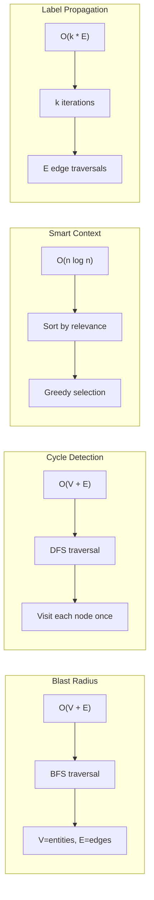

# D11: Parseltongue Algorithms & Analysis Interview Questions

> 100 interview questions for the creator of parseltongue about blast radius calculation, cycle detection, smart context selection, clustering, and other graph algorithms.

---

## Document Overview

| Attribute | Value |
|-----------|-------|
| Focus Area | Algorithms & Analysis |
| Question Count | 100 |
| Target | Project Creator/Architect |
| Key Algorithms | BFS (blast radius), DFS (cycles), Label Propagation, Greedy Knapsack |

---

## Algorithm Overview


---

## Section 1: Blast Radius Algorithm (Questions 1-25)

### Core Algorithm

| # | Question | Prob | Depth | Tags |
|---|----------|------|-------|------|
| 1 | Explain the blast radius algorithm. Why BFS over DFS? | 5 | Deep | `blast-radius`, `bfs` |
| 2 | What does "blast radius" conceptually mean in the context of code changes? | 4 | Medium | `concepts`, `definition` |
| 3 | How does `compute_blast_radius_by_hops()` work in the implementation? | 5 | Deep | `implementation`, `details` |
| 4 | Why is the default max_hops set to 5? What research or data informed this choice? | 4 | Deep | `parameters`, `rationale` |
| 5 | What's the time complexity of the blast radius algorithm? | 4 | Deep | `complexity`, `big-o` |
| 6 | What's the space complexity for tracking visited nodes during BFS? | 3 | Medium | `complexity`, `memory` |
| 7 | How do you handle bidirectional edges in blast radius calculation? | 4 | Deep | `edges`, `direction` |
| 8 | Does blast radius follow caller->callee or callee->caller direction? | 4 | Medium | `direction`, `semantics` |
| 9 | How do you prevent infinite loops in cyclic dependency graphs? | 4 | Deep | `cycles`, `termination` |
| 10 | What's the difference between forward and reverse blast radius? | 4 | Medium | `forward`, `reverse` |

### Implementation Details

| # | Question | Prob | Depth | Tags |
|---|----------|------|-------|------|
| 11 | How does `find_direct_dependents_list()` retrieve first-hop dependencies? | 4 | Deep | `implementation`, `queries` |
| 12 | What data structure do you use for the BFS queue and visited set? | 3 | Medium | `data-structures`, `implementation` |
| 13 | How do you categorize affected entities by hop distance in the output? | 3 | Medium | `output`, `structure` |
| 14 | What's the `normalize_to_stable_identity()` method doing during blast radius? | 4 | Deep | `normalization`, `identity` |
| 15 | How do you handle blast radius for entities that don't exist in the database? | 3 | Medium | `edge-cases`, `missing` |
| 16 | What's the response format of `/blast-radius-impact-analysis` endpoint? | 3 | Medium | `api`, `response` |
| 17 | How long does blast radius calculation take for parseltongue's 291 entities? | 2 | Surface | `performance`, `benchmarks` |
| 18 | How do you optimize blast radius for frequently queried entities? | 3 | Medium | `optimization`, `caching` |
| 19 | Can blast radius be computed incrementally when the graph changes? | 4 | Deep | `incremental`, `updates` |
| 20 | How do you handle test entities in blast radius calculation? | 3 | Medium | `testing`, `filtering` |

### Risk Assessment

| # | Question | Prob | Depth | Tags |
|---|----------|------|-------|------|
| 21 | How do you determine risk level (LOW/MEDIUM/HIGH) from blast radius count? | 4 | Medium | `risk`, `thresholds` |
| 22 | What thresholds define LOW vs MEDIUM vs HIGH risk? | 3 | Surface | `thresholds`, `configuration` |
| 23 | How does entity type (function vs struct) affect risk assessment? | 3 | Medium | `entity-types`, `weighting` |
| 24 | Should test code have different risk weighting than production code? | 3 | Medium | `testing`, `weighting` |
| 25 | How would you incorporate code complexity into risk scoring? | 3 | Deep | `complexity`, `enhancement` |

---

## Section 2: Cycle Detection (Questions 26-50)

### DFS with 3-Color Marking

| # | Question | Prob | Depth | Tags |
|---|----------|------|-------|------|
| 26 | Explain the 3-color (white/gray/black) algorithm for cycle detection. | 5 | Deep | `cycles`, `algorithm` |
| 27 | Why use 3-color DFS instead of simple visited set for cycle detection? | 4 | Deep | `algorithm`, `rationale` |
| 28 | How does `detect_cycles_using_dfs_traversal()` implement the algorithm? | 5 | Deep | `implementation`, `details` |
| 29 | How does `dfs_find_cycles_recursive()` track the current path? | 4 | Deep | `recursion`, `path-tracking` |
| 30 | What does each color represent: white, gray, black? | 4 | Medium | `colors`, `states` |
| 31 | How do you report the actual cycle path (not just "cycle exists")? | 4 | Medium | `output`, `paths` |
| 32 | What's the time complexity of cycle detection for the entire graph? | 3 | Deep | `complexity`, `big-o` |
| 33 | How do you handle multiple separate cycles in the graph? | 4 | Medium | `multiple`, `handling` |
| 34 | How do you handle self-referential cycles (A -> A)? | 3 | Medium | `edge-cases`, `self-ref` |
| 35 | How do you differentiate between direct and indirect cycles? | 3 | Medium | `direct`, `indirect` |

### Cycle Analysis

| # | Question | Prob | Depth | Tags |
|---|----------|------|-------|------|
| 36 | Why are circular dependencies problematic in codebases? | 4 | Medium | `concepts`, `impact` |
| 37 | What types of cycles are acceptable vs problematic? | 3 | Medium | `classification`, `severity` |
| 38 | How do you break cycles in the parseltongue codebase (which has 0 cycles)? | 4 | Medium | `best-practices`, `design` |
| 39 | Should test code cycles be treated differently than production code cycles? | 3 | Medium | `testing`, `policy` |
| 40 | How would you rank cycles by severity or impact? | 3 | Medium | `ranking`, `priority` |
| 41 | What's the response format of `/circular-dependency-detection-scan`? | 3 | Medium | `api`, `response` |
| 42 | How long does full cycle detection take for 291 entities? | 2 | Surface | `performance`, `benchmarks` |
| 43 | Can cycle detection be done incrementally when edges are added? | 4 | Deep | `incremental`, `updates` |
| 44 | How do you visualize detected cycles in the UI? | 3 | Medium | `visualization`, `ui` |
| 45 | What tooling exists to help developers fix detected cycles? | 3 | Medium | `tooling`, `fixes` |

### Graph Theory

| # | Question | Prob | Depth | Tags |
|---|----------|------|-------|------|
| 46 | What's the relationship between cycles and strongly connected components? | 4 | Deep | `theory`, `scc` |
| 47 | Would Tarjan's SCC algorithm be more efficient for cycle detection? | 4 | Deep | `algorithms`, `alternatives` |
| 48 | How do you handle directed vs undirected cycle detection? | 3 | Medium | `direction`, `semantics` |
| 49 | What's the difference between a cycle and a back edge? | 3 | Medium | `terminology`, `theory` |
| 50 | How does cycle detection relate to topological sorting? | 3 | Deep | `theory`, `topological` |

---

## Section 3: Smart Context Selection (Questions 51-75)

### Greedy Knapsack Algorithm

| # | Question | Prob | Depth | Tags |
|---|----------|------|-------|------|
| 51 | Explain the greedy knapsack algorithm for smart context selection. | 5 | Deep | `smart-context`, `algorithm` |
| 52 | What's the "token budget" constraint and why is it important for LLMs? | 5 | Deep | `llm`, `constraints` |
| 53 | How does `build_smart_context_selection()` work? | 5 | Deep | `implementation`, `details` |
| 54 | What's the relevance scoring formula for entities? | 5 | Deep | `scoring`, `formula` |
| 55 | Why greedy knapsack over dynamic programming for this problem? | 4 | Deep | `algorithm`, `trade-offs` |
| 56 | How do you estimate token count for a code entity? | 4 | Medium | `tokens`, `estimation` |
| 57 | What's `estimate_entity_tokens()` implementation? | 4 | Medium | `implementation`, `tokens` |
| 58 | What's the time complexity of the greedy selection algorithm? | 3 | Medium | `complexity`, `big-o` |
| 59 | How do you handle the case where no entities fit in the budget? | 3 | Medium | `edge-cases`, `empty` |
| 60 | What's the default token budget and why? | 3 | Surface | `defaults`, `rationale` |

### Relevance Scoring

| # | Question | Prob | Depth | Tags |
|---|----------|------|-------|------|
| 61 | How do direct callers score (1.0) compared to callees (0.95)? | 4 | Deep | `scoring`, `weights` |
| 62 | What's the transitive depth scoring formula: 0.7 - (0.1 * N)? | 4 | Deep | `scoring`, `transitive` |
| 63 | Why do callers score higher than callees in relevance? | 4 | Medium | `rationale`, `semantics` |
| 64 | How do you handle entities with multiple relationship paths? | 4 | Deep | `paths`, `scoring` |
| 65 | Should entity type (function vs struct) affect relevance scoring? | 3 | Medium | `entity-types`, `weighting` |
| 66 | How do you incorporate code similarity into relevance? | 3 | Deep | `similarity`, `enhancement` |
| 67 | How do you handle scoring for entities with no dependencies? | 3 | Medium | `edge-cases`, `orphans` |
| 68 | What's the minimum relevance score to include an entity? | 2 | Surface | `thresholds`, `filtering` |
| 69 | How do you break ties when multiple entities have the same score? | 3 | Medium | `ties`, `ordering` |
| 70 | How would you incorporate user history into relevance scoring? | 3 | Deep | `personalization`, `history` |

### LLM Integration

| # | Question | Prob | Depth | Tags |
|---|----------|------|-------|------|
| 71 | How is smart context used in LLM tool calling scenarios? | 5 | Deep | `llm`, `integration` |
| 72 | What's the response format of `/smart-context-token-budget`? | 3 | Medium | `api`, `response` |
| 73 | How do you format the selected context for LLM consumption? | 4 | Medium | `formatting`, `output` |
| 74 | Should you include file content or just entity metadata in context? | 4 | Medium | `content`, `granularity` |
| 75 | How does smart context relate to the MCP server integration? | 4 | Deep | `mcp`, `integration` |

---

## Section 4: Clustering & Hotspots (Questions 76-100)

### Label Propagation Clustering

| # | Question | Prob | Depth | Tags |
|---|----------|------|-------|------|
| 76 | Explain the label propagation algorithm for semantic clustering. | 5 | Deep | `clustering`, `algorithm` |
| 77 | Why label propagation over k-means or spectral clustering? | 4 | Deep | `algorithm`, `comparison` |
| 78 | How does `run_label_propagation_clustering()` implement the algorithm? | 4 | Deep | `implementation`, `details` |
| 79 | What defines "semantic similarity" for clustering entities? | 4 | Deep | `semantics`, `similarity` |
| 80 | How many iterations does label propagation run before convergence? | 3 | Medium | `convergence`, `iterations` |
| 81 | What's the stopping criterion for label propagation? | 3 | Medium | `stopping`, `convergence` |
| 82 | How do you handle isolated nodes with no neighbors? | 3 | Medium | `edge-cases`, `isolated` |
| 83 | What's the expected number of clusters for a given graph size? | 3 | Medium | `scaling`, `expectations` |
| 84 | Why did parseltongue's 291 entities form 93 clusters? | 4 | Medium | `analysis`, `structure` |
| 85 | How do you label or name the resulting clusters? | 3 | Medium | `naming`, `labeling` |

### Complexity Hotspots

| # | Question | Prob | Depth | Tags |
|---|----------|------|-------|------|
| 86 | How do you define and measure "complexity hotspots"? | 4 | Deep | `hotspots`, `definition` |
| 87 | What metrics determine hotspot ranking (coupling, churn, etc.)? | 4 | Deep | `metrics`, `ranking` |
| 88 | How does `calculate_entity_coupling_scores()` work? | 4 | Deep | `implementation`, `coupling` |
| 89 | What's the difference between afferent and efferent coupling? | 3 | Medium | `coupling`, `types` |
| 90 | How do you combine fan-in and fan-out into a single hotspot score? | 3 | Medium | `scoring`, `combination` |
| 91 | What's the response format of `/complexity-hotspots-ranking-view`? | 3 | Medium | `api`, `response` |
| 92 | How do you filter hotspots by file or module? | 2 | Surface | `filtering`, `scoping` |
| 93 | What thresholds define a "hotspot" worthy of attention? | 3 | Medium | `thresholds`, `alerting` |
| 94 | How would you incorporate code churn (git history) into hotspot scoring? | 4 | Deep | `git`, `churn` |
| 95 | How do hotspots correlate with bug density in practice? | 3 | Medium | `correlation`, `bugs` |

### Graph Analysis Extensions

| # | Question | Prob | Depth | Tags |
|---|----------|------|-------|------|
| 96 | What other graph algorithms would be valuable to add? | 4 | Deep | `roadmap`, `algorithms` |
| 97 | How would you implement PageRank for entity importance? | 4 | Deep | `pagerank`, `ranking` |
| 98 | How would you detect architectural boundaries or layers? | 4 | Deep | `architecture`, `boundaries` |
| 99 | How would you measure codebase modularity quantitatively? | 4 | Deep | `modularity`, `metrics` |
| 100 | What's the vision for temporal analysis (how dependencies change over time)? | 4 | Deep | `temporal`, `evolution` |

---

## Algorithm Complexity Summary



---

## Answer Framework for Algorithm Questions

When answering questions about algorithms:

1. **Name the algorithm**: BFS, DFS, Greedy Knapsack, Label Propagation
2. **Explain the intuition**: Why this algorithm fits the problem
3. **State complexity**: Time and space Big-O
4. **Show implementation details**: Key data structures and methods
5. **Discuss trade-offs**: What was sacrificed for simplicity/performance

### Example Answer Template

**Q: Explain the blast radius algorithm. Why BFS over DFS?**

"Blast radius uses BFS (Breadth-First Search) to find all entities transitively affected by a change.

**Why BFS:**

1. **Natural hop distance**: BFS explores level-by-level, so entities at hop 1 are found before hop 2. This allows categorizing impact by distance.

2. **Completeness at each level**: We need ALL entities at hop 1 before moving to hop 2. DFS would give us a random walk through the graph.

3. **Early termination**: With max_hops=5, BFS can stop cleanly when the desired depth is reached.

**Implementation:**
```rust
let mut queue = VecDeque::new();
let mut visited = HashSet::new();
queue.push_back((start_entity, 0)); // (entity, hop_distance)

while let Some((entity, hops)) = queue.pop_front() {
    if hops >= max_hops { continue; }
    for dependent in get_dependents(entity) {
        if visited.insert(dependent) {
            queue.push_back((dependent, hops + 1));
        }
    }
}
```

**Complexity:** O(V + E) where V=entities reachable within max_hops.

**Trade-off:** BFS uses O(V) memory for the queue. DFS would use O(depth) stack space but lose the hop-distance ordering."

---

## Algorithm Parameters Reference

| Algorithm | Key Parameter | Default | Range |
|-----------|--------------|---------|-------|
| Blast Radius | max_hops | 5 | 1-10 |
| Smart Context | token_budget | 8000 | 1000-128000 |
| Smart Context | max_entities | 50 | 10-200 |
| Label Propagation | max_iterations | 100 | 10-1000 |
| Complexity Hotspots | top_n | 20 | 5-100 |

---

## Parseltongue Algorithm Results

| Metric | Value |
|--------|-------|
| Circular Dependencies | 0 |
| Semantic Clusters | 93 |
| Largest Cluster | 628 entities |
| Entity/Cluster Ratio | 3.1 |

---

*Generated for parseltongue-dependency-graph-generator algorithm interview preparation*
