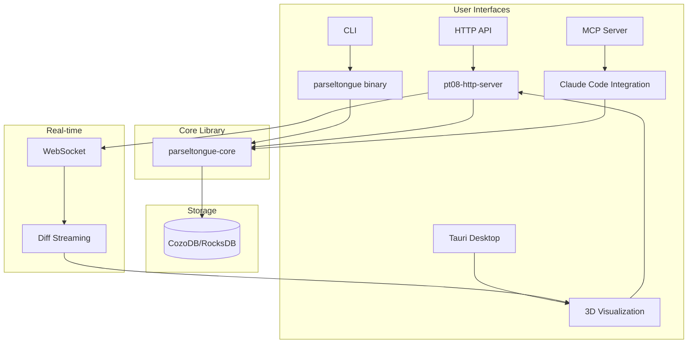
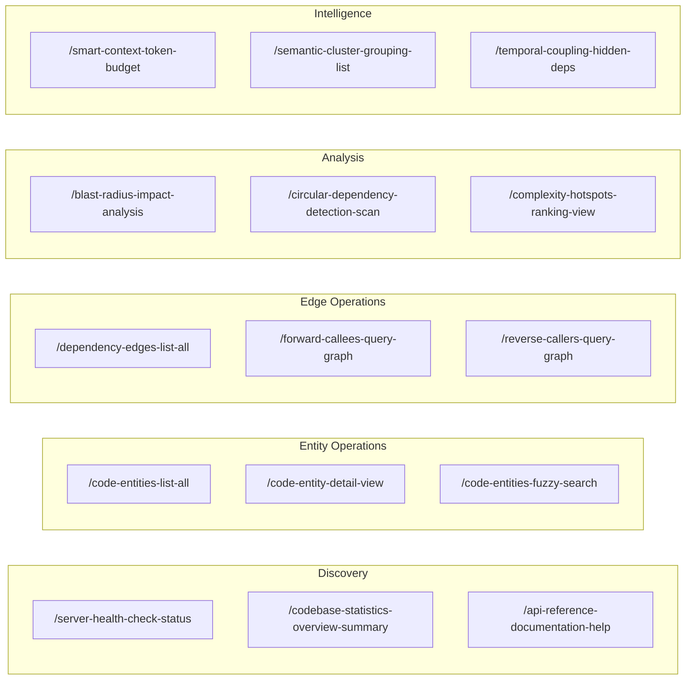

# D12: Parseltongue API & System Design Interview Questions

> 100 interview questions for the creator of parseltongue about HTTP API design, 4-word naming convention, WebSocket streaming, CLI architecture, and deployment.

---

## Document Overview

| Attribute | Value |
|-----------|-------|
| Focus Area | API & System Design |
| Question Count | 100 |
| Target | Project Creator/Architect |
| API Endpoints | 15 HTTP, 1 WebSocket |

---

## System Architecture



---

## Section 1: 4-Word Naming Convention (Questions 1-25)

### Philosophy & Rationale

| # | Question | Prob | Depth | Tags |
|---|----------|------|-------|------|
| 1 | Why exactly 4 words for all endpoint names and function identifiers? | 5 | Deep | `naming`, `philosophy` |
| 2 | What problem does the 4-word convention solve that shorter names don't? | 5 | Deep | `rationale`, `clarity` |
| 3 | How does `/blast-radius-impact-analysis` improve over `/blast-radius`? | 4 | Medium | `examples`, `comparison` |
| 4 | What are the 4-word patterns: noun-noun-verb-noun, etc.? | 4 | Medium | `patterns`, `structure` |
| 5 | How do you handle concepts that don't naturally fit 4 words? | 3 | Medium | `exceptions`, `flexibility` |
| 6 | What's the cognitive load difference between 4-word and 2-word names? | 4 | Deep | `cognition`, `ux` |
| 7 | How does this convention affect code readability in the implementation? | 3 | Medium | `readability`, `code` |
| 8 | Did you draw inspiration from any other naming conventions or systems? | 3 | Medium | `inspiration`, `origins` |
| 9 | How do you ensure consistency when multiple developers contribute? | 3 | Medium | `collaboration`, `standards` |
| 10 | What's the naming process for a new endpoint? | 3 | Medium | `process`, `workflow` |

### Application Examples

| # | Question | Prob | Depth | Tags |
|---|----------|------|-------|------|
| 11 | Break down `/codebase-statistics-overview-summary` - what does each word convey? | 4 | Medium | `breakdown`, `semantics` |
| 12 | Break down `/smart-context-token-budget` - why these 4 words? | 4 | Medium | `breakdown`, `semantics` |
| 13 | How do function names like `handle_blast_radius_impact_analysis` follow the convention? | 4 | Medium | `functions`, `consistency` |
| 14 | How do struct names follow the convention (e.g., `SharedApplicationStateContainer`)? | 3 | Medium | `structs`, `naming` |
| 15 | How do variable names follow the convention (e.g., `workspace_identifier_value`)? | 3 | Medium | `variables`, `naming` |
| 16 | What's the difference between `_value`, `_status`, `_option` suffixes? | 3 | Medium | `suffixes`, `semantics` |
| 17 | How do error types follow the naming convention? | 3 | Medium | `errors`, `naming` |
| 18 | How do test function names follow the convention? | 2 | Surface | `testing`, `naming` |
| 19 | What naming convention applies to the crate names (pt01, pt08)? | 3 | Medium | `crates`, `numbering` |
| 20 | Why `pt08-http-code-query-server` instead of just `http-server`? | 4 | Medium | `crates`, `rationale` |

### Trade-offs & Criticism

| # | Question | Prob | Depth | Tags |
|---|----------|------|-------|------|
| 21 | What are the downsides of 4-word naming? | 4 | Deep | `trade-offs`, `criticism` |
| 22 | How do long names affect typing and IDE autocomplete? | 3 | Medium | `ergonomics`, `ux` |
| 23 | What feedback have you received about the naming convention? | 3 | Medium | `feedback`, `user-research` |
| 24 | Would you change the convention if starting over? | 3 | Medium | `retrospective`, `learning` |
| 25 | How does this convention scale to a 50-person engineering team? | 3 | Deep | `scaling`, `teams` |

---

## Section 2: HTTP API Design (Questions 26-50)

### Endpoint Architecture

| # | Question | Prob | Depth | Tags |
|---|----------|------|-------|------|
| 26 | What framework do you use for the HTTP server and why? | 4 | Medium | `axum`, `framework` |
| 27 | How did you decide on the 15 specific endpoints? | 5 | Deep | `design`, `decisions` |
| 28 | How are endpoints organized into Discovery/Traversal/Analysis/Intelligence? | 4 | Medium | `organization`, `categories` |
| 29 | What's the `route_definition_builder_module` architecture? | 4 | Deep | `implementation`, `routing` |
| 30 | How does `build_complete_router_instance()` compose all routes? | 4 | Deep | `implementation`, `composition` |
| 31 | Why use GET for most endpoints instead of POST with request bodies? | 4 | Medium | `http-methods`, `design` |
| 32 | How do you handle query parameters vs path parameters? | 3 | Medium | `parameters`, `design` |
| 33 | What's the `SharedApplicationStateContainer` and how is it shared? | 4 | Deep | `state`, `architecture` |
| 34 | How do you handle CORS for browser-based clients? | 3 | Medium | `cors`, `security` |
| 35 | How do you handle request timeouts for slow queries? | 3 | Medium | `timeouts`, `performance` |

### Response Design

| # | Question | Prob | Depth | Tags |
|---|----------|------|-------|------|
| 36 | What's the standard response envelope format (success, endpoint, data)? | 4 | Medium | `response`, `format` |
| 37 | Why include `endpoint` in every response? | 3 | Medium | `design`, `debugging` |
| 38 | Why include `tokens` (token estimate) in responses? | 4 | Medium | `llm`, `budgeting` |
| 39 | How do you handle error responses consistently? | 4 | Medium | `errors`, `consistency` |
| 40 | What HTTP status codes do you use and when? | 3 | Medium | `status-codes`, `semantics` |
| 41 | How do you handle pagination for large result sets? | 3 | Medium | `pagination`, `scaling` |
| 42 | How do you version the API for backward compatibility? | 3 | Medium | `versioning`, `evolution` |
| 43 | What's the `HttpServerErrorTypes` enum structure? | 3 | Medium | `errors`, `types` |
| 44 | How does `into_response()` convert errors to HTTP responses? | 3 | Deep | `implementation`, `errors` |
| 45 | What content types do you support (JSON only or others)? | 2 | Surface | `content-types`, `formats` |

### Specific Endpoints

| # | Question | Prob | Depth | Tags |
|---|----------|------|-------|------|
| 46 | Walk through the `/server-health-check-status` endpoint implementation. | 3 | Medium | `health`, `implementation` |
| 47 | Walk through the `/codebase-statistics-overview-summary` endpoint. | 4 | Medium | `stats`, `implementation` |
| 48 | Walk through the `/code-entities-list-all` endpoint with filtering. | 4 | Medium | `entities`, `filtering` |
| 49 | Walk through the `/dependency-edges-list-all` endpoint. | 3 | Medium | `edges`, `implementation` |
| 50 | How does `/api-reference-documentation-help` generate documentation? | 3 | Medium | `docs`, `self-describing` |

---

## Section 3: WebSocket Streaming (Questions 51-75)

### Architecture

| # | Question | Prob | Depth | Tags |
|---|----------|------|-------|------|
| 51 | Why WebSocket for real-time updates instead of HTTP polling or SSE? | 5 | Deep | `websocket`, `rationale` |
| 52 | What's the `/websocket-diff-stream` endpoint architecture? | 5 | Deep | `websocket`, `architecture` |
| 53 | How does the WebSocket connection lifecycle work (connect, subscribe, disconnect)? | 4 | Deep | `lifecycle`, `connection` |
| 54 | What's the message format for client-to-server messages? | 4 | Medium | `messages`, `format` |
| 55 | What's the message format for server-to-client events? | 4 | Medium | `events`, `format` |
| 56 | How do you handle WebSocket reconnection after network interruption? | 4 | Deep | `reconnection`, `resilience` |
| 57 | How do you broadcast diff events to multiple connected clients? | 4 | Deep | `broadcast`, `multiplexing` |
| 58 | What's `broadcast_diff_to_subscribers()` implementation? | 4 | Deep | `implementation`, `broadcast` |
| 59 | How do you handle slow consumers that can't keep up with events? | 4 | Deep | `backpressure`, `slow-consumers` |
| 60 | What's the memory overhead per WebSocket connection? | 3 | Medium | `memory`, `scaling` |

### Event Types

| # | Question | Prob | Depth | Tags |
|---|----------|------|-------|------|
| 61 | What events are sent during a diff cycle (diff_started, entity_*, diff_completed)? | 4 | Medium | `events`, `types` |
| 62 | What's the `entity_added` event structure? | 3 | Medium | `events`, `structure` |
| 63 | What's the `entity_removed` event structure? | 3 | Medium | `events`, `structure` |
| 64 | What's the `entity_modified` event structure with line range changes? | 3 | Medium | `events`, `structure` |
| 65 | What's the `edge_added` and `edge_removed` event structure? | 3 | Medium | `events`, `edges` |
| 66 | What's the `diff_completed` event with summary statistics? | 3 | Medium | `events`, `summary` |
| 67 | How do you handle error events during streaming? | 3 | Medium | `errors`, `events` |
| 68 | What's the subscription model (subscribe to workspace, unsubscribe)? | 4 | Medium | `subscription`, `model` |
| 69 | Can a client subscribe to multiple workspaces simultaneously? | 3 | Medium | `multi-subscription`, `model` |
| 70 | How do you handle client ping/pong for connection keep-alive? | 3 | Medium | `keepalive`, `health` |

### Integration

| # | Question | Prob | Depth | Tags |
|---|----------|------|-------|------|
| 71 | How does the Tauri desktop app connect to the WebSocket? | 4 | Deep | `tauri`, `integration` |
| 72 | How does the React frontend handle WebSocket state management? | 4 | Deep | `frontend`, `state` |
| 73 | How do you test WebSocket functionality? | 3 | Medium | `testing`, `websocket` |
| 74 | What's the latency from file save to WebSocket event? | 3 | Medium | `latency`, `performance` |
| 75 | How would you scale WebSocket to 1000 concurrent connections? | 4 | Deep | `scaling`, `architecture` |

---

## Section 4: CLI & Deployment (Questions 76-100)

### CLI Architecture

| # | Question | Prob | Depth | Tags |
|---|----------|------|-------|------|
| 76 | What CLI framework do you use (clap, structopt, etc.)? | 3 | Medium | `cli`, `framework` |
| 77 | How is the CLI subcommand structure organized? | 4 | Medium | `subcommands`, `organization` |
| 78 | What's the `command_line_argument_parser` module architecture? | 3 | Deep | `implementation`, `parsing` |
| 79 | How do CLI commands share code with the HTTP server? | 4 | Deep | `code-sharing`, `architecture` |
| 80 | How does `parseltongue index` command work? | 4 | Medium | `index`, `command` |
| 81 | How does `parseltongue diff` command work? | 4 | Medium | `diff`, `command` |
| 82 | How does `parseltongue serve` (pt08-http-server) command work? | 4 | Medium | `serve`, `command` |
| 83 | What's the JSON output format for CLI commands? | 3 | Medium | `json`, `output` |
| 84 | How do you handle CLI errors and exit codes? | 3 | Medium | `errors`, `exit-codes` |
| 85 | What environment variables affect CLI behavior? | 2 | Surface | `env-vars`, `configuration` |

### Single Binary Deployment

| # | Question | Prob | Depth | Tags |
|---|----------|------|-------|------|
| 86 | Why a single binary architecture (~50MB) over multiple binaries? | 5 | Deep | `single-binary`, `rationale` |
| 87 | How do you embed static assets (frontend) in the binary? | 4 | Deep | `embedding`, `assets` |
| 88 | What's the `static_file_embed_module` doing? | 4 | Deep | `implementation`, `embedding` |
| 89 | How do you handle cross-platform builds (macOS, Linux, Windows)? | 3 | Medium | `cross-platform`, `builds` |
| 90 | What's the binary size breakdown by component? | 3 | Medium | `size`, `analysis` |
| 91 | How do you minimize binary size? | 3 | Medium | `optimization`, `size` |
| 92 | What runtime dependencies exist (zero or minimal)? | 3 | Medium | `dependencies`, `runtime` |
| 93 | How do you handle platform-specific code (e.g., file watching)? | 3 | Medium | `platform`, `abstraction` |
| 94 | What's the installation process (brew, cargo install, download)? | 3 | Medium | `installation`, `distribution` |
| 95 | How do you handle version upgrades and migrations? | 3 | Medium | `upgrades`, `migration` |

### Observability & Operations

| # | Question | Prob | Depth | Tags |
|---|----------|------|-------|------|
| 96 | What logging/tracing framework do you use? | 3 | Medium | `logging`, `tracing` |
| 97 | How do you expose metrics (server uptime, request latency)? | 3 | Medium | `metrics`, `observability` |
| 98 | How do you handle graceful shutdown? | 3 | Medium | `shutdown`, `graceful` |
| 99 | What's the port selection strategy (7777 default, auto-find)? | 3 | Medium | `ports`, `configuration` |
| 100 | How would you deploy parseltongue in a CI/CD pipeline? | 4 | Deep | `cicd`, `deployment` |

---

## HTTP API Reference



---

## Answer Framework for API Questions

When answering questions about API design:

1. **State the decision**: What was chosen and implemented
2. **Explain rationale**: Why this design over alternatives
3. **Show examples**: Concrete request/response examples
4. **Discuss consistency**: How it fits the overall design
5. **Address evolution**: How it might change in the future

### Example Answer Template

**Q: Why WebSocket for real-time updates instead of HTTP polling or SSE?**

"WebSocket was chosen for bidirectional, low-latency communication:

**Rationale:**

1. **Bidirectional**: Clients can subscribe/unsubscribe dynamically. SSE is server-push only.

2. **Low latency**: WebSocket has minimal overhead per message (~2 bytes header). Polling would require new HTTP connections.

3. **Natural for streaming**: Diff events are a stream of entity changes during file watching. WebSocket models this naturally.

**Alternatives considered:**

- **HTTP polling**: Would require clients to repeatedly query, missing events between polls. High server load.

- **SSE (Server-Sent Events)**: Would work for server->client, but no client->server for subscription management.

- **Long polling**: Complex, higher latency, harder to implement correctly.

**Implementation:**
```rust
// WebSocket upgrade handler
async fn websocket_handler(
    ws: WebSocketUpgrade,
    State(state): State<SharedApplicationStateContainer>,
) -> impl IntoResponse {
    ws.on_upgrade(|socket| handle_socket(socket, state))
}
```

**Trade-off:** WebSocket requires managing connection state (subscriptions, health). More complex than stateless HTTP."

---

## 15 Endpoints Reference

| Endpoint | Method | Category | Purpose |
|----------|--------|----------|---------|
| `/server-health-check-status` | GET | Discovery | Health check and uptime |
| `/codebase-statistics-overview-summary` | GET | Discovery | Entity/edge counts |
| `/api-reference-documentation-help` | GET | Discovery | Self-describing API docs |
| `/code-entities-list-all` | GET | Entity | List all entities with filtering |
| `/code-entity-detail-view` | GET | Entity | Single entity details |
| `/code-entities-fuzzy-search` | GET | Entity | Search entities by name |
| `/dependency-edges-list-all` | GET | Edge | List all edges |
| `/forward-callees-query-graph` | GET | Edge | What an entity calls |
| `/reverse-callers-query-graph` | GET | Edge | What calls an entity |
| `/blast-radius-impact-analysis` | GET | Analysis | Impact of changing entity |
| `/circular-dependency-detection-scan` | GET | Analysis | Find cycles |
| `/complexity-hotspots-ranking-view` | GET | Analysis | High-coupling entities |
| `/smart-context-token-budget` | GET | Intelligence | LLM context selection |
| `/semantic-cluster-grouping-list` | GET | Intelligence | Entity clustering |
| `/temporal-coupling-hidden-deps` | GET | Intelligence | Co-change patterns |

---

## Crate Organization

| Crate | Purpose | Lines |
|-------|---------|-------|
| `parseltongue` | CLI binary entrypoint | ~500 |
| `parseltongue-core` | Shared library (diff, storage, queries) | ~8000 |
| `pt01-folder-to-cozodb-streamer` | File indexing/parsing | ~2000 |
| `pt08-http-code-query-server` | HTTP API server | ~4000 |

---

*Generated for parseltongue-dependency-graph-generator API/system interview preparation*
