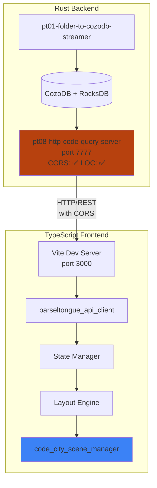
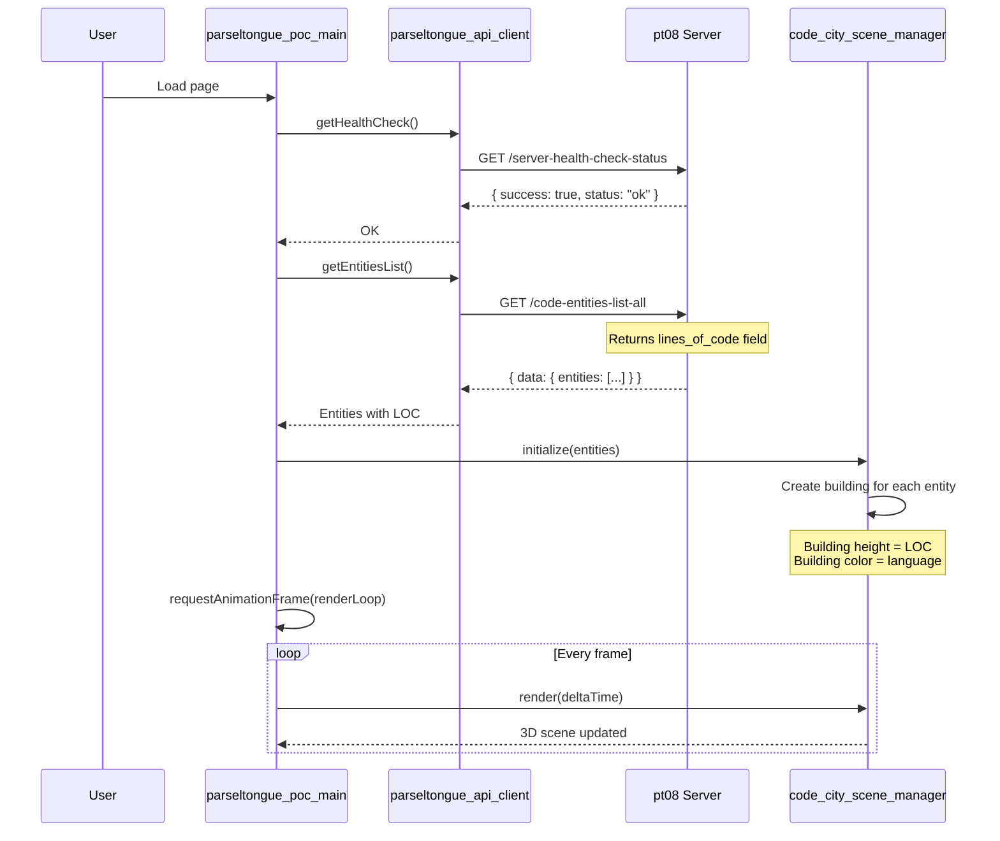
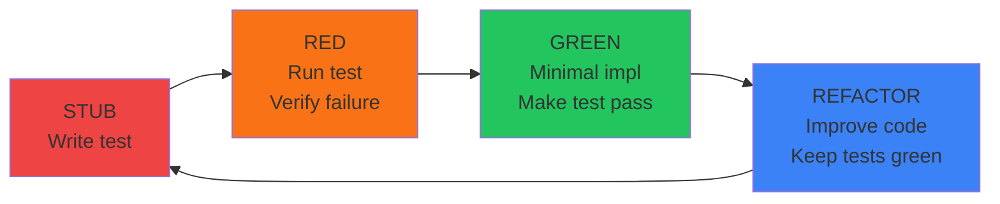

# Web UI Architecture

**Document**: Architecture specification for Parseltongue 3D CodeCity Web UI

**Created**: 2025-01-11 09:40 America/Los_Angeles
**Last Updated**: 2025-01-11 12:00 America/Los_Angeles

---

## Overview

The `web-ui-poc/` directory provides a 3D CodeCity visualization for Parseltongue. After the rubber duck analysis, **minimal Rust changes were made** to enable the visualization:

1. Added `lines_of_code: Option<usize>` to entities list response
2. Added CORS support to pt08 server

### System Architecture



### Data Flow



### TDD Cycle



---

## API Changes (Post-Rubber-Duck)

The following changes were made to pt08 after the rubber duck analysis:

| Change | File | Description |
|--------|------|-------------|
| LOC field | `code_entities_list_all_handler.rs` | Added `lines_of_code: Option<usize>` |
| CORS layer | `http_server_startup_runner.rs` | Added `CorsLayer` for browser access |
| API docs | `api_reference_documentation_handler.rs` | Updated endpoint description |

See `API_CHANGES_2025-01-11.md` for details.

---

## Original Overview (Pre-POC)

> **Note**: The following sections describe the originally planned structure. The actual POC (`web-ui-poc/`) is a minimal implementation.

---

## Separation Boundaries (Post-Implementation)

| Layer | Location | Language | Touches Rust? |
|-------|----------|----------|---------------|
| Backend API | `crates/pt08-*` | Rust | **YES** (minimal: LOC + CORS) |
| Web UI POC | `web-ui-poc/` | TypeScript | **NO** |
| Build | `web-ui-poc/package.json` | npm | **NO** |

---

## Directory Structure (Planned vs Actual)

### Original Plan (`web-ui/`)

The following structure was planned but not yet implemented:
├── docs/                           # This documentation
│   ├── THREE_JS_BEST_PRACTICES.md
│   ├── TDD_TEST_PLAN.md
│   └── ARCHITECTURE.md             # This file
│
├── e2e/                            # E2E tests (Playwright)
│   ├── __tests__/
│   │   ├── app.spec.ts             # Application loads
│   │   ├── interaction.spec.ts     # Click, hover, select
│   │   ├── blast_radius.spec.ts    # Impact visualization
│   │   ├── filters.spec.ts         # Filter interactions
│   │   └── comparison.spec.ts      # Snapshot diff view
│   ├── fixtures/
│   │   └── mock-api-responses.json
│   └── playwright.config.ts
│
├── src/
│   ├── __tests__/                  # Shared test utilities
│   │   ├── setup.ts                # Test configuration
│   │   └── test-utils.ts           # Test helpers
│   │
│   ├── api/                        # API client layer
│   │   ├── __tests__/
│   │   │   ├── api_client.test.ts
│   │   │   └── endpoint_handlers.test.ts
│   │   ├── client.ts               # Fetch wrapper
│   │   ├── endpoints.ts            # Endpoint definitions
│   │   └── types.ts                # API response types
│   │
│   ├── components/                 # React components
│   │   ├── __tests__/
│   │   ├── CodeCityView.tsx        # Main 3D canvas
│   │   ├── EntityDetails.tsx       # Selected entity info
│   │   ├── FilterPanel.tsx         # Language/type filters
│   │   ├── ControlPanel.tsx        # View settings
│   │   └── DiffView.tsx            # Snapshot comparison
│   │
│   ├── data/                       # Data transformation
│   │   ├── __tests__/
│   │   │   ├── entity_parser.test.ts
│   │   │   ├── entity_filters.test.ts
│   │   │   ├── complexity_sorter.test.ts
│   │   │   └── color_mapper.test.ts
│   │   ├── parser.ts               # API response → internal types
│   │   ├── filters.ts              # Entity filtering logic
│   │   ├── sorter.ts               # Complexity sorting
│   │   └── colors.ts               # Color assignment
│   │
│   ├── scene/                      # Three.js scene management
│   │   ├── __tests__/
│   │   │   ├── layout_engine.test.ts
│   │   │   ├── building_builder.test.ts
│   │   │   ├── edge_renderer.test.ts
│   │   │   └── camera_controller.test.ts
│   │   ├── layout.ts               # Building position calculation
│   │   ├── buildings.ts            # InstancedMesh builder
│   │   ├── edges.ts                # Dependency edge rendering
│   │   └── camera.ts               # Camera control
│   │
│   ├── comparison/                 # Snapshot comparison
│   │   ├── __tests__/
│   │   │   ├── snapshot_loader.test.ts
│   │   │   └── differ.test.ts
│   │   ├── loader.ts               # Fetch from dual servers
│   │   └── differ.ts               # Entity diff algorithm
│   │
│   ├── state/                      # State management
│   │   ├── __tests__/
│   │   │   ├── store.test.ts
│   │   │   ├── selectors.test.ts
│   │   │   └── actions.test.ts
│   │   ├── store.ts                # Zustand store
│   │   ├── actions.ts              # State actions
│   │   └── selectors.ts            # Derived state
│   │
│   ├── types/                      # TypeScript definitions
│   │   ├── entity.ts               # Entity types
│   │   ├── scene.ts                # Scene types
│   │   └── api.ts                  # API types
│   │
│   ├── utils/                      # Utilities
│   │   ├── __tests__/
│   │   └── helpers.ts
│   │
│   ├── App.tsx                     # Root component
│   └── main.tsx                    # Entry point
│
├── test/                           # Test infrastructure
│   ├── mocks/
│   │   ├── handlers.ts             # MSW request handlers
│   │   └── server.ts               # MSW server setup
│   └── visual/
│       └── snapshots/              # Visual regression baselines
│
├── public/                         # Static assets
│   └── textures/
│       └── building-normal.png     # Optional: Building normals
│
├── index.html                      # HTML entry point
├── package.json                    # Dependencies
├── tsconfig.json                   # TypeScript config
├── vite.config.ts                  # Vite build config
└── vitest.config.ts                # Vitest test config
```

---

## Data Flow

### Initial Load Flow

```
User opens http://localhost:3000
         │
         ▼
┌─────────────────────────────────────────┐
│  1. App.tsx initializes                 │
│     - Zustand store (empty state)       │
│     - Connect to API client             │
└─────────────────────────────────────────┘
         │
         ▼
┌─────────────────────────────────────────┐
│  2. API Client fetches from pt08        │
│     GET /server-health-check-status     │
│     GET /codebase-statistics-overview   │
│     GET /code-entities-list-all         │
└─────────────────────────────────────────┘
         │
         ▼
┌─────────────────────────────────────────┐
│  3. Data Layer transforms               │
│     - parseEntityList()                 │
│     - Validates types                   │
│     - Returns Entity[]                  │
└─────────────────────────────────────────┘
         │
         ▼
┌─────────────────────────────────────────┐
│  4. State Manager updates               │
│     - Dispatch LOAD_ENTITIES action     │
│     - Selectors derive filtered view    │
└─────────────────────────────────────────┘
         │
         ▼
┌─────────────────────────────────────────┐
│  5. Layout Engine calculates            │
│     - Building positions (x, y, z)      │
│     - Building dimensions (w, h, d)     │
│     - District boundaries               │
└─────────────────────────────────────────┘
         │
         ▼
┌─────────────────────────────────────────┐
│  6. Scene Renderer creates Three.js     │
│     - InstancedMesh for buildings       │
│     - Lines for dependencies            │
│     - OrbitControls for camera          │
└─────────────────────────────────────────┘
         │
         ▼
┌─────────────────────────────────────────┐
│  7. Canvas renders                      │
│     - 60 FPS animation loop             │
│     - Handle user input                 │
└─────────────────────────────────────────┘
```

### Entity Selection Flow

```
User clicks building
         │
         ▼
┌─────────────────────────────────────────┐
│  1. Raycaster detects intersection       │
│     - Returns clicked mesh              │
│     - Retrieves entity key from userData│
└─────────────────────────────────────────┘
         │
         ▼
┌─────────────────────────────────────────┐
│  2. State Manager updates               │
│     - Dispatch SELECT_ENTITY action     │
│     - Store selected entity key         │
└─────────────────────────────────────────┘
         │
         ▼
┌─────────────────────────────────────────┐
│  3. Side effects trigger                │
│     - Fetch entity details              │
│     - Fetch blast radius                │
│     - Highlight connected nodes         │
└─────────────────────────────────────────┘
         │
         ▼
┌─────────────────────────────────────────┐
│  4. UI updates                          │
│     - InfoPanel shows details           │
│     - Scene highlights building         │
│     - Camera animates to focus          │
└─────────────────────────────────────────┘
```

### Snapshot Comparison Flow

```
User configures two snapshots
         │
         ▼
┌─────────────────────────────────────────┐
│  1. Comparison Loader connects to       │
│     - Server A: localhost:7777          │
│     - Server B: localhost:7778          │
└─────────────────────────────────────────┘
         │
         ▼
┌─────────────────────────────────────────┐
│  2. Fetch entities from both            │
│     - GET /code-entities-list-all       │
│     - Parse both responses              │
└─────────────────────────────────────────┘
         │
         ▼
┌─────────────────────────────────────────┐
│  3. Differ calculates changes           │
│     - Added entities (in B, not A)      │
│     - Removed entities (in A, not B)    │
│     - Modified entities (LOC changed)   │
└─────────────────────────────────────────┘
         │
         ▼
┌─────────────────────────────────────────┐
│  4. Render side-by-side                 │
│     - Left scene: Snapshot A            │
│     - Right scene: Snapshot B           │
│     - Highlight: Green (added),         │
│                  Red (removed),         │
│                  Yellow (changed)       │
└─────────────────────────────────────────┘
```

---

## Technology Stack

| Layer | Technology | Rationale |
|-------|------------|-----------|
| **Build** | Vite | Fast HMR, native ESM, optimal bundle size |
| **Runtime** | TypeScript | Type safety, excellent IDE support |
| **3D Engine** | Three.js | Standard WebGL library, mature ecosystem |
| **React Integration** | React Three Fiber | Declarative 3D, React hooks integration |
| **State** | Zustand | Minimal boilerplate, TypeScript-friendly |
| **Testing (Unit)** | Vitest | Fast, Vite-compatible, ESM native |
| **Testing (E2E)** | Playwright | Reliable cross-browser testing |
| **Mocking** | MSW | API mocking without touching backend |
| **Linting** | ESLint + Prettier | Code quality and formatting |

---

## API Integration

### Available Endpoints (from pt08)

The web UI consumes these existing endpoints:

| Endpoint | Used For |
|----------|----------|
| `GET /server-health-check-status` | Connection verification |
| `GET /codebase-statistics-overview-summary` | Overview stats |
| `GET /code-entities-list-all` | Load all entities |
| `GET /code-entity-detail-view?key={key}` | Entity details |
| `GET /code-entities-search-fuzzy?q={pattern}` | Search |
| `GET /dependency-edges-list-all` | Load all edges |
| `GET /reverse-callers-query-graph?entity={key}` | What calls X? |
| `GET /forward-callees-query-graph?entity={key}` | What does X call? |
| `GET /blast-radius-impact-analysis?entity={key}&hops={n}` | Impact analysis |
| `GET /semantic-cluster-grouping-list` | Module clusters |

### Response Format

All responses follow this structure:

```typescript
interface ApiResponse<T = unknown> {
  success: boolean;
  endpoint: string;
  data?: T;
  error?: string;
  tokens?: number;
}
```

---

## Entity Model

### Core Entity Type

```typescript
interface CodeEntity {
  // Unique identifier
  key: string;                    // "rust:fn:main:src_main_rs:1-50"

  // Classification
  language: Language;             // "rust", "python", etc.
  entityType: EntityType;         // "fn", "struct", "class", etc.

  // Location
  name: string;
  filePath: string;
  lineRange: { start: number; end: number };

  // Metrics
  linesOfCode: number;
  complexity: number;

  // Optional
  futureCode?: string;            // For future state tracking
  metadata?: EntityMetadata;
}
```

### Edge Type

```typescript
interface DependencyEdge {
  from: string;                   // Entity key
  to: string;                     // Entity key
  edgeType: EdgeType;             // "calls", "uses", "implements"
}
```

---

## Performance Considerations

### Rendering Strategy

| Entity Count | Strategy |
|--------------|----------|
| < 1,000 | Direct mesh rendering |
| 1,000 - 10,000 | InstancedMesh per district |
| > 10,000 | LOD + async loading + culling |

### Memory Management

```typescript
// Disposal pattern
class SceneManager {
  dispose(): void {
    // Dispose geometries
    this.buildingsMesh.geometry.dispose();
    this.edgesMesh.geometry.dispose();

    // Dispose materials
    this.buildingsMesh.material.dispose();

    // Clear scene
    this.scene.clear();
  }
}
```

### Lazy Loading

- Load entities in chunks by package
- Render visible district only
- Load edges on-demand for selected entity

---

## Snapshot Comparison Architecture

### Dual-Server Pattern

User runs two Parseltongue instances:

```bash
# Terminal 1: Snapshot A
parseltongue pt08 --db "rocksdb:snapshot_a/analysis.db" --port 7777

# Terminal 2: Snapshot B
parseltongue pt08 --db "rocksdb:snapshot_b/analysis.db" --port 7778
```

### Browser-Side Diff

```typescript
interface SnapshotDiff {
  added: CodeEntity[];      // In B, not in A
  removed: CodeEntity[];    // In A, not in B
  modified: DiffChange[];   // Changed between A and B
}

interface DiffChange {
  entity: CodeEntity;
  changes: {
    linesOfCode?: { from: number; to: number };
    complexity?: { from: number; to: number };
  };
}
```

---

## Naming Conventions

### Four-Word Convention (from Parseltongue)

For consistency with the Rust codebase:

- **Files**: `entity_color_mapper.test.ts` (kebab-case)
- **Functions**: `assignColorByEntityType()` (camelCase, descriptive)
- **Tests**: `test_assigns_blue_to_rust_structs()` (descriptive)

### Directory Naming

```
src/
├── api/              # API client layer
├── components/       # React components
├── data/             # Data transformation
├── scene/            # Three.js scene
├── comparison/       # Snapshot comparison
└── state/            # State management
```

---

## Security Considerations

### CORS

The pt08 server may need CORS headers for local development:

```rust
// In pt08 (if CORS is needed)
#[tokio::main]
async fn main() {
    let app = Router::new()
        .layer(
            CorsLayer::new()
                .allow_origin("http://localhost:3000".parse::<HeaderValue>().unwrap())
                .allow_methods([Method::GET])
        )
        // ... routes
}
```

### No Authentication

Current pt08 has no auth. Web UI assumes:
- Local development only
- No exposure to public internet

---

## Build and Deployment

### Development

```bash
cd web-ui
npm install
npm run dev          # http://localhost:3000
```

### Production

```bash
npm run build        # Outputs to dist/
# Serve dist/ with any static file server
```

### Environment Variables

```bash
# .env.local
VITE_PARSLETONGUE_API_URL=http://localhost:7777
VITE_PARSLETONGUE_API_URL_B=http://localhost:7778  # For comparison
```

---

## Sources

- Parseltongue README: `S01-README-MOSTIMP.md`
- TDD Principles: `S06-design101-tdd-architecture-principles.md`
- pt08 API Documentation: `crates/pt08-http-code-query-server/src/http_endpoint_handler_modules/api_reference_documentation_handler.rs`
- Three.js Best Practices: `docs/web-ui/THREE_JS_BEST_PRACTICES.md`
- TDD Test Plan: `docs/web-ui/TDD_TEST_PLAN.md`
