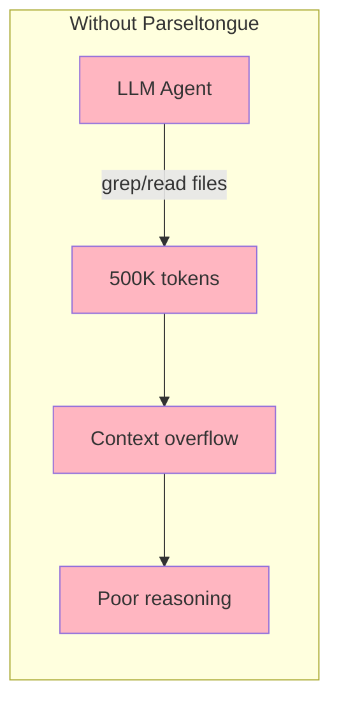
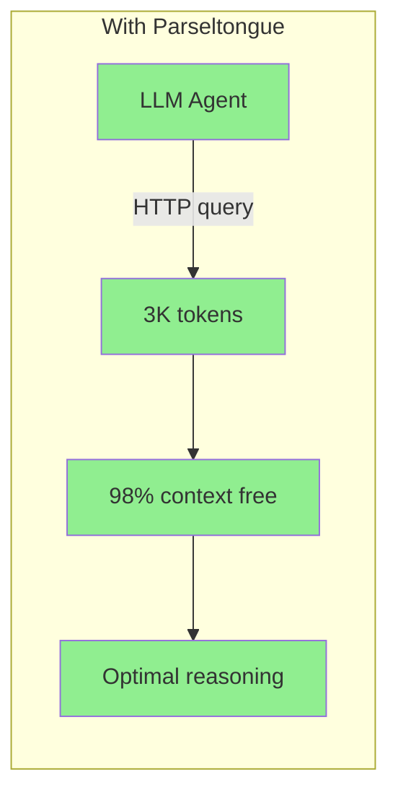
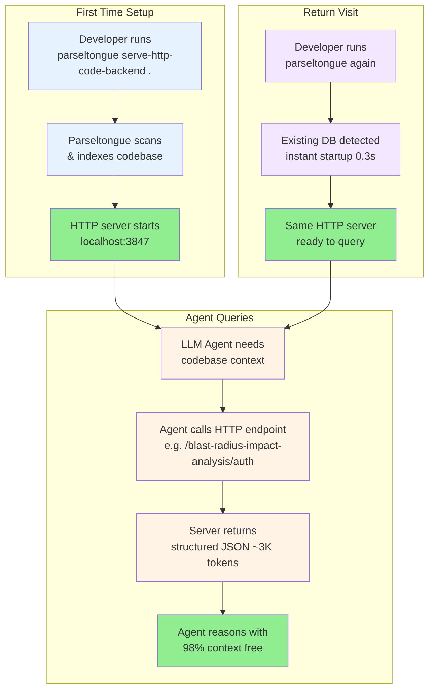
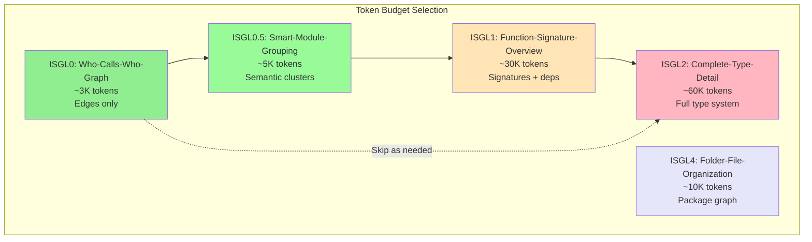
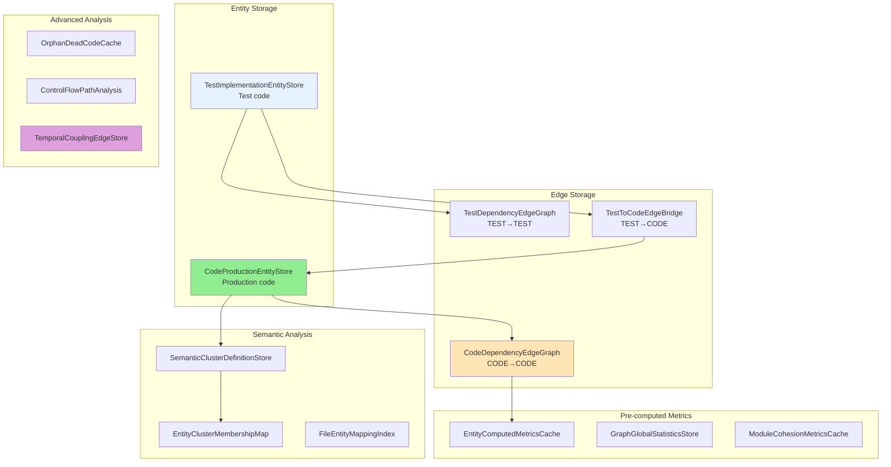

# Parseltongue

> **Parse once, query forever.** A local HTTP backend that makes any LLM agent understand your codebase.

```bash
parseltongue serve-http-code-backend ./my-project
# Server running at http://localhost:3847
# curl http://localhost:3847/codebase-statistics-overview-summary
```

**12 languages**: Rust, Python, JavaScript, TypeScript, Go, Java, C, C++, Ruby, PHP, C#, Swift

---

## The Problem



**Developers and LLM agents cannot easily understand codebases.** They resort to grep, which:
- Returns raw text (no semantic understanding)
- Uses 100× more tokens than needed
- Misses relationships between code entities
- Requires re-parsing on every query

---

## The Solution



**Code is a graph, not text.** Parseltongue:
1. **Parses** your codebase once (tree-sitter, 12 languages)
2. **Stores** entities + dependencies in a graph database (CozoDB)
3. **Serves** an HTTP API that any LLM agent can query

**Result**: 99% token reduction. 31× faster than grep. Structured graph data.

---

## User Journey



---

## Jobs To Be Done

| User Job | HTTP Endpoint | Token Cost |
|----------|---------------|------------|
| "I want to understand this codebase" | `GET /codebase-statistics-overview-summary` | ~100 |
| "What calls this function?" | `GET /reverse-callers-query-graph/{entity}` | ~500 |
| "What does this function call?" | `GET /forward-callees-query-graph/{entity}` | ~500 |
| "What breaks if I change X?" | `GET /blast-radius-impact-analysis/{entity}?hops=3` | ~2K |
| "Are there circular dependencies?" | `GET /circular-dependency-detection-scan` | ~1K |
| "Where is the complexity?" | `GET /complexity-hotspots-ranking-view?top=10` | ~500 |
| "What logical modules exist?" | `GET /semantic-cluster-grouping-list` | ~1K |
| "Find functions related to payment" | `GET /fuzzy-entity-search-query?q=payment` | ~1K |
| "What files change together?" | `GET /temporal-coupling-hidden-deps/{entity}` | ~1K |
| "Give me optimal context for X" | `GET /smart-context-token-budget?focus=X&tokens=4000` | ~4K |

---

## Quick Start

### 1. Start the Server

```bash
parseltongue serve-http-code-backend .
```

**Output**:
```
Parseltongue v1.1.0
━━━━━━━━━━━━━━━━━━━━━━━━━━━━━━━━━━━━━━━━━━━━━━━━━━━━━━━━━━━━━━━━━

Ingesting: /Users/dev/code/my-project

Phase 1: Scanning
  ✓ 234 files found
  ✗ 12 skipped (target/, node_modules/, .git/)

Phase 2: Parsing (12 languages)
  ✓ Rust:       89 files  →  456 entities
  ✓ Python:     45 files  →  123 entities
  ✓ TypeScript: 100 files →  234 entities

Phase 3: Dependency Extraction
  ✓ 2,541 edges (Calls, Uses, Implements, Extends, Contains)

Phase 4: Classification
  ✓ CODE entities: 591
  ✓ TEST entities: 222 (excluded from default queries)

━━━━━━━━━━━━━━━━━━━━━━━━━━━━━━━━━━━━━━━━━━━━━━━━━━━━━━━━━━━━━━━━━

HTTP Server running at: http://localhost:3847

┌─────────────────────────────────────────────────────────────────┐
│  Add to your LLM agent: PARSELTONGUE_URL=http://localhost:3847  │
└─────────────────────────────────────────────────────────────────┘

curl http://localhost:3847/codebase-statistics-overview-summary
```

### 2. Query from Your Agent

```bash
# Codebase overview
curl http://localhost:3847/codebase-statistics-overview-summary

# Who calls the auth function?
curl http://localhost:3847/reverse-callers-query-graph/authenticate

# What breaks if I change the config parser?
curl "http://localhost:3847/blast-radius-impact-analysis/parse_config?hops=3"

# Find all payment-related code
curl "http://localhost:3847/fuzzy-entity-search-query?q=payment"
```

### 3. Return Later (Instant Startup)

```bash
parseltongue serve-http-code-backend .
```

```
Found existing database:
  ./parseltongue_20251126/analysis.db
  Created: 2 hours ago | Entities: 591 | Edges: 2,541

Loading... done (0.3s)
HTTP Server running at: http://localhost:3847

(Use --reindex to force fresh ingestion)
```

---

## Progressive Disclosure (ISGL Levels)



**Strategy**: Start with ISGL0 (edges only, ~3K tokens). Escalate only when needed.

---

## HTTP API Reference

### Core Endpoints

| Endpoint | Description |
|----------|-------------|
| `GET /server-health-check-status` | Server status |
| `GET /codebase-statistics-overview-summary` | Entity/edge counts, languages |
| `GET /api-reference-documentation-help` | Full API documentation |

### Entity Endpoints

| Endpoint | Description |
|----------|-------------|
| `GET /code-entities-list-all` | All entities (filterable) |
| `GET /code-entities-list-all?entity_type=function` | Filter by type |
| `GET /code-entities-list-all?language=rust` | Filter by language |
| `GET /code-entity-detail-view/{key}` | Single entity with deps |
| `GET /fuzzy-entity-search-query?q=pattern` | Search by name/signature |

### Graph Query Endpoints

| Endpoint | Description |
|----------|-------------|
| `GET /dependency-edges-list-all` | All edges |
| `GET /reverse-callers-query-graph/{entity}` | Who calls this? |
| `GET /forward-callees-query-graph/{entity}` | What does this call? |
| `GET /blast-radius-impact-analysis/{entity}?hops=N` | Transitive impact |
| `GET /circular-dependency-detection-scan` | Find cycles |

### Analysis Endpoints

| Endpoint | Description |
|----------|-------------|
| `GET /complexity-hotspots-ranking-view?top=N` | Complexity ranking |
| `GET /semantic-cluster-grouping-list` | Semantic module groups |
| `GET /semantic-cluster-detail-view/{id}` | Cluster with members |
| `GET /orphan-dead-code-detection` | Dead code detection |
| `GET /package-file-structure-graph` | File-level statistics |
| `GET /entity-complexity-metrics-cache` | Pre-computed metrics |
| `GET /module-cohesion-quality-score` | Module quality |
| `GET /critical-control-flow-paths` | Critical paths |

### Killer Features

| Endpoint | Description |
|----------|-------------|
| `GET /temporal-coupling-hidden-deps/{entity}` | Git-derived hidden dependencies |
| `GET /smart-context-token-budget?focus=X&tokens=N` | Optimal context selection |

---

## Killer Feature #1: Temporal Coupling

**What it reveals**: The INVISIBLE architecture.

Static analysis sees:
```
auth.rs → session.rs (code dependency)
```

Temporal coupling reveals:
```
auth.rs ↔ config.yaml (changed together 47 times, ZERO code dependency)
```

```bash
curl http://localhost:3847/temporal-coupling-hidden-deps/auth
```

```json
{
  "entity": "auth.rs",
  "hidden_dependencies": [
    {"file": "config.yaml", "co_changes": 47, "score": 0.92, "code_edge": false},
    {"file": "middleware.rs", "co_changes": 31, "score": 0.78, "code_edge": true}
  ],
  "insight": "config.yaml has ZERO code dependency but HIGH temporal coupling"
}
```

---

## Killer Feature #2: Smart Context Selection

**The problem**: You have a token budget. What context should the LLM see?

```bash
curl "http://localhost:3847/smart-context-token-budget?focus=authenticate&tokens=4000"
```

```json
{
  "focus": "authenticate",
  "token_budget": 4000,
  "tokens_used": 3850,
  "context": {
    "core_entities": [
      {"key": "authenticate", "tokens": 450, "score": 0.95, "reason": "focus"},
      {"key": "validate_token", "tokens": 380, "score": 0.89, "reason": "direct_caller"},
      {"key": "Session", "tokens": 220, "score": 0.85, "reason": "cluster_co_member"}
    ],
    "temporal_hints": ["config.yaml changes with auth 47 times"],
    "blast_radius_summary": "14 entities affected by changes"
  }
}
```

**Algorithm**: Multi-signal scoring (dependency distance, temporal coupling, cluster membership, centrality) + greedy knapsack selection.

---

## Response Format

All endpoints return consistent JSON:

```json
{
  "success": true,
  "endpoint": "/blast-radius-impact-analysis/process",
  "count": 14,
  "data": [...],
  "tokens": 234,
  "query_time_ms": 12
}
```

The `tokens` field helps LLMs understand context budget impact.

---

## Database Schema (14 Tables)

**Design principle**: Amortize expensive operations. Parse once, pre-compute metrics, query cheap.



**Why separate tables?**
- **No WHERE clauses** needed for CODE vs TEST
- **75% token savings** when excluding tests
- **Pre-computed** = instant queries

---

## CLI Options

```bash
parseltongue serve-http-code-backend <DIRECTORY> [OPTIONS]
```

| Option | Description |
|--------|-------------|
| `--port <PORT>` | HTTP port (default: auto-detect from 3333) |
| `--reindex` | Force fresh ingestion |
| `--daemon` | Run in background |
| `--timeout <MIN>` | Auto-shutdown after idle |
| `--verbose` | Show query logs |
| `--quiet` | Minimal output |

**Examples**:
```bash
# Basic
parseltongue serve-http-code-backend .

# Custom port
parseltongue serve-http-code-backend . --port 8080

# Force re-ingestion
parseltongue serve-http-code-backend . --reindex

# Background with auto-shutdown
parseltongue serve-http-code-backend . --daemon --timeout 60
```

---

## Languages Supported

| Language | Extensions | Entity Types |
|----------|------------|--------------|
| **Rust** | `.rs` | fn, struct, enum, trait, impl, mod |
| **Python** | `.py` | def, class, async def |
| **JavaScript** | `.js`, `.jsx` | function, class, arrow functions |
| **TypeScript** | `.ts`, `.tsx` | function, class, interface, type |
| **Go** | `.go` | func, type, struct, interface |
| **Java** | `.java` | class, interface, method, enum |
| **C** | `.c`, `.h` | function, struct, typedef |
| **C++** | `.cpp`, `.hpp` | function, class, struct, template |
| **Ruby** | `.rb` | def, class, module |
| **PHP** | `.php` | function, class, trait |
| **C#** | `.cs` | class, struct, interface, method |
| **Swift** | `.swift` | func, class, struct, protocol |

---

## Edge Types (CPG-Inspired)

| Edge Type | Direction | Meaning |
|-----------|-----------|---------|
| `Calls` | downward | Function invocation |
| `Uses` | downward | Type/constant reference |
| `Implements` | upward | Trait implementation |
| `Extends` | upward | Inheritance |
| `Contains` | downward | Structural containment |

---

## Comparison: Parseltongue vs Grep

| Metric | Grep | Parseltongue | Improvement |
|--------|------|--------------|-------------|
| Query time | 7.5s | 50ms | **150× faster** |
| Tokens | 500K | 2.3K | **99.5% reduction** |
| Context free | 0% | 98.9% | **Optimal reasoning** |
| Structure | Raw text | Graph + metrics | **Semantic understanding** |

---

## Research Foundation

**Liu et al. (TACL 2023)** "Lost in the Middle: How Language Models Use Long Contexts"
- Finding: 30 documents in context → 25% performance drop
- Application: Parseltongue gives graphs (2.3K tokens), not documents (250K tokens)

**Token Arithmetic** (1,500 entity codebase):
- Full code: 525K tokens
- Signatures only: 37.5K tokens
- Filtered query: 2.3K tokens
- **Reduction**: 228×

---

## Architecture Principles

**4-Word Naming Convention**: All functions, endpoints, tables use exactly 4 words for LLM tokenization optimization.

```
serve-http-code-backend          ✓ 4 words
blast-radius-impact-analysis     ✓ 4 words
CodeProductionEntityStore        ✓ 4 words
```

**TDD-First**: STUB → RED → GREEN → REFACTOR

**Layered Architecture**:
- L1: Core (no_std compatible)
- L2: Standard library
- L3: External (tokio, serde, cozo)

---

## Documentation

| Document | Location |
|----------|----------|
| PRD | `.claude/prd01.md` |
| Architecture | `.claude/architecture-http-server-20251128.md` |
| CLI Reference | `COMMANDS.md` |
| Development Guide | `CLAUDE.md` |

---

## License

MIT License - See LICENSE file

---

## Links

- **GitHub**: [that-in-rust/parseltongue](https://github.com/that-in-rust/parseltongue)
- **Issues**: [Report bugs](https://github.com/that-in-rust/parseltongue/issues)

---

**Parse once, query forever.**

*Parseltongue: Making LLMs reason about code with graphs, not text.*
