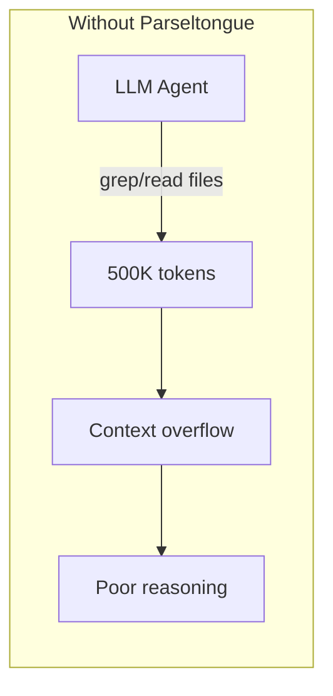
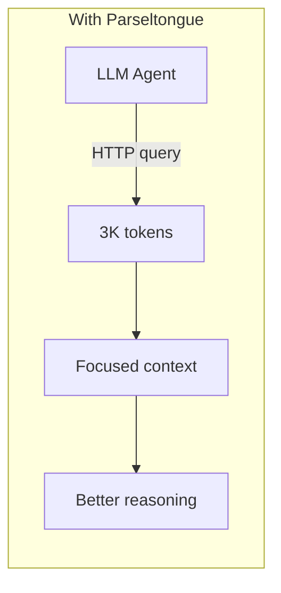
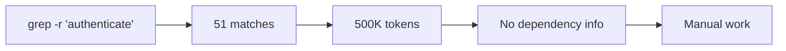
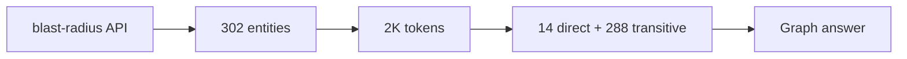

# Parseltongue

> **v1.4.2** - Parse once, query forever. A local HTTP backend that makes any LLM agent understand your codebase.

```bash
# Index your codebase
parseltongue pt01-folder-to-cozodb-streamer ./my-project --db "rocksdb:mycode.db"

# Start the HTTP server (default port: 7777)
parseltongue pt08-http-code-query-server --db "rocksdb:mycode.db"

# Query from your LLM agent
curl http://localhost:7777/codebase-statistics-overview-summary
```

**12 languages**: Rust, Python, JavaScript, TypeScript, Go, Java, C, C++, Ruby, PHP, C#, Swift

---

## The Problem



**Developers and LLM agents cannot easily understand codebases.** They resort to grep, which:
- Returns raw text (no semantic understanding)
- Consumes excessive tokens
- Misses relationships between code entities
- Requires re-parsing on every query

---

## The Solution



**Code is a graph, not text.** Parseltongue:
1. **Parses** your codebase once (tree-sitter, 12 languages)
2. **Stores** entities + dependencies in a graph database (CozoDB)
3. **Serves** an HTTP API that any LLM agent can query

---

## Impact Analysis

> *"If I change this function, what breaks?"*

**With grep:**


**With Parseltongue:**


**One query:**
```bash
curl "http://localhost:7777/blast-radius-impact-analysis?entity=rust:fn:authenticate:src/auth.rs:10-50&hops=2"
```
```json
{"total_affected": 302, "direct_callers": 14, "transitive": 288}
```

---

## Quick Start

### Step 1: Index Your Codebase

```bash
parseltongue pt01-folder-to-cozodb-streamer ./my-project --db "rocksdb:mycode.db"
```

**Output**:
```
Running Tool 1: folder-to-cozodb-streamer
  Database: rocksdb:mycode.db

Streaming Summary:
Total files found: 108
Files processed: 92
Entities created: 216 (CODE only)
  └─ CODE entities: 216
  └─ TEST entities: 982 (excluded for optimal LLM context)

✓ Indexing completed
```

### Step 2: Start the HTTP Server

```bash
# Default port (7777)
parseltongue pt08-http-code-query-server --db "rocksdb:mycode.db"

# Custom port (use --port flag)
parseltongue pt08-http-code-query-server --db "rocksdb:mycode.db" --port 8080

# File watching is always enabled (v1.4.2+) - code graph stays in sync automatically
parseltongue pt08-http-code-query-server --db "rocksdb:mycode.db"
```

**Output**:
```
Parseltongue HTTP Server
━━━━━━━━━━━━━━━━━━━━━━━━━━━━━━━━━━━━━━━━━━━━━━━━━━━━━━━━━━━━━━━━━

HTTP Server running at: http://localhost:7777

┌─────────────────────────────────────────────────────────────────┐
│  Add to your LLM agent: PARSELTONGUE_URL=http://localhost:7777  │
└─────────────────────────────────────────────────────────────────┘

Quick test:
  curl http://localhost:7777/server-health-check-status
```

### Step 3: Query from Your Agent

```bash
# Health check
curl http://localhost:7777/server-health-check-status

# Codebase overview
curl http://localhost:7777/codebase-statistics-overview-summary

# Search for functions
curl "http://localhost:7777/code-entities-search-fuzzy?q=authenticate"

# What calls this function?
curl "http://localhost:7777/reverse-callers-query-graph?entity=rust:fn:process:src_lib_rs:50-100"

# What breaks if I change this?
curl "http://localhost:7777/blast-radius-impact-analysis?entity=rust:fn:new:src_storage_rs:10-30&hops=3"

# Get optimal context for LLM
curl "http://localhost:7777/smart-context-token-budget?focus=rust:fn:main:src_main_rs:1-50&tokens=4000"
```

---

## What's New in v1.4.2: Always-On File Watching

### Breaking Change: `--watch` Flags Removed

**v1.4.2 simplifies the workflow**: File watching is now always enabled. The `--watch` and `--watch-dir` CLI flags have been removed.

#### Migration from v1.4.1

```bash
# ❌ OLD (v1.4.1) - These flags no longer work
parseltongue pt08-http-code-query-server --db rocksdb:mydb --watch
parseltongue pt08-http-code-query-server --db rocksdb:mydb --watch --watch-dir ./src

# ✅ NEW (v1.4.2) - File watching happens automatically
parseltongue pt08-http-code-query-server --db rocksdb:mydb
# That's it! The server automatically watches the current directory.
```

### Why Always-On File Watching?

**Before v1.4.2**: Users had to remember to add `--watch` flags. Many forgot, leading to stale code graphs.

**With v1.4.2**: Your code graph stays in sync automatically. Zero configuration required.

```
┌──────────────────────────────────────────────────────────────────┐
│                    THE NEW WORKFLOW                               │
├──────────────────────────────────────────────────────────────────┤
│                                                                   │
│  1. Index codebase (once)                                        │
│     parseltongue pt01-folder-to-cozodb-streamer ./my-project     │
│                                                                   │
│  2. Start server (file watching is automatic)                    │
│     parseltongue pt08-http-code-query-server --db rocksdb:mydb   │
│                                                                   │
│  3. Write code... save file... graph updates automatically       │
│     └─ No manual reindex needed                                  │
│     └─ LLM agents always get fresh data                          │
│                                                                   │
└──────────────────────────────────────────────────────────────────┘
```

### File Watching in Action

When the server starts, you'll see:
```
✓ File watcher started: /path/to/your/project
  Monitoring: .rs, .py, .js, .ts, .go, .java files
```

**Monitored extensions**: `.rs`, `.py`, `.js`, `.ts`, `.go`, `.java`

**What happens when you save a file**:
1. File watcher detects the change
2. Server automatically reindexes the modified file
3. Code graph is updated in <100ms
4. Next HTTP query reflects the changes

### Verifying File Watcher Status

```bash
# Check if file watching is running
curl http://localhost:7777/file-watcher-status-check
```

**Response**:
```json
{
  "success": true,
  "data": {
    "file_watching_enabled_flag": true,
    "watcher_running_status_flag": true,
    "watch_directory_path": "/path/to/your/project",
    "watched_extensions_list": [".rs", ".py", ".js", ".ts", ".go", ".java"],
    "events_processed_count": 42
  }
}
```

### Manual Reindex (Optional)

For edge cases, you can still trigger a manual reindex:

```bash
# Reindex a specific file
curl -X POST "http://localhost:7777/incremental-reindex-file-update?path=/absolute/path/to/file.rs"
```

**Response**:
```json
{
  "success": true,
  "data": {
    "file_path": "/absolute/path/to/file.rs",
    "entities_added": 5,
    "entities_updated": 2,
    "entities_removed": 1,
    "reindex_duration_ms": 45
  }
}
```

### LLM Agent Integration with File Watching

When using Parseltongue with LLM agents, the always-on file watching ensures:

1. **Fresh Context**: Every query returns the latest code state
2. **No Stale Data**: Agents never work with outdated dependency graphs
3. **Seamless Development**: Edit code, ask questions, get accurate answers

**Example workflow**:
```bash
# Agent asks: "What calls the new helper function I just added?"
# 1. You save the new file
# 2. File watcher auto-reindexes (happens in background)
# 3. Agent queries reverse-callers
curl "http://localhost:7777/reverse-callers-query-graph?entity=rust:fn:my_new_helper:src_utils_rs:10-25"
# 4. Response includes all current callers (including any you just wrote)
```

---

## Jobs To Be Done

| User Job | HTTP Endpoint | Token Cost |
|----------|---------------|------------|
| "Is the server running?" | `GET /server-health-check-status` | ~35 |
| "Give me codebase overview" | `GET /codebase-statistics-overview-summary` | ~100 |
| "List all endpoints" | `GET /api-reference-documentation-help` | ~500 |
| "List all entities" | `GET /code-entities-list-all` | ~2K |
| "Find functions named X" | `GET /code-entities-search-fuzzy?q=X` | ~500 |
| "Get entity details" | `GET /code-entity-detail-view?key=X` | ~200 |
| "What calls this?" | `GET /reverse-callers-query-graph?entity=X` | ~500 |
| "What does this call?" | `GET /forward-callees-query-graph?entity=X` | ~500 |
| "List all edges" | `GET /dependency-edges-list-all` | ~3K |
| "What breaks if I change X?" | `GET /blast-radius-impact-analysis?entity=X&hops=3` | ~2K |
| "Any circular dependencies?" | `GET /circular-dependency-detection-scan` | ~1K |
| "Where is the complexity?" | `GET /complexity-hotspots-ranking-view?top=10` | ~500 |
| "What modules exist?" | `GET /semantic-cluster-grouping-list` | ~1K |
| "Give me optimal context" | `GET /smart-context-token-budget?focus=X&tokens=4000` | ~4K |
| "Is file watching on?" | `GET /file-watcher-status-check` | ~50 |
| "Reindex this file" | `POST /incremental-reindex-file-update?path=X` | ~100 |

---

## HTTP API Reference (16 Endpoints)

### Core Endpoints

| Endpoint | Description |
|----------|-------------|
| `GET /server-health-check-status` | Server health check |
| `GET /codebase-statistics-overview-summary` | Entity/edge counts, languages |
| `GET /api-reference-documentation-help` | Full API documentation |

### Entity Endpoints

| Endpoint | Description |
|----------|-------------|
| `GET /code-entities-list-all` | All entities |
| `GET /code-entities-list-all?entity_type=function` | Filter by type |
| `GET /code-entity-detail-view?key=X` | Single entity details |
| `GET /code-entities-search-fuzzy?q=pattern` | Fuzzy search by name |

### Graph Query Endpoints

| Endpoint | Description |
|----------|-------------|
| `GET /dependency-edges-list-all` | All dependency edges |
| `GET /reverse-callers-query-graph?entity=X` | Who calls X? |
| `GET /forward-callees-query-graph?entity=X` | What does X call? |
| `GET /blast-radius-impact-analysis?entity=X&hops=N` | What breaks if X changes? |

### Analysis Endpoints

| Endpoint | Description |
|----------|-------------|
| `GET /circular-dependency-detection-scan` | Find circular dependencies |
| `GET /complexity-hotspots-ranking-view?top=N` | Complexity ranking |
| `GET /semantic-cluster-grouping-list` | Semantic module groups |

### Context Optimization

| Endpoint | Description |
|----------|-------------|
| `GET /smart-context-token-budget?focus=X&tokens=N` | Context selection within token budget |

### File Watcher Endpoints (Always On)

| Endpoint | Description |
|----------|-------------|
| `GET /file-watcher-status-check` | Check if file watching is enabled and running |
| `POST /incremental-reindex-file-update?path=X` | Trigger reindex for a specific file |

---

## Real-World Example Queries (Dogfooded on Parseltongue)

These examples were run against Parseltongue's own codebase (217 entities, 3027 dependency edges).

### Example 1: Understanding a New Codebase

```bash
# 1. Get codebase overview
curl http://localhost:7777/codebase-statistics-overview-summary | jq '.data'
```
**Actual Response**:
```json
{
  "code_entities_total_count": 217,
  "test_entities_total_count": 0,
  "dependency_edges_total_count": 3027,
  "languages_detected_list": ["rust"],
  "database_file_path": "rocksdb:parseltongue.db"
}
```

```bash
# 2. Find complexity hotspots (most called functions)
curl "http://localhost:7777/complexity-hotspots-ranking-view?top=5" | jq '.data.hotspots'
```
**Actual Response**:
```json
[
  {"rank": 1, "entity_key": "rust:fn:new:unknown:0-0", "inbound_count": 215, "total_coupling": 215},
  {"rank": 2, "entity_key": "rust:fn:unwrap:unknown:0-0", "inbound_count": 163, "total_coupling": 163},
  {"rank": 3, "entity_key": "rust:fn:to_string:unknown:0-0", "inbound_count": 139, "total_coupling": 139},
  {"rank": 4, "entity_key": "rust:fn:Ok:unknown:0-0", "inbound_count": 101, "total_coupling": 101},
  {"rank": 5, "entity_key": "rust:fn:Some:unknown:0-0", "inbound_count": 62, "total_coupling": 62}
]
```
> Note: `unknown:0-0` indicates stdlib/external calls (HashMap::new, unwrap, etc.)

```bash
# 3. Check for circular dependencies
curl http://localhost:7777/circular-dependency-detection-scan | jq '.data'
```
**Actual Response**:
```json
{"has_cycles": false, "cycle_count": 0, "cycles": []}
```

### Example 2: Impact Analysis Before Refactoring

```bash
# 1. Find who calls CozoDbStorage::new() (reverse dependencies)
curl "http://localhost:7777/reverse-callers-query-graph?entity=rust:method:new:__crates_parseltongue-core_src_storage_cozo_client_rs:38-54" | jq '.data.total_count'
```
**Actual Response**: `215` callers!

```bash
# 2. Get full blast radius (2-hop transitive impact)
curl "http://localhost:7777/blast-radius-impact-analysis?entity=rust:method:new:__crates_parseltongue-core_src_storage_cozo_client_rs:38-54&hops=2" | jq '.data'
```
**Actual Response**:
```json
{
  "source_entity": "rust:method:new:__crates_parseltongue-core_src_storage_cozo_client_rs:38-54",
  "hops_requested": 2,
  "total_affected": 302,
  "by_hop": [
    {"hop": 1, "count": 214, "entities": ["rust:fn:build_cli:...", "rust:fn:start_http_server_blocking_loop:...", "..."]},
    {"hop": 2, "count": 88, "entities": ["rust:fn:main:...", "rust:fn:handle_blast_radius_impact_analysis:...", "..."]}
  ]
}
```
> **Insight**: Changing `CozoDbStorage::new()` affects 302 entities transitively!

### Example 3: Finding and Exploring Code

```bash
# 1. Search for storage-related entities
curl "http://localhost:7777/code-entities-search-fuzzy?q=storage" | jq '.data.total_count'
```
**Actual Response**: `36` matching entities (struct, impl, methods)

```bash
# 2. Get full source code of CozoDbStorage::new()
curl "http://localhost:7777/code-entity-detail-view?key=rust:method:new:__crates_parseltongue-core_src_storage_cozo_client_rs:38-54" | jq '.data'
```
**Actual Response**:
```json
{
  "key": "rust:method:new:__crates_parseltongue-core_src_storage_cozo_client_rs:38-54",
  "file_path": "./crates/parseltongue-core/src/storage/cozo_client.rs",
  "entity_type": "method",
  "language": "rust",
  "code": "    pub async fn new(engine_spec: &str) -> Result<Self> {\n        let (engine, path) = if engine_spec.contains(':') {\n            let parts: Vec<&str> = engine_spec.splitn(2, ':').collect();\n            (parts[0], parts[1])\n        } else {\n            (engine_spec, \"\")\n        };\n        let db = DbInstance::new(engine, path, Default::default())\n            .map_err(|e| ParseltongError::DatabaseError {...})?;\n        Ok(Self { db })\n    }"
}
```

```bash
# 3. See what CozoDbStorage::new() calls (forward dependencies)
curl "http://localhost:7777/forward-callees-query-graph?entity=rust:method:new:__crates_parseltongue-core_src_storage_cozo_client_rs:38-54" | jq '.data.callees'
```
**Actual Response**:
```json
[
  {"to_key": "rust:fn:Ok:unknown:0-0", "edge_type": "Calls"},
  {"to_key": "rust:fn:collect:unknown:0-0", "edge_type": "Calls"},
  {"to_key": "rust:fn:contains:unknown:0-0", "edge_type": "Calls"},
  {"to_key": "rust:fn:default:unknown:0-0", "edge_type": "Calls"},
  {"to_key": "rust:fn:map_err:unknown:0-0", "edge_type": "Calls"},
  {"to_key": "rust:fn:new:unknown:0-0", "edge_type": "Calls"},
  {"to_key": "rust:fn:splitn:unknown:0-0", "edge_type": "Calls"},
  {"to_key": "rust:fn:to_string:unknown:0-0", "edge_type": "Calls"}
]
```

### Example 4: Find HTTP Handlers

```bash
# Search for all handler functions
curl "http://localhost:7777/code-entities-search-fuzzy?q=handler" | jq '.data.total_count'
```
**Actual Response**: `124` handler-related entities (functions, modules, structs)

### Example 5: Smart Context for LLM Agents

```bash
# Get optimal context within 2000 token budget
curl "http://localhost:7777/smart-context-token-budget?focus=rust:method:new:__crates_parseltongue-core_src_storage_cozo_client_rs:38-54&tokens=2000" | jq '.data'
```
**Actual Response**:
```json
{
  "focus_entity": "rust:method:new:__crates_parseltongue-core_src_storage_cozo_client_rs:38-54",
  "token_budget": 2000,
  "tokens_used": 816,
  "entities_included": 8,
  "context": [
    {"entity_key": "rust:fn:Ok:unknown:0-0", "relevance_score": 0.95, "relevance_type": "direct_callee"},
    {"entity_key": "rust:fn:collect:unknown:0-0", "relevance_score": 0.95, "relevance_type": "direct_callee"},
    {"entity_key": "rust:fn:contains:unknown:0-0", "relevance_score": 0.95, "relevance_type": "direct_callee"},
    {"entity_key": "rust:fn:default:unknown:0-0", "relevance_score": 0.95, "relevance_type": "direct_callee"},
    {"entity_key": "rust:fn:map_err:unknown:0-0", "relevance_score": 0.95, "relevance_type": "direct_callee"},
    {"entity_key": "rust:fn:new:unknown:0-0", "relevance_score": 0.95, "relevance_type": "direct_callee"},
    {"entity_key": "rust:fn:splitn:unknown:0-0", "relevance_score": 0.95, "relevance_type": "direct_callee"},
    {"entity_key": "rust:fn:to_string:unknown:0-0", "relevance_score": 0.95, "relevance_type": "direct_callee"}
  ]
}
```

**Smart Context Algorithm**:
- Direct callers: score 1.0
- Direct callees: score 0.95
- Transitive deps: score 0.7 - (0.1 × depth)
- Greedy knapsack selection until budget exhausted

---

## Entity Key Format

Entity keys follow this pattern:
```
language:entity_type:entity_name:file_path:line_range
```

**Example**: `rust:fn:authenticate:src_auth_rs:10-50`
- Language: `rust`
- Type: `fn` (function)
- Name: `authenticate`
- File: `src/auth.rs` (slashes become underscores)
- Lines: `10-50`

**Tip**: When using entity keys in URLs with query parameters, colons work fine:
```bash
curl "http://localhost:7777/reverse-callers-query-graph?entity=rust:fn:process:src_lib_rs:1-20"
```

---

## Response Format

All endpoints return consistent JSON:

```json
{
  "success": true,
  "endpoint": "/blast-radius-impact-analysis",
  "data": {
    "source_entity": "rust:fn:process:src_lib_rs:1-20",
    "total_affected": 14,
    "by_hop": [{"hop": 1, "count": 5, "entities": [...]}]
  },
  "tokens": 234
}
```

The `tokens` field helps LLMs understand context budget impact.

---

## jq Query Patterns & Anti-Patterns

When querying the API with jq, use the correct field names to avoid errors.

### API Field Reference

| Endpoint | Field Names |
|----------|-------------|
| `/dependency-edges-list-all` | `from_key`, `to_key`, `edge_type`, `source_location` |
| `/code-entities-list-all` | `key`, `name`, `entity_type`, `language`, `file_path` |
| `/reverse-callers-query-graph` | `from_key`, `to_key`, `edge_type` |
| `/forward-callees-query-graph` | `from_key`, `to_key`, `edge_type` |

### Common Patterns (Do This)

```bash
# Filter edges by target entity
curl -s http://localhost:7777/dependency-edges-list-all | \
  jq '[.data.edges[] | select(.to_key | contains("Auth"))]'

# Filter edges by source file
curl -s http://localhost:7777/dependency-edges-list-all | \
  jq '[.data.edges[] | select(.from_key | contains("controller"))]'

# Count edges by type
curl -s http://localhost:7777/dependency-edges-list-all | \
  jq '.data.edges | group_by(.edge_type) | map({type: .[0].edge_type, count: length})'

# Get unique edge types
curl -s http://localhost:7777/dependency-edges-list-all | \
  jq '[.data.edges[].edge_type] | unique'

# Filter entities by language
curl -s http://localhost:7777/code-entities-list-all | \
  jq '[.data.entities[] | select(.language == "javascript")]'
```

### Anti-Patterns (Don't Do This)

```bash
# WRONG: Using .to instead of .to_key
curl -s http://localhost:7777/dependency-edges-list-all | \
  jq '.data.edges | map(select(.to | contains("Auth")))'
# Error: null (null) and string ("Auth") cannot have their containment checked

# WRONG: Using .from instead of .from_key
curl -s http://localhost:7777/dependency-edges-list-all | \
  jq '[.data.edges[] | select(.from | contains("main"))]'
# Error: null and string cannot have containment checked

# WRONG: Using .type instead of .edge_type
curl -s http://localhost:7777/dependency-edges-list-all | \
  jq '[.data.edges[] | select(.type == "Calls")]'
# Returns empty (field doesn't exist)
```

### Why These Errors Happen

When jq accesses a non-existent field, it returns `null`. Functions like `contains()` cannot operate on `null`:

```bash
# This returns null (field doesn't exist)
echo '{"to_key": "foo"}' | jq '.to'
# Output: null

# This causes an error
echo '{"to_key": "foo"}' | jq '.to | contains("f")'
# Error: null and string cannot have containment checked
```

### Defensive jq Patterns

```bash
# Safe filtering with null check
curl -s http://localhost:7777/dependency-edges-list-all | \
  jq '[.data.edges[] | select(.to_key != null and (.to_key | contains("Auth")))]'

# Inspect response structure first
curl -s http://localhost:7777/dependency-edges-list-all | jq '.data.edges[0] | keys'
# Output: ["edge_type", "from_key", "source_location", "to_key"]
```

---

## CLI Options

```bash
parseltongue pt08-http-code-query-server [OPTIONS]
```

| Option | Description | Default |
|--------|-------------|---------|
| `--port <PORT>` | HTTP port | 7777 |
| `--db <PATH>` | Database path | `mem` (in-memory) |
| `--verbose` | Enable verbose logging | false |

**File Watching** (v1.4.2+): Always enabled. The server automatically monitors the current directory for code changes and reindexes modified files. Supported extensions: `.rs`, `.py`, `.js`, `.ts`, `.go`, `.java`

**Database format**: Always use `rocksdb:` prefix for persistent databases:
```bash
--db "rocksdb:mycode.db"     # Correct
--db "mycode.db"              # Wrong
```

---

## Languages Supported

| Language | Extensions | Entity Types |
|----------|------------|--------------|
| **Rust** | `.rs` | fn, struct, enum, trait, impl, mod |
| **Python** | `.py` | def, class, async def |
| **JavaScript** | `.js`, `.jsx` | function, class, arrow functions |
| **TypeScript** | `.ts`, `.tsx` | function, class, interface, type |
| **Go** | `.go` | func, type, struct, interface |
| **Java** | `.java` | class, interface, method, enum |
| **C** | `.c`, `.h` | function, struct, typedef |
| **C++** | `.cpp`, `.hpp` | function, class, struct, template |
| **Ruby** | `.rb` | def, class, module |
| **PHP** | `.php` | function, class, trait |
| **C#** | `.cs` | class, struct, interface, method |
| **Swift** | `.swift` | func, class, struct, protocol |

---

## Edge Types

| Edge Type | Direction | Meaning |
|-----------|-----------|---------|
| `Calls` | downward | Function invocation |
| `Uses` | downward | Type/constant reference |
| `Implements` | upward | Trait implementation |
| `Extends` | upward | Inheritance |
| `Contains` | downward | Structural containment |

---

## Data Granularity

Parseltongue stores two types of data with different granularity levels:

### Entities (Fine-Grained)

Entities are parsed at **function/method/struct level** with full source locations:

| Entity Type | Count Example | Description |
|-------------|---------------|-------------|
| `struct` | 66 | Struct definitions |
| `function` | 53 | Free functions |
| `method` | 46 | Methods on impl blocks |
| `module` | 40 | Module declarations |
| `impl` | 8 | Implementation blocks |
| `enum` | 4 | Enum definitions |

**Entity Key Format**: `language:type:name:file_path:start_line-end_line`
```
rust:method:new:__crates_core_src_storage_rs:38-54
```

### Dependency Edges (File-to-Symbol)

Edges track **file-level** outgoing dependencies to **symbol-level** targets:

```
from_key: rust:file:__crates_core_src_entities_rs:1-1   (file level)
to_key:   rust:fn:new:unknown:0-0                        (symbol level)
```

### External/Stdlib References (`unknown:0-0`)

When code calls external functions (stdlib, crate dependencies), the target has `unknown:0-0` as its source location because parseltongue cannot locate the source:

| Pattern | Meaning | Example |
|---------|---------|---------|
| `rust:fn:new:unknown:0-0` | Stdlib `new()` calls | `HashMap::new()`, `Vec::new()` |
| `rust:fn:unwrap:unknown:0-0` | Stdlib `unwrap()` calls | `result.unwrap()` |
| `rust:fn:Ok:unknown:0-0` | Result enum variant | `Ok(value)` |
| `rust:module:SomeType:0-0` | External type reference | Type from another crate |

**Why this matters**: The complexity hotspots endpoint shows `rust:fn:new:unknown:0-0` with 215 callers - this means 215 places in your codebase call `new()` on various types.

---

## Architecture

**4-Word Naming Convention**: All functions and endpoints use exactly 4 words:
```
serve-http-code-backend          # 4 words
blast-radius-impact-analysis     # 4 words
code-entities-search-fuzzy       # 4 words
```

**Single Binary**: ~50MB, zero runtime dependencies.

---

## Installation

```bash
# Download (one command)
curl -L https://github.com/that-in-rust/parseltongue-dependency-graph-generator/releases/download/v1.4.2/parseltongue -o parseltongue && chmod +x parseltongue

# Verify
./parseltongue --version
# parseltongue 1.4.2
```

**Optional**: Add to PATH for global access:
```bash
sudo mv parseltongue /usr/local/bin/
```

**Releases**: https://github.com/that-in-rust/parseltongue-dependency-graph-generator/releases

---

## License

MIT License - See LICENSE file

---

# Section 02 Recipe Book
# Parseltongue Ultimate Workflow Recipe Book

## For LLM Agents: Strategic Code Graph Analysis Patterns

> **Version 2.0** — Synthesized from research + source code analysis  
> **Purpose**: Reference document for LLMs using Parseltongue to reason about codebases

---

## Part 0: The Meta-Strategy

### The Fundamental Insight

Parseltongue transforms code from **unstructured text** into a **queryable graph**. The 14 endpoints form a coherent system:

```
┌─────────────────────────────────────────────────────────────────┐
│                    PARSELTONGUE ENDPOINT TAXONOMY               │
├─────────────────────────────────────────────────────────────────┤
│                                                                 │
│  DISCOVERY          TRAVERSAL           ANALYSIS                │
│  ─────────          ─────────           ────────                │
│  • statistics       • reverse-callers   • blast-radius          │
│  • list-all         • forward-callees   • circular-deps         │
│  • search-fuzzy     • edges-list        • complexity-hotspots   │
│  • entity-detail                        • semantic-clusters     │
│                                                                 │
│                     INTELLIGENCE                                │
│                     ────────────                                │
│                     • smart-context-token-budget                │
│                                                                 │
└─────────────────────────────────────────────────────────────────┘
```

### The Golden Rule: Discovery → Traversal → Analysis → Intelligence

Every workflow follows this progression. Never jump to Analysis without Discovery first.

---

## Part 1: Core Workflow Patterns

### Pattern 1.1: The Orientation Sequence (First Contact)

**When**: You encounter an unfamiliar codebase  
**Goal**: Build mental model in <5 minutes

```bash
# STEP 1: Vital Signs (10 tokens)
curl http://localhost:7777/server-health-check-status

# STEP 2: Scale Assessment (100 tokens)
curl http://localhost:7777/codebase-statistics-overview-summary
# → Decision Point:
#   • <500 entities: Small, can list-all
#   • 500-5000 entities: Medium, use search-fuzzy
#   • >5000 entities: Large, use semantic-clusters first

# STEP 3: Architectural Health (1K tokens)
curl http://localhost:7777/circular-dependency-detection-scan
# → Critical: If has_cycles=true, investigate BEFORE any changes

# STEP 4: Complexity Landscape (500 tokens)
curl "http://localhost:7777/complexity-hotspots-ranking-view?top=10"
# → Note: unknown:0-0 entries are stdlib calls (ignore for architecture)
# → Focus on YOUR code entities in top 10

# STEP 5: Module Structure (1K tokens)
curl http://localhost:7777/semantic-cluster-grouping-list
# → Algorithm: Label Propagation (from source code)
# → Groups entities by bidirectional edge connectivity
# → High internal_edges / low external_edges = cohesive module
```

**Output**: You now know:
- How big is this codebase?
- Is the architecture clean (no cycles)?
- Where are the complexity hotspots?
- What are the natural module boundaries?

---

### Pattern 1.2: The Surgical Investigation (Bug Hunting)

**When**: You have an error/symptom and need root cause  
**Goal**: Trace backward from symptom to cause

```bash
# STEP 1: Locate the symptom
curl "http://localhost:7777/code-entities-search-fuzzy?q=ERROR_TEXT_OR_FUNCTION"
# → Get entity key(s) related to the error

# STEP 2: Understand the context
curl "http://localhost:7777/code-entity-detail-view?key=ENTITY_KEY"
# → Read the actual code where error occurs

# STEP 3: Trace callers (who triggers this?)
curl "http://localhost:7777/reverse-callers-query-graph?entity=ENTITY_KEY"
# → Source code reveals: Uses fuzzy matching on function name
# → Even if key doesn't match exactly, it finds related calls

# STEP 4: Assess investigation scope
curl "http://localhost:7777/blast-radius-impact-analysis?entity=SUSPECT_ENTITY&hops=2"
# → Algorithm: BFS traversal with fuzzy key matching
# → hops=1: Direct callers only
# → hops=2: Callers + callers-of-callers
# → hops=3: Standard investigation depth
```

**Decision Tree**:
```
Error Found
    │
    ▼
Search for error location
    │
    ├─── Found unique match ──► Get entity detail ──► Trace callers
    │
    └─── Found multiple matches ──► Check complexity hotspots
                                    (bugs cluster in complex code)
```

---

### Pattern 1.3: The Safe Refactor Protocol

**When**: You need to modify code without breaking things  
**Goal**: Quantify risk before making changes

```bash
# STEP 1: Identify the target
curl "http://localhost:7777/code-entities-search-fuzzy?q=FUNCTION_TO_CHANGE"
# → Get exact entity key

# STEP 2: Direct impact (fan-in)
curl "http://localhost:7777/reverse-callers-query-graph?entity=ENTITY_KEY"
# → Count: This is the MINIMUM number of places to update

# STEP 3: Transitive impact (blast radius)
curl "http://localhost:7777/blast-radius-impact-analysis?entity=ENTITY_KEY&hops=3"
# → Algorithm from source: BFS with visited set, respects max hops
# → RISK SCORE = hop1_count × 3 + hop2_count × 2 + hop3_count × 1

# STEP 4: Check for cycle involvement
curl http://localhost:7777/circular-dependency-detection-scan
# → Algorithm: DFS with three-color marking (WHITE/GRAY/BLACK)
# → If your entity is IN a cycle, refactoring is HIGH RISK

# STEP 5: Generate comprehensive context for AI assistance
curl "http://localhost:7777/smart-context-token-budget?focus=ENTITY_KEY&tokens=6000"
# → Algorithm from source:
#   • Direct callers: score 1.0
#   • Direct callees: score 0.95
#   • Transitive depth N: score = 0.7 - (0.1 × N)
#   • Greedy knapsack selection until budget exhausted
```

**Risk Quantification Matrix**:

| Metric | Low Risk | Medium Risk | High Risk |
|--------|----------|-------------|-----------|
| Direct callers | 0-5 | 6-15 | >15 |
| Blast radius (3 hops) | 0-20 | 21-50 | >50 |
| In cycle? | No | Adjacent | Yes |
| Temporal coupling violations | 0 | 1-2 | >2 |

---

## Part 2: Advanced Composite Workflows

### Pattern 2.1: The Architecture Audit

**When**: Tech debt assessment, sprint planning, major refactor planning  
**Goal**: Comprehensive health score with prioritized action items

```bash
# PHASE 1: Structural Health
curl http://localhost:7777/codebase-statistics-overview-summary
curl http://localhost:7777/circular-dependency-detection-scan
curl http://localhost:7777/semantic-cluster-grouping-list

# PHASE 2: Complexity Analysis
curl "http://localhost:7777/complexity-hotspots-ranking-view?top=30"

# PHASE 3: For EACH top-10 hotspot (excluding unknown:0-0):
for hotspot in TOP_10_HOTSPOTS:
    curl "http://localhost:7777/blast-radius-impact-analysis?entity=${hotspot}&hops=2"
    curl "http://localhost:7777/reverse-callers-query-graph?entity=${hotspot}"
    curl "http://localhost:7777/forward-callees-query-graph?entity=${hotspot}"
    
    # Calculate: fan_in + fan_out = total_coupling
    # If fan_in > 10 AND fan_out > 10 → GOD CLASS smell
```

**Scoring Formula**:
```
Architecture Health Score = 100 - penalties

Penalties:
  - Each cycle: -15 points
  - Each god class (fan_in > 10 AND fan_out > 10): -5 points
  - Hotspot in top 5 with blast_radius > 50: -3 points
  - Cluster with external_edges > internal_edges: -2 points
```

---

### Pattern 2.2: The Feature Archaeology

**When**: Understanding how an existing feature works  
**Goal**: Complete call tree from entry point to data layer

```bash
# STEP 1: Find the entry point
curl "http://localhost:7777/code-entities-search-fuzzy?q=FEATURE_NAME"
# → Look for handlers, controllers, or public APIs

# STEP 2: Forward trace (depth-first feature walk)
CURRENT=ENTRY_POINT
VISITED=[]
CALL_TREE=[]

while CURRENT not fully explored:
    curl "http://localhost:7777/forward-callees-query-graph?entity=${CURRENT}"
    # → Add each callee to CALL_TREE
    # → For each callee that's YOUR code (not unknown:0-0):
    #     Recurse into it
    
# STEP 3: Identify the layers
curl http://localhost:7777/semantic-cluster-grouping-list
# → Map each entity in CALL_TREE to its cluster
# → Typical pattern: Handler → Service → Repository → External

# STEP 4: Get complete context for understanding
curl "http://localhost:7777/smart-context-token-budget?focus=ENTRY_POINT&tokens=8000"
```

**Output**: A complete map like:
```
handle_user_login (cluster: handlers)
  └── validate_credentials (cluster: services)
        └── query_user_by_email (cluster: repositories)
              └── new:unknown:0-0 (external: database)
        └── verify_password_hash (cluster: crypto)
              └── argon2:unknown:0-0 (external: argon2)
```

---

### Pattern 2.3: The Pre-Deployment Risk Assessment

**When**: Before releasing a set of changes  
**Goal**: Risk score and required test coverage

```bash
# For each changed file/entity:

TOTAL_RISK = 0
REQUIRED_TESTS = []

for changed_entity in CHANGES:
    # Get blast radius
    result = curl "http://localhost:7777/blast-radius-impact-analysis?entity=${changed_entity}&hops=2"
    TOTAL_RISK += result.total_affected * 0.5
    
    # Check if it's a hotspot
    hotspots = curl "http://localhost:7777/complexity-hotspots-ranking-view?top=50"
    if changed_entity in hotspots.top_20:
        TOTAL_RISK += 10  # Hotspot penalty
    
# Check for new cycles
cycles = curl http://localhost:7777/circular-dependency-detection-scan
if cycles.has_cycles:
    TOTAL_RISK += 50  # Critical: cycles detected

# Final assessment
if TOTAL_RISK > 100:
    RECOMMENDATION = "HIGH RISK - Requires senior review"
elif TOTAL_RISK > 50:
    RECOMMENDATION = "MEDIUM RISK - Extended testing required"
else:
    RECOMMENDATION = "LOW RISK - Standard review process"
```

---

## Part 3: LLM Integration Patterns

### Pattern 3.1: Intelligent Code Explanation

**Goal**: Explain code with full relational context

```bash
# STEP 1: Get the code itself
entity = curl "http://localhost:7777/code-entity-detail-view?key=TARGET"

# STEP 2: Get relationship context (who uses it, what it uses)
callers = curl "http://localhost:7777/reverse-callers-query-graph?entity=TARGET"
callees = curl "http://localhost:7777/forward-callees-query-graph?entity=TARGET"

# STEP 3: Get cluster context (what module is this)
clusters = curl http://localhost:7777/semantic-cluster-grouping-list
# → Find which cluster contains TARGET

# STEP 4: Get optimized context
context = curl "http://localhost:7777/smart-context-token-budget?focus=TARGET&tokens=4000"
```

**LLM Prompt Template**:
```
You are explaining code from a {entity.language} codebase.

## Context
Module: {cluster_name} (Purpose: {inferred_from_cluster_entities})
Callers ({callers.total_count}): {top_3_callers_summary}
Callees ({callees.total_count}): {top_3_callees_summary}

## Related Code
{smart_context.context}

## Target Code
{entity.code}

Explain:
1. What this code does
2. Why it exists (based on its callers)
3. How it fits into the larger system
4. Any potential issues or improvements
```

---

### Pattern 3.2: AI-Assisted Debugging

**Goal**: Generate hypotheses with supporting evidence

```bash
# STEP 1: Locate error context
error_entity = curl "http://localhost:7777/code-entities-search-fuzzy?q=ERROR_LOCATION"

# STEP 2: Get backward trace (potential causes)
callers = curl "http://localhost:7777/reverse-callers-query-graph?entity=ERROR_ENTITY"

# STEP 3: Get complexity context
hotspots = curl "http://localhost:7777/complexity-hotspots-ranking-view?top=20"

# STEP 4: Generate rich context
context = curl "http://localhost:7777/smart-context-token-budget?focus=ERROR_ENTITY&tokens=6000"
```

**LLM Prompt Template**:
```
I'm debugging: {symptom_description}

## Error Location
{error_entity.code}

## Upstream Code (Potential Causes)
{for caller in callers.top_5}
- {caller.from_key}: calls this via {caller.edge_type}
{endfor}

## Complexity Note
{if error_entity in hotspots}
This code is in the TOP {rank} complexity hotspots - bugs often cluster here
{endif}

## Related Code
{smart_context}

Generate 3-5 hypotheses for the root cause, ordered by likelihood.
For each hypothesis, cite specific evidence from the context above.
```

---

### Pattern 3.3: Refactoring Assistance

**Goal**: Plan safe refactoring with full impact awareness

```bash
# STEP 1: Full impact analysis
blast = curl "http://localhost:7777/blast-radius-impact-analysis?entity=TARGET&hops=3"

# STEP 2: Architecture context
clusters = curl http://localhost:7777/semantic-cluster-grouping-list
cycles = curl http://localhost:7777/circular-dependency-detection-scan

# STEP 3: Maximum context
context = curl "http://localhost:7777/smart-context-token-budget?focus=TARGET&tokens=8000"
```

**LLM Prompt Template**:
```
I want to refactor: {target_entity.key}
Goal: {refactoring_goal}

## Impact Analysis
- Direct callers: {blast.by_hop[0].count}
- 2-hop impact: {blast.by_hop[1].count if exists}
- 3-hop impact: {blast.by_hop[2].count if exists}
- TOTAL affected: {blast.total_affected}

## Architecture Constraints
Module: {cluster_name}
Cycle involvement: {yes/no, list if yes}

## Code Context
{smart_context}

Create a step-by-step refactoring plan that:
1. Maintains backward compatibility for {blast.by_hop[0].count} direct callers
2. Respects module boundary of {cluster_name}
3. Does NOT introduce new cycles
4. Specifies test coverage requirements
```

---

## Part 4: Decision Frameworks

### When to Use Each Endpoint

| Question Type | Primary Endpoint | Supporting Endpoints |
|--------------|------------------|---------------------|
| "How big is this?" | `/codebase-statistics-overview-summary` | - |
| "Where is X?" | `/code-entities-search-fuzzy` | `/code-entity-detail-view` |
| "What is X?" | `/code-entity-detail-view` | - |
| "Who uses X?" | `/reverse-callers-query-graph` | `/blast-radius-impact-analysis` |
| "What does X use?" | `/forward-callees-query-graph` | - |
| "What breaks if I change X?" | `/blast-radius-impact-analysis` | `/reverse-callers-query-graph` |
| "Is architecture healthy?" | `/circular-dependency-detection-scan` | `/complexity-hotspots-ranking-view` |
| "What's most complex?" | `/complexity-hotspots-ranking-view` | `/blast-radius-impact-analysis` |
| "What are the modules?" | `/semantic-cluster-grouping-list` | - |
| "Give me context for LLM" | `/smart-context-token-budget` | All others as input |

### Hop Depth Guidelines for Blast Radius

| Scenario | Hops | Rationale |
|----------|------|-----------|
| Quick check | 1 | Direct callers only |
| Standard refactor | 2 | Immediate ecosystem |
| Major API change | 3 | Full transitive closure |
| Architecture analysis | 4+ | Complete picture |

**Warning**: If impact exceeds 100 at hops=2, you're touching critical infrastructure.

### Token Budget Guidelines for Smart Context

| Task | Tokens | Why |
|------|--------|-----|
| Quick explanation | 2000 | Focused, single entity |
| Code review | 4000 | Include immediate neighbors |
| Debugging | 6000 | Need hypothesis space |
| Refactoring | 8000 | Maximum context for safe changes |

---

## Part 5: Anti-Patterns (What NOT to Do)

### ❌ Anti-Pattern 1: Jumping to Blast Radius

**Wrong**:
```bash
# Don't start here!
curl "http://localhost:7777/blast-radius-impact-analysis?entity=GUESS&hops=3"
```

**Right**:
```bash
# Always search first to get exact entity key
curl "http://localhost:7777/code-entities-search-fuzzy?q=function_name"
# THEN use the returned key for blast radius
```

### ❌ Anti-Pattern 2: Ignoring unknown:0-0

**Wrong**: Treating `rust:fn:new:unknown:0-0` as a real entity to investigate

**Right**: These are stdlib/external calls. Filter them out when analyzing YOUR code:
```bash
hotspots = curl "http://localhost:7777/complexity-hotspots-ranking-view?top=20"
your_hotspots = [h for h in hotspots if 'unknown:0-0' not in h.entity_key]
```


### ❌ Anti-Pattern 4: Ignoring Token Counts

**Wrong**: Dumping all endpoint results into LLM context

**Right**: Every endpoint returns a `tokens` field. Track it:
```bash
total_tokens = 0
total_tokens += stats.tokens      # ~100
total_tokens += entities.tokens   # ~2000
total_tokens += blast.tokens      # ~2000
# Check against your LLM's context limit!
```

---

## Part 6: The Complete Decision Flowchart

```
START
  │
  ▼
┌─────────────────────────────────┐
│ What's your goal?               │
└─────────────────────────────────┘
  │
  ├─── New codebase ──────────────► Pattern 1.1: Orientation Sequence
  │
  ├─── Fix a bug ─────────────────► Pattern 1.2: Surgical Investigation
  │
  ├─── Refactor safely ───────────► Pattern 1.3: Safe Refactor Protocol
  │
  ├─── Tech debt assessment ──────► Pattern 2.1: Architecture Audit
  │
  ├─── Understand a feature ──────► Pattern 2.2: Feature Archaeology
  │
  ├─── Pre-release check ─────────► Pattern 2.3: Risk Assessment
  │
  └─── Generate LLM context ──────► Pattern 3.x: LLM Integration
```

---

## Appendix A: Entity Key Cheatsheet

Format: `language:type:name:file_path:start_line-end_line`

| Example | Meaning |
|---------|---------|
| `rust:fn:main:src_main_rs:8-45` | Function `main` in `src/main.rs` lines 8-45 |
| `rust:struct:Parser:lib_rs:10-25` | Struct `Parser` definition |
| `rust:method:new:storage_rs:38-54` | Method `new` on some impl block |
| `rust:fn:new:unknown:0-0` | External/stdlib `new()` call |

## Appendix B: Algorithm Quick Reference

| Endpoint | Algorithm | Complexity |
|----------|-----------|------------|
| `/circular-dependency-detection-scan` | DFS with 3-color marking | O(V + E) |
| `/semantic-cluster-grouping-list` | Label Propagation (LPA) | O(E × iterations) |
| `/blast-radius-impact-analysis` | BFS with hop tracking | O(V + E) per hop |
| `/smart-context-token-budget` | Greedy knapsack | O(E + V log V) |
| `/complexity-hotspots-ranking-view` | Edge counting + sort | O(E + V log V) |

---

*Parse once, query forever.*

*This document is a reference for LLM agents using Parseltongue to reason about code with graphs, not text.*

**Parse once, query forever.**

*Parseltongue: Making LLMs reason about code with graphs, not text.*
