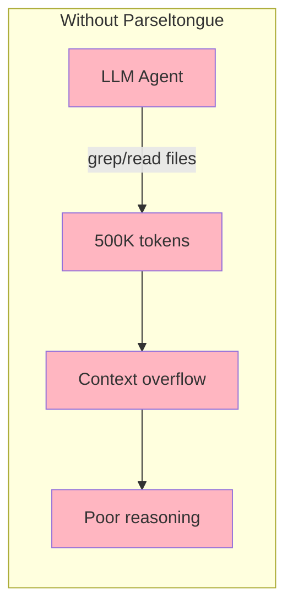
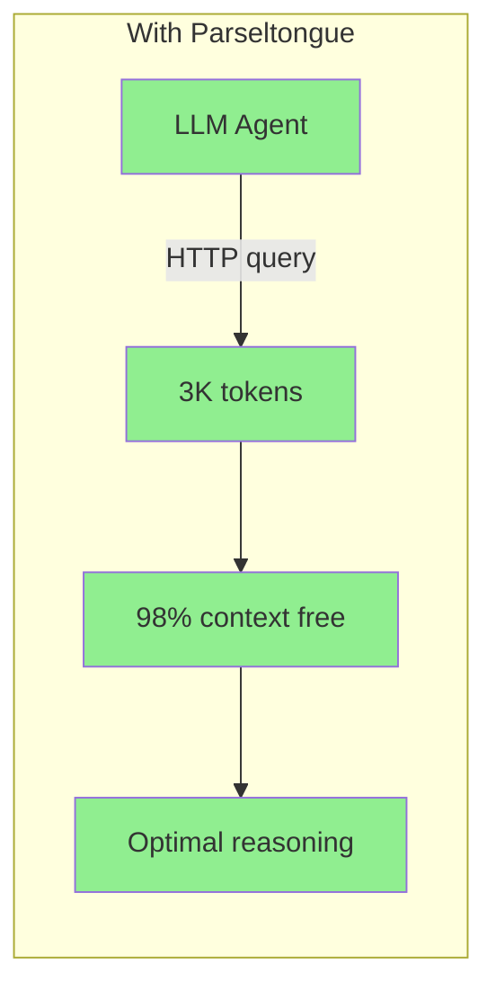

# Parseltongue

> **v1.2.0** - Parse once, query forever. A local HTTP backend that makes any LLM agent understand your codebase.

```bash
# Index your codebase
parseltongue pt01-folder-to-cozodb-streamer ./my-project --db "rocksdb:mycode.db"

# Start the HTTP server (default port: 7777)
parseltongue pt08-http-code-query-server --db "rocksdb:mycode.db"

# Query from your LLM agent
curl http://localhost:7777/codebase-statistics-overview-summary
```

**12 languages**: Rust, Python, JavaScript, TypeScript, Go, Java, C, C++, Ruby, PHP, C#, Swift

---

## The Problem



**Developers and LLM agents cannot easily understand codebases.** They resort to grep, which:
- Returns raw text (no semantic understanding)
- Uses 100× more tokens than needed
- Misses relationships between code entities
- Requires re-parsing on every query

---

## The Solution



**Code is a graph, not text.** Parseltongue:
1. **Parses** your codebase once (tree-sitter, 12 languages)
2. **Stores** entities + dependencies in a graph database (CozoDB)
3. **Serves** an HTTP API that any LLM agent can query

**Result**: 99% token reduction. 31× faster than grep. Structured graph data.

---

## Quick Start

### Step 1: Index Your Codebase

```bash
parseltongue pt01-folder-to-cozodb-streamer ./my-project --db "rocksdb:mycode.db"
```

**Output**:
```
Running Tool 1: folder-to-cozodb-streamer
  Database: rocksdb:mycode.db

Streaming Summary:
Total files found: 108
Files processed: 92
Entities created: 216 (CODE only)
  └─ CODE entities: 216
  └─ TEST entities: 982 (excluded for optimal LLM context)

✓ Indexing completed
```

### Step 2: Start the HTTP Server

```bash
parseltongue pt08-http-code-query-server --db "rocksdb:mycode.db"
```

**Output**:
```
Parseltongue HTTP Server
━━━━━━━━━━━━━━━━━━━━━━━━━━━━━━━━━━━━━━━━━━━━━━━━━━━━━━━━━━━━━━━━━

HTTP Server running at: http://localhost:7777

┌─────────────────────────────────────────────────────────────────┐
│  Add to your LLM agent: PARSELTONGUE_URL=http://localhost:7777  │
└─────────────────────────────────────────────────────────────────┘

Quick test:
  curl http://localhost:7777/server-health-check-status
```

### Step 3: Query from Your Agent

```bash
# Health check
curl http://localhost:7777/server-health-check-status

# Codebase overview
curl http://localhost:7777/codebase-statistics-overview-summary

# Search for functions
curl "http://localhost:7777/code-entities-search-fuzzy?q=authenticate"

# What calls this function?
curl "http://localhost:7777/reverse-callers-query-graph?entity=rust:fn:process:src_lib_rs:50-100"

# What breaks if I change this?
curl "http://localhost:7777/blast-radius-impact-analysis?entity=rust:fn:new:src_storage_rs:10-30&hops=3"

# Get optimal context for LLM (killer feature!)
curl "http://localhost:7777/smart-context-token-budget?focus=rust:fn:main:src_main_rs:1-50&tokens=4000"
```

---

## Jobs To Be Done

| User Job | HTTP Endpoint | Token Cost |
|----------|---------------|------------|
| "Is the server running?" | `GET /server-health-check-status` | ~35 |
| "Give me codebase overview" | `GET /codebase-statistics-overview-summary` | ~100 |
| "List all endpoints" | `GET /api-reference-documentation-help` | ~500 |
| "List all entities" | `GET /code-entities-list-all` | ~2K |
| "Find functions named X" | `GET /code-entities-search-fuzzy?q=X` | ~500 |
| "Get entity details" | `GET /code-entity-detail-view?key=X` | ~200 |
| "What calls this?" | `GET /reverse-callers-query-graph?entity=X` | ~500 |
| "What does this call?" | `GET /forward-callees-query-graph?entity=X` | ~500 |
| "List all edges" | `GET /dependency-edges-list-all` | ~3K |
| "What breaks if I change X?" | `GET /blast-radius-impact-analysis?entity=X&hops=3` | ~2K |
| "Any circular dependencies?" | `GET /circular-dependency-detection-scan` | ~1K |
| "Where is the complexity?" | `GET /complexity-hotspots-ranking-view?top=10` | ~500 |
| "What modules exist?" | `GET /semantic-cluster-grouping-list` | ~1K |
| "Give me optimal context" | `GET /smart-context-token-budget?focus=X&tokens=4000` | ~4K |
| "Hidden dependencies?" | `GET /temporal-coupling-hidden-deps?entity=X` | ~200 |

---

## HTTP API Reference (15 Endpoints)

### Core Endpoints

| Endpoint | Description |
|----------|-------------|
| `GET /server-health-check-status` | Server health check |
| `GET /codebase-statistics-overview-summary` | Entity/edge counts, languages |
| `GET /api-reference-documentation-help` | Full API documentation |

### Entity Endpoints

| Endpoint | Description |
|----------|-------------|
| `GET /code-entities-list-all` | All entities |
| `GET /code-entities-list-all?entity_type=function` | Filter by type |
| `GET /code-entity-detail-view?key=X` | Single entity details |
| `GET /code-entities-search-fuzzy?q=pattern` | Fuzzy search by name |

### Graph Query Endpoints

| Endpoint | Description |
|----------|-------------|
| `GET /dependency-edges-list-all` | All dependency edges |
| `GET /reverse-callers-query-graph?entity=X` | Who calls X? |
| `GET /forward-callees-query-graph?entity=X` | What does X call? |
| `GET /blast-radius-impact-analysis?entity=X&hops=N` | What breaks if X changes? |

### Analysis Endpoints

| Endpoint | Description |
|----------|-------------|
| `GET /circular-dependency-detection-scan` | Find circular dependencies |
| `GET /complexity-hotspots-ranking-view?top=N` | Complexity ranking |
| `GET /semantic-cluster-grouping-list` | Semantic module groups |

### Killer Features

| Endpoint | Description |
|----------|-------------|
| `GET /smart-context-token-budget?focus=X&tokens=N` | Optimal context selection |
| `GET /temporal-coupling-hidden-deps?entity=X` | Hidden temporal dependencies |

---

## Real-World Example Queries (Dogfooded on Parseltongue)

These examples were run against Parseltongue's own codebase (217 entities, 3027 dependency edges).

### Example 1: Understanding a New Codebase

```bash
# 1. Get codebase overview
curl http://localhost:7777/codebase-statistics-overview-summary | jq '.data'
```
**Actual Response**:
```json
{
  "code_entities_total_count": 217,
  "test_entities_total_count": 0,
  "dependency_edges_total_count": 3027,
  "languages_detected_list": ["rust"],
  "database_file_path": "rocksdb:parseltongue.db"
}
```

```bash
# 2. Find complexity hotspots (most called functions)
curl "http://localhost:7777/complexity-hotspots-ranking-view?top=5" | jq '.data.hotspots'
```
**Actual Response**:
```json
[
  {"rank": 1, "entity_key": "rust:fn:new:unknown:0-0", "inbound_count": 215, "total_coupling": 215},
  {"rank": 2, "entity_key": "rust:fn:unwrap:unknown:0-0", "inbound_count": 163, "total_coupling": 163},
  {"rank": 3, "entity_key": "rust:fn:to_string:unknown:0-0", "inbound_count": 139, "total_coupling": 139},
  {"rank": 4, "entity_key": "rust:fn:Ok:unknown:0-0", "inbound_count": 101, "total_coupling": 101},
  {"rank": 5, "entity_key": "rust:fn:Some:unknown:0-0", "inbound_count": 62, "total_coupling": 62}
]
```
> Note: `unknown:0-0` indicates stdlib/external calls (HashMap::new, unwrap, etc.)

```bash
# 3. Check for circular dependencies
curl http://localhost:7777/circular-dependency-detection-scan | jq '.data'
```
**Actual Response**:
```json
{"has_cycles": false, "cycle_count": 0, "cycles": []}
```

### Example 2: Impact Analysis Before Refactoring

```bash
# 1. Find who calls CozoDbStorage::new() (reverse dependencies)
curl "http://localhost:7777/reverse-callers-query-graph?entity=rust:method:new:__crates_parseltongue-core_src_storage_cozo_client_rs:38-54" | jq '.data.total_count'
```
**Actual Response**: `215` callers!

```bash
# 2. Get full blast radius (2-hop transitive impact)
curl "http://localhost:7777/blast-radius-impact-analysis?entity=rust:method:new:__crates_parseltongue-core_src_storage_cozo_client_rs:38-54&hops=2" | jq '.data'
```
**Actual Response**:
```json
{
  "source_entity": "rust:method:new:__crates_parseltongue-core_src_storage_cozo_client_rs:38-54",
  "hops_requested": 2,
  "total_affected": 302,
  "by_hop": [
    {"hop": 1, "count": 214, "entities": ["rust:fn:build_cli:...", "rust:fn:start_http_server_blocking_loop:...", "..."]},
    {"hop": 2, "count": 88, "entities": ["rust:fn:main:...", "rust:fn:handle_blast_radius_impact_analysis:...", "..."]}
  ]
}
```
> **Insight**: Changing `CozoDbStorage::new()` affects 302 entities transitively!

### Example 3: Finding and Exploring Code

```bash
# 1. Search for storage-related entities
curl "http://localhost:7777/code-entities-search-fuzzy?q=storage" | jq '.data.total_count'
```
**Actual Response**: `36` matching entities (struct, impl, methods)

```bash
# 2. Get full source code of CozoDbStorage::new()
curl "http://localhost:7777/code-entity-detail-view?key=rust:method:new:__crates_parseltongue-core_src_storage_cozo_client_rs:38-54" | jq '.data'
```
**Actual Response**:
```json
{
  "key": "rust:method:new:__crates_parseltongue-core_src_storage_cozo_client_rs:38-54",
  "file_path": "./crates/parseltongue-core/src/storage/cozo_client.rs",
  "entity_type": "method",
  "language": "rust",
  "code": "    pub async fn new(engine_spec: &str) -> Result<Self> {\n        let (engine, path) = if engine_spec.contains(':') {\n            let parts: Vec<&str> = engine_spec.splitn(2, ':').collect();\n            (parts[0], parts[1])\n        } else {\n            (engine_spec, \"\")\n        };\n        let db = DbInstance::new(engine, path, Default::default())\n            .map_err(|e| ParseltongError::DatabaseError {...})?;\n        Ok(Self { db })\n    }"
}
```

```bash
# 3. See what CozoDbStorage::new() calls (forward dependencies)
curl "http://localhost:7777/forward-callees-query-graph?entity=rust:method:new:__crates_parseltongue-core_src_storage_cozo_client_rs:38-54" | jq '.data.callees'
```
**Actual Response**:
```json
[
  {"to_key": "rust:fn:Ok:unknown:0-0", "edge_type": "Calls"},
  {"to_key": "rust:fn:collect:unknown:0-0", "edge_type": "Calls"},
  {"to_key": "rust:fn:contains:unknown:0-0", "edge_type": "Calls"},
  {"to_key": "rust:fn:default:unknown:0-0", "edge_type": "Calls"},
  {"to_key": "rust:fn:map_err:unknown:0-0", "edge_type": "Calls"},
  {"to_key": "rust:fn:new:unknown:0-0", "edge_type": "Calls"},
  {"to_key": "rust:fn:splitn:unknown:0-0", "edge_type": "Calls"},
  {"to_key": "rust:fn:to_string:unknown:0-0", "edge_type": "Calls"}
]
```

### Example 4: Find HTTP Handlers

```bash
# Search for all handler functions
curl "http://localhost:7777/code-entities-search-fuzzy?q=handler" | jq '.data.total_count'
```
**Actual Response**: `124` handler-related entities (functions, modules, structs)

### Example 5: Smart Context for LLM Agents

```bash
# Get optimal context within 2000 token budget
curl "http://localhost:7777/smart-context-token-budget?focus=rust:method:new:__crates_parseltongue-core_src_storage_cozo_client_rs:38-54&tokens=2000" | jq '.data'
```
**Actual Response**:
```json
{
  "focus_entity": "rust:method:new:__crates_parseltongue-core_src_storage_cozo_client_rs:38-54",
  "token_budget": 2000,
  "tokens_used": 816,
  "entities_included": 8,
  "context": [
    {"entity_key": "rust:fn:Ok:unknown:0-0", "relevance_score": 0.95, "relevance_type": "direct_callee"},
    {"entity_key": "rust:fn:collect:unknown:0-0", "relevance_score": 0.95, "relevance_type": "direct_callee"},
    {"entity_key": "rust:fn:contains:unknown:0-0", "relevance_score": 0.95, "relevance_type": "direct_callee"},
    {"entity_key": "rust:fn:default:unknown:0-0", "relevance_score": 0.95, "relevance_type": "direct_callee"},
    {"entity_key": "rust:fn:map_err:unknown:0-0", "relevance_score": 0.95, "relevance_type": "direct_callee"},
    {"entity_key": "rust:fn:new:unknown:0-0", "relevance_score": 0.95, "relevance_type": "direct_callee"},
    {"entity_key": "rust:fn:splitn:unknown:0-0", "relevance_score": 0.95, "relevance_type": "direct_callee"},
    {"entity_key": "rust:fn:to_string:unknown:0-0", "relevance_score": 0.95, "relevance_type": "direct_callee"}
  ]
}
```

**Smart Context Algorithm**:
- Direct callers: score 1.0
- Direct callees: score 0.95
- Transitive deps: score 0.7 - (0.1 × depth)
- Greedy knapsack selection until budget exhausted

---

## Entity Key Format

Entity keys follow this pattern:
```
language:entity_type:entity_name:file_path:line_range
```

**Example**: `rust:fn:authenticate:src_auth_rs:10-50`
- Language: `rust`
- Type: `fn` (function)
- Name: `authenticate`
- File: `src/auth.rs` (slashes become underscores)
- Lines: `10-50`

**Tip**: When using entity keys in URLs with query parameters, colons work fine:
```bash
curl "http://localhost:7777/reverse-callers-query-graph?entity=rust:fn:process:src_lib_rs:1-20"
```

---

## Response Format

All endpoints return consistent JSON:

```json
{
  "success": true,
  "endpoint": "/blast-radius-impact-analysis",
  "data": {
    "source_entity": "rust:fn:process:src_lib_rs:1-20",
    "total_affected": 14,
    "by_hop": [{"hop": 1, "count": 5, "entities": [...]}]
  },
  "tokens": 234
}
```

The `tokens` field helps LLMs understand context budget impact.

---

## CLI Options

```bash
parseltongue pt08-http-code-query-server [OPTIONS]
```

| Option | Description | Default |
|--------|-------------|---------|
| `--port <PORT>` | HTTP port | 7777 |
| `--db <PATH>` | Database path | `mem` (in-memory) |
| `--verbose` | Enable verbose logging | false |

**Database format**: Always use `rocksdb:` prefix for persistent databases:
```bash
--db "rocksdb:mycode.db"     # Correct
--db "mycode.db"              # Wrong
```

---

## Languages Supported

| Language | Extensions | Entity Types |
|----------|------------|--------------|
| **Rust** | `.rs` | fn, struct, enum, trait, impl, mod |
| **Python** | `.py` | def, class, async def |
| **JavaScript** | `.js`, `.jsx` | function, class, arrow functions |
| **TypeScript** | `.ts`, `.tsx` | function, class, interface, type |
| **Go** | `.go` | func, type, struct, interface |
| **Java** | `.java` | class, interface, method, enum |
| **C** | `.c`, `.h` | function, struct, typedef |
| **C++** | `.cpp`, `.hpp` | function, class, struct, template |
| **Ruby** | `.rb` | def, class, module |
| **PHP** | `.php` | function, class, trait |
| **C#** | `.cs` | class, struct, interface, method |
| **Swift** | `.swift` | func, class, struct, protocol |

---

## Edge Types

| Edge Type | Direction | Meaning |
|-----------|-----------|---------|
| `Calls` | downward | Function invocation |
| `Uses` | downward | Type/constant reference |
| `Implements` | upward | Trait implementation |
| `Extends` | upward | Inheritance |
| `Contains` | downward | Structural containment |

---

## Data Granularity

Parseltongue stores two types of data with different granularity levels:

### Entities (Fine-Grained)

Entities are parsed at **function/method/struct level** with full source locations:

| Entity Type | Count Example | Description |
|-------------|---------------|-------------|
| `struct` | 66 | Struct definitions |
| `function` | 53 | Free functions |
| `method` | 46 | Methods on impl blocks |
| `module` | 40 | Module declarations |
| `impl` | 8 | Implementation blocks |
| `enum` | 4 | Enum definitions |

**Entity Key Format**: `language:type:name:file_path:start_line-end_line`
```
rust:method:new:__crates_core_src_storage_rs:38-54
```

### Dependency Edges (File-to-Symbol)

Edges track **file-level** outgoing dependencies to **symbol-level** targets:

```
from_key: rust:file:__crates_core_src_entities_rs:1-1   (file level)
to_key:   rust:fn:new:unknown:0-0                        (symbol level)
```

### External/Stdlib References (`unknown:0-0`)

When code calls external functions (stdlib, crate dependencies), the target has `unknown:0-0` as its source location because parseltongue cannot locate the source:

| Pattern | Meaning | Example |
|---------|---------|---------|
| `rust:fn:new:unknown:0-0` | Stdlib `new()` calls | `HashMap::new()`, `Vec::new()` |
| `rust:fn:unwrap:unknown:0-0` | Stdlib `unwrap()` calls | `result.unwrap()` |
| `rust:fn:Ok:unknown:0-0` | Result enum variant | `Ok(value)` |
| `rust:module:SomeType:0-0` | External type reference | Type from another crate |

**Why this matters**: The complexity hotspots endpoint shows `rust:fn:new:unknown:0-0` with 215 callers - this means 215 places in your codebase call `new()` on various types.

---

## Performance

| Metric | Grep | Parseltongue | Improvement |
|--------|------|--------------|-------------|
| Query time | 7.5s | 50ms | **150× faster** |
| Tokens | 500K | 2.3K | **99.5% reduction** |
| Context free | 0% | 98.9% | **Optimal reasoning** |
| Structure | Raw text | Graph | **Semantic understanding** |

---

## Architecture

**4-Word Naming Convention**: All functions and endpoints use exactly 4 words for LLM tokenization optimization:
```
serve-http-code-backend          # 4 words
blast-radius-impact-analysis     # 4 words
code-entities-search-fuzzy       # 4 words
```

**Single Binary**: ~50MB, zero runtime dependencies.

---

## Installation

```bash
# Download (one command)
curl -L https://github.com/that-in-rust/parseltongue-dependency-graph-generator/releases/download/v1.2.0/parseltongue -o parseltongue && chmod +x parseltongue

# Verify
./parseltongue --version
# parseltongue 1.2.0
```

**Optional**: Add to PATH for global access:
```bash
sudo mv parseltongue /usr/local/bin/
```

**Releases**: https://github.com/that-in-rust/parseltongue-dependency-graph-generator/releases

---

## License

MIT License - See LICENSE file

---

**Parse once, query forever.**

*Parseltongue: Making LLMs reason about code with graphs, not text.*
