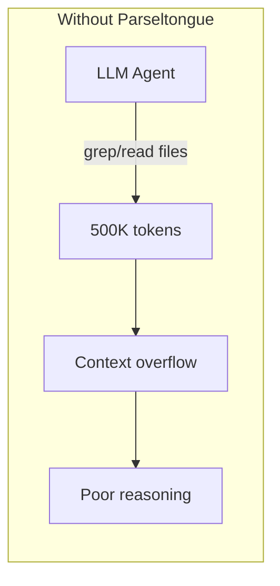
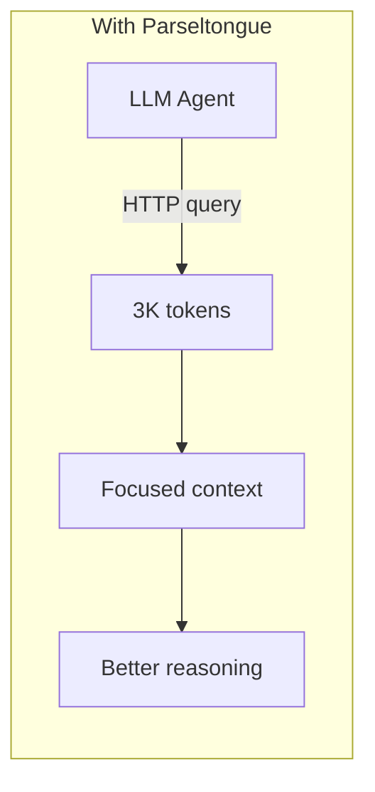

# Parseltongue


```bash
# Index your codebase
parseltongue pt01-folder-to-cozodb-streamer ./my-project --db "rocksdb:mycode.db"

# Start the HTTP server (default port: 7777)
parseltongue pt08-http-code-query-server --db "rocksdb:mycode.db"

# Query from your LLM agent
curl http://localhost:7777/codebase-statistics-overview-summary
```

**12 languages** | **26 HTTP endpoints** | **670 tests** | **2.92x parallel ingestion**

Rust, Python, JavaScript, TypeScript, Go, Java, C, C++, Ruby, PHP, C#, Swift

---

## What's New

### v1.6.7 — Windows Direct IO Fix for 144MB Stall

- **Direct IO for compaction**: `use_direct_io_for_flush_and_compaction=true` bypasses Windows Defender filesystem filter driver that was scanning every SST file during compaction, causing stalls at 144MB
- **Compaction readahead**: `compaction_readahead_size=2MB` as recommended by RocksDB wiki for direct IO mode

### v1.6.6 — LLM Agent System Prompt + Windows RocksDB Fix

- **LLM Agent System Prompt**: Copy-paste block with every endpoint and exact parameter names — zero guesswork for agents
- **Windows RocksDB write stall fix**: Auto-tunes RocksDB OPTIONS (128MB write buffer, 4 background jobs) to prevent 75MB ingestion stall caused by Windows Defender scanning SST files
- **Concurrent batch insert**: All 5 CozoDB relation inserts now run in parallel via `tokio::join!` (was 4+1 sequential)

### v1.6.5 — Folder-Scoped Queries + Diagnostics + 2.92x Parallelism

- **Folder-scoped queries**: All 18 query endpoints accept `?scope=L1||L2` to filter results by folder
- **Ingestion diagnostics**: `/ingestion-diagnostics-coverage-report` with test exclusions, word coverage, ignored files
- **Folder discovery**: `/folder-structure-discovery-tree` for L1/L2 navigation
- **Thread-local parser parallelism**: 2.92x streaming speedup (5.4s to 1.8s on 302-file codebase, 364% CPU)
- **Dual coverage metrics**: `raw_coverage_pct` vs `effective_coverage_pct` (accounting for imports/comments)
- **670 tests** across 12 languages and all subsystems

### v1.6.0 — 7 Mathematical Graph Analysis Algorithms

- **Tarjan SCC**: Strongly connected component cycle detection
- **K-Core decomposition**: Core/mid/peripheral layer analysis
- **PageRank + Betweenness centrality**: Entity importance ranking
- **Shannon entropy**: Information complexity measurement
- **CK Metrics suite**: CBO, LCOM, RFC, WMC coupling/cohesion
- **SQALE technical debt**: ISO 25010 maintainability scoring
- **Leiden community detection**: Automatic module clustering

---

## LLM Agent System Prompt

Copy this block into your LLM agent's system prompt. It contains every endpoint with exact parameter names — no guessing required.

```text
PARSELTONGUE CODE ANALYSIS API — Base URL: http://localhost:7777
All responses: {"success": bool, "endpoint": str, "data": {…}, "tokens": int}
Entity keys look like: language:type:name:file_path:line_range (e.g. rust:fn:main:src_main_rs:1-50)
All query endpoints accept optional ?scope=L1||L2 to filter by folder.

STEP 1 — ORIENT (no params needed)
  GET /server-health-check-status                              → server ok + uptime
  GET /codebase-statistics-overview-summary                    → entity count, edge count, languages
  GET /folder-structure-discovery-tree                          → L1/L2 folder tree with entity counts
  GET /api-reference-documentation-help                        → full API docs with examples

STEP 2 — FIND ENTITIES
  GET /code-entities-list-all                                  → all entities (data.total_count, data.entities[])
  GET /code-entities-list-all?entity_type=function             → filter by type
  GET /code-entities-search-fuzzy?q=PATTERN                    → fuzzy name search (data.total_count, data.entities[])
  GET /code-entity-detail-view?key=ENTITY_KEY                  → full source code of one entity

STEP 3 — TRACE DEPENDENCIES
  GET /dependency-edges-list-all                               → all edges (from_key, to_key, edge_type)
  GET /reverse-callers-query-graph?entity=ENTITY_KEY           → who calls this entity
  GET /forward-callees-query-graph?entity=ENTITY_KEY           → what does this entity call
  GET /blast-radius-impact-analysis?entity=ENTITY_KEY&hops=N   → transitive impact (default hops=2)

STEP 4 — ANALYZE ARCHITECTURE
  GET /circular-dependency-detection-scan                      → circular dependency cycles
  GET /complexity-hotspots-ranking-view?top=N                  → most coupled entities (default top=10)
  GET /semantic-cluster-grouping-list                           → module groupings
  GET /strongly-connected-components-analysis                   → Tarjan SCC cycle detection
  GET /technical-debt-sqale-scoring                             → ISO 25010 SQALE debt scores
  GET /kcore-decomposition-layering-analysis                    → core/mid/peripheral layers
  GET /centrality-measures-entity-ranking?method=pagerank       → entity importance (method: pagerank|betweenness)
  GET /entropy-complexity-measurement-scores                    → Shannon entropy per entity
  GET /coupling-cohesion-metrics-suite                          → CK metrics: CBO, LCOM, RFC, WMC
  GET /leiden-community-detection-clusters                      → Leiden community detection

STEP 5 — CONTEXT FOR LLM
  GET /smart-context-token-budget?focus=ENTITY_KEY&tokens=N    → optimal code context within token budget

STEP 6 — DIAGNOSTICS
  GET /file-watcher-status-check                               → file watcher status
  POST /incremental-reindex-file-update?path=FILE_PATH         → reindex one file
  GET /ingestion-coverage-folder-report?depth=N                → per-folder parse coverage
  GET /ingestion-diagnostics-coverage-report                   → full diagnostics report
  GET /ingestion-diagnostics-coverage-report?section=summary   → summary only (saves tokens)
  GET /ingestion-diagnostics-coverage-report?section=word_coverage    → per-file coverage
  GET /ingestion-diagnostics-coverage-report?section=test_entities   → excluded test functions
  GET /ingestion-diagnostics-coverage-report?section=ignored_files   → skipped files

WORKFLOW: Orient → Search → Read code → Trace callers → Check blast radius → Get LLM context
```

---

## The Problem



**Developers and LLM agents cannot easily understand codebases.** They resort to grep, which:
- Returns raw text (no semantic understanding)
- Consumes excessive tokens
- Misses relationships between code entities
- Requires re-parsing on every query

---

## The Solution



**Code is a graph, not text.** Parseltongue:
1. **Parses** your codebase once (tree-sitter, 12 languages)
2. **Stores** entities + dependencies in a graph database (CozoDB)
3. **Serves** an HTTP API that any LLM agent can query

---

## Impact Analysis

> *"If I change this function, what breaks?"*

**One query:**
```bash
curl "http://localhost:7777/blast-radius-impact-analysis?entity=rust:fn:authenticate:src/auth.rs:10-50&hops=2"
```
```json
{"total_affected": 302, "direct_callers": 14, "transitive": 288}
```

With grep: 500K tokens, no dependency info. With Parseltongue: 2K tokens, full graph answer.

---

## Jobs To Be Done

| User Job | HTTP Endpoint | Token Cost |
|----------|---------------|------------|
| "Is the server running?" | `GET /server-health-check-status` | ~35 |
| "Give me codebase overview" | `GET /codebase-statistics-overview-summary` | ~100 |
| "List all endpoints" | `GET /api-reference-documentation-help` | ~500 |
| "List all entities" | `GET /code-entities-list-all` | ~2K |
| "Find functions named X" | `GET /code-entities-search-fuzzy?q=X` | ~500 |
| "Get entity details" | `GET /code-entity-detail-view?key=X` | ~200 |
| "What calls this?" | `GET /reverse-callers-query-graph?entity=X` | ~500 |
| "What does this call?" | `GET /forward-callees-query-graph?entity=X` | ~500 |
| "List all edges" | `GET /dependency-edges-list-all` | ~3K |
| "What breaks if I change X?" | `GET /blast-radius-impact-analysis?entity=X&hops=3` | ~2K |
| "Any circular dependencies?" | `GET /circular-dependency-detection-scan` | ~1K |
| "Where is the complexity?" | `GET /complexity-hotspots-ranking-view?top=10` | ~500 |
| "What modules exist?" | `GET /semantic-cluster-grouping-list` | ~1K |
| "Give me optimal context" | `GET /smart-context-token-budget?focus=X&tokens=4000` | ~4K |
| "Is file watching on?" | `GET /file-watcher-status-check` | ~50 |
| "Reindex this file" | `POST /incremental-reindex-file-update?path=X` | ~100 |
| "How much was parsed?" | `GET /ingestion-coverage-folder-report?depth=2` | ~1.5K |
| "What folders exist?" | `GET /folder-structure-discovery-tree` | ~250 |
| "Parse quality report" | `GET /ingestion-diagnostics-coverage-report` | ~1.8K |
| "Just the summary" | `GET /ingestion-diagnostics-coverage-report?section=summary` | ~100 |

---

## Folder-Scoped Queries (v1.6.5)

All 18 query endpoints accept an optional `?scope=` parameter to filter results by folder:

```bash
# Discover folder structure first
curl http://localhost:7777/folder-structure-discovery-tree

# Scope queries to a specific folder
curl "http://localhost:7777/code-entities-list-all?scope=crates||parseltongue-core"
curl "http://localhost:7777/blast-radius-impact-analysis?entity=ENTITY_KEY&hops=2&scope=crates||parseltongue-core"
curl "http://localhost:7777/circular-dependency-detection-scan?scope=crates||pt08-http-code-query-server"
```

**Scope syntax**: `?scope=L1` (top-level folder) or `?scope=L1||L2` (subfolder). Double-pipe `||` delimiter avoids path separator confusion. Absent `?scope=` returns full unfiltered results (backward compatible). Invalid scope returns suggestions.

---

## Ingestion Diagnostics (v1.6.5)

```bash
# Full diagnostics report (test exclusions + word coverage + ignored files)
curl http://localhost:7777/ingestion-diagnostics-coverage-report

# Request specific section only (saves tokens)
curl "http://localhost:7777/ingestion-diagnostics-coverage-report?section=summary"
curl "http://localhost:7777/ingestion-diagnostics-coverage-report?section=word_coverage"
curl "http://localhost:7777/ingestion-diagnostics-coverage-report?section=test_entities"
curl "http://localhost:7777/ingestion-diagnostics-coverage-report?section=ignored_files"
```

**Dual coverage metrics**: Each parsed file gets `raw_coverage_pct` (entity words / source words) and `effective_coverage_pct` (entity words / source words minus imports and comments). A file at 72% raw / 96% effective is healthy -- the gap is imports and comments.

---

## HTTP API Reference (26 Endpoints)

### Core Endpoints

| Endpoint | Description |
|----------|-------------|
| `GET /server-health-check-status` | Server health check |
| `GET /codebase-statistics-overview-summary` | Entity/edge counts, languages |
| `GET /api-reference-documentation-help` | Full API documentation |

### Entity Endpoints

| Endpoint | Description |
|----------|-------------|
| `GET /code-entities-list-all` | All entities (supports `?scope=`) |
| `GET /code-entities-list-all?entity_type=function` | Filter by type |
| `GET /code-entity-detail-view?key=X` | Single entity details (supports `?scope=`) |
| `GET /code-entities-search-fuzzy?q=pattern` | Fuzzy search by name (supports `?scope=`) |

### Graph Query Endpoints

All graph endpoints support `?scope=` for folder-scoped analysis.

| Endpoint | Description |
|----------|-------------|
| `GET /dependency-edges-list-all` | All dependency edges |
| `GET /reverse-callers-query-graph?entity=X` | Who calls X? |
| `GET /forward-callees-query-graph?entity=X` | What does X call? |
| `GET /blast-radius-impact-analysis?entity=X&hops=N` | What breaks if X changes? |

### Analysis Endpoints

All analysis endpoints support `?scope=` for folder-scoped analysis.

| Endpoint | Description |
|----------|-------------|
| `GET /circular-dependency-detection-scan` | Find circular dependencies |
| `GET /complexity-hotspots-ranking-view?top=N` | Complexity ranking |
| `GET /semantic-cluster-grouping-list` | Semantic module groups |

### Context Optimization

| Endpoint | Description |
|----------|-------------|
| `GET /smart-context-token-budget?focus=X&tokens=N` | Context selection within token budget |

### File Watcher Endpoints

| Endpoint | Description |
|----------|-------------|
| `GET /file-watcher-status-check` | File watcher status |
| `POST /incremental-reindex-file-update?path=X` | Reindex a specific file |

### Coverage & Diagnostics Endpoints

| Endpoint | Description |
|----------|-------------|
| `GET /ingestion-coverage-folder-report?depth=N` | Per-folder parse coverage (total, eligible, parsed files) |
| `GET /ingestion-diagnostics-coverage-report` | Test exclusions, word coverage, ignored files (v1.6.5) |
| `GET /ingestion-diagnostics-coverage-report?section=summary` | Summary aggregates only (v1.6.5) |

### Navigation Endpoints (v1.6.5)

| Endpoint | Description |
|----------|-------------|
| `GET /folder-structure-discovery-tree` | L1/L2 folder tree with entity counts |

### Graph Analysis Endpoints (v1.6.0)

| Endpoint | Description |
|----------|-------------|
| `GET /strongly-connected-components-analysis` | Tarjan SCC cycle detection |
| `GET /technical-debt-sqale-scoring` | ISO 25010 SQALE technical debt |
| `GET /kcore-decomposition-layering-analysis` | Core/mid/peripheral layers |
| `GET /centrality-measures-entity-ranking?method=pagerank` | PageRank/betweenness centrality |
| `GET /entropy-complexity-measurement-scores` | Shannon entropy complexity |
| `GET /coupling-cohesion-metrics-suite` | CK metrics: CBO, LCOM, RFC, WMC |
| `GET /leiden-community-detection-clusters` | Leiden community detection |

---

## Quick Start

### Step 1: Index Your Codebase

```bash
parseltongue pt01-folder-to-cozodb-streamer ./my-project --db "rocksdb:mycode.db"
```

### Step 2: Start the HTTP Server

```bash
parseltongue pt08-http-code-query-server --db "rocksdb:mycode.db"
```

File watching is always on -- save a file, graph updates automatically.

### Step 3: Query

```bash
# Health check
curl http://localhost:7777/server-health-check-status

# Codebase overview
curl http://localhost:7777/codebase-statistics-overview-summary

# Search for functions
curl "http://localhost:7777/code-entities-search-fuzzy?q=authenticate"

# What calls this function?
curl "http://localhost:7777/reverse-callers-query-graph?entity=rust:fn:process:src_lib_rs:50-100"

# What breaks if I change this?
curl "http://localhost:7777/blast-radius-impact-analysis?entity=rust:fn:new:src_storage_rs:10-30&hops=3"

# Get optimal context for LLM
curl "http://localhost:7777/smart-context-token-budget?focus=rust:fn:main:src_main_rs:1-50&tokens=4000"
```

---

## Querying with jq

```bash
# Extract just the data
curl -s http://localhost:7777/codebase-statistics-overview-summary | jq '.data'

# Count search results
curl -s "http://localhost:7777/code-entities-search-fuzzy?q=auth" | jq '.data.total_count'

# Filter entities by type
curl -s http://localhost:7777/code-entities-list-all | \
  jq '[.data.entities[] | select(.entity_type == "function")]'

# Get all callers as a flat list
curl -s "http://localhost:7777/reverse-callers-query-graph?entity=ENTITY_KEY" | \
  jq '[.data.callers[].from_key]'

# Filter edges by target
curl -s http://localhost:7777/dependency-edges-list-all | \
  jq '[.data.edges[] | select(.to_key | contains("Auth"))]'

# Count edges by type
curl -s http://localhost:7777/dependency-edges-list-all | \
  jq '.data.edges | group_by(.edge_type) | map({type: .[0].edge_type, count: length})'
```

**Field names**: Edges use `from_key`, `to_key`, `edge_type`. Entities use `key`, `name`, `entity_type`, `language`, `file_path`.

## Querying with Python

```python
import requests

BASE = "http://localhost:7777"

# Codebase overview
stats = requests.get(f"{BASE}/codebase-statistics-overview-summary").json()["data"]
print(f"{stats['code_entities_total_count']} entities, {stats['dependency_edges_total_count']} edges")

# Search and iterate
results = requests.get(f"{BASE}/code-entities-search-fuzzy", params={"q": "auth"}).json()
for entity in results["data"]["entities"]:
    print(f"{entity['entity_type']:10} {entity['key']}")

# Blast radius
impact = requests.get(f"{BASE}/blast-radius-impact-analysis",
    params={"entity": "rust:fn:authenticate:src_auth_rs:10-50", "hops": 2}).json()
print(f"Total affected: {impact['data']['total_affected']}")

# Coverage check
coverage = requests.get(f"{BASE}/ingestion-coverage-folder-report", params={"depth": 2}).json()
for folder in coverage["data"]["folders"]:
    print(f"{folder['coverage_pct']:5.1f}%  {folder['folder_path']}")
```

---

## Entity Key Format

```
language:entity_type:entity_name:file_path:line_range
```

**Example**: `rust:fn:authenticate:src_auth_rs:10-50`

| Part | Example | Notes |
|------|---------|-------|
| Language | `rust` | |
| Type | `fn` | function, struct, method, class, etc. |
| Name | `authenticate` | |
| File | `src_auth_rs` | Slashes become underscores |
| Lines | `10-50` | Start-end line range |

`unknown:0-0` = stdlib/external call (e.g. `HashMap::new()`, `unwrap()`)

---

## Response Format

All endpoints return consistent JSON:

```json
{
  "success": true,
  "endpoint": "/blast-radius-impact-analysis",
  "data": { ... },
  "tokens": 234
}
```

The `tokens` field helps LLMs track context budget.

---

## Languages Supported

| Language | Extensions | Entity Types |
|----------|------------|--------------|
| **Rust** | `.rs` | fn, struct, enum, trait, impl, mod |
| **Python** | `.py` | def, class, async def |
| **JavaScript** | `.js`, `.jsx` | function, class, arrow functions |
| **TypeScript** | `.ts`, `.tsx` | function, class, interface, type |
| **Go** | `.go` | func, type, struct, interface |
| **Java** | `.java` | class, interface, method, enum |
| **C** | `.c`, `.h` | function, struct, typedef |
| **C++** | `.cpp`, `.hpp` | function, class, struct, template |
| **Ruby** | `.rb` | def, class, module |
| **PHP** | `.php` | function, class, trait |
| **C#** | `.cs` | class, struct, interface, method |
| **Swift** | `.swift` | func, class, struct, protocol |

---

## Edge Types

| Edge Type | Meaning |
|-----------|---------|
| `Calls` | Function invocation |
| `Uses` | Type/constant reference |
| `Implements` | Trait implementation |
| `Extends` | Inheritance |
| `Contains` | Structural containment |

---

## CLI Options

```bash
parseltongue pt08-http-code-query-server [OPTIONS]
```

| Option | Description | Default |
|--------|-------------|---------|
| `--port <PORT>` | HTTP port | 7777 |
| `--db <PATH>` | Database path (`rocksdb:` prefix required) | `mem` |
| `--verbose` | Verbose logging | false |

---

## Installation

```bash
curl -L https://github.com/that-in-rust/parseltongue-dependency-graph-generator/releases/download/v1.6.7/parseltongue -o parseltongue && chmod +x parseltongue
./parseltongue --version
```

**Releases**: https://github.com/that-in-rust/parseltongue-dependency-graph-generator/releases

---

## Best Practices: Ready-Made Workflows

### New Codebase Orientation (5 queries)

```bash
# 1. Scale: how big is this?
curl http://localhost:7777/codebase-statistics-overview-summary

# 2. Health: any circular dependencies?
curl http://localhost:7777/circular-dependency-detection-scan

# 3. Hotspots: where is the complexity?
curl "http://localhost:7777/complexity-hotspots-ranking-view?top=10"

# 4. Structure: what are the modules?
curl http://localhost:7777/semantic-cluster-grouping-list

# 5. Coverage: how much was actually parsed?
curl "http://localhost:7777/ingestion-coverage-folder-report?depth=2"
```

After these 5 queries you know: size, health, risk areas, module boundaries, and parse confidence.

### Bug Hunting (trace backward from symptom)

```bash
# 1. Find the broken function
curl "http://localhost:7777/code-entities-search-fuzzy?q=FUNCTION_NAME"

# 2. Read its code
curl "http://localhost:7777/code-entity-detail-view?key=ENTITY_KEY"

# 3. Who calls it? (find the trigger)
curl "http://localhost:7777/reverse-callers-query-graph?entity=ENTITY_KEY"

# 4. How deep does the problem go?
curl "http://localhost:7777/blast-radius-impact-analysis?entity=ENTITY_KEY&hops=2"
```

### Safe Refactoring (quantify risk before changing)

```bash
# 1. Direct callers (minimum places to update)
curl "http://localhost:7777/reverse-callers-query-graph?entity=ENTITY_KEY"

# 2. Transitive blast radius
curl "http://localhost:7777/blast-radius-impact-analysis?entity=ENTITY_KEY&hops=3"

# 3. Is it in a cycle? (high risk if yes)
curl http://localhost:7777/circular-dependency-detection-scan

# 4. Get full context for AI-assisted refactor
curl "http://localhost:7777/smart-context-token-budget?focus=ENTITY_KEY&tokens=8000"
```

**Risk guide**: 0-5 direct callers = low risk. 6-15 = medium. >15 = high. If blast radius exceeds 100 at hops=2, you're touching critical infrastructure.

### When to Use Which Endpoint

| Question | Endpoint |
|----------|----------|
| How big is this? | `/codebase-statistics-overview-summary` |
| Where is X? | `/code-entities-search-fuzzy` |
| What is X? | `/code-entity-detail-view` |
| Who uses X? | `/reverse-callers-query-graph` |
| What does X use? | `/forward-callees-query-graph` |
| What breaks if I change X? | `/blast-radius-impact-analysis` |
| Is architecture healthy? | `/circular-dependency-detection-scan` |
| Where is the complexity? | `/complexity-hotspots-ranking-view` |
| What are the modules? | `/semantic-cluster-grouping-list` |
| Give me LLM context | `/smart-context-token-budget` |
| How much was parsed? | `/ingestion-coverage-folder-report` |
| What folders exist? | `/folder-structure-discovery-tree` |
| Parse quality diagnostics? | `/ingestion-diagnostics-coverage-report` |
| Find dependency cycles (SCC) | `/strongly-connected-components-analysis` |
| Technical debt score | `/technical-debt-sqale-scoring` |
| Core vs peripheral code | `/kcore-decomposition-layering-analysis` |
| Most important entities | `/centrality-measures-entity-ranking?method=pagerank` |
| Information complexity | `/entropy-complexity-measurement-scores` |
| Coupling/cohesion metrics | `/coupling-cohesion-metrics-suite` |
| Automatic module detection | `/leiden-community-detection-clusters` |
| Scope to one folder? | Add `?scope=L1\|\|L2` to any query endpoint |

---

## Best Practices: Performance and Deployment

### Windows Users

Parseltongue auto-tunes RocksDB on first run. If ingestion appears stuck at ~75MB, add the database directory to Windows Defender exclusions:

```
Windows Security → Virus & Threat Protection → Manage Settings → Exclusions
→ Add folder: parseltongue*/analysis.db
```

Or use a [Dev Drive](https://learn.microsoft.com/en-us/windows/dev-drive/) (Windows 11) which scans asynchronously.

### Large Codebases (10K+ files)

```bash
# Use RocksDB for persistence (not in-memory)
parseltongue pt01-folder-to-cozodb-streamer ./large-project --db "rocksdb:mydb"

# Verify coverage after ingestion
curl "http://localhost:7777/ingestion-coverage-folder-report?depth=2"

# Check for parse quality issues
curl "http://localhost:7777/ingestion-diagnostics-coverage-report?section=summary"
```

### Architecture Review (7 queries)

```bash
# 1. Scale
curl http://localhost:7777/codebase-statistics-overview-summary

# 2. Dependency cycles (Tarjan SCC)
curl http://localhost:7777/strongly-connected-components-analysis

# 3. Technical debt hotspots (ISO 25010 SQALE)
curl http://localhost:7777/technical-debt-sqale-scoring

# 4. Core vs peripheral (K-Core decomposition)
curl http://localhost:7777/kcore-decomposition-layering-analysis

# 5. Most important entities (PageRank)
curl "http://localhost:7777/centrality-measures-entity-ranking?method=pagerank"

# 6. Coupling and cohesion (CK Metrics)
curl http://localhost:7777/coupling-cohesion-metrics-suite

# 7. Natural module boundaries (Leiden clustering)
curl http://localhost:7777/leiden-community-detection-clusters
```

After these 7 queries you know: size, cycles, debt, core structure, critical entities, coupling health, and natural modules.

### Using Parseltongue with LLM Agents

See the **LLM Agent System Prompt** section at the top of this README. Copy that block into your agent's system prompt — it has every endpoint with exact parameter names and a recommended workflow.

---

## License

MIT License - See LICENSE file

---

*Parse once, query forever.*
