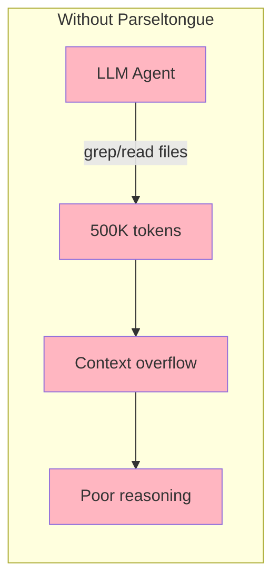
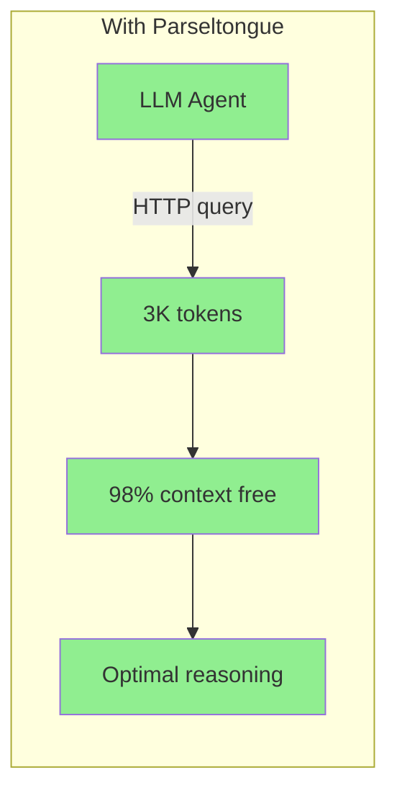

# Parseltongue

> **v1.0.9** - Parse once, query forever. A local HTTP backend that makes any LLM agent understand your codebase.

```bash
# Index your codebase
parseltongue pt01-folder-to-cozodb-streamer ./my-project --db "rocksdb:mycode.db"

# Start the HTTP server
parseltongue serve-http-code-backend --db "rocksdb:mycode.db" --port 8080

# Query from your LLM agent
curl http://localhost:8080/codebase-statistics-overview-summary
```

**12 languages**: Rust, Python, JavaScript, TypeScript, Go, Java, C, C++, Ruby, PHP, C#, Swift

---

## The Problem



**Developers and LLM agents cannot easily understand codebases.** They resort to grep, which:
- Returns raw text (no semantic understanding)
- Uses 100× more tokens than needed
- Misses relationships between code entities
- Requires re-parsing on every query

---

## The Solution



**Code is a graph, not text.** Parseltongue:
1. **Parses** your codebase once (tree-sitter, 12 languages)
2. **Stores** entities + dependencies in a graph database (CozoDB)
3. **Serves** an HTTP API that any LLM agent can query

**Result**: 99% token reduction. 31× faster than grep. Structured graph data.

---

## Quick Start

### Step 1: Index Your Codebase

```bash
parseltongue pt01-folder-to-cozodb-streamer ./my-project --db "rocksdb:mycode.db"
```

**Output**:
```
Running Tool 1: folder-to-cozodb-streamer
  Database: rocksdb:mycode.db

Streaming Summary:
Total files found: 108
Files processed: 92
Entities created: 216 (CODE only)
  └─ CODE entities: 216
  └─ TEST entities: 982 (excluded for optimal LLM context)

✓ Indexing completed
```

### Step 2: Start the HTTP Server

```bash
parseltongue serve-http-code-backend --db "rocksdb:mycode.db" --port 8080
```

**Output**:
```
Parseltongue HTTP Server
━━━━━━━━━━━━━━━━━━━━━━━━━━━━━━━━━━━━━━━━━━━━━━━━━━━━━━━━━━━━━━━━━

HTTP Server running at: http://localhost:8080

┌─────────────────────────────────────────────────────────────────┐
│  Add to your LLM agent: PARSELTONGUE_URL=http://localhost:8080  │
└─────────────────────────────────────────────────────────────────┘

Quick test:
  curl http://localhost:8080/server-health-check-status
```

### Step 3: Query from Your Agent

```bash
# Health check
curl http://localhost:8080/server-health-check-status

# Codebase overview
curl http://localhost:8080/codebase-statistics-overview-summary

# Search for functions
curl "http://localhost:8080/code-entities-search-fuzzy?q=authenticate"

# What calls this function?
curl "http://localhost:8080/reverse-callers-query-graph?entity=rust:fn:process:src_lib_rs:50-100"

# What breaks if I change this?
curl "http://localhost:8080/blast-radius-impact-analysis?entity=rust:fn:new:src_storage_rs:10-30&hops=3"

# Get optimal context for LLM (killer feature!)
curl "http://localhost:8080/smart-context-token-budget?focus=rust:fn:main:src_main_rs:1-50&tokens=4000"
```

---

## Jobs To Be Done

| User Job | HTTP Endpoint | Token Cost |
|----------|---------------|------------|
| "Is the server running?" | `GET /server-health-check-status` | ~35 |
| "Give me codebase overview" | `GET /codebase-statistics-overview-summary` | ~100 |
| "List all endpoints" | `GET /api-reference-documentation-help` | ~500 |
| "List all entities" | `GET /code-entities-list-all` | ~2K |
| "Find functions named X" | `GET /code-entities-search-fuzzy?q=X` | ~500 |
| "Get entity details" | `GET /code-entity-detail-view/{key}` | ~200 |
| "What calls this?" | `GET /reverse-callers-query-graph?entity=X` | ~500 |
| "What does this call?" | `GET /forward-callees-query-graph?entity=X` | ~500 |
| "List all edges" | `GET /dependency-edges-list-all` | ~3K |
| "What breaks if I change X?" | `GET /blast-radius-impact-analysis?entity=X&hops=3` | ~2K |
| "Any circular dependencies?" | `GET /circular-dependency-detection-scan` | ~1K |
| "Where is the complexity?" | `GET /complexity-hotspots-ranking-view?top=10` | ~500 |
| "What modules exist?" | `GET /semantic-cluster-grouping-list` | ~1K |
| "Give me optimal context" | `GET /smart-context-token-budget?focus=X&tokens=4000` | ~4K |
| "Hidden dependencies?" | `GET /temporal-coupling-hidden-deps?entity=X` | ~200 |

---

## HTTP API Reference (15 Endpoints)

### Core Endpoints

| Endpoint | Description |
|----------|-------------|
| `GET /server-health-check-status` | Server health check |
| `GET /codebase-statistics-overview-summary` | Entity/edge counts, languages |
| `GET /api-reference-documentation-help` | Full API documentation |

### Entity Endpoints

| Endpoint | Description |
|----------|-------------|
| `GET /code-entities-list-all` | All entities |
| `GET /code-entities-list-all?entity_type=function` | Filter by type |
| `GET /code-entity-detail-view/{key}` | Single entity details |
| `GET /code-entities-search-fuzzy?q=pattern` | Fuzzy search by name |

### Graph Query Endpoints

| Endpoint | Description |
|----------|-------------|
| `GET /dependency-edges-list-all` | All dependency edges |
| `GET /reverse-callers-query-graph?entity=X` | Who calls X? |
| `GET /forward-callees-query-graph?entity=X` | What does X call? |
| `GET /blast-radius-impact-analysis?entity=X&hops=N` | What breaks if X changes? |

### Analysis Endpoints

| Endpoint | Description |
|----------|-------------|
| `GET /circular-dependency-detection-scan` | Find circular dependencies |
| `GET /complexity-hotspots-ranking-view?top=N` | Complexity ranking |
| `GET /semantic-cluster-grouping-list` | Semantic module groups |

### Killer Features

| Endpoint | Description |
|----------|-------------|
| `GET /smart-context-token-budget?focus=X&tokens=N` | Optimal context selection |
| `GET /temporal-coupling-hidden-deps?entity=X` | Hidden temporal dependencies |

---

## Deeply Thought Example Queries

### Example 1: Understanding a New Codebase

```bash
# 1. Get codebase overview
curl http://localhost:8080/codebase-statistics-overview-summary | jq '.data'
# Returns: entity counts, edge counts, languages detected

# 2. Find complexity hotspots (most coupled code)
curl "http://localhost:8080/complexity-hotspots-ranking-view?top=10" | jq '.data.hotspots'
# Returns: Top 10 entities by coupling (inbound + outbound dependencies)

# 3. Check for circular dependencies
curl http://localhost:8080/circular-dependency-detection-scan | jq '.data'
# Returns: has_cycles, cycle_count, cycle paths
```

### Example 2: Impact Analysis Before Refactoring

```bash
# 1. Find who calls the function you want to change
curl "http://localhost:8080/reverse-callers-query-graph?entity=rust:fn:process_request:src_handler_rs:20-80" | jq '.data'
# Returns: All callers (direct dependencies)

# 2. Get full blast radius (transitive impact)
curl "http://localhost:8080/blast-radius-impact-analysis?entity=rust:fn:process_request:src_handler_rs:20-80&hops=3" | jq '.data'
# Returns: total_affected count, by_hop breakdown

# 3. Get optimal context for the LLM to understand the refactoring
curl "http://localhost:8080/smart-context-token-budget?focus=rust:fn:process_request:src_handler_rs:20-80&tokens=5000" | jq '.data'
# Returns: Focus entity + highest-relevance related entities within 5000 tokens
```

### Example 3: Finding and Exploring Code

```bash
# 1. Search for authentication-related code
curl "http://localhost:8080/code-entities-search-fuzzy?q=auth" | jq '.data.entities[].key'
# Returns: All entities with "auth" in their name

# 2. Get details of a specific entity
curl "http://localhost:8080/code-entity-detail-view/rust:fn:authenticate:src_auth_rs:10-50" | jq '.data'
# Returns: Full entity details including source code

# 3. See what the auth function depends on
curl "http://localhost:8080/forward-callees-query-graph?entity=rust:fn:authenticate:src_auth_rs:10-50" | jq '.data'
# Returns: All functions/types that authenticate() calls
```

### Example 4: Module Architecture Understanding

```bash
# 1. Get semantic clusters (modules that work together)
curl http://localhost:8080/semantic-cluster-grouping-list | jq '.data.clusters'
# Returns: Entities grouped by connectivity (Label Propagation Algorithm)

# 2. Get all edges to understand the dependency graph
curl http://localhost:8080/dependency-edges-list-all | jq '.data.total_count'
# Returns: Total edge count and edge details
```

### Example 5: Discover Hidden Dependencies

```bash
# Reveal the INVISIBLE architecture - files that change together with ZERO code edge
curl "http://localhost:8080/temporal-coupling-hidden-deps?entity=rust:fn:authenticate:src_auth_rs:10-50" | jq '.data'
```

**Response**:
```json
{
  "source_entity": "rust:fn:authenticate:src_auth_rs:10-50",
  "hidden_dependencies": [
    {
      "coupled_entity": "rust:config:app_config:src_config:1-50",
      "co_change_count": 47,
      "coupling_score": 0.92,
      "has_code_edge": false,
      "insight": "HIGH temporal coupling with ZERO code dependency - missing abstraction?"
    }
  ],
  "analysis_window_days": 180,
  "insight": "Found 1 hidden temporal dependency with NO code edge!"
}
```

**This is the INVISIBLE architecture** - Static analysis can't see this relationship!

### Example 6: Smart Context for LLM Agents

```bash
# The killer feature: Get optimal context within token budget
curl "http://localhost:8080/smart-context-token-budget?focus=rust:fn:main:src_main_rs:1-50&tokens=4000" | jq '.data'
```

**Response**:
```json
{
  "focus_entity": "rust:fn:main:src_main_rs:1-50",
  "token_budget": 4000,
  "tokens_used": 3850,
  "entities_included": 15,
  "context": [
    {"entity_key": "rust:fn:init:src_lib_rs:10-30", "relevance_score": 1.0, "relevance_type": "direct_caller"},
    {"entity_key": "rust:fn:run:src_app_rs:5-25", "relevance_score": 0.95, "relevance_type": "direct_callee"},
    {"entity_key": "rust:fn:config:src_config_rs:1-20", "relevance_score": 0.6, "relevance_type": "transitive_depth_2"}
  ]
}
```

**Algorithm**:
- Direct callers: score 1.0
- Direct callees: score 0.95
- Transitive deps: score 0.7 - (0.1 × depth)
- Greedy knapsack selection until budget exhausted

---

## Entity Key Format

Entity keys follow this pattern:
```
language:entity_type:entity_name:file_path:line_range
```

**Example**: `rust:fn:authenticate:src_auth_rs:10-50`
- Language: `rust`
- Type: `fn` (function)
- Name: `authenticate`
- File: `src/auth.rs` (slashes become underscores)
- Lines: `10-50`

**Tip**: When using entity keys in URLs with query parameters, colons work fine:
```bash
curl "http://localhost:8080/reverse-callers-query-graph?entity=rust:fn:process:src_lib_rs:1-20"
```

---

## Response Format

All endpoints return consistent JSON:

```json
{
  "success": true,
  "endpoint": "/blast-radius-impact-analysis",
  "data": {
    "source_entity": "rust:fn:process:src_lib_rs:1-20",
    "total_affected": 14,
    "by_hop": [{"hop": 1, "count": 5, "entities": [...]}]
  },
  "tokens": 234
}
```

The `tokens` field helps LLMs understand context budget impact.

---

## CLI Options

```bash
parseltongue serve-http-code-backend [OPTIONS]
```

| Option | Description | Default |
|--------|-------------|---------|
| `--port <PORT>` | HTTP port | Auto-detect from 3333 |
| `--db <PATH>` | Database path | `mem` (in-memory) |
| `--verbose` | Enable verbose logging | false |

**Database format**: Always use `rocksdb:` prefix for persistent databases:
```bash
--db "rocksdb:mycode.db"     # Correct
--db "mycode.db"              # Wrong
```

---

## Languages Supported

| Language | Extensions | Entity Types |
|----------|------------|--------------|
| **Rust** | `.rs` | fn, struct, enum, trait, impl, mod |
| **Python** | `.py` | def, class, async def |
| **JavaScript** | `.js`, `.jsx` | function, class, arrow functions |
| **TypeScript** | `.ts`, `.tsx` | function, class, interface, type |
| **Go** | `.go` | func, type, struct, interface |
| **Java** | `.java` | class, interface, method, enum |
| **C** | `.c`, `.h` | function, struct, typedef |
| **C++** | `.cpp`, `.hpp` | function, class, struct, template |
| **Ruby** | `.rb` | def, class, module |
| **PHP** | `.php` | function, class, trait |
| **C#** | `.cs` | class, struct, interface, method |
| **Swift** | `.swift` | func, class, struct, protocol |

---

## Edge Types

| Edge Type | Direction | Meaning |
|-----------|-----------|---------|
| `Calls` | downward | Function invocation |
| `Uses` | downward | Type/constant reference |
| `Implements` | upward | Trait implementation |
| `Extends` | upward | Inheritance |
| `Contains` | downward | Structural containment |

---

## Performance

| Metric | Grep | Parseltongue | Improvement |
|--------|------|--------------|-------------|
| Query time | 7.5s | 50ms | **150× faster** |
| Tokens | 500K | 2.3K | **99.5% reduction** |
| Context free | 0% | 98.9% | **Optimal reasoning** |
| Structure | Raw text | Graph | **Semantic understanding** |

---

## Architecture

**4-Word Naming Convention**: All functions and endpoints use exactly 4 words for LLM tokenization optimization:
```
serve-http-code-backend          # 4 words
blast-radius-impact-analysis     # 4 words
code-entities-search-fuzzy       # 4 words
```

**Single Binary**: ~50MB, zero runtime dependencies.

---

## Installation

```bash
# Download from GitHub releases
curl -L https://github.com/that-in-rust/parseltongue-dependency-graph-generator/releases/download/v1.0.9/parseltongue -o parseltongue
chmod +x parseltongue

# Verify
./parseltongue --version
# parseltongue 1.0.9
```

---

## License

MIT License - See LICENSE file

---

**Parse once, query forever.**

*Parseltongue: Making LLMs reason about code with graphs, not text.*
