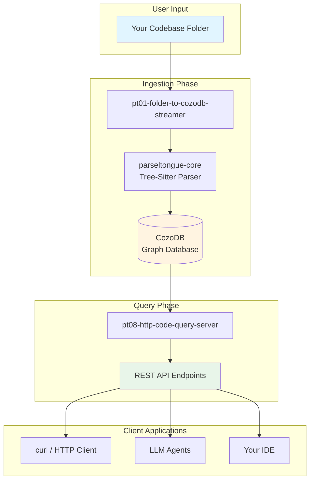
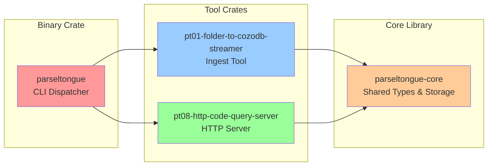
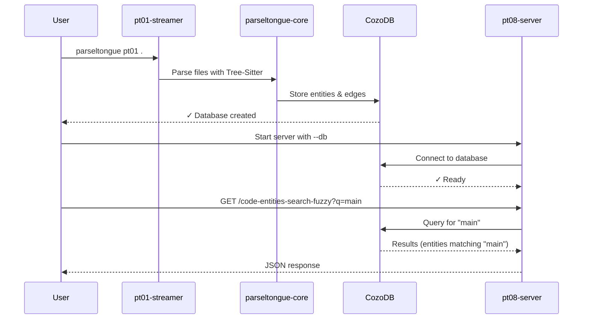

# Parseltongue Architecture Overview

## What is Parseltongue?

**Parseltongue** is like a librarian for your code. Instead of reading thousands of files one by one, Parseltongue:
1. Reads your entire codebase once
2. Organizes everything into a searchable database
3. Lets you ask questions super fast (31x faster than grep!)
4. Uses 99% fewer tokens for AI tools (2-5K vs 500K!)

## High-Level Architecture

## Project Statistics

- **Total Code Entities**: 230
- **Dependency Edges**: 3,864
- **Languages Supported**: Rust, Python, JavaScript, TypeScript, Go, Java, C, C++, Ruby, PHP, C#, Swift
- **Version**: 1.4.2

## Crate Structure

## How It Works (ELI5)

### Step 1: Ingestion (Building the Library)
Think of this like organizing a messy room:
- **Input**: Your codebase folder
- **Process**: pt01 reads every file, finds functions/classes/imports
- **Output**: A organized database (`analysis.db`)

### Step 2: Query (Finding Things Fast)
Think of this like asking a librarian questions:
- **Input**: HTTP requests (questions about your code)
- **Process**: pt08 searches the database
- **Output**: JSON answers in milliseconds

## Key Components

| Component | Role | Analogy |
|-----------|------|---------|
| **parseltongue-core** | Brain - parsing & storage logic | The librarian's training manual |
| **pt01-folder-to-cozodb-streamer** | Cataloger - builds database | The person organizing books |
| **pt08-http-code-query-server** | Reference Desk - answers questions | The help desk |
| **CozoDB** | Memory - stores graph data | The card catalog system |

## Workflow Example

## Why Use Parseltongue?

1. **Speed**: 31x faster than grep
2. **Token Efficiency**: 99% reduction for LLM context
3. **Graph Queries**: Find who calls what, detect cycles, analyze impact
4. **Multi-Language**: Works with 12+ programming languages
5. **Always Fresh**: Built-in file watching (v1.4.2) auto-updates

## Next Steps

- **[01-crate-structure.md](01-crate-structure.md)** - Detailed breakdown of each crate
- **[02-control-flow.md](02-control-flow.md)** - How execution flows through the system
- **[03-data-flow.md](03-data-flow.md)** - How data is transformed
- **[04-api-guide.md](04-api-guide.md)** - Complete API reference with examples
