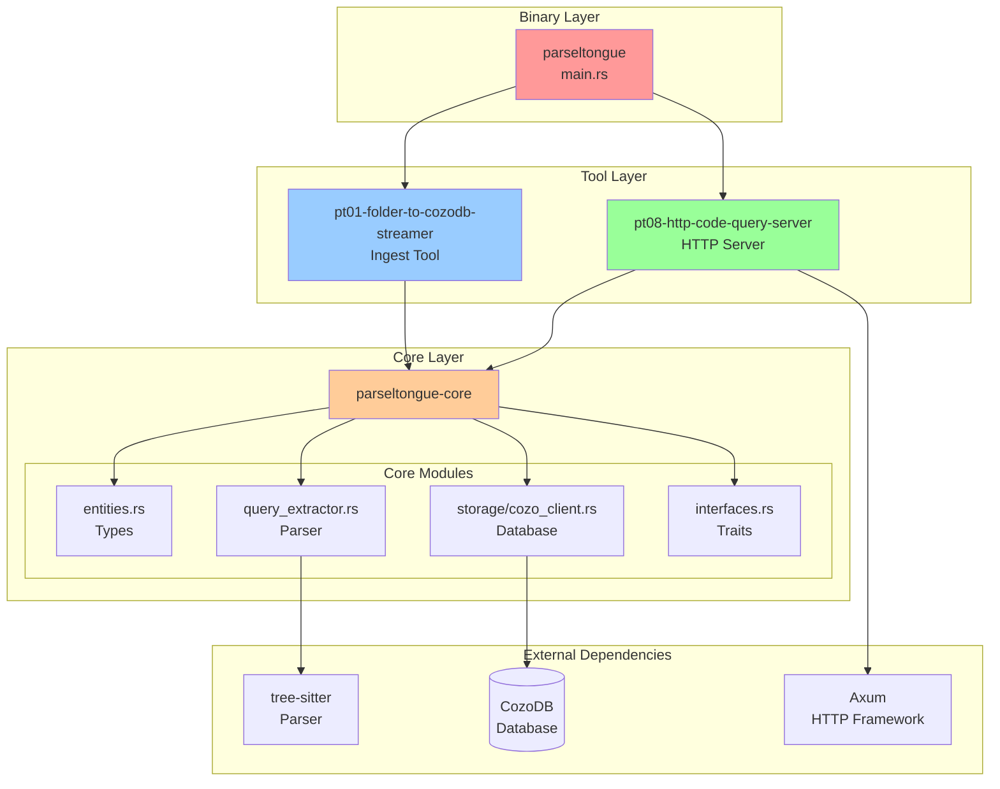
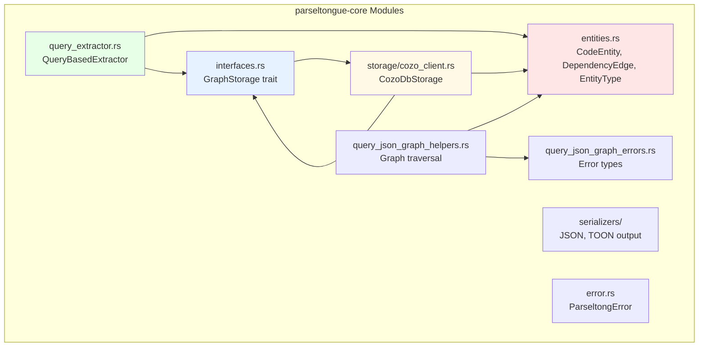
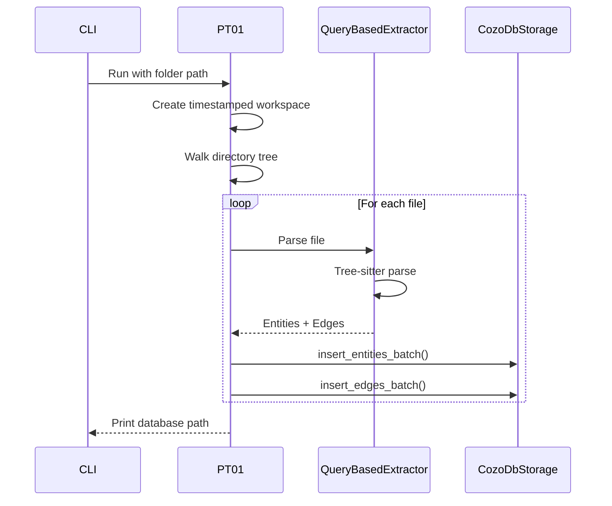
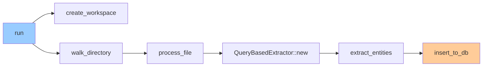
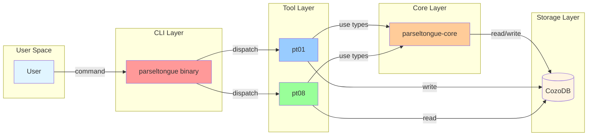

# Crate Structure Deep Dive

## Directory Layout

```
crates/
├── parseltongue/                   # Binary - CLI entry point
├── parseltongue-core/              # Library - shared functionality
├── pt01-folder-to-cozodb-streamer/ # Tool 1 - Ingestion
└── pt08-http-code-query-server/    # Tool 8 - HTTP API
```

## Dependency Graph



## Crate Details

### 1. parseltongue (Binary Crate)

**Purpose**: CLI dispatcher that routes to tool crates

**Key Responsibilities**:
- Parse command-line arguments
- Route to pt01 or pt08
- Handle version/help commands

**Entry Point**:
```rust
// Simplified flow
fn main() {
    match args.tool {
        "pt01-folder-to-cozodb-streamer" => pt01::run(),
        "pt08-http-code-query-server" => pt08::run(),
        _ => show_help()
    }
}
```

### 2. parseltongue-core (Library Crate)

**Purpose**: Shared types, traits, and business logic

**Module Breakdown**:



**Key Types**:

| Type | Purpose | Example |
|------|---------|---------|
| `CodeEntity` | Represents a code element (fn, struct, class) | `rust:fn:main:src_main_rs:1-50` |
| `DependencyEdge` | Represents a relationship between entities | Function A calls Function B |
| `EntityType` | Enum of entity kinds | Function, Struct, Class, Method |
| `GraphStorage` | Trait for database operations | `insert_entity()`, `get_dependencies()` |
| `QueryBasedExtractor` | Tree-sitter parser wrapper | Extracts entities from source code |

### 3. pt01-folder-to-cozodb-streamer (Tool Crate)

**Purpose**: Ingest source code into CozoDB

**Flow**:



**Key Functions**:



**Output**:
- Creates `parseltongue{TIMESTAMP}/analysis.db`
- Prints statistics (files processed, entities created, errors)

### 4. pt08-http-code-query-server (Tool Crate)

**Purpose**: REST API server for querying the database

**Architecture**:

```mermaid
graph TB
    subgraph "HTTP Server"
        A[main.rs<br/>Axum setup]
        B[Router]
    end

    subgraph "Handler Modules"
        C[server_health_check_handler]
        D[codebase_statistics_overview_handler]
        E[code_entities_list_all_handler]
        F[code_entities_fuzzy_search_handler]
        G[code_entity_detail_view_handler]
        H[dependency_edges_list_handler]
        I[reverse_callers_query_graph_handler]
        J[forward_callees_query_graph_handler]
        K[blast_radius_impact_handler]
        L[circular_dependency_detection_handler]
        M[complexity_hotspots_ranking_handler]
        N[semantic_cluster_grouping_handler]
        O[smart_context_token_budget_handler]
        P[api_reference_documentation_handler]
    end

    A --> B
    B --> C
    B --> D
    B --> E
    B --> F
    B --> G
    B --> H
    B --> I
    B --> J
    B --> K
    B --> L
    B --> M
    B --> N
    B --> O
    B --> P

    style A fill:#99ff99
    style B fill:#ffff99
```



**Handler Organization** (4-word naming pattern):

| Category | Handler Function | Endpoint |
|----------|------------------|----------|
| Core | `handle_server_health_check_status` | `/server-health-check-status` |
| Core | `handle_codebase_statistics_overview_summary` | `/codebase-statistics-overview-summary` |
| Core | `handle_api_reference_documentation_help` | `/api-reference-documentation-help` |
| Entity | `handle_code_entities_list_all` | `/code-entities-list-all` |
| Entity | `handle_code_entity_detail_view` | `/code-entity-detail-view/{key}` |
| Entity | `handle_code_entities_fuzzy_search` | `/code-entities-search-fuzzy` |
| Edge | `handle_dependency_edges_list_all` | `/dependency-edges-list-all` |
| Edge | `handle_reverse_callers_query_graph` | `/reverse-callers-query-graph` |
| Edge | `handle_forward_callees_query_graph` | `/forward-callees-query-graph` |
| Analysis | `handle_blast_radius_impact_analysis` | `/blast-radius-impact-analysis` |
| Analysis | `handle_circular_dependency_detection_scan` | `/circular-dependency-detection-scan` |
| Analysis | `handle_complexity_hotspots_ranking_view` | `/complexity-hotspots-ranking-view` |
| Analysis | `handle_semantic_cluster_grouping_list` | `/semantic-cluster-grouping-list` |
| Advanced | `handle_smart_context_token_budget` | `/smart-context-token-budget` |

## Cross-Crate Communication



## File Organization Per Crate

### parseltongue-core (Most Complex)

```
parseltongue-core/
├── src/
│   ├── entities.rs              # CodeEntity, DependencyEdge, EntityType, etc.
│   ├── interfaces.rs            # GraphStorage trait, ToolCapabilities
│   ├── error.rs                 # ParseltongError
│   ├── query_extractor.rs       # QueryBasedExtractor (Tree-sitter)
│   ├── query_json_graph_helpers.rs  # Graph traversal utilities
│   ├── query_json_graph_errors.rs   # JsonGraphQueryError
│   ├── output_path_resolver.rs  # Workspace path logic
│   ├── temporal.rs              # Temporal versioning
│   ├── entity_class_specifications.rs  # CODE vs TEST classification
│   ├── storage/
│   │   ├── mod.rs
│   │   └── cozo_client.rs       # CozoDbStorage implementation
│   └── serializers/
│       ├── mod.rs
│       ├── json.rs              # JSON output
│       └── toon.rs              # TOON format output
```

### pt01-folder-to-cozodb-streamer

```
pt01-folder-to-cozodb-streamer/
├── src/
│   ├── lib.rs                   # Main ingestion logic
│   └── errors.rs                # StreamerError
```

### pt08-http-code-query-server

```
pt08-http-code-query-server/
├── src/
│   ├── main.rs                  # Axum server setup
│   ├── structured_error_handling_types.rs  # HttpServerErrorTypes
│   └── http_endpoint_handler_modules/
│       ├── server_health_check_handler.rs
│       ├── codebase_statistics_overview_handler.rs
│       ├── api_reference_documentation_handler.rs
│       ├── code_entities_list_all_handler.rs
│       ├── code_entity_detail_view_handler.rs
│       ├── code_entities_fuzzy_search_handler.rs
│       ├── dependency_edges_list_handler.rs
│       ├── reverse_callers_query_graph_handler.rs
│       ├── forward_callees_query_graph_handler.rs
│       ├── blast_radius_impact_handler.rs
│       ├── circular_dependency_detection_handler.rs
│       ├── complexity_hotspots_ranking_handler.rs
│       ├── semantic_cluster_grouping_handler.rs
│       ├── smart_context_token_budget_handler.rs
│       └── incremental_reindex_file_handler.rs
```

## Next: Control Flow

See [02-control-flow.md](02-control-flow.md) for execution flow diagrams.
