# Control Flow Analysis

This document shows **how execution flows** through Parseltongue - where the program starts, what functions call what, and how the different parts work together.

## Top-Level Flow

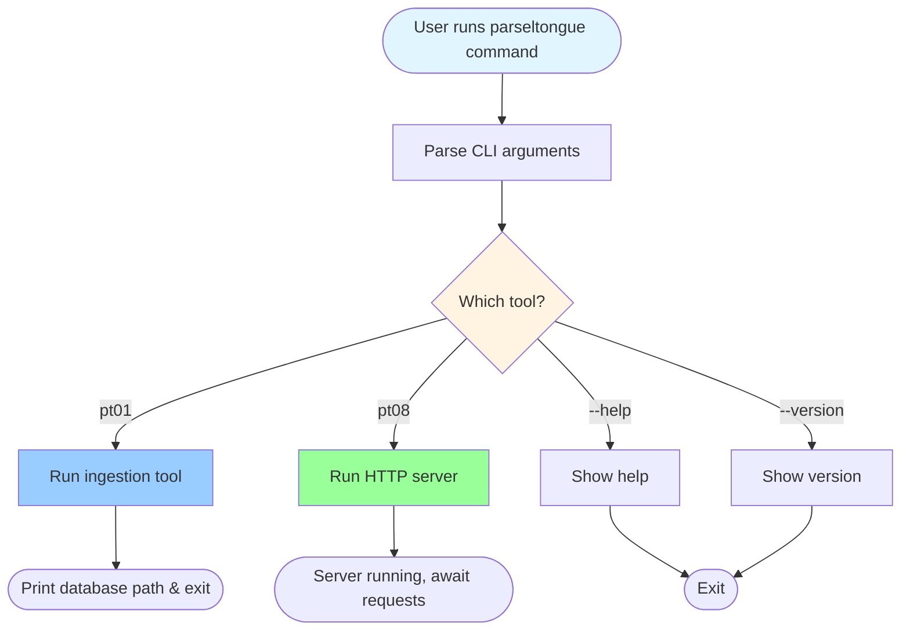

## pt01 Ingestion Flow

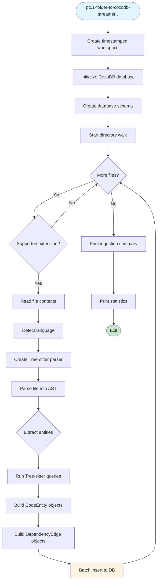

### pt01 Detailed Function Flow

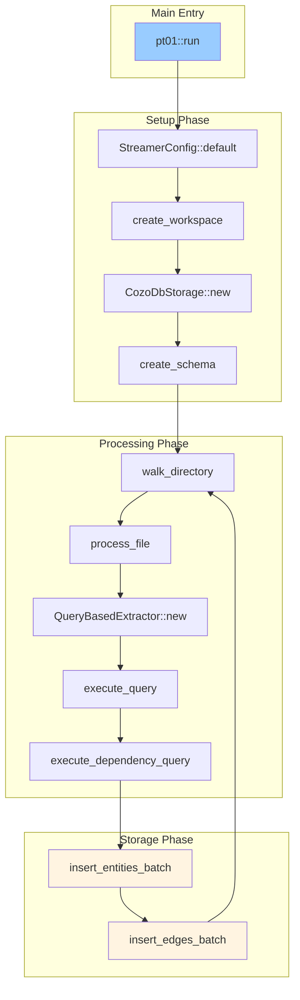

## pt08 HTTP Server Flow

### Server Startup

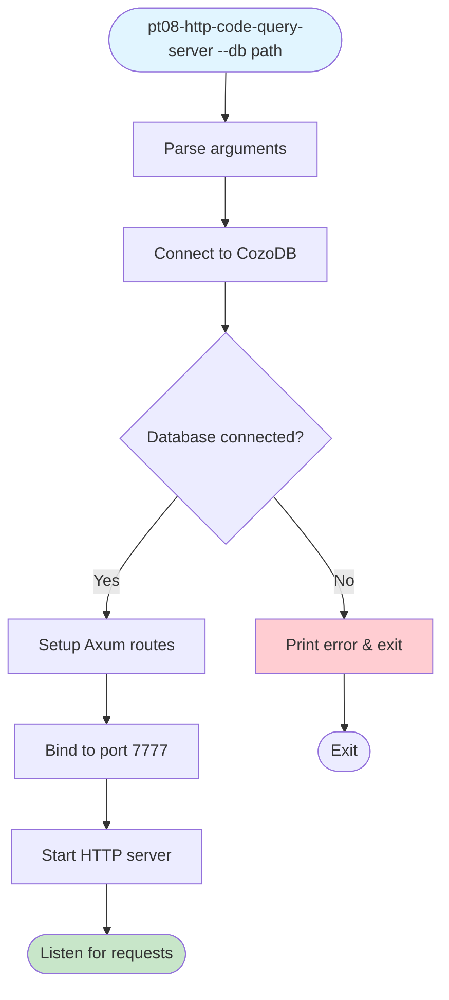

### HTTP Request Flow

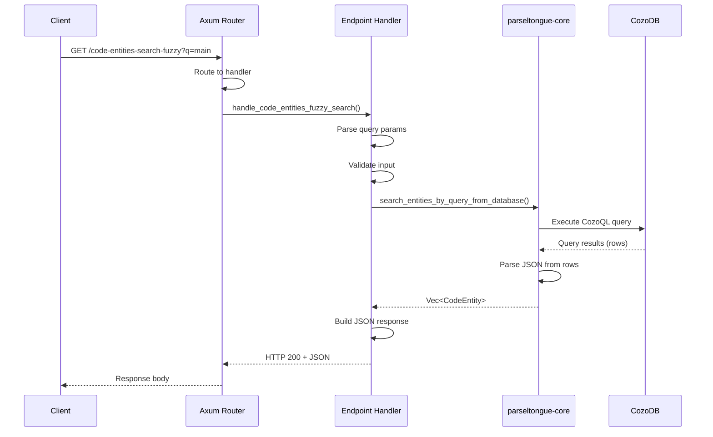

### Example: Reverse Callers Flow

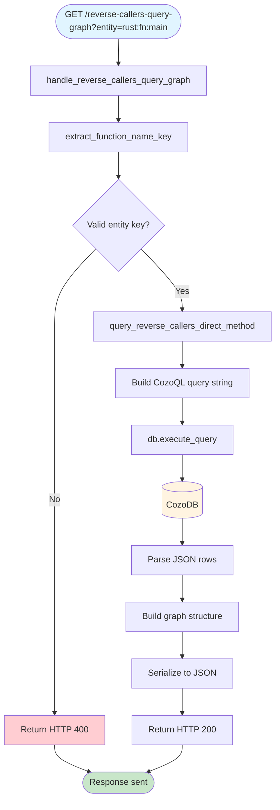

## parseltongue-core Control Flow

### QueryBasedExtractor::new()

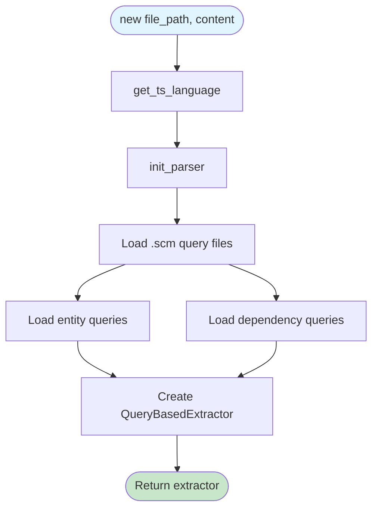

### execute_query() - Entity Extraction

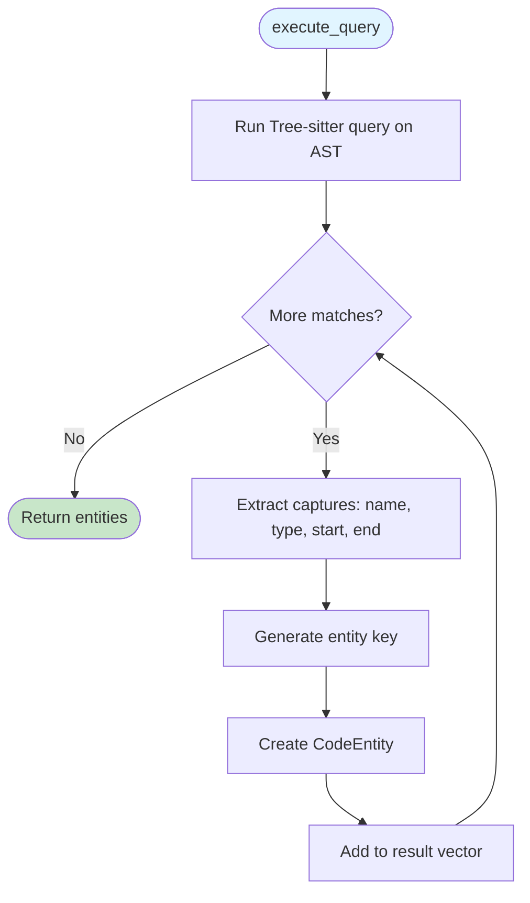

### execute_dependency_query() - Edge Extraction

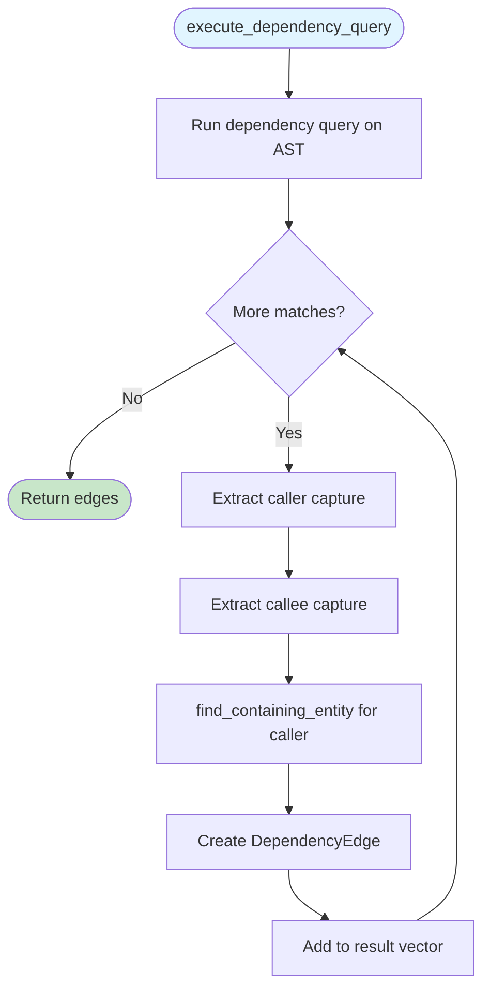

### CozoDbStorage::insert_entity()

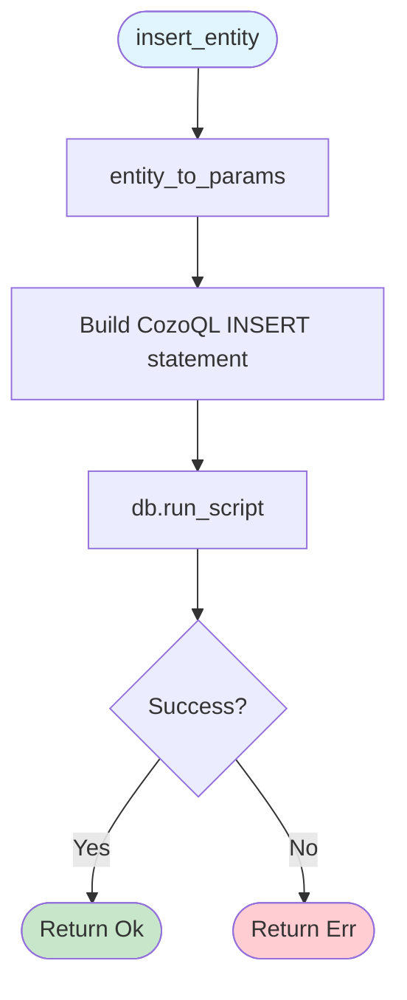

## Advanced Analysis Flows

### Blast Radius Calculation

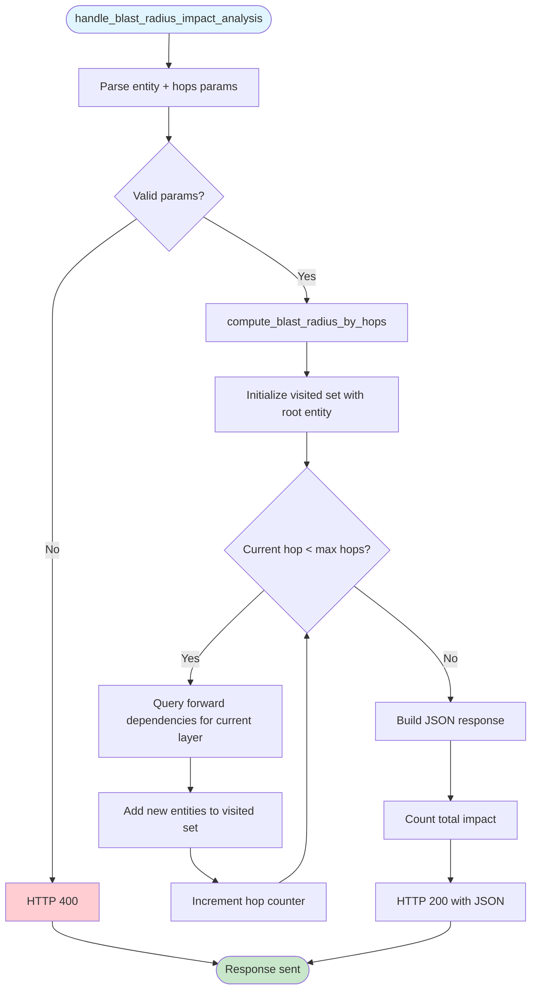

### Circular Dependency Detection

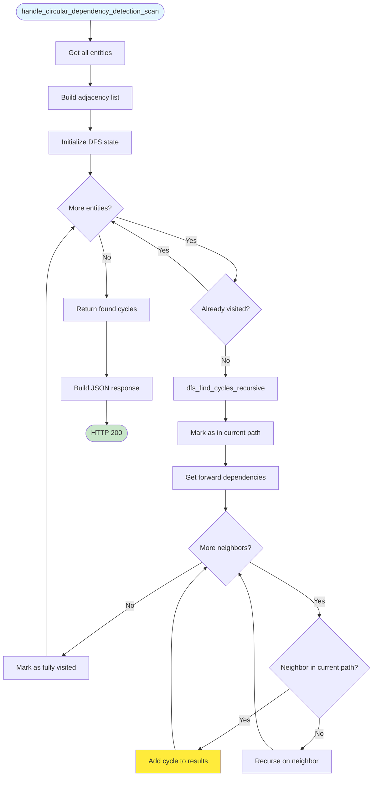

## File Watching Flow (v1.4.2)

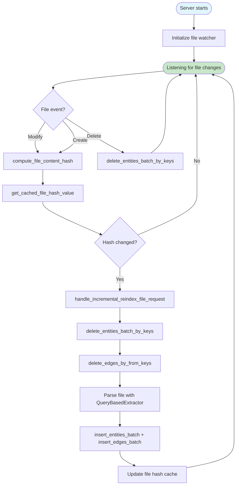

## Error Handling Flow

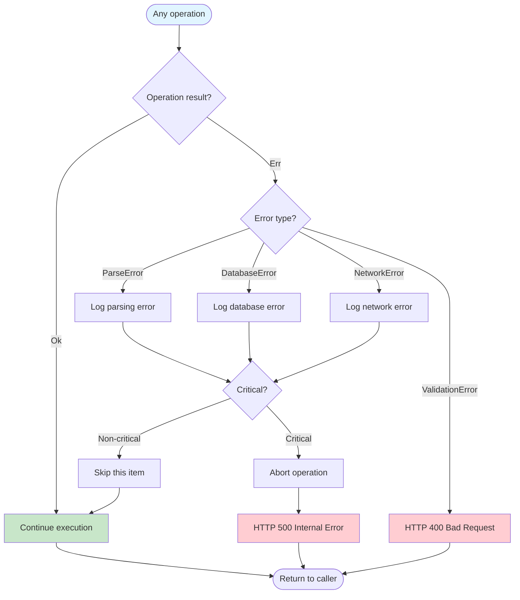

## Next: Data Flow

See [03-data-flow.md](03-data-flow.md) to understand how data is transformed through the system.
