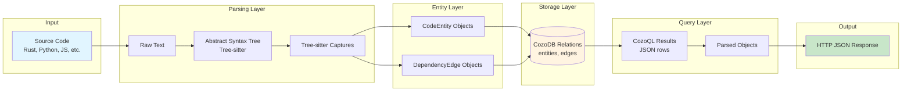
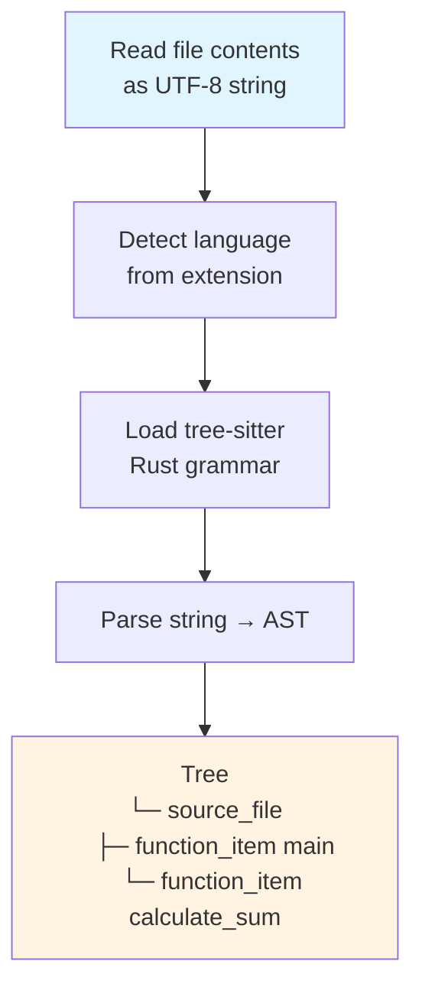
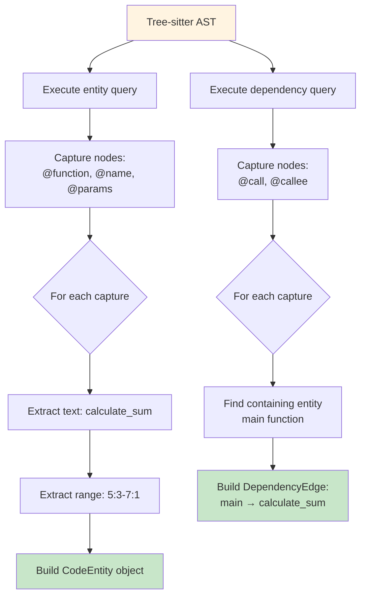
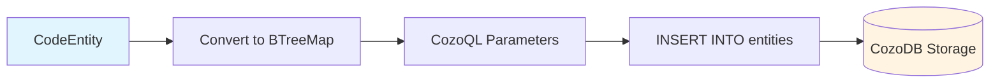
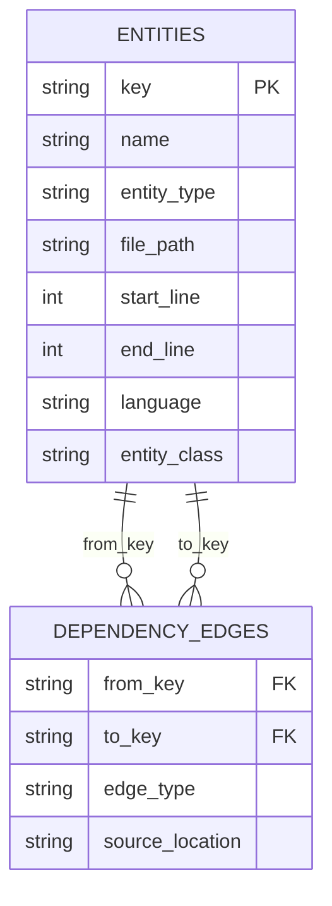
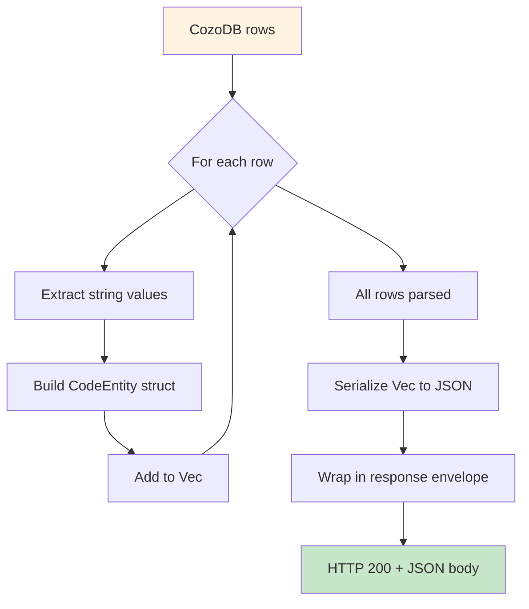
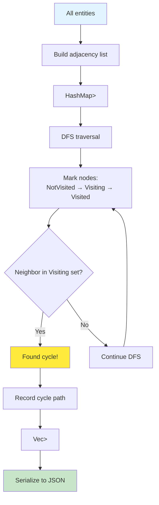
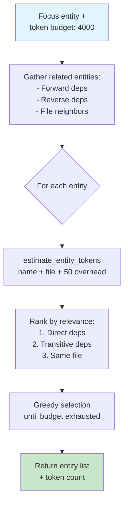
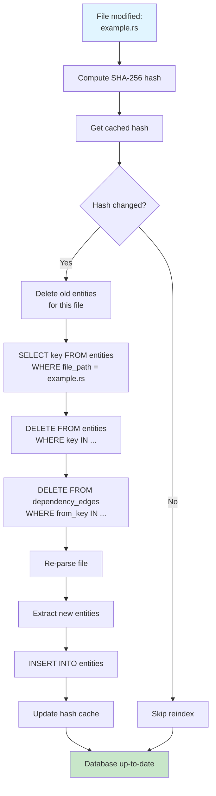

# Data Flow Analysis

This document shows **how data is transformed** as it flows through Parseltongue - from source code to database to JSON responses.

## End-to-End Data Transformation



## Stage 1: Source Code → AST

### Input: Source File

```rust
// example.rs
pub fn main() {
    let x = calculate_sum(1, 2);
    println!("Result: {}", x);
}

fn calculate_sum(a: i32, b: i32) -> i32 {
    a + b
}
```

### Transformation: Tree-sitter Parsing



### Output: Abstract Syntax Tree

```
source_file [0, 0] - [7, 0]
  function_item [0, 0] - [3, 1]
    visibility_modifier [0, 0] - [0, 3]: "pub"
    name: identifier [0, 7] - [0, 11]: "main"
    parameters: parameters [0, 11] - [0, 13]
    body: block [0, 14] - [3, 1]
      let_declaration [1, 4] - [1, 33]
        pattern: identifier [1, 8] - [1, 9]: "x"
        value: call_expression [1, 12] - [1, 32]
          function: identifier [1, 12] - [1, 25]: "calculate_sum"
  function_item [5, 0] - [7, 1]
    name: identifier [5, 3] - [5, 16]: "calculate_sum"
    ...
```

## Stage 2: AST → Entities & Edges

### Transformation: Tree-sitter Query Execution

**Entity Query (.scm file)**:
```scheme
(function_item
  name: (identifier) @name
  parameters: (parameters) @params
  body: (block) @body) @function
```

**Dependency Query (.scm file)**:
```scheme
(call_expression
  function: (identifier) @callee) @call
```

### Execution Flow



### Output: CodeEntity Struct

```rust
CodeEntity {
    key: "rust:fn:calculate_sum:__example_rs:5-7",
    name: "calculate_sum",
    entity_type: EntityType::Function,
    file_path: "./example.rs",
    line_range: LineRange { start: 5, end: 7 },
    language: "rust",
    entity_class: EntityClass::CODE,
    // ... other metadata
}
```

### Output: DependencyEdge Struct

```rust
DependencyEdge {
    from_key: "rust:fn:main:__example_rs:1-3",
    to_key: "rust:fn:calculate_sum:__example_rs:5-7",
    edge_type: EdgeType::Calls,
    source_location: "./example.rs:2",
}
```

## Stage 3: Entities/Edges → Database

### Transformation: entity_to_params()



**CodeEntity → CozoQL Params**:

```rust
// Input
CodeEntity {
    key: "rust:fn:calculate_sum:__example_rs:5-7",
    name: "calculate_sum",
    entity_type: Function,
    file_path: "./example.rs",
    ...
}

// Output
BTreeMap {
    "key": "rust:fn:calculate_sum:__example_rs:5-7",
    "name": "calculate_sum",
    "entity_type": "function",
    "file_path": "./example.rs",
    "start_line": 5,
    "end_line": 7,
    "language": "rust",
    "entity_class": "CODE",
}
```

### Database Schema



**Stored Data**:

```cozo
// entities relation
?[key, name, entity_type, file_path, start_line, end_line, language, entity_class]

// Example rows
["rust:fn:main:__example_rs:1-3", "main", "function", "./example.rs", 1, 3, "rust", "CODE"]
["rust:fn:calculate_sum:__example_rs:5-7", "calculate_sum", "function", "./example.rs", 5, 7, "rust", "CODE"]
```

```cozo
// dependency_edges relation
?[from_key, to_key, edge_type, source_location]

// Example rows
["rust:fn:main:__example_rs:1-3", "rust:fn:calculate_sum:__example_rs:5-7", "Calls", "./example.rs:2"]
```

## Stage 4: Database → Query Results

### Transformation: CozoQL Query

**Input Query**:
```rust
curl "http://localhost:7777/code-entities-search-fuzzy?q=calculate"
```

**Handler Execution**:

```mermaid
flowchart TD
    A[HTTP Request] --> B[Parse q parameter:<br/>calculate]
    B --> C[Build CozoQL query]
    C --> D[Execute query on DB]

    D --> E[CozoQL Script:<br/>?[key, name, ...] :=<br/>*entities[key, name, ...],<br/>name ~~ calculate]

    E --> F[(CozoDB)]
    F --> G[Raw JSON rows]

    style A fill:#e1f5ff
    style F fill:#fff4e1
    style G fill:#c8e6c9
```

**CozoQL Query String**:
```cozo
?[key, name, entity_type, file_path, start_line, end_line, language, entity_class] :=
  *entities[key, name, entity_type, file_path, start_line, end_line, language, entity_class],
  name ~~ "calculate"
```

### Output: Raw CozoDB Response

```json
{
  "headers": ["key", "name", "entity_type", "file_path", "start_line", "end_line", "language", "entity_class"],
  "rows": [
    [
      "rust:fn:calculate_sum:__example_rs:5-7",
      "calculate_sum",
      "function",
      "./example.rs",
      5,
      7,
      "rust",
      "CODE"
    ]
  ],
  "took": 0.0012
}
```

## Stage 5: Query Results → JSON Response

### Transformation: Parse & Serialize



**Parsing Code**:
```rust
// Extract from row
let key = row[0].as_str().ok_or(...)?;
let name = row[1].as_str().ok_or(...)?;
let entity_type = row[2].as_str().ok_or(...)?;
// ...

// Build entity
let entity = CodeEntity {
    key: key.to_string(),
    name: name.to_string(),
    entity_type: EntityType::from_str(entity_type)?,
    // ...
};
```

### Final HTTP Response

```json
{
  "success": true,
  "endpoint": "/code-entities-search-fuzzy",
  "data": {
    "total_count": 1,
    "entities": [
      {
        "key": "rust:fn:calculate_sum:__example_rs:5-7",
        "file_path": "./example.rs",
        "entity_type": "function",
        "entity_class": "CODE",
        "language": "rust"
      }
    ]
  },
  "tokens": 120
}
```

## Complex Data Transformations

### Blast Radius Analysis

```mermaid
flowchart TD
    START[Entity key:<br/>rust:fn:main] --> LAYER0[Layer 0:<br/>{main}]

    LAYER0 --> QUERY1[Query forward deps]
    QUERY1 --> LAYER1[Layer 1:<br/>{calculate_sum, println}]

    LAYER1 --> QUERY2[Query forward deps]
    QUERY2 --> LAYER2[Layer 2:<br/>{std::fmt::Display, std::ops::Add}]

    LAYER2 --> QUERY3[Query forward deps]
    QUERY3 --> LAYER3[Layer 3:<br/>{...}]

    LAYER3 --> AGGREGATE[Union all layers]
    AGGREGATE --> COUNT[Count total entities:<br/>15 affected]

    COUNT --> RESPONSE[JSON response:<br/>blast_radius: 15]

    style START fill:#e1f5ff
    style RESPONSE fill:#c8e6c9
```

**Data at each layer**:

```json
{
  "entity": "rust:fn:main",
  "hops": 3,
  "blast_radius": {
    "total_affected": 15,
    "by_hop": {
      "0": ["rust:fn:main"],
      "1": ["rust:fn:calculate_sum", "rust:fn:println"],
      "2": ["rust:trait:Display", "rust:trait:Add"],
      "3": [...]
    }
  }
}
```

### Circular Dependency Detection



**Example Cycle Data**:

```json
{
  "success": true,
  "endpoint": "/circular-dependency-detection-scan",
  "data": {
    "cycles_found": 1,
    "cycles": [
      {
        "path": [
          "rust:fn:a:__file_rs:1-3",
          "rust:fn:b:__file_rs:5-7",
          "rust:fn:c:__file_rs:9-11",
          "rust:fn:a:__file_rs:1-3"
        ],
        "length": 3
      }
    ]
  }
}
```

### Smart Context Token Budget



**Token Estimation**:
```rust
fn estimate_entity_tokens(entity: &CodeEntity) -> usize {
    let name_tokens = entity.name.len() / 4;  // ~4 chars per token
    let file_tokens = entity.file_path.len() / 4;
    name_tokens + file_tokens + 50  // 50 = metadata overhead
}
```

**Response Data**:
```json
{
  "focus": "rust:fn:main",
  "budget": 4000,
  "used_tokens": 3850,
  "entities": [
    {
      "key": "rust:fn:main",
      "estimated_tokens": 80,
      "relevance": "focus"
    },
    {
      "key": "rust:fn:calculate_sum",
      "estimated_tokens": 95,
      "relevance": "direct_dependency"
    },
    ...
  ]
}
```

## Data Persistence Flow

### File Watching & Incremental Update



## Data Format Summary

| Stage | Format | Example |
|-------|--------|---------|
| Input | Source code text | `fn main() { ... }` |
| Parse | Tree-sitter AST | `function_item(name: "main", ...)` |
| Extract | Rust structs | `CodeEntity { key: "...", ... }` |
| Store | CozoDB relations | `["rust:fn:main", "main", "function", ...]` |
| Query | CozoDB JSON | `{ "headers": [...], "rows": [[...]] }` |
| Output | HTTP JSON | `{ "success": true, "data": {...} }` |

## Next: API Usage Guide

See [04-api-guide.md](04-api-guide.md) for complete API documentation and usage examples.
