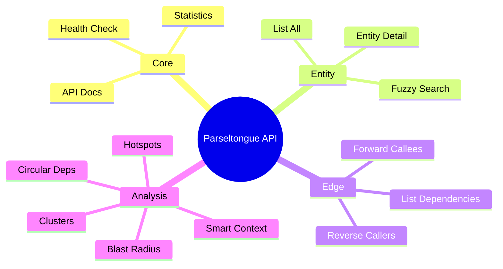
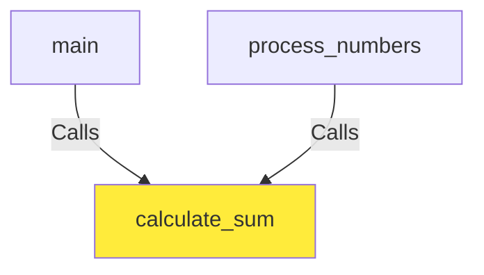
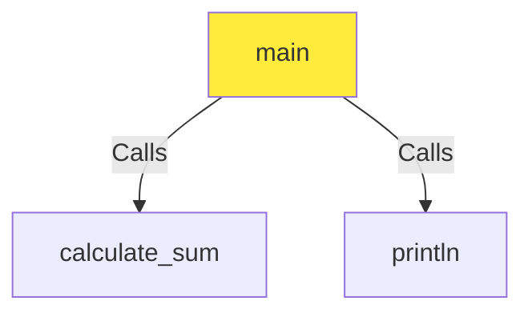
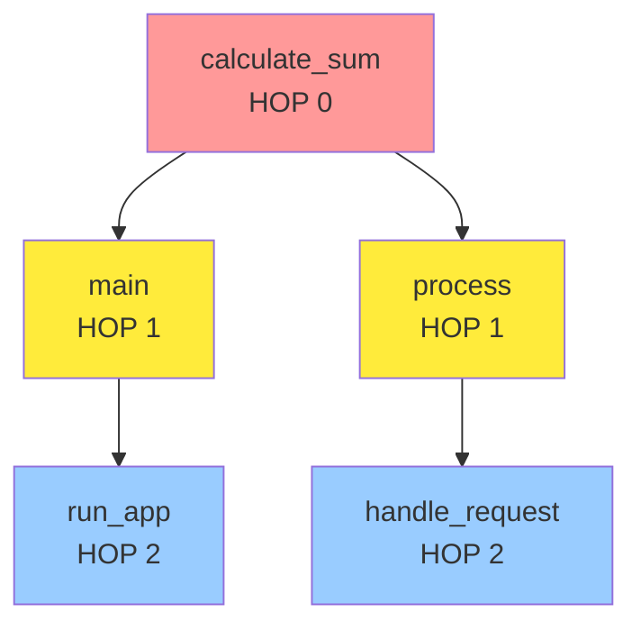
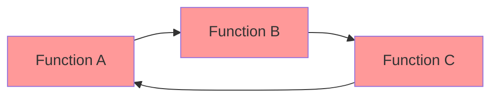
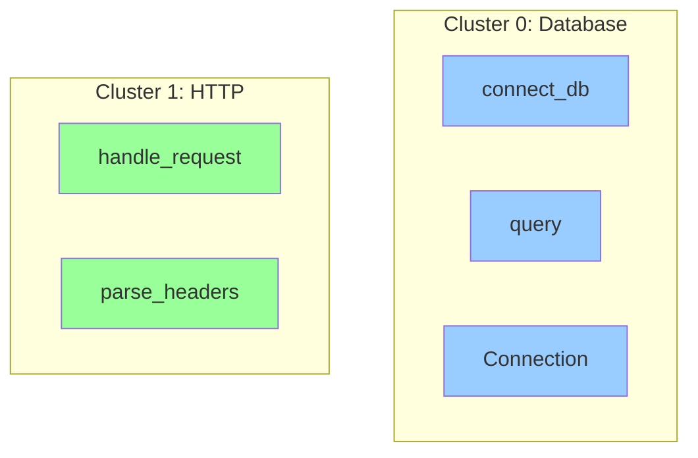

# Complete API Guide (ELI5)

## Quick Start

### Step 1: Download Parseltongue

```bash
curl -L https://github.com/that-in-rust/parseltongue-dependency-graph-generator/releases/download/v1.4.2/parseltongue -o parseltongue
chmod +x parseltongue
```

### Step 2: Ingest Your Codebase

```bash
./parseltongue pt01-folder-to-cozodb-streamer /path/to/your/code
```

**Output:**
```
Workspace: parseltongue20260131154912
Database: rocksdb:parseltongue20260131154912/analysis.db
Entities created: 230
```

### Step 3: Start the Server

```bash
./parseltongue pt08-http-code-query-server \
  --db "rocksdb:parseltongue20260131154912/analysis.db"
```

**Server starts on:** `http://localhost:7777`

### Step 4: Query Away!

```bash
curl http://localhost:7777/server-health-check-status
```

## API Endpoint Categories



## Core Endpoints

### 1. Health Check

**What it does:** Checks if the server is alive

**When to use:** Testing connection, monitoring uptime

**Endpoint:** `GET /server-health-check-status`

**Example:**
```bash
curl http://localhost:7777/server-health-check-status
```

**Response:**
```json
{
  "success": true,
  "status": "ok",
  "server_uptime_seconds_count": 7,
  "endpoint": "/server-health-check-status"
}
```

**ELI5:** Like knocking on a door to see if someone's home. The server says "I'm here and running!"

---

### 2. Codebase Statistics

**What it does:** Shows how many entities and dependencies exist

**When to use:** Understanding codebase size, debugging ingestion

**Endpoint:** `GET /codebase-statistics-overview-summary`

**Example:**
```bash
curl http://localhost:7777/codebase-statistics-overview-summary
```

**Response:**
```json
{
  "success": true,
  "endpoint": "/codebase-statistics-overview-summary",
  "data": {
    "code_entities_total_count": 230,
    "test_entities_total_count": 0,
    "dependency_edges_total_count": 3864,
    "languages_detected_list": ["rust"],
    "database_file_path": "rocksdb:parseltongue20260131154912/analysis.db"
  },
  "tokens": 50
}
```

**ELI5:** Like asking "How many books are in this library?" The database tells you exactly what it has indexed.

---

### 3. API Documentation

**What it does:** Returns this documentation

**When to use:** Discovering available endpoints programmatically

**Endpoint:** `GET /api-reference-documentation-help`

**Example:**
```bash
curl http://localhost:7777/api-reference-documentation-help | jq
```

**Response:**
```json
{
  "success": true,
  "endpoint": "/api-reference-documentation-help",
  "data": {
    "api_version": "1.4.2",
    "total_endpoints": 14,
    "categories": [...]
  }
}
```

## Entity Endpoints

### 4. List All Entities

**What it does:** Returns all functions, classes, structs, etc. in your codebase

**When to use:** Browsing what's available, autocomplete, entity discovery

**Endpoint:** `GET /code-entities-list-all`

**Query Parameters:**
- `entity_type` (optional): Filter by type (e.g., `fn`, `struct`, `class`)

**Example 1: All entities**
```bash
curl http://localhost:7777/code-entities-list-all
```

**Example 2: Only functions**
```bash
curl "http://localhost:7777/code-entities-list-all?entity_type=fn"
```

**Response:**
```json
{
  "success": true,
  "endpoint": "/code-entities-list-all",
  "data": {
    "total_count": 230,
    "entities": [
      {
        "key": "rust:fn:handle_health_check:__src_main_rs:42-50",
        "file_path": "./src/main.rs",
        "entity_type": "function",
        "entity_class": "CODE",
        "language": "rust"
      }
    ]
  },
  "tokens": 1200
}
```

**ELI5:** Like asking the librarian "Show me all the books" or "Show me only mystery novels."

---

### 5. Entity Detail View

**What it does:** Gets detailed info about a specific entity

**When to use:** Viewing source code location, metadata for one entity

**Endpoint:** `GET /code-entity-detail-view/{key}`

**Path Parameters:**
- `key`: Entity key (from list/search results)

**Example:**
```bash
curl "http://localhost:7777/code-entity-detail-view/rust:fn:handle_health_check:__src_main_rs:42-50"
```

**Response:**
```json
{
  "success": true,
  "endpoint": "/code-entity-detail-view/{key}",
  "data": {
    "key": "rust:fn:handle_health_check:__src_main_rs:42-50",
    "name": "handle_health_check",
    "entity_type": "function",
    "file_path": "./src/main.rs",
    "start_line": 42,
    "end_line": 50,
    "language": "rust"
  }
}
```

**ELI5:** Like asking "Tell me everything about THIS specific book."

---

### 6. Fuzzy Search

**What it does:** Searches for entities by name pattern (case-insensitive)

**When to use:** Finding functions/classes when you don't know exact name

**Endpoint:** `GET /code-entities-search-fuzzy`

**Query Parameters:**
- `q` (required): Search pattern

**Example 1: Find anything with "handle"**
```bash
curl "http://localhost:7777/code-entities-search-fuzzy?q=handle"
```

**Example 2: Find "main" functions**
```bash
curl "http://localhost:7777/code-entities-search-fuzzy?q=main"
```

**Response:**
```json
{
  "success": true,
  "endpoint": "/code-entities-search-fuzzy",
  "data": {
    "query": "handle",
    "total_count": 15,
    "entities": [
      {
        "key": "rust:fn:handle_health_check:__src_main_rs:42-50",
        "file_path": "./src/main.rs",
        "entity_type": "function"
      }
    ]
  }
}
```

**ELI5:** Like asking "Do you have any books with 'dragon' in the title?"

## Edge Endpoints (Dependencies)

### 7. List All Dependencies

**What it does:** Shows all "who calls who" relationships

**When to use:** Understanding overall code structure, exporting graph

**Endpoint:** `GET /dependency-edges-list-all`

**Query Parameters:**
- `limit` (optional): Number of edges to return (default: 100)
- `offset` (optional): Pagination offset

**Example:**
```bash
curl "http://localhost:7777/dependency-edges-list-all?limit=10"
```

**Response:**
```json
{
  "success": true,
  "endpoint": "/dependency-edges-list-all",
  "data": {
    "total_count": 3864,
    "returned_count": 10,
    "limit": 10,
    "offset": 0,
    "edges": [
      {
        "from_key": "rust:fn:main:__src_main_rs:1-10",
        "to_key": "rust:fn:handle_request:__src_main_rs:12-30",
        "edge_type": "Calls",
        "source_location": "./src/main.rs:5"
      }
    ]
  }
}
```

**ELI5:** Like asking "Show me all the footnotes and references between books."

---

### 8. Reverse Callers (Who Calls This?)

**What it does:** Finds all entities that call the specified entity

**When to use:** Impact analysis, "Who uses this function?"

**Endpoint:** `GET /reverse-callers-query-graph`

**Query Parameters:**
- `entity` (required): Entity key to find callers for

**Example:**
```bash
curl "http://localhost:7777/reverse-callers-query-graph?entity=rust:fn:calculate_sum:__src_math_rs:10-15"
```

**Response:**
```json
{
  "success": true,
  "endpoint": "/reverse-callers-query-graph",
  "data": {
    "entity": "rust:fn:calculate_sum:__src_math_rs:10-15",
    "callers": [
      {
        "key": "rust:fn:main:__src_main_rs:1-10",
        "file_path": "./src/main.rs",
        "edge_type": "Calls"
      },
      {
        "key": "rust:fn:process_numbers:__src_utils_rs:20-30",
        "file_path": "./src/utils.rs",
        "edge_type": "Calls"
      }
    ],
    "total_callers": 2
  }
}
```

**ELI5:** Like asking "Which books reference THIS book in their bibliography?"

**Diagram:**


---

### 9. Forward Callees (What Does This Call?)

**What it does:** Finds all entities that this entity calls

**When to use:** Understanding dependencies, "What does this function use?"

**Endpoint:** `GET /forward-callees-query-graph`

**Query Parameters:**
- `entity` (required): Entity key to find callees for

**Example:**
```bash
curl "http://localhost:7777/forward-callees-query-graph?entity=rust:fn:main:__src_main_rs:1-10"
```

**Response:**
```json
{
  "success": true,
  "endpoint": "/forward-callees-query-graph",
  "data": {
    "entity": "rust:fn:main:__src_main_rs:1-10",
    "callees": [
      {
        "key": "rust:fn:calculate_sum:__src_math_rs:10-15",
        "file_path": "./src/math.rs",
        "edge_type": "Calls"
      },
      {
        "key": "rust:fn:println:std:0-0",
        "file_path": "std",
        "edge_type": "Calls"
      }
    ],
    "total_callees": 2
  }
}
```

**ELI5:** Like asking "What other books does THIS book reference?"

**Diagram:**


## Analysis Endpoints

### 10. Blast Radius Impact Analysis

**What it does:** Calculates how many things would be affected if you change this entity

**When to use:** Before refactoring, assessing risk, finding ripple effects

**Endpoint:** `GET /blast-radius-impact-analysis`

**Query Parameters:**
- `entity` (required): Entity key to analyze
- `hops` (optional): Maximum depth to traverse (default: 3)

**Example:**
```bash
curl "http://localhost:7777/blast-radius-impact-analysis?entity=rust:fn:calculate_sum:__src_math_rs:10-15&hops=2"
```

**Response:**
```json
{
  "success": true,
  "endpoint": "/blast-radius-impact-analysis",
  "data": {
    "entity": "rust:fn:calculate_sum:__src_math_rs:10-15",
    "hops": 2,
    "blast_radius": {
      "total_affected": 15,
      "by_hop": {
        "0": ["rust:fn:calculate_sum:__src_math_rs:10-15"],
        "1": ["rust:fn:main:__src_main_rs:1-10", "rust:fn:process:__src_utils_rs:20-30"],
        "2": ["rust:fn:run_app:__src_main_rs:50-60", "..."]
      }
    }
  }
}
```

**ELI5:** Like asking "If I remove this Jenga block, how many blocks above it will fall?" It shows the cascade effect.

**Diagram:**


---

### 11. Circular Dependency Detection

**What it does:** Finds cycles in your dependency graph (A → B → C → A)

**When to use:** Detecting architectural issues, preventing circular imports

**Endpoint:** `GET /circular-dependency-detection-scan`

**Example:**
```bash
curl http://localhost:7777/circular-dependency-detection-scan
```

**Response:**
```json
{
  "success": true,
  "endpoint": "/circular-dependency-detection-scan",
  "data": {
    "cycles_found": 1,
    "cycles": [
      {
        "path": [
          "rust:fn:a:__src_a_rs:1-5",
          "rust:fn:b:__src_b_rs:1-5",
          "rust:fn:c:__src_c_rs:1-5",
          "rust:fn:a:__src_a_rs:1-5"
        ],
        "length": 3
      }
    ]
  }
}
```

**ELI5:** Like finding "Book A says 'read Book B first', Book B says 'read Book C first', Book C says 'read Book A first'" - it's a circular loop!

**Diagram:**


---

### 12. Complexity Hotspots

**What it does:** Ranks entities by how many connections they have (high coupling)

**When to use:** Finding code that might be hard to change, refactoring candidates

**Endpoint:** `GET /complexity-hotspots-ranking-view`

**Query Parameters:**
- `top` (optional): Number of hotspots to return (default: 10)

**Example:**
```bash
curl "http://localhost:7777/complexity-hotspots-ranking-view?top=5"
```

**Response:**
```json
{
  "success": true,
  "endpoint": "/complexity-hotspots-ranking-view",
  "data": {
    "top": 5,
    "hotspots": [
      {
        "key": "rust:fn:handle_request:__src_main_rs:12-50",
        "file_path": "./src/main.rs",
        "coupling_score": 45,
        "incoming_count": 20,
        "outgoing_count": 25
      },
      {
        "key": "rust:struct:Database:__src_db_rs:10-100",
        "coupling_score": 38,
        "incoming_count": 30,
        "outgoing_count": 8
      }
    ]
  }
}
```

**ELI5:** Like finding the busiest intersection in a city - lots of roads coming in and going out. High traffic = high complexity.

**Interpretation:**
- **High coupling_score** = Lots of dependencies = Harder to change
- **High incoming_count** = Many things use this = Critical component
- **High outgoing_count** = Uses many things = Complex logic

---

### 13. Semantic Cluster Grouping

**What it does:** Groups related entities into modules/clusters

**When to use:** Understanding code organization, finding natural module boundaries

**Endpoint:** `GET /semantic-cluster-grouping-list`

**Example:**
```bash
curl http://localhost:7777/semantic-cluster-grouping-list
```

**Response:**
```json
{
  "success": true,
  "endpoint": "/semantic-cluster-grouping-list",
  "data": {
    "total_clusters": 5,
    "clusters": [
      {
        "cluster_id": 0,
        "size": 45,
        "representative": "Database operations",
        "entities": [
          "rust:fn:connect_db:__src_db_rs:10-20",
          "rust:fn:query:__src_db_rs:22-40",
          "rust:struct:Connection:__src_db_rs:50-80"
        ]
      },
      {
        "cluster_id": 1,
        "size": 30,
        "representative": "HTTP handlers",
        "entities": [...]
      }
    ]
  }
}
```

**ELI5:** Like organizing books into sections (mystery, sci-fi, romance). Parseltongue looks at what calls what and groups related code together.

**Diagram:**


---

### 14. Smart Context Token Budget

**What it does:** Selects the most relevant entities for LLM context within a token limit

**When to use:** Feeding code to AI models, optimizing context size

**Endpoint:** `GET /smart-context-token-budget`

**Query Parameters:**
- `focus` (required): Entity key to focus on
- `tokens` (optional): Maximum token budget (default: 4000)

**Example:**
```bash
curl "http://localhost:7777/smart-context-token-budget?focus=rust:fn:handle_request:__src_main_rs:12-50&tokens=2000"
```

**Response:**
```json
{
  "success": true,
  "endpoint": "/smart-context-token-budget",
  "data": {
    "focus": "rust:fn:handle_request:__src_main_rs:12-50",
    "budget": 2000,
    "used_tokens": 1850,
    "entities": [
      {
        "key": "rust:fn:handle_request:__src_main_rs:12-50",
        "estimated_tokens": 120,
        "relevance": "focus",
        "file_path": "./src/main.rs"
      },
      {
        "key": "rust:fn:parse_headers:__src_http_rs:10-30",
        "estimated_tokens": 95,
        "relevance": "direct_dependency",
        "file_path": "./src/http.rs"
      }
    ],
    "relevance_breakdown": {
      "focus": 1,
      "direct_dependency": 5,
      "transitive_dependency": 8,
      "same_file": 3
    }
  }
}
```

**ELI5:** Like packing a suitcase with a weight limit. You pick the most important clothes (entities) first until you run out of space (tokens).

**Ranking Strategy:**
1. **Focus entity** - Always included first
2. **Direct dependencies** - What it calls, what calls it
3. **Same file entities** - Nearby code
4. **Transitive dependencies** - Secondary connections
5. **Stop when budget exhausted**

## Real-World Use Cases

### Use Case 1: "What will break if I change this function?"

```bash
# Find blast radius
curl "http://localhost:7777/blast-radius-impact-analysis?entity=rust:fn:calculate_sum&hops=3"

# See who calls it
curl "http://localhost:7777/reverse-callers-query-graph?entity=rust:fn:calculate_sum"
```

**Result:** You know exactly how many things depend on it and can plan your refactor.

---

### Use Case 2: "Find all circular dependencies"

```bash
# Scan for cycles
curl http://localhost:7777/circular-dependency-detection-scan

# Fix them by viewing entity details
curl "http://localhost:7777/code-entity-detail-view/rust:fn:problematic_fn"
```

**Result:** Clean up architectural issues before they become bugs.

---

### Use Case 3: "Optimize LLM token usage"

```bash
# Old way: Dump entire codebase (500K tokens)
cat src/**/*.rs | wc -c  # 500,000 tokens!

# New way: Smart context (2K tokens)
curl "http://localhost:7777/smart-context-token-budget?focus=rust:fn:main&tokens=2000"
```

**Result:** 99% token reduction, way cheaper AI API calls!

---

### Use Case 4: "Which code is most complex?"

```bash
# Find hotspots
curl "http://localhost:7777/complexity-hotspots-ranking-view?top=10"

# View details
curl "http://localhost:7777/code-entity-detail-view/{hotspot_key}"
```

**Result:** Focus refactoring efforts on high-impact areas.

## Common Patterns

### Pattern 1: Search → Detail → Analyze

```bash
# 1. Search for entity
curl "http://localhost:7777/code-entities-search-fuzzy?q=calculate"

# 2. Get details
curl "http://localhost:7777/code-entity-detail-view/rust:fn:calculate_sum:..."

# 3. Analyze impact
curl "http://localhost:7777/blast-radius-impact-analysis?entity=rust:fn:calculate_sum:..."
```

### Pattern 2: Monitor Complexity Over Time

```bash
# Run daily
curl http://localhost:7777/complexity-hotspots-ranking-view > hotspots_$(date +%Y%m%d).json

# Compare over time
diff hotspots_20260130.json hotspots_20260131.json
```

### Pattern 3: LLM Integration

```python
import requests

def get_smart_context(focus_entity, budget=4000):
    url = f"http://localhost:7777/smart-context-token-budget"
    params = {"focus": focus_entity, "tokens": budget}
    response = requests.get(url, params=params)
    return response.json()["data"]["entities"]

# Use in ChatGPT/Claude prompt
context = get_smart_context("rust:fn:main")
prompt = f"Analyze this code:\n{context}"
```

## Error Responses

### 400 Bad Request

```json
{
  "success": false,
  "error": "Invalid entity key format",
  "endpoint": "/code-entity-detail-view/{key}"
}
```

**Common causes:**
- Missing required parameter
- Malformed entity key
- Invalid query syntax

### 404 Not Found

```json
{
  "success": false,
  "error": "Entity not found",
  "key": "rust:fn:nonexistent"
}
```

**Common causes:**
- Entity doesn't exist in database
- Wrong endpoint URL

### 500 Internal Server Error

```json
{
  "success": false,
  "error": "Database query failed",
  "details": "Connection timeout"
}
```

**Common causes:**
- Database connection issue
- Corrupted database file
- Out of memory

## Performance Tips

### Tip 1: Use Pagination

```bash
# Instead of this (slow, huge response)
curl http://localhost:7777/dependency-edges-list-all

# Do this (fast, manageable)
curl "http://localhost:7777/dependency-edges-list-all?limit=100&offset=0"
curl "http://localhost:7777/dependency-edges-list-all?limit=100&offset=100"
```

### Tip 2: Filter Early

```bash
# Instead of filtering client-side
curl http://localhost:7777/code-entities-list-all | grep "function"

# Filter server-side
curl "http://localhost:7777/code-entities-list-all?entity_type=fn"
```

### Tip 3: Cache Results

```bash
# Cache expensive queries
curl http://localhost:7777/circular-dependency-detection-scan > cycles_cache.json

# Reuse cache
cat cycles_cache.json
```

## Next Steps

- **[00-overview.md](00-overview.md)** - Architecture overview
- **[01-crate-structure.md](01-crate-structure.md)** - Code organization
- **[02-control-flow.md](02-control-flow.md)** - Execution flow
- **[03-data-flow.md](03-data-flow.md)** - Data transformations

## Questions?

File issues at: https://github.com/that-in-rust/parseltongue-dependency-graph-generator/issues
