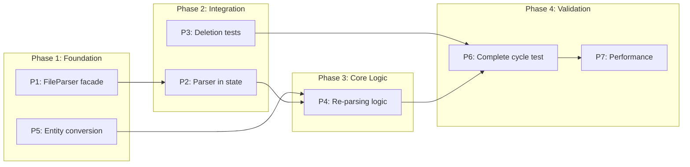

# Incremental Indexing Feature - Executable Specifications

> **Document Version**: 1.0.0
> **Created**: 2026-01-29
> **Status**: Specification Phase (Pre-Implementation)

---

## Overview

This document defines executable specifications (WHEN...THEN...SHALL contracts) for completing the incremental indexing feature in Parseltongue. The feature enables live file tracking where changes to individual files update the dependency graph without full re-indexing.

### Current State Analysis

| Component | Status | Location |
|-----------|--------|----------|
| POST /incremental-reindex-file-update | Partial (deletion only) | `pt08/.../incremental_reindex_file_handler.rs` |
| FileHashCache table | Working | `parseltongue-core/src/storage/cozo_client.rs:1283` |
| Re-parsing placeholder | TODO at line 277 | `incremental_reindex_file_handler.rs:277-289` |
| QueryBasedExtractor.parse_source() | Working | `parseltongue-core/src/query_extractor.rs:268-298` |
| Entity conversion logic | In pt01 only | `pt01/src/streamer.rs:141-287` |

### Dependency Graph

```
P1 (FileParser facade) -----> P2 (Add to state)
                                    |
                                    v
                              P4 (Re-parsing logic) <----- P5 (Entity conversion)
                                    |
                                    v
P3 (Deletion tests) ----------> P6 (Complete cycle test)
                                    |
                                    v
                              P7 (Performance validation)
```

---

## P1: Expose FileParser in parseltongue-core

### Contract REQ-INC-P1-001: FileParser Facade Creation

**WHEN** I call `FileParser::parse_file_to_entities()` with a valid file path and source content
**THEN** the system SHALL return a tuple of `(Vec<ParsedEntity>, Vec<DependencyEdge>)`
**AND** SHALL detect the language from the file extension
**AND** SHALL delegate to `QueryBasedExtractor::parse_source()`
**AND** SHALL return an error for unsupported file extensions

### Contract REQ-INC-P1-002: Thread-Safe Parser Instance

**WHEN** I create a `FileParser` instance
**THEN** the system SHALL be `Send + Sync` safe for use with `Arc<FileParser>`
**AND** SHALL use interior mutability (`Mutex`) for the underlying `QueryBasedExtractor`
**AND** SHALL support concurrent parsing from multiple threads

### Interface Signature

```rust
// File: parseltongue-core/src/file_parser.rs (NEW)

use std::path::Path;
use std::sync::Mutex;
use anyhow::Result;
use crate::entities::{Language, DependencyEdge};
use crate::query_extractor::{ParsedEntity, QueryBasedExtractor};

/// Thread-safe file parser facade
///
/// # 4-Word Name: FileParserFacadeWrapper
///
/// Wraps QueryBasedExtractor to provide a public API for pt08
/// while maintaining thread-safety for concurrent parsing.
pub struct FileParser {
    extractor: Mutex<QueryBasedExtractor>,
}

impl FileParser {
    /// Create new file parser instance
    ///
    /// # 4-Word Name: create_new_parser_instance
    ///
    /// # Contract
    /// - Postcondition: Returns initialized parser supporting 12 languages
    /// - Performance: ~1ms initialization overhead
    pub fn create_new_parser_instance() -> Result<Self>;

    /// Parse file content to entities
    ///
    /// # 4-Word Name: parse_file_to_entities
    ///
    /// # Contract
    /// - Precondition: file_path has supported extension (.rs, .py, .js, etc.)
    /// - Precondition: source_content is valid UTF-8
    /// - Postcondition: Returns (entities, edges) tuple
    /// - Postcondition: Empty vec if no entities found (not error)
    /// - Error: Returns error for unsupported language
    /// - Performance: <20ms per 1K LOC
    pub fn parse_file_to_entities(
        &self,
        file_path: &Path,
        source_content: &str,
    ) -> Result<(Vec<ParsedEntity>, Vec<DependencyEdge>)>;

    /// Detect language from file path
    ///
    /// # 4-Word Name: detect_language_from_path
    fn detect_language_from_path(file_path: &Path) -> Option<Language>;
}
```

### Test Template

```rust
// File: parseltongue-core/tests/file_parser_facade_tests.rs

use parseltongue_core::file_parser::FileParser;
use std::path::Path;

/// Test P1.1: Parser creation succeeds
///
/// # 4-Word Name: test_parser_creation_succeeds
#[test]
fn test_parser_creation_succeeds() {
    // GIVEN: Nothing (fresh state)

    // WHEN: Creating a new parser
    let parser = FileParser::create_new_parser_instance();

    // THEN: Parser is created successfully
    assert!(parser.is_ok());
}

/// Test P1.2: Parse Rust file extracts entities
///
/// # 4-Word Name: test_parse_rust_file_extracts
#[test]
fn test_parse_rust_file_extracts() {
    // GIVEN: Valid Rust source code
    let source = r#"
        pub fn calculate_total(items: &[i32]) -> i32 {
            items.iter().sum()
        }

        struct DataContainer {
            value: i32,
        }
    "#;
    let file_path = Path::new("/test/example.rs");
    let parser = FileParser::create_new_parser_instance().unwrap();

    // WHEN: Parsing the file
    let result = parser.parse_file_to_entities(file_path, source);

    // THEN: Returns entities for function and struct
    assert!(result.is_ok());
    let (entities, _edges) = result.unwrap();
    assert_eq!(entities.len(), 2);
    assert!(entities.iter().any(|e| e.name == "calculate_total"));
    assert!(entities.iter().any(|e| e.name == "DataContainer"));
}

/// Test P1.3: Unsupported extension returns error
///
/// # 4-Word Name: test_unsupported_extension_returns_error
#[test]
fn test_unsupported_extension_returns_error() {
    // GIVEN: File with unsupported extension
    let source = "some content";
    let file_path = Path::new("/test/data.xyz");
    let parser = FileParser::create_new_parser_instance().unwrap();

    // WHEN: Parsing the file
    let result = parser.parse_file_to_entities(file_path, source);

    // THEN: Returns error for unsupported language
    assert!(result.is_err());
    assert!(result.unwrap_err().to_string().contains("Unsupported"));
}

/// Test P1.4: Thread-safe concurrent parsing
///
/// # 4-Word Name: test_thread_safe_concurrent_parsing
#[test]
fn test_thread_safe_concurrent_parsing() {
    use std::sync::Arc;
    use std::thread;

    // GIVEN: Shared parser instance
    let parser = Arc::new(FileParser::create_new_parser_instance().unwrap());
    let source = "fn test_func() {}";

    // WHEN: Parsing concurrently from multiple threads
    let handles: Vec<_> = (0..4).map(|i| {
        let parser = Arc::clone(&parser);
        let path = format!("/test/file{}.rs", i);
        thread::spawn(move || {
            parser.parse_file_to_entities(Path::new(&path), source)
        })
    }).collect();

    // THEN: All threads complete successfully
    for handle in handles {
        let result = handle.join().unwrap();
        assert!(result.is_ok());
    }
}

/// Test P1.5: Empty file returns empty entities
///
/// # 4-Word Name: test_empty_file_returns_empty
#[test]
fn test_empty_file_returns_empty() {
    // GIVEN: Empty source file
    let source = "";
    let file_path = Path::new("/test/empty.rs");
    let parser = FileParser::create_new_parser_instance().unwrap();

    // WHEN: Parsing empty file
    let result = parser.parse_file_to_entities(file_path, source);

    // THEN: Returns empty vec (not error)
    assert!(result.is_ok());
    let (entities, edges) = result.unwrap();
    assert!(entities.is_empty());
    assert!(edges.is_empty());
}
```

### Acceptance Criteria

| ID | Criterion | Measurement |
|----|-----------|-------------|
| P1-AC1 | Parser initializes in <5ms | Benchmark test |
| P1-AC2 | Parses 1K LOC Rust file in <20ms | Performance test |
| P1-AC3 | Supports all 12 languages | Unit tests per language |
| P1-AC4 | Thread-safe (no data races) | Concurrent test passes |
| P1-AC5 | Returns error for unsupported extensions | Unit test |

### Dependencies

- **None** (foundational task)

---

## P2: Add Parser to pt08 SharedApplicationStateContainer

### Contract REQ-INC-P2-001: Parser State Integration

**WHEN** I create a `SharedApplicationStateContainer` with database storage
**THEN** the system SHALL also initialize a `FileParser` instance
**AND** SHALL store it as `parser_instance: Option<Arc<FileParser>>`
**AND** SHALL make it accessible to all HTTP handlers

### Contract REQ-INC-P2-002: Parser Availability Check

**WHEN** I access `state.parser_instance`
**THEN** the system SHALL return `Some(Arc<FileParser>)` if parsing is enabled
**AND** SHALL return `None` if parser initialization failed (graceful degradation)

### Interface Signature

```rust
// File: pt08/src/http_server_startup_runner.rs (MODIFIED)
// Lines 18-31 - Add parser_instance field

use std::sync::Arc;
use parseltongue_core::file_parser::FileParser;

/// Shared application state container
///
/// # 4-Word Name: SharedApplicationStateContainer
#[derive(Clone)]
pub struct SharedApplicationStateContainer {
    /// Database storage connection (optional CozoDbStorage)
    pub database_storage_connection_arc: Arc<RwLock<Option<Arc<CozoDbStorage>>>>,

    /// Server start timestamp
    pub server_start_timestamp_utc: DateTime<Utc>,

    /// Last request timestamp for idle timeout
    pub last_request_timestamp_arc: Arc<RwLock<DateTime<Utc>>>,

    /// Codebase statistics metadata
    pub codebase_statistics_metadata_arc: Arc<RwLock<CodebaseStatisticsMetadata>>,

    // NEW: Parser instance for incremental reindexing
    /// File parser for incremental reindex operations
    ///
    /// # 4-Word Name: parser_instance_option_arc
    ///
    /// None if parser failed to initialize (graceful degradation)
    pub parser_instance_option_arc: Option<Arc<FileParser>>,
}

impl SharedApplicationStateContainer {
    /// Create state with database and parser
    ///
    /// # 4-Word Name: create_with_database_and_parser
    pub fn create_with_database_and_parser(storage: CozoDbStorage) -> Self {
        let now = Utc::now();

        // Initialize parser (graceful degradation if fails)
        let parser = FileParser::create_new_parser_instance()
            .ok()
            .map(Arc::new);

        Self {
            database_storage_connection_arc: Arc::new(RwLock::new(Some(Arc::new(storage)))),
            server_start_timestamp_utc: now,
            last_request_timestamp_arc: Arc::new(RwLock::new(now)),
            codebase_statistics_metadata_arc: Arc::new(RwLock::new(CodebaseStatisticsMetadata::default())),
            parser_instance_option_arc: parser,
        }
    }
}
```

### Test Template

```rust
// File: pt08/src/http_server_startup_runner.rs (in #[cfg(test)] mod tests)

/// Test P2.1: State includes parser instance
///
/// # 4-Word Name: test_state_includes_parser_instance
#[tokio::test]
async fn test_state_includes_parser_instance() {
    // GIVEN: In-memory database
    let storage = CozoDbStorage::new("mem").await.unwrap();

    // WHEN: Creating state with database
    let state = SharedApplicationStateContainer::create_with_database_and_parser(storage);

    // THEN: Parser instance is present
    assert!(state.parser_instance_option_arc.is_some());
}

/// Test P2.2: Parser is accessible from state
///
/// # 4-Word Name: test_parser_accessible_from_state
#[tokio::test]
async fn test_parser_accessible_from_state() {
    // GIVEN: State with parser
    let storage = CozoDbStorage::new("mem").await.unwrap();
    let state = SharedApplicationStateContainer::create_with_database_and_parser(storage);

    // WHEN: Accessing parser through state
    let parser = state.parser_instance_option_arc.as_ref().unwrap();

    // THEN: Can parse files
    let result = parser.parse_file_to_entities(
        std::path::Path::new("/test.rs"),
        "fn main() {}"
    );
    assert!(result.is_ok());
}
```

### Acceptance Criteria

| ID | Criterion | Measurement |
|----|-----------|-------------|
| P2-AC1 | Parser field added to state struct | Compile succeeds |
| P2-AC2 | Parser initialized during state creation | Unit test |
| P2-AC3 | Graceful degradation if parser fails | Unit test with mock |
| P2-AC4 | Parser accessible from HTTP handlers | Integration test |

### Dependencies

- **P1** must be completed (FileParser type required)

---

## P3: Integration Tests for Deletion Logic

### Contract REQ-INC-P3-001: Unchanged File Early Return

**WHEN** I call POST /incremental-reindex-file-update with a file whose hash matches cached value
**THEN** the system SHALL return `hash_changed: false`
**AND** SHALL return `entities_removed: 0, entities_added: 0`
**AND** SHALL complete in <50ms

### Contract REQ-INC-P3-002: Changed File Deletes Entities

**WHEN** I call POST /incremental-reindex-file-update with a file whose hash differs from cache
**THEN** the system SHALL delete all entities WHERE `file_path == requested_path`
**AND** SHALL return `entities_removed: N` where N > 0 if entities existed
**AND** SHALL update the hash cache with new hash value

### Contract REQ-INC-P3-003: File Not Found Returns 404

**WHEN** I call POST /incremental-reindex-file-update with a non-existent file path
**THEN** the system SHALL return HTTP 404 Not Found
**AND** SHALL return error message containing "File not found"

### Contract REQ-INC-P3-004: Empty Path Returns 400

**WHEN** I call POST /incremental-reindex-file-update with empty path parameter
**THEN** the system SHALL return HTTP 400 Bad Request
**AND** SHALL return error message containing "required"

### Contract REQ-INC-P3-005: Directory Path Returns 400

**WHEN** I call POST /incremental-reindex-file-update with a directory path (not file)
**THEN** the system SHALL return HTTP 400 Bad Request
**AND** SHALL return error message containing "not a file"

### Contract REQ-INC-P3-006: Hash Cache Update After Change

**WHEN** I successfully process a changed file
**THEN** the system SHALL update FileHashCache with the new hash
**AND** a subsequent request with same content SHALL return `hash_changed: false`

### Contract REQ-INC-P3-007: Edge Deletion With Entities

**WHEN** I delete entities for a changed file
**THEN** the system SHALL also delete all outgoing edges from those entities
**AND** SHALL return `edges_removed: M` where M >= 0

### Test Template

```rust
// File: pt08/tests/http_server_integration_tests.rs (ADDITIONS)

use std::io::Write;
use tempfile::NamedTempFile;

// =============================================================================
// Phase 5: Incremental Reindex Deletion Tests (P3)
// =============================================================================

/// Test P3.1: Unchanged file returns early
///
/// # 4-Word Name: test_unchanged_file_returns_early
#[tokio::test]
async fn test_unchanged_file_returns_early() {
    // GIVEN: Database with hash cache entry matching file
    let storage = CozoDbStorage::new("mem").await.unwrap();
    storage.create_schema().await.unwrap();
    storage.create_dependency_edges_schema().await.unwrap();
    storage.create_file_hash_cache_schema().await.unwrap();

    // Create temp file
    let mut temp_file = NamedTempFile::new().unwrap();
    writeln!(temp_file, "fn unchanged() {{}}").unwrap();
    let file_path = temp_file.path().to_string_lossy().to_string();

    // Pre-populate hash cache with current hash
    let content = std::fs::read(&file_path).unwrap();
    let hash = sha256_hash(&content);
    storage.set_cached_file_hash_value(&file_path, &hash).await.unwrap();

    let state = SharedApplicationStateContainer::create_with_database_storage(storage);
    let app = build_complete_router_instance(state);

    // WHEN: POST /incremental-reindex-file-update?path=<file>
    let response = app
        .oneshot(
            Request::builder()
                .method("POST")
                .uri(format!("/incremental-reindex-file-update?path={}", file_path))
                .body(Body::empty())
                .unwrap()
        )
        .await
        .unwrap();

    // THEN: Returns hash_changed: false with no modifications
    assert_eq!(response.status(), StatusCode::OK);
    let body = axum::body::to_bytes(response.into_body(), usize::MAX).await.unwrap();
    let json: serde_json::Value = serde_json::from_slice(&body).unwrap();

    assert_eq!(json["success"], true);
    assert_eq!(json["data"]["hash_changed"], false);
    assert_eq!(json["data"]["entities_removed"], 0);
    assert_eq!(json["data"]["entities_added"], 0);
}

/// Test P3.2: Changed file deletes entities
///
/// # 4-Word Name: test_changed_file_deletes_entities
#[tokio::test]
async fn test_changed_file_deletes_entities() {
    // GIVEN: Database with entities for a file
    let storage = CozoDbStorage::new("mem").await.unwrap();
    storage.create_schema().await.unwrap();
    storage.create_dependency_edges_schema().await.unwrap();
    storage.create_file_hash_cache_schema().await.unwrap();

    // Create temp file
    let mut temp_file = NamedTempFile::new().unwrap();
    writeln!(temp_file, "fn changed() {{}}").unwrap();
    let file_path = temp_file.path().to_string_lossy().to_string();

    // Insert entity for this file
    let entity_key = format!("rust:fn:old_func:{}:1-5", file_path.replace(['/', '\\', '.'], "_"));
    storage.execute_query(&format!(r#"
        ?[ISGL1_key, Current_Code, Future_Code, interface_signature, TDD_Classification,
          lsp_meta_data, current_ind, future_ind, Future_Action, file_path, language,
          last_modified, entity_type, entity_class] <- [
            ["{}", "fn old_func() {{}}", null, "{{}}", "{{}}", null, true, true, null, "{}", "rust", "2024-01-01T00:00:00Z", "function", "CODE"]
        ]
        :put CodeGraph {{
            ISGL1_key =>
            Current_Code, Future_Code, interface_signature, TDD_Classification,
            lsp_meta_data, current_ind, future_ind, Future_Action, file_path, language,
            last_modified, entity_type, entity_class
        }}
    "#, entity_key, file_path)).await.unwrap();

    // Set OLD hash (different from current file content)
    storage.set_cached_file_hash_value(&file_path, "old_hash_value").await.unwrap();

    let state = SharedApplicationStateContainer::create_with_database_storage(storage);
    let app = build_complete_router_instance(state);

    // WHEN: POST /incremental-reindex-file-update?path=<file>
    let response = app
        .oneshot(
            Request::builder()
                .method("POST")
                .uri(format!("/incremental-reindex-file-update?path={}", file_path))
                .body(Body::empty())
                .unwrap()
        )
        .await
        .unwrap();

    // THEN: Returns hash_changed: true with entities_removed > 0
    assert_eq!(response.status(), StatusCode::OK);
    let body = axum::body::to_bytes(response.into_body(), usize::MAX).await.unwrap();
    let json: serde_json::Value = serde_json::from_slice(&body).unwrap();

    assert_eq!(json["success"], true);
    assert_eq!(json["data"]["hash_changed"], true);
    assert_eq!(json["data"]["entities_before"], 1);
    assert_eq!(json["data"]["entities_removed"], 1);
}

/// Test P3.3: File not found returns 404
///
/// # 4-Word Name: test_file_not_found_returns_404
#[tokio::test]
async fn test_file_not_found_returns_404() {
    // GIVEN: Server with database
    let storage = CozoDbStorage::new("mem").await.unwrap();
    storage.create_schema().await.unwrap();

    let state = SharedApplicationStateContainer::create_with_database_storage(storage);
    let app = build_complete_router_instance(state);

    // WHEN: POST with non-existent file
    let response = app
        .oneshot(
            Request::builder()
                .method("POST")
                .uri("/incremental-reindex-file-update?path=/nonexistent/file.rs")
                .body(Body::empty())
                .unwrap()
        )
        .await
        .unwrap();

    // THEN: Returns 404
    assert_eq!(response.status(), StatusCode::NOT_FOUND);
    let body = axum::body::to_bytes(response.into_body(), usize::MAX).await.unwrap();
    let json: serde_json::Value = serde_json::from_slice(&body).unwrap();

    assert_eq!(json["success"], false);
    assert!(json["error"].as_str().unwrap().contains("not found"));
}

/// Test P3.4: Empty path returns 400
///
/// # 4-Word Name: test_empty_path_returns_400
#[tokio::test]
async fn test_empty_path_returns_400() {
    // GIVEN: Server with database
    let storage = CozoDbStorage::new("mem").await.unwrap();
    storage.create_schema().await.unwrap();

    let state = SharedApplicationStateContainer::create_with_database_storage(storage);
    let app = build_complete_router_instance(state);

    // WHEN: POST with empty path
    let response = app
        .oneshot(
            Request::builder()
                .method("POST")
                .uri("/incremental-reindex-file-update?path=")
                .body(Body::empty())
                .unwrap()
        )
        .await
        .unwrap();

    // THEN: Returns 400
    assert_eq!(response.status(), StatusCode::BAD_REQUEST);
    let body = axum::body::to_bytes(response.into_body(), usize::MAX).await.unwrap();
    let json: serde_json::Value = serde_json::from_slice(&body).unwrap();

    assert_eq!(json["success"], false);
    assert!(json["error"].as_str().unwrap().contains("required"));
}

/// Test P3.5: Directory path returns 400
///
/// # 4-Word Name: test_directory_path_returns_400
#[tokio::test]
async fn test_directory_path_returns_400() {
    // GIVEN: Server with database
    let storage = CozoDbStorage::new("mem").await.unwrap();
    storage.create_schema().await.unwrap();

    let state = SharedApplicationStateContainer::create_with_database_storage(storage);
    let app = build_complete_router_instance(state);

    // WHEN: POST with directory path
    let response = app
        .oneshot(
            Request::builder()
                .method("POST")
                .uri("/incremental-reindex-file-update?path=/tmp")
                .body(Body::empty())
                .unwrap()
        )
        .await
        .unwrap();

    // THEN: Returns 400
    assert_eq!(response.status(), StatusCode::BAD_REQUEST);
    let body = axum::body::to_bytes(response.into_body(), usize::MAX).await.unwrap();
    let json: serde_json::Value = serde_json::from_slice(&body).unwrap();

    assert_eq!(json["success"], false);
    assert!(json["error"].as_str().unwrap().contains("not a file"));
}

/// Test P3.6: Hash cache updates after change
///
/// # 4-Word Name: test_hash_cache_updates_after_change
#[tokio::test]
async fn test_hash_cache_updates_after_change() {
    // GIVEN: Changed file processed
    let storage = CozoDbStorage::new("mem").await.unwrap();
    storage.create_schema().await.unwrap();
    storage.create_dependency_edges_schema().await.unwrap();
    storage.create_file_hash_cache_schema().await.unwrap();

    let mut temp_file = NamedTempFile::new().unwrap();
    writeln!(temp_file, "fn test() {{}}").unwrap();
    let file_path = temp_file.path().to_string_lossy().to_string();

    // No initial hash cached
    let state = SharedApplicationStateContainer::create_with_database_storage(storage.clone());
    let app = build_complete_router_instance(state);

    // First request (file is "new")
    let _ = app.clone()
        .oneshot(
            Request::builder()
                .method("POST")
                .uri(format!("/incremental-reindex-file-update?path={}", file_path))
                .body(Body::empty())
                .unwrap()
        )
        .await
        .unwrap();

    // WHEN: Second request with same content
    let response = app
        .oneshot(
            Request::builder()
                .method("POST")
                .uri(format!("/incremental-reindex-file-update?path={}", file_path))
                .body(Body::empty())
                .unwrap()
        )
        .await
        .unwrap();

    // THEN: Second request returns hash_changed: false
    let body = axum::body::to_bytes(response.into_body(), usize::MAX).await.unwrap();
    let json: serde_json::Value = serde_json::from_slice(&body).unwrap();

    assert_eq!(json["data"]["hash_changed"], false);
}

/// Test P3.7: Edge deletion with entities
///
/// # 4-Word Name: test_edge_deletion_with_entities
#[tokio::test]
async fn test_edge_deletion_with_entities() {
    // GIVEN: Database with entity and outgoing edge
    let storage = CozoDbStorage::new("mem").await.unwrap();
    storage.create_schema().await.unwrap();
    storage.create_dependency_edges_schema().await.unwrap();
    storage.create_file_hash_cache_schema().await.unwrap();

    let mut temp_file = NamedTempFile::new().unwrap();
    writeln!(temp_file, "fn caller() {{ callee(); }}").unwrap();
    let file_path = temp_file.path().to_string_lossy().to_string();
    let sanitized = file_path.replace(['/', '\\', '.'], "_");

    let entity_key = format!("rust:fn:caller:{}:1-5", sanitized);

    // Insert entity
    storage.execute_query(&format!(r#"
        ?[ISGL1_key, Current_Code, Future_Code, interface_signature, TDD_Classification,
          lsp_meta_data, current_ind, future_ind, Future_Action, file_path, language,
          last_modified, entity_type, entity_class] <- [
            ["{}", "fn caller() {{ callee(); }}", null, "{{}}", "{{}}", null, true, true, null, "{}", "rust", "2024-01-01T00:00:00Z", "function", "CODE"]
        ]
        :put CodeGraph {{
            ISGL1_key =>
            Current_Code, Future_Code, interface_signature, TDD_Classification,
            lsp_meta_data, current_ind, future_ind, Future_Action, file_path, language,
            last_modified, entity_type, entity_class
        }}
    "#, entity_key, file_path)).await.unwrap();

    // Insert edge from this entity
    storage.execute_query(&format!(r#"
        ?[from_key, to_key, edge_type, source_location] <-
        [["{}", "rust:fn:callee:other:1-5", "Calls", "test.rs:1"]]
        :put DependencyEdges {{
            from_key, to_key, edge_type =>
            source_location
        }}
    "#, entity_key)).await.unwrap();

    // Set old hash to trigger change detection
    storage.set_cached_file_hash_value(&file_path, "old_hash").await.unwrap();

    let state = SharedApplicationStateContainer::create_with_database_storage(storage);
    let app = build_complete_router_instance(state);

    // WHEN: Reindex the file
    let response = app
        .oneshot(
            Request::builder()
                .method("POST")
                .uri(format!("/incremental-reindex-file-update?path={}", file_path))
                .body(Body::empty())
                .unwrap()
        )
        .await
        .unwrap();

    // THEN: Edge is also deleted
    let body = axum::body::to_bytes(response.into_body(), usize::MAX).await.unwrap();
    let json: serde_json::Value = serde_json::from_slice(&body).unwrap();

    assert_eq!(json["data"]["entities_removed"], 1);
    assert_eq!(json["data"]["edges_removed"], 1);
}

// Helper function for tests
fn sha256_hash(content: &[u8]) -> String {
    use sha2::{Sha256, Digest};
    let mut hasher = Sha256::new();
    hasher.update(content);
    hex::encode(hasher.finalize())
}
```

### Acceptance Criteria

| ID | Criterion | Measurement |
|----|-----------|-------------|
| P3-AC1 | All 7 integration tests pass | `cargo test` |
| P3-AC2 | Early return <50ms for unchanged files | Benchmark |
| P3-AC3 | Entity deletion confirmed in DB | Query verification |
| P3-AC4 | Edge deletion confirmed in DB | Query verification |
| P3-AC5 | Error responses follow standard format | JSON schema validation |

### Dependencies

- **None** (tests existing functionality)

---

## P4: Implement Re-Parsing Logic

### Contract REQ-INC-P4-001: Parse Changed File

**WHEN** a file's hash differs from cached value (deletion completed)
**THEN** the system SHALL parse the file using `FileParser::parse_file_to_entities()`
**AND** SHALL convert ParsedEntity to CodeEntity using entity conversion utility
**AND** SHALL insert new entities to CodeGraph table
**AND** SHALL return `entities_added: N` where N = number of parsed entities

### Contract REQ-INC-P4-002: Insert Dependency Edges

**WHEN** parsing produces dependency edges
**THEN** the system SHALL insert edges to DependencyEdges table
**AND** SHALL return `edges_added: M` where M = number of new edges

### Contract REQ-INC-P4-003: Graceful Parser Unavailable

**WHEN** `parser_instance_option_arc` is None (parser failed to initialize)
**THEN** the system SHALL skip re-parsing step
**AND** SHALL return `entities_added: 0, edges_added: 0`
**AND** SHALL NOT fail the request

### Interface Signature

```rust
// File: pt08/src/http_endpoint_handler_modules/incremental_reindex_file_handler.rs
// Replace lines 277-289

// After deletion (line 275), add re-parsing:

// Re-parse file if parser is available
let (entities_added, edges_added) = if let Some(parser) = &state.parser_instance_option_arc {
    // Parse file content
    match parser.parse_file_to_entities(file_path, &String::from_utf8_lossy(&file_content)) {
        Ok((parsed_entities, parsed_edges)) => {
            // Convert and insert entities
            let mut added_count = 0;
            for parsed in &parsed_entities {
                let code_entity = convert_parsed_to_code_entity(
                    parsed,
                    &params.path,
                    &String::from_utf8_lossy(&file_content),
                )?;
                if storage.insert_entity(&code_entity).await.is_ok() {
                    added_count += 1;
                }
            }

            // Insert edges
            let edges_count = if !parsed_edges.is_empty() {
                storage.insert_edges_batch(&parsed_edges).await
                    .map(|_| parsed_edges.len())
                    .unwrap_or(0)
            } else {
                0
            };

            (added_count, edges_count)
        }
        Err(e) => {
            eprintln!("Warning: Failed to parse file: {}", e);
            (0, 0)
        }
    }
} else {
    // Parser not available - skip re-parsing
    (0, 0)
};

let entities_after = entities_added;
```

### Test Template

```rust
/// Test P4.1: Re-parsing inserts new entities
///
/// # 4-Word Name: test_reparsing_inserts_new_entities
#[tokio::test]
async fn test_reparsing_inserts_new_entities() {
    // GIVEN: File with Rust function, parser enabled
    let storage = CozoDbStorage::new("mem").await.unwrap();
    storage.create_schema().await.unwrap();
    storage.create_dependency_edges_schema().await.unwrap();
    storage.create_file_hash_cache_schema().await.unwrap();

    let mut temp_file = NamedTempFile::with_suffix(".rs").unwrap();
    writeln!(temp_file, "pub fn new_function() {{ println!(\"hello\"); }}").unwrap();
    let file_path = temp_file.path().to_string_lossy().to_string();

    // Create state WITH parser
    let state = SharedApplicationStateContainer::create_with_database_and_parser(storage);
    let app = build_complete_router_instance(state);

    // WHEN: Reindex the file
    let response = app
        .oneshot(
            Request::builder()
                .method("POST")
                .uri(format!("/incremental-reindex-file-update?path={}", file_path))
                .body(Body::empty())
                .unwrap()
        )
        .await
        .unwrap();

    // THEN: Entity is added
    let body = axum::body::to_bytes(response.into_body(), usize::MAX).await.unwrap();
    let json: serde_json::Value = serde_json::from_slice(&body).unwrap();

    assert_eq!(json["data"]["hash_changed"], true);
    assert!(json["data"]["entities_added"].as_u64().unwrap() >= 1);
}

/// Test P4.2: Parser unavailable degrades gracefully
///
/// # 4-Word Name: test_parser_unavailable_degrades_gracefully
#[tokio::test]
async fn test_parser_unavailable_degrades_gracefully() {
    // GIVEN: State WITHOUT parser (simulated failure)
    let storage = CozoDbStorage::new("mem").await.unwrap();
    storage.create_schema().await.unwrap();
    storage.create_dependency_edges_schema().await.unwrap();
    storage.create_file_hash_cache_schema().await.unwrap();

    let mut temp_file = NamedTempFile::with_suffix(".rs").unwrap();
    writeln!(temp_file, "fn test() {{}}").unwrap();
    let file_path = temp_file.path().to_string_lossy().to_string();

    // Create state WITHOUT parser (old method)
    let state = SharedApplicationStateContainer::create_with_database_storage(storage);
    let app = build_complete_router_instance(state);

    // WHEN: Reindex the file
    let response = app
        .oneshot(
            Request::builder()
                .method("POST")
                .uri(format!("/incremental-reindex-file-update?path={}", file_path))
                .body(Body::empty())
                .unwrap()
        )
        .await
        .unwrap();

    // THEN: Request succeeds with 0 entities added
    assert_eq!(response.status(), StatusCode::OK);
    let body = axum::body::to_bytes(response.into_body(), usize::MAX).await.unwrap();
    let json: serde_json::Value = serde_json::from_slice(&body).unwrap();

    assert_eq!(json["success"], true);
    assert_eq!(json["data"]["entities_added"], 0);
}
```

### Acceptance Criteria

| ID | Criterion | Measurement |
|----|-----------|-------------|
| P4-AC1 | Entities inserted after parsing | DB query verification |
| P4-AC2 | Edges inserted after parsing | DB query verification |
| P4-AC3 | Graceful degradation without parser | Unit test |
| P4-AC4 | Parse errors logged, not fatal | Log inspection |

### Dependencies

- **P1** (FileParser)
- **P2** (Parser in state)
- **P5** (Entity conversion)

---

## P5: Entity Conversion Utility

### Contract REQ-INC-P5-001: ParsedEntity to CodeEntity Conversion

**WHEN** I call `convert_parsed_to_code_entity()` with a ParsedEntity
**THEN** the system SHALL create a CodeEntity with:
  - ISGL1_key generated from language:type:name:sanitized_path:line_range
  - Current_Code extracted from source by line range
  - entity_class determined by test detection heuristics
  - All required fields populated

### Contract REQ-INC-P5-002: ISGL1 Key Generation

**WHEN** generating ISGL1 key for a ParsedEntity
**THEN** the system SHALL follow format: `{language}:{entity_type}:{name}:{sanitized_path}:{start}-{end}`
**AND** SHALL sanitize file path (replace `/`, `\`, `.` with `_`)
**AND** SHALL produce deterministic keys for same input

### Interface Signature

```rust
// File: parseltongue-core/src/entity_conversion.rs (NEW)

use crate::entities::{CodeEntity, EntityClass, Language};
use crate::query_extractor::ParsedEntity;
use anyhow::Result;
use std::path::Path;

/// Convert ParsedEntity to CodeEntity for database storage
///
/// # 4-Word Name: convert_parsed_to_code_entity
///
/// # Contract
/// - Precondition: parsed has valid language, name, line_range
/// - Precondition: source_code contains lines referenced by line_range
/// - Postcondition: Returns CodeEntity with all fields populated
/// - Postcondition: ISGL1_key is deterministic for same input
pub fn convert_parsed_to_code_entity(
    parsed: &ParsedEntity,
    file_path: &str,
    source_code: &str,
) -> Result<CodeEntity>;

/// Generate ISGL1 key for a parsed entity
///
/// # 4-Word Name: generate_isgl1_key_string
///
/// Format: {language}:{type}:{name}:{sanitized_path}:{start}-{end}
pub fn generate_isgl1_key_string(
    language: &Language,
    entity_type: &str,
    name: &str,
    file_path: &str,
    line_range: (usize, usize),
) -> String;

/// Extract code snippet from source by line range
///
/// # 4-Word Name: extract_code_snippet_lines
pub fn extract_code_snippet_lines(
    source: &str,
    start_line: usize,
    end_line: usize,
) -> String;

/// Detect if entity is a test based on path and name
///
/// # 4-Word Name: detect_test_entity_class
///
/// Heuristics:
/// - File path contains "test", "tests", "spec", "_test", "test_"
/// - Function name starts with "test_" or ends with "_test"
/// - Contains #[test] or #[cfg(test)] attributes
pub fn detect_test_entity_class(
    file_path: &str,
    entity_name: &str,
) -> EntityClass;

/// Sanitize file path for ISGL1 key format
///
/// # 4-Word Name: sanitize_path_for_key
fn sanitize_path_for_key(path: &str) -> String {
    path.replace(['/', '\\', '.'], "_")
}
```

### Test Template

```rust
// File: parseltongue-core/tests/entity_conversion_tests.rs

use parseltongue_core::entity_conversion::*;
use parseltongue_core::query_extractor::{ParsedEntity, EntityType};
use parseltongue_core::entities::Language;

/// Test P5.1: Basic entity conversion
///
/// # 4-Word Name: test_basic_entity_conversion
#[test]
fn test_basic_entity_conversion() {
    // GIVEN: ParsedEntity for a Rust function
    let parsed = ParsedEntity {
        entity_type: EntityType::Function,
        name: "calculate_total".to_string(),
        language: Language::Rust,
        line_range: (1, 5),
        file_path: "/src/math.rs".to_string(),
        metadata: std::collections::HashMap::new(),
    };
    let source = "pub fn calculate_total(items: &[i32]) -> i32 {\n    items.iter().sum()\n}\n// padding\n// more";

    // WHEN: Converting to CodeEntity
    let result = convert_parsed_to_code_entity(&parsed, "/src/math.rs", source);

    // THEN: CodeEntity has correct fields
    assert!(result.is_ok());
    let entity = result.unwrap();
    assert!(entity.isgl1_key.contains("rust:fn:calculate_total"));
    assert!(entity.current_code.is_some());
}

/// Test P5.2: ISGL1 key format
///
/// # 4-Word Name: test_isgl1_key_format
#[test]
fn test_isgl1_key_format() {
    // GIVEN: Entity parameters
    let language = Language::Rust;
    let entity_type = "fn";
    let name = "my_function";
    let file_path = "/src/lib.rs";
    let line_range = (10, 20);

    // WHEN: Generating key
    let key = generate_isgl1_key_string(&language, entity_type, name, file_path, line_range);

    // THEN: Follows expected format
    assert_eq!(key, "rust:fn:my_function:_src_lib_rs:10-20");
}

/// Test P5.3: Test detection by path
///
/// # 4-Word Name: test_detection_by_path
#[test]
fn test_detection_by_path() {
    // Test files should be classified as TEST
    assert_eq!(
        detect_test_entity_class("/tests/integration_test.rs", "test_feature"),
        EntityClass::TestImplementation
    );

    // Non-test files should be CODE
    assert_eq!(
        detect_test_entity_class("/src/main.rs", "process_data"),
        EntityClass::CodeImplementation
    );
}

/// Test P5.4: Path sanitization
///
/// # 4-Word Name: test_path_sanitization
#[test]
fn test_path_sanitization() {
    assert_eq!(sanitize_path_for_key("/src/lib.rs"), "_src_lib_rs");
    assert_eq!(sanitize_path_for_key("src\\main.rs"), "src_main_rs");
}

/// Test P5.5: Code snippet extraction
///
/// # 4-Word Name: test_code_snippet_extraction
#[test]
fn test_code_snippet_extraction() {
    let source = "line 1\nline 2\nline 3\nline 4\nline 5";

    // Extract lines 2-4
    let snippet = extract_code_snippet_lines(source, 2, 4);

    assert_eq!(snippet, "line 2\nline 3\nline 4");
}
```

### Acceptance Criteria

| ID | Criterion | Measurement |
|----|-----------|-------------|
| P5-AC1 | Produces valid CodeEntity | Unit tests |
| P5-AC2 | ISGL1 keys are deterministic | Property test |
| P5-AC3 | Test detection accuracy >95% | Test suite |
| P5-AC4 | Handles all 12 languages | Language-specific tests |

### Dependencies

- **None** (utility functions)

---

## P6: Complete Cycle Integration Test

### Contract REQ-INC-P6-001: Full Reindex Cycle

**WHEN** I have a file with entities in the database, modify the file, and call reindex
**THEN** the system SHALL:
  1. Delete old entities
  2. Delete old edges
  3. Parse new content
  4. Insert new entities
  5. Insert new edges
  6. Update hash cache
**AND** the final entity count SHALL reflect the new file content

### Test Template

```rust
/// Test P6.1: Complete reindex cycle
///
/// # 4-Word Name: test_complete_reindex_cycle
///
/// # Contract
/// - GIVEN: File with 2 entities in DB
/// - WHEN: File modified to have 3 entities, reindex called
/// - THEN: DB contains 3 entities (old deleted, new inserted)
#[tokio::test]
async fn test_complete_reindex_cycle() {
    // GIVEN: Database with file containing 2 entities
    let storage = CozoDbStorage::new("mem").await.unwrap();
    storage.create_schema().await.unwrap();
    storage.create_dependency_edges_schema().await.unwrap();
    storage.create_file_hash_cache_schema().await.unwrap();

    // Create initial file with 2 functions
    let mut temp_file = NamedTempFile::with_suffix(".rs").unwrap();
    writeln!(temp_file, "fn func_a() {{}}\nfn func_b() {{}}").unwrap();
    let file_path = temp_file.path().to_string_lossy().to_string();

    // Index initially
    let state = SharedApplicationStateContainer::create_with_database_and_parser(storage.clone());
    let app = build_complete_router_instance(state.clone());

    let _ = app.clone()
        .oneshot(
            Request::builder()
                .method("POST")
                .uri(format!("/incremental-reindex-file-update?path={}", file_path))
                .body(Body::empty())
                .unwrap()
        )
        .await
        .unwrap();

    // Verify 2 entities in DB
    let count_before = storage.count_all_entities_total().await.unwrap();
    assert_eq!(count_before, 2);

    // WHEN: Modify file to have 3 functions
    {
        let mut file = std::fs::OpenOptions::new()
            .write(true)
            .truncate(true)
            .open(&file_path)
            .unwrap();
        writeln!(file, "fn func_x() {{}}\nfn func_y() {{}}\nfn func_z() {{}}").unwrap();
    }

    // Reindex
    let response = app
        .oneshot(
            Request::builder()
                .method("POST")
                .uri(format!("/incremental-reindex-file-update?path={}", file_path))
                .body(Body::empty())
                .unwrap()
        )
        .await
        .unwrap();

    // THEN: Response shows change
    let body = axum::body::to_bytes(response.into_body(), usize::MAX).await.unwrap();
    let json: serde_json::Value = serde_json::from_slice(&body).unwrap();

    assert_eq!(json["data"]["hash_changed"], true);
    assert_eq!(json["data"]["entities_before"], 2);
    assert_eq!(json["data"]["entities_removed"], 2);
    assert_eq!(json["data"]["entities_added"], 3);
    assert_eq!(json["data"]["entities_after"], 3);

    // Verify final count in DB
    let count_after = storage.count_all_entities_total().await.unwrap();
    assert_eq!(count_after, 3);
}

/// Test P6.2: Reindex with edges
///
/// # 4-Word Name: test_reindex_with_edges
#[tokio::test]
async fn test_reindex_with_edges() {
    // GIVEN: File with function that has dependency
    let storage = CozoDbStorage::new("mem").await.unwrap();
    storage.create_schema().await.unwrap();
    storage.create_dependency_edges_schema().await.unwrap();
    storage.create_file_hash_cache_schema().await.unwrap();

    // Create file with function calling another
    let mut temp_file = NamedTempFile::with_suffix(".rs").unwrap();
    writeln!(temp_file, "fn caller() {{ helper(); }}\nfn helper() {{}}").unwrap();
    let file_path = temp_file.path().to_string_lossy().to_string();

    let state = SharedApplicationStateContainer::create_with_database_and_parser(storage.clone());
    let app = build_complete_router_instance(state);

    // WHEN: Reindex
    let response = app
        .oneshot(
            Request::builder()
                .method("POST")
                .uri(format!("/incremental-reindex-file-update?path={}", file_path))
                .body(Body::empty())
                .unwrap()
        )
        .await
        .unwrap();

    // THEN: Entities and edges are created
    let body = axum::body::to_bytes(response.into_body(), usize::MAX).await.unwrap();
    let json: serde_json::Value = serde_json::from_slice(&body).unwrap();

    assert!(json["data"]["entities_added"].as_u64().unwrap() >= 2);
    // Edge creation depends on parser capability
    // At minimum, no errors
    assert_eq!(json["success"], true);
}
```

### Acceptance Criteria

| ID | Criterion | Measurement |
|----|-----------|-------------|
| P6-AC1 | Entity count reflects file content | DB query |
| P6-AC2 | Old entities removed | DB query |
| P6-AC3 | New entities inserted | DB query |
| P6-AC4 | Edge deletion and insertion works | DB query |
| P6-AC5 | Hash cache updated | DB query |

### Dependencies

- **P1-P5** must all be completed

---

## P7: Performance Validation

### Contract REQ-INC-P7-001: Reindex Performance

**WHEN** I reindex a typical file (100 LOC, 5 entities)
**THEN** the complete operation SHALL complete in <500ms
**AND** individual phases SHALL meet:
  - Hash computation: <10ms
  - DB queries (delete + insert): <200ms
  - Parsing: <50ms
  - Total overhead: <500ms

### Contract REQ-INC-P7-002: Early Return Performance

**WHEN** I reindex a file whose hash matches cache
**THEN** the operation SHALL complete in <50ms
**AND** SHALL NOT perform any DB writes

### Test Template

```rust
/// Test P7.1: Performance under 500ms
///
/// # 4-Word Name: test_performance_under_500ms
#[tokio::test]
async fn test_performance_under_500ms() {
    use std::time::Instant;

    // GIVEN: File with realistic content (100 LOC, 5 entities)
    let storage = CozoDbStorage::new("mem").await.unwrap();
    storage.create_schema().await.unwrap();
    storage.create_dependency_edges_schema().await.unwrap();
    storage.create_file_hash_cache_schema().await.unwrap();

    let mut temp_file = NamedTempFile::with_suffix(".rs").unwrap();
    // Generate 100 LOC file with 5 functions
    let content: String = (0..5)
        .map(|i| format!(
            "/// Documentation for function {}\n\
             pub fn function_{}(arg1: i32, arg2: &str) -> Result<String, Error> {{\n\
                 let result = process(arg1);\n\
                 let formatted = format!(\"{{}} {{}}\", arg2, result);\n\
                 if result > 0 {{\n\
                     Ok(formatted)\n\
                 }} else {{\n\
                     Err(Error::new(\"negative\"))\n\
                 }}\n\
             }}\n\n",
            i, i
        ))
        .collect();
    writeln!(temp_file, "{}", content).unwrap();
    let file_path = temp_file.path().to_string_lossy().to_string();

    let state = SharedApplicationStateContainer::create_with_database_and_parser(storage);
    let app = build_complete_router_instance(state);

    // WHEN: Timing the reindex operation
    let start = Instant::now();

    let response = app
        .oneshot(
            Request::builder()
                .method("POST")
                .uri(format!("/incremental-reindex-file-update?path={}", file_path))
                .body(Body::empty())
                .unwrap()
        )
        .await
        .unwrap();

    let elapsed = start.elapsed();

    // THEN: Completes in <500ms
    assert!(elapsed.as_millis() < 500, "Reindex took {}ms, expected <500ms", elapsed.as_millis());

    // Verify success
    let body = axum::body::to_bytes(response.into_body(), usize::MAX).await.unwrap();
    let json: serde_json::Value = serde_json::from_slice(&body).unwrap();
    assert_eq!(json["success"], true);

    // Response includes processing time
    let reported_time = json["data"]["processing_time_ms"].as_u64().unwrap();
    assert!(reported_time < 500);
}

/// Test P7.2: Early return under 50ms
///
/// # 4-Word Name: test_early_return_under_50ms
#[tokio::test]
async fn test_early_return_under_50ms() {
    use std::time::Instant;

    // GIVEN: File with cached hash
    let storage = CozoDbStorage::new("mem").await.unwrap();
    storage.create_schema().await.unwrap();
    storage.create_dependency_edges_schema().await.unwrap();
    storage.create_file_hash_cache_schema().await.unwrap();

    let mut temp_file = NamedTempFile::with_suffix(".rs").unwrap();
    writeln!(temp_file, "fn unchanged() {{}}").unwrap();
    let file_path = temp_file.path().to_string_lossy().to_string();

    // Pre-cache the hash
    let content = std::fs::read(&file_path).unwrap();
    let hash = sha256_hash(&content);
    storage.set_cached_file_hash_value(&file_path, &hash).await.unwrap();

    let state = SharedApplicationStateContainer::create_with_database_and_parser(storage);
    let app = build_complete_router_instance(state);

    // WHEN: Timing the early return
    let start = Instant::now();

    let response = app
        .oneshot(
            Request::builder()
                .method("POST")
                .uri(format!("/incremental-reindex-file-update?path={}", file_path))
                .body(Body::empty())
                .unwrap()
        )
        .await
        .unwrap();

    let elapsed = start.elapsed();

    // THEN: Completes in <50ms
    assert!(elapsed.as_millis() < 50, "Early return took {}ms, expected <50ms", elapsed.as_millis());

    let body = axum::body::to_bytes(response.into_body(), usize::MAX).await.unwrap();
    let json: serde_json::Value = serde_json::from_slice(&body).unwrap();
    assert_eq!(json["data"]["hash_changed"], false);
}

/// Test P7.3: Benchmark multiple files
///
/// # 4-Word Name: test_benchmark_multiple_files
#[tokio::test]
async fn test_benchmark_multiple_files() {
    use std::time::Instant;

    // GIVEN: 10 files to reindex
    let storage = CozoDbStorage::new("mem").await.unwrap();
    storage.create_schema().await.unwrap();
    storage.create_dependency_edges_schema().await.unwrap();
    storage.create_file_hash_cache_schema().await.unwrap();

    let temp_dir = tempfile::tempdir().unwrap();
    let mut file_paths = Vec::new();

    for i in 0..10 {
        let path = temp_dir.path().join(format!("file{}.rs", i));
        std::fs::write(&path, format!("fn func{}() {{}}", i)).unwrap();
        file_paths.push(path.to_string_lossy().to_string());
    }

    let state = SharedApplicationStateContainer::create_with_database_and_parser(storage);

    // WHEN: Reindexing all files
    let start = Instant::now();

    for file_path in &file_paths {
        let app = build_complete_router_instance(state.clone());
        let _ = app
            .oneshot(
                Request::builder()
                    .method("POST")
                    .uri(format!("/incremental-reindex-file-update?path={}", file_path))
                    .body(Body::empty())
                    .unwrap()
            )
            .await
            .unwrap();
    }

    let elapsed = start.elapsed();

    // THEN: Average <500ms per file (total <5s for 10 files)
    let avg_ms = elapsed.as_millis() / 10;
    assert!(avg_ms < 500, "Average {}ms per file, expected <500ms", avg_ms);
}
```

### Acceptance Criteria

| ID | Criterion | Measurement |
|----|-----------|-------------|
| P7-AC1 | Full reindex <500ms | Benchmark test |
| P7-AC2 | Early return <50ms | Benchmark test |
| P7-AC3 | 10 file batch <5s total | Batch benchmark |
| P7-AC4 | No memory leaks | Valgrind/ASAN |

### Dependencies

- **P1-P6** must all be completed

---

## Implementation Order



### Recommended Execution Order

1. **P5** (Entity conversion) - Pure utility, no dependencies
2. **P1** (FileParser facade) - Requires P5 for integration
3. **P3** (Deletion tests) - Tests existing functionality
4. **P2** (Parser in state) - Requires P1
5. **P4** (Re-parsing logic) - Requires P1, P2, P5
6. **P6** (Complete cycle test) - Requires P1-P5
7. **P7** (Performance validation) - Final validation

---

## Summary of All Contracts

| Task | Contract IDs | Test Count | Dependencies |
|------|-------------|------------|--------------|
| P1 | REQ-INC-P1-001, P1-002 | 5 | None |
| P2 | REQ-INC-P2-001, P2-002 | 2 | P1 |
| P3 | REQ-INC-P3-001 to P3-007 | 7 | None |
| P4 | REQ-INC-P4-001 to P4-003 | 2 | P1, P2, P5 |
| P5 | REQ-INC-P5-001, P5-002 | 5 | None |
| P6 | REQ-INC-P6-001 | 2 | P1-P5 |
| P7 | REQ-INC-P7-001, P7-002 | 3 | P1-P6 |

**Total: 14 Contracts, 26 Tests**

---

## File Locations Summary

| File | Status | Purpose |
|------|--------|---------|
| `parseltongue-core/src/file_parser.rs` | NEW | FileParser facade |
| `parseltongue-core/src/entity_conversion.rs` | NEW | Entity conversion utilities |
| `parseltongue-core/src/lib.rs` | MODIFY | Export new modules |
| `pt08/src/http_server_startup_runner.rs` | MODIFY | Add parser to state |
| `pt08/src/http_endpoint_handler_modules/incremental_reindex_file_handler.rs` | MODIFY | Add re-parsing logic |
| `pt08/tests/http_server_integration_tests.rs` | MODIFY | Add 14+ new tests |
| `parseltongue-core/tests/file_parser_facade_tests.rs` | NEW | Parser unit tests |
| `parseltongue-core/tests/entity_conversion_tests.rs` | NEW | Conversion unit tests |

---

*Document generated following TDD-First methodology and WHEN...THEN...SHALL contract format.*
