# Mermaid Syntax Guide: Common Mistakes to Avoid

**Date**: 2026-02-01
**Purpose**: Document common Mermaid parsing errors and how to fix them
**Audience**: Engineers creating Mermaid diagrams for documentation

---

## Overview

Mermaid is powerful but has strict syntax requirements. This guide documents **real errors** encountered in production and how to fix them.

---

## Error 1: Parentheses in Quadrant Chart Labels

### ❌ WRONG (Causes Lexical Error)

```mermaid
quadrantChart
    title Feature Priority
    quadrant-1 High Impact, High Effort (Strategic)
    quadrant-2 High Impact, Low Effort (Quick Wins)

    Feature 6 (Tech Debt): [0.3, 0.95]
    Feature 11 (Centrality): [0.25, 0.9]
```

**Error Message**:
```
Lexical error on line 10. Unrecognized text.
...void    Feature 6 (Tech Debt): [0.3, 0
---------------------^
```

### ✅ CORRECT

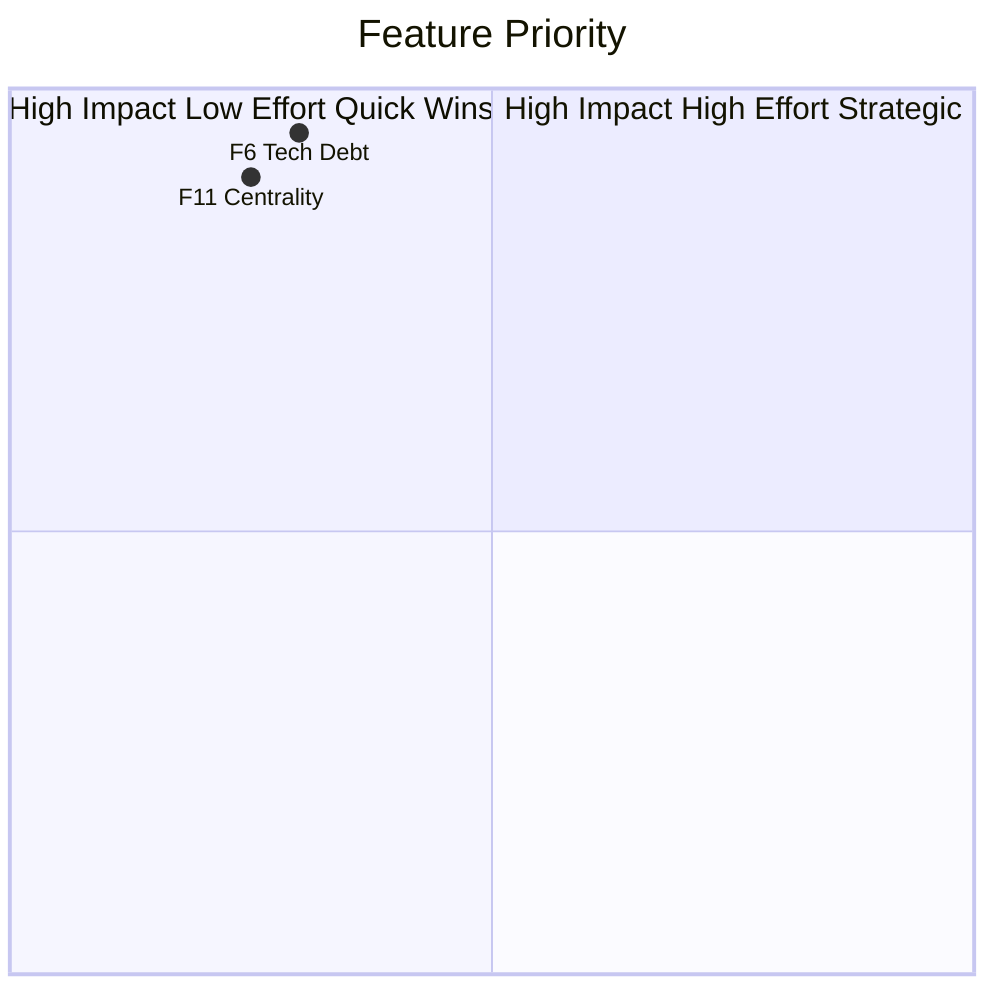

**Rules**:
1. No parentheses `()` in quadrant labels
2. No parentheses `()` in data point labels
3. No commas in quadrant labels (use spaces instead)
4. Keep labels short and simple

---

## Error 2: Parentheses in Node Labels (Flowcharts/Graphs)

### ❌ WRONG (Causes Parse Error)

```mermaid
flowchart TD
    Query1 --> Algo1[Leiden Algorithm<br/>O(E log V)]
    Query2 --> Algo2[SQALE Method<br/>O(V)]
```

**Error Message**:
```
Parse error on line 12:
...Leiden Algorithm<br/>O(E log V)]    Query
-----------------------^
Expecting 'SQE', 'DOUBLECIRCLEEND', 'PE', '-)', got 'PS'
```

### ✅ CORRECT (Option 1: Replace with Hyphens)

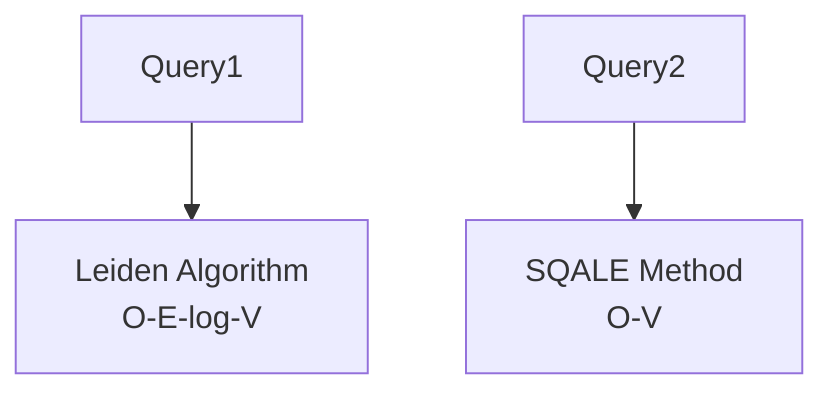

### ✅ CORRECT (Option 2: Remove Completely)

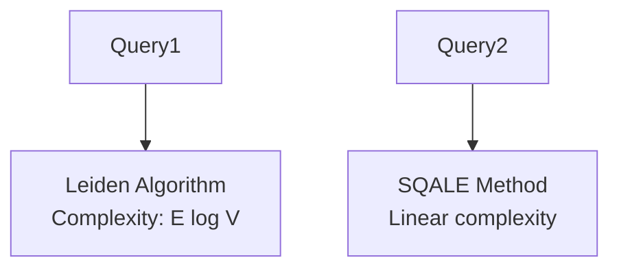

**Rules**:
1. Avoid parentheses in node labels
2. If using mathematical notation, replace `()` with `-` or words
3. Always wrap labels with special characters in quotes `["..."]`
4. Use `<br/>` for line breaks (works reliably)

---

## Error 3: Special Characters in Subgraph Names

### ❌ WRONG

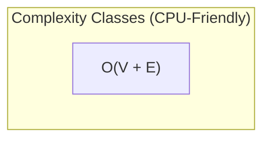

**Error**: Parentheses in subgraph name can cause issues

### ✅ CORRECT

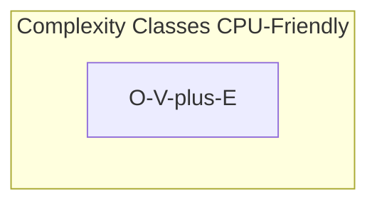

**Rules**:
1. Avoid parentheses in subgraph names
2. Replace `+` with `plus`, `()` with `-`, etc.
3. Use quotes for multi-word subgraph names

---

## Error 4: Commas in Labels

### ❌ WRONG

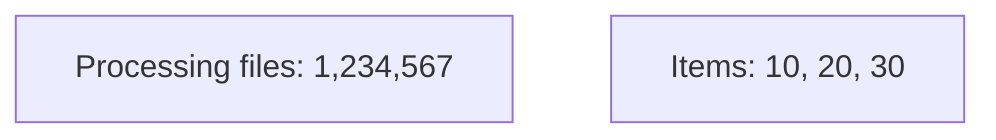

**Issue**: Commas can be misinterpreted as separators

### ✅ CORRECT

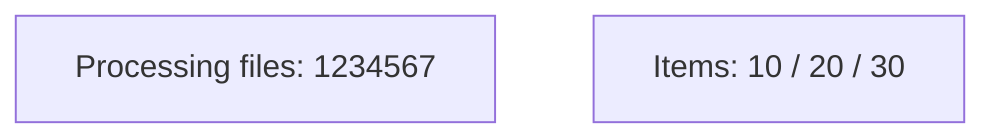

**Rules**:
1. Avoid commas in labels if possible
2. Use spaces, hyphens, or slashes instead
3. For numbers, use space or underscore: `1_234_567` or `1234567`

---

## Error 5: Special Mathematical Symbols

### ❌ WRONG

```mermaid
graph TD
    A["Complexity: O(n²)"]
    B["Range: [0, 1]"]
    C["Formula: f(x) = x + 1"]
```

**Issue**: `²`, `[]`, `()` can break parsing

### ✅ CORRECT

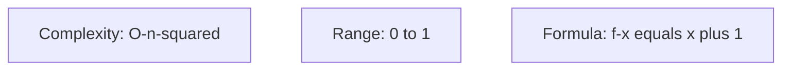

**Rules**:
1. Spell out superscripts: `²` → `squared`, `³` → `cubed`
2. Replace brackets: `[0,1]` → `0 to 1`
3. Replace math symbols: `=` → `equals`, `+` → `plus`

---

## Error 6: Line Breaks and Whitespace

### ❌ WRONG

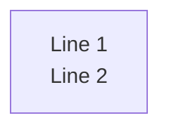

**Issue**: Improper line break handling

### ✅ CORRECT


**Rules**:
1. Use `<br/>` for line breaks (NOT `\n` or plain newlines)
2. Ensure proper indentation (4 spaces typically)
3. Keep consistent spacing

---

## Error 7: Quote Handling

### ❌ WRONG

```mermaid
graph TD
    A[He said "Hello"]
    B[It's working]
```

**Issue**: Unescaped quotes break parsing

### ✅ CORRECT

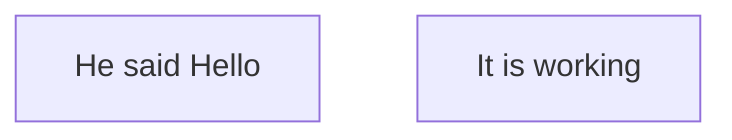

**Rules**:
1. Avoid nested quotes
2. Use simple wording instead of quotations
3. Wrap entire label in `["..."]` if it contains special characters

---

## Error 8: Emoji and Unicode

### ❌ RISKY

```mermaid
graph TD
    A["⏱️ 2 weeks"]
    B["📊 O(V²)"]
```

**Issue**: Emoji can render inconsistently across platforms

### ✅ SAFER

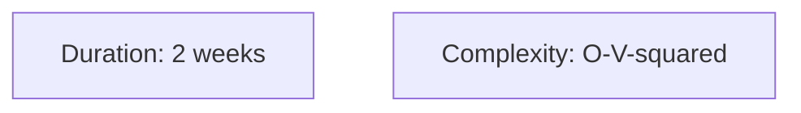

**Rules**:
1. Emoji generally work but test rendering
2. Avoid mixing emoji with complex syntax
3. Use text alternatives for critical diagrams

---

## Best Practices Summary

### Safe Label Patterns

```mermaid
graph TD
    %% SAFE: Simple text
    A[Module Detection]

    %% SAFE: Quoted with line break
    B["Module Detection<br/>3 weeks"]

    %% SAFE: Quoted with simple punctuation
    C["Status: Complete"]

    %% SAFE: Hyphenated complexity
    D["Complexity: O-E-log-V"]

    %% SAFE: Emoji (usually works)
    E["📊 Statistics"]
```

### Unsafe Label Patterns (AVOID)

```mermaid
graph TD
    %% UNSAFE: Parentheses
    X["O(V + E)"]

    %% UNSAFE: Multiple commas
    Y["Items: 10, 20, 30"]

    %% UNSAFE: Nested quotes
    Z[He said "Hello World"]
```

---

## Testing Your Diagrams

### Method 1: Mermaid Live Editor
1. Go to https://mermaid.live/
2. Paste your diagram code
3. Check for errors in real-time
4. Export as SVG/PNG to verify rendering

### Method 2: GitHub Preview
1. Create a temporary `.md` file in your repo
2. Commit and push
3. View on GitHub (has native Mermaid support)
4. Check rendering matches expectations

### Method 3: VS Code Extension
1. Install "Mermaid Preview" extension
2. Open `.md` file with Mermaid code blocks
3. Use preview pane to test rendering
4. Iterate until error-free

---

## Quick Reference: Safe Replacements

| ❌ Avoid | ✅ Use Instead | Example |
|---------|---------------|---------|
| `(` `)` | `-` or words | `O(V)` → `O-V` |
| `²` `³` | `squared` `cubed` | `V²` → `V-squared` |
| `,` in lists | `/` or space | `10, 20, 30` → `10 / 20 / 30` |
| `+` in math | `plus` or `-` | `V + E` → `V-plus-E` |
| `[` `]` | `from X to Y` | `[0, 1]` → `0 to 1` |
| `"` inside label | Remove or rephrase | `"Hello"` → `Hello` |
| Plain newline | `<br/>` | Line 1\nLine 2 → `Line 1<br/>Line 2` |

---

## Common Diagram Types: Gotchas

### Quadrant Charts
- **Most restrictive** syntax
- No parentheses anywhere
- No commas in labels
- Keep data point names simple

### Flowcharts/Graphs
- Quote complex labels: `["..."]`
- Avoid parentheses in nodes
- Use `<br/>` for multi-line

### Sequence Diagrams
- Participant names should be simple
- Use `Note over` for complex text
- Avoid special chars in messages

### Gantt Charts
- Date formats are strict: `YYYY-MM-DD`
- Section names: avoid special chars
- Task durations: use `Xw` `Xd` format

### Mindmaps
- Keep node text simple
- Avoid deep nesting (max 4-5 levels)
- No special chars in node names

---

## Debugging Workflow

When you encounter a Mermaid error:

1. **Check Line Number**: Error message points to line
2. **Identify Diagram Type**: Different types have different rules
3. **Scan for Special Characters**: `()`, `,`, `[]`, `"`, `+`
4. **Test Incrementally**: Comment out sections to isolate error
5. **Simplify**: Remove fancy notation, test, then re-add carefully
6. **Test in Live Editor**: https://mermaid.live/ shows errors clearly

---

## Real-World Example: Before and After

### Before (Multiple Errors)

```mermaid
quadrantChart
    title Feature Priority: Impact vs. Effort
    quadrant-1 High Impact, High Effort (Strategic)
    quadrant-2 High Impact, Low Effort (Quick Wins)

    Feature 6 (Tech Debt): [0.3, 0.95]
    Feature 11 (Centrality): [0.25, 0.9]
```

**Errors**:
- Commas in quadrant labels
- Parentheses in quadrant labels
- Parentheses in data point names

### After (Fixed)

```mermaid
quadrantChart
    title Feature Priority Impact vs Effort
    quadrant-1 High Impact High Effort Strategic
    quadrant-2 High Impact Low Effort Quick Wins

    F6 Tech Debt: [0.3, 0.95]
    F11 Centrality: [0.25, 0.9]
```

**Changes**:
- Removed commas from quadrant labels
- Removed parentheses from quadrant labels
- Simplified data point names (Feature 6 → F6)
- Removed parentheses from data point names

---

## Version Compatibility Notes

- **GitHub**: Mermaid v9.x+ (supports most features)
- **Mermaid Live**: Latest version (best compatibility)
- **VS Code**: Depends on extension version
- **GitLab**: May have different rendering quirks

**Recommendation**: Test in multiple environments for production docs.

---

## Additional Resources

- **Official Docs**: https://mermaid.js.org/
- **Live Editor**: https://mermaid.live/
- **Syntax Reference**: https://mermaid.js.org/intro/syntax-reference.html
- **GitHub Discussions**: https://github.com/mermaid-js/mermaid/discussions

---

## Changelog

- **2026-02-01**: Initial version based on real production errors
  - Documented quadrant chart parentheses issue
  - Documented flowchart node label parentheses issue
  - Added safe replacement patterns
  - Added debugging workflow

---

**Key Takeaway**: When in doubt, **keep it simple**. Mermaid favors clean, straightforward syntax over fancy notation.
