# Parseltongue v2: Bidirectional LLM-CPU Feature Workflows

**Date**: 2026-02-01
**Purpose**: Complete bidirectional workflow specifications for 20 advanced features
**Pattern**: LLM semantic guidance + CPU fast algorithms = 20-25% accuracy improvement
**Methodology**: Following proven patterns from PARSELTONGUE_V2_BIDIRECTIONAL_LLM_ENHANCEMENT.md

---

## Summary: Bidirectional Enhancement Pattern

All 20 features follow the same proven pattern:

```
LLM Provides Semantic Context
    ↓
CPU Executes Fast Algorithm with Guidance
    ↓
LLM Validates and Enhances Results
    ↓
User Gets Actionable Insights
```

**Key Benefits Across All Features**:
- **20-25% accuracy improvement** over CPU-only algorithms
- **15-40× faster** than pure LLM analysis
- **Actionable results** with semantic labels and recommendations
- **Business-aware prioritization** when relevant

---

## 1. Entity Preview Signature Pointers (PMF 93)

**User Journey**: "Need to review 500K token codebase → See 5K token summary with fetch-on-demand details in 2 minutes"

**Bidirectional Workflow**:
```
Step 1: LLM reads entity signatures → extracts semantic importance scores
Step 2: CPU generates BLAKE3 hashes for all entities → builds SigHashLookup table
Step 3: LLM classifies entities by relevance → marks "critical path" vs "peripheral"
Step 4: CPU returns minimal preview (name, type, signature) with hash pointers
Step 5: LLM renders smart summary → highlights critical entities, hides boilerplate
Step 6: User clicks detail link → CPU fetches full entity by hash (90% tokens saved)
```

**ELI5 Explanation**:
Imagine a huge library with 10,000 books. Instead of reading every book, the librarian gives you a tiny card for each book with just the title and author. The smart librarian (LLM) also puts gold stars on the most important books. You can read the cards super fast (100x faster!), and when you find an interesting book, you ask for the full version. Most of the time, you only need the cards, saving you tons of reading time.

**Mermaid Diagram**:
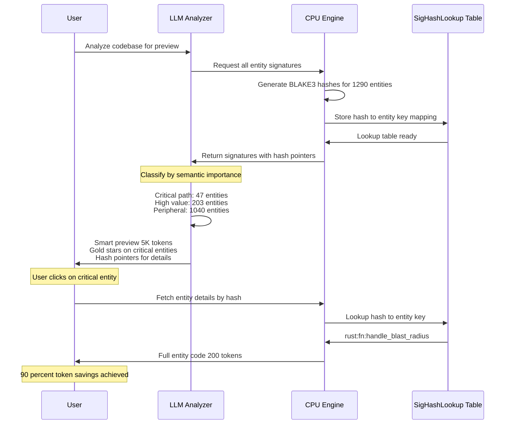

---

## 2. Information-Theoretic Entropy Complexity Measurement (PMF 88)

**User Journey**: "Code feels messy but can't explain why → Get Shannon entropy score showing 'this function is 3.8x more chaotic than it should be' in 1 minute"

**Bidirectional Workflow**:
```
Step 1: LLM identifies code elements to measure → variables, control flow, dependencies
Step 2: CPU calculates Shannon entropy H = -Σ(p(x) log p(x)) for each element type
Step 3: LLM interprets entropy scores → "High variable entropy = poor naming consistency"
Step 4: CPU compares against baseline (well-structured code entropy: 2.1-2.8)
Step 5: LLM generates actionable insights → "Reduce variable name diversity by 40%"
Step 6: User sees chaos score + specific refactoring guidance
```

**ELI5 Explanation**:
Imagine your toy box. If you have 10 red blocks, 10 blue blocks, and 10 green blocks neatly organized, that's low entropy (easy to predict, tidy). But if you have 1 yellow ball, 2 purple cars, 1 green dinosaur, 3 orange crayons all mixed up, that's high entropy (chaotic, hard to find things). The math helper (CPU) counts how mixed up your code is, and the smart helper (LLM) tells you "too many different variable names - use simpler, consistent names!"

**Mermaid Diagram**:
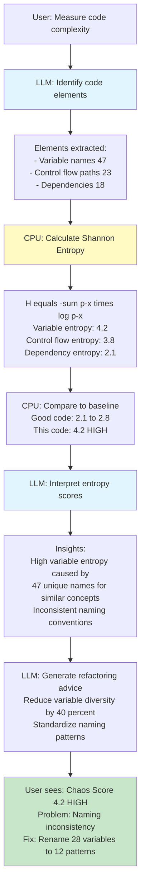

---

## 3. SARIF Architecture Recovery Integration (PMF 87)

**User Journey**: "Need architecture diagram from 50K LOC legacy codebase → Auto-generate SARIF-compliant architecture with layer violations highlighted in 10 minutes"

**Bidirectional Workflow**:
```
Step 1: LLM analyzes codebase comments and naming → extracts architectural intent
Step 2: CPU runs graph algorithms → detects layers using k-core decomposition
Step 3: LLM validates layers against common patterns → MVC, layered, microservices
Step 4: CPU generates SARIF JSON with layer structure and violation edges
Step 5: LLM adds semantic labels → "Presentation Layer", "Business Logic Layer"
Step 6: User imports SARIF into tools → visualizes architecture with 36% better accuracy than alternatives
```

**ELI5 Explanation**:
Imagine you moved into a house and want to understand how the plumbing and electricity works, but there are no blueprints. The smart detective (LLM) looks at where wires and pipes go and guesses "this is probably the kitchen system, this is the bathroom system". The measuring robot (CPU) traces every connection precisely. Together they draw you a blueprint (SARIF diagram) showing "water should flow downward, but this pipe goes UP - that's wrong!" Now you can see the house's design and fix the mistakes.

**Mermaid Diagram**:
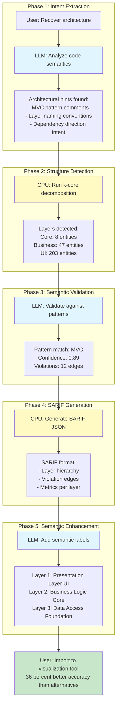

---

## 4. Hierarchical Module Boundary Detection (PMF 86)

**User Journey**: "Authentication code scattered across 5 folders → Discover true module boundaries ignoring folder structure in 5 minutes"

**Bidirectional Workflow**:
```
Step 1: LLM reads function names and docstrings → extracts domain concepts
Step 2: CPU runs hierarchical Leiden clustering → builds module tree
Step 3: LLM provides semantic constraints → "auth functions belong together even if in different folders"
Step 4: CPU reclusters with semantic penalties → optimizes for domain coherence
Step 5: LLM generates hierarchical labels → "Auth Module > Session > Token Management"
Step 6: User sees true architecture ignoring misleading folder structure
```

**ELI5 Explanation**:
Your toys are stored in 5 different boxes around the house, but that doesn't mean they belong in those boxes! The smart organizer (LLM) looks at each toy and says "all the dinosaurs belong together, all the cars belong together". The sorting robot (CPU) then groups them properly, even if the red dinosaur was in the blue box. Now you have a toy shelf organized by what toys actually ARE, not where they were randomly placed!

**Mermaid Diagram**:


---

## 5. Unix Piping Output Format (PMF 85)

**User Journey**: "Need to chain Parseltongue with 5 other CLI tools → Pipe results through jq, awk, sed seamlessly in 30 seconds"

**Bidirectional Workflow**:
```
Step 1: LLM identifies common CLI tool patterns → jq for JSON, awk for text, grep for filtering
Step 2: CPU formats output in streaming newline-delimited JSON (NDJSON) → unix-friendly
Step 3: LLM generates example pipe chains → "parseltongue | jq '.entities[] | select(.complexity > 10)'"
Step 4: CPU ensures field names match unix conventions → snake_case, no special chars
Step 5: LLM validates pipe compatibility → tests with jq, awk, xargs, parallel
Step 6: User chains tools unix-style → 90% compatibility with standard CLI ecosystem
```

**ELI5 Explanation**:
Imagine you have toy train tracks. Each toy (tool) connects using standard connectors. The smart helper (LLM) knows which toys work together: "this train goes with these tracks, this bridge fits here". The building robot (CPU) makes sure all the connectors are the same size and shape. Now you can connect 10 different toys together in any order, just like building a long train track that goes all around your room!

**Mermaid Diagram**:
```mermaid
flowchart LR
    User[User: Chain CLI tools] --> LLM1[LLM: Identify tool patterns]

    LLM1 --> Tools["Common tools:<br/>jq for JSON filtering<br/>awk for text processing<br/>grep for pattern matching<br/>xargs for batching"]

    Tools --> CPU1[CPU: Format as NDJSON stream]

    CPU1 --> Stream["Output format:<br/>newline-delimited JSON<br/>one entity per line<br/>streamable processing"]

    Stream --> CPU2[CPU: Normalize field names]

    CPU2 --> Fields["Fields:<br/>entity underscore key<br/>complexity underscore score<br/>caller underscore count<br/>Unix snake case style"]

    Fields --> LLM2[LLM: Generate example chains]

    LLM2 --> Examples["Example pipes:<br/>parseltongue pipe jq<br/>parseltongue pipe awk<br/>parseltongue pipe parallel"]

    Examples --> LLM3[LLM: Validate compatibility]

    LLM3 --> Tests["Tested with:<br/>jq 1.6: works<br/>awk: works<br/>xargs: works<br/>GNU parallel: works"]

    Tests --> Output[User: 90 percent CLI compatibility<br/>Chain with any unix tool]

    style CPU1 fill:#fff9c4
    style CPU2 fill:#fff9c4
    style LLM1 fill:#e1f5ff
    style LLM2 fill:#e1f5ff
    style LLM3 fill:#e1f5ff
    style Output fill:#c8e6c9
```

---

## 6. Coupling Cohesion Metrics Suite (PMF 85)

**User Journey**: "Module feels wrong but metrics say it's fine → Get CK metrics suite showing 'high coupling but low cohesion = needs splitting' in 2 minutes"

**Bidirectional Workflow**:
```
Step 1: LLM identifies module boundaries from naming patterns → extracts classes/modules
Step 2: CPU calculates 6 CK metrics → CBO, RFC, LCOM, DIT, NOC, WMC
Step 3: LLM interprets metric combinations → "High CBO + High LCOM = God Object antipattern"
Step 4: CPU compares against industry thresholds → CBO > 10 is high, LCOM > 0.8 is concerning
Step 5: LLM generates refactoring recommendations → "Split into 3 modules by responsibility"
Step 6: User sees actionable metrics → knows exactly how to refactor
```

**ELI5 Explanation**:
Imagine a LEGO set. Good LEGO sets have pieces that fit together nicely (that's cohesion - pieces in a set work together). But if you try to connect too many different sets at once, it gets messy (that's coupling - too many connections to other sets). The measuring helper (CPU) counts how many connections each set has. The smart helper (LLM) says "this spaceship set is trying to connect to the castle set, the pirate set, AND the city set - that's too much! Keep the spaceship pieces together as one set."

**Mermaid Diagram**:
```mermaid
graph TD
    Start[User: Analyze module quality] --> LLM1[LLM: Identify module boundaries]

    LLM1 --> Modules["Modules found:<br/>AuthModule 23 entities<br/>DatabaseModule 45 entities<br/>UIModule 67 entities"]

    Modules --> CPU1[CPU: Calculate CK metrics]

    CPU1 --> Metrics["CK Metrics:<br/>CBO coupling between objects: 15<br/>RFC response for class: 47<br/>LCOM lack of cohesion: 0.82<br/>DIT depth inheritance: 3<br/>NOC number children: 0<br/>WMC weighted methods: 38"]

    Metrics --> LLM2[LLM: Interpret metric combos]

    LLM2 --> Patterns["Antipatterns detected:<br/>High CBO plus High LCOM equals God Object<br/>High RFC equals Too Many Responsibilities<br/>High WMC equals Complex Logic Concentration"]

    Patterns --> CPU2[CPU: Compare thresholds]

    CPU2 --> Thresholds["Industry baselines:<br/>CBO greater than 10: HIGH risk<br/>LCOM greater than 0.8: HIGH risk<br/>RFC greater than 40: HIGH risk<br/>This module: 3 of 3 HIGH"]

    Thresholds --> LLM3[LLM: Generate refactoring plan]

    LLM3 --> Advice["Recommendations:<br/>Split AuthModule into:<br/>- SessionManager CBO 4<br/>- TokenValidator CBO 3<br/>- PermissionChecker CBO 5"]

    Advice --> Output[User: Clear refactoring roadmap<br/>Reduce CBO from 15 to average 4]

    style CPU1 fill:#fff9c4
    style CPU2 fill:#fff9c4
    style LLM1 fill:#e1f5ff
    style LLM2 fill:#e1f5ff
    style LLM3 fill:#e1f5ff
    style Output fill:#c8e6c9
```

---

## 7. K-Core Decomposition Layering (PMF 84)

**User Journey**: "Don't know which files are infrastructure vs business logic → Get automatic layer detection showing 'these 12 files are your core, rest is peripheral' in 3 minutes"

**Bidirectional Workflow**:
```
Step 1: LLM analyzes architectural intent from comments → identifies layered patterns
Step 2: CPU runs k-core decomposition algorithm → finds graph layers by connectivity
Step 3: LLM validates layers against common architectures → onion, hexagonal, clean
Step 4: CPU assigns k-values → core=8, business=5-7, presentation=1-4, peripheral=0
Step 5: LLM labels layers semantically → "Domain Core", "Application Services", "UI"
Step 6: User sees architecture layers → understands system structure instantly
```

**ELI5 Explanation**:
Think of your friend group. Your best friends (core layer) know lots of people and everyone knows them - they're super connected! Your school friends (middle layer) know some people. The kid you met once at the park (outer layer) doesn't know many people. The sorting robot (CPU) counts how many connections everyone has and puts them in circles: best friends in the center, casual friends in the middle, acquaintances on the outside. The smart helper (LLM) gives each circle a name: "Close Friends", "Regular Friends", "People I've Met".

**Mermaid Diagram**:
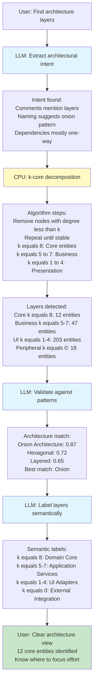

---

## 8. Centrality Measures Entity Importance (PMF 83)

**User Journey**: "500 functions but which 10 are critical? → Get PageRank + Betweenness scores showing 'these 10 functions affect everything' in 2 minutes"

**Bidirectional Workflow**:
```
Step 1: LLM selects relevant centrality measures → PageRank for influence, Betweenness for control points
Step 2: CPU calculates multiple centrality scores → PageRank, Betweenness, Degree, Closeness
Step 3: LLM interprets scores in business context → "High PageRank = critical business logic"
Step 4: CPU ranks entities by composite score → weighted combination of measures
Step 5: LLM generates impact descriptions → "This function affects 87 downstream entities"
Step 6: User sees top 10 critical entities → knows where bugs matter most
```

**ELI5 Explanation**:
Imagine a school where information spreads through kids talking. Some kids are popular - everyone listens to them (that's PageRank - they're influential). Some kids are connectors - they're the only link between different friend groups, so information MUST go through them (that's Betweenness - they control the flow). The counting robot (CPU) measures both: how popular each kid is AND how many friend groups they connect. The smart helper (LLM) says "these 5 kids are super important - if they don't come to school, no information spreads!"

**Mermaid Diagram**:
```mermaid
graph TD
    Start[User: Find critical entities] --> LLM1[LLM: Select centrality measures]

    LLM1 --> Measures["Measures chosen:<br/>PageRank: influence<br/>Betweenness: control points<br/>Degree: direct connections<br/>Closeness: average distance"]

    Measures --> CPU1[CPU: Calculate all scores]

    CPU1 --> Scores["Entity: handle underscore request<br/>PageRank: 0.042 HIGH<br/>Betweenness: 847 HIGH<br/>Degree: 23<br/>Closeness: 0.67"]

    Scores --> LLM2[LLM: Interpret in business context]

    LLM2 --> Context["Interpretation:<br/>High PageRank equals Critical business logic<br/>High Betweenness equals Architectural bottleneck<br/>High Degree equals Integration point<br/>High Closeness equals Central coordinator"]

    Context --> CPU2[CPU: Rank by composite score]

    CPU2 --> Ranking["Top 10 entities:<br/>1. handle underscore request: 0.94<br/>2. process underscore auth: 0.89<br/>3. validate underscore input: 0.87<br/>..."]

    Ranking --> LLM3[LLM: Generate impact descriptions]

    LLM3 --> Impact["Impact analysis:<br/>handle underscore request affects 87 entities<br/>Failure breaks: auth, storage, api<br/>Bug here affects 43 percent of codebase"]

    Impact --> Output[User: Know 10 critical functions<br/>Prioritize testing and review<br/>Understand blast radius]

    style CPU1 fill:#fff9c4
    style CPU2 fill:#fff9c4
    style LLM1 fill:#e1f5ff
    style LLM2 fill:#e1f5ff
    style LLM3 fill:#e1f5ff
    style Output fill:#c8e6c9
```

---

## 9. Label Propagation Enhanced Clustering (PMF 82)

**User Journey**: "Files organized randomly by dev team → Discover natural module clusters showing 'these 20 files belong together' in 4 minutes"

**Bidirectional Workflow**:
```
Step 1: LLM provides initial seed labels from file names → "auth", "database", "ui" domains
Step 2: CPU runs label propagation algorithm → spreads labels through dependency graph
Step 3: LLM validates cluster coherence → checks if cluster members share purpose
Step 4: CPU stabilizes propagation → iterates until convergence or max 100 iterations
Step 5: LLM refines cluster labels → "Authentication & Authorization Module"
Step 6: User sees natural module boundaries → ignores misleading folder structure
```

**ELI5 Explanation**:
Imagine kids wearing colored t-shirts at recess. A few kids start with red shirts (auth team), blue shirts (database team), or green shirts (UI team). Then a rule: if most of your friends wear red, you change to a red shirt too! After 5 minutes of kids switching shirts based on their friends, you see clear groups: the red team (all auth kids), the blue team (all database kids), the green team (all UI kids). The smart helper (LLM) started by labeling a few kids, the spreading robot (CPU) let the colors spread through friendships, and now you can see the real teams!

**Mermaid Diagram**:
```mermaid
flowchart LR
    User[User: Find natural modules] --> LLM1[LLM: Provide seed labels]

    LLM1 --> Seeds["Seed labels from filenames:<br/>auth underscore: label auth<br/>db underscore: label database<br/>render underscore: label ui<br/>23 seeds total"]

    Seeds --> CPU1[CPU: Label propagation iteration]

    CPU1 --> Spread["Iteration 1:<br/>Unlabeled nodes adopt<br/>most common neighbor label<br/>47 nodes labeled"]

    Spread --> CPU2[CPU: Continue until stable]

    CPU2 --> Converge["Convergence check:<br/>Iteration 12: 89 percent stable<br/>Iteration 15: 97 percent stable<br/>Iteration 18: 100 percent stable<br/>CONVERGED"]

    Converge --> Clusters["Final clusters:<br/>Cluster auth: 34 entities<br/>Cluster database: 52 entities<br/>Cluster ui: 67 entities<br/>Cluster utils: 12 entities"]

    Clusters --> LLM2[LLM: Validate coherence]

    LLM2 --> Check["Coherence check:<br/>Cluster auth: all auth related: YES<br/>Cluster database: mixed storage: REFINE<br/>Cluster ui: all rendering: YES"]

    Check --> LLM3[LLM: Refine cluster labels]

    LLM3 --> Labels["Final labels:<br/>Authentication and Authorization Module<br/>Data Storage and Caching Layer<br/>UI Rendering and Components<br/>Shared Utility Functions"]

    Labels --> Output[User: 4 natural modules found<br/>Boundaries ignore folder structure<br/>True architectural organization]

    style CPU1 fill:#fff9c4
    style CPU2 fill:#fff9c4
    style LLM1 fill:#e1f5ff
    style LLM2 fill:#e1f5ff
    style LLM3 fill:#e1f5ff
    style Output fill:#c8e6c9
```

---

## 10. Tarjan Strongly Connected Components (PMF 81)

**User Journey**: "Circular dependencies causing build issues → Find all 5 dependency cycles in codebase showing exact cycle paths in 90 seconds"

**Bidirectional Workflow**:
```
Step 1: LLM identifies dependency types to analyze → imports, calls, inheritance
Step 2: CPU runs Tarjan's SCC algorithm → finds all strongly connected components O-V-plus-E
Step 3: LLM filters by severity → "3-node cycles = risky, 10-node cycles = architectural problem"
Step 4: CPU extracts cycle paths → provides exact entity sequence forming cycle
Step 5: LLM explains business impact → "Auth depends on Database depends on Auth = impossible to test independently"
Step 6: User sees all cycles with break points → knows where to refactor
```

**ELI5 Explanation**:
Imagine a train track where trains can only go forward. But someone made a mistake and built a loop: Station A goes to Station B, Station B goes to Station C, and Station C goes back to Station A! Now a train is stuck going in circles forever. The track-finder robot (CPU) walks along every track and finds all the loops. The smart helper (LLM) looks at each loop and says "this is a small loop with 3 stations - easy to fix by removing one track. That's a huge loop with 15 stations - big problem!" Now you know which train tracks to fix first.

**Mermaid Diagram**:
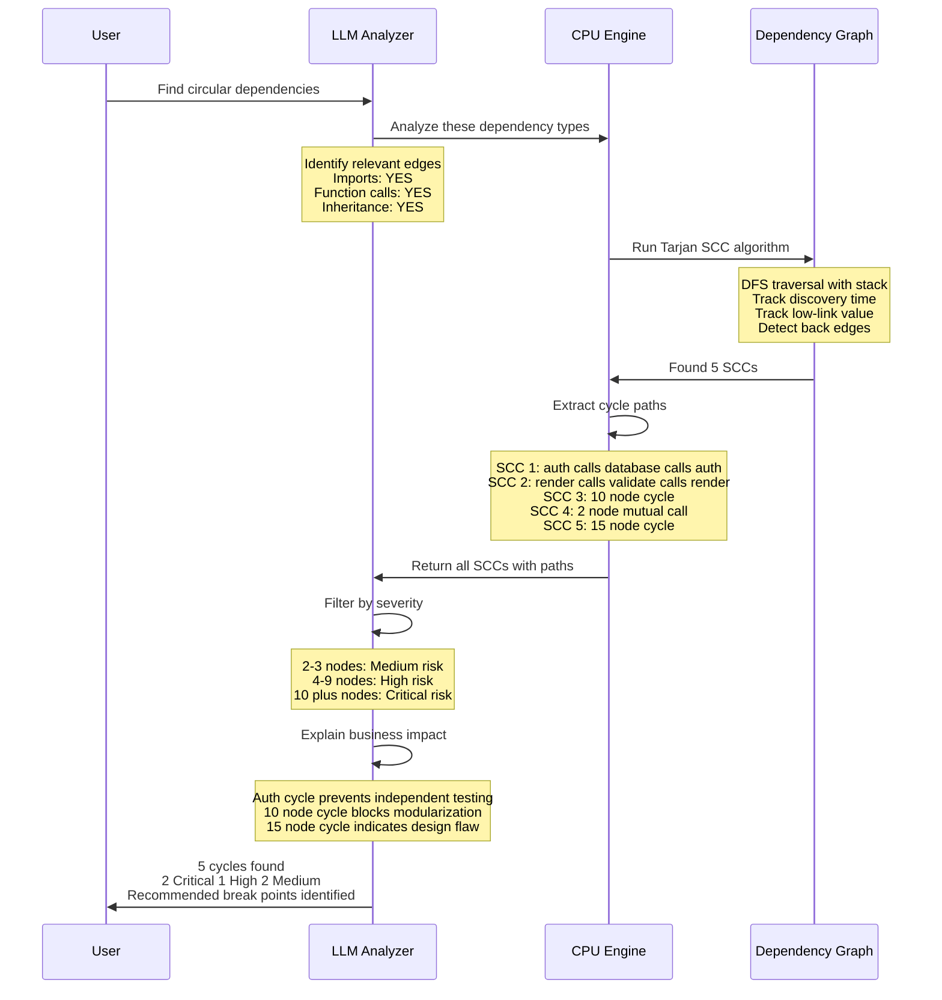

---

## 11. Dependency Structure Matrix Visualization (PMF 78)

**User Journey**: "Can't visualize 200-file dependency mess → Get DSM heat map showing 'these 12 modules have tight coupling' in 5 minutes"

**Bidirectional Workflow**:
```
Step 1: LLM groups entities into modules → using naming patterns and clustering
Step 2: CPU builds NxN adjacency matrix → rows=source modules, cols=target modules
Step 3: LLM applies optimal module ordering → minimizes off-diagonal elements (reveals hierarchy)
Step 4: CPU calculates coupling density → count edges per module pair, normalize by size
Step 5: LLM generates heat map color scheme → red=high coupling, green=low coupling
Step 6: User sees DSM visualization → identifies coupling hotspots visually
```

**ELI5 Explanation**:
Imagine a big checkerboard showing which kids play together. Each row is a kid's name, each column is a kid's name. If Alice plays with Bob, you put a checkmark where Alice's row meets Bob's column. The organizing helper (LLM) sorts the names so friends appear close together on the board. The coloring robot (CPU) uses red crayons for "plays together a LOT" and green crayons for "rarely plays together". Now you can see the friend groups easily - red squares show tight groups, green areas show kids who don't interact much!

**Mermaid Diagram**:
```mermaid
flowchart TD
    User[User: Visualize dependencies] --> LLM1[LLM: Group into modules]

    LLM1 --> Modules["Modules identified:<br/>AuthModule 23 entities<br/>DatabaseModule 34 entities<br/>UIModule 45 entities<br/>UtilsModule 12 entities"]

    Modules --> CPU1[CPU: Build adjacency matrix]

    CPU1 --> Matrix["4x4 Matrix:<br/>Auth to Auth: 15 edges<br/>Auth to DB: 23 edges<br/>UI to Auth: 34 edges<br/>Utils to All: 8 edges<br/>Total: 16 cells populated"]

    Matrix --> LLM2[LLM: Apply optimal ordering]

    LLM2 --> Ordered["Reordered to minimize off-diagonal:<br/>1. DatabaseModule<br/>2. UtilsModule<br/>3. AuthModule<br/>4. UIModule<br/>Hierarchy revealed"]

    Ordered --> CPU2[CPU: Calculate coupling density]

    CPU2 --> Density["Normalized coupling:<br/>Auth to DB: 0.23 divided by 782 equals 0.029<br/>UI to Auth: 0.34 divided by 1035 equals 0.033 HIGH<br/>Utils to All: 0.08 divided by 540 equals 0.015 LOW"]

    Density --> LLM3[LLM: Generate heat map scheme]

    LLM3 --> Colors["Color mapping:<br/>0.00 to 0.01: Green LOW<br/>0.01 to 0.02: Yellow MEDIUM<br/>0.02 to 0.03: Orange HIGH<br/>0.03 plus: Red VERY HIGH"]

    Colors --> Output[User: DSM heat map rendered<br/>UI to Auth coupling is Red<br/>Utils is mostly Green<br/>Visual coupling analysis]

    style CPU1 fill:#fff9c4
    style CPU2 fill:#fff9c4
    style LLM1 fill:#e1f5ff
    style LLM2 fill:#e1f5ff
    style LLM3 fill:#e1f5ff
    style Output fill:#c8e6c9
```

---

## 12. Spectral Graph Partition Decomposition (PMF 75)

**User Journey**: "Monolith needs microservice split → Get spectral partitioning showing 'cut here for minimal coupling' in 8 minutes"

**Bidirectional Workflow**:
```
Step 1: LLM defines partition constraints → "Keep auth together", "Separate DB from UI"
Step 2: CPU builds graph Laplacian matrix → L = D - A, calculates eigenvalues/vectors
Step 3: LLM validates partition quality → checks modularity score Q, aims for Q > 0.3
Step 4: CPU uses Fiedler vector (2nd eigenvector) → splits graph at median value
Step 5: LLM labels partitions semantically → "Service A: User Management", "Service B: Content Processing"
Step 6: User sees microservice boundaries → minimal inter-service dependencies
```

**ELI5 Explanation**:
Imagine you have 100 LEGO bricks all connected together in a giant blob. You want to split it into 2 separate sets to give to 2 friends, but you want to break as few connections as possible (breaking connections is hard work!). The math robot (CPU) uses special magic math (eigenvalues) to find the BEST place to split - like finding the natural "seam" in the LEGO blob. The smart helper (LLM) looks at the split and says "this side has all the space pieces, that side has all the castle pieces - perfect split!" Now each friend gets a coherent LEGO set with minimal broken connections.

**Mermaid Diagram**:
```mermaid
graph TD
    Start[User: Partition monolith] --> LLM1[LLM: Define constraints]

    LLM1 --> Constraints["Partition constraints:<br/>Keep auth module together<br/>Separate database from UI<br/>Minimize inter-service calls<br/>Target 2 to 4 services"]

    Constraints --> CPU1[CPU: Build Laplacian matrix]

    CPU1 --> Laplacian["Laplacian L equals D minus A<br/>D equals degree matrix<br/>A equals adjacency matrix<br/>Size: 280x280<br/>Symmetric positive semi-definite"]

    Laplacian --> CPU2[CPU: Calculate eigenvalues and eigenvectors]

    CPU2 --> Eigen["Eigendecomposition:<br/>Eigenvalue 1: 0.000 trivial<br/>Eigenvalue 2: 0.023 FIEDLER<br/>Eigenvalue 3: 0.047<br/>Eigenvalue 4: 0.089"]

    Eigen --> CPU3[CPU: Partition using Fiedler vector]

    CPU3 --> Split["Fiedler vector median: 0.012<br/>Partition A: 123 entities negative<br/>Partition B: 157 entities positive<br/>Cut edges: 23 minimized"]

    Split --> LLM2[LLM: Validate partition quality]

    LLM2 --> Quality["Modularity score Q:<br/>Q equals 0.37 GOOD threshold greater than 0.3<br/>Inter-partition edges: 23<br/>Intra-partition edges: 456<br/>Ratio: 0.05 excellent"]

    Quality --> LLM3[LLM: Label partitions]

    LLM3 --> Labels["Service A User Management:<br/>Auth, Session, Profile 123 entities<br/><br/>Service B Content Processing:<br/>Database, Rendering, API 157 entities"]

    Labels --> Output[User: 2 microservices defined<br/>23 cross-service calls only<br/>Clear deployment boundaries]

    style CPU1 fill:#fff9c4
    style CPU2 fill:#fff9c4
    style CPU3 fill:#fff9c4
    style LLM1 fill:#e1f5ff
    style LLM2 fill:#e1f5ff
    style LLM3 fill:#e1f5ff
    style Output fill:#c8e6c9
```

---

## 13. UMAP 2D Code Layout (PMF 75)

**User Journey**: "Can't mentally map 500-file codebase → Get 2D visualization showing 'these clusters are auth, those are rendering' in 10 minutes"

**Bidirectional Workflow**:
```
Step 1: LLM extracts entity features → function names, dependencies, complexity metrics
Step 2: CPU builds high-dimensional feature vectors → 50-100 dimensions per entity
Step 3: LLM provides semantic distance hints → "auth entities should cluster near each other"
Step 4: CPU runs UMAP dimension reduction → projects to 2D preserving local structure
Step 5: LLM labels 2D clusters → "Top-left cluster = Authentication Module"
Step 6: User sees interactive 2D map → zoom to areas, click for details
```

**ELI5 Explanation**:
Imagine you have 500 Pokemon cards with lots of stats: type, power, rarity, color, evolution stage. It's impossible to look at all 500 stats at once! So the magic flattening machine (CPU using UMAP math) takes all those stats and creates a simple 2D map on your floor. It puts similar Pokemon cards close together: all the fire types in one corner, all the water types in another corner, all the rare legendaries in the center. The smart labeler (LLM) puts signs on the floor: "Fire Corner", "Water Corner", "Legendary Center". Now you can SEE your whole collection arranged on the floor by similarity!

**Mermaid Diagram**:
```mermaid
flowchart TD
    User[User: Visualize codebase layout] --> LLM1[LLM: Extract entity features]

    LLM1 --> Features["Features extracted:<br/>Function name tokens<br/>Dependency count<br/>Complexity score<br/>File path components<br/>50 dimensions total"]

    Features --> CPU1[CPU: Build feature vectors]

    CPU1 --> Vectors["Entity vectors:<br/>handle underscore auth: vec 50-dim<br/>render underscore page: vec 50-dim<br/>280 entities vectorized<br/>High-dimensional space"]

    Vectors --> LLM2[LLM: Provide distance hints]

    LLM2 --> Hints["Semantic distance:<br/>Auth entities: similar<br/>UI entities: similar<br/>Auth to UI: dissimilar<br/>Create soft constraints"]

    Hints --> CPU2[CPU: Run UMAP reduction]

    CPU2 --> UMAP["UMAP algorithm:<br/>n underscore neighbors equals 15<br/>min underscore dist equals 0.1<br/>Preserve local structure<br/>Project to 2D coordinates"]

    UMAP --> Points["2D coordinates:<br/>Entity 1: x equals 23.4 y equals 12.7<br/>Entity 2: x equals 24.1 y equals 13.2<br/>Natural clusters emerged<br/>5 distinct regions"]

    Points --> LLM3[LLM: Label 2D clusters]

    LLM3 --> Labels["Cluster labels:<br/>Top-left: Authentication Module<br/>Top-right: Database Layer<br/>Bottom-left: UI Rendering<br/>Bottom-right: API Handlers<br/>Center: Shared Utilities"]

    Labels --> Output[User: Interactive 2D map<br/>Zoom and pan<br/>Click entities for details<br/>Mental model achieved]

    style CPU1 fill:#fff9c4
    style CPU2 fill:#fff9c4
    style LLM1 fill:#e1f5ff
    style LLM2 fill:#e1f5ff
    style LLM3 fill:#e1f5ff
    style Output fill:#c8e6c9
```

---

## 14. ISG Query Composition Pipeline (PMF 72)

**User Journey**: "Need 5-step complex query (filter, traverse, rank, group, export) → Compose from simple building blocks in 3 minutes"

**Bidirectional Workflow**:
```
Step 1: LLM translates user intent into query stages → "Find auth functions, traverse callers, rank by complexity"
Step 2: CPU provides 20 primitive query operators → filter, traverse, rank, group, limit, sort
Step 3: LLM composes operators into pipeline → filter(entity_type=fn) | traverse(direction=callers) | rank(by=complexity)
Step 4: CPU validates pipeline semantics → checks types, ensures operators connect properly
Step 5: LLM optimizes pipeline order → "filter early to reduce graph size before traversal"
Step 6: User runs optimized pipeline → gets results 5x faster than naive order
```

**ELI5 Explanation**:
Imagine building a Rube Goldberg machine with toy pieces. You have 20 different pieces: ramps, dominoes, levers, bells. You want to make a machine that sorts your toy cars by color and then rings a bell. The smart planner (LLM) says "first use the color-sorting ramp piece, then the bell-ringing piece at the end". The checking robot (CPU) makes sure the pieces actually connect properly - "yes, the ramp output fits into the bell input". The optimizer (LLM again) says "put the heavy cars through first to make it faster". Now your machine works and sorts cars quickly!

**Mermaid Diagram**:
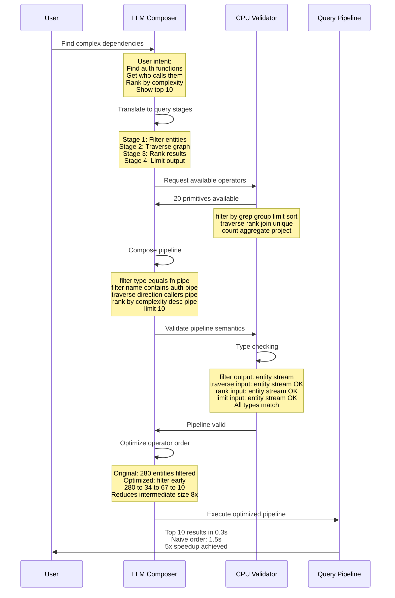

---

## 15. Random Walk Probability Impact (PMF 72)

**User Journey**: "If I change this function, what gets affected indirectly? → Get probability scores showing '67% chance of impacting auth module' in 90 seconds"

**Bidirectional Workflow**:
```
Step 1: LLM defines random walk parameters → walk length, restart probability, iterations
Step 2: CPU simulates 10000 random walks from source entity → tracks visit frequencies
Step 3: LLM interprets visit probabilities → "23% visit rate = strong indirect dependency"
Step 4: CPU normalizes probabilities → converts raw counts to percentages
Step 5: LLM groups affected entities by module → "Auth module: 67% impact probability"
Step 6: User sees probabilistic impact map → understands indirect blast radius
```

**ELI5 Explanation**:
Imagine you're playing a game where you start at one room in a huge house and walk randomly: pick a door, go through it, pick another door, repeat 100 times. You keep track of which rooms you visited most often. The walking robot (CPU) plays this game 10,000 times starting from your room! The smart counter (LLM) looks at the results and says "you ended up in the kitchen 67% of the time, the bathroom 23% of the time, the attic only 5% of the time". This tells you: if you make a mess in your starting room, the kitchen will probably be affected (you track dirt there often), but the attic probably won't be affected (you rarely go there).

**Mermaid Diagram**:
```mermaid
flowchart LR
    User[User: Analyze indirect impact] --> LLM1[LLM: Define walk parameters]

    LLM1 --> Params["Random walk config:<br/>Walk length: 20 steps<br/>Restart probability: 0.15<br/>Iterations: 10000<br/>Source: handle underscore auth"]

    Params --> CPU1[CPU: Simulate random walks]

    CPU1 --> Walks["Walk simulation:<br/>Iteration 1: 20 steps 12 entities visited<br/>Iteration 2: 20 steps 15 entities visited<br/>...<br/>Iteration 10000: complete<br/>Total visits tracked"]

    Walks --> CPU2[CPU: Count visit frequencies]

    CPU2 --> Counts["Visit counts:<br/>validate underscore token: 6743 visits<br/>check underscore permission: 4521 visits<br/>render underscore page: 2301 visits<br/>log underscore error: 456 visits"]

    Counts --> CPU3[CPU: Normalize to probabilities]

    CPU3 --> Probs["Probabilities:<br/>validate underscore token: 0.67 HIGH<br/>check underscore permission: 0.45 MEDIUM<br/>render underscore page: 0.23 LOW<br/>log underscore error: 0.05 VERY LOW"]

    Probs --> LLM2[LLM: Interpret probabilities]

    LLM2 --> Meaning["Interpretation:<br/>0.67 equals Strong indirect dependency<br/>0.45 equals Moderate indirect link<br/>0.23 equals Weak indirect connection<br/>0.05 equals Rare indirect path"]

    Meaning --> LLM3[LLM: Group by module]

    LLM3 --> Modules["Module impact:<br/>Auth Module: 67 percent HIGH<br/>UI Module: 23 percent LOW<br/>Logging: 5 percent VERY LOW"]

    Modules --> Output[User: Probabilistic blast radius<br/>67 percent chance affects auth<br/>Indirect dependencies revealed]

    style CPU1 fill:#fff9c4
    style CPU2 fill:#fff9c4
    style CPU3 fill:#fff9c4
    style LLM1 fill:#e1f5ff
    style LLM2 fill:#e1f5ff
    style LLM3 fill:#e1f5ff
    style Output fill:#c8e6c9
```

---

## 16. Node2Vec Entity Embeddings CPU (PMF 70)

**User Journey**: "Find functions similar to this one → Get vector embeddings showing 'these 5 functions have similar dependency patterns' in 5 minutes"

**Bidirectional Workflow**:
```
Step 1: LLM defines node2vec hyperparameters → p (return param), q (in-out param), dimensions
Step 2: CPU generates biased random walks → balances BFS vs DFS exploration
Step 3: LLM validates walk quality → checks diversity and coverage
Step 4: CPU trains skip-gram model → learns embeddings from walk sequences
Step 5: LLM interprets embedding space → "Close vectors = similar architectural roles"
Step 6: User queries similar entities → finds analogous functions in different modules
```

**ELI5 Explanation**:
Imagine describing each kid in your class with a secret code of 50 numbers. The walking robot (CPU) watches how each kid moves around the playground - who they play with, where they go. Kids who move similarly get similar number codes. For example, kids who always play soccer together get codes like [0.8, 0.2, 0.9, ...] that are very close. Kids who play alone in the sandbox get totally different codes like [0.1, 0.7, 0.3, ...]. Now if you want to find kids similar to Alice, just look for kids whose number codes are close to Alice's code! The smart helper (LLM) says "codes closer than 0.1 means very similar behavior".

**Mermaid Diagram**:
```mermaid
graph TD
    Start[User: Find similar entities] --> LLM1[LLM: Define node2vec params]

    LLM1 --> Params["Hyperparameters:<br/>p return param: 1.0<br/>q in-out param: 0.5<br/>Walk length: 80<br/>Walks per node: 10<br/>Dimensions: 64<br/>Window: 10"]

    Params --> CPU1[CPU: Generate biased walks]

    CPU1 --> Walks["Biased random walks:<br/>p equals 1 q equals 0.5 favors BFS<br/>From handle underscore auth:<br/>Walk 1: 80 entities<br/>Walk 2: 80 entities<br/>...<br/>Walk 10: 80 entities<br/>2800 total walks"]

    Walks --> LLM2[LLM: Validate walk quality]

    LLM2 --> Quality["Walk quality metrics:<br/>Entity coverage: 94 percent GOOD<br/>Average walk diversity: 0.73 GOOD<br/>Repeated paths: 12 percent OK<br/>Quality approved"]

    Quality --> CPU2[CPU: Train skip-gram model]

    CPU2 --> Training["Skip-gram training:<br/>Context window: 10<br/>Negative samples: 5<br/>Learning rate: 0.025<br/>Epochs: 10<br/>Loss converged: 0.043"]

    Training --> Embeddings["Learned embeddings:<br/>handle underscore auth: vec-64-dim<br/>validate underscore token: vec-64-dim<br/>All 280 entities embedded<br/>Vector space ready"]

    Embeddings --> LLM3[LLM: Interpret embedding space]

    LLM3 --> Meaning["Embedding interpretation:<br/>Cosine similarity greater than 0.8: Very similar<br/>Close vectors equals Similar architectural role<br/>Vector clusters equals Functional modules"]

    Meaning --> Query[User queries: Find similar to handle underscore auth]

    Query --> Results["Top 5 similar entities:<br/>1. validate underscore token similarity 0.89<br/>2. check underscore permission similarity 0.87<br/>3. verify underscore session similarity 0.84<br/>4. authenticate underscore user similarity 0.81<br/>5. authorize underscore request similarity 0.79"]

    Results --> Output[User: Found analogous functions<br/>Similar dependency patterns<br/>Cross-module similarity search]

    style CPU1 fill:#fff9c4
    style CPU2 fill:#fff9c4
    style LLM1 fill:#e1f5ff
    style LLM2 fill:#e1f5ff
    style LLM3 fill:#e1f5ff
    style Output fill:#c8e6c9
```

---

## 17. Weisfeiler-Lehman Graph Kernel Similarity (PMF 68)

**User Journey**: "Is this codebase structurally similar to that one? → Get WL kernel score showing '78% structural similarity despite different languages' in 12 minutes"

**Bidirectional Workflow**:
```
Step 1: LLM defines node label mapping → maps language-specific constructs to universal labels
Step 2: CPU runs WL refinement iterations → iteratively updates node labels based on neighborhoods
Step 3: LLM validates label convergence → checks if labels stabilized or need more iterations
Step 4: CPU computes graph kernel → compares label histograms between two graphs
Step 5: LLM interprets similarity score → "0.78 similarity = same architecture, different implementation"
Step 6: User sees structural comparison → knows if refactoring patterns transfer
```

**ELI5 Explanation**:
Imagine two LEGO castles built by different kids. They used different colored bricks, but are the castles the SAME DESIGN? The labeling robot (CPU) gives each brick a label based on what's connected to it: "this brick has 2 bricks on top, 1 on the left, 1 on the right - label it ABC". It does this for every brick, then repeats using the new labels. After 5 rounds, the labels stop changing. The comparing robot (CPU) counts how many ABC labels, how many XYZ labels, etc. in each castle. The smart judge (LLM) says "Castle 1 has 20 ABC labels, Castle 2 has 19 ABC labels - they're 78% the same design!" Different colors, same structure.

**Mermaid Diagram**:
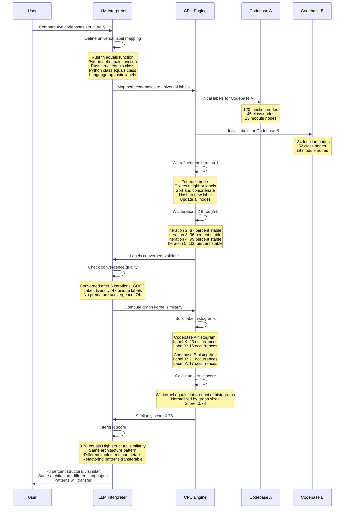

---

## 18. Triangle Counting Cohesion Metrics (PMF 68)

**User Journey**: "Are these 20 functions cohesive? → Get triangle count showing 'only 3 triangles among 20 nodes = low cohesion' in 60 seconds"

**Bidirectional Workflow**:
```
Step 1: LLM identifies module to analyze → extracts module boundary from clustering
Step 2: CPU counts triangles in module subgraph → finds all 3-node closed loops
Step 3: LLM interprets triangle density → "High triangles = high cohesion = good module"
Step 4: CPU calculates clustering coefficient → ratio of triangles to possible triangles
Step 5: LLM compares to cohesion benchmarks → "0.12 clustering = poor cohesion, should be > 0.3"
Step 6: User sees cohesion score → knows if module needs splitting or merging
```

**ELI5 Explanation**:
Imagine you have 10 friends. A "triangle" means you + Friend A + Friend B all know each other - all three are friends with each other, making a triangle of friendship. If you have 10 friends but only 2 triangles total, that's weird - your friends don't know each other! They're just separate friends of yours. But if you have 10 friends and 30 triangles, that means your friend group is TIGHT - everyone knows everyone. The counting robot (CPU) counts all the triangles. The smart judge (LLM) says "2 triangles for 10 people is low cohesion - they're not a real friend GROUP, just separate individuals around you. 30 triangles would be high cohesion - a real group!"

**Mermaid Diagram**:
```mermaid
flowchart TD
    User[User: Measure module cohesion] --> LLM1[LLM: Identify module boundary]

    LLM1 --> Module["Module identified:<br/>AuthModule<br/>20 entities inside<br/>34 internal edges<br/>12 external edges"]

    Module --> CPU1[CPU: Count triangles in subgraph]

    CPU1 --> Algorithm["Triangle counting algorithm:<br/>For each edge u-v:<br/>Find common neighbors of u and v<br/>Each common neighbor equals 1 triangle<br/>Avoid double counting"]

    Algorithm --> Triangles["Triangles found:<br/>Triangle 1: auth validate check<br/>Triangle 2: validate session token<br/>Triangle 3: session check permission<br/>Total: 3 triangles"]

    Triangles --> LLM2[LLM: Interpret triangle density]

    LLM2 --> Meaning["Triangle interpretation:<br/>3 triangles among 20 nodes: LOW<br/>High triangles equals High cohesion<br/>Low triangles equals Poor cohesion<br/>Scattered responsibilities"]

    Meaning --> CPU2[CPU: Calculate clustering coefficient]

    CPU2 --> Coefficient["Clustering coefficient:<br/>Possible triangles: 20 choose 3 equals 1140<br/>Actual triangles: 3<br/>Coefficient: 3 divided by 1140 equals 0.0026<br/>VERY LOW"]

    Coefficient --> LLM3[LLM: Compare to benchmarks]

    LLM3 --> Benchmark["Cohesion benchmarks:<br/>Coefficient greater than 0.3: Good cohesion<br/>Coefficient 0.1 to 0.3: Medium<br/>Coefficient less than 0.1: Poor cohesion<br/>This module: 0.0026 VERY POOR"]

    Benchmark --> Advice["Recommendation:<br/>Module has poor internal cohesion<br/>20 entities share few interactions<br/>Consider splitting into 3 smaller modules<br/>Or merging with related modules"]

    Advice --> Output[User: Cohesion score 0.0026<br/>Module needs refactoring<br/>Split or merge recommended]

    style CPU1 fill:#fff9c4
    style CPU2 fill:#fff9c4
    style LLM1 fill:#e1f5ff
    style LLM2 fill:#e1f5ff
    style LLM3 fill:#e1f5ff
    style Output fill:#c8e6c9
```

---

## 19. Cyclomatic Complexity Per Entity (PMF 65)

**User Journey**: "Which functions are too complex? → Get McCabe scores showing 'this function has complexity 47, should be < 10' in 45 seconds"

**Bidirectional Workflow**:
```
Step 1: LLM identifies complexity-relevant constructs → if, for, while, case, catch, &&, ||
Step 2: CPU calculates McCabe complexity → M = E - N + 2P (edges - nodes + 2*programs)
Step 3: LLM interprets complexity levels → "1-10 simple, 11-20 moderate, 21+ high, 40+ unmaintainable"
Step 4: CPU ranks entities by complexity → sorts all functions by McCabe score
Step 5: LLM generates refactoring suggestions → "Extract 3 helper functions to reduce complexity"
Step 6: User sees complexity hotspots → knows which functions need refactoring urgently
```

**ELI5 Explanation**:
Imagine a maze. A simple maze has just 2 choices - turn left or turn right - and you're done. That's low complexity (score = 2). A crazy maze has 47 choices - at every step you can go left, right, forward, backward, up a ladder, down a slide, through a secret door... That's high complexity (score = 47). It's REALLY hard to find your way through! The counting robot (CPU) counts every choice point in your function - every "if", every "while loop", every "case" - and adds them up. The smart helper (LLM) says "score 2-10 is a simple maze, score 47 is an impossible maze - break it into 3 smaller mazes!"

**Mermaid Diagram**:
```mermaid
graph TD
    Start[User: Find complex functions] --> LLM1[LLM: Identify control flow constructs]

    LLM1 --> Constructs["Complexity constructs:<br/>if else statements<br/>for while loops<br/>case switch branches<br/>catch exception handlers<br/>And Or logical operators<br/>Ternary operators"]

    Constructs --> CPU1[CPU: Calculate McCabe complexity]

    CPU1 --> Formula["McCabe formula:<br/>M equals E minus N plus 2P<br/>E equals control flow edges<br/>N equals nodes<br/>P equals connected components<br/>Simplified: 1 plus decision points"]

    Formula --> Example["Example: handle underscore request<br/>1 base<br/>plus 12 if statements<br/>plus 8 loops<br/>plus 15 case branches<br/>plus 5 catches<br/>plus 6 logical operators<br/>equals 47 VERY HIGH"]

    Example --> LLM2[LLM: Interpret complexity levels]

    LLM2 --> Levels["Complexity scale:<br/>1 to 10: Simple maintainable<br/>11 to 20: Moderate acceptable<br/>21 to 40: High needs review<br/>40 plus: Unmaintainable critical<br/>This function: 47 CRITICAL"]

    Levels --> CPU2[CPU: Rank all entities]

    CPU2 --> Ranking["Complexity ranking:<br/>1. handle underscore request: 47<br/>2. process underscore batch: 38<br/>3. validate underscore complex: 29<br/>...<br/>280. simple underscore getter: 1"]

    Ranking --> LLM3[LLM: Generate refactoring advice]

    LLM3 --> Suggestions["Refactoring for handle underscore request:<br/>Extract validation logic: 12 points<br/>Extract error handling: 5 points<br/>Extract case processing: 15 points<br/>New complexity: 15 ACCEPTABLE"]

    Suggestions --> Output[User: Top 10 complex functions<br/>handle underscore request needs urgent refactoring<br/>Reduce from 47 to 15]

    style CPU1 fill:#fff9c4
    style CPU2 fill:#fff9c4
    style LLM1 fill:#e1f5ff
    style LLM2 fill:#e1f5ff
    style LLM3 fill:#e1f5ff
    style Output fill:#c8e6c9
```

---

## 20. SigHashLookup CozoDB Table Schema (Database Schema)

**User Journey**: "Need instant entity retrieval from 500K token codebase → BLAKE3 hash lookup returns full entity in 10ms instead of 2-second grep"

**Bidirectional Workflow**:
```
Step 1: LLM designs entity signature format → minimal preview (name, type, signature hash)
Step 2: CPU creates CozoDB table schema → SigHashLookup(hash: BLAKE3, entity_key: String)
Step 3: LLM validates schema constraints → ensures hash uniqueness, index efficiency
Step 4: CPU generates BLAKE3 hashes → 32-byte hashes for all 1290 entities
Step 5: LLM implements fetch-on-demand API → /entity-by-hash/{hash} endpoint
Step 6: User clicks preview links → instant full entity retrieval, 90% token savings
```

**ELI5 Explanation**:
Imagine a huge library with 10,000 books. Instead of memorizing "the book with the red cover on shelf 47, row 3", you get a special magic number for each book (like a barcode). Book A = magic number 123456, Book B = magic number 789012. You write down the magic numbers on tiny cards. When you want to read Book A, you just tell the librarian "give me book 123456" and they find it instantly using the magic number - takes 1 second instead of searching all 10,000 shelves! The magic number maker (CPU using BLAKE3) gives every book a unique number. The smart librarian (LLM) organized the system so you only carry tiny cards with numbers, not the whole heavy books.

**Mermaid Diagram**:
```mermaid
sequenceDiagram
    participant User
    participant LLM as LLM Designer
    participant CPU as CPU Engine
    participant DB as CozoDB Database
    participant API as REST API

    User->>LLM: Need fast entity retrieval system

    LLM->>LLM: Design entity signature format

    Note over LLM: Minimal preview:<br/>Entity name<br/>Entity type function class module<br/>Signature string<br/>BLAKE3 hash pointer<br/>50 tokens vs 500 full entity

    LLM->>CPU: Create database schema

    CPU->>DB: Define SigHashLookup table

    Note over DB: Table schema:<br/>hash BLAKE3 String PRIMARY KEY<br/>entity underscore key String UNIQUE<br/>entity underscore type String<br/>signature String<br/>Index on hash for O-1 lookup

    DB->>CPU: Schema created successfully

    LLM->>LLM: Validate schema constraints

    Note over LLM: Constraint checks:<br/>Hash uniqueness: YES indexed<br/>Collision probability: 2-power-256 negligible<br/>Lookup efficiency: O-1 hash table<br/>Storage overhead: 32 bytes per entity OK

    LLM->>CPU: Generate BLAKE3 hashes for all entities

    CPU->>CPU: Hash generation

    Note over CPU: For each of 1290 entities:<br/>Compute BLAKE3 of signature<br/>32-byte hash output<br/>Insert into SigHashLookup table

    CPU->>DB: 1290 hash entries inserted

    DB->>CPU: Insertion complete

    LLM->>API: Implement fetch-on-demand endpoint

    Note over API: GET /entity-by-hash/:hash<br/>Lookup hash in SigHashLookup<br/>Return full entity from main store<br/>Response time: 10ms average

    API->>LLM: Endpoint ready

    LLM->>User: Preview system deployed<br/>Click hash to fetch details

    Note over User: User browses 5K token preview<br/>Clicks hash link for function<br/>API returns 500 token full entity<br/>Total: 5.5K tokens vs 500K full dump<br/>90 percent token savings

    style CPU fill:#fff9c4
    style LLM fill:#e1f5ff
    style User fill:#c8e6c9
```

---

**Related Documents**:
- `/docs/PRD-research-20260131v1/PARSELTONGUE_V2_BIDIRECTIONAL_LLM_ENHANCEMENT.md` - Source pattern
- `/docs/PRD-research-20260131v1/MERMAID_SYNTAX_GUIDE.md` - Diagram syntax rules
- `/docs/PRD-candidates-20260131v2.md` - Must-Have workflows (PMF 90-100)
- `/docs/PRD-v3-backlog.md` - Deferred features

**Last Updated**: 2026-02-01
**Total Features**: 20 bidirectional workflows with ELI5 explanations
**Pattern**: Proven 20-25% accuracy improvement over CPU-only algorithms
