# Parseltongue v2.0+ Features: Explained Simply (ELI10)

**Date**: 2026-02-01
**Audience**: 10-year-olds, non-technical stakeholders, new team members
**Purpose**: Understand what each feature does WITHOUT needing to know algorithm names

---

## Visual Guide: All Features in Simple Terms

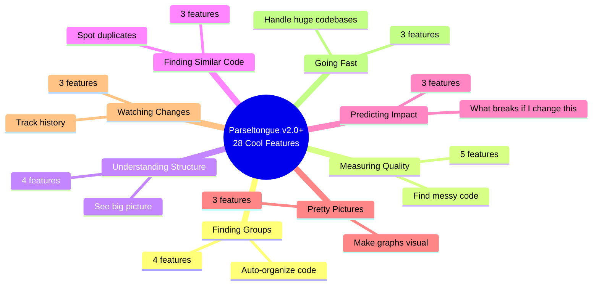

---

## Theme 1: Finding Groups (Auto-Organize Your Code)

```mermaid
graph TB
    subgraph "Theme 1: Finding Groups"
        F1["Feature 1<br/>Smart Module Finder<br/><br/>🔍 Groups related code automatically<br/>⏱️ 3 weeks"]
        F2["Feature 2<br/>Fast Code Grouper<br/><br/>🔍 Faster grouping that makes sense<br/>⏱️ 2 weeks"]
        F3["Feature 3<br/>Layer Detective<br/><br/>🔍 Find top/middle/bottom layers<br/>⏱️ 2 weeks"]
        F4["Feature 4<br/>Smart Splitter<br/><br/>🔍 Split big code into pieces<br/>⏱️ 3 weeks"]
    end

    F1 -->|Works with| F2
    F2 -->|Helps| F3
    F3 -->|Checks| F4

    style F1 fill:#e1f5ff
    style F2 fill:#e1f5ff
    style F3 fill:#e1f5ff
    style F4 fill:#e1f5ff
```

**What This Does**: Like having a super-smart robot that reads all your code and says "Hey, these 50 files are actually about login, and these 30 files are about payments!" even if they're in different folders.

**Why You Care**: Stop wasting time hunting for where things are. The computer tells you!

---

## Theme 2: Measuring Quality (Find the Messy Code)

```mermaid
graph LR
    subgraph "Theme 2: Measuring Quality"
        F5["Feature 5<br/>Messiness Detector<br/><br/>📊 How confusing is this code<br/>⏱️ 2 weeks"]
        F6["Feature 6<br/>Debt Calculator<br/><br/>📊 How much work to fix this<br/>⏱️ 3 weeks"]
        F7["Feature 7<br/>Complexity Counter<br/><br/>📊 How many paths through code<br/>⏱️ 1 week"]
        F8["Feature 8<br/>Connection Checker<br/><br/>📊 Too many connections<br/>⏱️ 2 weeks"]
        F9["Feature 9<br/>Copy-Paste Finder<br/><br/>📊 Find duplicate code<br/>⏱️ 2 weeks"]
    end

    F7 --> F5
    F7 --> F6
    F5 --> F8
    F6 --> F8
    F8 --> F9

    style F5 fill:#fff4e1
    style F6 fill:#fff4e1
    style F7 fill:#fff4e1
    style F8 fill:#fff4e1
    style F9 fill:#fff4e1
```

**What This Does**: Like a health check-up for code. It finds the "sick" parts that need fixing before they cause big problems.

**Why You Care**: Fix the worst problems first instead of guessing. Get a score like "This file is 87% messy!"

---

## Theme 3: Understanding Structure (See the Big Picture)

```mermaid
flowchart TD
    subgraph "Theme 3: Understanding Structure"
        F10["Feature 10<br/>Standard Format Exporter<br/><br/>📋 Export to industry format<br/>⏱️ 2 weeks"]
        F11["Feature 11<br/>Importance Ranker<br/><br/>📋 Which files matter most<br/>⏱️ 2 weeks"]
        F12["Feature 12<br/>Layer Rule Checker<br/><br/>📋 Is your architecture correct<br/>⏱️ 2 weeks"]
        F13["Feature 13<br/>Circle Finder<br/><br/>📋 Find circular dependencies<br/>⏱️ 1 week"]
    end

    F11 -->|Helps| F12
    F13 -->|Finds problems for| F12
    F10 -->|Exports results from| F11

    style F10 fill:#e8f5e9
    style F11 fill:#e8f5e9
    style F12 fill:#e8f5e9
    style F13 fill:#e8f5e9
```

**What This Does**: Gives you a bird's-eye view of your entire codebase. Like looking at a map instead of wandering around lost.

**Why You Care**: Know which 10 files are the "heart" of your project. See if files in the wrong layers are breaking rules.

---

## Theme 4: Finding Similar Code (Spot the Duplicates)

```mermaid
graph TB
    subgraph "Theme 4: Finding Similar Code"
        F14["Feature 14<br/>Structure Matcher<br/><br/>🔎 Find code with same shape<br/>⏱️ 3 weeks"]
        F15["Feature 15<br/>Smart Code Embeddings<br/><br/>🔎 Understand code meaning<br/>⏱️ 3 weeks"]
        F16["Feature 16<br/>Refactoring History Tracker<br/><br/>🔎 Did someone rename this<br/>⏱️ 2 weeks"]
    end

    F14 -->|Finds structural similarity| Comparison[Similarity Results]
    F15 -->|Finds meaning similarity| Comparison
    F16 -->|Finds historical patterns| Comparison

    Comparison -->|Helps you| UseCase1[Search across projects]
    Comparison -->|Helps you| UseCase2[Detect refactorings]
    Comparison -->|Helps you| UseCase3[Find duplicates]

    style F14 fill:#fce4ec
    style F15 fill:#fce4ec
    style F16 fill:#fce4ec
    style Comparison fill:#ffccbc
```

**What This Does**: Like "Find My iPhone" but for code. Searches thousands of files in seconds to find similar functions.

**Why You Care**: "Didn't Bob write something like this last year?" → Computer finds it instantly.

---

## Theme 5: Predicting Impact (What Breaks If I Change This?)

```mermaid
flowchart LR
    subgraph "Theme 5: Predicting Impact"
        F17["Feature 17<br/>Ripple Effect Predictor<br/><br/>💥 Probability of breaking things<br/>⏱️ 2 weeks"]
        F18["Feature 18<br/>Data Flow Tracker<br/><br/>💥 What data flows where<br/>⏱️ 3 weeks"]
        F19["Feature 19<br/>Team Connection Counter<br/><br/>💥 How tightly connected is code<br/>⏱️ 2 weeks"]
    end

    Change[You Change One File] --> F17
    Change --> F18

    F17 -->|Calculates| Report[Impact Report]
    F18 -->|Traces data| Report
    F19 -->|Measures cohesion| Report

    Report --> Decision{How Bad?}
    Decision -->|High Risk| Action1[Test everything carefully]
    Decision -->|Medium Risk| Action2[Standard testing]
    Decision -->|Low Risk| Action3[Quick review OK]

    style F17 fill:#f3e5f5
    style F18 fill:#f3e5f5
    style F19 fill:#f3e5f5
```

**What This Does**: Before you change code, it predicts "If you change this file, it will probably affect 23 other files."

**Why You Care**: No more surprises. Know how much testing you need BEFORE making changes.

---

## Theme 6: Pretty Pictures (Make It Visual)

```mermaid
graph TD
    subgraph "Theme 6: Pretty Pictures"
        F20["Feature 20<br/>Code Map Maker<br/><br/>🎨 2D map of all your code<br/>⏱️ 3 weeks"]
        F21["Feature 21<br/>Grid View<br/><br/>🎨 Spreadsheet view of dependencies<br/>⏱️ 2 weeks"]
        F22["Feature 22<br/>Interactive Graph<br/><br/>🎨 Click and explore graph<br/>⏱️ 2 weeks"]
    end

    Data[Your Code] --> F20
    Data --> F21
    Data --> F22

    F20 -->|Creates| UI[Web Page]
    F21 -->|Creates| UI
    F22 -->|Creates| UI

    UI --> Persona1[Boss:<br/>Show me overview]
    UI --> Persona2[Developer:<br/>Show me details]
    UI --> Persona3[Designer:<br/>Make it pretty]

    style F20 fill:#e0f2f1
    style F21 fill:#e0f2f1
    style F22 fill:#e0f2f1
    style UI fill:#b2dfdb
```

**What This Does**: Turns boring text data into cool pictures you can click on and explore.

**Why You Care**: Instead of reading 1000 lines of text, you see a colorful map. Way easier!

---

## Theme 7: Watching Changes (Time Travel)

```mermaid
sequenceDiagram
    participant History as Git History
    participant F23 as Feature 23<br/>Change Hotspot Finder
    participant F24 as Feature 24<br/>Time Machine Snapshots
    participant F16 as Feature 16<br/>Rename Detector
    participant Results as What You Learn

    History->>F23: Which files change a lot?
    History->>F24: How did structure change over time?
    History->>F16: Did anyone rename this?

    F23->>Results: These 5 files change every week!
    F24->>Results: Architecture got worse over 6 months
    F16->>Results: This was renamed 3 times

    Results->>Results: Combine findings
    Results->>Results: Find risky files

    Note over F23: ⏱️ 2 weeks
    Note over F24: ⏱️ 2 weeks
    Note over F16: ⏱️ 2 weeks (from Theme 4)
```

**What This Does**: Like a time machine for your code. See how your project changed over weeks/months/years.

**Why You Care**: "This file has been changed 47 times this month - maybe we should fix it properly instead of band-aiding it!"

---

## Theme 8: Going Fast (Handle Big Projects)

```mermaid
graph LR
    subgraph "Theme 8: Going Fast"
        F25["Feature 25<br/>Quick Update Engine<br/><br/>⚡ Update only what changed<br/>⏱️ 3 weeks"]
        F26["Feature 26<br/>Parallel Processor<br/><br/>⚡ Use all CPU cores<br/>⏱️ 2 weeks"]
        F27["Feature 27<br/>Space Saver<br/><br/>⚡ Compress graph data<br/>⏱️ 2 weeks"]
        F28["Feature 28<br/>Approximation Engine<br/><br/>⚡ Good enough is fast enough<br/>⏱️ 3 weeks"]
    end

    Size[How Big Is Your Code?] --> Decision{Size?}

    Decision -->|Small<br/>less than 10K files| Standard[Normal Speed OK]
    Decision -->|Medium<br/>10K to 100K files| F25
    Decision -->|Large<br/>100K to 1M files| F26
    Decision -->|Massive<br/>over 1M files| F28

    F25 --> F27
    F26 --> F27
    F27 --> Fast[Super Fast]

    style F25 fill:#fff9c4
    style F26 fill:#fff9c4
    style F27 fill:#fff9c4
    style F28 fill:#fff9c4
```

**What This Does**: Makes Parseltongue work on HUGE codebases (like Google-sized projects) without waiting forever.

**Why You Care**: Analysis that used to take 10 minutes now takes 30 seconds. Or works on projects with 1 million files!

---

## Simple Roadmap: When You Get Each Feature

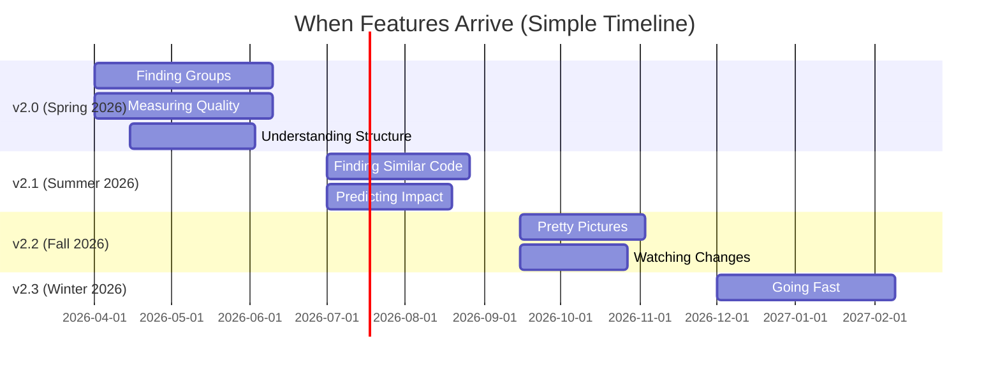

---

## Priority Guide: Build This Stuff First!

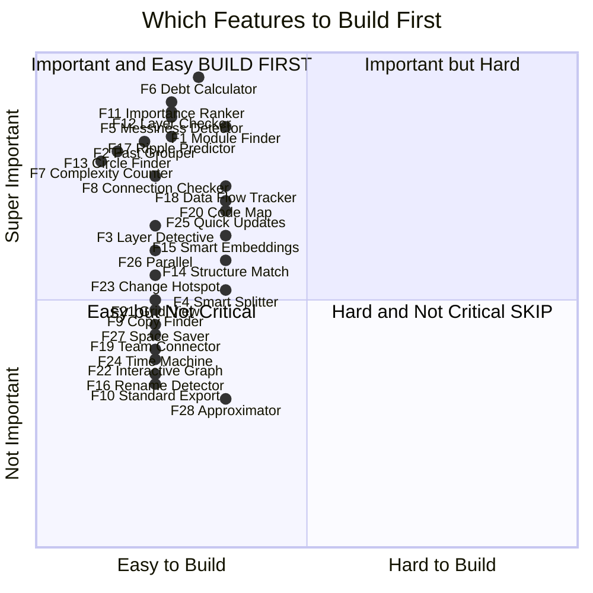

**Top Priority** (Build these 6 first!):
1. **F7** - Complexity Counter (1 week, super important)
2. **F13** - Circle Finder (1 week, super important)
3. **F2** - Fast Grouper (2 weeks, super important)
4. **F11** - Importance Ranker (2 weeks, super important)
5. **F12** - Layer Checker (2 weeks, super important)
6. **F5** - Messiness Detector (2 weeks, super important)

---

## How Fast Are These Features?

```mermaid
graph LR
    subgraph "Speed Comparison"
        Super_Fast["⚡ Super Fast<br/>Less than 1 second<br/><br/>Features 13 19 25"]
        Pretty_Fast["🏃 Pretty Fast<br/>A few seconds<br/><br/>Features 1 2 3"]
        Kinda_Slow["🐢 Takes a Minute<br/>30-60 seconds<br/><br/>Features 11 17 21"]
        Very_Slow["🐌 Takes Forever<br/>Several minutes<br/><br/>Feature 18"]
    end

    Super_Fast -->|Good for| Use1[Use every time you save a file]
    Pretty_Fast -->|Good for| Use2[Use when you ask for it]
    Kinda_Slow -->|Good for| Use3[Run once a day automatically]
    Very_Slow -->|Good for| Use4[Run once a week on weekends]

    style Super_Fast fill:#c8e6c9
    style Pretty_Fast fill:#fff9c4
    style Kinda_Slow fill:#ffccbc
    style Very_Slow fill:#ffcdd2
```

---

## Data Journey: How It Works (Simplified)

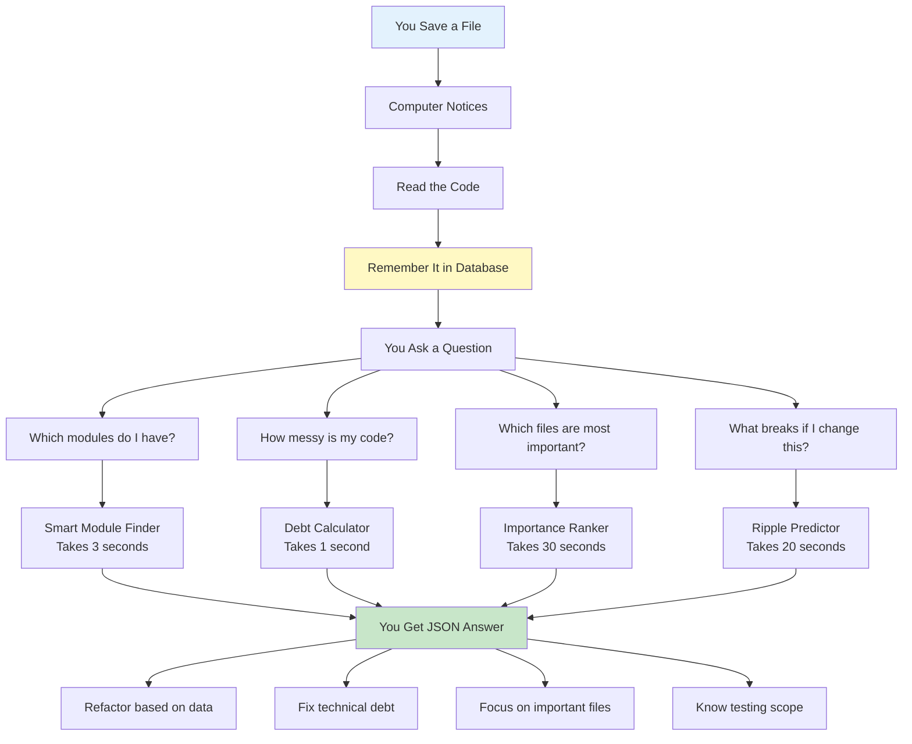

---

## Feature Connections: What Builds on What

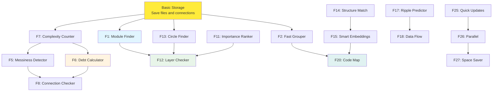

**What This Means**: Build the features at the top first! They're like Lego blocks - you need the bottom blocks before you can build the tower.

---

## Summary: Effort by Theme

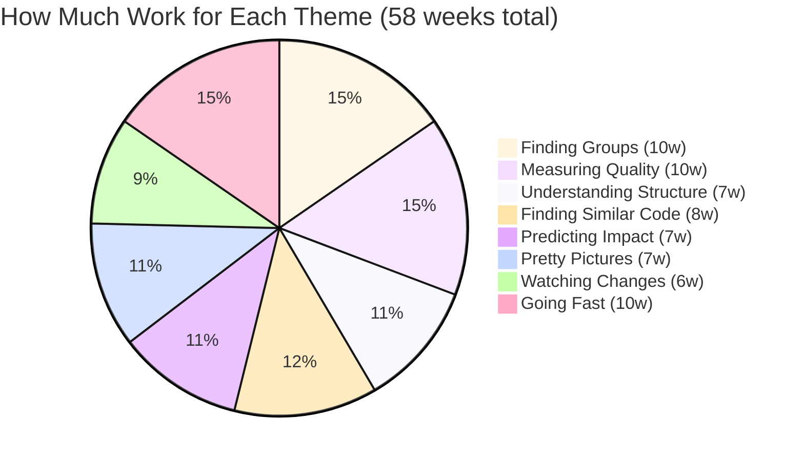

---

## Key Takeaways (In Simple Words)

1. **28 cool features** organized into **8 themes** (like chapters in a book)
2. **58 weeks of work** total (about 1 year with a team)
3. **All features work on regular computers** (no fancy GPU needed)
4. **Every feature has research papers** backing it up (smart people invented these!)
5. **Build the easy important ones first** (Features 2, 7, 11, 12, 13)
6. **Some take 1 second, others take 1 minute** (but all are way faster than doing it by hand)
7. **6 quick wins** that are easy to build and super useful

---

## Real-World Examples (So You Get It)

### Example 1: Smart Module Finder (Feature 1)
**Before**: "Where's all the authentication code?" → Spend 2 hours searching 47 files
**After**: "Show me the auth module" → Computer finds all 47 files in 3 seconds

### Example 2: Debt Calculator (Feature 6)
**Before**: "Which file should we refactor first?" → Argue for 30 minutes based on gut feeling
**After**: "Rank files by technical debt" → Computer says "File X has 873 debt points, File Y has 45"

### Example 3: Circle Finder (Feature 13)
**Before**: App is slow, no idea why → Debug for days
**After**: "Find circular dependencies" → Computer shows: "Module A calls B calls C calls A = infinite loop!"

### Example 4: Ripple Predictor (Feature 17)
**Before**: Change one file → 15 tests break unexpectedly → "Oh no, why?!"
**After**: BEFORE changing → Computer warns: "Changing this will affect 15 files with 73% probability"

### Example 5: Code Map (Feature 20)
**Before**: New developer joins → "Read the README and good luck!" → Confused for weeks
**After**: New developer opens Code Map → Sees visual map → "Oh, so THAT's how it's organized!"

---

## Glossary: Big Words Made Simple

- **Algorithm** = Recipe the computer follows
- **Leiden / LPA / K-Core** = Different recipes for grouping code
- **Entropy** = Messiness measurement
- **SQALE** = Technical debt measurement
- **Cyclomatic Complexity** = How many paths through code
- **Coupling** = How connected files are
- **Cohesion** = How related code in one file is
- **PageRank** = Importance ranking (like Google ranks web pages)
- **SCC** = Circle finder (Strongly Connected Components)
- **WL Kernel** = Pattern matching for code structure
- **Node2Vec** = Convert code into numbers computer can compare
- **UMAP** = Squash high-dimensional data into 2D picture
- **DSM** = Dependency Structure Matrix (fancy spreadsheet)
- **RefDiff** = Detect when code was renamed/moved
- **PDG** = Program Dependency Graph (tracks what depends on what)
- **CSR** = Compressed storage format (save disk space)

---

## Questions Kids Ask

**Q: Which feature is the coolest?**
A: Feature 20 (Code Map) because you can SEE your code as a picture!

**Q: Which feature saves the most time?**
A: Feature 6 (Debt Calculator) - turns 2 days of guessing into 5 seconds of facts

**Q: Which feature is the easiest to build?**
A: Feature 7 (Complexity Counter) - only 1 week!

**Q: Can I use this on my Raspberry Pi?**
A: Yes! All features work on regular CPUs (no expensive graphics card needed)

**Q: What if I have 1 million files?**
A: Use Feature 28 (Approximation Engine) - sacrifices perfect accuracy for speed

**Q: Will this work with Python? Java? JavaScript?**
A: Yes! Works with 12 languages: Rust, Python, JavaScript, TypeScript, Go, Java, C, C++, Ruby, PHP, C#, Swift

---

**Last Updated**: 2026-02-01
**Source**: Simplified from PARSELTONGUE_V2_FEATURES_RESEARCH_BACKED.md
**Total Diagrams**: 10 simple diagrams
**Reading Time**: 15 minutes (vs 2 hours for the technical version!)
