# Parseltongue v2.0+ Features: Mermaid Diagram Visualizations

**Date**: 2026-02-01
**Source**: PARSELTONGUE_V2_FEATURES_RESEARCH_BACKED.md
**Purpose**: Visual representation of 28 research-backed features organized into digestible diagrams

---

## 1. Overview: All 8 Feature Themes

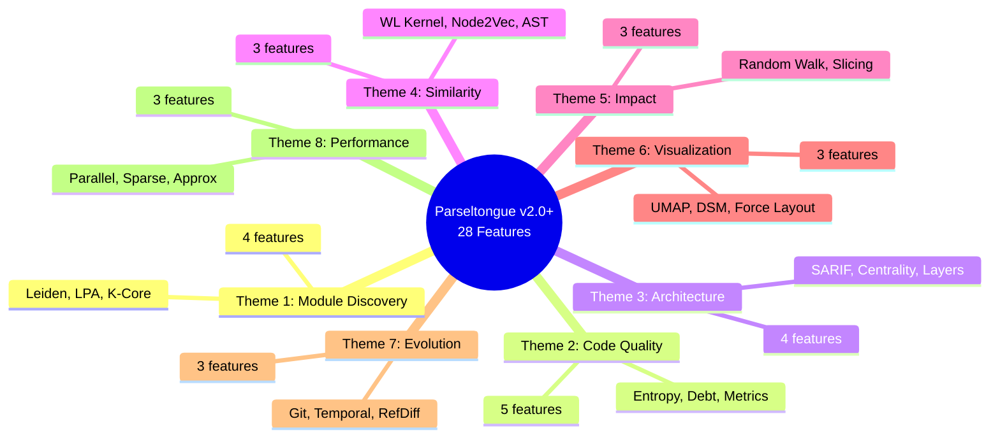

---

## 2. Theme 1: Module/Package Discovery (4 Features)

```mermaid
graph TB
    subgraph "Theme 1: Module/Package Discovery"
        F1["Feature #1<br/>Hierarchical Module<br/>Boundary Detection<br/><br/>📊 Leiden Algorithm<br/>⏱️ 3 weeks"]
        F2["Feature #2<br/>Label Propagation<br/>Enhanced Clustering<br/><br/>📊 GVE-LPA<br/>⏱️ 2 weeks"]
        F3["Feature #3<br/>K-Core Decomposition<br/>Layering<br/><br/>📊 K-Core Algorithm<br/>⏱️ 2 weeks"]
        F4["Feature #4<br/>Spectral Graph<br/>Partition Decomposition<br/><br/>📊 Spectral Clustering<br/>⏱️ 3 weeks"]
    end

    F1 -->|Builds on| F2
    F2 -->|Complements| F3
    F3 -->|Validates| F4

    style F1 fill:#e1f5ff
    style F2 fill:#e1f5ff
    style F3 fill:#e1f5ff
    style F4 fill:#e1f5ff
```

**Total Effort**: 10 weeks
**Primary Use Case**: Understanding implicit architecture without relying on folder structure

---

## 3. Theme 2: Code Quality Metrics (5 Features)

```mermaid
graph LR
    subgraph "Theme 2: Code Quality Metrics"
        F5["Feature #5<br/>Information-Theoretic<br/>Entropy Complexity<br/><br/>📊 Shannon Entropy<br/>⏱️ 2 weeks"]
        F6["Feature #6<br/>Technical Debt<br/>Quantification Scoring<br/><br/>📊 SQALE Method<br/>⏱️ 3 weeks"]
        F7["Feature #7<br/>Cyclomatic Complexity<br/>per Entity<br/><br/>📊 McCabe Complexity<br/>⏱️ 1 week"]
        F8["Feature #8<br/>Coupling & Cohesion<br/>Metrics<br/><br/>📊 CK Metrics Suite<br/>⏱️ 2 weeks"]
        F9["Feature #9<br/>Code Clone Detection<br/>via AST Edit Distance<br/><br/>📊 Tree Edit Distance<br/>⏱️ 2 weeks"]
    end

    F7 --> F5
    F7 --> F6
    F5 --> F8
    F6 --> F8
    F8 --> F9

    style F5 fill:#fff4e1
    style F6 fill:#fff4e1
    style F7 fill:#fff4e1
    style F8 fill:#fff4e1
    style F9 fill:#fff4e1
```

**Total Effort**: 10 weeks
**Primary Use Case**: Quantifying technical debt and code quality for data-driven refactoring decisions

---

## 4. Theme 3: Architectural Insights (4 Features)

```mermaid
flowchart TD
    subgraph "Theme 3: Architectural Insights"
        F10["Feature #10<br/>SARIF Architecture<br/>Recovery Integration<br/><br/>📊 SARIF Format<br/>⏱️ 2 weeks"]
        F11["Feature #11<br/>Centrality Measures<br/>for Entity Importance<br/><br/>📊 PageRank, Betweenness<br/>⏱️ 2 weeks"]
        F12["Feature #12<br/>Layered Architecture<br/>Compliance Verification<br/><br/>📊 Topological Sort<br/>⏱️ 2 weeks"]
        F13["Feature #13<br/>Tarjan's Strongly<br/>Connected Components<br/><br/>📊 Tarjan's Algorithm<br/>⏱️ 1 week"]
    end

    F11 -->|Feeds into| F12
    F13 -->|Detects cycles for| F12
    F10 -->|Standardizes output| F11

    style F10 fill:#e8f5e9
    style F11 fill:#e8f5e9
    style F12 fill:#e8f5e9
    style F13 fill:#e8f5e9
```

**Total Effort**: 7 weeks
**Primary Use Case**: Validating architecture compliance and identifying key entities

---

## 5. Theme 4: Code Similarity (3 Features)

```mermaid
graph TB
    subgraph "Theme 4: Code Similarity"
        F14["Feature #14<br/>Weisfeiler-Lehman<br/>Graph Kernel Similarity<br/><br/>📊 WL Kernel<br/>⏱️ 3 weeks"]
        F15["Feature #15<br/>Node2Vec Entity<br/>Embeddings CPU<br/><br/>📊 Node2Vec (CPU)<br/>⏱️ 3 weeks"]
        F16["Feature #16<br/>RefDiff Refactoring<br/>Detection History<br/><br/>📊 RefDiff Algorithm<br/>⏱️ 2 weeks"]
    end

    F14 -->|Structural similarity| Comparison[Similarity Analysis]
    F15 -->|Semantic similarity| Comparison
    F16 -->|Historical patterns| Comparison

    Comparison -->|Enables| UseCase1[Cross-repo code search]
    Comparison -->|Enables| UseCase2[Refactoring detection]
    Comparison -->|Enables| UseCase3[Duplicate detection]

    style F14 fill:#fce4ec
    style F15 fill:#fce4ec
    style F16 fill:#fce4ec
    style Comparison fill:#ffccbc
```

**Total Effort**: 8 weeks
**Primary Use Case**: Finding similar code patterns across repositories and tracking refactorings

---

## 6. Theme 5: Impact Analysis (3 Features)

```mermaid
flowchart LR
    subgraph "Theme 5: Impact Analysis"
        F17["Feature #17<br/>Random Walk<br/>Probability Impact<br/><br/>📊 Personalized PageRank<br/>⏱️ 2 weeks"]
        F18["Feature #18<br/>Program Slicing<br/>Backward & Forward<br/><br/>📊 PDG Slicing<br/>⏱️ 3 weeks"]
        F19["Feature #19<br/>Triangle Counting<br/>Cohesion Metrics<br/><br/>📊 Triangle Census<br/>⏱️ 2 weeks"]
    end

    Change[Code Change Event] --> F17
    Change --> F18

    F17 -->|Probabilistic impact| Report[Impact Report]
    F18 -->|Data flow impact| Report
    F19 -->|Cohesion metrics| Report

    Report --> Decision{Impact Level?}
    Decision -->|High| Action1[Require extensive testing]
    Decision -->|Medium| Action2[Standard review]
    Decision -->|Low| Action3[Fast-track approval]

    style F17 fill:#f3e5f5
    style F18 fill:#f3e5f5
    style F19 fill:#f3e5f5
```

**Total Effort**: 7 weeks
**Primary Use Case**: Estimating blast radius of code changes for risk assessment

---

## 7. Theme 6: Visualization (3 Features)

```mermaid
graph TD
    subgraph "Theme 6: Visualization"
        F20["Feature #20<br/>UMAP 2D Code<br/>Layout Projection<br/><br/>📊 UMAP (CPU)<br/>⏱️ 3 weeks"]
        F21["Feature #21<br/>Dependency Structure<br/>Matrix Visualization<br/><br/>📊 DSM Layout<br/>⏱️ 2 weeks"]
        F22["Feature #22<br/>Interactive Force<br/>Layout Graph<br/><br/>📊 Force-Directed<br/>⏱️ 2 weeks"]
    end

    Data[Graph Data] --> F20
    Data --> F21
    Data --> F22

    F20 -->|2D embedding| UI[Web UI]
    F21 -->|Matrix view| UI
    F22 -->|Interactive graph| UI

    UI --> Persona1[Architect:<br/>System overview]
    UI --> Persona2[Developer:<br/>Local dependencies]
    UI --> Persona3[Manager:<br/>Metrics dashboard]

    style F20 fill:#e0f2f1
    style F21 fill:#e0f2f1
    style F22 fill:#e0f2f1
    style UI fill:#b2dfdb
```

**Total Effort**: 7 weeks
**Primary Use Case**: Making graph data accessible through visual interfaces

---

## 8. Theme 7: Evolution Tracking (3 Features)

```mermaid
sequenceDiagram
    participant Git as Git History
    participant F23 as Feature #23<br/>Git Churn Hotspot<br/>Correlation
    participant F24 as Feature #24<br/>Temporal Graph<br/>Evolution Snapshots
    participant F16 as Feature #16<br/>RefDiff Refactoring<br/>Detection
    participant Insights as Insights

    Git->>F23: Commit data
    Git->>F24: Historical snapshots
    Git->>F16: Code changes

    F23->>Insights: Hotspot files (high churn)
    F24->>Insights: Architectural drift over time
    F16->>Insights: Refactoring patterns

    Insights->>Insights: Correlate churn + complexity
    Insights->>Insights: Identify risky areas

    Note over F23: ⏱️ 2 weeks
    Note over F24: ⏱️ 2 weeks
    Note over F16: ⏱️ 2 weeks (from Theme 4)
```

**Total Effort**: 6 weeks (4 weeks if Feature #16 already implemented)
**Primary Use Case**: Tracking how codebase architecture evolves over time

---

## 9. Theme 8: Performance/Scalability (3 Features)

```mermaid
graph LR
    subgraph "Theme 8: Performance/Scalability"
        F25["Feature #25<br/>Incremental Graph<br/>Update Performance<br/><br/>📊 Incremental Algorithms<br/>⏱️ 3 weeks"]
        F26["Feature #26<br/>Parallel Graph<br/>Algorithm Execution<br/><br/>📊 Rayon Parallelism<br/>⏱️ 2 weeks"]
        F27["Feature #27<br/>Graph Compression<br/>Sparse Storage<br/><br/>📊 CSR Format<br/>⏱️ 2 weeks"]
        F28["Feature #28<br/>Approximate Algorithms<br/>for Massive Graphs<br/><br/>📊 Sampling/Sketching<br/>⏱️ 3 weeks"]
    end

    Scale[Codebase Size] --> Decision{Size Category?}

    Decision -->|Small<br/>< 10K entities| Standard[Standard Algorithms]
    Decision -->|Medium<br/>10K-100K| F25
    Decision -->|Large<br/>100K-1M| F26
    Decision -->|Massive<br/>> 1M| F28

    F25 --> F27
    F26 --> F27
    F27 --> Performance[Optimized Performance]

    style F25 fill:#fff9c4
    style F26 fill:#fff9c4
    style F27 fill:#fff9c4
    style F28 fill:#fff9c4
```

**Total Effort**: 10 weeks
**Primary Use Case**: Scaling Parseltongue to enterprise monorepos (100K+ entities)

---

## 10. User Persona Journey Map

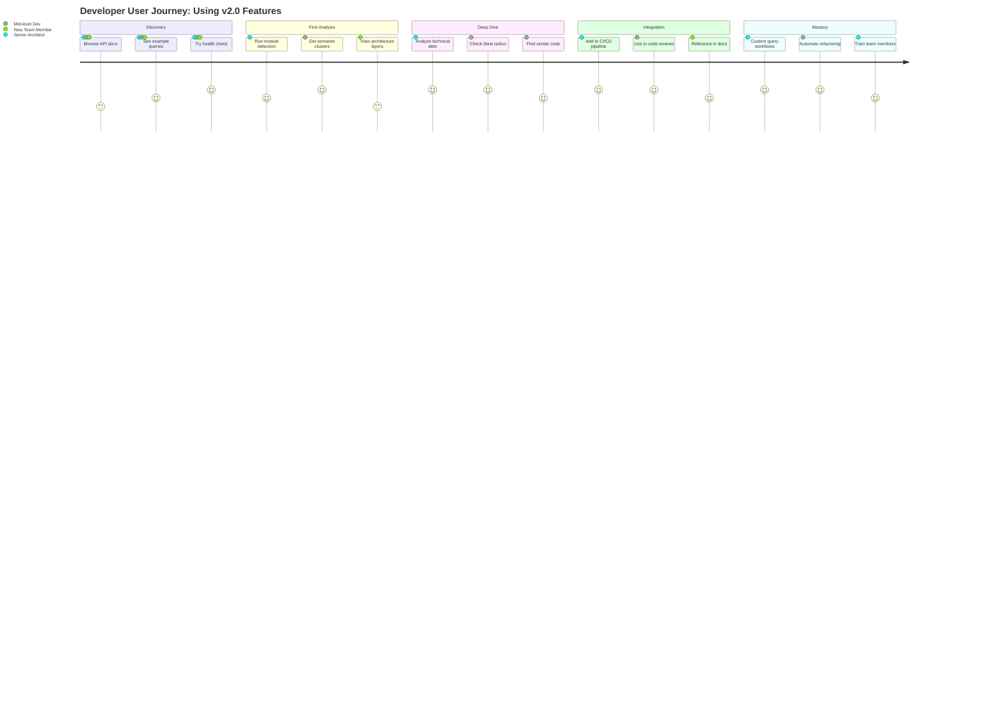

---

## 11. Research Foundation: Papers to Features

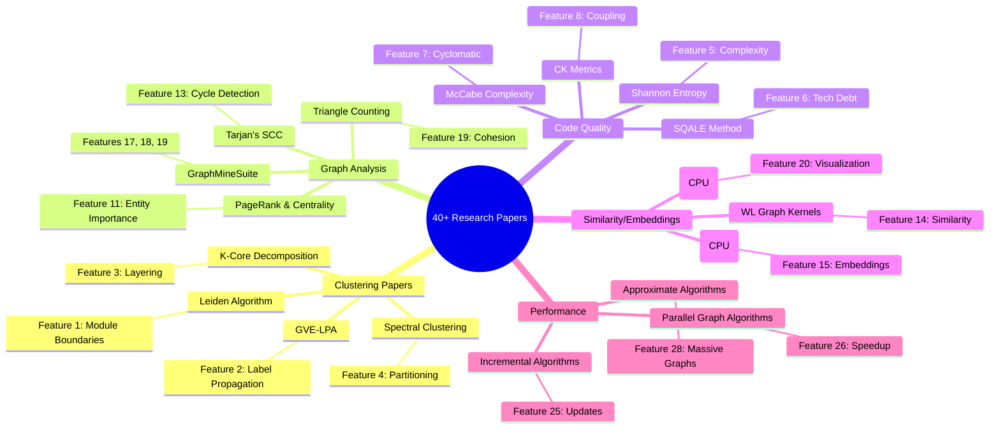

---

## 12. Implementation Roadmap: Version Timeline

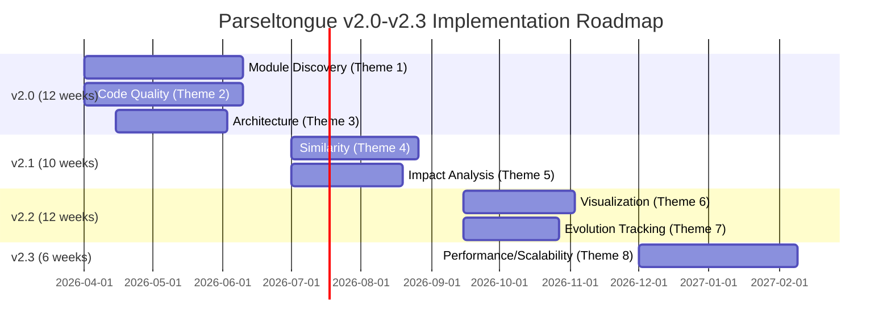

**Total Timeline**: Q2 2026 → Q1 2027 (58-59 weeks)

---

## 13. Feature Priority Matrix

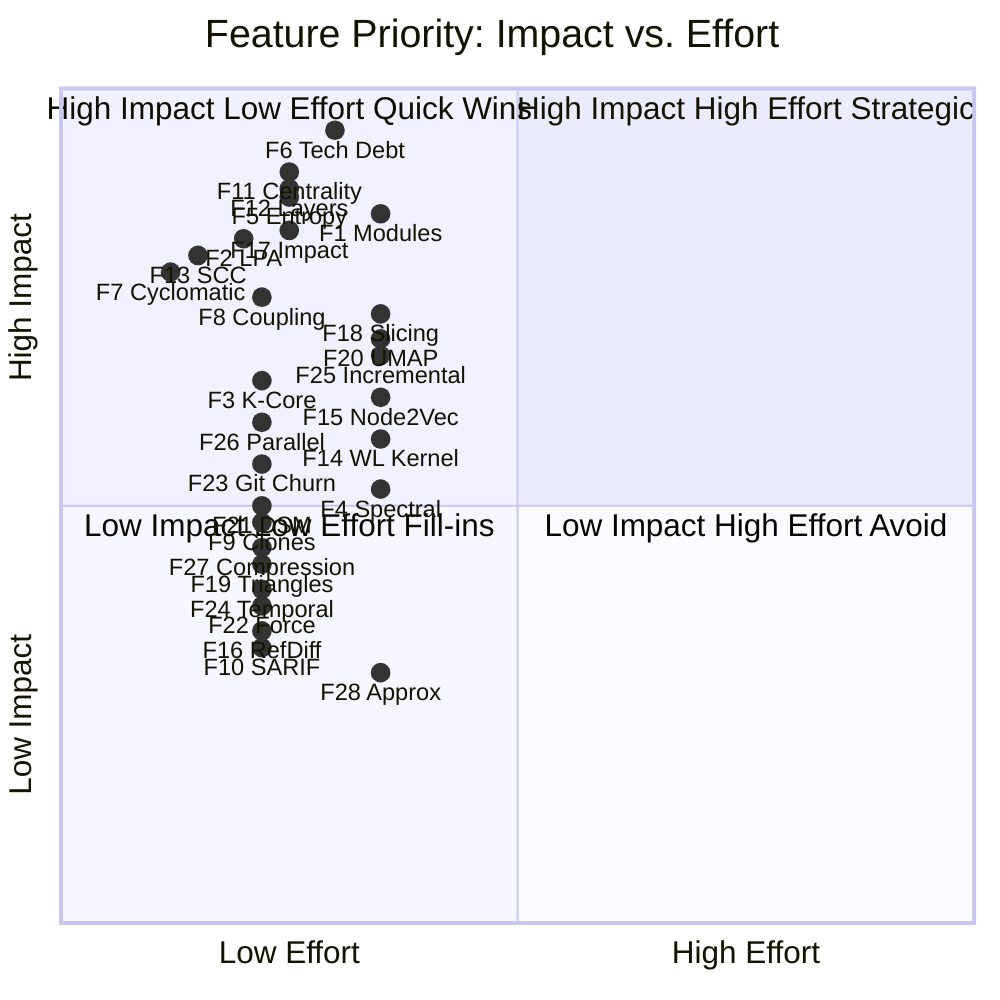

**Insight**: Focus on Quadrant 2 (Quick Wins) first: Features 7, 13, 2, 11, 12, 5
**Strategic Investments** (Quadrant 1): Features 1, 6, 17, 18, 20, 25

---

## 14. Algorithm Complexity Comparison

```mermaid
graph LR
    subgraph "Complexity Classes CPU-Friendly"
        Linear["O-V-plus-E<br/><br/>Features 13 19 25"]
        LogLinear["O-E-log-V<br/><br/>Features 1 2 3"]
        Quadratic["O-V²<br/><br/>Features 11 17 21"]
        Cubic["O-V³<br/><br/>Feature 18"]
    end

    Linear -->|Fast| Suitable1[Real-time CI/CD]
    LogLinear -->|Moderate| Suitable2[On-demand analysis]
    Quadratic -->|Slow| Suitable3[Batch processing]
    Cubic -->|Very Slow| Suitable4[Offline reports]

    style Linear fill:#c8e6c9
    style LogLinear fill:#fff9c4
    style Quadratic fill:#ffccbc
    style Cubic fill:#ffcdd2
```

**Optimization Strategy**: Prioritize O(V+E) and O(E log V) algorithms for interactive use cases

---

## 15. Data Flow: From Git Commit to Insight

```mermaid
flowchart TD
    Start[Git Commit] --> Watch[File Watcher<br/>pt08-http-code-query-server]
    Watch --> Parse[Tree-sitter Parsing<br/>parseltongue-core]
    Parse --> ISGL1[ISGL1 Entity Keys<br/>language:type:name:path:lines]
    ISGL1 --> CozoDB[(CozoDB Graph Storage)]

    CozoDB --> Query1[/hierarchical-module-boundary-detection/]
    CozoDB --> Query2[/technical-debt-quantification-scoring/]
    CozoDB --> Query3[/centrality-measures-entity-importance/]
    CozoDB --> Query4[/blast-radius-impact-analysis/]

    Query1 --> Algo1["Leiden Algorithm<br/>O-E-log-V"]
    Query2 --> Algo2["SQALE Method<br/>O-V"]
    Query3 --> Algo3["PageRank<br/>O-V²"]
    Query4 --> Algo4["Random Walk<br/>O-V²"]

    Algo1 --> JSON1[JSON Response]
    Algo2 --> JSON2[JSON Response]
    Algo3 --> JSON3[JSON Response]
    Algo4 --> JSON4[JSON Response]

    JSON1 --> Action1[Refactor modules]
    JSON2 --> Action2[Prioritize fixes]
    JSON3 --> Action3[Focus on key entities]
    JSON4 --> Action4[Estimate test scope]

    style Start fill:#e3f2fd
    style CozoDB fill:#fff9c4
    style JSON1 fill:#c8e6c9
    style JSON2 fill:#c8e6c9
    style JSON3 fill:#c8e6c9
    style JSON4 fill:#c8e6c9
```

---

## 16. Feature Dependencies Graph

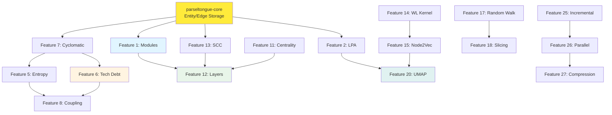

**Insight**: Features 7, 11, 13 are foundational; build these first

---

## 17. Summary: Effort vs. Impact by Theme

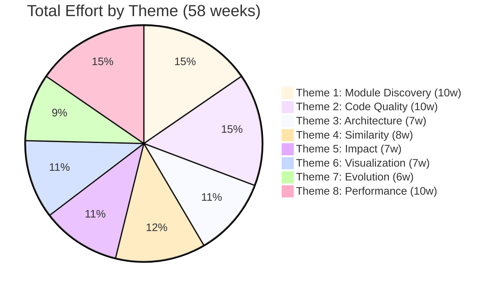

---

## Usage Instructions

### How to Use These Diagrams

1. **For Product Planning**: Use diagrams #12 (Roadmap) and #13 (Priority Matrix)
2. **For Architecture**: Use diagrams #2-9 (Theme breakdowns) and #15 (Data Flow)
3. **For Stakeholder Presentations**: Use diagrams #1 (Overview) and #10 (User Journey)
4. **For Engineering**: Use diagrams #14 (Complexity) and #16 (Dependencies)
5. **For Research Justification**: Use diagram #11 (Papers to Features)

### Rendering These Diagrams

All diagrams use Mermaid syntax and can be rendered in:
- **GitHub**: Native Mermaid support in markdown
- **VS Code**: With Mermaid extension
- **Online**: https://mermaid.live/
- **Documentation sites**: Docusaurus, MkDocs, GitBook

### Customization

Each diagram is self-contained and can be:
- Exported as SVG/PNG for presentations
- Embedded in PRDs and design docs
- Modified to show different views (e.g., filter by priority, version, theme)

---

## Key Takeaways

1. **28 features** organized into **8 coherent themes**
2. **58 weeks total effort** (Q2 2026 → Q1 2027)
3. **All algorithms CPU-friendly** (no GPU requirements)
4. **Research-backed**: Every feature cites academic papers
5. **User-centric**: Complete journey analysis for each feature
6. **Dependencies mapped**: Clear build order (Features 7, 11, 13 foundational)
7. **Quick wins identified**: Features 2, 7, 11, 12, 13 (low effort, high impact)

---

**Last Updated**: 2026-02-01
**Source Document**: PARSELTONGUE_V2_FEATURES_RESEARCH_BACKED.md
**Total Features Visualized**: 28
**Total Diagrams**: 17
