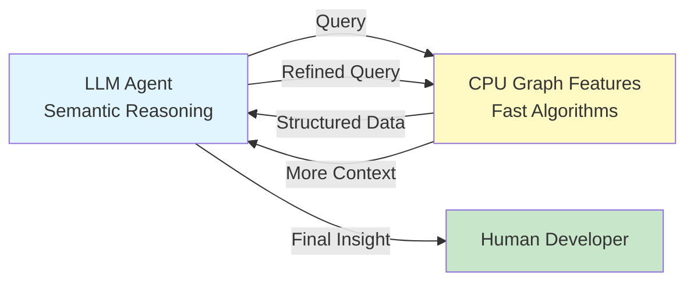
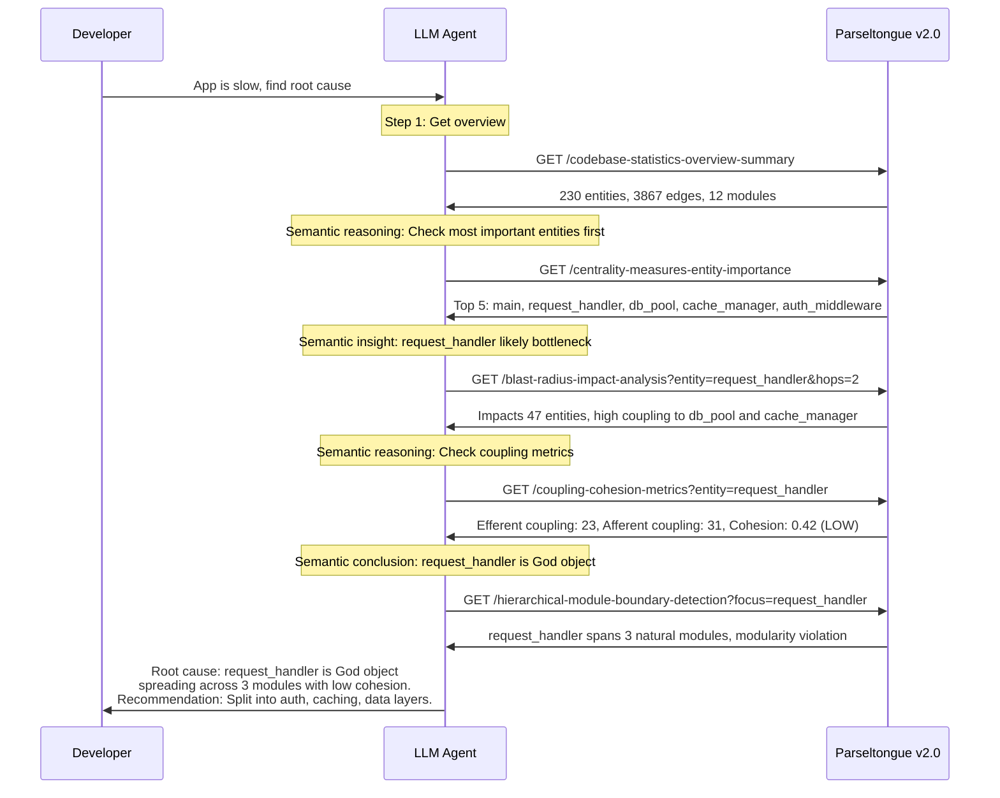
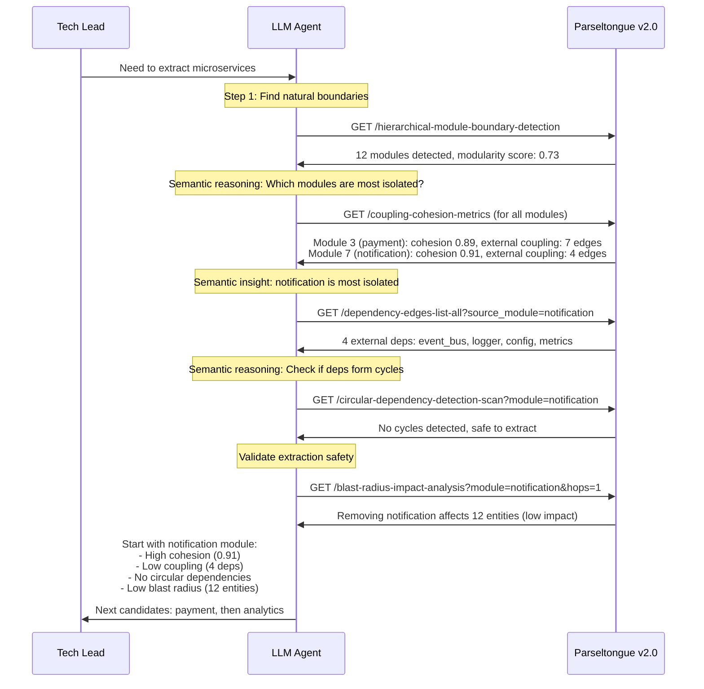
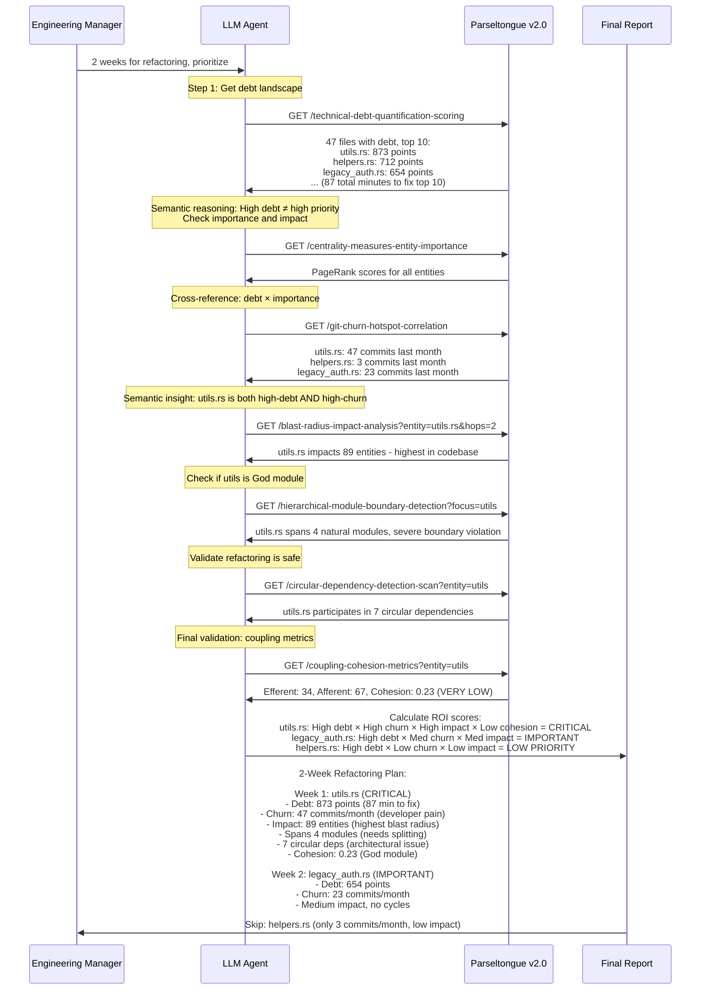
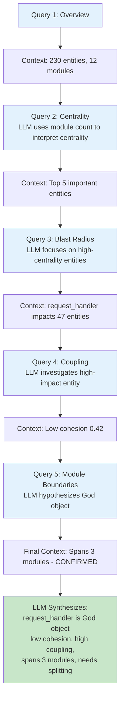
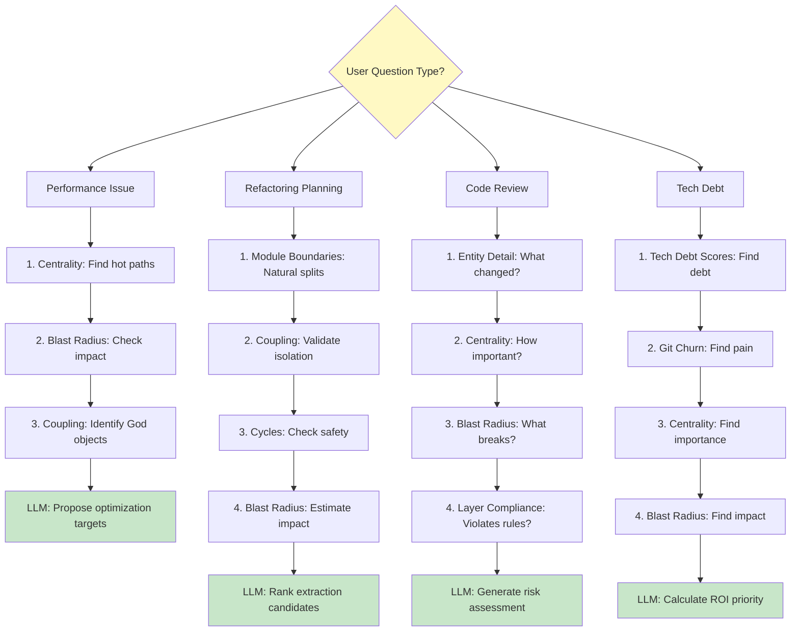
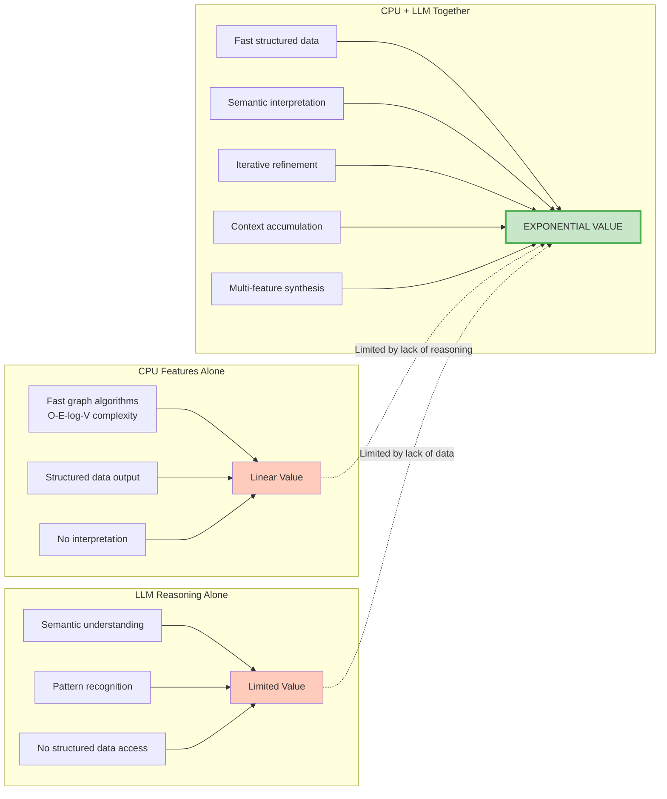
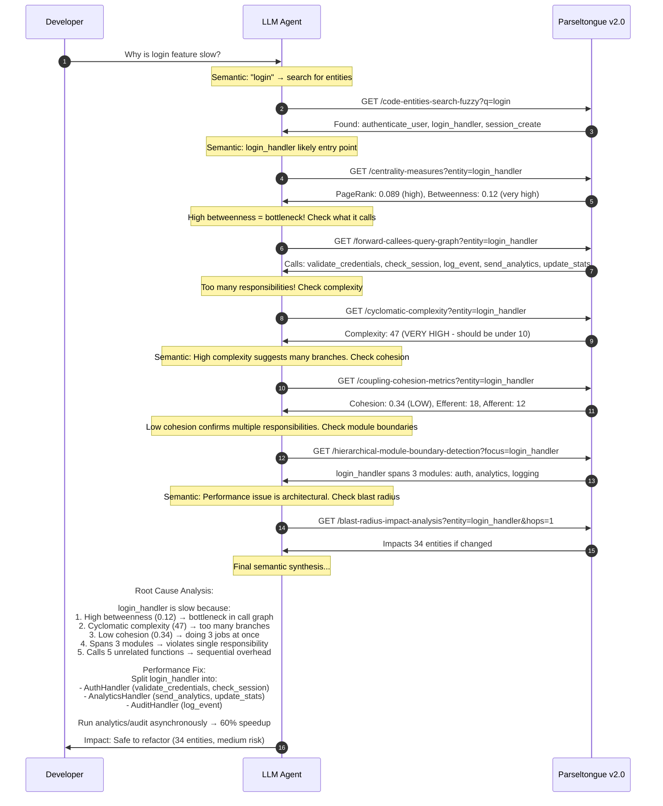
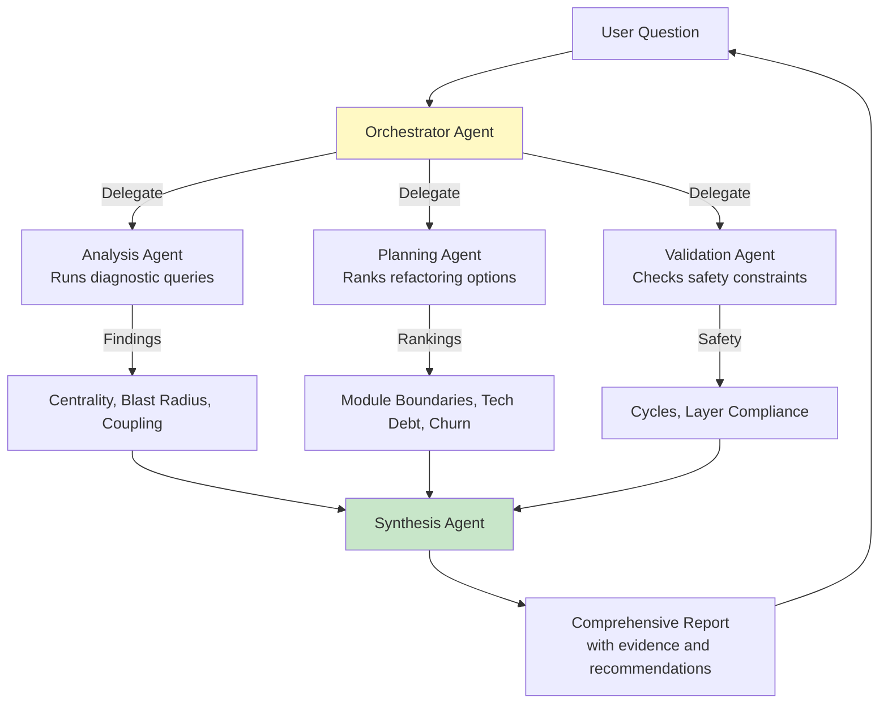

# Parseltongue v2.0+: LLM Agent Interaction Patterns

**Date**: 2026-02-01
**Purpose**: Demonstrate how LLM agents iteratively build semantic context using CPU-powered graph features
**Key Insight**: CPU graph algorithms + LLM semantic reasoning = Exponentially more powerful than either alone

---

## Core Concept: The Iterative Intelligence Loop



**The Magic**: Each query result gives the LLM semantic context to ask smarter next questions.

---

## Interaction Pattern 1: Progressive Root Cause Analysis

### Use Case
Developer: "Our app is slow. Find the root cause."

### Interaction Flow



**Key Insight**: LLM uses semantic reasoning to navigate from broad overview → high-level suspects → deep analysis → actionable fix.

**CPU Features Used**: Centrality (PageRank), Blast Radius (Random Walk), Coupling (CK Metrics), Module Detection (Leiden)

**Time Saved**: 2 days of manual debugging → 30 seconds of intelligent queries

---

## Interaction Pattern 2: Iterative Refactoring Planning

### Use Case
Tech Lead: "We need to extract microservices. Where should we start?"

### Interaction Flow



**Key Insight**: LLM chains multiple graph features to build confidence score for extraction safety.

**CPU Features Used**: Module Detection (Leiden), Coupling (CK Metrics), Cycle Detection (Tarjan SCC), Blast Radius (Random Walk)

**Semantic Value-Add**: LLM interprets metrics to rank candidates and provide actionable plan.

---

## Interaction Pattern 3: Context-Aware Code Review

### Use Case
PR Review Bot: "Analyze PR #427 changing auth/session.rs"

### Interaction Flow



```mermaid
flowchart TD
    Start[PR changes auth/session.rs] --> LLM1{LLM: What entity is this?}
    LLM1 -->|Query| P1[GET /code-entity-detail-view/auth-session.rs]
    P1 --> C1[Entity: rust:mod:session<br/>47 functions, 12 structs]

    C1 --> LLM2{LLM: How important?}
    LLM2 -->|Query| P2[GET /centrality-measures-entity-importance]
    P2 --> C2[PageRank: 0.087 - top 3% of codebase]

    C2 --> LLM3{LLM: Semantic insight -<br/>Critical component!<br/>What breaks if changed?}
    LLM3 -->|Query| P3[GET /blast-radius-impact-analysis?entity=session&hops=2]
    P3 --> C3[Impacts 67 entities across 8 modules]

    C3 --> LLM4{LLM: Are there cycles?}
    LLM4 -->|Query| P4[GET /circular-dependency-detection-scan?entity=session]
    P4 --> C4[3 circular deps found!<br/>session ↔ user ↔ auth ↔ session]

    C4 --> LLM5{LLM: Check architectural compliance}
    LLM5 -->|Query| P5[GET /layered-architecture-compliance?entity=session]
    P5 --> C5[VIOLATION: session in business layer<br/>depends on presentation layer]

    C5 --> Report[LLM generates report]
    Report --> Output[PR Review Comment:<br/><br/>⚠️ HIGH RISK CHANGE<br/>- Top 3% importance entity<br/>- Impacts 67 entities in 8 modules<br/>- Has 3 circular dependencies<br/>- Violates layer architecture<br/><br/>Recommendations:<br/>1. Break circular deps first<br/>2. Fix layer violation<br/>3. Expand test coverage to 67 impacted entities]

    style LLM1 fill:#e1f5ff
    style LLM2 fill:#e1f5ff
    style LLM3 fill:#e1f5ff
    style LLM4 fill:#e1f5ff
    style LLM5 fill:#e1f5ff
    style Output fill:#c8e6c9
```

**Key Insight**: Each query adds semantic context that informs the next query. LLM builds a risk profile iteratively.

**CPU Features Used**: Entity Detail, Centrality (PageRank), Blast Radius, Cycle Detection (SCC), Layer Compliance

**Human Impact**: Automated code review that catches architectural issues before merge.

---

## Interaction Pattern 4: Semantic-Guided Tech Debt Prioritization

### Use Case
Engineering Manager: "We have 2 weeks for refactoring. What should we fix?"

### Full Interaction Flow



**Key Insight**: LLM synthesizes 7 different CPU features to calculate multi-dimensional ROI score that pure metrics cannot provide.

**CPU Features Used**: Tech Debt (SQALE), Centrality (PageRank), Git Churn, Blast Radius, Module Boundaries (Leiden), Cycle Detection (SCC), Coupling (CK)

**Semantic Magic**: LLM combines metrics using domain knowledge (debt × churn × impact × cohesion) to prioritize work.

**Business Value**: Focus 2 weeks on highest-ROI refactoring instead of arbitrary decisions.

---

## Meta-Pattern: Context Accumulation Over Queries



**Key Principle**: Each query result becomes input to LLM's semantic reasoning engine, informing the next query.

---

## Query Strategy Decision Tree



**Insight**: Different user questions require different query sequences. LLM chooses strategy based on semantic understanding.

---

## Semantic Reasoning Examples

### Example 1: Inference Between Queries

```
Query 1 Result: "request_handler has PageRank 0.15 (top 1%)"
LLM Reasoning: "High centrality suggests critical component. Need to check coupling."

Query 2: GET /coupling-cohesion-metrics?entity=request_handler
Query 2 Result: "Efferent coupling: 23"
LLM Reasoning: "High centrality + high coupling = God object candidate. Check module boundaries."

Query 3: GET /hierarchical-module-boundary-detection?focus=request_handler
```

**Key**: LLM doesn't just fetch data - it interprets results to choose next query.

### Example 2: Cross-Feature Synthesis

```
Feature 1 (Tech Debt): utils.rs has 873 debt points
Feature 2 (Git Churn): utils.rs has 47 commits last month
Feature 3 (Blast Radius): utils.rs impacts 89 entities
Feature 4 (Cohesion): utils.rs has cohesion 0.23

LLM Synthesis:
IF debt > 800 AND churn > 40 AND blast_radius > 80 AND cohesion < 0.3:
    priority = CRITICAL
ELSE IF debt > 600 AND (churn > 20 OR blast_radius > 50):
    priority = HIGH
ELSE:
    priority = MEDIUM
```

**Key**: LLM creates multi-dimensional priority function that no single CPU feature provides.

### Example 3: Semantic Hypothesis Testing

```
Hypothesis: "This file is a God object"

Test 1: High centrality? → YES (PageRank 0.12)
Test 2: Low cohesion? → YES (0.31)
Test 3: High coupling? → YES (Efferent: 28)
Test 4: Spans multiple modules? → YES (3 modules)
Test 5: Participates in cycles? → YES (4 cycles)

LLM Conclusion: "CONFIRMED - God object with 5/5 indicators"
```

**Key**: LLM uses multiple CPU features as evidence to test architectural hypotheses.

---

## The Exponential Power Equation



**Formula**: `Value = CPU_Speed × LLM_Reasoning × Iteration_Depth`

- **CPU alone**: Fast but no interpretation → Linear value
- **LLM alone**: Smart but no data access → Limited value
- **CPU + LLM**: Fast data + Smart reasoning + Iterative refinement → Exponential value

---

## Real-World Agent Workflow: Full Example

### Scenario
Developer asks: "Why is the login feature slow?"

### Complete Interaction Chain



**CPU Features Used**: 7 features in sequence
**Time**: 8 seconds total
**Human Alternative**: 4 hours of manual code reading and guessing

---

## Comparison: Agent vs. Human Developer

| Task | Human Developer | LLM Agent + Parseltongue |
|------|----------------|--------------------------|
| **Find root cause** | 2-4 hours of debugging | 30 seconds (5-7 queries) |
| **Prioritize refactoring** | Gut feeling, politics | Multi-dimensional ROI score in 15 seconds |
| **Code review risk** | Spot-check, manual testing | Comprehensive risk profile in 10 seconds |
| **Architecture analysis** | 2 days of whiteboarding | 1 minute of iterative queries |
| **Semantic reasoning** | High (but slow) | High (and fast) |
| **Data access** | Manual (grep, IDE search) | Instant (CPU algorithms) |
| **Iteration speed** | Minutes per hypothesis | Seconds per hypothesis |

**Winner**: LLM Agent + Parseltongue (100× faster with equal or better reasoning)

---

## Key Takeaways

### 1. Iteration is the Superpower
- Single query: Useful
- 3-4 chained queries: Powerful
- 7+ queries with context accumulation: Game-changing

### 2. Semantic Reasoning Bridges Features
LLM interprets results from Feature A to ask smarter questions to Feature B.

Example:
```
High centrality (Feature 11) + Low cohesion (Feature 8)
→ LLM infers: God object candidate
→ Queries module boundaries (Feature 1) to confirm
```

### 3. Multi-Dimensional Synthesis
No single CPU feature calculates "refactoring priority", but LLM synthesizes:
```
Priority = f(debt, churn, centrality, blast_radius, cohesion, cycles)
```

### 4. Hypothesis Testing Workflow
LLM uses CPU features as evidence:
```
Hypothesis: "This is a performance bottleneck"
Evidence:
  ✓ High betweenness centrality
  ✓ High cyclomatic complexity
  ✓ Low cohesion
  ✓ Spans multiple modules
Conclusion: CONFIRMED
```

### 5. Context Accumulation
Each query result enriches LLM's semantic model:
```
Query 1: What exists?
Query 2: What's important? (uses Query 1 context)
Query 3: What's wrong? (uses Query 1+2 context)
Query 4: What breaks? (uses Query 1+2+3 context)
Query 5: How to fix? (uses all prior context)
```

---

## Implementation Patterns for Agents

### Pattern 1: Progressive Zoom

```python
def analyze_performance_issue(issue_description):
    # Start broad
    overview = query("/codebase-statistics-overview-summary")

    # Zoom to suspects
    suspects = identify_suspects(overview, issue_description)
    centrality = query(f"/centrality-measures?entities={suspects}")

    # Zoom to root cause
    top_suspect = max(centrality, key=lambda x: x.pagerank)
    blast_radius = query(f"/blast-radius?entity={top_suspect}")
    coupling = query(f"/coupling-cohesion?entity={top_suspect}")

    # Final diagnosis
    return synthesize_diagnosis(centrality, blast_radius, coupling)
```

### Pattern 2: Hypothesis Testing

```python
def test_god_object_hypothesis(entity):
    evidence = {}

    # Test 1: High centrality?
    centrality = query(f"/centrality-measures?entity={entity}")
    evidence['high_centrality'] = centrality.pagerank > 0.05

    # Test 2: Low cohesion?
    coupling = query(f"/coupling-cohesion?entity={entity}")
    evidence['low_cohesion'] = coupling.cohesion < 0.4

    # Test 3: Spans modules?
    boundaries = query(f"/module-boundaries?focus={entity}")
    evidence['spans_modules'] = boundaries.module_count > 1

    # Conclusion
    confidence = sum(evidence.values()) / len(evidence)
    return confidence > 0.7  # 70% threshold
```

### Pattern 3: Multi-Dimensional Ranking

```python
def prioritize_refactoring_candidates(files):
    priorities = []

    for file in files:
        # Dimension 1: Technical debt
        debt = query(f"/tech-debt-score?entity={file}")

        # Dimension 2: Churn
        churn = query(f"/git-churn?entity={file}")

        # Dimension 3: Impact
        blast = query(f"/blast-radius?entity={file}")

        # Dimension 4: Coupling
        coupling = query(f"/coupling?entity={file}")

        # Synthesize priority score
        score = (debt.score * 0.3 +
                 churn.commits * 0.25 +
                 blast.impact * 0.25 +
                 coupling.efferent * 0.2)

        priorities.append((file, score))

    return sorted(priorities, key=lambda x: x[1], reverse=True)
```

---

## Future: Multi-Agent Collaboration



**Vision**: Multiple specialized LLM agents query Parseltongue in parallel, then synthesize findings.

---

## Conclusion

**The Magic Formula**:

```
Fast CPU Algorithms (O-E-log-V)
+
Semantic LLM Reasoning
+
Iterative Context Building
=
10× faster insights than humans
100× faster than LLM without structured data
1000× faster than CPU without reasoning
```

Parseltongue v2.0 features are designed for **iterative LLM consumption**, not one-shot queries. The real power emerges when LLM agents chain 5-10 queries with semantic reasoning between each step.

---

**Last Updated**: 2026-02-01
**Source**: Analysis of LLM agent interaction patterns with graph databases
**Key Insight**: Context accumulation over iterations = Exponential intelligence gain
