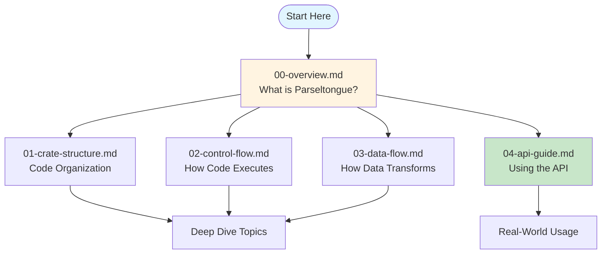

# Parseltongue Documentation

Complete documentation for understanding and using Parseltongue - a code analysis toolkit that turns your codebase into a queryable graph database.

## Documentation Structure



## Quick Navigation

### 🎯 New Users: Start Here

1. **[00-overview.md](00-overview.md)** - What Parseltongue does and why it's useful
   - High-level architecture
   - Key concepts (ELI5 style)
   - Workflow examples

### 📚 Understanding the Code

2. **[01-crate-structure.md](01-crate-structure.md)** - How the project is organized
   - Directory layout
   - Crate dependency graph
   - Module breakdown

3. **[02-control-flow.md](02-control-flow.md)** - How execution flows
   - pt01 ingestion flow
   - pt08 HTTP server flow
   - Request handling
   - Advanced analysis algorithms

4. **[03-data-flow.md](03-data-flow.md)** - How data is transformed
   - Source code → AST → Entities
   - Database storage format
   - Query results → JSON
   - Complex transformations

### 🚀 Using the API

5. **[04-api-guide.md](04-api-guide.md)** - Complete API reference
   - All 14 endpoints explained (ELI5)
   - Real-world use cases
   - Code examples
   - Performance tips

## What's Inside Each Document

### 00-overview.md
```
- What is Parseltongue?
- High-level architecture diagram
- Project statistics
- Crate structure overview
- How it works (ELI5)
- Why use it?
```

### 01-crate-structure.md
```
- Directory layout
- Dependency graph
- Crate details:
  - parseltongue (binary)
  - parseltongue-core (library)
  - pt01-folder-to-cozodb-streamer
  - pt08-http-code-query-server
- File organization
- Cross-crate communication
```

### 02-control-flow.md
```
- Top-level flow
- pt01 ingestion flow
- pt08 HTTP server flow
- Advanced analysis flows:
  - Blast radius calculation
  - Circular dependency detection
  - File watching
- Error handling flow
```

### 03-data-flow.md
```
- End-to-end transformation
- Stage 1: Source code → AST
- Stage 2: AST → Entities & Edges
- Stage 3: Entities/Edges → Database
- Stage 4: Database → Query results
- Stage 5: Query results → JSON
- Complex transformations
- Data format summary
```

### 04-api-guide.md
```
- Quick start guide
- 14 API endpoints:
  - Core (3 endpoints)
  - Entity (3 endpoints)
  - Edge (3 endpoints)
  - Analysis (5 endpoints)
- Real-world use cases
- Common patterns
- Error handling
- Performance tips
```

## Key Diagrams

### Architecture Overview

See [00-overview.md](00-overview.md) for:
- High-level architecture
- Crate structure
- Workflow sequence diagram

### Control Flow

See [02-control-flow.md](02-control-flow.md) for:
- Top-level routing
- Ingestion flowchart
- HTTP request handling
- DFS cycle detection

### Data Flow

See [03-data-flow.md](03-data-flow.md) for:
- End-to-end transformation pipeline
- Tree-sitter parsing
- Entity extraction
- Database schema (ER diagram)

### API Usage

See [04-api-guide.md](04-api-guide.md) for:
- API endpoint categories (mindmap)
- Blast radius visualization
- Circular dependency cycles
- Complexity hotspots

## Cheat Sheet

### Installation

```bash
curl -L https://github.com/that-in-rust/parseltongue-dependency-graph-generator/releases/download/v1.4.2/parseltongue -o parseltongue
chmod +x parseltongue
```

### Ingestion

```bash
./parseltongue pt01-folder-to-cozodb-streamer /path/to/code
```

### Start Server

```bash
./parseltongue pt08-http-code-query-server \
  --db "rocksdb:parseltongue{TIMESTAMP}/analysis.db"
```

### Essential Queries

```bash
# Health check
curl http://localhost:7777/server-health-check-status

# Search for entities
curl "http://localhost:7777/code-entities-search-fuzzy?q=main"

# Find who calls a function
curl "http://localhost:7777/reverse-callers-query-graph?entity=rust:fn:calculate"

# Analyze impact
curl "http://localhost:7777/blast-radius-impact-analysis?entity=rust:fn:main&hops=3"

# Find circular dependencies
curl http://localhost:7777/circular-dependency-detection-scan

# Find complex code
curl "http://localhost:7777/complexity-hotspots-ranking-view?top=10"
```

## Common Questions

### "Where do I start?"

Read [00-overview.md](00-overview.md) to understand what Parseltongue does, then jump to [04-api-guide.md](04-api-guide.md) to start using it.

### "How does the code work internally?"

Read in order:
1. [01-crate-structure.md](01-crate-structure.md) - See how code is organized
2. [02-control-flow.md](02-control-flow.md) - Understand execution flow
3. [03-data-flow.md](03-data-flow.md) - See data transformations

### "How do I use the API?"

[04-api-guide.md](04-api-guide.md) has everything:
- All 14 endpoints explained
- Real-world examples
- Common patterns
- Performance tips

### "How does ingestion work?"

See [02-control-flow.md](02-control-flow.md) - pt01 Ingestion Flow section

### "How are entities extracted from code?"

See [03-data-flow.md](03-data-flow.md) - Stage 2: AST → Entities & Edges

### "What's the database schema?"

See [03-data-flow.md](03-data-flow.md) - Stage 3: Database Schema

### "How does blast radius work?"

See [02-control-flow.md](02-control-flow.md) - Blast Radius Calculation

### "How does circular dependency detection work?"

See [02-control-flow.md](02-control-flow.md) - Circular Dependency Detection

## Key Concepts (ELI5)

### CodeEntity
A "thing" in your code: function, class, struct, etc.
```
rust:fn:main:__src_main_rs:1-10
 │    │   │         │         │
 │    │   │         │         └─ Lines 1-10
 │    │   │         └─────────── File: src/main.rs
 │    │   └───────────────────── Name: main
 │    └───────────────────────── Type: function
 └────────────────────────────── Language: rust
```

### DependencyEdge
A "connection" between things: "Function A calls Function B"
```
from: rust:fn:main
to:   rust:fn:calculate_sum
type: Calls
```

### Blast Radius
"If I change X, how many things are affected?"
```
Change calculate_sum →
  Affects main (uses it) →
    Affects run_app (uses main) →
      Affects 15 total things
```

### Circular Dependency
"A needs B, B needs C, C needs A" - an impossible loop
```
fn_a calls fn_b
fn_b calls fn_c
fn_c calls fn_a  ← Cycle!
```

### Complexity Hotspot
Code with lots of connections (hard to change)
```
handle_request:
  - Called by 20 functions
  - Calls 25 other functions
  → High coupling = Complex = Risky to change
```

### Smart Context
"Give me the most relevant code for this function, within 4000 tokens"
```
Focus on main →
  Include direct dependencies (100%)
  Include same-file entities (80%)
  Include transitive deps (40%)
  Stop at 4000 tokens
```

## Statistics

This codebase analyzed itself with Parseltongue:

- **Total Entities**: 230 (functions, structs, traits, etc.)
- **Total Edges**: 3,864 (function calls, uses relationships)
- **Languages**: Rust
- **Files Processed**: 85
- **Ingestion Time**: <1 second
- **Token Reduction**: 99% (5K tokens vs 500K raw dump)

## Contributing

Found an issue? Want to improve the docs?
- GitHub: https://github.com/that-in-rust/parseltongue-dependency-graph-generator
- Issues: https://github.com/that-in-rust/parseltongue-dependency-graph-generator/issues

## Version

Documentation for Parseltongue v1.4.2 (HTTP-only architecture with always-on file watching)

---

**Next:** Start with [00-overview.md](00-overview.md) to understand what Parseltongue does!
