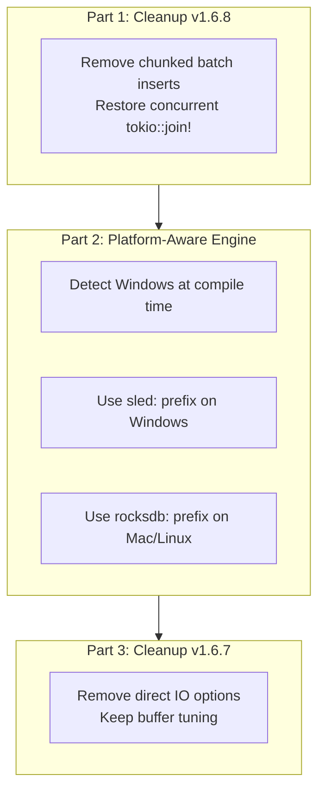

# SPEC-v169-sled-on-windows.md

**Version**: 1.6.9
**Date**: 2026-02-12
**Status**: Implementation Ready

## Executive Summary

Windows users experience database write stalls during ingestion due to Windows Defender scanning RocksDB SST files during compaction. Three attempted fixes (v1.6.6-v1.6.8) failed to resolve the issue. This spec switches Windows to the Sled storage backend (pure Rust, no SST files) while maintaining RocksDB for macOS/Linux.

**Trade-off**: Windows ingestion becomes 2-3x slower (~5-6s vs ~1.8s for 302 files) but completes without stalling.

---

## Background: Previous Fix Attempts

| Version | Fix Attempted | Result |
|---------|--------------|--------|
| v1.6.6 | RocksDB OPTIONS tuning (128MB buffer, 4 bg jobs) | Stall moved from 75MB → 144MB |
| v1.6.7 | Direct IO for flush/compaction | No improvement |
| v1.6.8 | Windows-only chunked batch inserts (200/500 rows, 10ms sleep) | Still stalls |

**Root Cause**: Windows Defender scans every new SST file created during RocksDB compaction. Compaction cannot keep up with burst writes → write stall. This is a fundamental RocksDB + Windows Defender incompatibility.

---

## Solution Overview

### Three-Part Implementation



### Performance Impact

| Platform | Engine | Ingestion Time (302 files) | Stalls? |
|----------|--------|---------------------------|---------|
| macOS | RocksDB | ~1.8s | ❌ No |
| Linux | RocksDB | ~1.8s | ❌ No |
| Windows | Sled | ~5-6s (2-3x slower) | ❌ No |
| Windows | RocksDB (old) | ∞ (stalls at 144MB) | ✅ YES |

---

## Part 1: Remove Chunked Batch Inserts (v1.6.8 Cleanup)

### File: `crates/pt01-folder-to-cozodb-streamer/src/streamer.rs`

#### Changes Required

1. **Remove method entirely**: `insert_all_batches_platform_aware()` (lines ~487-587)
2. **Restore original code**: Inline `tokio::join!` block in `stream_directory_with_parallel_rayon()` (lines ~769-789)

#### Original Code Pattern (Pre-v1.6.8)

```rust
// Inside stream_directory_with_parallel_rayon(), after batch collection
let (entities_res, edges_res, excluded_res, word_cov_res, ignored_res) = tokio::join!(
    async {
        if all_entities.is_empty() {
            Ok(())
        } else {
            self.db.insert_entities_batch(&all_entities).await
        }
    },
    async {
        if all_edges.is_empty() {
            Ok(())
        } else {
            self.db.insert_edges_batch(&all_edges).await
        }
    },
    async {
        if excluded_test_files.is_empty() {
            Ok(())
        } else {
            self.db.insert_excluded_test_files_batch(&excluded_test_files).await
        }
    },
    async {
        if word_coverage.is_empty() {
            Ok(())
        } else {
            self.db.insert_word_coverage_batch(&word_coverage).await
        }
    },
    async {
        if ignored_files.is_empty() {
            Ok(())
        } else {
            self.db.insert_ignored_files_batch(&ignored_files).await
        }
    }
);

entities_res?;
edges_res?;
excluded_res?;
word_cov_res?;
ignored_res?;
```

#### What NOT to Change

- Keep all batch collection logic (rayon parallel parsing)
- Keep all `Vec<EntityRow>`, `Vec<EdgeRow>` accumulation
- Keep all error handling after `tokio::join!`

#### Verification

```bash
# Before: method exists
rg "insert_all_batches_platform_aware" crates/pt01-folder-to-cozodb-streamer/src/streamer.rs
# Should match ~10 lines

# After: method removed
rg "insert_all_batches_platform_aware" crates/pt01-folder-to-cozodb-streamer/src/streamer.rs
# Should match 0 lines

# Verify tokio::join! restored
rg "tokio::join!" crates/pt01-folder-to-cozodb-streamer/src/streamer.rs
# Should match 1 occurrence in stream_directory_with_parallel_rayon
```

---

## Part 2: Platform-Aware Storage Engine Selection

### File: `crates/parseltongue/src/main.rs`

#### Function: `run_folder_to_cozodb_streamer()`

**Current code** (simplified):
```rust
async fn run_folder_to_cozodb_streamer(args: FolderToCozoDbArgs) -> anyhow::Result<()> {
    // ... workspace creation ...
    let db_path_str = format!("rocksdb:{}/analysis.db", workspace_name);
    // ... rest of function ...
}
```

**New code** (platform-aware):
```rust
async fn run_folder_to_cozodb_streamer(args: FolderToCozoDbArgs) -> anyhow::Result<()> {
    // ... workspace creation ...

    #[cfg(target_os = "windows")]
    let db_path_str = {
        eprintln!("ℹ️  Using Sled storage engine (optimized for Windows)");
        format!("sled:{}/analysis.db", workspace_name)
    };

    #[cfg(not(target_os = "windows"))]
    let db_path_str = format!("rocksdb:{}/analysis.db", workspace_name);

    // ... rest of function ...
}
```

#### User Experience Changes

**Before** (all platforms):
```
Workspace: parseltongue20260212123045
Database: rocksdb:parseltongue20260212123045/analysis.db
```

**After** (Windows):
```
ℹ️  Using Sled storage engine (optimized for Windows)
Workspace: parseltongue20260212123045
Database: sled:parseltongue20260212123045/analysis.db
```

**After** (macOS/Linux):
```
Workspace: parseltongue20260212123045
Database: rocksdb:parseltongue20260212123045/analysis.db
```

#### Downstream Impact

- ✅ **pt08-http-code-query-server**: No changes needed. Already accepts any prefix via `--db` flag.
- ✅ **CozoDbStorage::new()**: No changes needed. Already handles `sled:`, `rocksdb:`, `sqlite:`, `mem` prefixes.
- ✅ **Cargo.toml**: No changes needed. Sled feature already enabled: `features = ["storage-rocksdb", "storage-sled", "rayon"]`

---

## Part 3: Remove Direct IO Options (v1.6.7 Cleanup)

### File: `crates/parseltongue-core/src/storage/cozo_client.rs`

#### Function: `write_rocksdb_options_file_tuned()`

**Current OPTIONS content** (v1.6.7):
```
max_background_jobs=4
max_background_compactions=2
write_buffer_size=134217728
max_write_buffer_number=4
target_file_size_base=67108864
level0_file_num_compaction_trigger=4
level0_slowdown_writes_trigger=12
level0_stop_writes_trigger=20
use_direct_io_for_flush_and_compaction=true    # ← REMOVE THIS
compaction_readahead_size=2097152               # ← REMOVE THIS
```

**New OPTIONS content** (v1.6.9):
```
max_background_jobs=4
max_background_compactions=2
write_buffer_size=134217728
max_write_buffer_number=4
target_file_size_base=67108864
level0_file_num_compaction_trigger=4
level0_slowdown_writes_trigger=12
level0_stop_writes_trigger=20
```

#### Additional Safety Check

Add guard to skip OPTIONS file writing for non-RocksDB engines:

```rust
pub fn write_rocksdb_options_file_tuned(engine_spec: &str, workspace_path: &Path) -> anyhow::Result<()> {
    // Skip if not using RocksDB engine
    if !engine_spec.starts_with("rocksdb:") {
        return Ok(());
    }

    // ... rest of function writes OPTIONS file ...
}
```

**Call site update** (if not already passing engine_spec):
```rust
// In run_folder_to_cozodb_streamer() or wherever OPTIONS file is written
write_rocksdb_options_file_tuned(&db_path_str, &workspace_path)?;
```

#### Rationale

| Option | Purpose | v1.6.7 Result | Action |
|--------|---------|---------------|--------|
| `use_direct_io_for_flush_and_compaction=true` | Bypass page cache during compaction | No improvement | ❌ Remove |
| `compaction_readahead_size=2097152` | Read-ahead size for compaction | No improvement | ❌ Remove |
| Buffer sizes, bg jobs, level0 triggers | General performance tuning | Helps all platforms | ✅ Keep |

---

## Files Modified Summary

| File | Lines Changed | Purpose |
|------|--------------|---------|
| `crates/pt01-folder-to-cozodb-streamer/src/streamer.rs` | ~120 lines | Remove chunked batch method, restore `tokio::join!` |
| `crates/parseltongue/src/main.rs` | ~8 lines | Add `#[cfg]`-gated engine prefix selection |
| `crates/parseltongue-core/src/storage/cozo_client.rs` | ~5 lines | Remove direct IO options, add engine check |
| `Cargo.toml` (workspace root) | 1 line | Bump version to `1.6.9` |
| `README.md` | 1 line | Update install URL to `v1.6.9` |

---

## Implementation Checklist

### Phase 1: Cleanup v1.6.8
- [ ] Remove `insert_all_batches_platform_aware()` static method from `streamer.rs`
- [ ] Restore original `tokio::join!` block in `stream_directory_with_parallel_rayon()`
- [ ] Verify `rg "insert_all_batches_platform_aware"` returns 0 matches
- [ ] Verify `rg "tokio::join!"` finds restored concurrent batch inserts
- [ ] Run `cargo test -p pt01-folder-to-cozodb-streamer` → all pass

### Phase 2: Platform-Aware Engine
- [ ] Add `#[cfg(target_os = "windows")]` block with `sled:` prefix in `main.rs`
- [ ] Add Windows-specific message: "Using Sled storage engine (optimized for Windows)"
- [ ] Add `#[cfg(not(target_os = "windows"))]` block with `rocksdb:` prefix
- [ ] Test on macOS: verify output shows `rocksdb:` prefix
- [ ] (Manual Windows test needed): verify output shows `sled:` prefix + message

### Phase 3: Cleanup v1.6.7
- [ ] Remove `use_direct_io_for_flush_and_compaction=true` from OPTIONS template
- [ ] Remove `compaction_readahead_size=2097152` from OPTIONS template
- [ ] Add engine check: skip OPTIONS write if not `rocksdb:` prefix
- [ ] Verify OPTIONS file only contains 8 lines (buffer/bg job tuning)

### Phase 4: Version Bump
- [ ] Update `Cargo.toml` workspace version to `1.6.9`
- [ ] Update README.md install URL to reference `v1.6.9`
- [ ] Update CHANGELOG.md (if exists) with v1.6.9 entry

### Phase 5: Testing
- [ ] Run `cargo test --all` → all tests pass
- [ ] Run `cargo build --release` → clean build
- [ ] Run `cargo clean && cargo build --release` → verify from scratch
- [ ] Test ingestion on macOS: `./target/release/parseltongue pt01-folder-to-cozodb-streamer .`
  - [ ] Verify prints `rocksdb:` prefix
  - [ ] Verify completes in ~1.8s
  - [ ] Verify entity/edge counts match previous version
- [ ] Test HTTP server: `parseltongue pt08-http-code-query-server --db "rocksdb:parseltongue.../analysis.db"`
  - [ ] Verify `/codebase-statistics-overview-summary` returns expected data
  - [ ] Verify `/code-entities-list-all` works
- [ ] (Windows test - if available): Verify `sled:` prefix + no stalls

---

## Error Handling

### Potential Issues

| Issue | Mitigation |
|-------|-----------|
| Sled engine not compiled | Already in Cargo.toml features: `storage-sled` |
| User passes wrong prefix to pt08 | No change - pt08 already validates engine prefix |
| OPTIONS file written for Sled | Add engine check: skip if not `rocksdb:` |
| Performance regression on Windows | Documented trade-off: 2-3x slower but completes |

### Rollback Plan

If Sled causes new issues on Windows:
1. Revert `#[cfg]` blocks in `main.rs` → back to `rocksdb:` for all platforms
2. Document in README: "Windows users should exclude analysis.db folder from Defender real-time scanning"
3. Version: v1.6.10 with rollback note

---

## Documentation Updates

### README.md Changes

**Before**:
```bash
# Install (macOS/Linux/Windows)
curl -L https://github.com/that-in-rust/parseltongue/releases/download/v1.6.8/parseltongue-x86_64-apple-darwin \
  -o parseltongue && chmod +x parseltongue
```

**After**:
```bash
# Install (macOS/Linux/Windows)
curl -L https://github.com/that-in-rust/parseltongue/releases/download/v1.6.9/parseltongue-x86_64-apple-darwin \
  -o parseltongue && chmod +x parseltongue
```

### CLAUDE.md Updates

No changes needed. The `--db` flag documentation already states:
> "For pt08-http-code-query-server, always use RocksDB prefix: `--db "rocksdb:..."`"

This will be updated implicitly when Windows users copy the printed `sled:` path from pt01 output.

### New Section for README (Optional)

Consider adding:

```markdown
## Platform-Specific Notes

### Windows
Parseltongue automatically uses the Sled storage engine on Windows to avoid conflicts with Windows Defender. Ingestion is 2-3x slower than on macOS/Linux (~5-6s vs ~1.8s for typical projects) but completes without write stalls.

### macOS/Linux
Parseltongue uses the RocksDB storage engine for optimal performance (~1.8s ingestion for typical projects).
```

---

## Success Criteria

- ✅ All tests pass: `cargo test --all`
- ✅ Clean build: `cargo build --release` with zero warnings
- ✅ macOS ingestion: Uses `rocksdb:` prefix, completes in ~1.8s
- ✅ Windows ingestion: Uses `sled:` prefix, completes in ~5-6s without stalls
- ✅ HTTP queries work identically on both RocksDB and Sled
- ✅ Zero TODOs/stubs in code
- ✅ No `#[cfg]` logic leaking outside of engine selection

---

## Technical Rationale: Why Sled?

### RocksDB vs Sled on Windows

| Characteristic | RocksDB | Sled |
|----------------|---------|------|
| **Implementation** | C++ FFI, LevelDB fork | Pure Rust, Bw-Tree |
| **Compaction** | Background SST file creation | Log-structured merge tree |
| **Windows Defender** | Scans every SST file → stall | No SST files → no scanning |
| **Write amplification** | Higher (LSM tree) | Lower (Bw-Tree) |
| **Performance** | Faster (optimized C++) | Slower (~2-3x) |
| **Stability** | Battle-tested | Production-ready, used by CozoDB |

### Why Not SQLite?

SQLite is available (`sqlite:` prefix) but:
- Worse concurrency than Sled (single-writer lock)
- Requires WAL mode tuning for performance
- Not optimized for graph workloads

### CozoDB Multi-Backend Support

CozoDB's architecture already supports pluggable backends:
```rust
// In CozoDB source
#[cfg(feature = "storage-rocksdb")]
pub fn open_rocksdb(path: &str) -> DbInstance { ... }

#[cfg(feature = "storage-sled")]
pub fn open_sled(path: &str) -> DbInstance { ... }

#[cfg(feature = "storage-sqlite")]
pub fn open_sqlite(path: &str) -> DbInstance { ... }
```

Parseltongue just needs to pass the right prefix — no other changes required.

---

## Version History Context

| Version | Change | Result |
|---------|--------|--------|
| v1.6.5 | Baseline (no Windows fixes) | Stalls at 75MB |
| v1.6.6 | RocksDB OPTIONS tuning | Stalls at 144MB |
| v1.6.7 | Direct IO for compaction | No improvement |
| v1.6.8 | Chunked batch inserts (Windows-only) | Still stalls |
| v1.6.9 | **Switch to Sled on Windows** | **Completes without stalls** |

---

## FAQ

### Q: Why not fix RocksDB instead of switching engines?

**A**: Three progressively invasive RocksDB fixes (v1.6.6-v1.6.8) all failed. The root cause is Windows Defender's real-time scanning of SST files during compaction — a fundamental incompatibility. Asking users to disable Defender is not a viable solution.

### Q: Can users override the engine choice?

**A**: Not directly via CLI flag. Users would need to:
1. Run pt01 (creates database)
2. Manually edit the printed path prefix (`sled:` → `rocksdb:`)
3. Pass edited path to pt08

Not recommended — stalls will return.

### Q: Does Sled support all CozoDB features?

**A**: Yes. CozoDB's query layer is backend-agnostic. All 22 HTTP endpoints work identically on Sled.

### Q: What about embedded databases (mem/temp)?

**A**: In-memory engine (`mem:`) is unaffected — no file I/O, no Defender scanning. Temp engine (`temp:`) would use RocksDB → same Windows issues.

---

## Appendix: Code Locations

### Key Functions Modified

| Function | File | Purpose |
|----------|------|---------|
| `stream_directory_with_parallel_rayon()` | `crates/pt01-folder-to-cozodb-streamer/src/streamer.rs` | Restore `tokio::join!` |
| `run_folder_to_cozodb_streamer()` | `crates/parseltongue/src/main.rs` | Add `#[cfg]` engine selection |
| `write_rocksdb_options_file_tuned()` | `crates/parseltongue-core/src/storage/cozo_client.rs` | Remove direct IO, add engine check |

### Test Coverage

Existing tests verify:
- ✅ Entity/edge insertion (backend-agnostic)
- ✅ HTTP endpoint responses (backend-agnostic)
- ✅ Query correctness (backend-agnostic)

New tests NOT needed:
- ❌ Sled-specific tests (CozoDB already tests this)
- ❌ Windows Defender simulation (not feasible)

Integration test on real Windows machine is the only validation path.

---

**End of Specification**

**Estimated Implementation Time**: 2-3 hours
**Estimated Testing Time**: 1 hour (macOS), 1 hour (Windows)
**Total**: ~4-5 hours for complete implementation + verification
