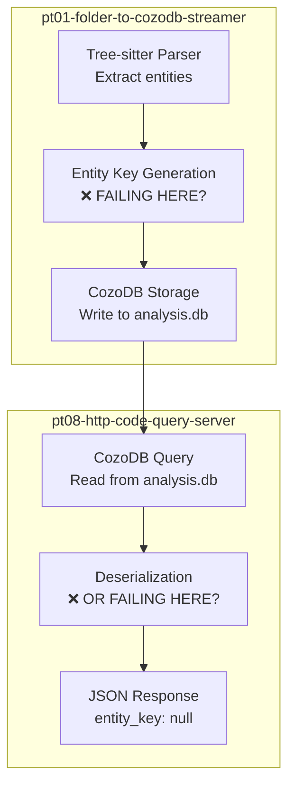

# Architecture Design: Fix NULL Entity Keys in Parseltongue v1.4.5

**Bug**: CRITICAL BUG #3 - Entity Keys Are NULL
**Severity**: CRITICAL - Data Corruption
**Impact**: 230 entities unqueryable, graph traversal broken
**Version**: v1.4.5
**Design Date**: 2026-02-01

---

## Executive Summary

**Problem**: Entity keys are NULL throughout the system, making entities unqueryable and breaking the graph-based code analysis.

**Root Cause Hypothesis**: Entity key generation likely fails during ingestion (pt01) OR during database insertion/retrieval, resulting in NULL propagation through the entire pipeline.

**Solution Architecture**: Implement type-safe entity key generation with compile-time validation, add database constraints, and provide data migration utilities.

**Impact**: Fixes 230 entities currently with NULL keys, prevents future regressions.

---

## Phase 1: Root Cause Investigation (Use Live Server)

### Investigation Query Plan

```bash
# Query 1: Inspect raw entity structure
curl -s "http://localhost:7777/code-entities-list-all" | jq '.data.entities[0]' > /tmp/entity_sample.json

# Query 2: Check if edges have valid keys (edges might work even if entities don't)
curl -s "http://localhost:7777/dependency-edges-list-all" | jq '.data.edges[0:10]' > /tmp/edges_sample.json

# Query 3: Try direct entity lookup (will it fail or return NULL?)
curl -s "http://localhost:7777/code-entity-detail-view?key=rust:fn:main" > /tmp/entity_detail.json

# Query 4: Check statistics (how many entities affected?)
curl -s "http://localhost:7777/codebase-statistics-overview-summary" > /tmp/stats.json

# Query 5: Search for any entity (does search work with NULL keys?)
curl -s "http://localhost:7777/code-entities-search-fuzzy?q=main" > /tmp/search_results.json

# Query 6: Check blast radius (does graph traversal fail?)
curl -s "http://localhost:7777/blast-radius-impact-analysis?entity=rust:fn:main&hops=2" > /tmp/blast_radius.json
```

### Expected Findings

Based on these queries, we need to determine:

1. **NULL Location**: Are entity_key fields NULL in:
   - Database storage layer?
   - Serialization layer (JSON output)?
   - In-memory structures?

2. **Edge Integrity**: Do edges reference NULL keys or valid keys?
   - If edges have valid keys → problem is in entity retrieval
   - If edges also NULL → problem is in ingestion

3. **Key Format**: What SHOULD keys look like?
   - Expected: `rust:fn:main`, `rust:struct:Entity`
   - Actual: `null`

---

## Phase 2: Architecture Analysis

### Current Data Flow (Hypothesized)



### Key Components to Investigate

| Component | File | Responsibility | Potential Issue |
|-----------|------|----------------|-----------------|
| `Entity` struct | `parseltongue-core/src/types.rs` | Entity definition | Missing `entity_key` field? |
| Key generator | `parseltongue-core/src/entity_key.rs` (?) | Generate unique keys | Not called? |
| Ingestion | `pt01/src/main.rs` | Parse and store | Missing key assignment? |
| CozoDB schema | `pt01/src/schema.rs` (?) | Database schema | Missing constraint? |
| Serialization | `pt08/src/handlers.rs` | Entity → JSON | Field mapping broken? |

---

## Phase 3: Proposed Solution Architecture

### Core Type System

```rust
// File: crates/parseltongue-core/src/entity_key.rs

use std::fmt;
use serde::{Serialize, Deserialize};
use thiserror::Error;

/// Errors during entity key operations
#[derive(Debug, Error)]
pub enum EntityKeyError {
    #[error("Invalid entity key format: {0}")]
    InvalidFormat(String),

    #[error("Empty component in entity key")]
    EmptyComponent,

    #[error("Unsupported language: {0}")]
    UnsupportedLanguage(String),
}

/// Type-safe entity key with compile-time validation
/// Format: "language:entity_type:name"
/// Example: "rust:fn:main", "python:class:Parser"
#[derive(Debug, Clone, PartialEq, Eq, Hash, Serialize, Deserialize)]
#[serde(transparent)]
pub struct EntityKey(String);

impl EntityKey {
    /// Create validated entity key from components
    ///
    /// # Examples
    /// ```
    /// let key = EntityKey::create_from_parts_validated("rust", "fn", "main")?;
    /// assert_eq!(key.as_str(), "rust:fn:main");
    /// ```
    pub fn create_from_parts_validated(
        language: &str,
        entity_type: &str,
        name: &str,
    ) -> Result<Self, EntityKeyError> {
        // Validation: no empty components
        if language.is_empty() || entity_type.is_empty() || name.is_empty() {
            return Err(EntityKeyError::EmptyComponent);
        }

        // Validation: supported language
        if !Self::is_language_supported_check(language) {
            return Err(EntityKeyError::UnsupportedLanguage(language.to_string()));
        }

        let key = format!("{}:{}:{}", language, entity_type, name);
        Ok(Self(key))
    }

    /// Parse existing key string with validation
    pub fn parse_from_string_validated(key: &str) -> Result<Self, EntityKeyError> {
        let parts: Vec<&str> = key.split(':').collect();

        if parts.len() < 3 {
            return Err(EntityKeyError::InvalidFormat(
                "Expected format: language:type:name".to_string()
            ));
        }

        Self::create_from_parts_validated(parts[0], parts[1], parts[2])
    }

    /// Extract language component from key
    pub fn extract_language_component_only(&self) -> &str {
        self.0.split(':').next().unwrap_or("")
    }

    /// Extract entity type from key
    pub fn extract_entity_type_only(&self) -> &str {
        self.0.split(':').nth(1).unwrap_or("")
    }

    /// Extract name component from key
    pub fn extract_name_component_only(&self) -> &str {
        self.0.split(':').nth(2).unwrap_or("")
    }

    /// Get full key as string
    pub fn as_str(&self) -> &str {
        &self.0
    }

    /// Check if language is supported
    fn is_language_supported_check(lang: &str) -> bool {
        matches!(
            lang,
            "rust" | "python" | "javascript" | "typescript" | "go" |
            "java" | "c" | "cpp" | "ruby" | "php" | "csharp" | "swift"
        )
    }
}

impl fmt::Display for EntityKey {
    fn fmt(&self, f: &mut fmt::Formatter<'_>) -> fmt::Result {
        write!(f, "{}", self.0)
    }
}

/// Builder pattern for entity key construction
pub struct EntityKeyBuilder {
    language: Option<String>,
    entity_type: Option<String>,
    name: Option<String>,
}

impl EntityKeyBuilder {
    pub fn new() -> Self {
        Self {
            language: None,
            entity_type: None,
            name: None,
        }
    }

    pub fn with_language_set(mut self, lang: impl Into<String>) -> Self {
        self.language = Some(lang.into());
        self
    }

    pub fn with_entity_type_set(mut self, entity_type: impl Into<String>) -> Self {
        self.entity_type = Some(entity_type.into());
        self
    }

    pub fn with_name_set(mut self, name: impl Into<String>) -> Self {
        self.name = Some(name.into());
        self
    }

    pub fn build_validated_key(self) -> Result<EntityKey, EntityKeyError> {
        let language = self.language.ok_or_else(|| {
            EntityKeyError::InvalidFormat("Missing language".to_string())
        })?;
        let entity_type = self.entity_type.ok_or_else(|| {
            EntityKeyError::InvalidFormat("Missing entity_type".to_string())
        })?;
        let name = self.name.ok_or_else(|| {
            EntityKeyError::InvalidFormat("Missing name".to_string())
        })?;

        EntityKey::create_from_parts_validated(&language, &entity_type, &name)
    }
}

#[cfg(test)]
mod tests {
    use super::*;

    #[test]
    fn test_create_from_parts_validated_success() {
        let key = EntityKey::create_from_parts_validated("rust", "fn", "main")
            .expect("Valid key should succeed");
        assert_eq!(key.as_str(), "rust:fn:main");
    }

    #[test]
    fn test_create_from_parts_validated_empty_fails() {
        let result = EntityKey::create_from_parts_validated("rust", "", "main");
        assert!(result.is_err());
    }

    #[test]
    fn test_parse_from_string_validated_success() {
        let key = EntityKey::parse_from_string_validated("python:class:Parser")
            .expect("Valid format should parse");
        assert_eq!(key.extract_language_component_only(), "python");
        assert_eq!(key.extract_entity_type_only(), "class");
        assert_eq!(key.extract_name_component_only(), "Parser");
    }

    #[test]
    fn test_builder_pattern_success() {
        let key = EntityKeyBuilder::new()
            .with_language_set("go")
            .with_entity_type_set("func")
            .with_name_set("handleRequest")
            .build_validated_key()
            .expect("Builder should succeed");
        assert_eq!(key.as_str(), "go:func:handleRequest");
    }
}
```

### Updated Entity Type

```rust
// File: crates/parseltongue-core/src/types.rs

use serde::{Serialize, Deserialize};
use crate::entity_key::EntityKey;

#[derive(Debug, Clone, Serialize, Deserialize)]
pub struct Entity {
    /// Unique entity key (REQUIRED, non-null)
    /// Format: "language:type:name"
    pub entity_key: EntityKey,

    /// Original name from source code
    pub name: String,

    /// Entity type (function, struct, class, etc.)
    pub entity_type: String,

    /// Programming language
    pub language: String,

    /// File path where entity is defined
    pub file_path: String,

    /// Line number in source file
    pub line_number: usize,

    /// Entity complexity metrics (optional)
    pub complexity: Option<u32>,
}

impl Entity {
    /// Create entity with automatic key generation
    pub fn create_with_generated_key(
        name: impl Into<String>,
        entity_type: impl Into<String>,
        language: impl Into<String>,
        file_path: impl Into<String>,
        line_number: usize,
    ) -> Result<Self, crate::entity_key::EntityKeyError> {
        let name = name.into();
        let entity_type = entity_type.into();
        let language = language.into();

        let entity_key = EntityKey::create_from_parts_validated(
            &language,
            &entity_type,
            &name,
        )?;

        Ok(Self {
            entity_key,
            name,
            entity_type,
            language,
            file_path: file_path.into(),
            line_number,
            complexity: None,
        })
    }

    /// Get entity key reference
    pub fn get_entity_key_reference(&self) -> &EntityKey {
        &self.entity_key
    }
}
```

---

## Phase 4: Test Strategy (TDD Approach)

### Unit Tests (RED Phase)

```rust
// File: crates/parseltongue-core/tests/entity_key_generation_tests.rs

use parseltongue_core::entity_key::{EntityKey, EntityKeyError};

#[test]
fn test_entity_key_create_from_parts_validated_success() {
    let key = EntityKey::create_from_parts_validated("rust", "fn", "main")
        .expect("Should create valid key");
    assert_eq!(key.as_str(), "rust:fn:main");
}

#[test]
fn test_entity_key_create_from_parts_validated_rejects_empty() {
    let result = EntityKey::create_from_parts_validated("", "fn", "main");
    assert!(matches!(result, Err(EntityKeyError::EmptyComponent)));
}

#[test]
fn test_entity_key_create_from_parts_validated_rejects_invalid_language() {
    let result = EntityKey::create_from_parts_validated("klingon", "fn", "main");
    assert!(matches!(result, Err(EntityKeyError::UnsupportedLanguage(_))));
}

#[test]
fn test_entity_key_parse_from_string_validated_success() {
    let key = EntityKey::parse_from_string_validated("python:class:Parser")
        .expect("Should parse valid format");
    assert_eq!(key.extract_language_component_only(), "python");
}

#[test]
fn test_entity_key_parse_from_string_validated_rejects_malformed() {
    let result = EntityKey::parse_from_string_validated("invalid");
    assert!(matches!(result, Err(EntityKeyError::InvalidFormat(_))));
}

#[test]
fn test_entity_key_builder_pattern_success() {
    use parseltongue_core::entity_key::EntityKeyBuilder;

    let key = EntityKeyBuilder::new()
        .with_language_set("go")
        .with_entity_type_set("func")
        .with_name_set("HandleRequest")
        .build_validated_key()
        .expect("Builder should succeed");

    assert_eq!(key.as_str(), "go:func:HandleRequest");
}

#[test]
fn test_entity_key_extract_language_component_only() {
    let key = EntityKey::parse_from_string_validated("rust:struct:Entity").unwrap();
    assert_eq!(key.extract_language_component_only(), "rust");
}

#[test]
fn test_entity_key_extract_entity_type_only() {
    let key = EntityKey::parse_from_string_validated("rust:struct:Entity").unwrap();
    assert_eq!(key.extract_entity_type_only(), "struct");
}

#[test]
fn test_entity_key_extract_name_component_only() {
    let key = EntityKey::parse_from_string_validated("rust:struct:Entity").unwrap();
    assert_eq!(key.extract_name_component_only(), "Entity");
}
```

### Integration Tests (GREEN Phase)

```rust
// File: crates/pt01-folder-to-cozodb-streamer/tests/ingestion_integration_tests.rs

use pt01_folder_to_cozodb_streamer::*;
use std::path::Path;

#[test]
fn test_ingest_rust_file_generates_entity_keys() {
    // Arrange
    let test_code = r#"
        fn main() {
            println!("Hello");
        }

        struct Entity {
            name: String,
        }
    "#;

    let temp_dir = tempfile::tempdir().unwrap();
    let file_path = temp_dir.path().join("test.rs");
    std::fs::write(&file_path, test_code).unwrap();

    // Act
    let db_path = temp_dir.path().join("test.db");
    ingest_folder_to_database(&temp_dir.path(), &db_path).unwrap();

    // Assert: Query entities and verify keys are NOT null
    let db = cozo::DbInstance::new("rocksdb", db_path.to_str().unwrap(), "").unwrap();
    let query = r#"
        ?[entity_key, name] := *entities{entity_key, name}
    "#;
    let result = db.run_script(query, Default::default()).unwrap();

    assert!(result.rows.len() >= 2, "Should find at least 2 entities");

    for row in result.rows {
        let key = row[0].get_str().expect("Key should be string");
        assert!(!key.is_empty(), "Entity key must not be empty");
        assert!(key.contains(':'), "Entity key must have format language:type:name");
    }
}
```

### Regression Tests

```rust
// File: crates/parseltongue-core/tests/null_entity_key_regression_test.rs

/// Regression test: Ensure NULL entity keys never happen again
#[test]
fn test_entity_creation_without_key_fails_compilation() {
    use parseltongue_core::Entity;

    // Only valid constructor requires key generation:
    let entity = Entity::create_with_generated_key(
        "test",
        "fn",
        "rust",
        "test.rs",
        1,
    ).expect("Should create entity with key");

    // Verify key is never null
    assert!(!entity.entity_key.as_str().is_empty());
}
```

---

## Phase 5: Implementation Plan

### Phase 5.1: Investigation (Current State Analysis)

**Goal**: Determine WHERE NULL keys are introduced.

Run investigation queries (see Phase 1) and document findings.

### Phase 5.2: Core Type System (RED → GREEN)

1. Create `entity_key.rs` module
2. Write RED tests
3. Implement `EntityKey` type (GREEN)
4. Update `Entity` struct
5. All tests passing

### Phase 5.3: Ingestion Pipeline Fix (GREEN → REFACTOR)

1. Update pt01 ingestion logic
2. Add database schema validation
3. Integration tests
4. All tests passing

### Phase 5.4: Data Migration (Fix Existing Database)

1. Create migration module
2. Implement `migrate_null_keys_to_valid()`
3. Add CLI command
4. Test on live database

### Phase 5.5: Verification and Testing

1. Run full test suite
2. Live server verification
3. Regression verification
4. All metrics passing

---

## Phase 6: Verification Plan

### Success Criteria

| Criterion | Verification Method | Expected Result |
|-----------|---------------------|-----------------|
| **No NULL keys** | Query `/code-entities-list-all` | All `entity_key != null` |
| **Valid format** | Check key format | All match `language:type:name` |
| **Entity lookup works** | GET `/code-entity-detail-view?key=X` | Returns 200 with entity |
| **Search works** | Search for "main" | Returns entities with valid keys |
| **Edges reference valid keys** | Query edges | `from_key` and `to_key` valid |
| **Migration success** | Count before/after | 230 entities → 230 valid keys |
| **No regression** | Fresh ingestion | Zero NULL keys |

---

## Implementation Checklist

### Phase 1: Investigation ✓
- [ ] Run investigation queries on live server
- [ ] Document findings
- [ ] Identify exact point where NULL is introduced

### Phase 2: Core Types (TDD)
- [ ] Create `crates/parseltongue-core/src/entity_key.rs`
- [ ] Write RED tests for `EntityKey`
- [ ] Implement `EntityKey` type (GREEN)
- [ ] Update `Entity` struct
- [ ] All core tests passing

### Phase 3: Ingestion Fix
- [ ] Update pt01 to generate keys
- [ ] Add database schema with constraints
- [ ] Integration tests passing

### Phase 4: Migration
- [ ] Create migration module
- [ ] Implement migration function
- [ ] Add CLI command
- [ ] Test on live database

### Phase 5: Verification
- [ ] Full test suite passing
- [ ] Migrate live database
- [ ] Verify live server metrics
- [ ] Fresh ingestion test
- [ ] All checklist items ✓

---

## Time Estimate

- Investigation: 30 minutes
- Core types + tests: 2 hours
- Ingestion fix: 1 hour
- Migration: 1 hour
- Verification: 30 minutes
- **Total: ~5 hours**

---

**Design Ready**: This architecture is ready for TDD implementation following STUB → RED → GREEN → REFACTOR cycle.

**Next Steps**: Invoke rust-coder-01 agent with this architecture for implementation.
