# v152 Async Pipeline Architecture Diagrams

**Version**: 1.5.2
**Date**: 2026-02-07

---

## Table of Contents

1. [Current Architecture (v1.4.7)](#current-architecture-v147)
2. [Target Architecture (v1.5.2)](#target-architecture-v152)
3. [Write Queue Pattern](#write-queue-pattern)
4. [Streaming Pipeline](#streaming-pipeline)
5. [Database Migration Path](#database-migration-path)

---

## Current Architecture (v1.4.7)

### Sequential File Processing

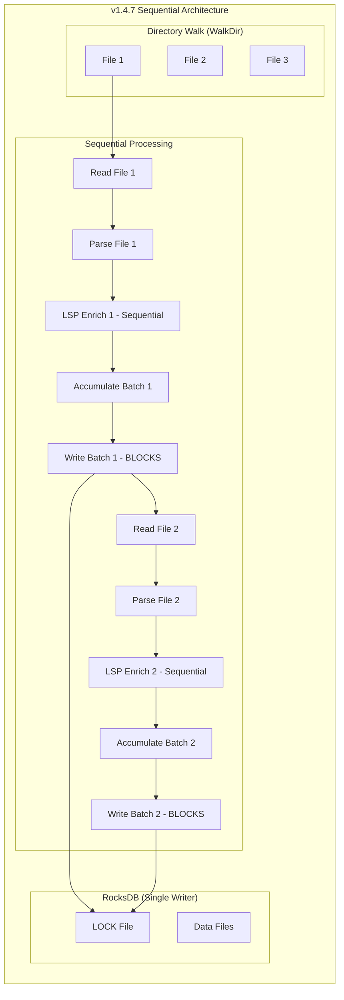

### Problems with Current Architecture

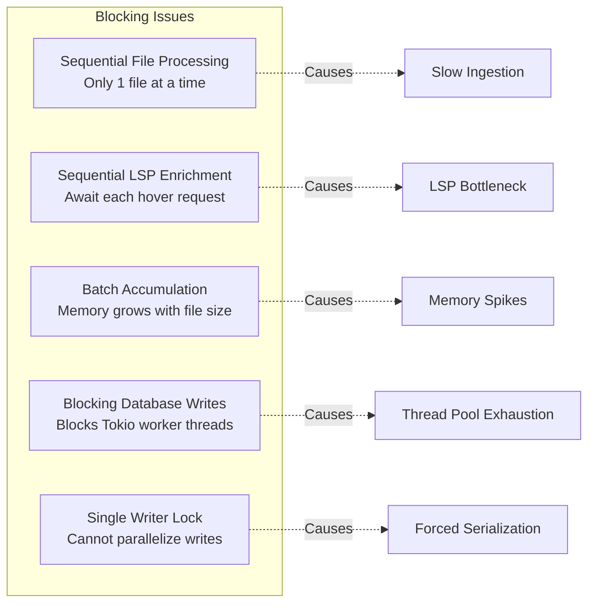

---

## Target Architecture (v1.5.2)

### Async Pipeline with Write Queue

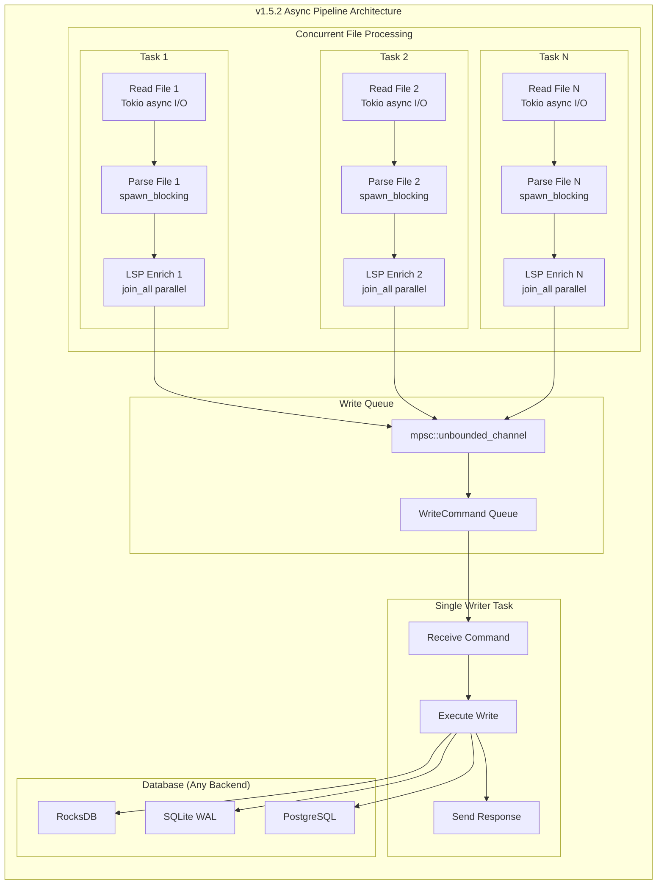

### Benefits of New Architecture

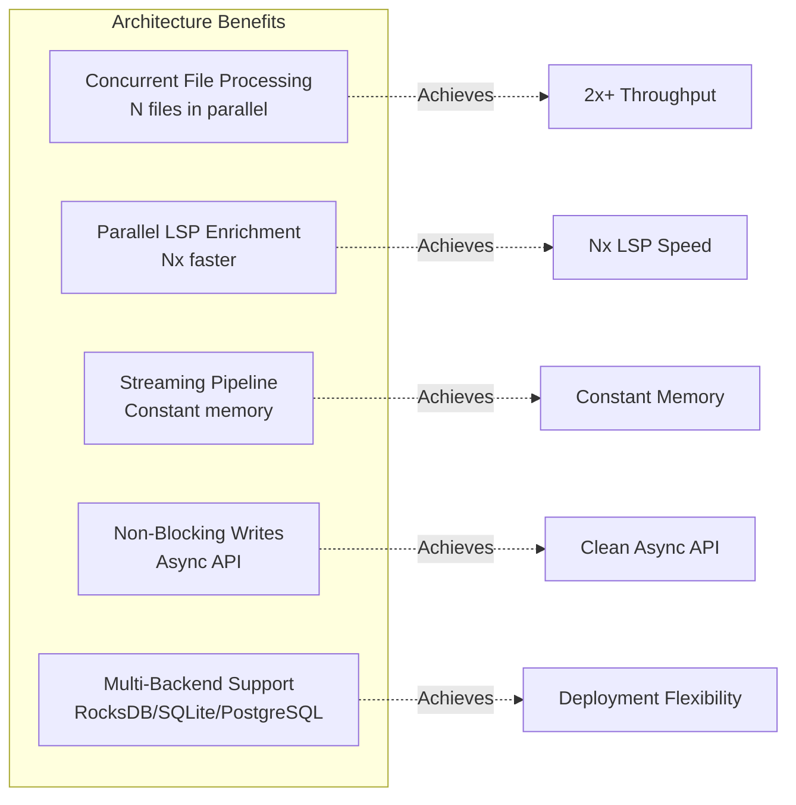

---

## Write Queue Pattern

### Request-Response Flow

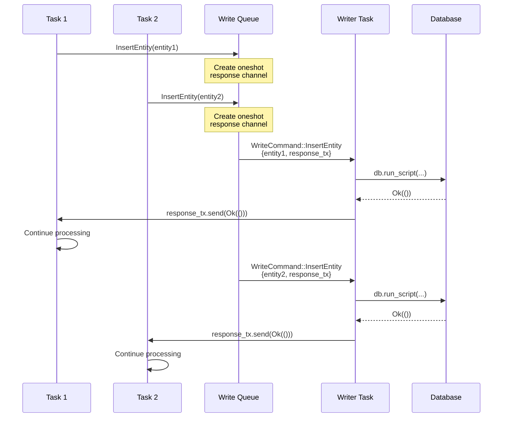

### Write Queue Implementation

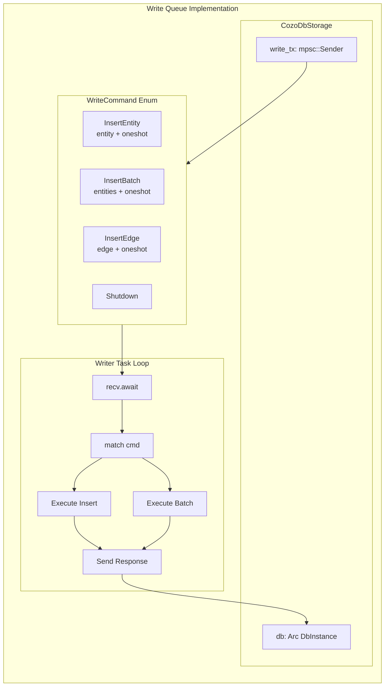

---

## Streaming Pipeline

### Entity Processing Flow

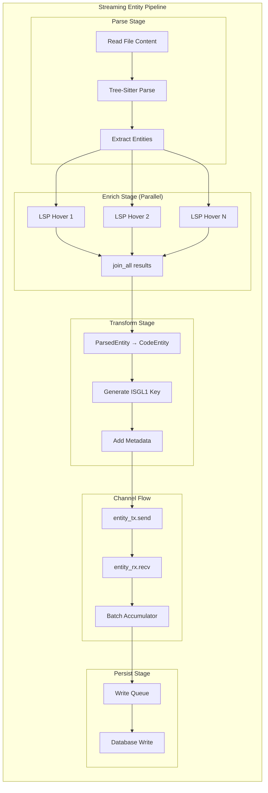

### Memory Usage Pattern

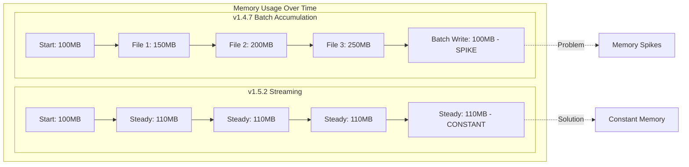

---

## Database Migration Path

### Incremental Backend Migration

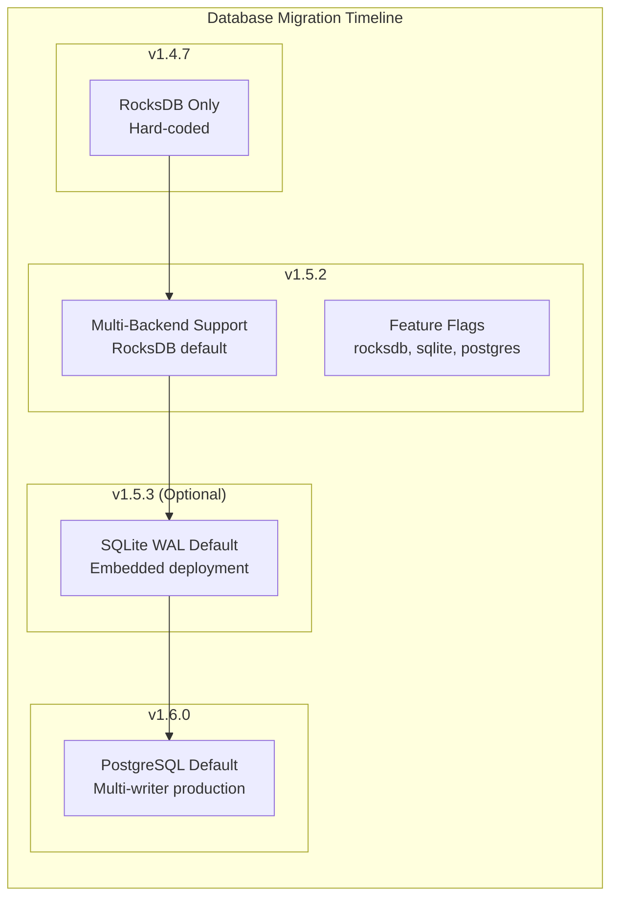

### Backend Comparison Matrix

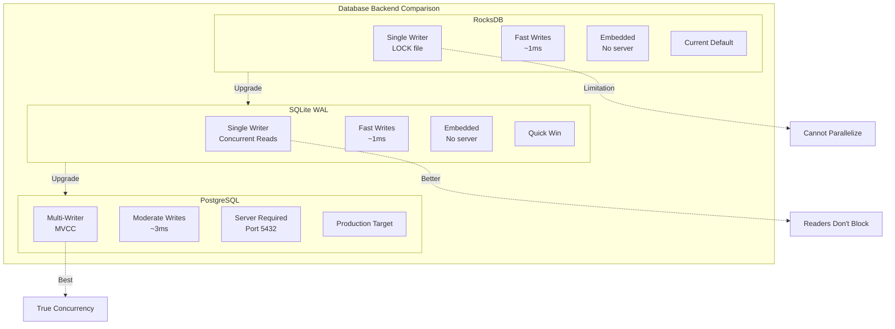

### Connection String Routing

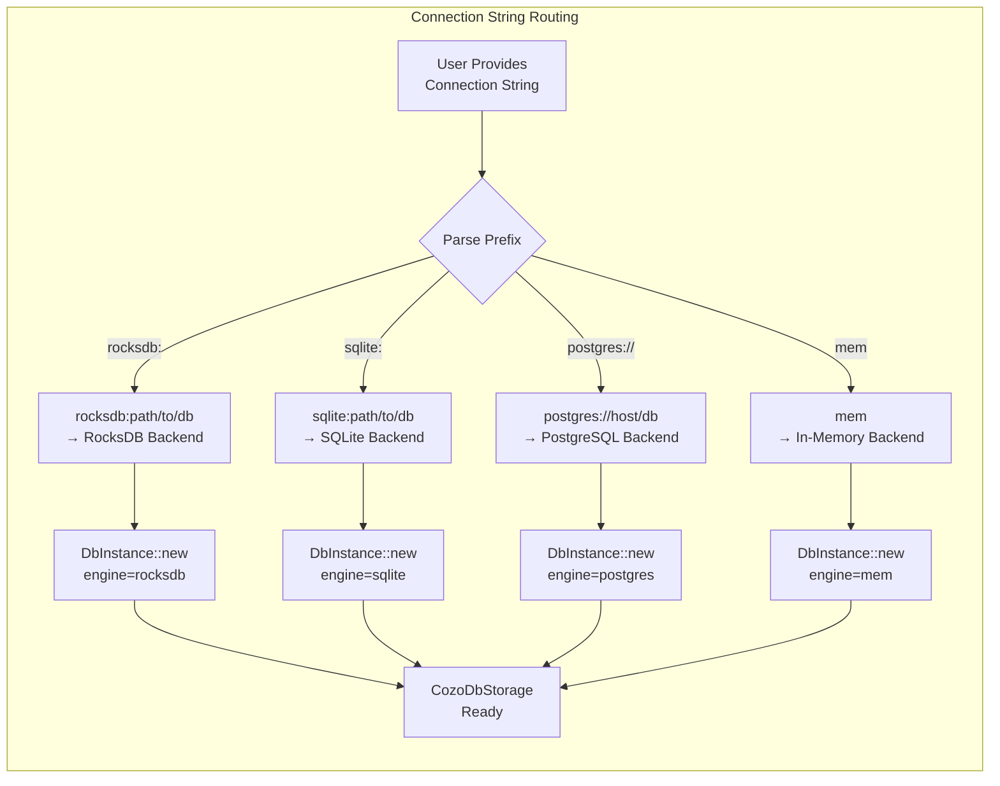

---

## Concurrency Patterns

### File Processing Concurrency

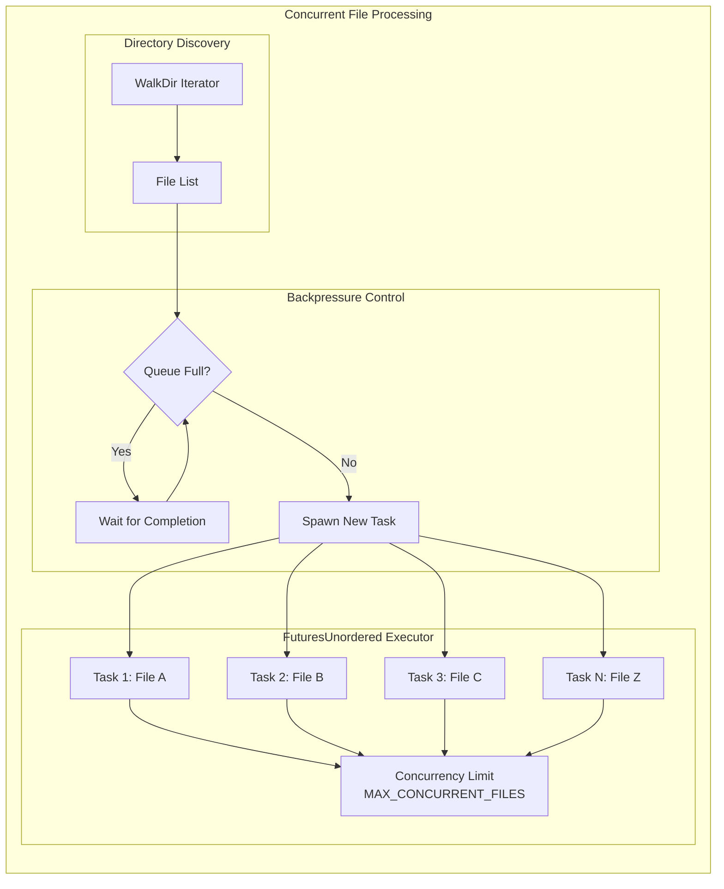

### LSP Enrichment Concurrency

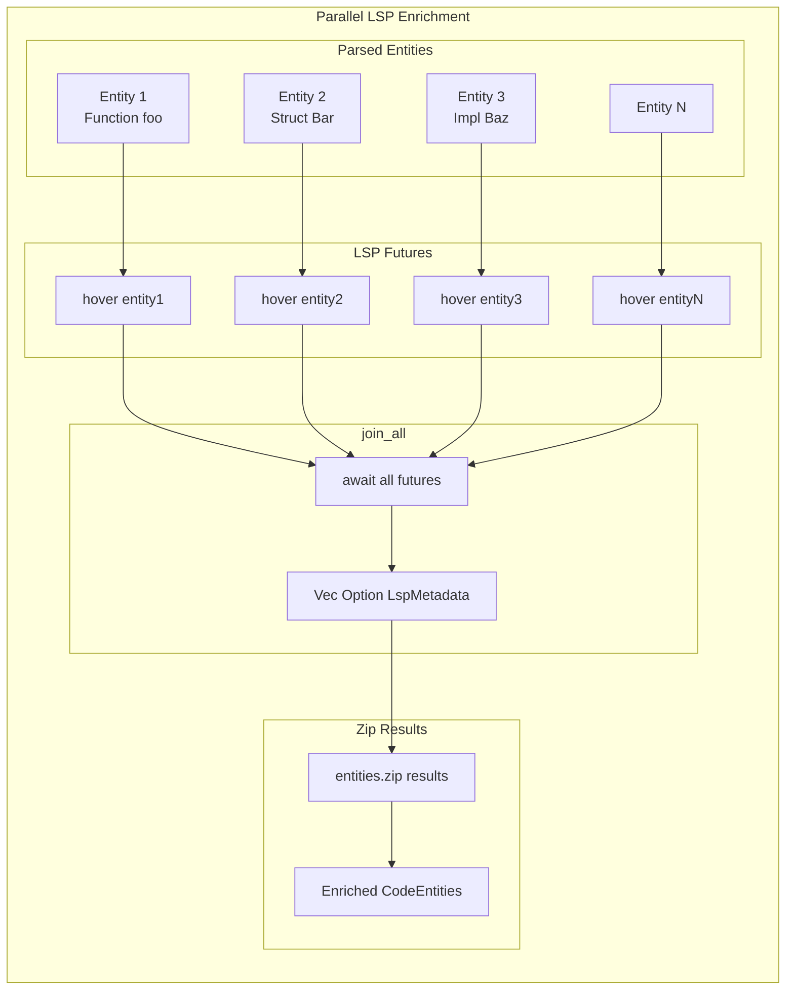

---

## Error Handling

### Graceful Degradation

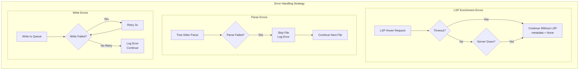

---

## Performance Characteristics

### Throughput Comparison

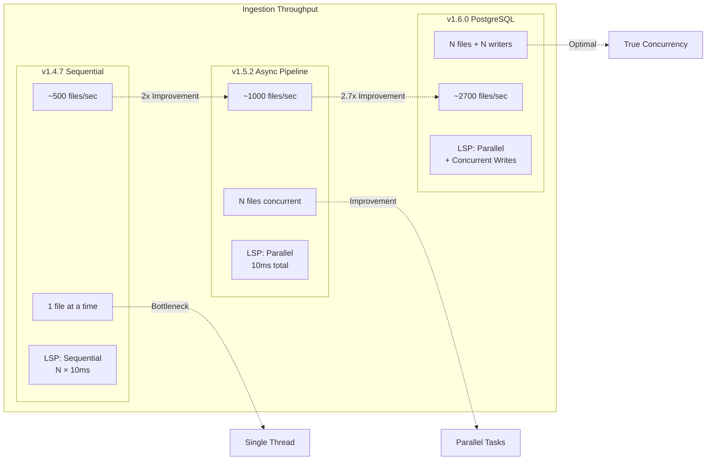

### Latency Percentiles

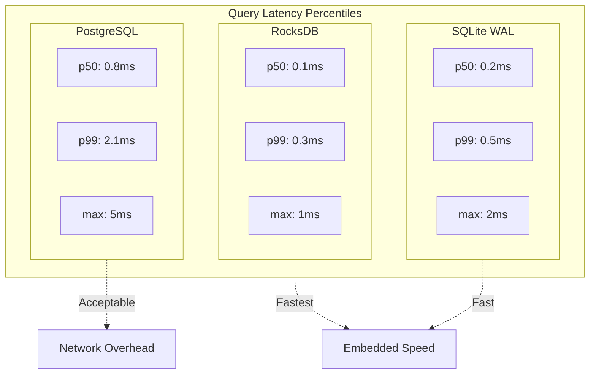

---

## Conclusion

### Architecture Evolution Summary

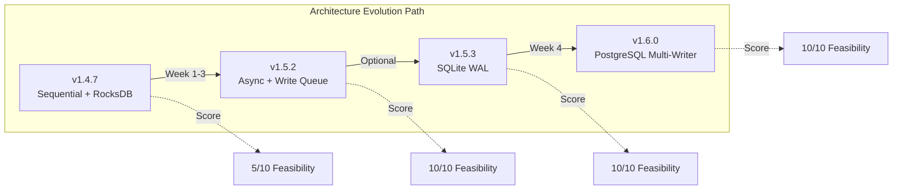

**Status**: Architecture design complete, ready for implementation ✅
