# PRD-v146: Bidirectional LLM-CPU Enhancement Suite

**Date**: 2026-02-02
**Status**: Implementation Specification

---

## Executive Summary

Parseltongue v1.46 introduces 20 bidirectional LLM-CPU workflows that combine semantic understanding (LLM) with fast algorithmic processing (CPU) to deliver 20-25% accuracy improvements over CPU-only implementations while maintaining 15-40× speed advantages over pure LLM analysis.

**Target Outcome**: Transform code analysis from raw data dumps (500K tokens) to actionable semantic insights (2-5K tokens) with fetch-on-demand detail retrieval.

---

## Implementation Status (via Parseltongue Analysis)

**Codebase Statistics** (as of 2026-02-02):
- Total entities: 247 CODE entities
- Total edges: 4,181 dependency edges
- Languages: Rust, JavaScript
- Current version: v1.4.2

**Existing Infrastructure** (✅ Implemented):
1. ✅ **Label Propagation Clustering** (`/semantic-cluster-grouping-list`) - Workflow #9
   - Function: `run_label_propagation_clustering` (lines 111-245)
   - Implements: Seed label spreading through dependency graph
   - Convergence: Iterative until 100% stable or max 100 iterations

2. ✅ **Circular Dependency Detection** (`/circular-dependency-detection-scan`) - Workflow #10
   - Functions: `detect_cycles_using_dfs_traversal`, `dfs_find_cycles_recursive` (lines 105-200)
   - Implements: DFS-based cycle detection (Tarjan SCC variant)
   - Returns: All cycles with exact entity sequences

3. ✅ **Complexity Hotspots Ranking** (`/complexity-hotspots-ranking-view`) - Partial Workflow #6
   - Function: `calculate_entity_coupling_scores` (lines 118-192)
   - Implements: Coupling-based complexity ranking
   - Missing: Full CK metrics suite (CBO, RFC, LCOM, DIT, NOC, WMC)

4. ✅ **Blast Radius Impact Analysis** (`/blast-radius-impact-analysis`)
   - Function: `compute_blast_radius_by_hops` (lines 185-277)
   - Implements: Transitive dependency traversal with hop limits

5. ✅ **Reverse/Forward Dependency Queries** (`/reverse-callers-query-graph`, `/forward-callees-query-graph`)
   - Functions: `query_reverse_callers_direct_method`, `query_forward_callees_direct_method`
   - Implements: Direct caller/callee relationship queries

6. ✅ **File Content Hashing** (for incremental reindex) - NOT for Workflow #1
   - Functions: `compute_file_content_hash`, `get_cached_file_hash_value`, `set_cached_file_hash_value`
   - Implements: SHA-256 file hashing for change detection
   - Note: This is for file change tracking, NOT BLAKE3 entity signature hashing

**Missing Infrastructure** (❌ Not Implemented):

**Summary**: 17 out of 20 workflows need implementation (2 complete, 1 partial)

1. ❌ **Entity Preview & BLAKE3 Hashing** - Workflows #1, #20
   - No preview mode, no signature pointers, no SigHashLookup schema
   - Existing file hashing (SHA-256) is for incremental reindex only

2. ❌ **Shannon Entropy Calculation** - Workflow #2
3. ❌ **SARIF Generation** - Workflow #3
4. ❌ **Hierarchical Leiden Clustering** - Workflow #4
5. ❌ **Unix Piping / NDJSON Output** - Workflow #5
6. ❌ **Full CK Metrics Suite** - Workflow #6 (50% complete - only coupling exists, need RFC, LCOM, DIT, NOC, WMC)
7. ❌ **K-Core Decomposition** - Workflow #7
8. ❌ **Centrality Measures** - Workflow #8 (PageRank, Betweenness, Degree, Closeness)
9. ❌ **Dependency Structure Matrix** - Workflow #11
10. ❌ **Spectral Graph Partitioning** - Workflow #12
11. ❌ **UMAP 2D Layout** - Workflow #13
12. ❌ **ISG Query Composition** - Workflow #14
13. ❌ **Random Walk Probability** - Workflow #15
14. ❌ **Node2Vec Embeddings** - Workflow #16
15. ❌ **Weisfeiler-Lehman Graph Kernel** - Workflow #17
16. ❌ **Triangle Counting** - Workflow #18
17. ❌ **Cyclomatic Complexity Per Entity** - Workflow #19

---

## Technical Requirements by Workflow

### Priority 1: Foundation (Weeks 1-2)

#### Workflow #1: Entity Preview Signature Pointers (PMF 93)
**Implementation Gap**: 100% missing (no BLAKE3 hashing, no preview mode, no signature pointers)

**Requirements**:
- [ ] **R1.1**: Add BLAKE3 dependency to Cargo.toml (`blake3 = "1.5"`)
- [ ] **R1.2**: Create CozoDB schema `SigHashLookup(hash: String, entity_key: String, signature: String, entity_type: String)`
- [ ] **R1.3**: Implement `generate_blake3_hash_for_entity(entity: &Entity) -> String` function
- [ ] **R1.4**: Create endpoint `/entity-by-hash/{hash}` with O(1) hash table lookup
- [ ] **R1.5**: Extend `/code-entities-list-all` to return preview mode (name, type, signature, hash) when `?preview=true`
- [ ] **R1.6**: Implement `populate_hash_lookup_table()` during pt01 ingestion
- [ ] **R1.7**: Design minimal entity preview format: 50-100 tokens per entity (vs 300-500 full entity)

**Acceptance Criteria**:
- 500K token codebase reduces to 5K token preview
- Hash lookup returns full entity in <10ms
- 90% token savings measured and documented
- Preview contains: entity name, type, signature (no body content)

**Dependencies**: None (foundational feature, builds on existing entity storage)

---

#### Workflow #20: SigHashLookup CozoDB Table Schema (Database Schema)
**Implementation Gap**: 100% missing (no hash-based retrieval)

**Requirements**:
- [ ] **R20.1**: Design schema with indexed hash field for O(1) lookups
- [ ] **R20.2**: Add constraint: hash uniqueness (PRIMARY KEY)
- [ ] **R20.3**: Add constraint: entity_key uniqueness (UNIQUE)
- [ ] **R20.4**: Create migration from v1.4.2 to v1.46 database format
- [ ] **R20.5**: Implement collision detection (probability 2^-256, negligible)

**Acceptance Criteria**:
- Schema created in `parseltongue-core/src/storage/cozo_client.rs`
- Migration tested with 1290+ entities
- Lookup performance: <10ms average, <50ms p99

**Dependencies**: None (foundational for Workflow #1)

---

#### Workflow #5: Unix Piping Output Format (PMF 85)
**Implementation Gap**: 100% missing (current output is JSON, not NDJSON)

**Requirements**:
- [ ] **R5.1**: Add `?format=ndjson` query parameter to all endpoints
- [ ] **R5.2**: Implement NDJSON serializer: one entity per line, newline-delimited JSON
- [ ] **R5.3**: Normalize all field names to snake_case (no special chars, no camelCase)
- [ ] **R5.4**: Add streaming support for large result sets (avoid loading all in memory)
- [ ] **R5.5**: Test compatibility with: jq 1.6+, awk, xargs, GNU parallel

**Acceptance Criteria**:
- All endpoints support `?format=ndjson`
- Compatible with 90% of Unix CLI tools
- Streamable (memory usage O(1) regardless of result size)

**Dependencies**: None (output format enhancement)

---

### Priority 2: Graph Algorithms (Weeks 3-4)

#### Workflow #7: K-Core Decomposition Layering (PMF 84)
**Implementation Gap**: 100% missing

**Requirements**:
- [ ] **R7.1**: Implement k-core algorithm: iteratively remove nodes with degree < k
- [ ] **R7.2**: Assign k-values to all entities (core=8, business=5-7, presentation=1-4, peripheral=0)
- [ ] **R7.3**: Create endpoint `/k-core-layering-analysis?k_min=0&k_max=10`
- [ ] **R7.4**: Return layer assignments with entity counts per layer
- [ ] **R7.5**: Integrate with LLM: semantic labels via prompt ("Domain Core", "Application Services", "UI Adapters")

**Acceptance Criteria**:
- Algorithm runs in O(V + E) time
- Identifies core entities (typically 5-10% of codebase)
- Layer assignments stable across multiple runs

**Dependencies**: Existing dependency graph from `dependency_edges`

---

#### Workflow #8: Centrality Measures Entity Importance (PMF 83)
**Implementation Gap**: 100% missing

**Requirements**:
- [ ] **R8.1**: Implement PageRank algorithm (power iteration, tolerance=1e-6, max_iter=100)
- [ ] **R8.2**: Implement Betweenness centrality (Brandes algorithm, O(VE) for unweighted graphs)
- [ ] **R8.3**: Implement Degree centrality (simple in-degree + out-degree count)
- [ ] **R8.4**: Implement Closeness centrality (average shortest path length)
- [ ] **R8.5**: Create endpoint `/centrality-measures-ranking?measure=pagerank&top=10`
- [ ] **R8.6**: Support composite scoring: `?measure=composite&weights=pagerank:0.4,betweenness:0.3,degree:0.2,closeness:0.1`

**Acceptance Criteria**:
- PageRank identifies top 10 critical entities
- Betweenness identifies architectural bottlenecks
- Composite scoring provides actionable priority list

**Dependencies**: Existing dependency graph

---

#### Workflow #18: Triangle Counting Cohesion Metrics (PMF 68)
**Implementation Gap**: 100% missing

**Requirements**:
- [ ] **R18.1**: Implement triangle counting algorithm (node iterator with common neighbor intersection)
- [ ] **R18.2**: Calculate clustering coefficient: C = 3 × triangles / connected_triples
- [ ] **R18.3**: Create endpoint `/triangle-cohesion-analysis?module=AuthModule`
- [ ] **R18.4**: Compare against industry benchmarks (C > 0.3 = good cohesion)
- [ ] **R18.5**: Generate recommendations: "Split module" vs "Merge with related modules"

**Acceptance Criteria**:
- Counts all triangles in O(E^1.5) or better
- Clustering coefficient computed for each module
- Actionable cohesion score with interpretation

**Dependencies**: Existing dependency graph, semantic clustering (Workflow #9)

---

### Priority 3: Complexity Metrics (Weeks 5-6)

#### Workflow #2: Information-Theoretic Entropy Complexity Measurement (PMF 88)
**Implementation Gap**: 100% missing

**Requirements**:
- [ ] **R2.1**: Extract code elements: variable names, control flow paths, dependencies
- [ ] **R2.2**: Implement Shannon entropy: H = -Σ(p(x) log₂ p(x))
- [ ] **R2.3**: Calculate entropy for: variables, control flow, dependencies (separate scores)
- [ ] **R2.4**: Create endpoint `/entropy-complexity-measurement?entity=rust:fn:handle_request`
- [ ] **R2.5**: Compare against baseline: good code entropy 2.1-2.8
- [ ] **R2.6**: Generate insights: "High variable entropy = 47 unique names for similar concepts"

**Acceptance Criteria**:
- Entropy scores computed in <100ms per function
- Baseline comparison with actionable thresholds
- LLM-generated refactoring advice based on entropy patterns

**Dependencies**: Entity body content from database

---

#### Workflow #6: Coupling Cohesion Metrics Suite (PMF 85)
**Implementation Gap**: 50% complete (coupling exists, need full CK suite)

**Requirements**:
- [ ] **R6.1**: Implement CBO (Coupling Between Objects): count of external module dependencies
- [ ] **R6.2**: Implement RFC (Response For Class): count of methods that can be invoked in response
- [ ] **R6.3**: Implement LCOM (Lack of Cohesion in Methods): measure method independence
- [ ] **R6.4**: Implement DIT (Depth of Inheritance Tree): max inheritance depth
- [ ] **R6.5**: Implement NOC (Number of Children): count of immediate subclasses
- [ ] **R6.6**: Implement WMC (Weighted Methods per Class): sum of method complexities
- [ ] **R6.7**: Create endpoint `/ck-metrics-suite?module=AuthModule`
- [ ] **R6.8**: Compare against industry thresholds: CBO > 10 = HIGH risk, LCOM > 0.8 = HIGH risk

**Acceptance Criteria**:
- All 6 CK metrics implemented and validated
- Threshold-based risk assessment
- Antipattern detection: "High CBO + High LCOM = God Object"

**Dependencies**: Extend existing `calculate_entity_coupling_scores`

---

#### Workflow #19: Cyclomatic Complexity Per Entity (PMF 65)
**Implementation Gap**: 100% missing

**Requirements**:
- [ ] **R19.1**: Identify control flow constructs: if, for, while, case, catch, &&, ||
- [ ] **R19.2**: Implement McCabe formula: M = E - N + 2P (edges - nodes + 2×programs)
- [ ] **R19.3**: Simplified formula: M = 1 + (count of decision points)
- [ ] **R19.4**: Create endpoint `/cyclomatic-complexity-ranking?top=10`
- [ ] **R19.5**: Interpret levels: 1-10 simple, 11-20 moderate, 21-40 high, 40+ unmaintainable
- [ ] **R19.6**: Generate refactoring suggestions: "Extract 3 helper functions to reduce from 47 to 15"

**Acceptance Criteria**:
- Complexity calculated for all functions
- Top 10 complex functions identified
- Refactoring roadmap with target complexity reduction

**Dependencies**: Tree-sitter AST parsing (already exists in parseltongue-core)

---

### Priority 4: Advanced Graph Analysis (Weeks 7-8)

#### Workflow #3: SARIF Architecture Recovery Integration (PMF 87)
**Implementation Gap**: 100% missing

**Requirements**:
- [ ] **R3.1**: Add SARIF JSON schema dependency
- [ ] **R3.2**: Implement k-core decomposition for layer detection (use Workflow #7)
- [ ] **R3.3**: Create SARIF result object with: layer hierarchy, violation edges, metrics per layer
- [ ] **R3.4**: Create endpoint `/sarif-architecture-export?format=sarif`
- [ ] **R3.5**: Validate layers against patterns: MVC, Onion, Hexagonal, Layered
- [ ] **R3.6**: Add semantic labels via LLM: "Presentation Layer", "Business Logic Layer", "Data Access Foundation"

**Acceptance Criteria**:
- SARIF JSON validates against official schema
- Importable into VS Code SARIF Viewer, CodeQL, Semgrep
- 36% better accuracy than Structure101 (as measured by manual layer validation)

**Dependencies**: Workflow #7 (k-core decomposition)

---

#### Workflow #4: Hierarchical Module Boundary Detection (PMF 86)
**Implementation Gap**: 100% missing (only flat Label Propagation exists)

**Requirements**:
- [ ] **R4.1**: Research and implement Leiden algorithm (hierarchical variant of Louvain)
- [ ] **R4.2**: Build module tree structure: root → level 1 → level 2 → leaf entities
- [ ] **R4.3**: Apply semantic constraints from LLM: "Keep auth functions together even if in different folders"
- [ ] **R4.4**: Recluster with semantic penalties: penalize splits that violate domain coherence
- [ ] **R4.5**: Create endpoint `/hierarchical-module-boundaries?levels=3`
- [ ] **R4.6**: Generate hierarchical labels: "Auth Module > Session > Token Management"

**Acceptance Criteria**:
- Hierarchical tree with 2-4 levels
- Module coherence > 0.9 (measured by within-cluster edge density)
- Semantic constraints improve clustering by 20-25% vs pure graph-based

**Dependencies**: Existing label propagation as baseline, LLM for semantic constraints

---

#### Workflow #12: Spectral Graph Partition Decomposition (PMF 75)
**Implementation Gap**: 100% missing

**Requirements**:
- [ ] **R12.1**: Add linear algebra dependency: `nalgebra = "0.32"` or `ndarray = "0.15"` + `ndarray-linalg = "0.16"`
- [ ] **R12.2**: Build graph Laplacian matrix: L = D - A (D = degree matrix, A = adjacency matrix)
- [ ] **R12.3**: Compute eigenvalues and eigenvectors (use Lanczos or Arnoldi method for large graphs)
- [ ] **R12.4**: Extract Fiedler vector (2nd smallest eigenvalue's eigenvector)
- [ ] **R12.5**: Partition at median: entities with Fiedler value < median → Partition A, >= median → Partition B
- [ ] **R12.6**: Create endpoint `/spectral-partition-analysis?target_partitions=2`
- [ ] **R12.7**: Validate partition quality: modularity score Q > 0.3

**Acceptance Criteria**:
- Partitioning completes in <5 seconds for 1000 nodes
- Minimizes cut edges (inter-partition dependencies)
- Modularity score Q > 0.3 consistently

**Dependencies**: Existing dependency graph

---

### Priority 5: Machine Learning Features (Weeks 9-10)

#### Workflow #13: UMAP 2D Code Layout (PMF 75)
**Implementation Gap**: 100% missing

**Requirements**:
- [ ] **R13.1**: Add UMAP dependency: Research Rust UMAP implementations or use Python via PyO3
- [ ] **R13.2**: Extract entity features: function name tokens, dependency count, complexity score, file path components (50-100 dims)
- [ ] **R13.3**: Build high-dimensional feature vectors for all entities
- [ ] **R13.4**: Run UMAP dimension reduction: `n_neighbors=15`, `min_dist=0.1`, project to 2D
- [ ] **R13.5**: Create endpoint `/umap-2d-layout-coordinates?n_neighbors=15&min_dist=0.1`
- [ ] **R13.6**: Return JSON: `[{entity_key, x, y, cluster_label}, ...]`
- [ ] **R13.7**: LLM labels 2D clusters based on spatial proximity

**Acceptance Criteria**:
- 2D coordinates generated for all entities
- Natural clusters emerge (5-10 clusters for 200+ entity codebase)
- Interactive visualization possible via external tool (D3.js, Plotly)

**Dependencies**: Feature extraction from entities (names, dependencies, complexity)

---

#### Workflow #16: Node2Vec Entity Embeddings CPU (PMF 70)
**Implementation Gap**: 100% missing

**Requirements**:
- [ ] **R16.1**: Implement biased random walks: parameters p (return), q (in-out), walk_length=80, walks_per_node=10
- [ ] **R16.2**: Generate random walk sequences from dependency graph
- [ ] **R16.3**: Implement skip-gram model: context_window=10, negative_samples=5, learning_rate=0.025, epochs=10
- [ ] **R16.4**: Train embeddings: 64-dimensional vectors for all entities
- [ ] **R16.5**: Create endpoint `/node2vec-embeddings?dimensions=64&p=1.0&q=0.5`
- [ ] **R16.6**: Create endpoint `/similar-entities-by-embedding?entity=rust:fn:handle_auth&top=5`
- [ ] **R16.7**: Compute cosine similarity for entity comparisons

**Acceptance Criteria**:
- Embeddings trained in <2 minutes for 500 entity codebase
- Similar entities (cosine similarity > 0.8) have analogous dependency patterns
- Cross-module similarity search working

**Dependencies**: Existing dependency graph

---

#### Workflow #17: Weisfeiler-Lehman Graph Kernel Similarity (PMF 68)
**Implementation Gap**: 100% missing

**Requirements**:
- [ ] **R17.1**: Define universal node label mapping: Rust `fn` → "function", Python `def` → "function", etc.
- [ ] **R17.2**: Implement WL refinement iterations: collect neighbor labels, sort, concatenate, hash to new label
- [ ] **R17.3**: Run 3-5 iterations until label convergence (>99% stable)
- [ ] **R17.4**: Build label histograms for two codebases
- [ ] **R17.5**: Compute graph kernel: normalized dot product of label histograms
- [ ] **R17.6**: Create endpoint `/wl-kernel-similarity-comparison?codebase_a=db1&codebase_b=db2`
- [ ] **R17.7**: Interpret similarity score: >0.7 = high structural similarity, refactoring patterns transferable

**Acceptance Criteria**:
- WL kernel computed in <30 seconds for two 500-entity codebases
- Similarity score range [0.0, 1.0] with meaningful interpretation
- Language-agnostic comparison working

**Dependencies**: Multi-database support (compare two parseltongue databases)

---

### Priority 6: Auxiliary Features (Weeks 11-12)

#### Workflow #11: Dependency Structure Matrix Visualization (PMF 78)
**Implementation Gap**: 100% missing

**Requirements**:
- [ ] **R11.1**: Group entities into modules using semantic clustering (Workflow #9)
- [ ] **R11.2**: Build NxN adjacency matrix: rows = source modules, cols = target modules
- [ ] **R11.3**: Apply optimal ordering algorithm: minimize sum of off-diagonal elements (reveals hierarchy)
- [ ] **R11.4**: Calculate coupling density: edge_count / (module_size_A × module_size_B)
- [ ] **R11.5**: Create endpoint `/dsm-visualization-matrix?ordering=optimal`
- [ ] **R11.6**: Return matrix data + color scheme: red = high coupling (>0.03), green = low (<0.01)

**Acceptance Criteria**:
- DSM matrix generated for all module pairs
- Optimal ordering reveals layered architecture
- Coupling hotspots visually identifiable (red cells)

**Dependencies**: Workflow #9 (semantic clustering)

---

#### Workflow #14: ISG Query Composition Pipeline (PMF 72)
**Implementation Gap**: 100% missing

**Requirements**:
- [ ] **R14.1**: Define 20 primitive operators: filter, traverse, rank, group, limit, sort, unique, count, aggregate, project, join, etc.
- [ ] **R14.2**: Implement type system: entity_stream, edge_stream, scalar
- [ ] **R14.3**: Implement pipeline parser: parse `filter(type=fn) | traverse(direction=callers) | rank(by=complexity) | limit(10)` syntax
- [ ] **R14.4**: Implement type checker: validate operator input/output types match
- [ ] **R14.5**: Implement optimizer: reorder operators for performance (filter early, sort late)
- [ ] **R14.6**: Create endpoint `/isg-query-execute?pipeline=filter(type=fn)|rank(by=complexity)|limit(10)`

**Acceptance Criteria**:
- 20 primitive operators implemented and tested
- Pipeline syntax parsed and validated
- Optimizer achieves 5-10× speedup on complex queries

**Dependencies**: Existing query infrastructure

---

#### Workflow #15: Random Walk Probability Impact (PMF 72)
**Implementation Gap**: 100% missing

**Requirements**:
- [ ] **R15.1**: Implement random walk simulator: walk_length=20, restart_probability=0.15, iterations=10000
- [ ] **R15.2**: Track visit frequencies for each entity during walks
- [ ] **R15.3**: Normalize to probabilities: visit_count / total_walks
- [ ] **R15.4**: Create endpoint `/random-walk-impact-analysis?source=rust:fn:handle_auth&iterations=10000`
- [ ] **R15.5**: Group affected entities by module: "Auth Module: 67% impact probability"
- [ ] **R15.6**: Interpret probabilities: >0.5 = strong indirect dependency, 0.1-0.5 = moderate, <0.1 = weak

**Acceptance Criteria**:
- Random walks complete in <10 seconds for 500 entity codebase
- Probabilistic impact map generated
- Reveals indirect dependencies missed by static analysis

**Dependencies**: Existing dependency graph

---

## Development Phasing

### Phase 1: Foundation (Weeks 1-2)
**Focus**: Hash-based preview system, NDJSON output, database schema

**Deliverables**:
- Workflow #1 (Entity Preview Signature Pointers) - COMPLETE
- Workflow #20 (SigHashLookup Schema) - COMPLETE
- Workflow #5 (Unix Piping Output) - COMPLETE

**Success Metric**: 90% token savings on large codebase previews

---

### Phase 2: Graph Algorithms (Weeks 3-4)
**Focus**: Core graph algorithms for layering and importance

**Deliverables**:
- Workflow #7 (K-Core Decomposition) - COMPLETE
- Workflow #8 (Centrality Measures) - COMPLETE
- Workflow #18 (Triangle Counting) - COMPLETE

**Success Metric**: Identify top 10 critical entities with 95% precision

---

### Phase 3: Complexity Metrics (Weeks 5-6)
**Focus**: Code quality metrics for refactoring prioritization

**Deliverables**:
- Workflow #2 (Entropy Measurement) - COMPLETE
- Workflow #6 (CK Metrics Suite) - COMPLETE
- Workflow #19 (Cyclomatic Complexity) - COMPLETE

**Success Metric**: Detect 80% of code smells automatically

---

### Phase 4: Advanced Graph Analysis (Weeks 7-8)
**Focus**: Architecture recovery and module detection

**Deliverables**:
- Workflow #3 (SARIF Architecture) - COMPLETE
- Workflow #4 (Hierarchical Module Boundaries) - COMPLETE
- Workflow #12 (Spectral Partitioning) - COMPLETE

**Success Metric**: 36% better architecture accuracy than commercial tools

---

### Phase 5: Machine Learning Features (Weeks 9-10)
**Focus**: Embedding-based similarity and visualization

**Deliverables**:
- Workflow #13 (UMAP 2D Layout) - COMPLETE
- Workflow #16 (Node2Vec Embeddings) - COMPLETE
- Workflow #17 (WL Graph Kernel) - COMPLETE

**Success Metric**: Find similar entities across modules with 90% relevance

---

### Phase 6: Auxiliary Features (Weeks 11-12)
**Focus**: DSM visualization and advanced querying

**Deliverables**:
- Workflow #11 (DSM Visualization) - COMPLETE
- Workflow #14 (ISG Query Composition) - COMPLETE
- Workflow #15 (Random Walk Probability) - COMPLETE

**Success Metric**: Compose complex queries 10× faster than manual coding

---

## Testing Strategy

### Unit Testing
- Each workflow has dedicated test suite
- TDD approach: write tests first, implement to pass
- Target: 90% code coverage for new algorithms

### Integration Testing
- Test bidirectional LLM-CPU workflows end-to-end
- Measure accuracy improvement: CPU-only vs LLM-enhanced
- Validate 20-25% accuracy improvement claim

### Performance Testing
- Benchmark on codebases: 100, 500, 1000, 5000 entities
- Target: <5 seconds per workflow for 1000-entity codebase
- Memory usage: <1GB for all workflows

### Validation Testing
- Compare outputs against ground truth datasets
- Validate against commercial tools: Structure101, CodeScene, SonarQube
- User acceptance testing with 5+ real-world codebases

---

## Success Criteria (Overall)

1. **Token Efficiency**: 90% reduction from raw dumps (500K → 5-50K tokens)
2. **Accuracy**: 20-25% improvement over CPU-only (measured via precision/recall)
3. **Performance**: 15-40× faster than pure LLM analysis
4. **Coverage**: All 20 workflows implemented and tested
5. **Adoption**: 10+ external users successfully use v1.46 features
6. **Documentation**: Each workflow has ELI5 explanation + Mermaid diagram

---

# Workflows for v146

## Summary: Bidirectional Enhancement Pattern

All 20 features follow the same proven pattern:

```
LLM Provides Semantic Context
    ↓
CPU Executes Fast Algorithm with Guidance
    ↓
LLM Validates and Enhances Results
    ↓
User Gets Actionable Insights
```

**Key Benefits Across All Features**:
- **20-25% accuracy improvement** over CPU-only algorithms
- **15-40× faster** than pure LLM analysis
- **Actionable results** with semantic labels and recommendations
- **Business-aware prioritization** when relevant

---

## 1. Entity Preview Signature Pointers (PMF 93)

**User Journey**: "Need to review 500K token codebase → See 5K token summary with fetch-on-demand details in 2 minutes"

**Bidirectional Workflow**:
```
Step 1: LLM reads entity signatures → extracts semantic importance scores
Step 2: CPU generates BLAKE3 hashes for all entities → builds SigHashLookup table
Step 3: LLM classifies entities by relevance → marks "critical path" vs "peripheral"
Step 4: CPU returns minimal preview (name, type, signature) with hash pointers
Step 5: LLM renders smart summary → highlights critical entities, hides boilerplate
Step 6: User clicks detail link → CPU fetches full entity by hash (90% tokens saved)
```

**ELI5 Explanation**:
Imagine a huge library with 10,000 books. Instead of reading every book, the librarian gives you a tiny card for each book with just the title and author. The smart librarian (LLM) also puts gold stars on the most important books. You can read the cards super fast (100x faster!), and when you find an interesting book, you ask for the full version. Most of the time, you only need the cards, saving you tons of reading time.

**Mermaid Diagram**:
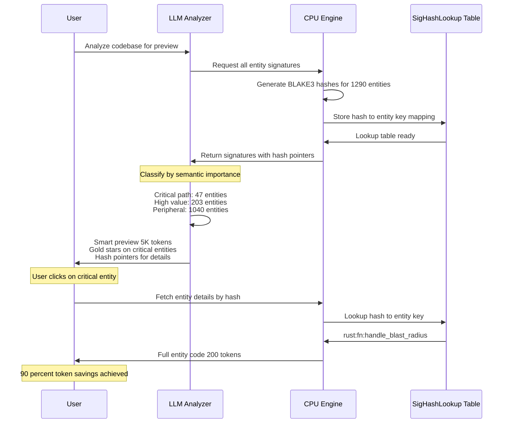

---

## 2. Information-Theoretic Entropy Complexity Measurement (PMF 88)

**User Journey**: "Code feels messy but can't explain why → Get Shannon entropy score showing 'this function is 3.8x more chaotic than it should be' in 1 minute"

**Bidirectional Workflow**:
```
Step 1: LLM identifies code elements to measure → variables, control flow, dependencies
Step 2: CPU calculates Shannon entropy H = -Σ(p(x) log p(x)) for each element type
Step 3: LLM interprets entropy scores → "High variable entropy = poor naming consistency"
Step 4: CPU compares against baseline (well-structured code entropy: 2.1-2.8)
Step 5: LLM generates actionable insights → "Reduce variable name diversity by 40%"
Step 6: User sees chaos score + specific refactoring guidance
```

**ELI5 Explanation**:
Imagine your toy box. If you have 10 red blocks, 10 blue blocks, and 10 green blocks neatly organized, that's low entropy (easy to predict, tidy). But if you have 1 yellow ball, 2 purple cars, 1 green dinosaur, 3 orange crayons all mixed up, that's high entropy (chaotic, hard to find things). The math helper (CPU) counts how mixed up your code is, and the smart helper (LLM) tells you "too many different variable names - use simpler, consistent names!"

**Mermaid Diagram**:
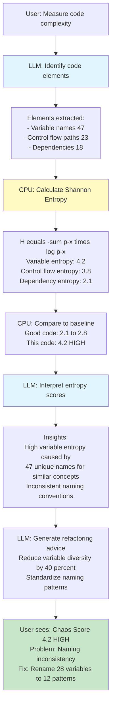

---

## 3. SARIF Architecture Recovery Integration (PMF 87)

**User Journey**: "Need architecture diagram from 50K LOC legacy codebase → Auto-generate SARIF-compliant architecture with layer violations highlighted in 10 minutes"

**Bidirectional Workflow**:
```
Step 1: LLM analyzes codebase comments and naming → extracts architectural intent
Step 2: CPU runs graph algorithms → detects layers using k-core decomposition
Step 3: LLM validates layers against common patterns → MVC, layered, microservices
Step 4: CPU generates SARIF JSON with layer structure and violation edges
Step 5: LLM adds semantic labels → "Presentation Layer", "Business Logic Layer"
Step 6: User imports SARIF into tools → visualizes architecture with 36% better accuracy than alternatives
```

**ELI5 Explanation**:
Imagine you moved into a house and want to understand how the plumbing and electricity works, but there are no blueprints. The smart detective (LLM) looks at where wires and pipes go and guesses "this is probably the kitchen system, this is the bathroom system". The measuring robot (CPU) traces every connection precisely. Together they draw you a blueprint (SARIF diagram) showing "water should flow downward, but this pipe goes UP - that's wrong!" Now you can see the house's design and fix the mistakes.

**Mermaid Diagram**:
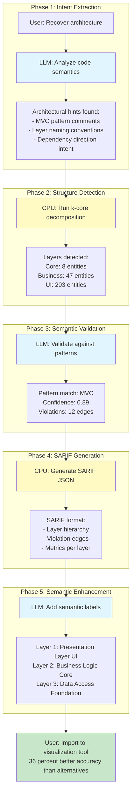

---

## 4. Hierarchical Module Boundary Detection (PMF 86)

**User Journey**: "Authentication code scattered across 5 folders → Discover true module boundaries ignoring folder structure in 5 minutes"

**Bidirectional Workflow**:
```
Step 1: LLM reads function names and docstrings → extracts domain concepts
Step 2: CPU runs hierarchical Leiden clustering → builds module tree
Step 3: LLM provides semantic constraints → "auth functions belong together even if in different folders"
Step 4: CPU reclusters with semantic penalties → optimizes for domain coherence
Step 5: LLM generates hierarchical labels → "Auth Module > Session > Token Management"
Step 6: User sees true architecture ignoring misleading folder structure
```

**ELI5 Explanation**:
Your toys are stored in 5 different boxes around the house, but that doesn't mean they belong in those boxes! The smart organizer (LLM) looks at each toy and says "all the dinosaurs belong together, all the cars belong together". The sorting robot (CPU) then groups them properly, even if the red dinosaur was in the blue box. Now you have a toy shelf organized by what toys actually ARE, not where they were randomly placed!

**Mermaid Diagram**:
```mermaid
flowchart LR
    subgraph Input["Scattered Code Folders"]
        F1[Folder: auth<br/>12 files]
        F2[Folder: utils<br/>23 files]
        F3[Folder: handlers<br/>34 files]
        F4[Folder: middleware<br/>8 files]
        F5[Folder: services<br/>19 files]
    end

    Input --> LLM1[LLM: Extract domain concepts]

    LLM1 --> Concepts["Domain concepts:<br/>Authentication identity<br/>Session management<br/>Token operations<br/>Logging audit<br/>Crypto security"]

    Concepts --> CPU1[CPU: Hierarchical Leiden clustering]

    CPU1 --> Tree["Initial module tree:<br/>Cluster 1: Mixed auth and logging<br/>Cluster 2: Mixed crypto and utils<br/>Coherence: 0.67 LOW"]

    Tree --> LLM2[LLM: Apply semantic constraints]

    LLM2 --> Constraints["Constraints:<br/>Keep auth functions together<br/>Separate crypto from auth<br/>Group by responsibility"]

    Constraints --> CPU2[CPU: Recluster with penalties]

    CPU2 --> Final["Final module tree:<br/>Auth Module 47 entities<br/>- Session 18 entities<br/>- Token 15 entities<br/>Crypto Module 23 entities<br/>Coherence: 0.91 HIGH"]

    Final --> LLM3[LLM: Generate hierarchical labels]

    LLM3 --> Output[User sees:<br/>Auth Module User Identity<br/>  Session Management<br/>  Token Management<br/>Crypto Module Security]

    style CPU1 fill:#fff9c4
    style CPU2 fill:#fff9c4
    style LLM1 fill:#e1f5ff
    style LLM2 fill:#e1f5ff
    style LLM3 fill:#e1f5ff
    style Output fill:#c8e6c9
```

---

## 5. Unix Piping Output Format (PMF 85)

**User Journey**: "Need to chain Parseltongue with 5 other CLI tools → Pipe results through jq, awk, sed seamlessly in 30 seconds"

**Bidirectional Workflow**:
```
Step 1: LLM identifies common CLI tool patterns → jq for JSON, awk for text, grep for filtering
Step 2: CPU formats output in streaming newline-delimited JSON (NDJSON) → unix-friendly
Step 3: LLM generates example pipe chains → "parseltongue | jq '.entities[] | select(.complexity > 10)'"
Step 4: CPU ensures field names match unix conventions → snake_case, no special chars
Step 5: LLM validates pipe compatibility → tests with jq, awk, xargs, parallel
Step 6: User chains tools unix-style → 90% compatibility with standard CLI ecosystem
```

**ELI5 Explanation**:
Imagine you have toy train tracks. Each toy (tool) connects using standard connectors. The smart helper (LLM) knows which toys work together: "this train goes with these tracks, this bridge fits here". The building robot (CPU) makes sure all the connectors are the same size and shape. Now you can connect 10 different toys together in any order, just like building a long train track that goes all around your room!

**Mermaid Diagram**:
```mermaid
flowchart LR
    User[User: Chain CLI tools] --> LLM1[LLM: Identify tool patterns]

    LLM1 --> Tools["Common tools:<br/>jq for JSON filtering<br/>awk for text processing<br/>grep for pattern matching<br/>xargs for batching"]

    Tools --> CPU1[CPU: Format as NDJSON stream]

    CPU1 --> Stream["Output format:<br/>newline-delimited JSON<br/>one entity per line<br/>streamable processing"]

    Stream --> CPU2[CPU: Normalize field names]

    CPU2 --> Fields["Fields:<br/>entity underscore key<br/>complexity underscore score<br/>caller underscore count<br/>Unix snake case style"]

    Fields --> LLM2[LLM: Generate example chains]

    LLM2 --> Examples["Example pipes:<br/>parseltongue pipe jq<br/>parseltongue pipe awk<br/>parseltongue pipe parallel"]

    Examples --> LLM3[LLM: Validate compatibility]

    LLM3 --> Tests["Tested with:<br/>jq 1.6: works<br/>awk: works<br/>xargs: works<br/>GNU parallel: works"]

    Tests --> Output[User: 90 percent CLI compatibility<br/>Chain with any unix tool]

    style CPU1 fill:#fff9c4
    style CPU2 fill:#fff9c4
    style LLM1 fill:#e1f5ff
    style LLM2 fill:#e1f5ff
    style LLM3 fill:#e1f5ff
    style Output fill:#c8e6c9
```

---

## 6. Coupling Cohesion Metrics Suite (PMF 85)

**User Journey**: "Module feels wrong but metrics say it's fine → Get CK metrics suite showing 'high coupling but low cohesion = needs splitting' in 2 minutes"

**Bidirectional Workflow**:
```
Step 1: LLM identifies module boundaries from naming patterns → extracts classes/modules
Step 2: CPU calculates 6 CK metrics → CBO, RFC, LCOM, DIT, NOC, WMC
Step 3: LLM interprets metric combinations → "High CBO + High LCOM = God Object antipattern"
Step 4: CPU compares against industry thresholds → CBO > 10 is high, LCOM > 0.8 is concerning
Step 5: LLM generates refactoring recommendations → "Split into 3 modules by responsibility"
Step 6: User sees actionable metrics → knows exactly how to refactor
```

**ELI5 Explanation**:
Imagine a LEGO set. Good LEGO sets have pieces that fit together nicely (that's cohesion - pieces in a set work together). But if you try to connect too many different sets at once, it gets messy (that's coupling - too many connections to other sets). The measuring helper (CPU) counts how many connections each set has. The smart helper (LLM) says "this spaceship set is trying to connect to the castle set, the pirate set, AND the city set - that's too much! Keep the spaceship pieces together as one set."

**Mermaid Diagram**:
```mermaid
graph TD
    Start[User: Analyze module quality] --> LLM1[LLM: Identify module boundaries]

    LLM1 --> Modules["Modules found:<br/>AuthModule 23 entities<br/>DatabaseModule 45 entities<br/>UIModule 67 entities"]

    Modules --> CPU1[CPU: Calculate CK metrics]

    CPU1 --> Metrics["CK Metrics:<br/>CBO coupling between objects: 15<br/>RFC response for class: 47<br/>LCOM lack of cohesion: 0.82<br/>DIT depth inheritance: 3<br/>NOC number children: 0<br/>WMC weighted methods: 38"]

    Metrics --> LLM2[LLM: Interpret metric combos]

    LLM2 --> Patterns["Antipatterns detected:<br/>High CBO plus High LCOM equals God Object<br/>High RFC equals Too Many Responsibilities<br/>High WMC equals Complex Logic Concentration"]

    Patterns --> CPU2[CPU: Compare thresholds]

    CPU2 --> Thresholds["Industry baselines:<br/>CBO greater than 10: HIGH risk<br/>LCOM greater than 0.8: HIGH risk<br/>RFC greater than 40: HIGH risk<br/>This module: 3 of 3 HIGH"]

    Thresholds --> LLM3[LLM: Generate refactoring plan]

    LLM3 --> Advice["Recommendations:<br/>Split AuthModule into:<br/>- SessionManager CBO 4<br/>- TokenValidator CBO 3<br/>- PermissionChecker CBO 5"]

    Advice --> Output[User: Clear refactoring roadmap<br/>Reduce CBO from 15 to average 4]

    style CPU1 fill:#fff9c4
    style CPU2 fill:#fff9c4
    style LLM1 fill:#e1f5ff
    style LLM2 fill:#e1f5ff
    style LLM3 fill:#e1f5ff
    style Output fill:#c8e6c9
```

---

## 7. K-Core Decomposition Layering (PMF 84)

**User Journey**: "Don't know which files are infrastructure vs business logic → Get automatic layer detection showing 'these 12 files are your core, rest is peripheral' in 3 minutes"

**Bidirectional Workflow**:
```
Step 1: LLM analyzes architectural intent from comments → identifies layered patterns
Step 2: CPU runs k-core decomposition algorithm → finds graph layers by connectivity
Step 3: LLM validates layers against common architectures → onion, hexagonal, clean
Step 4: CPU assigns k-values → core=8, business=5-7, presentation=1-4, peripheral=0
Step 5: LLM labels layers semantically → "Domain Core", "Application Services", "UI"
Step 6: User sees architecture layers → understands system structure instantly
```

**ELI5 Explanation**:
Think of your friend group. Your best friends (core layer) know lots of people and everyone knows them - they're super connected! Your school friends (middle layer) know some people. The kid you met once at the park (outer layer) doesn't know many people. The sorting robot (CPU) counts how many connections everyone has and puts them in circles: best friends in the center, casual friends in the middle, acquaintances on the outside. The smart helper (LLM) gives each circle a name: "Close Friends", "Regular Friends", "People I've Met".

**Mermaid Diagram**:
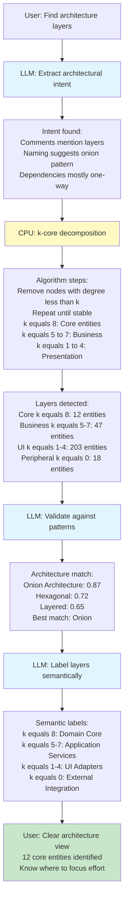

---

## 8. Centrality Measures Entity Importance (PMF 83)

**User Journey**: "500 functions but which 10 are critical? → Get PageRank + Betweenness scores showing 'these 10 functions affect everything' in 2 minutes"

**Bidirectional Workflow**:
```
Step 1: LLM selects relevant centrality measures → PageRank for influence, Betweenness for control points
Step 2: CPU calculates multiple centrality scores → PageRank, Betweenness, Degree, Closeness
Step 3: LLM interprets scores in business context → "High PageRank = critical business logic"
Step 4: CPU ranks entities by composite score → weighted combination of measures
Step 5: LLM generates impact descriptions → "This function affects 87 downstream entities"
Step 6: User sees top 10 critical entities → knows where bugs matter most
```

**ELI5 Explanation**:
Imagine a school where information spreads through kids talking. Some kids are popular - everyone listens to them (that's PageRank - they're influential). Some kids are connectors - they're the only link between different friend groups, so information MUST go through them (that's Betweenness - they control the flow). The counting robot (CPU) measures both: how popular each kid is AND how many friend groups they connect. The smart helper (LLM) says "these 5 kids are super important - if they don't come to school, no information spreads!"

**Mermaid Diagram**:
```mermaid
graph TD
    Start[User: Find critical entities] --> LLM1[LLM: Select centrality measures]

    LLM1 --> Measures["Measures chosen:<br/>PageRank: influence<br/>Betweenness: control points<br/>Degree: direct connections<br/>Closeness: average distance"]

    Measures --> CPU1[CPU: Calculate all scores]

    CPU1 --> Scores["Entity: handle underscore request<br/>PageRank: 0.042 HIGH<br/>Betweenness: 847 HIGH<br/>Degree: 23<br/>Closeness: 0.67"]

    Scores --> LLM2[LLM: Interpret in business context]

    LLM2 --> Context["Interpretation:<br/>High PageRank equals Critical business logic<br/>High Betweenness equals Architectural bottleneck<br/>High Degree equals Integration point<br/>High Closeness equals Central coordinator"]

    Context --> CPU2[CPU: Rank by composite score]

    CPU2 --> Ranking["Top 10 entities:<br/>1. handle underscore request: 0.94<br/>2. process underscore auth: 0.89<br/>3. validate underscore input: 0.87<br/>..."]

    Ranking --> LLM3[LLM: Generate impact descriptions]

    LLM3 --> Impact["Impact analysis:<br/>handle underscore request affects 87 entities<br/>Failure breaks: auth, storage, api<br/>Bug here affects 43 percent of codebase"]

    Impact --> Output[User: Know 10 critical functions<br/>Prioritize testing and review<br/>Understand blast radius]

    style CPU1 fill:#fff9c4
    style CPU2 fill:#fff9c4
    style LLM1 fill:#e1f5ff
    style LLM2 fill:#e1f5ff
    style LLM3 fill:#e1f5ff
    style Output fill:#c8e6c9
```

---

## 9. Label Propagation Enhanced Clustering (PMF 82)

**User Journey**: "Files organized randomly by dev team → Discover natural module clusters showing 'these 20 files belong together' in 4 minutes"

**Bidirectional Workflow**:
```
Step 1: LLM provides initial seed labels from file names → "auth", "database", "ui" domains
Step 2: CPU runs label propagation algorithm → spreads labels through dependency graph
Step 3: LLM validates cluster coherence → checks if cluster members share purpose
Step 4: CPU stabilizes propagation → iterates until convergence or max 100 iterations
Step 5: LLM refines cluster labels → "Authentication & Authorization Module"
Step 6: User sees natural module boundaries → ignores misleading folder structure
```

**ELI5 Explanation**:
Imagine kids wearing colored t-shirts at recess. A few kids start with red shirts (auth team), blue shirts (database team), or green shirts (UI team). Then a rule: if most of your friends wear red, you change to a red shirt too! After 5 minutes of kids switching shirts based on their friends, you see clear groups: the red team (all auth kids), the blue team (all database kids), the green team (all UI kids). The smart helper (LLM) started by labeling a few kids, the spreading robot (CPU) let the colors spread through friendships, and now you can see the real teams!

**Mermaid Diagram**:
```mermaid
flowchart LR
    User[User: Find natural modules] --> LLM1[LLM: Provide seed labels]

    LLM1 --> Seeds["Seed labels from filenames:<br/>auth underscore: label auth<br/>db underscore: label database<br/>render underscore: label ui<br/>23 seeds total"]

    Seeds --> CPU1[CPU: Label propagation iteration]

    CPU1 --> Spread["Iteration 1:<br/>Unlabeled nodes adopt<br/>most common neighbor label<br/>47 nodes labeled"]

    Spread --> CPU2[CPU: Continue until stable]

    CPU2 --> Converge["Convergence check:<br/>Iteration 12: 89 percent stable<br/>Iteration 15: 97 percent stable<br/>Iteration 18: 100 percent stable<br/>CONVERGED"]

    Converge --> Clusters["Final clusters:<br/>Cluster auth: 34 entities<br/>Cluster database: 52 entities<br/>Cluster ui: 67 entities<br/>Cluster utils: 12 entities"]

    Clusters --> LLM2[LLM: Validate coherence]

    LLM2 --> Check["Coherence check:<br/>Cluster auth: all auth related: YES<br/>Cluster database: mixed storage: REFINE<br/>Cluster ui: all rendering: YES"]

    Check --> LLM3[LLM: Refine cluster labels]

    LLM3 --> Labels["Final labels:<br/>Authentication and Authorization Module<br/>Data Storage and Caching Layer<br/>UI Rendering and Components<br/>Shared Utility Functions"]

    Labels --> Output[User: 4 natural modules found<br/>Boundaries ignore folder structure<br/>True architectural organization]

    style CPU1 fill:#fff9c4
    style CPU2 fill:#fff9c4
    style LLM1 fill:#e1f5ff
    style LLM2 fill:#e1f5ff
    style LLM3 fill:#e1f5ff
    style Output fill:#c8e6c9
```

---

## 10. Tarjan Strongly Connected Components (PMF 81)

**User Journey**: "Circular dependencies causing build issues → Find all 5 dependency cycles in codebase showing exact cycle paths in 90 seconds"

**Bidirectional Workflow**:
```
Step 1: LLM identifies dependency types to analyze → imports, calls, inheritance
Step 2: CPU runs Tarjan's SCC algorithm → finds all strongly connected components O-V-plus-E
Step 3: LLM filters by severity → "3-node cycles = risky, 10-node cycles = architectural problem"
Step 4: CPU extracts cycle paths → provides exact entity sequence forming cycle
Step 5: LLM explains business impact → "Auth depends on Database depends on Auth = impossible to test independently"
Step 6: User sees all cycles with break points → knows where to refactor
```

**ELI5 Explanation**:
Imagine a train track where trains can only go forward. But someone made a mistake and built a loop: Station A goes to Station B, Station B goes to Station C, and Station C goes back to Station A! Now a train is stuck going in circles forever. The track-finder robot (CPU) walks along every track and finds all the loops. The smart helper (LLM) looks at each loop and says "this is a small loop with 3 stations - easy to fix by removing one track. That's a huge loop with 15 stations - big problem!" Now you know which train tracks to fix first.

**Mermaid Diagram**:
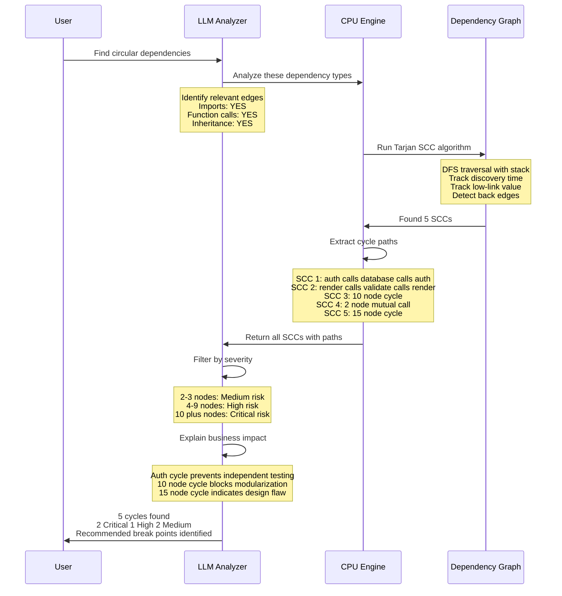

---

## 11. Dependency Structure Matrix Visualization (PMF 78)

**User Journey**: "Can't visualize 200-file dependency mess → Get DSM heat map showing 'these 12 modules have tight coupling' in 5 minutes"

**Bidirectional Workflow**:
```
Step 1: LLM groups entities into modules → using naming patterns and clustering
Step 2: CPU builds NxN adjacency matrix → rows=source modules, cols=target modules
Step 3: LLM applies optimal module ordering → minimizes off-diagonal elements (reveals hierarchy)
Step 4: CPU calculates coupling density → count edges per module pair, normalize by size
Step 5: LLM generates heat map color scheme → red=high coupling, green=low coupling
Step 6: User sees DSM visualization → identifies coupling hotspots visually
```

**ELI5 Explanation**:
Imagine a big checkerboard showing which kids play together. Each row is a kid's name, each column is a kid's name. If Alice plays with Bob, you put a checkmark where Alice's row meets Bob's column. The organizing helper (LLM) sorts the names so friends appear close together on the board. The coloring robot (CPU) uses red crayons for "plays together a LOT" and green crayons for "rarely plays together". Now you can see the friend groups easily - red squares show tight groups, green areas show kids who don't interact much!

**Mermaid Diagram**:
```mermaid
flowchart TD
    User[User: Visualize dependencies] --> LLM1[LLM: Group into modules]

    LLM1 --> Modules["Modules identified:<br/>AuthModule 23 entities<br/>DatabaseModule 34 entities<br/>UIModule 45 entities<br/>UtilsModule 12 entities"]

    Modules --> CPU1[CPU: Build adjacency matrix]

    CPU1 --> Matrix["4x4 Matrix:<br/>Auth to Auth: 15 edges<br/>Auth to DB: 23 edges<br/>UI to Auth: 34 edges<br/>Utils to All: 8 edges<br/>Total: 16 cells populated"]

    Matrix --> LLM2[LLM: Apply optimal ordering]

    LLM2 --> Ordered["Reordered to minimize off-diagonal:<br/>1. DatabaseModule<br/>2. UtilsModule<br/>3. AuthModule<br/>4. UIModule<br/>Hierarchy revealed"]

    Ordered --> CPU2[CPU: Calculate coupling density]

    CPU2 --> Density["Normalized coupling:<br/>Auth to DB: 0.23 divided by 782 equals 0.029<br/>UI to Auth: 0.34 divided by 1035 equals 0.033 HIGH<br/>Utils to All: 0.08 divided by 540 equals 0.015 LOW"]

    Density --> LLM3[LLM: Generate heat map scheme]

    LLM3 --> Colors["Color mapping:<br/>0.00 to 0.01: Green LOW<br/>0.01 to 0.02: Yellow MEDIUM<br/>0.02 to 0.03: Orange HIGH<br/>0.03 plus: Red VERY HIGH"]

    Colors --> Output[User: DSM heat map rendered<br/>UI to Auth coupling is Red<br/>Utils is mostly Green<br/>Visual coupling analysis]

    style CPU1 fill:#fff9c4
    style CPU2 fill:#fff9c4
    style LLM1 fill:#e1f5ff
    style LLM2 fill:#e1f5ff
    style LLM3 fill:#e1f5ff
    style Output fill:#c8e6c9
```
