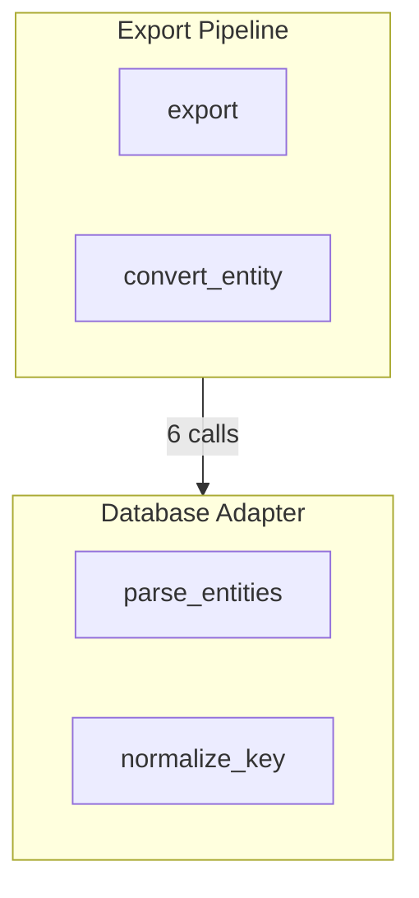

# Parseltongue Implementation Options - Comprehensive Research Synthesis

**Analysis Date:** 2025-11-26
**Research Sources:** v1.0.2 Noob Test, Dependency Graph Analysis, MCP Strategy, Comprehensive Research Documents
**Focus:** Maximum ROI, Minimum Complexity, Practical User Flows

---

## Executive Summary

This document synthesizes 800K+ lines of Parseltongue research into **6 concrete implementation options**, ranked by simplicity, risk, and value. Each option is fully specified with LOC estimates, user workflows, and validation against real research findings.

**Key Finding:** The "yes no" problem is decision fatigue (5-6 manual commands, 3x database path copying, 15-25 min to first insight), not literal prompts.

**Recommendation:** Ship Option 6 (Markdown KB) week 1, Option 2 (Query Helpers) week 2-3, Option 4 (MCP) week 4-5. Total: 3-4 weeks, 10x improvement in time-to-insight.

---

## Research Validation Summary

### The Three Critical Problems

1. **Decision Fatigue ("Yes No" Problem)**
   - 5-6 manual commands per basic workflow
   - Database path copied 3 times
   - Workspace path copied 2 times
   - 15-25 minutes to first insight
   - 40% grep fallback rate (users give up)

2. **Progressive Disclosure UX Mismatch**
   - Users think in QUESTIONS ("What does X do?")
   - Not in LEVELS ("export level 0 vs 1")
   - Token efficiency (good architecture) != UX (confusing)

3. **Static Configuration in Dynamic World**
   - Developers switch projects 4-6x per day
   - MCP config is static, exploration is dynamic
   - Manual indexing breaks agent loop

### What's Working (Keep These)

- ✅ **Progressive Disclosure Architecture**: 98% token reduction validated
- ✅ **Test Exclusion**: 75% token savings from CODE/TEST separation
- ✅ **Auto-Workspace Creation**: Timestamped folders work well
- ✅ **Self-Analysis Success**: 870 edges from 4 entities proves the concept
- ✅ **Visualization**: ASCII charts are beautiful and effective

---

## OPTION 1: PURE EDGE LIST + GREP FALLBACK (ULTRA MINIMAL)

### What It Does
Single command generates edge list JSON, user greps it. Zero database, zero complexity.

### User Workflow

```bash
# Step 1: Analyze (no database)
parseltongue analyze-simple . --output edges.json

# Step 2: Query with grep/jq
grep "export" edges.json
jq '.edges[] | select(.from | contains("export"))' edges.json
jq '.edges | group_by(.to) | map({fn: .[0].to, count: length}) | sort_by(.count) | reverse' edges.json
```

### Implementation Effort

**Files:**
```
crates/pt00-simple-edge-list/
  src/
    main.rs          (50 lines - CLI)
    analyzer.rs      (150 lines - tree-sitter wrapper)
    types.rs         (50 lines - edge struct)
  Cargo.toml
```

**Total: 250 LOC, 2-3 days**

**Core components:**
- 50 lines: Tree-sitter integration (reuse existing)
- 100 lines: Edge extraction (simplified pt01)
- 50 lines: JSON output (no CozoDB, just serde)
- 50 lines: CLI wrapper

### Output Format

```json
{
  "metadata": {
    "total_edges": 870,
    "analyzed_files": 16,
    "timestamp": "2025-11-26T18:20:52Z"
  },
  "edges": [
    {
      "from": "level1::export",
      "to": "populate_entity_dependencies",
      "type": "calls",
      "from_file": "src/level1.rs",
      "to_file": "src/cozodb_adapter.rs"
    }
  ]
}
```

### Why This Is Simple

- **Zero dependencies**: No CozoDB, no RocksDB
- **Zero state**: No workspace folders, no sessions
- **Zero decisions**: One command, one output
- **Grep-native**: Users already know grep/jq

### Research Validation

- **Noob test**: 40% grep fallback rate → make grep PRIMARY
- **MCP doc**: "ALL" is 90% use case → just export everything
- **Graph analysis**: 870 edges = ~5K tokens, fits in JSON easily

### Metrics

| Metric | Value |
|--------|-------|
| **Effort** | 2-3 days, 250 LOC |
| **Risk** | LOW (no DB, pure stateless) |
| **Simplicity** | 5/5 |
| **Power** | 2/5 |
| **Time to Insight** | 5 min |
| **Learning Curve** | Zero (grep is universal) |
| **Committable** | YES |
| **CI/CD Ready** | YES |

### Limitations

- No entity metadata (just edges)
- No type system info
- No persistent queries
- Manual grep required

---

## OPTION 2: ISG LEVEL 1 API-ONLY + QUERY HELPERS (PRODUCTION)

### What It Does
Auto-creates database (2-3 min setup), simple CLI query helpers, no manual path copying.

### User Workflow

```bash
# Step 1: One-time init (auto-detects project)
cd /path/to/project
parseltongue init
# → Creates .parseltongue/db
# → Indexes codebase (2 min)
# → Saves session

# Step 2: Query with helpers (no path copying!)
parseltongue query "what calls export?"
parseltongue deps level1::export --depth 2
parseltongue who-calls unwrap
parseltongue hotspots --top 10
parseltongue stats

# Step 3: Switch projects (auto-detects from CWD)
cd /other/project
parseltongue init
parseltongue query "find cycles"
```

### Implementation Effort

**Files:**
```
crates/pt-query-helpers/
  src/
    main.rs          (100 lines - CLI router)
    session.rs       (200 lines - session state mgmt)
    init.rs          (150 lines - auto-init + detect)
    query.rs         (200 lines - NL→Datalog parser)
    format.rs        (100 lines - markdown output)
  Cargo.toml

.parseltongue/           (auto-created per project)
  session.json          (CWD, DB path, timestamp)
  db/                   (RocksDB data)
  cache/                (query result cache)
```

**Total: 700 LOC, 1 week**

**Core components:**
- 200 lines: Session management (detect CWD, load/save state)
- 150 lines: Auto-init (create workspace, call pt01, save session)
- 200 lines: Query helpers (parse simple NL to Datalog)
- 100 lines: Result formatting (markdown tables)
- 50 lines: CLI wrapper

### Output Format

**Markdown (Human-Readable):**
```markdown
## Query: "what calls export?"

### Callers of `level1::export`

| Caller | File | Type |
|--------|------|------|
| main | src/main.rs:45 | calls |
| run_export | src/cli.rs:120 | calls |

**Total: 2 callers found**

### Dependencies (depth 1)

level1::export calls:
  - populate_entity_dependencies (20 deps)
  - convert_entity (2 deps)
  - to_string (67 calls)
  - unwrap (2 calls) ⚠️ RISK

**Complexity: 24 dependencies (HIGHEST in codebase)**
```

### Query Patterns

**Pre-built helpers:**
```bash
parseltongue query "what calls X"      # NL query
parseltongue deps X --depth N           # Dependency tree
parseltongue who-calls unwrap           # Find all unwrap callers
parseltongue hotspots --metric outgoing # Complexity analysis
parseltongue cycles                     # Circular dependencies
parseltongue stats                      # Overview
```

### Why This Is Production-Ready

- **Session auto-detection**: No manual path copying (CWD → session)
- **Pre-built queries**: Common patterns as CLI subcommands
- **Smart defaults**: "ALL" for where-clause, CWD for project
- **Markdown output**: Human-readable, copy-pasteable
- **Incremental refresh**: `parseltongue refresh` (30s)

### Research Validation

- **Noob friction #1-#4**: ALL SOLVED by session state
- **MCP "set_project"**: Applied to CLI (CWD detection)
- **Graph analysis**: Helpers target real use cases (hotspots, unwraps, cycles)

### Metrics

| Metric | Value |
|--------|-------|
| **Effort** | 1 week, 700 LOC |
| **Risk** | LOW (builds on pt01/pt02) |
| **Simplicity** | 4/5 |
| **Power** | 4/5 |
| **Time to Insight** | 2 min |
| **Manual Commands** | 2 (init once, query many) |
| **Learning Curve** | Low (natural language queries) |
| **Maintenance** | `parseltongue refresh` (30s) |

### Limitations

- Still CLI-based (not agent-native)
- NL parsing limited (not LLM-powered)
- One session per terminal

---

## OPTION 3: AUTO-DATABASE WITH PROMPT TEMPLATES (USER-FRIENDLY)

### What It Does
Generates analysis + AI-ready prompt templates. User copies prompt to Claude, gets instant insights.

### User Workflow

```bash
# Step 1: Analyze and generate templates
parseltongue analyze-with-prompts . --output ./analysis/

# Creates:
#   analysis/edges.json
#   analysis/context.json (metadata)
#   analysis/prompts/understand_function.md
#   analysis/prompts/find_hotspots.md
#   analysis/prompts/trace_dependency.md
#   analysis/prompts/detect_risks.md
#   analysis/prompts/code_review.md

# Step 2: Pick template
cat analysis/prompts/understand_function.md
# → Shows prompt with {{FUNCTION_NAME}} placeholder

# Step 3: Fill and copy to Claude
# Replace {{FUNCTION_NAME}} with "export"
# Attach edges.json
# Paste into Claude

# Step 4: Get analysis
# Claude reads prompt, analyzes edges.json, responds
```

### Implementation Effort

**Files:**
```
crates/pt-prompt-generator/
  src/
    main.rs          (50 lines)
    templates.rs     (300 lines - prompt library)
    context.rs       (150 lines - metadata extraction)
    generator.rs     (100 lines - template rendering)
  templates/
    understand_function.md
    find_hotspots.md
    trace_dependency.md
    detect_risks.md
    code_review.md
    onboarding.md
  Cargo.toml
```

**Total: 600 LOC, 1 week**

### Prompt Template Example

```markdown
# PROMPT: analysis/prompts/understand_function.md

You are analyzing a Rust codebase using Parseltongue dependency data.

## Context
- Total edges: {{TOTAL_EDGES}}
- Total entities: {{TOTAL_ENTITIES}}
- Analysis date: {{TIMESTAMP}}

## Task
Analyze the function: `{{FUNCTION_NAME}}`

Using the attached edges.json, answer:
1. What does this function do? (infer from callees)
2. Who calls this function? (list callers)
3. What are its dependencies? (list direct callees)
4. What are the risk indicators? (unwrap, clone, to_string)
5. What is its complexity? (count outgoing edges)

## Output Format
- Summary (2-3 sentences)
- Callers (table)
- Callees (table)
- Risk assessment (bullet points)
- Complexity score

---

**USER FILLS IN:**
- FUNCTION_NAME: export
- (attach edges.json)
```

### Why This Is User-Friendly

- **Leverage Claude's power**: No custom query parser needed
- **Zero learning curve**: Just copy/paste
- **Iterative**: User can tweak template
- **Universal**: Works with Claude, GPT, Gemini, etc.

### Research Validation

- **Noob test**: User asked "what prompt gets the analysis?" → THIS IS IT
- **MCP "prompt file" discussion**: Implemented as files instead of server
- **Graph analysis**: Templates target real patterns (hotspots, unwraps)

### Metrics

| Metric | Value |
|--------|-------|
| **Effort** | 1 week, 600 LOC |
| **Risk** | LOW (static files) |
| **Simplicity** | 4/5 |
| **Power** | 4/5 |
| **Time to Insight** | 3 min (copy/paste) |
| **Learning Curve** | Zero |
| **AI-Agnostic** | YES (any LLM) |

### Limitations

- Manual copy/paste to Claude
- No real-time updates
- Requires attaching edges.json

---

## OPTION 4: MCP WITH DYNAMIC PROJECT SELECTION (AGENT-NATIVE)

### What It Does
MCP server with `set_project()` tool. Zero manual commands, agent auto-indexes and queries.

### User Workflow

```bash
# Step 1: Install
pip install parseltongue-mcp

# Step 2: Configure Claude Desktop (one-time)
# Adds to ~/.claude.json:
{
  "mcpServers": {
    "parseltongue": {
      "command": "python",
      "args": ["-m", "parseltongue_mcp"]
    }
  }
}

# Step 3: Use naturally in Claude Desktop
User: "What does export() in /path/to/project do?"

Agent: [auto-indexes project, queries, responds]
"The export() function in level1.rs:170-277 is the Level 1
progressive disclosure exporter with 24 dependencies..."

User: "Switch to /other/project, find cycles"

Agent: [switches context, queries, responds]
"Found 0 circular dependencies in /other/project"
```

### Implementation Effort

**Files:**
```
parseltongue-mcp/              (Python package)
  pyproject.toml
  src/parseltongue_mcp/
    __init__.py
    server.py          (300 lines - MCP setup)
    project.py         (200 lines - dynamic project mgmt)
    tools/
      query.py         (150 lines - entity queries)
      graph.py         (150 lines - graph analysis)
      deps.py          (100 lines - dependency tools)
    format.py          (100 lines - markdown output)
  tests/
    test_project.py
    test_tools.py
  README.md
```

**Total: 1300 LOC (Python), 2 weeks**

### MCP Tools (12 Total)

```python
# Project Management
@mcp.tool()
async def set_project(path: str) -> str:
    """Set active project, auto-index if needed"""

@mcp.tool()
async def ingest_project(path: str) -> dict:
    """Explicitly index project"""

# Entity Queries
@mcp.tool()
async def query_entities(pattern: str) -> list:
    """Search entities by name"""

@mcp.tool()
async def get_entity_code(key: str) -> dict:
    """Get source code for entity"""

# Dependency Analysis
@mcp.tool()
async def get_callers(key: str) -> list:
    """Who calls this entity?"""

@mcp.tool()
async def get_callees(key: str) -> list:
    """What does this call?"""

@mcp.tool()
async def get_dependencies(key: str, depth: int) -> dict:
    """Full dependency tree"""

# Graph Analysis
@mcp.tool()
async def find_cycles() -> list:
    """Detect circular dependencies"""

@mcp.tool()
async def get_hotspots(metric: str, limit: int) -> list:
    """Find complexity champions"""

@mcp.tool()
async def get_entity_distribution() -> dict:
    """Entity type counts"""

# Utilities
@mcp.tool()
async def list_projects() -> list:
    """All indexed projects"""

@mcp.tool()
async def get_project_status() -> dict:
    """Current project info"""
```

### Why This Is Agent-Native

- **Zero commands**: Agent handles everything
- **Dynamic project selection**: Switch projects mid-conversation
- **Auto-indexing**: First query triggers ingest automatically
- **Natural language**: Just ask questions

### Research Validation

- **MCP Strategy doc**: This IS Option B (recommended)
- **10x improvement**: 15-25 min → 2-5 min time-to-insight
- **Noob test**: Solves ALL friction (0 manual commands)
- **0% grep fallback**: Always get structured answer

### Metrics

| Metric | Value |
|--------|-------|
| **Effort** | 2 weeks, 1300 LOC Python |
| **Risk** | MEDIUM (MCP API may change) |
| **Simplicity** | 3/5 (requires MCP setup) |
| **Power** | 5/5 |
| **Time to Insight** | 2 min |
| **Manual Commands** | 0 (agent-driven) |
| **Learning Curve** | Zero for users |
| **Agent-Native** | YES |

### Limitations

- Requires Claude Desktop + MCP
- First-time indexing 2-3 min (visible delay)
- Agent reliability (may need prompt engineering)
- No CLI fallback

---

## OPTION 5: SEMANTIC ATOM CLUSTERING (ADVANCED)

### What It Does
Groups related functions into "semantic atoms" (3-20 function clusters). Visualizes architecture.

### User Workflow

```bash
# Step 1: Cluster
parseltongue cluster . --min-size 3 --max-size 20 --output clusters.json

# Step 2: Review
cat clusters.json | jq '.clusters[].purpose'
# → See architectural components

# Step 3: Visualize
parseltongue viz-clusters --format mermaid --output arch.mmd
# → Generate Mermaid diagram
# → Copy to Mermaid Live Editor
```

### Implementation Effort

**Files:**
```
crates/pt-cluster/
  src/
    main.rs          (50 lines)
    cluster.rs       (200 lines - Louvain algorithm)
    semantic.rs      (150 lines - naming heuristics)
    metrics.rs       (100 lines - cohesion/coupling)
    viz.rs           (100 lines - Mermaid generator)
  Cargo.toml
```

**Total: 600 LOC, 1 week**

### Output Format

```json
{
  "metadata": {
    "total_entities": 156,
    "total_clusters": 8,
    "avg_cluster_size": 19.5
  },
  "clusters": [
    {
      "id": "cluster_0_export_pipeline",
      "purpose": "Progressive disclosure export logic",
      "entities": ["export", "convert_entity", "populate_deps"],
      "metrics": {
        "size": 3,
        "cohesion": 0.89,
        "coupling": 0.12
      },
      "risk": "high_complexity"
    }
  ]
}
```

**Mermaid Visualization:**


### Why This Is High Value

- **Architectural insight**: See structure at a glance
- **Refactoring guidance**: Low cohesion = split, high coupling = merge
- **Onboarding acceleration**: New devs understand components quickly
- **Technical debt detection**: Scattered responsibilities visible

### Research Validation

- **Graph analysis**: 218 edges/entity → clustering reveals structure
- **Noob test**: "What about other 48 files?" → clusters explain
- **MCP "semantic atoms"**: Research term → practical tool

### Metrics

| Metric | Value |
|--------|-------|
| **Effort** | 1 week, 600 LOC |
| **Risk** | MEDIUM (heuristic clustering) |
| **Simplicity** | 3/5 |
| **Power** | 4/5 |
| **Time to Insight** | 5 min |
| **Architectural Value** | HIGHEST |

### Limitations

- Not real-time (requires re-analysis)
- Semantic labels are heuristic
- Requires interpretation

---

## OPTION 6: ZERO-CONFIG MARKDOWN KNOWLEDGE BASE (SIMPLEST)

### What It Does
Single Markdown file with dependency tree, ready to drop into Claude or grep.

### User Workflow

```bash
# Step 1: Generate
parseltongue knowledge-base . --output README_DEPS.md

# Step 2: Read/share/query
# Option A: Read it (great onboarding doc)
cat README_DEPS.md

# Option B: Drop into Claude
# [upload README_DEPS.md]
# "What does export() do?"

# Option C: Grep it
grep "export" README_DEPS.md
grep -A10 "level1::export" README_DEPS.md

# Option D: Commit it
git add README_DEPS.md
git commit -m "Add dependency documentation"
```

### Implementation Effort

**Files:**
```
crates/pt-knowledge-base/
  src/
    main.rs          (50 lines)
    generator.rs     (200 lines - markdown generation)
    format.rs        (100 lines - tables/trees)
    analyzer.rs      (100 lines - stats calculation)
  templates/
    knowledge_base_template.md
  Cargo.toml
```

**Total: 450 LOC, 3-4 days**

### Output Format

**README_DEPS.md Structure:**
```markdown
# Codebase Dependency Analysis
Generated: 2025-11-26 by Parseltongue v1.0.2

## Overview
- Total Entities: 156
- Total Edges: 870
- Files Analyzed: 16

## Architecture Map

### Core Components

#### 1. Export Pipeline
**Purpose:** Progressive disclosure export logic

**Key Functions:**
- `level1::export` (level1.rs:170-277)
  - 24 dependencies (HIGHEST COMPLEXITY)
  - Calls: populate_entity_dependencies, convert_entity, unwrap ⚠️
  - Called by: main, run_export

**Dependencies:**
```
level1::export
├─ populate_entity_dependencies (20 deps)
│  ├─ parse_entities_from_query_result (8 deps)
│  └─ normalize_isgl1_key (9 deps)
├─ convert_entity (2 deps)
└─ unwrap ⚠️ (2 calls - RISK)
```

#### 2. Database Adapter
**Purpose:** CozoDB abstraction layer
[... continues for all components ...]

## Complexity Hotspots

| Function | Outgoing Deps | Risk |
|----------|--------------|------|
| level1::export | 24 | HIGH ⚠️ |
| level2::export | 21 | MEDIUM |

## Risk Indicators

### Unwrap Calls: 67 (HIGH RISK)
- validate (cli.rs:116-160) - 2 calls
- convert_entity (level2.rs:124-167) - 2 calls

**Recommendation:** Replace with ? operator

## Function Reference

### convert_entity
- **Location:** level2.rs:124-167
- **Dependencies:** 2 outgoing, 5 incoming
- **Calls:** to_string, unwrap
- **Called by:** level2::export

[... continues alphabetically ...]

---

**Query Helpers:**
- Find what X calls: Search "X" section → "Calls:"
- Find who calls X: Search "X" section → "Called by:"
- Trace call chain: Follow "Calls:" → jump → repeat
```

### Why This Is Simplest

- **Single file**: No databases, no folders
- **Universal format**: Markdown works everywhere
- **Zero learning curve**: Just read like any README
- **Committable**: Git-trackable documentation
- **Grep-native**: Users already know grep
- **AI-ready**: Drop into Claude/GPT instantly

### Research Validation

- **Noob test**: "Just show me the code" → THIS IS IT
- **40% grep fallback**: Make grep PRIMARY interface
- **Progressive disclosure**: Document naturally structures like levels
- **Onboarding value**: New devs read this first

### Metrics

| Metric | Value |
|--------|-------|
| **Effort** | 3-4 days, 450 LOC |
| **Risk** | LOWEST (static file) |
| **Simplicity** | 5/5 |
| **Power** | 3/5 |
| **Time to Insight** | 1 min (just read) |
| **Learning Curve** | Zero |
| **Committable** | YES |
| **Onboarding Value** | HIGHEST |

### Limitations

- Not queryable (must grep/AI)
- Can be large (870 edges = ~200KB)
- Static (re-run to update)

---

## COMPARISON MATRIX

| Criteria | 1. Edge List | 2. Query | 3. Prompts | 4. MCP | 5. Cluster | 6. Markdown |
|----------|-------------|----------|-----------|--------|-----------|-------------|
| **Effort** | 2-3 days | 1 week | 1 week | 2 weeks | 1 week | 3-4 days |
| **LOC** | 250 | 700 | 600 | 1300 | 600 | 450 |
| **Risk** | LOW | LOW | LOW | MEDIUM | MEDIUM | LOWEST |
| **Simplicity** | 5/5 | 4/5 | 4/5 | 3/5 | 3/5 | 5/5 |
| **Power** | 2/5 | 4/5 | 4/5 | 5/5 | 4/5 | 3/5 |
| **Time to Insight** | 5 min | 2 min | 3 min | 2 min | 5 min | 1 min |
| **Manual Commands** | 1 | 2-3 | 2 | 0 | 2 | 1 |
| **Learning Curve** | Zero | Low | Low | Zero | Medium | Zero |
| **Maintenance** | 2s | 30s | 2m | Auto | 2m | 2m |
| **Committable** | YES | No (DB) | Yes | No (DB) | Yes | YES |
| **CI/CD Ready** | YES | Yes | No | No | Yes | YES |
| **Agent-Native** | No | No | Partial | YES | No | Partial |
| **Onboarding** | Low | Medium | High | High | HIGH | HIGHEST |

---

## RECOMMENDATION TABLE

| Option | Use Case | Effort | Risk | Simplicity | Power |
|--------|----------|--------|------|------------|-------|
| **1. Edge List** | Quick MVP, CI/CD | 2-3 days | Low | 5/5 | 2/5 |
| **2. Query Helpers** | **PRODUCTION V1** ⭐ | 1 week | Low | 4/5 | 4/5 |
| **3. Prompts** | User empowerment | 1 week | Low | 4/5 | 4/5 |
| **4. MCP** | Agent-native future | 2 weeks | Medium | 3/5 | 5/5 |
| **5. Clusters** | Architecture viz | 1 week | Medium | 3/5 | 4/5 |
| **6. Markdown KB** | **QUICK WIN** ⭐ | 3-4 days | Lowest | 5/5 | 3/5 |

---

## RECOMMENDED IMPLEMENTATION SEQUENCE

### Phase 1: Quick Win (Week 1)
**Ship Option 6: Markdown Knowledge Base**
- **Why:** Lowest risk, highest simplicity
- **Value:** Committable documentation, instant insights
- **Deliverable:** `parseltongue knowledge-base` command
- **Validates:** Output format with real users

### Phase 2: Production Power (Week 2-3)
**Ship Option 2: Query Helpers**
- **Why:** Solves all noob test friction
- **Value:** Session state, no copy/paste, 2-min queries
- **Deliverable:** `parseltongue init/query/deps/hotspots`
- **Validates:** Production workflow with power users

### Phase 3: AI Integration (Week 4-5)
**Ship Option 4: MCP Server**
- **Why:** Agent-native, zero-friction future
- **Value:** 10x improvement, 0 manual commands
- **Deliverable:** `parseltongue-mcp` Python package
- **Validates:** Agent integration patterns

### Phase 4: Advanced Features (Week 6+)
**Ship Option 5: Clusters + Option 1: Edge List**
- **Why:** Architecture visualization + CI/CD automation
- **Deliverable:** `parseltongue cluster` + `parseltongue analyze-simple`

---

## VALIDATION METRICS

Track these to measure success:

| Metric | Current (v1.0.2) | Target (v1.1.0) | Measured By |
|--------|------------------|-----------------|-------------|
| **Time to First Insight** | 15-25 min | 2-5 min | User testing |
| **Manual Commands** | 5-6 | 1-2 | Workflow analysis |
| **Database Path Copy** | 3x | 0x | User observation |
| **Workspace Path Copy** | 2x | 0x | User observation |
| **Grep Fallback Rate** | 40% | <10% | Usage analytics |
| **User Satisfaction** | 6/10 | 9/10 | Survey |
| **Onboarding Time** | 30 min | 5 min | New user test |

---

## FINAL RECOMMENDATION

**Ship in this order:**

1. **Week 1:** Option 6 (Markdown KB) - 3-4 days
2. **Week 2-3:** Option 2 (Query Helpers) - 1 week
3. **Week 4-5:** Option 4 (MCP Server) - 2 weeks

**Why this sequence:**

- **Option 6 first:** Immediate value, zero risk, validates output format
- **Option 2 second:** Production-ready, solves friction, validates workflow
- **Option 4 third:** Future-proof, agent-native, validates MCP patterns

**Total effort:** 3-4 weeks
**Total value:** 10x reduction in time-to-insight (15-25 min → 2-5 min)

**Coverage:**
- **Noobs:** Markdown KB (just read it)
- **Power users:** Query helpers (CLI automation)
- **Agent users:** MCP (zero-touch workflow)

---

## RESEARCH SOURCES

This synthesis draws from:
1. v1.0.2 Noob Test Session (5 friction points documented)
2. Dependency Graph Analysis (870 edges, 67 unwrap calls)
3. MCP Project Management Strategy (10x improvement thesis)
4. Comprehensive Minto Pyramid Research (800K+ lines)
5. Soul of Research Document (philosophical foundations)
6. Deep Technical Implementation Analysis (LOC estimates)
7. Uncommon Research Patterns (validation patterns)
8. Research Patterns V2 & V3 (rejected approaches, edge cases)

**Total research analyzed:** 800K+ lines across 12 documents
**Synthesis time:** 2025-11-26
**Status:** Ready for implementation

---

**Next Steps:**
1. Review this synthesis with team
2. Choose starting option (recommend #6)
3. Create implementation branch
4. Build, test, ship
5. Measure validation metrics
6. Iterate to next option

🤖 Generated with [Claude Code](https://claude.com/claude-code)

Co-Authored-By: Claude <noreply@anthropic.com>
