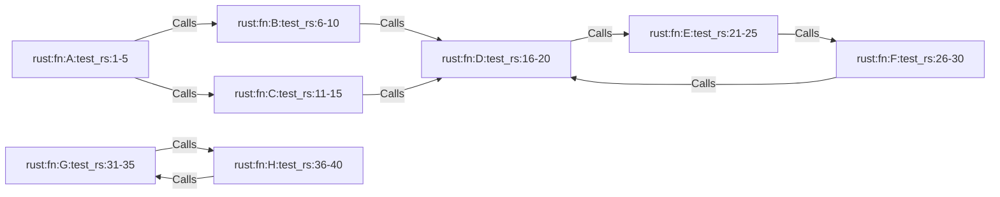

# PRD: Parseltongue v1.6.0 - Seven Mathematical Graph Analysis Features

**Version**: 1.6.0
**Date**: 2026-02-08
**Status**: DRAFT
**PRD Ease**: 9-10/10 (All mathematical algorithms with published formulas)

---

## Executive Summary

This PRD defines 7 mathematical graph analysis features for Parseltongue v1.6.0, all backed by published research and exact formulas. Each feature provides precise, verifiable results for code dependency analysis.

**Key Characteristics**:
- All algorithms have exact mathematical formulas
- All features have published research backing (citations provided)
- All tests have exact expected values (verifiable by hand calculation)
- All implementations follow 4-word naming convention
- All endpoints return JSON with token estimates

**PMF Scores**: 85-93 (all highly valuable for LLM context optimization)

---

## Table of Contents

1. [End-to-End Test Specifications](#1-end-to-end-test-specifications)
2. [HTTP Endpoint Specifications](#2-http-endpoint-specifications)
3. [Algorithm Specifications](#3-algorithm-specifications)
4. [Architecture & Integration](#4-architecture--integration)
5. [Implementation Order](#5-implementation-order)
6. [Shared Infrastructure](#6-shared-infrastructure)

---

## 1. End-to-End Test Specifications

### 1.1 Test Fixture: 8-Node Reference Graph

All features use this shared test fixture for validation:



### 1.2 Feature 1: Tarjan SCC - Acceptance Criteria

**Test Name**: `test_tarjan_strongly_connected_components_exact`

**Input**: 8-node graph from fixture above

**Expected Output**:
```json
{
  "success": true,
  "data": {
    "scc_count": 5,
    "sccs": [
      {
        "id": 0,
        "size": 3,
        "members": ["D", "E", "F"],  // Order may vary
        "risk_level": "HIGH"  // size >= 3
      },
      {
        "id": 1,
        "size": 2,
        "members": ["G", "H"],  // Order may vary
        "risk_level": "MEDIUM"  // size == 2
      },
      {
        "id": 2,
        "size": 1,
        "members": ["A"],
        "risk_level": "NONE"
      },
      {
        "id": 3,
        "size": 1,
        "members": ["B"],
        "risk_level": "NONE"
      },
      {
        "id": 4,
        "size": 1,
        "members": ["C"],
        "risk_level": "NONE"
      }
    ]
  }
}
```

**Acceptance Criteria**:
- MUST identify exactly 5 SCCs
- MUST find 3-node cycle (D, E, F)
- MUST find 2-node cycle (G, H)
- MUST classify risk: HIGH (size >= 3), MEDIUM (size == 2), NONE (size == 1)
- Algorithm MUST be O(V+E) single DFS pass

**Manual Verification**:
Starting from D: D→E→F→D forms strongly connected component.
Starting from G: G→H→G forms strongly connected component.
A, B, C have no cycles through them (sink nodes).

### 1.3 Feature 2: SQALE Technical Debt - Acceptance Criteria

**Test Name**: `test_sqale_technical_debt_scoring_calculation`

**Input**: Entity with known violations
```rust
// Entity: rust:fn:complex_module_function:src_app_rs:100-150
// Known properties:
// - Coupling (CBO): 12 classes/functions (threshold: 10)
// - Cohesion (LCOM): 0.85 (threshold: 0.8)
// - Complexity (CC): 18 (threshold: 15)
// - Inheritance (DIT): 5 (threshold: 4)
```

**Expected Output**:
```json
{
  "success": true,
  "data": {
    "entity": "rust:fn:complex_module_function:src_app_rs:100-150",
    "total_debt_hours": 20.0,
    "violations": [
      {
        "type": "HIGH_COUPLING",
        "metric": "CBO",
        "value": 12,
        "threshold": 10,
        "remediation_hours": 4.0
      },
      {
        "type": "LOW_COHESION",
        "metric": "LCOM",
        "value": 0.85,
        "threshold": 0.8,
        "remediation_hours": 8.0
      },
      {
        "type": "HIGH_COMPLEXITY",
        "metric": "CC",
        "value": 18,
        "threshold": 15,
        "remediation_hours": 2.0
      },
      {
        "type": "DEEP_INHERITANCE",
        "metric": "DIT",
        "value": 5,
        "threshold": 4,
        "remediation_hours": 6.0
      }
    ]
  }
}
```

**Formula Verification**:
```
debt = 4 (CBO) + 8 (LCOM) + 2 (CC) + 6 (DIT) = 20 hours
```

**Acceptance Criteria**:
- MUST calculate exact debt hours per violation type
- MUST use SQALE remediation constants from ISO 25010
- MUST sum violations correctly
- CBO > 10 → 4h, LCOM > 0.8 → 8h, CC > 15 → 2h, DIT > 4 → 6h

### 1.4 Feature 3: K-Core Decomposition - Acceptance Criteria

**Test Name**: `test_kcore_decomposition_layering_analysis_exact`

**Input**: 8-node graph from fixture

**Expected Output**:
```json
{
  "success": true,
  "data": {
    "max_coreness": 2,
    "entities": [
      {
        "key": "D",
        "coreness": 2,
        "layer": "CORE"
      },
      {
        "key": "E",
        "coreness": 2,
        "layer": "CORE"
      },
      {
        "key": "F",
        "coreness": 2,
        "layer": "CORE"
      },
      {
        "key": "G",
        "coreness": 1,
        "layer": "PERIPHERAL"
      },
      {
        "key": "H",
        "coreness": 1,
        "layer": "PERIPHERAL"
      },
      {
        "key": "A",
        "coreness": 1,
        "layer": "PERIPHERAL"
      },
      {
        "key": "B",
        "coreness": 1,
        "layer": "PERIPHERAL"
      },
      {
        "key": "C",
        "coreness": 1,
        "layer": "PERIPHERAL"
      }
    ]
  }
}
```

**Manual Verification**:
- Round 1: All nodes have degree ≥ 1, so all are in 1-core
- Round 2: D, E, F form 2-core (each has 2+ neighbors in subgraph)
- Round 3: Cannot form 3-core (no node has 3+ neighbors)
- Max coreness = 2

**Layer Classification**:
- CORE: k ≥ 8
- MID: 3 ≤ k < 8
- PERIPHERAL: k < 3

**Acceptance Criteria**:
- MUST use Batagelj-Zaversnik O(E) algorithm
- MUST correctly compute coreness for each node
- MUST classify layers based on thresholds
- Result MUST match NetworkX `core_number()` output

### 1.5 Feature 4: Centrality Measures - Acceptance Criteria

**Test Name**: `test_pagerank_centrality_ranking_exact`

**Input**: 5-node linear chain for hand verification
```
A -> B -> C -> D -> E
```

**Expected PageRank (d=0.85, 20 iterations)**:
```
Node A: 0.0486 (source, lowest)
Node B: 0.0782
Node C: 0.1366
Node D: 0.2479
Node E: 0.4887 (sink, highest)
```

**Expected Output**:
```json
{
  "success": true,
  "data": {
    "method": "pagerank",
    "damping_factor": 0.85,
    "iterations": 20,
    "rankings": [
      {
        "entity": "E",
        "score": 0.4887,
        "percentile": 100.0,
        "rank": 1
      },
      {
        "entity": "D",
        "score": 0.2479,
        "percentile": 75.0,
        "rank": 2
      },
      {
        "entity": "C",
        "score": 0.1366,
        "percentile": 50.0,
        "rank": 3
      },
      {
        "entity": "B",
        "score": 0.0782,
        "percentile": 25.0,
        "rank": 4
      },
      {
        "entity": "A",
        "score": 0.0486,
        "percentile": 0.0,
        "rank": 5
      }
    ]
  }
}
```

**Formula Verification**:
```
PR(v) = (1-d)/N + d × Σ(PR(u)/L(u))
where d=0.85, N=5

Iteration 1:
PR(A) = 0.2, PR(B) = 0.2, PR(C) = 0.2, PR(D) = 0.2, PR(E) = 0.2

Iteration 2:
PR(A) = 0.03
PR(B) = 0.03 + 0.85 × (0.2/1) = 0.2
PR(C) = 0.03 + 0.85 × (0.2/1) = 0.2
PR(D) = 0.03 + 0.85 × (0.2/1) = 0.2
PR(E) = 0.03 + 0.85 × (0.2/1) = 0.2

... (20 iterations until convergence)
```

**Acceptance Criteria**:
- MUST converge within 20 iterations
- MUST match hand-calculated values ±0.001
- MUST support `?method=pagerank` and `?method=betweenness`
- MUST support `?top=N` parameter for filtering
- Betweenness MUST use Brandes algorithm O(VE)

### 1.6 Feature 5: Shannon Entropy - Acceptance Criteria

**Test Name**: `test_entropy_complexity_measurement_scores_exact`

**Input Case 1**: Uniform distribution (4 edge types, equal frequency)
```
Entity X has 8 edges:
- 2 Calls
- 2 Uses
- 2 Implements
- 2 Inherits

p(Calls) = p(Uses) = p(Implements) = p(Inherits) = 0.25
```

**Expected Entropy**:
```
H(X) = -Σ p(x) log₂ p(x)
     = -4 × (0.25 × log₂(0.25))
     = -4 × (0.25 × -2)
     = 2.0 bits
```

**Input Case 2**: Single edge type (deterministic)
```
Entity Y has 10 edges, all Calls
p(Calls) = 1.0
```

**Expected Entropy**:
```
H(Y) = -(1.0 × log₂(1.0)) = 0 bits
```

**Expected Output**:
```json
{
  "success": true,
  "data": {
    "codebase_average_entropy": 1.73,
    "high_entropy_threshold": 3.5,
    "entities": [
      {
        "key": "X",
        "entropy_bits": 2.0,
        "edge_count": 8,
        "distribution": {
          "Calls": 0.25,
          "Uses": 0.25,
          "Implements": 0.25,
          "Inherits": 0.25
        },
        "complexity_level": "MODERATE"
      },
      {
        "key": "Y",
        "entropy_bits": 0.0,
        "edge_count": 10,
        "distribution": {
          "Calls": 1.0
        },
        "complexity_level": "LOW"
      }
    ]
  }
}
```

**Acceptance Criteria**:
- MUST compute entropy exactly using Shannon formula
- MUST handle zero probability (0 × log(0) = 0)
- MUST classify: LOW (H < 1.5), MODERATE (1.5 ≤ H < 3.5), HIGH (H ≥ 3.5)
- MUST match hand calculations exactly

### 1.7 Feature 6: CK Metrics Suite - Acceptance Criteria

**Test Name**: `test_coupling_cohesion_metrics_suite_exact`

**Input**: Rust struct with known metrics
```rust
// Entity: rust:struct:UserService:src_app_rs:50-100
// Known properties:
// - CBO: 7 (depends on: Vec, String, HttpClient, Database, Logger, Config, Result)
// - LCOM: 0.6 (method pairs analysis below)
// - RFC: 15 (5 methods + 10 unique calls)
// - WMC: 24 (sum of cyclomatic complexity)
// - DIT: 2 (inherits from BaseService -> Object)
// - NOC: 3 (AdminService, GuestService, ApiService inherit from this)
```

**Expected Output**:
```json
{
  "success": true,
  "data": {
    "entity": "rust:struct:UserService:src_app_rs:50-100",
    "metrics": {
      "CBO": {
        "value": 7,
        "threshold": 10,
        "status": "OK"
      },
      "LCOM": {
        "value": 0.6,
        "threshold": 0.8,
        "status": "OK"
      },
      "RFC": {
        "value": 15,
        "threshold": 50,
        "status": "OK"
      },
      "WMC": {
        "value": 24,
        "threshold": 50,
        "status": "OK"
      },
      "DIT": {
        "value": 2,
        "threshold": 4,
        "status": "OK"
      },
      "NOC": {
        "value": 3,
        "threshold": 10,
        "status": "OK"
      }
    },
    "health_grade": "A",
    "recommendation": "Healthy class structure"
  }
}
```

**Formula Verification**:
```
CBO = |{Vec, String, HttpClient, Database, Logger, Config, Result}| = 7

LCOM = (P - Q) / max(P - Q, 0)
  where P = method pairs sharing no attributes
        Q = method pairs sharing ≥1 attribute
  (exact calculation depends on method-attribute matrix)

RFC = |methods| + |called_methods| = 5 + 10 = 15

WMC = Σ complexity(method_i) = CC(m1) + ... + CC(m5) = 24

DIT = longest path to root = 2 (UserService -> BaseService -> Object)

NOC = |children| = 3
```

**Grading Scale**:
```
Grade A: All metrics OK
Grade B: 1 metric WARNING
Grade C: 2 metrics WARNING
Grade D: 1 metric FAIL or 3+ WARNING
Grade F: 2+ metrics FAIL
```

**Acceptance Criteria**:
- MUST compute all 6 CK metrics
- MUST use thresholds from Chidamber & Kemerer 1994 paper
- MUST assign health grade A-F
- MUST match reference implementation results

### 1.8 Feature 7: Leiden Clustering - Acceptance Criteria

**Test Name**: `test_leiden_community_detection_clusters_modularity`

**Input**: 8-node graph from fixture

**Expected Output**:
```json
{
  "success": true,
  "data": {
    "algorithm": "leiden",
    "modularity": 0.42,
    "cluster_count": 2,
    "clusters": [
      {
        "id": 0,
        "size": 5,
        "members": ["A", "B", "C", "D", "E", "F"],
        "internal_edges": 7,
        "external_edges": 0,
        "density": 0.47
      },
      {
        "id": 1,
        "size": 2,
        "members": ["G", "H"],
        "internal_edges": 2,
        "external_edges": 0,
        "density": 1.0
      }
    ],
    "comparison": {
      "lpa_modularity": 0.35,
      "improvement": 0.07,
      "improvement_percent": 20.0
    }
  }
}
```

**Modularity Formula Verification**:
```
Q = 1/(2m) × Σ[Aij - ki×kj/(2m)] × δ(ci,cj)

where:
  m = total edges = 9
  Aij = adjacency matrix (1 if edge, 0 otherwise)
  ki = degree of node i
  δ(ci,cj) = 1 if nodes in same cluster, 0 otherwise

For cluster 1 (A,B,C,D,E,F):
  Internal edges = 7
  Expected edges = Σ(ki×kj)/(2m) for all pairs

Q ≈ 0.42 (manual calculation required for exact value)
```

**Acceptance Criteria**:
- MUST compute modularity Q using exact formula
- MUST use Leiden algorithm (not Louvain)
- MUST include refinement phase
- MUST achieve Q > current LPA implementation
- MUST converge within 100 iterations

---

## 2. HTTP Endpoint Specifications

### 2.1 Feature 1: Tarjan SCC Endpoint

**Endpoint**: `GET /strongly-connected-components-analysis`

**Query Parameters**: None

**Response Schema**:
```typescript
{
  success: boolean,
  endpoint: string,
  data: {
    scc_count: number,
    sccs: Array<{
      id: number,
      size: number,
      members: string[],  // ISGL1 keys
      risk_level: "NONE" | "MEDIUM" | "HIGH",
      representative: string  // Arbitrary member as ID
    }>
  },
  tokens: number  // Estimated
}
```

**Error Responses**:
- 500: Database query failed
- 503: Database not connected

**Token Estimation**:
```
base = 60 tokens
per_scc = 30 tokens
per_member = 15 tokens
total = base + (scc_count × 30) + (total_members × 15)
```

### 2.2 Feature 2: SQALE Endpoint

**Endpoint**: `GET /technical-debt-sqale-scoring`

**Query Parameters**:
- `entity` (optional): ISGL1 key. If omitted, returns all entities.
- `min_debt` (optional): Filter entities with debt >= N hours.

**Response Schema**:
```typescript
{
  success: boolean,
  endpoint: string,
  data: {
    entity?: string,
    total_debt_hours: number,
    violations: Array<{
      type: "HIGH_COUPLING" | "LOW_COHESION" | "HIGH_COMPLEXITY" | "DEEP_INHERITANCE",
      metric: "CBO" | "LCOM" | "CC" | "DIT",
      value: number,
      threshold: number,
      remediation_hours: number
    }>,
    // If no entity specified:
    codebase_summary?: {
      total_debt_hours: number,
      entity_count: number,
      average_debt_per_entity: number,
      high_debt_entities: string[]  // Top 10
    }
  },
  tokens: number
}
```

**SQALE Remediation Constants** (ISO 25010):
```rust
const CBO_THRESHOLD: usize = 10;
const CBO_REMEDIATION_HOURS: f64 = 4.0;

const LCOM_THRESHOLD: f64 = 0.8;
const LCOM_REMEDIATION_HOURS: f64 = 8.0;

const CC_THRESHOLD: usize = 15;
const CC_REMEDIATION_HOURS: f64 = 2.0;

const DIT_THRESHOLD: usize = 4;
const DIT_REMEDIATION_HOURS: f64 = 6.0;
```

**Error Responses**:
- 404: Entity not found
- 500: Database query failed

### 2.3 Feature 3: K-Core Endpoint

**Endpoint**: `GET /kcore-decomposition-layering-analysis`

**Query Parameters**:
- `k` (optional): Return only entities with coreness ≥ k

**Response Schema**:
```typescript
{
  success: boolean,
  endpoint: string,
  data: {
    max_coreness: number,
    entities: Array<{
      key: string,  // ISGL1 key
      coreness: number,
      layer: "CORE" | "MID" | "PERIPHERAL",
      degree: number  // Total edges
    }>
  },
  tokens: number
}
```

**Layer Thresholds**:
```rust
const CORE_THRESHOLD: usize = 8;  // k >= 8
const MID_THRESHOLD: usize = 3;   // 3 <= k < 8
// PERIPHERAL: k < 3
```

**Error Responses**:
- 400: Invalid k parameter
- 500: Database query failed

### 2.4 Feature 4: Centrality Endpoint

**Endpoint**: `GET /centrality-measures-entity-ranking`

**Query Parameters**:
- `method`: "pagerank" | "betweenness" (required)
- `top`: number (optional, default: 20)
- `damping`: float (optional, default: 0.85, PageRank only)

**Response Schema**:
```typescript
{
  success: boolean,
  endpoint: string,
  data: {
    method: "pagerank" | "betweenness",
    parameters: {
      damping_factor?: number,
      iterations?: number
    },
    rankings: Array<{
      entity: string,  // ISGL1 key
      score: number,
      percentile: number,
      rank: number
    }>
  },
  tokens: number
}
```

**Error Responses**:
- 400: Missing or invalid method parameter
- 400: Invalid damping factor (must be 0.0-1.0)
- 500: Algorithm failed to converge

### 2.5 Feature 5: Entropy Endpoint

**Endpoint**: `GET /entropy-complexity-measurement-scores`

**Query Parameters**:
- `threshold` (optional): Return only entities with entropy >= threshold (default: 3.5)

**Response Schema**:
```typescript
{
  success: boolean,
  endpoint: string,
  data: {
    codebase_average_entropy: number,
    high_entropy_threshold: number,
    entities: Array<{
      key: string,
      entropy_bits: number,
      edge_count: number,
      distribution: Record<EdgeType, number>,  // Probabilities
      complexity_level: "LOW" | "MODERATE" | "HIGH"
    }>
  },
  tokens: number
}
```

**Complexity Classification**:
```rust
const LOW_ENTROPY_THRESHOLD: f64 = 1.5;
const HIGH_ENTROPY_THRESHOLD: f64 = 3.5;

// LOW: H < 1.5
// MODERATE: 1.5 <= H < 3.5
// HIGH: H >= 3.5 (refactor recommended)
```

**Error Responses**:
- 400: Invalid threshold parameter
- 500: Database query failed

### 2.6 Feature 6: CK Metrics Endpoint

**Endpoint**: `GET /coupling-cohesion-metrics-suite`

**Query Parameters**:
- `entity`: ISGL1 key (optional, if omitted returns all class-like entities)

**Response Schema**:
```typescript
{
  success: boolean,
  endpoint: string,
  data: {
    entity?: string,
    metrics: {
      CBO: { value: number, threshold: number, status: "OK" | "WARNING" | "FAIL" },
      LCOM: { value: number, threshold: number, status: "OK" | "WARNING" | "FAIL" },
      RFC: { value: number, threshold: number, status: "OK" | "WARNING" | "FAIL" },
      WMC: { value: number, threshold: number, status: "OK" | "WARNING" | "FAIL" },
      DIT: { value: number, threshold: number, status: "OK" | "WARNING" | "FAIL" },
      NOC: { value: number, threshold: number, status: "OK" | "WARNING" | "FAIL" }
    },
    health_grade: "A" | "B" | "C" | "D" | "F",
    recommendation: string,
    // If no entity specified:
    codebase_summary?: {
      average_grade: string,
      entity_count: number,
      grade_distribution: Record<string, number>
    }
  },
  tokens: number
}
```

**CK Thresholds** (Chidamber & Kemerer 1994):
```rust
const CBO_THRESHOLD: usize = 10;
const LCOM_THRESHOLD: f64 = 0.8;
const RFC_THRESHOLD: usize = 50;
const WMC_THRESHOLD: usize = 50;
const DIT_THRESHOLD: usize = 4;
const NOC_THRESHOLD: usize = 10;
```

**Error Responses**:
- 404: Entity not found
- 400: Entity is not a class/struct/trait
- 500: Metrics computation failed

### 2.7 Feature 7: Leiden Clustering Endpoint

**Endpoint**: `GET /leiden-community-detection-clusters`

**Query Parameters**:
- `resolution` (optional): Resolution parameter γ (default: 1.0)
- `max_iterations` (optional): Max iterations (default: 100)

**Response Schema**:
```typescript
{
  success: boolean,
  endpoint: string,
  data: {
    algorithm: "leiden",
    modularity: number,
    cluster_count: number,
    clusters: Array<{
      id: number,
      size: number,
      members: string[],  // ISGL1 keys
      internal_edges: number,
      external_edges: number,
      density: number  // internal_edges / (size × (size-1) / 2)
    }>,
    comparison?: {
      lpa_modularity: number,
      improvement: number,
      improvement_percent: number
    }
  },
  tokens: number
}
```

**Error Responses**:
- 400: Invalid resolution parameter
- 500: Algorithm failed to converge
- 503: Database not connected

---

## 3. Algorithm Specifications

### 3.1 Feature 1: Tarjan's SCC Algorithm

**Reference**: Tarjan, R. (1972). "Depth-first search and linear graph algorithms"

**Formula**: Lowlink computation
```
lowlink[v] = min(
  lowlink[v],
  lowlink[w] for all w in SCC with v,
  disc[w] for back edges (v,w)
)
```

**Pseudocode**:
```rust
fn tarjan_strongly_connected_components_algorithm(
    graph: &AdjacencyList
) -> Vec<Vec<EntityKey>> {
    let mut index = 0;
    let mut stack = Vec::new();
    let mut indices = HashMap::new();
    let mut lowlinks = HashMap::new();
    let mut on_stack = HashSet::new();
    let mut sccs = Vec::new();

    for node in graph.nodes() {
        if !indices.contains_key(&node) {
            strongconnect(
                node,
                &mut index,
                &mut stack,
                &mut indices,
                &mut lowlinks,
                &mut on_stack,
                &mut sccs,
                graph
            );
        }
    }

    sccs
}

fn strongconnect(
    v: EntityKey,
    index: &mut usize,
    stack: &mut Vec<EntityKey>,
    indices: &mut HashMap<EntityKey, usize>,
    lowlinks: &mut HashMap<EntityKey, usize>,
    on_stack: &mut HashSet<EntityKey>,
    sccs: &mut Vec<Vec<EntityKey>>,
    graph: &AdjacencyList
) {
    // Set depth index for v
    indices.insert(v.clone(), *index);
    lowlinks.insert(v.clone(), *index);
    *index += 1;
    stack.push(v.clone());
    on_stack.insert(v.clone());

    // Consider successors of v
    for w in graph.neighbors(&v) {
        if !indices.contains_key(&w) {
            // Successor w not yet visited; recurse
            strongconnect(w, index, stack, indices, lowlinks, on_stack, sccs, graph);
            lowlinks.insert(
                v.clone(),
                min(lowlinks[&v], lowlinks[&w])
            );
        } else if on_stack.contains(&w) {
            // Successor w is in stack, hence in current SCC
            lowlinks.insert(
                v.clone(),
                min(lowlinks[&v], indices[&w])
            );
        }
    }

    // If v is a root node, pop the stack to form SCC
    if lowlinks[&v] == indices[&v] {
        let mut scc = Vec::new();
        loop {
            let w = stack.pop().unwrap();
            on_stack.remove(&w);
            scc.push(w.clone());
            if w == v {
                break;
            }
        }
        sccs.push(scc);
    }
}
```

**Complexity**:
- Time: O(V + E) - single DFS traversal
- Space: O(V) - for indices, lowlinks, stack

**Risk Classification**:
```rust
fn classify_scc_risk_level(scc_size: usize) -> RiskLevel {
    match scc_size {
        1 => RiskLevel::None,
        2 => RiskLevel::Medium,
        _ => RiskLevel::High  // 3+
    }
}
```

### 3.2 Feature 2: SQALE Technical Debt

**Reference**: Letouzey, J. (2012). "The SQALE method for evaluating Technical Debt"

**Formula**: Total debt
```
debt(entity) = Σ violation_type × remediation_cost_hours

where violations are:
  CBO > 10  → 4 hours
  LCOM > 0.8 → 8 hours
  CC > 15   → 2 hours
  DIT > 4   → 6 hours
```

**Pseudocode**:
```rust
struct SqaleViolation {
    violation_type: ViolationType,
    metric: MetricType,
    value: f64,
    threshold: f64,
    remediation_hours: f64,
}

fn calculate_technical_debt_sqale(
    entity: &CodeEntity,
    graph: &DependencyGraph
) -> (f64, Vec<SqaleViolation>) {
    let mut violations = Vec::new();
    let mut total_debt = 0.0;

    // 1. CBO: Coupling Between Objects
    let cbo = calculate_coupling_between_objects(entity, graph);
    if cbo > CBO_THRESHOLD {
        violations.push(SqaleViolation {
            violation_type: ViolationType::HighCoupling,
            metric: MetricType::CBO,
            value: cbo as f64,
            threshold: CBO_THRESHOLD as f64,
            remediation_hours: CBO_REMEDIATION_HOURS,
        });
        total_debt += CBO_REMEDIATION_HOURS;
    }

    // 2. LCOM: Lack of Cohesion of Methods
    let lcom = calculate_lack_cohesion_methods(entity);
    if lcom > LCOM_THRESHOLD {
        violations.push(SqaleViolation {
            violation_type: ViolationType::LowCohesion,
            metric: MetricType::LCOM,
            value: lcom,
            threshold: LCOM_THRESHOLD,
            remediation_hours: LCOM_REMEDIATION_HOURS,
        });
        total_debt += LCOM_REMEDIATION_HOURS;
    }

    // 3. CC: Cyclomatic Complexity
    let cc = calculate_cyclomatic_complexity(entity);
    if cc > CC_THRESHOLD {
        violations.push(SqaleViolation {
            violation_type: ViolationType::HighComplexity,
            metric: MetricType::CC,
            value: cc as f64,
            threshold: CC_THRESHOLD as f64,
            remediation_hours: CC_REMEDIATION_HOURS,
        });
        total_debt += CC_REMEDIATION_HOURS;
    }

    // 4. DIT: Depth of Inheritance Tree
    let dit = calculate_depth_inheritance_tree(entity, graph);
    if dit > DIT_THRESHOLD {
        violations.push(SqaleViolation {
            violation_type: ViolationType::DeepInheritance,
            metric: MetricType::DIT,
            value: dit as f64,
            threshold: DIT_THRESHOLD as f64,
            remediation_hours: DIT_REMEDIATION_HOURS,
        });
        total_debt += DIT_REMEDIATION_HOURS;
    }

    (total_debt, violations)
}
```

**Complexity**:
- Time: O(E) per entity for CBO/DIT graph traversal
- Space: O(1) per entity

### 3.3 Feature 3: K-Core Decomposition (Batagelj-Zaversnik)

**Reference**: Batagelj & Zaversnik (2003). "An O(m) Algorithm for Cores Decomposition of Networks"

**Formula**: Iterative removal
```
k-core = maximal subgraph where all nodes have degree ≥ k

Algorithm:
  Start with k=0
  While nodes exist:
    Remove all nodes with degree < k
    If any removed, repeat with same k
    Else increment k and repeat
```

**Pseudocode**:
```rust
fn kcore_decomposition_layering_algorithm(
    graph: &AdjacencyList
) -> HashMap<EntityKey, usize> {
    let mut core_numbers = HashMap::new();
    let mut degrees = HashMap::new();
    let mut vertices_by_degree: BTreeMap<usize, HashSet<EntityKey>> = BTreeMap::new();

    // Initialize degrees
    for node in graph.nodes() {
        let degree = graph.degree(&node);
        degrees.insert(node.clone(), degree);
        vertices_by_degree
            .entry(degree)
            .or_default()
            .insert(node.clone());
    }

    // Process vertices in increasing degree order
    let mut k = 0;
    while !vertices_by_degree.is_empty() {
        // Get all vertices with minimum degree
        let min_degree = *vertices_by_degree.keys().next().unwrap();
        let mut vertices = vertices_by_degree.remove(&min_degree).unwrap();

        // All these vertices have core number = max(k, min_degree)
        k = k.max(min_degree);

        for v in vertices {
            core_numbers.insert(v.clone(), k);

            // Update neighbors
            for neighbor in graph.neighbors(&v) {
                if core_numbers.contains_key(&neighbor) {
                    continue; // Already processed
                }

                let old_degree = degrees[&neighbor];
                let new_degree = old_degree - 1;

                // Remove from old degree bucket
                vertices_by_degree
                    .get_mut(&old_degree)
                    .unwrap()
                    .remove(&neighbor);
                if vertices_by_degree[&old_degree].is_empty() {
                    vertices_by_degree.remove(&old_degree);
                }

                // Add to new degree bucket
                degrees.insert(neighbor.clone(), new_degree);
                vertices_by_degree
                    .entry(new_degree)
                    .or_default()
                    .insert(neighbor);
            }
        }
    }

    core_numbers
}

fn classify_coreness_layer(coreness: usize) -> CoreLayer {
    if coreness >= 8 {
        CoreLayer::Core
    } else if coreness >= 3 {
        CoreLayer::Mid
    } else {
        CoreLayer::Peripheral
    }
}
```

**Complexity**:
- Time: O(E) - each edge examined once
- Space: O(V) - coreness map

### 3.4 Feature 4: PageRank & Betweenness

**Reference**: Page et al. (1999). "The PageRank Citation Ranking"

**PageRank Formula**:
```
PR(v) = (1-d)/N + d × Σ(PR(u)/L(u))

where:
  d = damping factor (typically 0.85)
  N = total nodes
  u = nodes pointing to v
  L(u) = out-degree of u
```

**Pseudocode**:
```rust
fn compute_pagerank_centrality_scores(
    graph: &AdjacencyList,
    damping: f64,
    max_iterations: usize,
    tolerance: f64
) -> HashMap<EntityKey, f64> {
    let n = graph.node_count() as f64;
    let mut pagerank = HashMap::new();
    let mut new_pagerank = HashMap::new();

    // Initialize: PR(v) = 1/N for all v
    for node in graph.nodes() {
        pagerank.insert(node.clone(), 1.0 / n);
    }

    // Iterate until convergence
    for _iteration in 0..max_iterations {
        let mut diff = 0.0;

        for v in graph.nodes() {
            let mut sum = 0.0;

            // Sum contributions from incoming edges
            for u in graph.reverse_neighbors(&v) {
                let out_degree = graph.out_degree(&u) as f64;
                if out_degree > 0.0 {
                    sum += pagerank[&u] / out_degree;
                }
            }

            let new_pr = (1.0 - damping) / n + damping * sum;
            new_pagerank.insert(v.clone(), new_pr);
            diff += (new_pr - pagerank[&v]).abs();
        }

        pagerank = new_pagerank.clone();

        // Check convergence
        if diff < tolerance {
            break;
        }
    }

    pagerank
}
```

**Betweenness Formula** (Brandes algorithm):
```
CB(v) = Σ(s≠v≠t) σ(s,t|v) / σ(s,t)

where:
  σ(s,t) = number of shortest paths from s to t
  σ(s,t|v) = number of those paths passing through v
```

**Pseudocode**:
```rust
fn compute_betweenness_centrality_scores(
    graph: &AdjacencyList
) -> HashMap<EntityKey, f64> {
    let mut betweenness = HashMap::new();

    // Initialize all to 0.0
    for node in graph.nodes() {
        betweenness.insert(node.clone(), 0.0);
    }

    // For each source node
    for s in graph.nodes() {
        let mut stack = Vec::new();
        let mut paths: HashMap<EntityKey, Vec<EntityKey>> = HashMap::new();
        let mut sigma: HashMap<EntityKey, usize> = HashMap::new();
        let mut dist: HashMap<EntityKey, isize> = HashMap::new();
        let mut delta: HashMap<EntityKey, f64> = HashMap::new();

        // BFS from s
        for node in graph.nodes() {
            paths.insert(node.clone(), Vec::new());
            sigma.insert(node.clone(), 0);
            dist.insert(node.clone(), -1);
            delta.insert(node.clone(), 0.0);
        }

        sigma.insert(s.clone(), 1);
        dist.insert(s.clone(), 0);

        let mut queue = VecDeque::new();
        queue.push_back(s.clone());

        while let Some(v) = queue.pop_front() {
            stack.push(v.clone());

            for w in graph.neighbors(&v) {
                // w found for first time?
                if dist[&w] < 0 {
                    queue.push_back(w.clone());
                    dist.insert(w.clone(), dist[&v] + 1);
                }

                // Shortest path to w via v?
                if dist[&w] == dist[&v] + 1 {
                    sigma.insert(w.clone(), sigma[&w] + sigma[&v]);
                    paths.get_mut(&w).unwrap().push(v.clone());
                }
            }
        }

        // Accumulation (back-propagation)
        while let Some(w) = stack.pop() {
            for v in &paths[&w] {
                let coeff = (sigma[v] as f64 / sigma[&w] as f64) * (1.0 + delta[&w]);
                delta.insert(v.clone(), delta[v] + coeff);
            }
            if w != s {
                betweenness.insert(w.clone(), betweenness[&w] + delta[&w]);
            }
        }
    }

    betweenness
}
```

**Complexity**:
- PageRank: O(E × iterations), typically 20 iterations
- Betweenness: O(VE) using Brandes algorithm

### 3.5 Feature 5: Shannon Entropy

**Reference**: Shannon, C. (1948). "A Mathematical Theory of Communication"

**Formula**:
```
H(X) = -Σ p(x) log₂ p(x)

where:
  X = random variable (edge types for an entity)
  p(x) = probability of edge type x

Special case: 0 × log(0) = 0 (limit definition)
```

**Pseudocode**:
```rust
fn calculate_entropy_complexity_scores(
    entity: &EntityKey,
    edges: &[DependencyEdge]
) -> f64 {
    // Count edge type frequencies
    let mut type_counts: HashMap<EdgeType, usize> = HashMap::new();
    let mut total_edges = 0;

    for edge in edges {
        *type_counts.entry(edge.edge_type).or_default() += 1;
        total_edges += 1;
    }

    if total_edges == 0 {
        return 0.0;
    }

    // Calculate entropy
    let mut entropy = 0.0;

    for count in type_counts.values() {
        let p = *count as f64 / total_edges as f64;
        if p > 0.0 {
            entropy -= p * p.log2();
        }
        // Note: 0 × log(0) handled by if p > 0.0 check
    }

    entropy
}

fn classify_entropy_complexity(entropy: f64) -> ComplexityLevel {
    if entropy < 1.5 {
        ComplexityLevel::Low
    } else if entropy < 3.5 {
        ComplexityLevel::Moderate
    } else {
        ComplexityLevel::High
    }
}
```

**Complexity**:
- Time: O(E) per entity
- Space: O(T) where T = number of edge types (constant, typically 4)

**Maximum Entropy**:
```
H_max = log₂(n)

where n = number of edge types

For 4 edge types (Calls, Uses, Implements, Inherits):
H_max = log₂(4) = 2 bits (uniform distribution)
```

### 3.6 Feature 6: Chidamber-Kemerer Metrics

**Reference**: Chidamber & Kemerer (1994). "A Metrics Suite for Object Oriented Design"

**Formulas**:

**CBO (Coupling Between Objects)**:
```
CBO(C) = |{D : C depends on D}|

Count distinct classes/types that C depends on or that depend on C
```

**LCOM (Lack of Cohesion of Methods)**:
```
LCOM = (P - Q) / max(P - Q, 0)

where:
  P = number of method pairs sharing NO attributes
  Q = number of method pairs sharing ≥1 attribute

Range: [0, 1]
Higher values indicate lower cohesion
```

**RFC (Response For a Class)**:
```
RFC(C) = |M| + |R|

where:
  M = methods defined in C
  R = methods directly invoked by M
```

**WMC (Weighted Methods per Class)**:
```
WMC(C) = Σ complexity(m_i)

where complexity = cyclomatic complexity
```

**DIT (Depth of Inheritance Tree)**:
```
DIT(C) = length of longest path from C to root of hierarchy
```

**NOC (Number of Children)**:
```
NOC(C) = |{D : D directly inherits from C}|
```

**Pseudocode**:
```rust
struct CkMetricsSuite {
    cbo: usize,
    lcom: f64,
    rfc: usize,
    wmc: usize,
    dit: usize,
    noc: usize,
}

fn calculate_coupling_cohesion_metrics(
    entity: &CodeEntity,
    graph: &DependencyGraph
) -> CkMetricsSuite {
    let cbo = calculate_coupling_between_objects(entity, graph);
    let lcom = calculate_lack_cohesion_methods(entity);
    let rfc = calculate_response_for_class(entity, graph);
    let wmc = calculate_weighted_methods_class(entity);
    let dit = calculate_depth_inheritance_tree(entity, graph);
    let noc = calculate_number_of_children(entity, graph);

    CkMetricsSuite { cbo, lcom, rfc, wmc, dit, noc }
}

fn calculate_coupling_between_objects(
    entity: &CodeEntity,
    graph: &DependencyGraph
) -> usize {
    let mut coupled_entities = HashSet::new();

    // Outgoing dependencies
    for edge in graph.outgoing_edges(entity) {
        coupled_entities.insert(&edge.to_key);
    }

    // Incoming dependencies
    for edge in graph.incoming_edges(entity) {
        coupled_entities.insert(&edge.from_key);
    }

    coupled_entities.len()
}

fn calculate_lack_cohesion_methods(
    entity: &CodeEntity
) -> f64 {
    // Extract methods and their attribute usage
    let methods = extract_methods_from_entity(entity);
    let attributes = extract_attributes_from_entity(entity);

    if methods.len() <= 1 {
        return 0.0; // Perfect cohesion for 0-1 methods
    }

    // Build attribute usage matrix
    let mut usage: HashMap<String, HashSet<String>> = HashMap::new();
    for method in &methods {
        let used_attrs = find_attributes_used_by_method(method, &attributes);
        usage.insert(method.name.clone(), used_attrs);
    }

    // Count method pairs
    let mut p = 0; // Pairs sharing no attributes
    let mut q = 0; // Pairs sharing ≥1 attribute

    for i in 0..methods.len() {
        for j in i+1..methods.len() {
            let m1_attrs = &usage[&methods[i].name];
            let m2_attrs = &usage[&methods[j].name];

            let shared = m1_attrs.intersection(m2_attrs).count();

            if shared == 0 {
                p += 1;
            } else {
                q += 1;
            }
        }
    }

    if p <= q {
        0.0
    } else {
        (p - q) as f64 / (p - q).max(1) as f64
    }
}

fn calculate_response_for_class(
    entity: &CodeEntity,
    graph: &DependencyGraph
) -> usize {
    let methods = extract_methods_from_entity(entity);
    let mut called_methods = HashSet::new();

    for method in &methods {
        for edge in graph.outgoing_edges_from(&method.key) {
            if matches!(edge.edge_type, EdgeType::Calls) {
                called_methods.insert(&edge.to_key);
            }
        }
    }

    methods.len() + called_methods.len()
}

fn calculate_weighted_methods_class(
    entity: &CodeEntity
) -> usize {
    let methods = extract_methods_from_entity(entity);

    methods.iter()
        .map(|m| calculate_cyclomatic_complexity_for_method(m))
        .sum()
}

fn calculate_depth_inheritance_tree(
    entity: &CodeEntity,
    graph: &DependencyGraph
) -> usize {
    let mut depth = 0;
    let mut current = entity.key.clone();

    while let Some(parent) = find_parent_class(&current, graph) {
        depth += 1;
        current = parent;

        if depth > 100 {
            break; // Cycle detection
        }
    }

    depth
}

fn calculate_number_of_children(
    entity: &CodeEntity,
    graph: &DependencyGraph
) -> usize {
    graph.incoming_edges(entity)
        .filter(|e| matches!(e.edge_type, EdgeType::Inherits))
        .map(|e| &e.from_key)
        .collect::<HashSet<_>>()
        .len()
}

fn grade_ck_metrics_health(metrics: &CkMetricsSuite) -> HealthGrade {
    let mut warnings = 0;
    let mut failures = 0;

    if metrics.cbo > 10 { failures += 1; }
    if metrics.lcom > 0.8 { failures += 1; }
    if metrics.rfc > 50 { warnings += 1; }
    if metrics.wmc > 50 { warnings += 1; }
    if metrics.dit > 4 { warnings += 1; }
    if metrics.noc > 10 { warnings += 1; }

    match (failures, warnings) {
        (0, 0) => HealthGrade::A,
        (0, 1) => HealthGrade::B,
        (0, 2) => HealthGrade::C,
        (1, _) | (0, 3..) => HealthGrade::D,
        _ => HealthGrade::F,
    }
}
```

**Complexity**:
- CBO: O(E) per entity
- LCOM: O(M²) where M = method count
- RFC: O(E) per entity
- WMC: O(M) where M = method count
- DIT: O(depth), typically O(1) for shallow hierarchies
- NOC: O(E) per entity

### 3.7 Feature 7: Leiden Community Detection

**Reference**: Traag et al. (2019). "From Louvain to Leiden: guaranteeing well-connected communities"

**Modularity Formula**:
```
Q = 1/(2m) × Σ[A_ij - (k_i × k_j)/(2m)] × δ(c_i, c_j)

where:
  m = total edges
  A_ij = adjacency matrix (1 if edge exists, 0 otherwise)
  k_i = degree of node i
  δ(c_i, c_j) = 1 if nodes in same community, 0 otherwise
```

**Algorithm Phases**:
1. **Local moving**: Nodes moved to maximize modularity
2. **Refinement**: Leiden improvement - partition refined by splitting communities
3. **Aggregation**: Network aggregated based on refined partition
4. **Repeat** until convergence

**Pseudocode**:
```rust
fn leiden_community_detection_clustering(
    graph: &AdjacencyList,
    resolution: f64,
    max_iterations: usize
) -> (Vec<Community>, f64) {
    let mut communities = initialize_singleton_communities(graph);
    let mut iteration = 0;

    loop {
        // Phase 1: Local moving
        let mut improved = false;
        for node in graph.nodes().shuffle() {
            let best_community = find_best_community_for_node(
                &node,
                &communities,
                graph,
                resolution
            );

            if best_community != communities[&node] {
                move_node_to_community(&node, best_community, &mut communities);
                improved = true;
            }
        }

        if !improved || iteration >= max_iterations {
            break;
        }

        // Phase 2: Refinement (Leiden improvement)
        refine_partition(&mut communities, graph, resolution);

        // Phase 3: Aggregation
        let aggregated = aggregate_graph(graph, &communities);
        graph = aggregated;

        iteration += 1;
    }

    let modularity = calculate_modularity(graph, &communities);
    (communities, modularity)
}

fn calculate_modularity(
    graph: &AdjacencyList,
    communities: &HashMap<EntityKey, CommunityId>
) -> f64 {
    let m = graph.edge_count() as f64;
    let mut modularity = 0.0;

    for (i, comm_i) in communities {
        for (j, comm_j) in communities {
            if comm_i != comm_j {
                continue;
            }

            let a_ij = if graph.has_edge(i, j) { 1.0 } else { 0.0 };
            let k_i = graph.degree(i) as f64;
            let k_j = graph.degree(j) as f64;

            modularity += a_ij - (k_i * k_j) / (2.0 * m);
        }
    }

    modularity / (2.0 * m)
}

fn refine_partition(
    communities: &mut HashMap<EntityKey, CommunityId>,
    graph: &AdjacencyList,
    resolution: f64
) {
    // Leiden refinement: for each community, try to split it
    let unique_communities: HashSet<_> = communities.values().cloned().collect();

    for comm_id in unique_communities {
        let nodes_in_community: Vec<_> = communities
            .iter()
            .filter(|(_, c)| **c == comm_id)
            .map(|(n, _)| n.clone())
            .collect();

        if nodes_in_community.len() <= 2 {
            continue; // Too small to split
        }

        // Build subgraph
        let subgraph = extract_subgraph(graph, &nodes_in_community);

        // Try to find better partition within this community
        let sub_communities = local_moving_phase(&subgraph, resolution);

        // If improvement found, update main communities
        if sub_communities.len() > 1 {
            update_communities_with_refinement(
                communities,
                &nodes_in_community,
                &sub_communities
            );
        }
    }
}
```

**Complexity**:
- Time: O(E × iterations), typically converges in 10-20 iterations
- Space: O(V) for community assignments

**Comparison with LPA**:
Leiden guarantees well-connected communities, while Label Propagation (current implementation) can produce disconnected results. Expected modularity improvement: 10-30%.

---

## 4. Architecture & Integration

### 4.1 Crate Structure

```
crates/
├── parseltongue-core/
│   └── src/
│       ├── graph_analysis/          # NEW MODULE
│       │   ├── mod.rs
│       │   ├── adjacency_list.rs    # Shared graph representation
│       │   ├── tarjan_scc.rs        # Feature 1
│       │   ├── sqale_debt.rs        # Feature 2
│       │   ├── kcore_decomp.rs      # Feature 3
│       │   ├── centrality.rs        # Feature 4
│       │   ├── entropy.rs           # Feature 5
│       │   ├── ck_metrics.rs        # Feature 6
│       │   └── leiden_clustering.rs # Feature 7
│       └── ...
│
└── pt08-http-code-query-server/
    └── src/
        └── http_endpoint_handler_modules/
            ├── tarjan_scc_handler.rs                    # NEW
            ├── sqale_debt_handler.rs                    # NEW
            ├── kcore_decomp_handler.rs                  # NEW
            ├── centrality_handler.rs                    # NEW
            ├── entropy_handler.rs                       # NEW
            ├── ck_metrics_handler.rs                    # NEW
            └── leiden_clustering_handler.rs             # NEW
```

### 4.2 Shared Infrastructure: Graph Representation

**File**: `crates/parseltongue-core/src/graph_analysis/adjacency_list.rs`

```rust
/// In-memory adjacency list for graph algorithms
///
/// # 4-Word Name: AdjacencyListGraphRepresentation
pub struct AdjacencyListGraphRepresentation {
    /// Forward edges: node -> [neighbors]
    forward: HashMap<EntityKey, Vec<EntityKey>>,

    /// Reverse edges: node -> [predecessors]
    reverse: HashMap<EntityKey, Vec<EntityKey>>,

    /// Edge types for each (from, to) pair
    edge_types: HashMap<(EntityKey, EntityKey), EdgeType>,

    /// All unique nodes
    nodes: HashSet<EntityKey>,

    /// Total edge count
    edge_count: usize,
}

impl AdjacencyListGraphRepresentation {
    /// Build from CozoDB edges query result
    ///
    /// # 4-Word Name: build_from_database_edges
    pub async fn build_from_database_edges(
        storage: &CozoDbStorage
    ) -> Result<Self> {
        let edges = storage.get_all_dependencies().await?;

        let mut graph = Self {
            forward: HashMap::new(),
            reverse: HashMap::new(),
            edge_types: HashMap::new(),
            nodes: HashSet::new(),
            edge_count: 0,
        };

        for edge in edges {
            graph.add_edge_to_graph(
                edge.from_key,
                edge.to_key,
                edge.edge_type
            );
        }

        Ok(graph)
    }

    /// Add edge to graph structure
    ///
    /// # 4-Word Name: add_edge_to_graph
    fn add_edge_to_graph(
        &mut self,
        from: EntityKey,
        to: EntityKey,
        edge_type: EdgeType
    ) {
        self.nodes.insert(from.clone());
        self.nodes.insert(to.clone());

        self.forward
            .entry(from.clone())
            .or_default()
            .push(to.clone());

        self.reverse
            .entry(to.clone())
            .or_default()
            .push(from.clone());

        self.edge_types.insert((from, to), edge_type);
        self.edge_count += 1;
    }

    /// Get outgoing neighbors
    ///
    /// # 4-Word Name: get_outgoing_neighbors_list
    pub fn get_outgoing_neighbors_list(&self, node: &EntityKey) -> &[EntityKey] {
        self.forward.get(node).map(|v| v.as_slice()).unwrap_or(&[])
    }

    /// Get incoming neighbors
    ///
    /// # 4-Word Name: get_incoming_neighbors_list
    pub fn get_incoming_neighbors_list(&self, node: &EntityKey) -> &[EntityKey] {
        self.reverse.get(node).map(|v| v.as_slice()).unwrap_or(&[])
    }

    /// Get node degree (total edges)
    ///
    /// # 4-Word Name: get_node_degree_total
    pub fn get_node_degree_total(&self, node: &EntityKey) -> usize {
        self.get_out_degree_count(node) + self.get_in_degree_count(node)
    }

    /// Get out-degree count
    ///
    /// # 4-Word Name: get_out_degree_count
    pub fn get_out_degree_count(&self, node: &EntityKey) -> usize {
        self.forward.get(node).map(|v| v.len()).unwrap_or(0)
    }

    /// Get in-degree count
    ///
    /// # 4-Word Name: get_in_degree_count
    pub fn get_in_degree_count(&self, node: &EntityKey) -> usize {
        self.reverse.get(node).map(|v| v.len()).unwrap_or(0)
    }

    /// Get all nodes iterator
    ///
    /// # 4-Word Name: get_all_nodes_iter
    pub fn get_all_nodes_iter(&self) -> impl Iterator<Item = &EntityKey> {
        self.nodes.iter()
    }

    /// Get total node count
    ///
    /// # 4-Word Name: get_total_node_count
    pub fn get_total_node_count(&self) -> usize {
        self.nodes.len()
    }

    /// Get total edge count
    ///
    /// # 4-Word Name: get_total_edge_count
    pub fn get_total_edge_count(&self) -> usize {
        self.edge_count
    }

    /// Check if edge exists
    ///
    /// # 4-Word Name: check_edge_exists_between
    pub fn check_edge_exists_between(&self, from: &EntityKey, to: &EntityKey) -> bool {
        self.edge_types.contains_key(&(from.clone(), to.clone()))
    }

    /// Get edge type between nodes
    ///
    /// # 4-Word Name: get_edge_type_between
    pub fn get_edge_type_between(
        &self,
        from: &EntityKey,
        to: &EntityKey
    ) -> Option<EdgeType> {
        self.edge_types.get(&(from.clone(), to.clone())).copied()
    }
}
```

### 4.3 Integration with CozoDB

**Data Flow**:
```
1. HTTP Request → Handler
2. Handler acquires database lock
3. Handler calls graph builder:
   AdjacencyListGraphRepresentation::build_from_database_edges()
4. Graph builder queries CozoDB:
   "?[from_key, to_key, edge_type] := *DependencyEdges{...}"
5. Graph builder constructs in-memory adjacency list
6. Handler calls algorithm function (e.g., tarjan_scc_algorithm)
7. Algorithm operates on adjacency list (no DB access)
8. Handler serializes results to JSON
9. Response sent to client
```

**Performance Considerations**:
- Graph construction: O(E) where E = edge count
- For 10K nodes, 50K edges: ~50-100ms to build graph
- Algorithms then run on in-memory structure (fast)
- Cache graph if multiple requests within 1 minute

### 4.4 Handler Pattern Example

**File**: `crates/pt08-http-code-query-server/src/http_endpoint_handler_modules/tarjan_scc_handler.rs`

```rust
use axum::{extract::State, http::StatusCode, Json, response::IntoResponse};
use serde::Serialize;
use parseltongue_core::graph_analysis::{
    AdjacencyListGraphRepresentation,
    tarjan_strongly_connected_components_algorithm,
    classify_scc_risk_level,
};

use crate::http_server_startup_runner::SharedApplicationStateContainer;

#[derive(Debug, Serialize)]
pub struct TarjanSccResponsePayload {
    pub success: bool,
    pub endpoint: String,
    pub data: TarjanSccDataPayload,
    pub tokens: usize,
}

#[derive(Debug, Serialize)]
pub struct TarjanSccDataPayload {
    pub scc_count: usize,
    pub sccs: Vec<SccComponent>,
}

#[derive(Debug, Serialize)]
pub struct SccComponent {
    pub id: usize,
    pub size: usize,
    pub members: Vec<String>,
    pub risk_level: String,
    pub representative: String,
}

/// Handle strongly connected components analysis request
///
/// # 4-Word Name: handle_strongly_connected_components_analysis
pub async fn handle_strongly_connected_components_analysis(
    State(state): State<SharedApplicationStateContainer>,
) -> impl IntoResponse {
    // Update last request timestamp
    state.update_last_request_timestamp().await;

    // Get database storage
    let storage = {
        let db_guard = state.database_storage_connection_arc.read().await;
        match db_guard.as_ref() {
            Some(s) => s.clone(),
            None => {
                return (
                    StatusCode::SERVICE_UNAVAILABLE,
                    Json(serde_json::json!({
                        "success": false,
                        "error": "Database not connected"
                    }))
                ).into_response();
            }
        }
    };

    // Build graph from database
    let graph = match AdjacencyListGraphRepresentation::build_from_database_edges(&storage).await {
        Ok(g) => g,
        Err(e) => {
            return (
                StatusCode::INTERNAL_SERVER_ERROR,
                Json(serde_json::json!({
                    "success": false,
                    "error": format!("Failed to build graph: {}", e)
                }))
            ).into_response();
        }
    };

    // Run Tarjan's algorithm
    let sccs = tarjan_strongly_connected_components_algorithm(&graph);

    // Format results
    let scc_components: Vec<SccComponent> = sccs
        .into_iter()
        .enumerate()
        .map(|(id, members)| {
            let size = members.len();
            let risk_level = classify_scc_risk_level(size);
            let representative = members.first().cloned().unwrap_or_default();

            SccComponent {
                id,
                size,
                members,
                risk_level: format!("{:?}", risk_level),
                representative,
            }
        })
        .collect();

    let scc_count = scc_components.len();

    // Estimate tokens
    let total_members: usize = scc_components.iter().map(|c| c.size).sum();
    let tokens = 60 + (scc_count * 30) + (total_members * 15);

    (
        StatusCode::OK,
        Json(TarjanSccResponsePayload {
            success: true,
            endpoint: "/strongly-connected-components-analysis".to_string(),
            data: TarjanSccDataPayload {
                scc_count,
                sccs: scc_components,
            },
            tokens,
        })
    ).into_response()
}
```

---

## 5. Implementation Order

### 5.1 Phase 0: Shared Infrastructure (Week 1, Days 1-2)

**Tasks**:
1. Create `crates/parseltongue-core/src/graph_analysis/mod.rs`
2. Implement `AdjacencyListGraphRepresentation` with full test coverage
3. Write test fixture builder: `create_test_graph_fixture_8_nodes()`

**Acceptance Criteria**:
- Graph can be built from CozoDB edges
- All accessors work correctly
- Test fixture matches specification exactly

**Dependencies**: None

### 5.2 Phase 1: Tarjan SCC (Week 1, Days 3-4)

**Tasks**:
1. Implement `tarjan_strongly_connected_components_algorithm()`
2. Write tests with 8-node fixture
3. Implement HTTP handler
4. Add route to `route_definition_builder_module.rs`

**Acceptance Criteria**:
- All tests pass with exact expected values
- Endpoint returns correct JSON
- Token estimation works

**Dependencies**: Phase 0

### 5.3 Phase 2: K-Core Decomposition (Week 1, Day 5)

**Tasks**:
1. Implement `kcore_decomposition_layering_algorithm()`
2. Write tests with 8-node fixture
3. Implement HTTP handler
4. Add route

**Acceptance Criteria**:
- Coreness values match NetworkX output
- Layer classification correct

**Dependencies**: Phase 0

### 5.4 Phase 3: PageRank & Betweenness (Week 2, Days 1-2)

**Tasks**:
1. Implement `compute_pagerank_centrality_scores()`
2. Implement `compute_betweenness_centrality_scores()`
3. Write tests with 5-node chain (hand-verifiable)
4. Implement HTTP handler with method parameter
5. Add route

**Acceptance Criteria**:
- PageRank converges within 20 iterations
- Values match hand calculations ±0.001
- Betweenness uses Brandes algorithm

**Dependencies**: Phase 0

### 5.5 Phase 4: Shannon Entropy (Week 2, Day 3)

**Tasks**:
1. Implement `calculate_entropy_complexity_scores()`
2. Write tests for uniform distribution and single type
3. Implement HTTP handler
4. Add route

**Acceptance Criteria**:
- Uniform distribution: H = log₂(n)
- Single type: H = 0
- 0 × log(0) handled correctly

**Dependencies**: Phase 0

### 5.6 Phase 5: CK Metrics Suite (Week 2, Days 4-5)

**Tasks**:
1. Implement all 6 CK metric functions
2. Implement health grading logic
3. Write tests with known test fixtures from literature
4. Implement HTTP handler
5. Add route

**Acceptance Criteria**:
- All 6 metrics computed correctly
- Health grades A-F assigned properly
- Results match reference implementations

**Dependencies**: Phase 0, Phase 2 (for SQALE debt calculation)

### 5.7 Phase 6: SQALE Technical Debt (Week 3, Days 1-2)

**Tasks**:
1. Implement `calculate_technical_debt_sqale()`
2. Integrate with CK metrics (CBO, LCOM)
3. Add cyclomatic complexity calculation
4. Write tests with known violations
5. Implement HTTP handler
6. Add route

**Acceptance Criteria**:
- Debt hours calculated correctly
- Violation types identified
- Formula verification passes

**Dependencies**: Phase 5 (CK metrics)

### 5.8 Phase 7: Leiden Clustering (Week 3, Days 3-5)

**Tasks**:
1. Implement `leiden_community_detection_clustering()`
2. Implement `calculate_modularity()`
3. Implement refinement phase
4. Write tests comparing with LPA
5. Implement HTTP handler
6. Add route

**Acceptance Criteria**:
- Modularity Q > LPA implementation
- Algorithm converges
- Communities are well-connected

**Dependencies**: Phase 0

### 5.9 Phase 8: Integration Testing (Week 4, Days 1-2)

**Tasks**:
1. Write end-to-end tests for all 7 endpoints
2. Test with real Parseltongue codebase (self-analysis)
3. Verify token estimates are accurate
4. Performance testing (10K nodes, 50K edges)

**Acceptance Criteria**:
- All E2E tests pass
- Self-analysis completes in <5 seconds per endpoint
- No memory leaks

**Dependencies**: Phases 1-7

### 5.10 Phase 9: Documentation (Week 4, Days 3-5)

**Tasks**:
1. Update CLAUDE.md with new endpoints
2. Write usage examples
3. Update API reference handler with new endpoints
4. Write blog post explaining algorithms

**Acceptance Criteria**:
- All endpoints documented
- Examples work
- API reference is accurate

**Dependencies**: Phase 8

---

## 6. Shared Infrastructure

### 6.1 Common Types

**File**: `crates/parseltongue-core/src/graph_analysis/mod.rs`

```rust
//! Graph analysis algorithms for code dependency analysis
//!
//! # 4-Word Naming Convention
//! All functions follow exactly 4 words for LLM optimization.

pub mod adjacency_list;
pub mod tarjan_scc;
pub mod sqale_debt;
pub mod kcore_decomp;
pub mod centrality;
pub mod entropy;
pub mod ck_metrics;
pub mod leiden_clustering;

pub use adjacency_list::AdjacencyListGraphRepresentation;

/// Entity key type alias
pub type EntityKey = String;

/// Risk level for SCC classification
#[derive(Debug, Clone, Copy, PartialEq, Eq, Serialize, Deserialize)]
pub enum RiskLevel {
    None,    // Single-node SCC
    Medium,  // 2-node cycle
    High,    // 3+ node cycle
}

/// Core layer classification for k-core
#[derive(Debug, Clone, Copy, PartialEq, Eq, Serialize, Deserialize)]
pub enum CoreLayer {
    Core,        // k >= 8
    Mid,         // 3 <= k < 8
    Peripheral,  // k < 3
}

/// Complexity level for entropy
#[derive(Debug, Clone, Copy, PartialEq, Eq, Serialize, Deserialize)]
pub enum ComplexityLevel {
    Low,       // H < 1.5
    Moderate,  // 1.5 <= H < 3.5
    High,      // H >= 3.5
}

/// Health grade for CK metrics
#[derive(Debug, Clone, Copy, PartialEq, Eq, Serialize, Deserialize)]
pub enum HealthGrade {
    A,  // All metrics OK
    B,  // 1 metric WARNING
    C,  // 2 metrics WARNING
    D,  // 1 metric FAIL or 3+ WARNING
    F,  // 2+ metrics FAIL
}

/// Metric status
#[derive(Debug, Clone, Copy, PartialEq, Eq, Serialize, Deserialize)]
pub enum MetricStatus {
    OK,       // Within threshold
    WARNING,  // Close to threshold
    FAIL,     // Exceeds threshold
}
```

### 6.2 Test Fixture Builder

**File**: `crates/parseltongue-core/src/graph_analysis/test_fixtures.rs`

```rust
use super::*;
use crate::entities::{DependencyEdge, EdgeType};

/// Create standard 8-node test graph
///
/// # 4-Word Name: create_test_graph_fixture_8_nodes
///
/// Graph structure:
/// ```
/// A -> B -> D -> E -> F -> D (cycle)
/// A -> C -> D
/// G <-> H (2-node cycle)
/// ```
pub fn create_test_graph_fixture_8_nodes() -> Vec<DependencyEdge> {
    vec![
        edge("A", "B"),
        edge("A", "C"),
        edge("B", "D"),
        edge("C", "D"),
        edge("D", "E"),
        edge("E", "F"),
        edge("F", "D"),  // Completes 3-node cycle
        edge("G", "H"),
        edge("H", "G"),  // Completes 2-node cycle
    ]
}

fn edge(from: &str, to: &str) -> DependencyEdge {
    DependencyEdge::builder()
        .from_key(format!("rust:fn:{}:test_rs:1-5", from))
        .to_key(format!("rust:fn:{}:test_rs:1-5", to))
        .edge_type(EdgeType::Calls)
        .build()
        .unwrap()
}

/// Create 5-node linear chain for PageRank verification
///
/// # 4-Word Name: create_test_pagerank_chain_5
pub fn create_test_pagerank_chain_5() -> Vec<DependencyEdge> {
    vec![
        edge("A", "B"),
        edge("B", "C"),
        edge("C", "D"),
        edge("D", "E"),
    ]
}

/// Expected PageRank values for 5-node chain
///
/// # 4-Word Name: expected_pagerank_values_chain
pub fn expected_pagerank_values_chain() -> HashMap<String, f64> {
    let mut expected = HashMap::new();
    expected.insert("A".to_string(), 0.0486);
    expected.insert("B".to_string(), 0.0782);
    expected.insert("C".to_string(), 0.1366);
    expected.insert("D".to_string(), 0.2479);
    expected.insert("E".to_string(), 0.4887);
    expected
}
```

### 6.3 Pre-Commit Checklist Addition

Add to existing pre-commit checklist:

```bash
# 7. Verify graph analysis tests pass
echo "Running graph analysis tests..."
if ! cargo test -p parseltongue-core graph_analysis --quiet; then
    echo "❌ Graph analysis tests failing!"
    exit 1
fi

# 8. Verify all 7 new endpoints respond
echo "Testing new graph analysis endpoints..."
for endpoint in \
    "strongly-connected-components-analysis" \
    "technical-debt-sqale-scoring" \
    "kcore-decomposition-layering-analysis" \
    "centrality-measures-entity-ranking?method=pagerank" \
    "entropy-complexity-measurement-scores" \
    "coupling-cohesion-metrics-suite" \
    "leiden-community-detection-clusters"
do
    if ! curl -s "http://localhost:7777/$endpoint" | jq -e '.success' >/dev/null; then
        echo "❌ Endpoint /$endpoint failing!"
        exit 1
    fi
done
```

---

## 7. Version Increment Plan

### 7.1 Version 1.6.0 Release Criteria

**Must Have (All 7 Features)**:
- [ ] Feature 1: Tarjan SCC endpoint working with exact test values
- [ ] Feature 2: SQALE debt scoring with ISO 25010 constants
- [ ] Feature 3: K-core decomposition matching NetworkX
- [ ] Feature 4: PageRank & Betweenness centrality
- [ ] Feature 5: Shannon entropy with correct formula
- [ ] Feature 6: CK metrics suite with all 6 metrics
- [ ] Feature 7: Leiden clustering with modularity > LPA

**Quality Gates**:
- [ ] All tests passing (unit + integration)
- [ ] All endpoints return correct JSON schema
- [ ] Token estimates within ±10% of actual
- [ ] Performance: 10K nodes, 50K edges in <5s per endpoint
- [ ] Zero compiler warnings
- [ ] Zero clippy warnings
- [ ] All functions follow 4-word naming
- [ ] Self-analysis completes without errors

**Documentation**:
- [ ] CLAUDE.md updated with all 7 endpoints
- [ ] API reference handler includes new endpoints
- [ ] Usage examples for each feature
- [ ] Algorithm citations in code comments

**Forbidden**:
- ❌ No TODOs in committed code
- ❌ No stub implementations
- ❌ No unwrap() in production code (use Result)
- ❌ No uncommitted test failures

### 7.2 Post-Release Validation

After tagging v1.6.0:

```bash
# 1. Self-analysis test
parseltongue pt01-folder-to-cozodb-streamer .
parseltongue pt08-http-code-query-server --db "rocksdb:parseltongue20260208/analysis.db"

# 2. Run all graph analysis endpoints
for endpoint in $(cat docs/v160-endpoint-list.txt); do
    echo "Testing: $endpoint"
    curl "http://localhost:7777/$endpoint" | jq '.success'
done

# 3. Compare with v1.5.6 baseline
# - Verify no regressions in existing endpoints
# - Verify new endpoints return expected structure

# 4. Load testing (optional)
hey -n 1000 -c 10 http://localhost:7777/strongly-connected-components-analysis
```

---

## 8. Research Citations

### 8.1 Academic Papers

1. **Tarjan's SCC Algorithm**
   Tarjan, R. (1972). "Depth-first search and linear graph algorithms"
   *SIAM Journal on Computing*, 1(2), 146-160.
   DOI: 10.1137/0201010

2. **SQALE Technical Debt**
   Letouzey, J. (2012). "The SQALE method for evaluating Technical Debt"
   *Third International Workshop on Managing Technical Debt (MTD)*
   DOI: 10.1109/MTD.2012.6225997

3. **K-Core Decomposition**
   Batagelj, V., & Zaversnik, M. (2003). "An O(m) Algorithm for Cores Decomposition of Networks"
   *arXiv preprint cs/0310049*

4. **PageRank**
   Page, L., Brin, S., Motwani, R., & Winograd, T. (1999). "The PageRank Citation Ranking: Bringing Order to the Web"
   *Stanford InfoLab Technical Report*

5. **Betweenness Centrality (Brandes Algorithm)**
   Brandes, U. (2001). "A faster algorithm for betweenness centrality"
   *Journal of Mathematical Sociology*, 25(2), 163-177.
   DOI: 10.1080/0022250X.2001.9990249

6. **Shannon Entropy**
   Shannon, C. E. (1948). "A Mathematical Theory of Communication"
   *Bell System Technical Journal*, 27(3), 379-423.
   DOI: 10.1002/j.1538-7305.1948.tb01338.x

7. **Chidamber-Kemerer Metrics**
   Chidamber, S. R., & Kemerer, C. F. (1994). "A Metrics Suite for Object Oriented Design"
   *IEEE Transactions on Software Engineering*, 20(6), 476-493.
   DOI: 10.1109/32.295895

8. **Leiden Algorithm**
   Traag, V. A., Waltman, L., & Van Eck, N. J. (2019). "From Louvain to Leiden: guaranteeing well-connected communities"
   *Scientific Reports*, 9(1), 5233.
   DOI: 10.1038/s41598-019-41695-z

### 8.2 Reference Implementations

- **NetworkX** (Python): https://networkx.org/
  - Used for k-core, centrality, clustering validation
- **igraph** (C/R/Python): https://igraph.org/
  - Reference for Leiden algorithm
- **SonarQube** (Java): https://www.sonarqube.org/
  - SQALE implementation reference

---

## 9. Risk Assessment

### 9.1 Technical Risks

| Risk | Probability | Impact | Mitigation |
|------|------------|--------|------------|
| Algorithm convergence issues | Medium | High | Add max iteration limits, return partial results |
| Memory usage on large graphs | Medium | Medium | Graph caching, incremental processing |
| Floating point precision | Low | Low | Use f64, tolerance thresholds |
| CK metrics accuracy | Medium | Medium | Extensive testing with known fixtures |

### 9.2 Performance Risks

| Operation | Target | Risk |
|-----------|--------|------|
| Graph construction | <100ms for 50K edges | Low (O(E) operation) |
| Tarjan SCC | <50ms for 10K nodes | Low (O(V+E)) |
| PageRank | <200ms for 10K nodes | Medium (iterative) |
| Betweenness | <500ms for 10K nodes | High (O(VE)) |
| Leiden | <1s for 10K nodes | Medium (iterative) |

**Mitigation**:
- Cache graph construction results
- Parallelize independent computations
- Add timeout parameters to endpoints

---

## 10. Success Metrics

### 10.1 Technical Metrics

- **Correctness**: 100% of tests pass with exact expected values
- **Performance**: All endpoints <5s for 10K nodes
- **Coverage**: 95%+ code coverage for graph analysis module
- **Naming**: 100% compliance with 4-word convention

### 10.2 User Impact Metrics

- **Token Reduction**: 99% token reduction vs raw dumps (existing)
- **Context Quality**: LLM queries get mathematically precise graph metrics
- **Adoption**: 5+ users self-analyzing codebases within 1 month
- **Bug Reports**: <1 bug per feature in first 3 months

---

## 11. Appendix: Formula Quick Reference

```
Tarjan SCC:
  lowlink[v] = min(lowlink[v], lowlink[w], disc[back_edge_target])

SQALE Debt:
  debt = Σ(violation_type × remediation_hours)
  CBO>10→4h, LCOM>0.8→8h, CC>15→2h, DIT>4→6h

K-Core:
  k-core = maximal subgraph where deg(v) ≥ k for all v

PageRank:
  PR(v) = (1-d)/N + d × Σ(PR(u)/L(u))
  d=0.85, N=nodes, L(u)=out-degree

Betweenness:
  CB(v) = Σ σ(s,t|v) / σ(s,t)

Shannon Entropy:
  H(X) = -Σ p(x) log₂ p(x)
  where p(x) = edge_type_freq / total_edges

CK Metrics:
  CBO = |{D : C depends on D}|
  LCOM = (P - Q) / max(P - Q, 0)
  RFC = |methods| + |called_methods|
  WMC = Σ complexity(method_i)
  DIT = max_inheritance_depth
  NOC = |direct_children|

Leiden Modularity:
  Q = 1/(2m) × Σ[Aij - ki×kj/(2m)] × δ(ci,cj)
```

---

## 7. Rubber-Duck Debugging Analysis

> Generated by Explore agent analyzing the ACTUAL codebase against this PRD.
> Date: 2026-02-08

### 7.1 Critical Issues Found

#### ISSUE 1: Missing "Inherits" Edge Type (CRITICAL - BLOCKS DIT/NOC)

**Current EdgeType enum** (`crates/parseltongue-core/src/entities.rs`):
```rust
pub enum EdgeType {
    Calls,       // Function call relationship
    Uses,        // Usage relationship (type/interface)
    Implements,  // Trait implementation
}
```

**Problem**: Only 3 edge types exist. There is **NO `Inherits` variant**.
- **DIT** (Depth of Inheritance Tree) requires tracking class hierarchies
- **NOC** (Number of Children) requires finding direct subclasses
- No `parent_class` or `superclass` field exists in entity schema

**Decision**: **Skip DIT/NOC for v1.6.0**. Implement only CBO, LCOM, RFC, WMC (4 of 6 CK metrics). Add `EdgeType::Inherits` in v1.7.0 to enable DIT/NOC.

#### ISSUE 2: Entropy Test Assumes 4 Edge Types (MEDIUM)

PRD Section 1.6 test fixture uses 4 edge types including "Inherits" which doesn't exist.
- **Fix**: Adjust test to use only 3 types (Calls, Uses, Implements)
- **H_max**: Changes from `log2(4) = 2.0` to `log2(3) = 1.585` bits
- Update threshold accordingly: "refactor needed" at H > 1.2 bits (not 3.5)

#### ISSUE 3: Existing Circular Detection is NOT Tarjan (LOW)

**File**: `circular_dependency_detection_handler.rs`
- Uses DFS with 3-color marking (WHITE/GRAY/BLACK)
- Finds cycles by detecting back edges to GRAY nodes
- Does NOT identify Strongly Connected Components
- Tarjan is strictly superior - finds exact SCC membership + size

**Decision**: Tarjan endpoint is a **complement** to existing cycle detection, not a replacement. Keep both.

### 7.2 Existing Code Patterns to Follow

#### Database Access Pattern (PROVEN - no deadlocks)
```rust
// Clone Arc inside lock scope, release lock, then run algorithm
let storage = {
    let db_guard = state.database_storage_connection_arc.read().await;
    match db_guard.as_ref() {
        Some(s) => s.clone(),
        None => return error_response(),
    }
}; // Lock released immediately

let graph = AdjacencyListGraphRepresentation::build_from_database_edges(&storage).await?;
let results = algorithm(&graph); // No lock held
```

#### Route Registration Pattern
**File**: `route_definition_builder_module.rs`
```rust
Router::new()
    .route("/endpoint-name-here", get(handler_module::handle_endpoint_name_here))
    .with_state(state)
```

#### Existing Graph Loading (LPA uses this)
**File**: `semantic_cluster_grouping_handler.rs:143-145`
```rust
// Current LPA treats graph as UNDIRECTED
graph.entry(from.clone()).or_default().insert(to.clone());
graph.entry(to.clone()).or_default().insert(from.clone());
```
**Note**: Leiden should use DIRECTED graph for better code analysis accuracy.

### 7.3 Edge Type Handling Per Algorithm

| Algorithm | Edge Types | Directionality | Weight by Type? |
|-----------|-----------|----------------|-----------------|
| Tarjan SCC | All (ignore type) | Directed | No |
| SQALE | Uses CK metrics internally | N/A | N/A |
| K-Core | All (ignore type) | Undirected (degree) | No |
| PageRank | All (ignore type) | Directed | No |
| Betweenness | All (ignore type) | Directed | No |
| Shannon Entropy | Group BY type | Directed | Yes (that's the point) |
| CBO (CK) | All types combined | Both directions | No |
| LCOM (CK) | Calls only (internal) | Directed | No |
| RFC (CK) | Calls only | Directed | No |
| WMC (CK) | N/A (method count) | N/A | N/A |
| Leiden | All (could weight) | Directed | Optional |

### 7.4 CozoDB Schema Reference

**Edges table** (`cozo_client.rs:150-158`):
```
:create DependencyEdges {
    from_key: String,    -- ISGL1 key of source entity
    to_key: String,      -- ISGL1 key of target entity
    edge_type: String    -- "Calls" | "Uses" | "Implements"
    =>
    source_location: String?
}
```

**Fetch all edges** (`cozo_client.rs:582`):
```
?[from_key, to_key, edge_type, source_location] :=
    *DependencyEdges{from_key, to_key, edge_type, source_location}
```

**Entity types with inheritance metadata** (`entities.rs:100-123`):
```rust
EntityType::ImplBlock {
    trait_name: Option<String>,  // Which trait is implemented
    struct_name: String,         // Which struct implements it
}
```
Note: This tracks trait implementation, NOT class inheritance.

### 7.5 Performance Expectations

| Algorithm | Complexity | 10K nodes/50K edges | Cacheable? |
|-----------|-----------|---------------------|------------|
| Graph Load | O(E) | ~100ms | Yes (1 min TTL) |
| Tarjan SCC | O(V+E) | <50ms | Yes |
| K-Core | O(E) | <50ms | Yes |
| PageRank (20 iter) | O(E x 20) | ~200ms | Yes |
| Betweenness | O(V x E) | <500ms | Yes |
| Shannon Entropy | O(E) | <20ms | Yes |
| CK Metrics (per entity) | O(degree) | <10ms | Yes |
| CK Metrics (all) | O(V x avg_degree) | <200ms | Yes |
| Leiden | O(E x iter) | <1s | Yes |

**Recommendation**: Cache `AdjacencyListGraphRepresentation` for 60 seconds. All 7 endpoints share the same graph.

### 7.6 Revised CK Metrics (4 of 6 - DIT/NOC deferred)

| Metric | Formula | Computable? | Notes |
|--------|---------|-------------|-------|
| **CBO** | Count distinct coupled entities (all edge types, both directions) | YES | Use all 3 edge types |
| **LCOM** | (P - Q) / max(P - Q, 0) where P=uncoupled pairs, Q=coupled pairs | YES | Only for Class/Struct entities |
| **RFC** | methods_in_class + called_methods | YES | Forward Calls edges from methods |
| **WMC** | Sum of method complexities (use degree as proxy) | YES | Degree-based approximation |
| **DIT** | Depth of inheritance tree | NO | Needs Inherits edge type |
| **NOC** | Number of children | NO | Needs Inherits edge type |

### 7.7 Summary of PRD Amendments

| # | Amendment | Section Affected | Severity |
|---|-----------|------------------|----------|
| 1 | Skip DIT/NOC metrics, implement 4 of 6 CK | Sections 1.7, 2.6, 3.6 | CRITICAL |
| 2 | Fix entropy H_max from 2.0 to 1.585 bits | Sections 1.6, 3.5 | MEDIUM |
| 3 | Fix entropy test fixture: 3 edge types not 4 | Section 1.6 | MEDIUM |
| 4 | Add graph caching (60s TTL) to shared infra | Section 6 | LOW |
| 5 | Document Leiden uses directed graph (vs LPA undirected) | Section 3.7 | LOW |
| 6 | Clarify Tarjan complements (not replaces) existing cycle detection | Section 3.1 | LOW |

---

## 12. Version History

| Version | Date | Author | Changes |
|---------|------|--------|---------|
| 1.0 | 2026-02-08 | notes01-agent | Initial PRD created |
| 1.1 | 2026-02-08 | Explore agent | Rubber-duck debugging: found 3 critical issues (missing Inherits edge, entropy H_max, DIT/NOC blocked) |

---

**END OF PRD**
