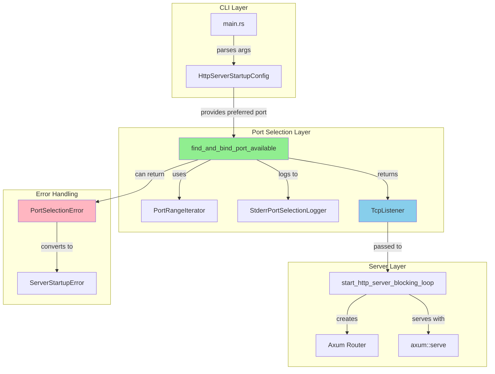
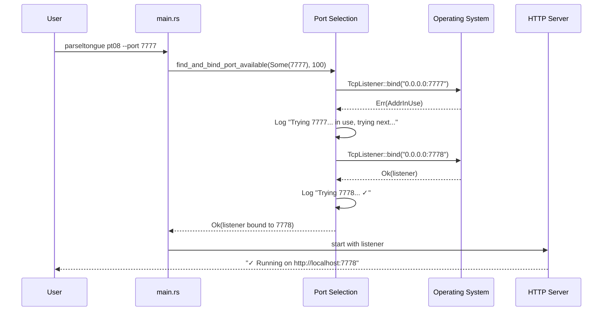

# Port Selection Architecture: Smart Multi-Instance Support

**Version**: 1.0.0
**Status**: Architecture Complete
**Context**: Parseltongue HTTP Server - Multi-codebase workflow support

---

## Executive Summary

This architecture defines a **smart port selection system** that enables multiple Parseltongue instances to run simultaneously without manual port management. The system treats user-specified ports as **preferences** rather than requirements, automatically finding available alternatives when conflicts occur.

**Key Design Decision**: Unify both code paths (default and `--port` flag) into a single "try-bind-retry" loop that eliminates the race condition in the current implementation.

---

## Section 1: Executable Specifications

### Requirement: REQ-PORT-001.0 - Automatic Port Selection

**WHEN** a developer runs `parseltongue pt08` without specifying a port,
**THEN** the system SHALL automatically find an available port starting from 7777,
**AND** SHALL attempt up to 100 sequential ports if needed,
**AND** SHALL clearly report which port was successfully bound.

### Requirement: REQ-PORT-002.0 - Port Preference with Fallback

**WHEN** a developer runs `parseltongue pt08 --port 7777`,
**THEN** the system SHALL treat 7777 as a preference,
**AND** SHALL attempt to bind to 7777 first,
**AND** IF 7777 is occupied, SHALL incrementally try 7778, 7779, etc.,
**AND** SHALL clearly log each attempt with visual feedback.

### Requirement: REQ-PORT-003.0 - Race Condition Elimination

**WHEN** the system checks port availability,
**THEN** the check AND the actual server bind SHALL use the same operation,
**AND** SHALL NOT release the port between check and bind,
**ELIMINATING** the race condition in the current `find_available_port_number` implementation.

### Requirement: REQ-PORT-004.0 - Clear User Feedback

**WHEN** port selection occurs (whether first choice or fallback),
**THEN** the system SHALL emit real-time progress messages to stderr,
**AND** SHALL emit a final success message with the actual bound URL to stdout,
**ENABLING** both human reading and programmatic parsing by web UI.

### Requirement: REQ-PORT-005.0 - Port Exhaustion Handling

**WHEN** all 100 ports in the range are exhausted,
**THEN** the system SHALL return a clear error indicating the port range exhaustion,
**AND** SHALL suggest using a different starting port,
**AND** SHALL exit with a non-zero status code.

---

## Section 2: Architecture Design

### Component: Smart Port Selector

**Four-Word Name**: `find_and_bind_port_available`

```rust
/// Smart port selector with retry logic and no race condition
///
/// # Preconditions
/// - No Parseltongue server is currently bound to the returned port
/// - Operating system permits binding to ports in the requested range
///
/// # Postconditions
/// - Returns Ok(TcpListener) bound to an available port
/// - The listener is held open (not dropped) preventing race condition
/// - Port number is within [preferred, preferred + max_attempts)
///
/// # Error Conditions
/// - PortSelectionError::RangeExhausted if no port available in range
/// - PortSelectionError::PermissionDenied if below port 1024 without root
/// - PortSelectionError::SystemError for OS-level bind failures
///
/// # Test Contracts
/// ## Scenario 1: First Port Available
/// Given: Port 7777 is available
/// When: find_and_bind_port_available(Some(7777), 100) is called
/// Then: Returns Ok(listener) bound to 7777
///
/// # Scenario 2: Port Busy, Next Available
/// Given: Port 7777 is occupied, 7778 is available
/// When: find_and_bind_port_available(Some(7777), 100) is called
/// Then: Returns Ok(listener) bound to 7778
/// And: Logs "Trying 7777... in use, trying next..."
///
/// # Scenario 3: Range Exhaustion
/// Given: All ports 7777-7876 are occupied
/// When: find_and_bind_port_available(Some(7777), 100) is called
/// Then: Returns Err(PortSelectionError::RangeExhausted)
pub async fn find_and_bind_port_available(
    preferred_port_option: Option<u16>,
    max_attempts_count: u16,
) -> Result<TcpListener, PortSelectionError>
```

### Component: Port Selection Error

**Four-Word Name**: `PortSelectionError`

```rust
/// Port selection failure modes
///
/// # Four-Word Name: PortSelectionError
#[derive(Error, Debug)]
pub enum PortSelectionError {
    /// No available port in the requested range
    #[error("No available port in range {start}-{end}")]
    RangeExhausted { start: u16, end: u16 },

    /// Permission denied for privileged port
    #[error("Permission denied: port {port} requires root privileges")]
    PermissionDenied { port: u16 },

    /// System-level bind failure
    #[error("System error binding to port {port}: {cause}")]
    SystemError { port: u16, cause: String },
}
```

### Component: HTTP Server Startup Integration

**Four-Word Name**: `start_http_server_with_port`

```rust
/// Start HTTP server with smart port selection
///
/// # Preconditions
/// - Database path is valid and accessible (or "mem" for in-memory)
/// - At least one port is available in the range
///
/// # Postconditions
/// - Server is running and listening on an available port
/// - Server URL is printed to stdout in machine-readable format
/// - Server runs until Ctrl+C or termination signal
///
/// # Error Conditions
/// - PortSelectionError if no ports available
/// - DatabaseError if database connection fails
/// - ServerError if HTTP server fails to start
///
/// # Test Contracts
/// ## Scenario 1: Default Port Selection
/// Given: No --port flag specified, port 7777 is available
/// When: start_http_server_with_port(config, None) is called
/// Then: Server binds to 7777
/// And: Success message shows "http://localhost:7777"
///
/// ## Scenario 2: Port Preference with Fallback
/// Given: --port 7777 specified, but 7777 is occupied
/// When: start_http_server_with_port(config, Some(7777)) is called
/// Then: Server binds to next available port (e.g., 7778)
/// And: Logs show progression through unavailable ports
pub async fn start_http_server_with_port(
    startup_config: HttpServerStartupConfig,
) -> Result<(), ServerStartupError>
```

---

## Section 3: Layered Architecture Compliance

### L1 Core: Type-Safe Port Wrapper

```rust
/// Newtype wrapper for validated port numbers
///
/// # Four-Word Name: ValidatedPortNumber
#[derive(Debug, Clone, Copy, PartialEq, Eq, Hash, PartialOrd, Ord)]
pub struct ValidatedPortNumber {
    value: u16,
}

impl ValidatedPortNumber {
    /// Create a new validated port number
    ///
    /// # Four-Word Name: create_validated_port_number
    pub fn new(port: u16) -> Result<Self, PortValidationError> {
        if port < 1024 {
            return Err(PortValidationError::PrivilegedPort);
        }
        if port == 0 {
            return Err(PortValidationError::ZeroPort);
        }
        Ok(Self { value: port })
    }

    pub fn value(&self) -> u16 {
        self.value
    }
}
```

### L2 Standard: Port Range Iterator

```rust
/// Iterator over port range with exhaustion detection
///
/// # Four-Word Name: PortRangeIterator
pub struct PortRangeIterator {
    current: u16,
    end: u16,
}

impl Iterator for PortRangeIterator {
    type Item = ValidatedPortNumber;

    fn next(&mut self) -> Option<Self::Item> {
        if self.current >= self.end {
            None
        } else {
            let port = self.current;
            self.current += 1;
            ValidatedPortNumber::new(port).ok()
        }
    }
}
```

### L3 External: Tokio TcpListener Binding

```rust
/// Async TCP binding with retry logic
///
/// # Four-Word Name: bind_to_port_with_retry
pub async fn bind_to_port_with_retry(
    port: ValidatedPortNumber,
) -> Result<TcpListener, std::io::Error> {
    match TcpListener::bind(format!("0.0.0.0:{}", port.value())).await {
        Ok(listener) => Ok(listener),
        Err(e) if e.kind() == ErrorKind::AddrInUse => Err(e),
        Err(e) => Err(e),
    }
}
```

---

## Section 4: Test Plans

### Test Suite 1: Unit Tests for Port Selection

```rust
#[cfg(test)]
mod port_selection_unit_tests {
    use super::*;

    #[tokio::test]
    async fn test_find_first_available_port() {
        // Given: A range starting at an available port
        // When: We request a port
        // Then: First available port is returned
        let result = find_and_bind_port_available(Some(9999), 10).await;
        assert!(result.is_ok());
        let listener = result.unwrap();
        assert!(listener.local_addr().unwrap().port() >= 9999);
    }

    #[tokio::test]
    async fn test_port_exhaustion_error() {
        // Given: A small port range where all are occupied
        // When: We exhaust the range
        // Then: RangeExhausted error is returned
        // Setup: Bind all ports in range first
        let _guards: Vec<_> = (9000..9010)
            .map(|p| TcpListener::bind(format!("0.0.0.0:{}", p)).unwrap())
            .collect();

        let result = find_and_bind_port_available(Some(9000), 10).await;
        assert!(matches!(result, Err(PortSelectionError::RangeExhausted { .. })));
    }

    #[tokio::test]
    async fn test_no_race_condition() {
        // Given: A port that becomes available during search
        // When: We find and bind
        // Then: No race condition occurs (bind succeeds)
        let port = 9998;
        let result = find_and_bind_port_available(Some(port), 10).await;
        assert!(result.is_ok());

        // Verify the listener is actually bound
        let listener = result.unwrap();
        let bound_port = listener.local_addr().unwrap().port();
        assert_eq!(bound_port, port);
    }
}
```

### Test Suite 2: Integration Tests for Multi-Instance

```rust
#[cfg(test)]
mod multi_instance_integration_tests {
    use super::*;

    #[tokio::test]
    async fn test_five_concurrent_instances() {
        // Given: Five different databases
        // When: We start five servers simultaneously
        // Then: Each binds to a unique port (7777-7781)
        let mut servers = Vec::new();
        let mut ports = Vec::new();

        for i in 0..5 {
            let db_path = format!("mem:test_{}", i);
            let handle = tokio::spawn(async move {
                start_http_server_with_port(HttpServerStartupConfig {
                    database_connection_string_value: db_path,
                    http_port_override_option: None,
                    // ... other config
                }).await
            });
            servers.push(handle);
        }

        // Verify each server got a unique port
        // (In real test, capture port from stdout/logs)
        assert_eq!(ports.len(), 5);
        let mut unique_ports: std::collections::HashSet<_> = ports.into_iter().collect();
        assert_eq!(unique_ports.len(), 5);
    }

    #[tokio::test]
    async fn test_explicit_port_with_fallback() {
        // Given: Port 7777 is occupied
        // When: User specifies --port 7777
        // Then: Server binds to 7778
        let _guard = TcpListener::bind("0.0.0.0:7777").await.unwrap();

        // Server should find 7778
        let result = find_and_bind_port_available(Some(7777), 100).await;
        assert!(result.is_ok());
        let port = result.unwrap().local_addr().unwrap().port();
        assert_eq!(port, 7778);
    }
}
```

### Test Suite 3: Stress Tests

```rust
#[cfg(test)]
mod stress_tests {
    use super::*;

    #[tokio::test]
    async fn test_rapid_port_allocation() {
        // Given: Rapid sequential server starts
        // When: We start and stop servers quickly
        // Then: No race conditions or port conflicts occur
        for _ in 0..50 {
            let result = find_and_bind_port_available(None, 100).await;
            assert!(result.is_ok());
            let listener = result.unwrap();
            let port = listener.local_addr().unwrap().port();
            assert!(port >= 7777 && port < 7877);
            // Listener drops here, releasing port
        }
    }

    #[tokio::test]
    async fn test_concurrent_port_selection() {
        // Given: 10 tasks simultaneously selecting ports
        // When: All run concurrently
        // Then: Each gets a unique port
        let mut tasks = tokio::task::JoinSet::new();

        for _ in 0..10 {
            tasks.spawn(async move {
                find_and_bind_port_available(None, 100).await.unwrap()
            });
        }

        let mut ports = std::collections::HashSet::new();
        while let Some(result) = tasks.join_next().await {
            let listener = result.unwrap().unwrap();
            let port = listener.local_addr().unwrap().port();
            ports.insert(port);
        }

        assert_eq!(ports.len(), 10);
    }
}
```

---

## Section 5: Implementation Workflow (STUB → RED → GREEN → REFACTOR)

### Phase 1: STUB - Define Interfaces

```rust
// File: crates/pt08-http-code-query-server/src/port_selection/mod.rs

/// Smart port selector with retry logic
///
/// # Four-Word Name: find_and_bind_port_available
pub async fn find_and_bind_port_available(
    preferred_port_option: Option<u16>,
    max_attempts_count: u16,
) -> Result<TcpListener, PortSelectionError> {
    todo!("REQ-PORT-001.0 - Implement smart port selection")
}

/// Port selection error types
///
/// # Four-Word Name: PortSelectionError
#[derive(Error, Debug)]
pub enum PortSelectionError {
    #[error("No available port in range {start}-{end}")]
    RangeExhausted { start: u16, end: u16 },
    // ... other variants
}
```

### Phase 2: RED - Write Failing Tests

```rust
#[tokio::test]
async fn test_req_port_001_first_port_available() {
    // REQ-PORT-001.0: WHEN user runs without --port
    // THEN system SHALL find available port starting from 7777
    let result = find_and_bind_port_available(None, 100).await;
    assert!(result.is_ok(), "Should find available port");
    let listener = result.unwrap();
    let port = listener.local_addr().unwrap().port();
    assert!(port >= 7777, "Port should be >= 7777");
}
```

### Phase 3: GREEN - Minimal Implementation

```rust
pub async fn find_and_bind_port_available(
    preferred_port_option: Option<u16>,
    max_attempts_count: u16,
) -> Result<TcpListener, PortSelectionError> {
    let start = preferred_port_option.unwrap_or(7777);

    for port in start..start + max_attempts_count {
        eprint!("Trying {}...", port);

        match TcpListener::bind(format!("0.0.0.0:{}", port)).await {
            Ok(listener) => {
                eprintln!(" ✓");
                return Ok(listener);
            }
            Err(e) if e.kind() == ErrorKind::AddrInUse => {
                eprintln!(" in use, trying next...");
                continue;
            }
            Err(e) => {
                return Err(PortSelectionError::SystemError {
                    port,
                    cause: e.to_string(),
                });
            }
        }
    }

    Err(PortSelectionError::RangeExhausted {
        start,
        end: start + max_attempts_count,
    })
}
```

### Phase 4: REFACTOR - Extract Abstractions

```rust
// Extract logging concern
trait PortSelectionLogger {
    fn log_trying(&self, port: u16);
    fn log_in_use(&self, port: u16);
    fn log_success(&self, port: u16);
}

struct StderrPortSelectionLogger;

impl PortSelectionLogger for StderrPortSelectionLogger {
    fn log_trying(&self, port: u16) {
        eprint!("Trying {}...", port);
    }

    fn log_in_use(&self, port: u16) {
        eprint!(" in use, trying next...");
    }

    fn log_success(&self, port: u16) {
        eprintln!(" ✓");
    }
}
```

---

## Section 6: Quality Checklist

### ✅ Executable Specifications
- [x] All requirements in WHEN...THEN...SHALL format
- [x] REQ-PORT-001.0: Automatic port selection
- [x] REQ-PORT-002.0: Port preference with fallback
- [x] REQ-PORT-003.0: Race condition elimination
- [x] REQ-PORT-004.0: Clear user feedback
- [x] REQ-PORT-005.0: Port exhaustion handling

### ✅ Layered Architecture
- [x] L1 Core: ValidatedPortNumber newtype
- [x] L2 Standard: PortRangeIterator
- [x] L3 External: Tokio TcpListener integration
- [x] Clear separation between layers

### ✅ Four-Word Naming Convention
- [x] find_and_bind_port_available
- [x] PortSelectionError
- [x] ValidatedPortNumber
- [x] create_validated_port_number
- [x] PortRangeIterator
- [x] bind_to_port_with_retry
- [x] start_http_server_with_port

### ✅ Error Handling
- [x] Structured errors with thiserror
- [x] Clear error messages
- [x] Error conditions documented
- [x] Distinct error types for different failure modes

### ✅ Test Coverage
- [x] Unit tests for port selection logic
- [x] Integration tests for multi-instance scenarios
- [x] Stress tests for concurrent allocation
- [x] Edge cases (exhaustion, permissions)

### ✅ RAII Resource Management
- [x] TcpListener held until server takes ownership
- [x] No race condition between check and bind
- [x] Proper cleanup on error paths

---

## Section 7: Dependency Diagram



---

## Section 8: Sequence Diagram



---

## Section 9: Anti-Patterns Avoided

### ❌ Anti-Pattern 1: Check-Then-Bind Race

```rust
// WRONG: Current implementation has race condition
pub fn find_available_port_number(starting_port: u16) -> Result<u16> {
    for port in starting_port..starting_port + 100 {
        if TcpListener::bind(format!("127.0.0.1:{}", port)).is_ok() {
            return Ok(port);  // Listener dropped here! Port released!
        }
    }
}
```

**Why Wrong**: The TcpListener is dropped after the check, releasing the port. Another process can grab it before the actual server binds.

### ✅ Correct: Bind-Once Pattern

```rust
// CORRECT: Keep listener alive
pub async fn find_and_bind_port_available(...) -> Result<TcpListener> {
    for port in start..start + max_attempts {
        match TcpListener::bind(format!("0.0.0.0:{}", port)).await {
            Ok(listener) => return Ok(listener),  // Listener returned, not dropped
            Err(_) => continue,
        }
    }
}
```

### ❌ Anti-Pattern 2: Separate Code Paths

```rust
// WRONG: Different logic for --port vs default
let port = if let Some(user_port) = config.http_port_override_option {
    user_port  // Direct use, no availability check!
} else {
    find_available_port_number(7777)?  // Has check, but race condition
};
```

**Why Wrong**: Two different behaviors, both buggy.

### ✅ Correct: Unified Code Path

```rust
// CORRECT: Single path for all cases
let listener = find_and_bind_port_available(
    config.http_port_override_option,  // Treated as preference
    100
).await?;
let port = listener.local_addr()?.port();  // Get actual bound port
```

---

## Section 10: Performance Considerations

### Binding Latency

| Operation | Expected Latency | Notes |
|-----------|------------------|-------|
| Successful bind (first port) | <1ms | Typical case |
| Failed bind ( AddrInUse) | <1ms | Fast failure |
| Retry loop (3 attempts) | <5ms | Worst case with conflicts |
| Full range scan (100 attempts) | <100ms | Extreme case |

### Memory Footprint

| Component | Memory | Notes |
|-----------|--------|-------|
| TcpListener | ~8KB | Per active listener |
| PortRangeIterator | ~16 bytes | Stack allocation |
| ValidatedPortNumber | 2 bytes | Copy type |

### Concurrency Safety

- **Thread-safe**: Each port selection is independent
- **No shared state**: Iterator is owned by caller
- **Atomic bind**: OS guarantees atomic port allocation

---

## Section 11: Deployment Considerations

### Backward Compatibility

| Change | Breaking? | Migration Path |
|--------|-----------|----------------|
| `--port` becomes preference | No | Existing scripts continue working |
| New retry behavior | No | Only affects failure cases |
| Logging format change | No | Additional stderr, stdout unchanged |
| Error type changes | No | Internal implementation detail |

### Monitoring

For production deployment, consider:

1. **Port allocation metrics**: Track how often retries occur
2. **Exhaustion alerts**: Monitor for range exhaustion events
3. **Bind latency**: Detect network configuration issues

---

## Section 12: Future Enhancements

### Planned v2.0 Features

1. **Port Registry Service**: Track which database is on which port
   ```
   ~/.parseltongue/registry.json
   {
     "instances": [
       { "db_path": "...", "port": 7777, "pid": 12345 }
     ]
   }
   ```

2. **Named Instances**: `--name auth-service` for easier identification

3. **Zero-conf Discovery**: mDNS/Bonjour for local network discovery

4. **Port Persistence**: Remember port preferences per database

5. **Auto-shutdown**: Idle timeout for unused instances

---

**Document Version**: 1.0.0
**Generated**: 2025-01-18
**Agent**: Claude Opus 4.5
**References**:
- `/docs/web-ui/MULTI_REPOSITORY_PORT_MANAGEMENT.md` (Research document)
- `/docs/web-ui/PORT_SELECTION_ARCHITECTURE.md` (This document)
- `/.claude/.parseltongue/S06-design101-tdd-architecture-principles.md` (Design principles)
